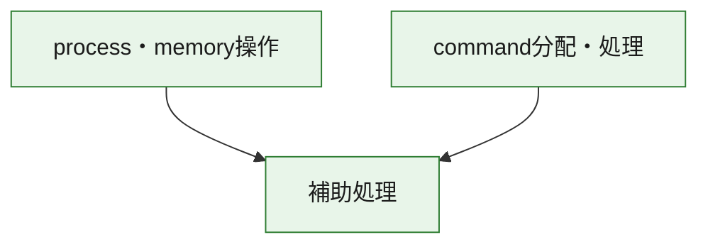
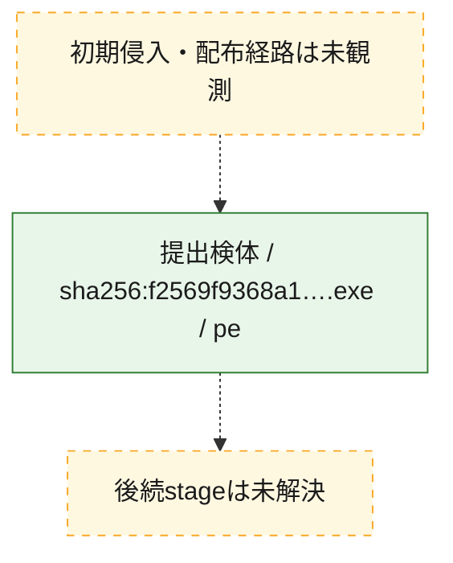
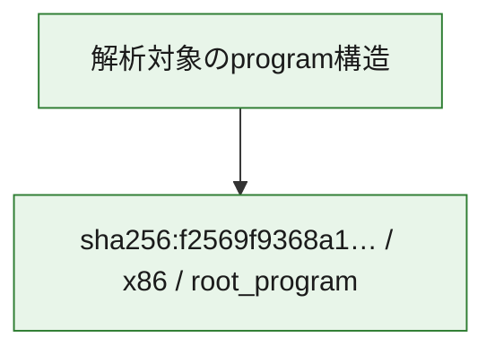

# 全体ロジック：f2569f9368a1c6a7a3a11e94931ec3be9846ea9e5c98958d29e975f9b56a8467

代表関数の静的証跡から、process・memory操作、command分配・処理の処理群を確認しました。

## 読み方

- phaseの掲載順は解析上の整理順です。observed_call_edgesがない段階間の実行順を断定しません。
- 図の実線は静的に観測した関係、点線と黄色のノードは未観測・未解決の関係を示します。
- 図は静的な要約であり、動的実行を再現するものではありません。
- 詳細な関数解説とfingerprintは[STATIC-LOGIC.md](STATIC-LOGIC.md)を参照してください。

## 静的可視化

### 実行フロー

### 感染チェーン

### モジュール関係

## 処理段階

### 1. process・memory操作

process、thread、module、memory操作と実行移行を確認します。
確度: `confirmed_static_function_evidence`

- `f2569f9368a1c6a7a3a11e94931ec3be9846ea9e5c98958d29e975f9b56a8467:ghidra:14000c620` — process、thread、module、またはmemory操作に関係する関数です。 状態: `succeeded`、選定理由: `context_representative`, `reviewed_call_centrality:13`, `role:process_or_memory_operation`
- `f2569f9368a1c6a7a3a11e94931ec3be9846ea9e5c98958d29e975f9b56a8467:ghidra:14000c685` — process、thread、module、またはmemory操作に関係する関数です。 状態: `succeeded`、選定理由: `context_representative`, `reviewed_call_centrality:9`, `role:process_or_memory_operation`

### 2. command分配・処理

受信commandやtaskの解釈、分配、個別handlerへの移行を確認します。
確度: `confirmed_static_function_evidence`

- `f2569f9368a1c6a7a3a11e94931ec3be9846ea9e5c98958d29e975f9b56a8467:ghidra:14000d1aa` — commandの解釈、分配、または個別処理を担当する関数です。 状態: `succeeded`、選定理由: `meaningful_symbol_name`, `reviewed_call_centrality:2`, `role:command_dispatch_or_handler`

### 3. 補助処理

主要処理を支える一般内部関数またはlibrary処理を確認します。
確度: `confirmed_static_function_evidence_with_limits`

- `f2569f9368a1c6a7a3a11e94931ec3be9846ea9e5c98958d29e975f9b56a8467:ghidra:140001000` — 検体内部の一般処理を実装する関数です。 状態: `failed_empty`、選定理由: `context_representative`
- `f2569f9368a1c6a7a3a11e94931ec3be9846ea9e5c98958d29e975f9b56a8467:ghidra:140001017` — 検体内部の一般処理を実装する関数です。 状態: `succeeded`、選定理由: `context_representative`, `reviewed_call_centrality:1`
- `f2569f9368a1c6a7a3a11e94931ec3be9846ea9e5c98958d29e975f9b56a8467:ghidra:140001030` — 検体内部の一般処理を実装する関数です。 状態: `succeeded`、選定理由: `entry_point`, `meaningful_symbol_name`, `reviewed_call_centrality:1`
- `f2569f9368a1c6a7a3a11e94931ec3be9846ea9e5c98958d29e975f9b56a8467:ghidra:14000105f` — 検体内部の一般処理を実装する関数です。 状態: `succeeded`、選定理由: `meaningful_symbol_name`, `reviewed_call_centrality:1`
- `f2569f9368a1c6a7a3a11e94931ec3be9846ea9e5c98958d29e975f9b56a8467:ghidra:14000108e` — 検体内部の一般処理を実装する関数です。 状態: `succeeded`、選定理由: `context_representative`, `reviewed_call_centrality:33`
- `f2569f9368a1c6a7a3a11e94931ec3be9846ea9e5c98958d29e975f9b56a8467:ghidra:1400013ec` — 検体内部の一般処理を実装する関数です。 状態: `succeeded`、選定理由: `context_representative`, `reviewed_call_centrality:2`
- `f2569f9368a1c6a7a3a11e94931ec3be9846ea9e5c98958d29e975f9b56a8467:ghidra:1400014f0` — 検体内部の一般処理を実装する関数です。 状態: `succeeded`、選定理由: `context_representative`, `reviewed_call_centrality:4`
- `f2569f9368a1c6a7a3a11e94931ec3be9846ea9e5c98958d29e975f9b56a8467:ghidra:140001632` — 検体内部の一般処理を実装する関数です。 状態: `succeeded`、選定理由: `meaningful_symbol_name`, `reviewed_call_centrality:2`
- `f2569f9368a1c6a7a3a11e94931ec3be9846ea9e5c98958d29e975f9b56a8467:ghidra:140001650` — 検体内部の一般処理を実装する関数です。 状態: `succeeded`、選定理由: `meaningful_symbol_name`, `reviewed_call_centrality:1`
- `f2569f9368a1c6a7a3a11e94931ec3be9846ea9e5c98958d29e975f9b56a8467:ghidra:140001660` — 検体内部の一般処理を実装する関数です。 状態: `succeeded`、選定理由: `meaningful_symbol_name`, `reviewed_call_centrality:1`
- `f2569f9368a1c6a7a3a11e94931ec3be9846ea9e5c98958d29e975f9b56a8467:ghidra:14000c3e0` — compiler生成処理または汎用library処理とみられる関数です。 状態: `succeeded`、選定理由: `entry_point`, `meaningful_symbol_name`, `reviewed_call_centrality:2`
- `f2569f9368a1c6a7a3a11e94931ec3be9846ea9e5c98958d29e975f9b56a8467:ghidra:14000c499` — compiler生成処理または汎用library処理とみられる関数です。 状態: `succeeded`、選定理由: `entry_point`, `meaningful_symbol_name`, `reviewed_call_centrality:1`
- `f2569f9368a1c6a7a3a11e94931ec3be9846ea9e5c98958d29e975f9b56a8467:ghidra:14000c4e0` — 検体内部の一般処理を実装する関数です。 状態: `succeeded`、選定理由: `meaningful_symbol_name`, `reviewed_call_centrality:2`
- `f2569f9368a1c6a7a3a11e94931ec3be9846ea9e5c98958d29e975f9b56a8467:ghidra:14000c610` — 検体内部の一般処理を実装する関数です。 状態: `succeeded`、選定理由: `meaningful_symbol_name`, `reviewed_call_centrality:1`
- `f2569f9368a1c6a7a3a11e94931ec3be9846ea9e5c98958d29e975f9b56a8467:ghidra:14000ce00` — 検体内部の一般処理を実装する関数です。 状態: `succeeded`、選定理由: `meaningful_symbol_name`, `reviewed_call_centrality:5`
- `f2569f9368a1c6a7a3a11e94931ec3be9846ea9e5c98958d29e975f9b56a8467:ghidra:14000d710` — 検体内部の一般処理を実装する関数です。 状態: `succeeded`、選定理由: `meaningful_symbol_name`, `reviewed_call_centrality:2`
- `f2569f9368a1c6a7a3a11e94931ec3be9846ea9e5c98958d29e975f9b56a8467:ghidra:14000d720` — 検体内部の一般処理を実装する関数です。 状態: `succeeded`、選定理由: `meaningful_symbol_name`, `reviewed_call_centrality:4`
- `f2569f9368a1c6a7a3a11e94931ec3be9846ea9e5c98958d29e975f9b56a8467:ghidra:14000d79c` — 検体内部の一般処理を実装する関数です。 状態: `succeeded`、選定理由: `meaningful_symbol_name`, `reviewed_call_centrality:1`
- `f2569f9368a1c6a7a3a11e94931ec3be9846ea9e5c98958d29e975f9b56a8467:ghidra:14000d835` — 検体内部の一般処理を実装する関数です。 状態: `succeeded`、選定理由: `meaningful_symbol_name`, `reviewed_call_centrality:3`
- `f2569f9368a1c6a7a3a11e94931ec3be9846ea9e5c98958d29e975f9b56a8467:ghidra:14000d99b` — 検体内部の一般処理を実装する関数です。 状態: `succeeded`、選定理由: `meaningful_symbol_name`, `reviewed_call_centrality:1`
- `f2569f9368a1c6a7a3a11e94931ec3be9846ea9e5c98958d29e975f9b56a8467:ghidra:14000da47` — 検体内部の一般処理を実装する関数です。 状態: `succeeded`、選定理由: `meaningful_symbol_name`, `reviewed_call_centrality:3`
- `f2569f9368a1c6a7a3a11e94931ec3be9846ea9e5c98958d29e975f9b56a8467:ghidra:14000da7b` — 検体内部の一般処理を実装する関数です。 状態: `succeeded`、選定理由: `meaningful_symbol_name`, `reviewed_call_centrality:2`
- `f2569f9368a1c6a7a3a11e94931ec3be9846ea9e5c98958d29e975f9b56a8467:ghidra:14000dc10` — 検体内部の一般処理を実装する関数です。 状態: `succeeded`、選定理由: `meaningful_symbol_name`, `reviewed_call_centrality:3`
- `f2569f9368a1c6a7a3a11e94931ec3be9846ea9e5c98958d29e975f9b56a8467:ghidra:14000dc60` — 検体内部の一般処理を実装する関数です。 状態: `succeeded`、選定理由: `meaningful_symbol_name`, `reviewed_call_centrality:5`
- `f2569f9368a1c6a7a3a11e94931ec3be9846ea9e5c98958d29e975f9b56a8467:ghidra:14000dcc0` — 検体内部の一般処理を実装する関数です。 状態: `succeeded`、選定理由: `meaningful_symbol_name`, `reviewed_call_centrality:2`
- `f2569f9368a1c6a7a3a11e94931ec3be9846ea9e5c98958d29e975f9b56a8467:ghidra:14000dd20` — 検体内部の一般処理を実装する関数です。 状態: `succeeded`、選定理由: `meaningful_symbol_name`, `reviewed_call_centrality:2`
- `f2569f9368a1c6a7a3a11e94931ec3be9846ea9e5c98958d29e975f9b56a8467:ghidra:14000dd90` — 検体内部の一般処理を実装する関数です。 状態: `succeeded`、選定理由: `meaningful_symbol_name`, `reviewed_call_centrality:2`
- `f2569f9368a1c6a7a3a11e94931ec3be9846ea9e5c98958d29e975f9b56a8467:ghidra:14000de20` — 検体内部の一般処理を実装する関数です。 状態: `succeeded`、選定理由: `meaningful_symbol_name`, `reviewed_call_centrality:10`
- `f2569f9368a1c6a7a3a11e94931ec3be9846ea9e5c98958d29e975f9b56a8467:ghidra:14000e030` — 検体内部の一般処理を実装する関数です。 状態: `failed_empty`、選定理由: `meaningful_symbol_name`

## 観測したcall関係

- `f2569f9368a1c6a7a3a11e94931ec3be9846ea9e5c98958d29e975f9b56a8467:ghidra:140001030` → `f2569f9368a1c6a7a3a11e94931ec3be9846ea9e5c98958d29e975f9b56a8467:ghidra:14000108e` （`support` → `support`）
- `f2569f9368a1c6a7a3a11e94931ec3be9846ea9e5c98958d29e975f9b56a8467:ghidra:14000105f` → `f2569f9368a1c6a7a3a11e94931ec3be9846ea9e5c98958d29e975f9b56a8467:ghidra:14000108e` （`support` → `support`）
- `f2569f9368a1c6a7a3a11e94931ec3be9846ea9e5c98958d29e975f9b56a8467:ghidra:14000108e` → `f2569f9368a1c6a7a3a11e94931ec3be9846ea9e5c98958d29e975f9b56a8467:ghidra:1400013ec` （`support` → `support`）
- `f2569f9368a1c6a7a3a11e94931ec3be9846ea9e5c98958d29e975f9b56a8467:ghidra:14000108e` → `f2569f9368a1c6a7a3a11e94931ec3be9846ea9e5c98958d29e975f9b56a8467:ghidra:1400014f0` （`support` → `support`）
- `f2569f9368a1c6a7a3a11e94931ec3be9846ea9e5c98958d29e975f9b56a8467:ghidra:14000108e` → `f2569f9368a1c6a7a3a11e94931ec3be9846ea9e5c98958d29e975f9b56a8467:ghidra:140001632` （`support` → `support`）
- `f2569f9368a1c6a7a3a11e94931ec3be9846ea9e5c98958d29e975f9b56a8467:ghidra:14000108e` → `f2569f9368a1c6a7a3a11e94931ec3be9846ea9e5c98958d29e975f9b56a8467:ghidra:14000c3e0` （`support` → `support`）
- `f2569f9368a1c6a7a3a11e94931ec3be9846ea9e5c98958d29e975f9b56a8467:ghidra:14000108e` → `f2569f9368a1c6a7a3a11e94931ec3be9846ea9e5c98958d29e975f9b56a8467:ghidra:14000c610` （`support` → `support`）
- `f2569f9368a1c6a7a3a11e94931ec3be9846ea9e5c98958d29e975f9b56a8467:ghidra:14000108e` → `f2569f9368a1c6a7a3a11e94931ec3be9846ea9e5c98958d29e975f9b56a8467:ghidra:14000ce00` （`support` → `support`）
- `f2569f9368a1c6a7a3a11e94931ec3be9846ea9e5c98958d29e975f9b56a8467:ghidra:14000108e` → `f2569f9368a1c6a7a3a11e94931ec3be9846ea9e5c98958d29e975f9b56a8467:ghidra:14000d710` （`support` → `support`）
- `f2569f9368a1c6a7a3a11e94931ec3be9846ea9e5c98958d29e975f9b56a8467:ghidra:14000108e` → `f2569f9368a1c6a7a3a11e94931ec3be9846ea9e5c98958d29e975f9b56a8467:ghidra:14000de20` （`support` → `support`）
- `f2569f9368a1c6a7a3a11e94931ec3be9846ea9e5c98958d29e975f9b56a8467:ghidra:14000c4e0` → `f2569f9368a1c6a7a3a11e94931ec3be9846ea9e5c98958d29e975f9b56a8467:ghidra:14000dc60` （`support` → `support`）
- `f2569f9368a1c6a7a3a11e94931ec3be9846ea9e5c98958d29e975f9b56a8467:ghidra:14000c620` → `f2569f9368a1c6a7a3a11e94931ec3be9846ea9e5c98958d29e975f9b56a8467:ghidra:14000da47` （`execution` → `support`）
- `f2569f9368a1c6a7a3a11e94931ec3be9846ea9e5c98958d29e975f9b56a8467:ghidra:14000c620` → `f2569f9368a1c6a7a3a11e94931ec3be9846ea9e5c98958d29e975f9b56a8467:ghidra:14000dc10` （`execution` → `support`）
- `f2569f9368a1c6a7a3a11e94931ec3be9846ea9e5c98958d29e975f9b56a8467:ghidra:14000c620` → `f2569f9368a1c6a7a3a11e94931ec3be9846ea9e5c98958d29e975f9b56a8467:ghidra:14000dc60` （`execution` → `support`）
- `f2569f9368a1c6a7a3a11e94931ec3be9846ea9e5c98958d29e975f9b56a8467:ghidra:14000c685` → `f2569f9368a1c6a7a3a11e94931ec3be9846ea9e5c98958d29e975f9b56a8467:ghidra:14000c620` （`execution` → `execution`）
- `f2569f9368a1c6a7a3a11e94931ec3be9846ea9e5c98958d29e975f9b56a8467:ghidra:14000c685` → `f2569f9368a1c6a7a3a11e94931ec3be9846ea9e5c98958d29e975f9b56a8467:ghidra:14000da47` （`execution` → `support`）
- `f2569f9368a1c6a7a3a11e94931ec3be9846ea9e5c98958d29e975f9b56a8467:ghidra:14000d1aa` → `f2569f9368a1c6a7a3a11e94931ec3be9846ea9e5c98958d29e975f9b56a8467:ghidra:14000d710` （`dispatch` → `support`）
- `f2569f9368a1c6a7a3a11e94931ec3be9846ea9e5c98958d29e975f9b56a8467:ghidra:14000d835` → `f2569f9368a1c6a7a3a11e94931ec3be9846ea9e5c98958d29e975f9b56a8467:ghidra:14000d720` （`support` → `support`）
- `f2569f9368a1c6a7a3a11e94931ec3be9846ea9e5c98958d29e975f9b56a8467:ghidra:14000d99b` → `f2569f9368a1c6a7a3a11e94931ec3be9846ea9e5c98958d29e975f9b56a8467:ghidra:14000d720` （`support` → `support`）
- `f2569f9368a1c6a7a3a11e94931ec3be9846ea9e5c98958d29e975f9b56a8467:ghidra:14000da47` → `f2569f9368a1c6a7a3a11e94931ec3be9846ea9e5c98958d29e975f9b56a8467:ghidra:14000d720` （`support` → `support`）
- `f2569f9368a1c6a7a3a11e94931ec3be9846ea9e5c98958d29e975f9b56a8467:ghidra:14000da7b` → `f2569f9368a1c6a7a3a11e94931ec3be9846ea9e5c98958d29e975f9b56a8467:ghidra:14000d720` （`support` → `support`）
- `f2569f9368a1c6a7a3a11e94931ec3be9846ea9e5c98958d29e975f9b56a8467:ghidra:14000da7b` → `f2569f9368a1c6a7a3a11e94931ec3be9846ea9e5c98958d29e975f9b56a8467:ghidra:14000d79c` （`support` → `support`）
- `f2569f9368a1c6a7a3a11e94931ec3be9846ea9e5c98958d29e975f9b56a8467:ghidra:14000de20` → `f2569f9368a1c6a7a3a11e94931ec3be9846ea9e5c98958d29e975f9b56a8467:ghidra:14000dc60` （`support` → `support`）
- `ghidra-function:0cc31a8a63d629c4430c04e4` → `ghidra-external:e520a7ac4f48237d877f5585` （`unclassified` → `unclassified`）
- `ghidra-function:2a548402df69467641773b99` → `ghidra-external:3ee140db82c403a6133324ff` （`unclassified` → `unclassified`）
- `ghidra-function:2a548402df69467641773b99` → `ghidra-external:72be32b2090436b75a951965` （`unclassified` → `unclassified`）
- `ghidra-function:2a548402df69467641773b99` → `ghidra-function:903ace669411c21eb6ff00e3` （`unclassified` → `unclassified`）
- `ghidra-function:51b796be1b4949658e2a027d` → `ghidra-function:73a305c4aa8e8afb49cde0fb` （`unclassified` → `unclassified`）
- `ghidra-function:51b796be1b4949658e2a027d` → `ghidra-function:903ace669411c21eb6ff00e3` （`unclassified` → `unclassified`）
- `ghidra-function:5428fc89d70b2651d56f4bb0` → `ghidra-external:e9c75d32b9cdcc3e91880ee5` （`unclassified` → `unclassified`）
- `ghidra-function:54fa6cee6492aeb9d100866e` → `ghidra-external:714ba76d00f18580cc5ae546` （`unclassified` → `unclassified`）
- `ghidra-function:54fa6cee6492aeb9d100866e` → `ghidra-function:81f868c83ab484394dd43bea` （`unclassified` → `unclassified`）
- `ghidra-function:5f8f404888d0958eabd24cae` → `ghidra-function:0783442f4d1e9655deef6644` （`unclassified` → `unclassified`）
- `ghidra-function:701aee9a6a723fabedbb73d8` → `ghidra-function:c735079b8629cf4961142c73` （`unclassified` → `unclassified`）
- `ghidra-function:8486b1d2bcaa2f18e02e5c80` → `ghidra-external:7b350e3dc717a57e8fe3d9b8` （`unclassified` → `unclassified`）
- `ghidra-function:8486b1d2bcaa2f18e02e5c80` → `ghidra-function:0c47e970fc7af8afa0704289` （`unclassified` → `unclassified`）
- `ghidra-function:85bf9eb35ff63e8f4a5fe8fd` → `ghidra-external:cbdf7fd68ce02d511b24d433` （`unclassified` → `unclassified`）
- `ghidra-function:9c11041aa0e2bcd0c6c4af61` → `ghidra-external:152ab4ab99d515b5f2590c29` （`unclassified` → `unclassified`）
- `ghidra-function:9c11041aa0e2bcd0c6c4af61` → `ghidra-external:2f2f579b57d0447080880bc7` （`unclassified` → `unclassified`）
- `ghidra-function:9c11041aa0e2bcd0c6c4af61` → `ghidra-external:422314d3f3550a5b0555e69e` （`unclassified` → `unclassified`）
- `ghidra-function:9c11041aa0e2bcd0c6c4af61` → `ghidra-external:44992974e69704222f4bf4b9` （`unclassified` → `unclassified`）
- `ghidra-function:9c11041aa0e2bcd0c6c4af61` → `ghidra-external:884073976beaa2b1bbd5edda` （`unclassified` → `unclassified`）
- `ghidra-function:9c11041aa0e2bcd0c6c4af61` → `ghidra-external:8a227a71e9f1ff7cfa3b639f` （`unclassified` → `unclassified`）
- `ghidra-function:9c11041aa0e2bcd0c6c4af61` → `ghidra-external:9ba96a720e2f427aa28744a2` （`unclassified` → `unclassified`）
- `ghidra-function:9c11041aa0e2bcd0c6c4af61` → `ghidra-external:a727557e8fbd1ad1e4853fdb` （`unclassified` → `unclassified`）
- `ghidra-function:9c11041aa0e2bcd0c6c4af61` → `ghidra-function:d53fbee02635703ba3462491` （`unclassified` → `unclassified`）
- `ghidra-function:a28f408066b41bdccac39e0a` → `ghidra-external:72519656aaebc80ffdd11755` （`unclassified` → `unclassified`）
- `ghidra-function:afa60abd152894d0cb46c106` → `ghidra-external:e8da990670cca85b6e60cda3` （`unclassified` → `unclassified`）
- `ghidra-function:afa60abd152894d0cb46c106` → `ghidra-function:6412a0023a4f91a9baddd812` （`unclassified` → `unclassified`）
- `ghidra-function:afa60abd152894d0cb46c106` → `ghidra-function:abd43c9871afb1061ab2e41c` （`unclassified` → `unclassified`）
- `ghidra-function:afa60abd152894d0cb46c106` → `ghidra-function:b7f5029194c609f831dc668a` （`unclassified` → `unclassified`）
- `ghidra-function:bf029f2e64836e550f4eed49` → `ghidra-function:903ace669411c21eb6ff00e3` （`unclassified` → `unclassified`）
- `ghidra-function:c456c4a16a2897d839e6262c` → `ghidra-function:c735079b8629cf4961142c73` （`unclassified` → `unclassified`）
- `ghidra-function:c735079b8629cf4961142c73` → `ghidra-external:07682894c39f6aca81c9141a` （`unclassified` → `unclassified`）
- `ghidra-function:c735079b8629cf4961142c73` → `ghidra-external:2cc5ca721617bd86a62ee60f` （`unclassified` → `unclassified`）
- `ghidra-function:c735079b8629cf4961142c73` → `ghidra-external:422314d3f3550a5b0555e69e` （`unclassified` → `unclassified`）
- `ghidra-function:c735079b8629cf4961142c73` → `ghidra-external:4ec022eae6596d60095c41ec` （`unclassified` → `unclassified`）
- `ghidra-function:c735079b8629cf4961142c73` → `ghidra-external:57a30838177349bdcaa697d0` （`unclassified` → `unclassified`）
- `ghidra-function:c735079b8629cf4961142c73` → `ghidra-external:5851e2b631213645801f163c` （`unclassified` → `unclassified`）
- `ghidra-function:c735079b8629cf4961142c73` → `ghidra-external:65568c12742086694ebaf9ed` （`unclassified` → `unclassified`）
- `ghidra-function:c735079b8629cf4961142c73` → `ghidra-external:67bf2221e5a612f613d639af` （`unclassified` → `unclassified`）
- `ghidra-function:c735079b8629cf4961142c73` → `ghidra-external:6a0e162b1c6064a7c204583a` （`unclassified` → `unclassified`）
- `ghidra-function:c735079b8629cf4961142c73` → `ghidra-external:78471d5baa1bed52e6c13fdf` （`unclassified` → `unclassified`）
- `ghidra-function:c735079b8629cf4961142c73` → `ghidra-external:872ea1b27231b8a805d3bf35` （`unclassified` → `unclassified`）
- `ghidra-function:c735079b8629cf4961142c73` → `ghidra-external:cdf85249672b39e63394ac04` （`unclassified` → `unclassified`）
- `ghidra-function:c735079b8629cf4961142c73` → `ghidra-external:dab52e055727af9c02d3e369` （`unclassified` → `unclassified`）
- `ghidra-function:c735079b8629cf4961142c73` → `ghidra-external:db1cd654e26d61772bb3cbb3` （`unclassified` → `unclassified`）
- `ghidra-function:c735079b8629cf4961142c73` → `ghidra-external:e2c6ebc6a31a026a957d5b8e` （`unclassified` → `unclassified`）
- `ghidra-function:c735079b8629cf4961142c73` → `ghidra-function:125f5cc02204d0df2a008bdc` （`unclassified` → `unclassified`）
- `ghidra-function:c735079b8629cf4961142c73` → `ghidra-function:55b0cd298d19283976073294` （`unclassified` → `unclassified`）
- `ghidra-function:c735079b8629cf4961142c73` → `ghidra-function:6e691dfaa81391bf695d410e` （`unclassified` → `unclassified`）
- `ghidra-function:c735079b8629cf4961142c73` → `ghidra-function:81f868c83ab484394dd43bea` （`unclassified` → `unclassified`）
- `ghidra-function:c735079b8629cf4961142c73` → `ghidra-function:84e56d63f5a70ca726db784f` （`unclassified` → `unclassified`）
- `ghidra-function:c735079b8629cf4961142c73` → `ghidra-function:8d2c9473861ef7fc6afbd865` （`unclassified` → `unclassified`）
- `ghidra-function:c735079b8629cf4961142c73` → `ghidra-function:9c11041aa0e2bcd0c6c4af61` （`unclassified` → `unclassified`）
- `ghidra-function:c735079b8629cf4961142c73` → `ghidra-function:a28f408066b41bdccac39e0a` （`unclassified` → `unclassified`）
- `ghidra-function:c735079b8629cf4961142c73` → `ghidra-function:afa60abd152894d0cb46c106` （`unclassified` → `unclassified`）
- `ghidra-function:c735079b8629cf4961142c73` → `ghidra-function:c26e8f40a7e708702b8fe7a8` （`unclassified` → `unclassified`）
- `ghidra-function:c735079b8629cf4961142c73` → `ghidra-function:c90bbb578abb81bd3103e752` （`unclassified` → `unclassified`）
- `ghidra-function:c735079b8629cf4961142c73` → `ghidra-function:d68479df322e62694650e8a2` （`unclassified` → `unclassified`）
- `ghidra-function:c735079b8629cf4961142c73` → `ghidra-function:e61043ce3f47a6be8a9d4092` （`unclassified` → `unclassified`）
- `ghidra-function:c735079b8629cf4961142c73` → `ghidra-function:eb046a5b32aa4af3e209731f` （`unclassified` → `unclassified`）
- `ghidra-function:c90bbb578abb81bd3103e752` → `ghidra-external:0db389878cba0c6913556029` （`unclassified` → `unclassified`）
- `ghidra-function:ca00b5acce4902db5080a093` → `ghidra-function:903ace669411c21eb6ff00e3` （`unclassified` → `unclassified`）
- `ghidra-function:cd05b412cbfabb0cfd0b2821` → `ghidra-external:422314d3f3550a5b0555e69e` （`unclassified` → `unclassified`）
- `ghidra-function:cd05b412cbfabb0cfd0b2821` → `ghidra-external:4ec022eae6596d60095c41ec` （`unclassified` → `unclassified`）
- `ghidra-function:cd05b412cbfabb0cfd0b2821` → `ghidra-function:117c86e4d236627b838e3c22` （`unclassified` → `unclassified`）
- `ghidra-function:cd05b412cbfabb0cfd0b2821` → `ghidra-function:17c81797a924d0fbdfa14b1e` （`unclassified` → `unclassified`）
- `ghidra-function:cd05b412cbfabb0cfd0b2821` → `ghidra-function:73ff56b2bacb958de8a7e0d9` （`unclassified` → `unclassified`）
- `ghidra-function:cd05b412cbfabb0cfd0b2821` → `ghidra-function:8486b1d2bcaa2f18e02e5c80` （`unclassified` → `unclassified`）
- `ghidra-function:cd05b412cbfabb0cfd0b2821` → `ghidra-function:993109b98cc6a19fe13b1d54` （`unclassified` → `unclassified`）
- `ghidra-function:cd05b412cbfabb0cfd0b2821` → `ghidra-function:bf029f2e64836e550f4eed49` （`unclassified` → `unclassified`）
- `ghidra-function:cd05b412cbfabb0cfd0b2821` → `ghidra-function:d53fbee02635703ba3462491` （`unclassified` → `unclassified`）
- `ghidra-function:d53fbee02635703ba3462491` → `ghidra-external:7b350e3dc717a57e8fe3d9b8` （`unclassified` → `unclassified`）
- `ghidra-function:d53fbee02635703ba3462491` → `ghidra-function:0c47e970fc7af8afa0704289` （`unclassified` → `unclassified`）
- `ghidra-function:d68479df322e62694650e8a2` → `ghidra-function:0783442f4d1e9655deef6644` （`unclassified` → `unclassified`）
- `ghidra-function:da682e465e1a78d6d2a26bf5` → `ghidra-external:3cb2a7692a505b9799011300` （`unclassified` → `unclassified`）
- `ghidra-function:da682e465e1a78d6d2a26bf5` → `ghidra-function:0c47e970fc7af8afa0704289` （`unclassified` → `unclassified`）
- `ghidra-function:e463e0597a82fb0f7a7bbfc4` → `ghidra-external:e04a2706765ed8e47ad805c5` （`unclassified` → `unclassified`）
- `ghidra-function:e463e0597a82fb0f7a7bbfc4` → `ghidra-function:0c47e970fc7af8afa0704289` （`unclassified` → `unclassified`）
- `ghidra-function:e61043ce3f47a6be8a9d4092` → `ghidra-external:c3bb48a3ebd6c46e61a4dd04` （`unclassified` → `unclassified`）
- `ghidra-function:e61043ce3f47a6be8a9d4092` → `ghidra-external:ce8db41524af6b6030ce0c01` （`unclassified` → `unclassified`）
- `ghidra-function:e61043ce3f47a6be8a9d4092` → `ghidra-external:f5ae9bb2a2cde1ef4591a231` （`unclassified` → `unclassified`）
- `ghidra-function:f3fa16768bd0d028973d029a` → `ghidra-external:3cb2a7692a505b9799011300` （`unclassified` → `unclassified`）
- `ghidra-function:f3fa16768bd0d028973d029a` → `ghidra-function:0c47e970fc7af8afa0704289` （`unclassified` → `unclassified`）
- `ghidra-function:f53f0d6d90fcd59a4b32dacc` → `ghidra-function:117c86e4d236627b838e3c22` （`unclassified` → `unclassified`）
- `ghidra-function:f53f0d6d90fcd59a4b32dacc` → `ghidra-function:17c81797a924d0fbdfa14b1e` （`unclassified` → `unclassified`）
- `ghidra-function:f53f0d6d90fcd59a4b32dacc` → `ghidra-function:73ff56b2bacb958de8a7e0d9` （`unclassified` → `unclassified`）
- `ghidra-function:f53f0d6d90fcd59a4b32dacc` → `ghidra-function:993109b98cc6a19fe13b1d54` （`unclassified` → `unclassified`）
- `ghidra-function:f53f0d6d90fcd59a4b32dacc` → `ghidra-function:bf029f2e64836e550f4eed49` （`unclassified` → `unclassified`）
- `ghidra-function:f53f0d6d90fcd59a4b32dacc` → `ghidra-function:cd05b412cbfabb0cfd0b2821` （`unclassified` → `unclassified`）
- `ghidra-function:f6c26c1dfa31e96764bd9fe1` → `ghidra-external:422314d3f3550a5b0555e69e` （`unclassified` → `unclassified`）
- `ghidra-function:f6c26c1dfa31e96764bd9fe1` → `ghidra-function:d53fbee02635703ba3462491` （`unclassified` → `unclassified`）

## 解析範囲と制約

- 選定外関数は全体inventoryへ残しますが、関数本体の個別解説対象にはしていません。
- indirect call、難読化、packer、VM、壊れたcontrol flowによりcall関係が欠落する場合があります。
- 文書は静的解析に基づき、検体実行や外部通信による動的確認は行っていません。
