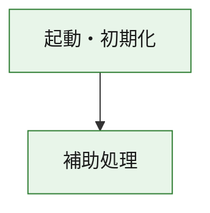
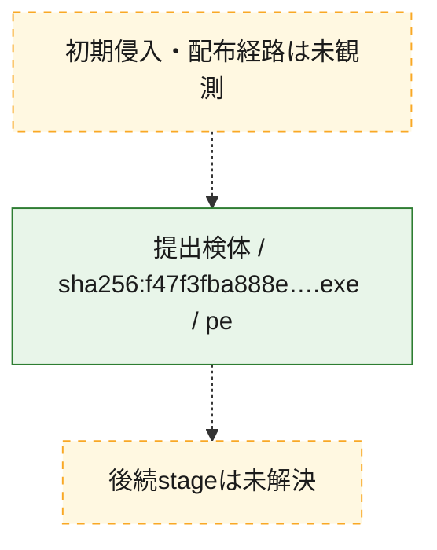
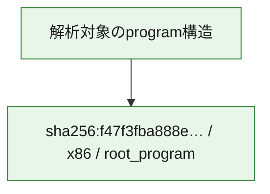

# 全体ロジック：f47f3fba888e9c798d9f5b9115b31aabf844cb0202a5253956dcb7b9940e5c3e

代表関数の静的証跡から、起動・初期化の処理群を確認しました。

## 読み方

- phaseの掲載順は解析上の整理順です。observed_call_edgesがない段階間の実行順を断定しません。
- 図の実線は静的に観測した関係、点線と黄色のノードは未観測・未解決の関係を示します。
- 図は静的な要約であり、動的実行を再現するものではありません。
- 詳細な関数解説とfingerprintは[STATIC-LOGIC.md](STATIC-LOGIC.md)を参照してください。

## 静的可視化

### 実行フロー

### 感染チェーン

### モジュール関係

## 処理段階

### 1. 起動・初期化

entry pointから初期化と後続処理への移行を確認します。
確度: `confirmed_static_function_evidence`

- `f47f3fba888e9c798d9f5b9115b31aabf844cb0202a5253956dcb7b9940e5c3e:ghidra:180001010` — 初期化と主要処理への分岐を行う入口関数です。 状態: `succeeded`、選定理由: `entry_point`, `meaningful_symbol_name`, `reviewed_call_centrality:22`, `role:entrypoint`, `small_program_complete_context`

### 2. 補助処理

主要処理を支える一般内部関数またはlibrary処理を確認します。
確度: `confirmed_static_function_evidence`

- `f47f3fba888e9c798d9f5b9115b31aabf844cb0202a5253956dcb7b9940e5c3e:ghidra:180001240` — 検体内部の一般処理を実装する関数です。 状態: `succeeded`、選定理由: `context_representative`, `reviewed_call_centrality:2`, `small_program_complete_context`
- `f47f3fba888e9c798d9f5b9115b31aabf844cb0202a5253956dcb7b9940e5c3e:ghidra:180001350` — 検体内部の一般処理を実装する関数です。 状態: `succeeded`、選定理由: `context_representative`, `reviewed_call_centrality:25`, `small_program_complete_context`
- `f47f3fba888e9c798d9f5b9115b31aabf844cb0202a5253956dcb7b9940e5c3e:ghidra:180003780` — 検体内部の一般処理を実装する関数です。 状態: `succeeded`、選定理由: `context_representative`, `reviewed_call_centrality:2`, `small_program_complete_context`
- `f47f3fba888e9c798d9f5b9115b31aabf844cb0202a5253956dcb7b9940e5c3e:ghidra:1800038e0` — 検体内部の一般処理を実装する関数です。 状態: `succeeded`、選定理由: `context_representative`, `reviewed_call_centrality:2`, `small_program_complete_context`

## 観測したcall関係

- `f47f3fba888e9c798d9f5b9115b31aabf844cb0202a5253956dcb7b9940e5c3e:ghidra:180001010` → `f47f3fba888e9c798d9f5b9115b31aabf844cb0202a5253956dcb7b9940e5c3e:ghidra:180001240` （`startup` → `support`）
- `f47f3fba888e9c798d9f5b9115b31aabf844cb0202a5253956dcb7b9940e5c3e:ghidra:180001010` → `f47f3fba888e9c798d9f5b9115b31aabf844cb0202a5253956dcb7b9940e5c3e:ghidra:180001350` （`startup` → `support`）
- `f47f3fba888e9c798d9f5b9115b31aabf844cb0202a5253956dcb7b9940e5c3e:ghidra:180001350` → `f47f3fba888e9c798d9f5b9115b31aabf844cb0202a5253956dcb7b9940e5c3e:ghidra:180001240` （`support` → `support`）
- `f47f3fba888e9c798d9f5b9115b31aabf844cb0202a5253956dcb7b9940e5c3e:ghidra:180001350` → `f47f3fba888e9c798d9f5b9115b31aabf844cb0202a5253956dcb7b9940e5c3e:ghidra:180003780` （`support` → `support`）
- `f47f3fba888e9c798d9f5b9115b31aabf844cb0202a5253956dcb7b9940e5c3e:ghidra:180001350` → `f47f3fba888e9c798d9f5b9115b31aabf844cb0202a5253956dcb7b9940e5c3e:ghidra:1800038e0` （`support` → `support`）
- `f47f3fba888e9c798d9f5b9115b31aabf844cb0202a5253956dcb7b9940e5c3e:ghidra:180003780` → `f47f3fba888e9c798d9f5b9115b31aabf844cb0202a5253956dcb7b9940e5c3e:ghidra:1800038e0` （`support` → `support`）
- `ghidra-function:08008b0678e2678279a7d838` → `ghidra-function:a2390836504e50d91a0da90f` （`unclassified` → `unclassified`）
- `ghidra-function:1bcd0c160b1baefd88d91146` → `ghidra-function:0beacea3b89961fe3263dded` （`unclassified` → `unclassified`）
- `ghidra-function:1bcd0c160b1baefd88d91146` → `ghidra-function:46b9b89895a561b2f1effc64` （`unclassified` → `unclassified`）
- `ghidra-function:1bcd0c160b1baefd88d91146` → `ghidra-function:550f5a1521eb16113e664fee` （`unclassified` → `unclassified`）
- `ghidra-function:1bcd0c160b1baefd88d91146` → `ghidra-function:577a7785d9de7acd14ab3778` （`unclassified` → `unclassified`）
- `ghidra-function:1bcd0c160b1baefd88d91146` → `ghidra-function:59f869f4589657ef3d8d6f92` （`unclassified` → `unclassified`）
- `ghidra-function:1bcd0c160b1baefd88d91146` → `ghidra-function:7981056162202e72e6c5ff5c` （`unclassified` → `unclassified`）
- `ghidra-function:1bcd0c160b1baefd88d91146` → `ghidra-function:9807076eee16feab5e65fe30` （`unclassified` → `unclassified`）
- `ghidra-function:1bcd0c160b1baefd88d91146` → `ghidra-function:aa168ca6497df43480a42e6e` （`unclassified` → `unclassified`）
- `ghidra-function:1bcd0c160b1baefd88d91146` → `ghidra-function:ca54a863336193c8a66f677c` （`unclassified` → `unclassified`）
- `ghidra-function:1bcd0c160b1baefd88d91146` → `ghidra-function:d72012b0af4abfc0b6bb91c4` （`unclassified` → `unclassified`）
- `ghidra-function:1bcd0c160b1baefd88d91146` → `ghidra-function:dc4fd191c338295d6f632f68` （`unclassified` → `unclassified`）
- `ghidra-function:1bcd0c160b1baefd88d91146` → `ghidra-function:ffe9e33d54581a3282ecc254` （`unclassified` → `unclassified`）
- `ghidra-function:aa168ca6497df43480a42e6e` → `ghidra-external:362f298dbed2ece0a1e78a34` （`unclassified` → `unclassified`）
- `ghidra-function:aa168ca6497df43480a42e6e` → `ghidra-external:39339d9beef38a25c1794b88` （`unclassified` → `unclassified`）
- `ghidra-function:aa168ca6497df43480a42e6e` → `ghidra-external:3c6113087e53ef8195f6cf96` （`unclassified` → `unclassified`）
- `ghidra-function:aa168ca6497df43480a42e6e` → `ghidra-external:3ef8fb3bce54a03508066020` （`unclassified` → `unclassified`）
- `ghidra-function:aa168ca6497df43480a42e6e` → `ghidra-external:4e39c3f5ea08cbc6bf548610` （`unclassified` → `unclassified`）
- `ghidra-function:aa168ca6497df43480a42e6e` → `ghidra-external:6b2020fb028e4eda6ae1846e` （`unclassified` → `unclassified`）
- `ghidra-function:aa168ca6497df43480a42e6e` → `ghidra-external:77047d6c92b36d0edbd82266` （`unclassified` → `unclassified`）
- `ghidra-function:aa168ca6497df43480a42e6e` → `ghidra-external:8411bc23d1b45d0f0fdb1f74` （`unclassified` → `unclassified`）
- `ghidra-function:aa168ca6497df43480a42e6e` → `ghidra-external:86f4b23dd28d85e6f1cf7a8b` （`unclassified` → `unclassified`）
- `ghidra-function:aa168ca6497df43480a42e6e` → `ghidra-external:8f595097235bff9fcaf366a0` （`unclassified` → `unclassified`）
- `ghidra-function:aa168ca6497df43480a42e6e` → `ghidra-external:910929385c0d50fe2119a48b` （`unclassified` → `unclassified`）
- `ghidra-function:aa168ca6497df43480a42e6e` → `ghidra-external:92d6aab7ceb120552e12a563` （`unclassified` → `unclassified`）
- `ghidra-function:aa168ca6497df43480a42e6e` → `ghidra-external:a971425542171073c313d06c` （`unclassified` → `unclassified`）
- `ghidra-function:aa168ca6497df43480a42e6e` → `ghidra-external:af06fc52db7e00a142f3d854` （`unclassified` → `unclassified`）
- `ghidra-function:aa168ca6497df43480a42e6e` → `ghidra-external:becc867f1d1a78c24aba11ef` （`unclassified` → `unclassified`）
- `ghidra-function:aa168ca6497df43480a42e6e` → `ghidra-external:c96f07c2b871812f8d0c61d9` （`unclassified` → `unclassified`）
- `ghidra-function:aa168ca6497df43480a42e6e` → `ghidra-external:cc527d9b5086d196bd2d883d` （`unclassified` → `unclassified`）
- `ghidra-function:aa168ca6497df43480a42e6e` → `ghidra-external:d545b7a908346c2c6a09031e` （`unclassified` → `unclassified`）
- `ghidra-function:aa168ca6497df43480a42e6e` → `ghidra-external:e17defd762c0c453ffdf5b0b` （`unclassified` → `unclassified`）
- `ghidra-function:aa168ca6497df43480a42e6e` → `ghidra-external:fbb75c917f66ae487c567fa2` （`unclassified` → `unclassified`）
- `ghidra-function:aa168ca6497df43480a42e6e` → `ghidra-external:fe7c90dcd889072aa872ab39` （`unclassified` → `unclassified`）
- `ghidra-function:aa168ca6497df43480a42e6e` → `ghidra-function:08008b0678e2678279a7d838` （`unclassified` → `unclassified`）
- `ghidra-function:aa168ca6497df43480a42e6e` → `ghidra-function:0beacea3b89961fe3263dded` （`unclassified` → `unclassified`）
- `ghidra-function:aa168ca6497df43480a42e6e` → `ghidra-function:a2390836504e50d91a0da90f` （`unclassified` → `unclassified`）

## 解析範囲と制約

- 選定外関数は全体inventoryへ残しますが、関数本体の個別解説対象にはしていません。
- indirect call、難読化、packer、VM、壊れたcontrol flowによりcall関係が欠落する場合があります。
- 文書は静的解析に基づき、検体実行や外部通信による動的確認は行っていません。
