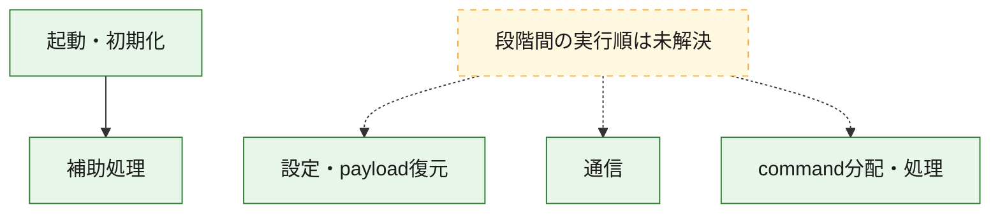
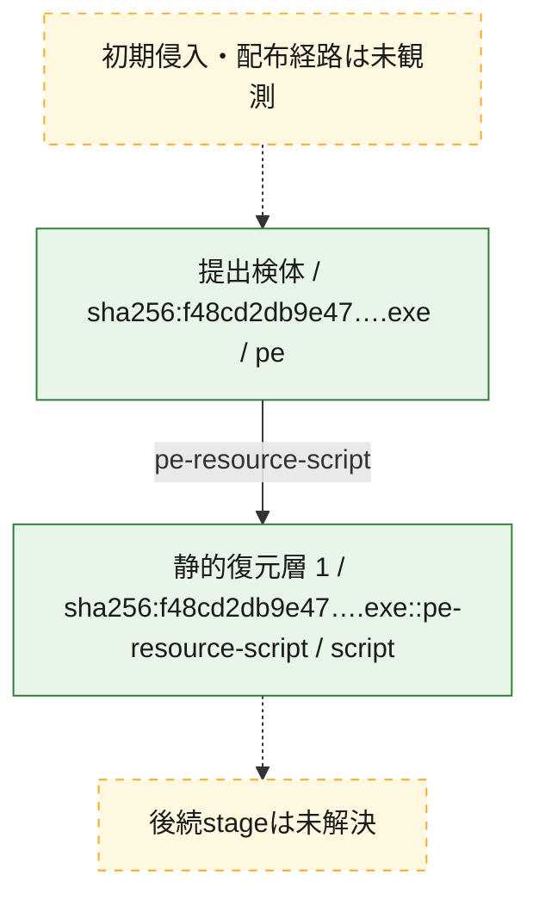
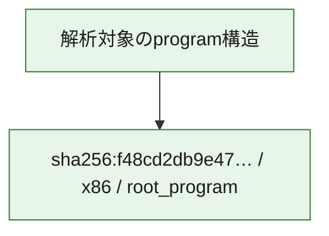

# 全体ロジック：f48cd2db9e47caf70aca8cd3465509365248586d319e2b09a12d4354743746de

代表関数の静的証跡から、起動・初期化、設定・payload復元、通信、command分配・処理の処理群を確認しました。

## 読み方

- phaseの掲載順は解析上の整理順です。observed_call_edgesがない段階間の実行順を断定しません。
- 図の実線は静的に観測した関係、点線と黄色のノードは未観測・未解決の関係を示します。
- 図は静的な要約であり、動的実行を再現するものではありません。
- 詳細な関数解説とfingerprintは[STATIC-LOGIC.md](STATIC-LOGIC.md)を参照してください。

## 静的可視化

### 実行フロー

### 感染チェーン

### モジュール関係

## 処理段階

### 1. 起動・初期化

entry pointから初期化と後続処理への移行を確認します。
確度: `confirmed_static_function_evidence`

- `f48cd2db9e47caf70aca8cd3465509365248586d319e2b09a12d4354743746de:ghidra:006441f0` — 初期化と主要処理への分岐を行う入口関数です。 状態: `succeeded`、選定理由: `entry_point`, `meaningful_symbol_name`, `reviewed_call_centrality:22`, `role:entrypoint`

### 2. 設定・payload復元

設定、resource、payload、暗号化データの復元・変換を確認します。
確度: `confirmed_static_function_evidence_with_limits`

- `f48cd2db9e47caf70aca8cd3465509365248586d319e2b09a12d4354743746de:ghidra:0063d54e` — 設定、resource、payloadなどの解析・変換を行う関数です。 状態: `limited_bad_instruction_or_flow`、選定理由: `meaningful_symbol_name`, `reviewed_call_centrality:1`, `role:config_or_data_transform`

### 3. 通信

通信初期化、endpoint処理、送受信の役割を確認します。
確度: `confirmed_static_function_evidence_with_limits`

- `f48cd2db9e47caf70aca8cd3465509365248586d319e2b09a12d4354743746de:ghidra:0063d345` — 通信初期化、送受信、またはendpoint処理に関係する関数です。 状態: `limited_bad_instruction_or_flow`、選定理由: `meaningful_symbol_name`, `reviewed_call_centrality:1`, `role:network_communication`
- `f48cd2db9e47caf70aca8cd3465509365248586d319e2b09a12d4354743746de:ghidra:0063d594` — 通信初期化、送受信、またはendpoint処理に関係する関数です。 状態: `limited_bad_instruction_or_flow`、選定理由: `meaningful_symbol_name`, `reviewed_call_centrality:1`, `role:network_communication`
- `f48cd2db9e47caf70aca8cd3465509365248586d319e2b09a12d4354743746de:ghidra:0066c58f` — 通信初期化、送受信、またはendpoint処理に関係する関数です。 状態: `limited_bad_instruction_or_flow`、選定理由: `meaningful_symbol_name`, `reviewed_call_centrality:1`, `role:network_communication`
- `f48cd2db9e47caf70aca8cd3465509365248586d319e2b09a12d4354743746de:ghidra:0066c5a3` — 通信初期化、送受信、またはendpoint処理に関係する関数です。 状態: `limited_bad_instruction_or_flow`、選定理由: `meaningful_symbol_name`, `reviewed_call_centrality:1`, `role:network_communication`
- `f48cd2db9e47caf70aca8cd3465509365248586d319e2b09a12d4354743746de:ghidra:0066c85b` — 通信初期化、送受信、またはendpoint処理に関係する関数です。 状態: `failed`、選定理由: `meaningful_symbol_name`, `reviewed_call_centrality:1`, `role:network_communication`

### 4. command分配・処理

受信commandやtaskの解釈、分配、個別handlerへの移行を確認します。
確度: `confirmed_static_function_evidence_with_limits`

- `f48cd2db9e47caf70aca8cd3465509365248586d319e2b09a12d4354743746de:ghidra:0063d5f8` — commandの解釈、分配、または個別処理を担当する関数です。 状態: `limited_bad_instruction_or_flow`、選定理由: `meaningful_symbol_name`, `reviewed_call_centrality:1`, `role:command_dispatch_or_handler`
- `f48cd2db9e47caf70aca8cd3465509365248586d319e2b09a12d4354743746de:ghidra:0063da1d` — commandの解釈、分配、または個別処理を担当する関数です。 状態: `limited_bad_instruction_or_flow`、選定理由: `meaningful_symbol_name`, `reviewed_call_centrality:1`, `role:command_dispatch_or_handler`
- `f48cd2db9e47caf70aca8cd3465509365248586d319e2b09a12d4354743746de:ghidra:0063da27` — commandの解釈、分配、または個別処理を担当する関数です。 状態: `limited_bad_instruction_or_flow`、選定理由: `meaningful_symbol_name`, `reviewed_call_centrality:1`, `role:command_dispatch_or_handler`
- `f48cd2db9e47caf70aca8cd3465509365248586d319e2b09a12d4354743746de:ghidra:0066c5b7` — commandの解釈、分配、または個別処理を担当する関数です。 状態: `limited_bad_instruction_or_flow`、選定理由: `meaningful_symbol_name`, `reviewed_call_centrality:1`, `role:command_dispatch_or_handler`

### 5. 補助処理

主要処理を支える一般内部関数またはlibrary処理を確認します。
確度: `confirmed_static_function_evidence_with_limits`

- `f48cd2db9e47caf70aca8cd3465509365248586d319e2b09a12d4354743746de:ghidra:00408440` — 検体内部の一般処理を実装する関数です。 状態: `succeeded`、選定理由: `meaningful_symbol_name`, `reviewed_call_centrality:3`
- `f48cd2db9e47caf70aca8cd3465509365248586d319e2b09a12d4354743746de:ghidra:0063cf7a` — 検体内部の一般処理を実装する関数です。 状態: `limited_bad_instruction_or_flow`、選定理由: `meaningful_symbol_name`, `reviewed_call_centrality:1`
- `f48cd2db9e47caf70aca8cd3465509365248586d319e2b09a12d4354743746de:ghidra:0063cf95` — 検体内部の一般処理を実装する関数です。 状態: `limited_bad_instruction_or_flow`、選定理由: `meaningful_symbol_name`, `reviewed_call_centrality:1`
- `f48cd2db9e47caf70aca8cd3465509365248586d319e2b09a12d4354743746de:ghidra:0063cf9f` — 検体内部の一般処理を実装する関数です。 状態: `limited_bad_instruction_or_flow`、選定理由: `meaningful_symbol_name`, `reviewed_call_centrality:1`
- `f48cd2db9e47caf70aca8cd3465509365248586d319e2b09a12d4354743746de:ghidra:0063cfba` — 検体内部の一般処理を実装する関数です。 状態: `limited_bad_instruction_or_flow`、選定理由: `meaningful_symbol_name`, `reviewed_call_centrality:1`
- `f48cd2db9e47caf70aca8cd3465509365248586d319e2b09a12d4354743746de:ghidra:0063cfda` — 検体内部の一般処理を実装する関数です。 状態: `limited_bad_instruction_or_flow`、選定理由: `meaningful_symbol_name`, `reviewed_call_centrality:1`
- `f48cd2db9e47caf70aca8cd3465509365248586d319e2b09a12d4354743746de:ghidra:0063cfe4` — 検体内部の一般処理を実装する関数です。 状態: `limited_bad_instruction_or_flow`、選定理由: `meaningful_symbol_name`, `reviewed_call_centrality:1`
- `f48cd2db9e47caf70aca8cd3465509365248586d319e2b09a12d4354743746de:ghidra:0063cfee` — 検体内部の一般処理を実装する関数です。 状態: `limited_bad_instruction_or_flow`、選定理由: `meaningful_symbol_name`, `reviewed_call_centrality:1`
- `f48cd2db9e47caf70aca8cd3465509365248586d319e2b09a12d4354743746de:ghidra:0063cff8` — 検体内部の一般処理を実装する関数です。 状態: `limited_bad_instruction_or_flow`、選定理由: `meaningful_symbol_name`, `reviewed_call_centrality:1`
- `f48cd2db9e47caf70aca8cd3465509365248586d319e2b09a12d4354743746de:ghidra:0063d04a` — 検体内部の一般処理を実装する関数です。 状態: `limited_bad_instruction_or_flow`、選定理由: `meaningful_symbol_name`, `reviewed_call_centrality:1`
- `f48cd2db9e47caf70aca8cd3465509365248586d319e2b09a12d4354743746de:ghidra:0063d054` — 検体内部の一般処理を実装する関数です。 状態: `limited_bad_instruction_or_flow`、選定理由: `meaningful_symbol_name`, `reviewed_call_centrality:1`
- `f48cd2db9e47caf70aca8cd3465509365248586d319e2b09a12d4354743746de:ghidra:0063d05e` — 検体内部の一般処理を実装する関数です。 状態: `limited_bad_instruction_or_flow`、選定理由: `meaningful_symbol_name`, `reviewed_call_centrality:1`
- `f48cd2db9e47caf70aca8cd3465509365248586d319e2b09a12d4354743746de:ghidra:0063d068` — 検体内部の一般処理を実装する関数です。 状態: `limited_bad_instruction_or_flow`、選定理由: `meaningful_symbol_name`, `reviewed_call_centrality:1`
- `f48cd2db9e47caf70aca8cd3465509365248586d319e2b09a12d4354743746de:ghidra:0063d083` — 検体内部の一般処理を実装する関数です。 状態: `limited_bad_instruction_or_flow`、選定理由: `meaningful_symbol_name`, `reviewed_call_centrality:1`
- `f48cd2db9e47caf70aca8cd3465509365248586d319e2b09a12d4354743746de:ghidra:0063d08d` — 検体内部の一般処理を実装する関数です。 状態: `limited_bad_instruction_or_flow`、選定理由: `meaningful_symbol_name`, `reviewed_call_centrality:1`
- `f48cd2db9e47caf70aca8cd3465509365248586d319e2b09a12d4354743746de:ghidra:0063d097` — 検体内部の一般処理を実装する関数です。 状態: `limited_bad_instruction_or_flow`、選定理由: `meaningful_symbol_name`, `reviewed_call_centrality:1`
- `f48cd2db9e47caf70aca8cd3465509365248586d319e2b09a12d4354743746de:ghidra:0063d0a1` — 検体内部の一般処理を実装する関数です。 状態: `limited_bad_instruction_or_flow`、選定理由: `meaningful_symbol_name`, `reviewed_call_centrality:1`
- `f48cd2db9e47caf70aca8cd3465509365248586d319e2b09a12d4354743746de:ghidra:0063d0ab` — 検体内部の一般処理を実装する関数です。 状態: `limited_bad_instruction_or_flow`、選定理由: `meaningful_symbol_name`, `reviewed_call_centrality:1`
- `f48cd2db9e47caf70aca8cd3465509365248586d319e2b09a12d4354743746de:ghidra:0063d0b5` — 検体内部の一般処理を実装する関数です。 状態: `limited_bad_instruction_or_flow`、選定理由: `meaningful_symbol_name`, `reviewed_call_centrality:1`
- `f48cd2db9e47caf70aca8cd3465509365248586d319e2b09a12d4354743746de:ghidra:0066ce50` — compiler生成処理または汎用library処理とみられる関数です。 状態: `succeeded`、選定理由: `entry_point`, `meaningful_symbol_name`, `reviewed_call_centrality:1`
- `f48cd2db9e47caf70aca8cd3465509365248586d319e2b09a12d4354743746de:ghidra:0066cee0` — compiler生成処理または汎用library処理とみられる関数です。 状態: `succeeded`、選定理由: `entry_point`, `meaningful_symbol_name`, `reviewed_call_centrality:2`

## 観測したcall関係

- `f48cd2db9e47caf70aca8cd3465509365248586d319e2b09a12d4354743746de:ghidra:006441f0` → `f48cd2db9e47caf70aca8cd3465509365248586d319e2b09a12d4354743746de:ghidra:00408440` （`startup` → `support`）
- `f48cd2db9e47caf70aca8cd3465509365248586d319e2b09a12d4354743746de:ghidra:0066ce50` → `f48cd2db9e47caf70aca8cd3465509365248586d319e2b09a12d4354743746de:ghidra:00408440` （`support` → `support`）
- `f48cd2db9e47caf70aca8cd3465509365248586d319e2b09a12d4354743746de:ghidra:0066cee0` → `f48cd2db9e47caf70aca8cd3465509365248586d319e2b09a12d4354743746de:ghidra:00408440` （`support` → `support`）
- `ghidra-function:044e2362fc1b984c60fe24b1` → `ghidra-external:14c4fe4ee56ad006e363a9e7` （`unclassified` → `unclassified`）
- `ghidra-function:3adef317f1b0034f7000a63e` → `ghidra-external:14c4fe4ee56ad006e363a9e7` （`unclassified` → `unclassified`）
- `ghidra-function:3c103bafac69678ca1cdc756` → `ghidra-external:14c4fe4ee56ad006e363a9e7` （`unclassified` → `unclassified`）
- `ghidra-function:4a344e1e8f2fc563b3b6e695` → `ghidra-external:14c4fe4ee56ad006e363a9e7` （`unclassified` → `unclassified`）
- `ghidra-function:4ba400237840f5091e804683` → `ghidra-external:14c4fe4ee56ad006e363a9e7` （`unclassified` → `unclassified`）
- `ghidra-function:4c26a77052b3c8fedbbaf6a3` → `ghidra-external:14c4fe4ee56ad006e363a9e7` （`unclassified` → `unclassified`）
- `ghidra-function:4c419ef50480c0c9ab45e074` → `ghidra-external:14c4fe4ee56ad006e363a9e7` （`unclassified` → `unclassified`）
- `ghidra-function:550e5910e5bdfb8240104788` → `ghidra-external:14c4fe4ee56ad006e363a9e7` （`unclassified` → `unclassified`）
- `ghidra-function:55e4c923e6bc70528bc49c98` → `ghidra-external:14c4fe4ee56ad006e363a9e7` （`unclassified` → `unclassified`）
- `ghidra-function:613bfc1ee66a2f4d0323452a` → `ghidra-external:14c4fe4ee56ad006e363a9e7` （`unclassified` → `unclassified`）
- `ghidra-function:622603e91e47b7d89487279a` → `ghidra-external:14c4fe4ee56ad006e363a9e7` （`unclassified` → `unclassified`）
- `ghidra-function:66d73eb385a0bdd48f56ed7c` → `ghidra-function:a44782f8cf2b9c31cde4c775` （`unclassified` → `unclassified`）
- `ghidra-function:71393233bdce19ecb6b26226` → `ghidra-external:14c4fe4ee56ad006e363a9e7` （`unclassified` → `unclassified`）
- `ghidra-function:72634b50cf13c48b963581d2` → `ghidra-external:14c4fe4ee56ad006e363a9e7` （`unclassified` → `unclassified`）
- `ghidra-function:76440d3e2b392d164f5b50e2` → `ghidra-external:14c4fe4ee56ad006e363a9e7` （`unclassified` → `unclassified`）
- `ghidra-function:77285ab5def88e2831237ad4` → `ghidra-external:14c4fe4ee56ad006e363a9e7` （`unclassified` → `unclassified`）
- `ghidra-function:7e38906a6d0fdc060d22ea5c` → `ghidra-external:14c4fe4ee56ad006e363a9e7` （`unclassified` → `unclassified`）
- `ghidra-function:7e4d612316a9a83e770a6639` → `ghidra-external:0558e15e299aa75759f9c99f` （`unclassified` → `unclassified`）
- `ghidra-function:7e4d612316a9a83e770a6639` → `ghidra-external:07f11e1a6d963c41c4d4eb8e` （`unclassified` → `unclassified`）
- `ghidra-function:7e4d612316a9a83e770a6639` → `ghidra-external:116e2c02f43b8421d72109c4` （`unclassified` → `unclassified`）
- `ghidra-function:7e4d612316a9a83e770a6639` → `ghidra-external:1701b3a865a60f53c1901553` （`unclassified` → `unclassified`）
- `ghidra-function:7e4d612316a9a83e770a6639` → `ghidra-external:3f3c95aa4c7349c0dbe080fa` （`unclassified` → `unclassified`）
- `ghidra-function:7e4d612316a9a83e770a6639` → `ghidra-external:41162cbac5c56633cd87e156` （`unclassified` → `unclassified`）
- `ghidra-function:7e4d612316a9a83e770a6639` → `ghidra-external:4ae7f6c5ee5161822a90ccdc` （`unclassified` → `unclassified`）
- `ghidra-function:7e4d612316a9a83e770a6639` → `ghidra-external:7a2fd955f5afe7f67a5a5d82` （`unclassified` → `unclassified`）
- `ghidra-function:7e4d612316a9a83e770a6639` → `ghidra-external:860e515ad6ea3495efbed532` （`unclassified` → `unclassified`）
- `ghidra-function:7e4d612316a9a83e770a6639` → `ghidra-external:8d1bbf66c2e180a01f0a0033` （`unclassified` → `unclassified`）
- `ghidra-function:7e4d612316a9a83e770a6639` → `ghidra-external:8d6bea21f84e51302f31d58c` （`unclassified` → `unclassified`）
- `ghidra-function:7e4d612316a9a83e770a6639` → `ghidra-external:989dc4e4d4041d2057b2ae91` （`unclassified` → `unclassified`）
- `ghidra-function:7e4d612316a9a83e770a6639` → `ghidra-external:a671474537f7557377683e78` （`unclassified` → `unclassified`）
- `ghidra-function:7e4d612316a9a83e770a6639` → `ghidra-external:af3c17fadebb4cf79bbe26b1` （`unclassified` → `unclassified`）
- `ghidra-function:7e4d612316a9a83e770a6639` → `ghidra-external:bd0f53e55b30111d4f342e9f` （`unclassified` → `unclassified`）
- `ghidra-function:7e4d612316a9a83e770a6639` → `ghidra-external:cba7827d58e41527e9778feb` （`unclassified` → `unclassified`）
- `ghidra-function:7e4d612316a9a83e770a6639` → `ghidra-external:cd6cad07c4ae11e3eb964f91` （`unclassified` → `unclassified`）
- `ghidra-function:7e4d612316a9a83e770a6639` → `ghidra-external:cf7067f1508e60f0e8699481` （`unclassified` → `unclassified`）
- `ghidra-function:7e4d612316a9a83e770a6639` → `ghidra-external:f2ea27cc76c635172ff4914c` （`unclassified` → `unclassified`）
- `ghidra-function:7e4d612316a9a83e770a6639` → `ghidra-external:ff70ec47f6384dca42633dcf` （`unclassified` → `unclassified`）
- `ghidra-function:7e4d612316a9a83e770a6639` → `ghidra-function:7a5d9f06518238703b70aee2` （`unclassified` → `unclassified`）
- `ghidra-function:7e4d612316a9a83e770a6639` → `ghidra-function:a44782f8cf2b9c31cde4c775` （`unclassified` → `unclassified`）
- `ghidra-function:932eb1bc0d3b8564f4a16914` → `ghidra-external:14c4fe4ee56ad006e363a9e7` （`unclassified` → `unclassified`）
- `ghidra-function:9b764468a7f4b75f63ba34b7` → `ghidra-external:14c4fe4ee56ad006e363a9e7` （`unclassified` → `unclassified`）
- `ghidra-function:a8a9ff5b3e1a5cb30dd89d3f` → `ghidra-external:14c4fe4ee56ad006e363a9e7` （`unclassified` → `unclassified`）
- `ghidra-function:a980f43a93da6b5072b73ac1` → `ghidra-external:14c4fe4ee56ad006e363a9e7` （`unclassified` → `unclassified`）
- `ghidra-function:b12c1cfa823fd65edb0e5b3e` → `ghidra-external:14c4fe4ee56ad006e363a9e7` （`unclassified` → `unclassified`）
- `ghidra-function:b31bb5dcbabfe9c542c9840b` → `ghidra-external:5d5eaf1801a211be7064ca09` （`unclassified` → `unclassified`）
- `ghidra-function:b31bb5dcbabfe9c542c9840b` → `ghidra-function:a44782f8cf2b9c31cde4c775` （`unclassified` → `unclassified`）
- `ghidra-function:be5f500dacacd1c2e0a9f18c` → `ghidra-external:14c4fe4ee56ad006e363a9e7` （`unclassified` → `unclassified`）
- `ghidra-function:c3a22053265fc7e28fd6fbcc` → `ghidra-external:14c4fe4ee56ad006e363a9e7` （`unclassified` → `unclassified`）
- `ghidra-function:c64dada34ebf706a5d5a34a5` → `ghidra-external:14c4fe4ee56ad006e363a9e7` （`unclassified` → `unclassified`）
- `ghidra-function:da10eb3cbece191df48b73e4` → `ghidra-external:14c4fe4ee56ad006e363a9e7` （`unclassified` → `unclassified`）
- `ghidra-function:dc56cada94cd20675be6a95f` → `ghidra-external:14c4fe4ee56ad006e363a9e7` （`unclassified` → `unclassified`）
- `ghidra-function:dda09e1b03b3845922a5e6d9` → `ghidra-external:14c4fe4ee56ad006e363a9e7` （`unclassified` → `unclassified`）
- `ghidra-function:eb405707d2c54822813a001c` → `ghidra-external:14c4fe4ee56ad006e363a9e7` （`unclassified` → `unclassified`）

## 解析範囲と制約

- 選定外関数は全体inventoryへ残しますが、関数本体の個別解説対象にはしていません。
- indirect call、難読化、packer、VM、壊れたcontrol flowによりcall関係が欠落する場合があります。
- 文書は静的解析に基づき、検体実行や外部通信による動的確認は行っていません。
