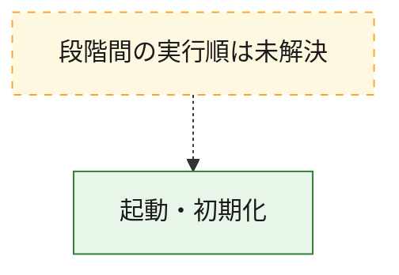
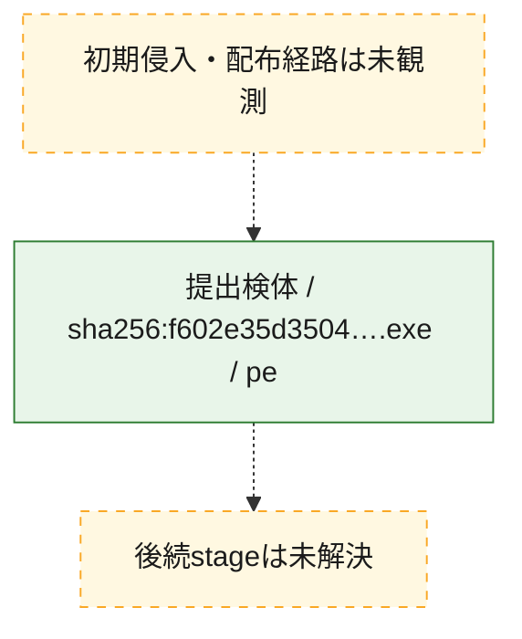
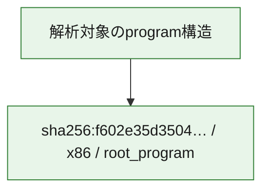

# 全体ロジック：f602e35d3504b19c720fe340f554a3d9bc99b7c0d9639732ba8ffaa9dfd41f4f

代表関数の静的証跡から、起動・初期化の処理群を確認しました。

## 読み方

- phaseの掲載順は解析上の整理順です。observed_call_edgesがない段階間の実行順を断定しません。
- 図の実線は静的に観測した関係、点線と黄色のノードは未観測・未解決の関係を示します。
- 図は静的な要約であり、動的実行を再現するものではありません。
- 詳細な関数解説とfingerprintは[STATIC-LOGIC.md](STATIC-LOGIC.md)を参照してください。

## 静的可視化

### 実行フロー

### 感染チェーン

### モジュール関係

## 処理段階

### 1. 起動・初期化

entry pointから初期化と後続処理への移行を確認します。
確度: `confirmed_static_function_evidence`

- `f602e35d3504b19c720fe340f554a3d9bc99b7c0d9639732ba8ffaa9dfd41f4f:ghidra:0040369f` — 初期化と主要処理への分岐を行う入口関数です。 状態: `succeeded`、選定理由: `entry_point`, `large_function:instructions=484`, `meaningful_symbol_name`, `reviewed_call_centrality:57`, `role:entrypoint`, `small_program_complete_context`

## 観測したcall関係

- `ghidra-function:e6604af33b6c624235b43b99` → `ghidra-external:00a9933077b6042d6cc49c85` （`unclassified` → `unclassified`）
- `ghidra-function:e6604af33b6c624235b43b99` → `ghidra-external:188c43b80572b4d3de7b3705` （`unclassified` → `unclassified`）
- `ghidra-function:e6604af33b6c624235b43b99` → `ghidra-external:192989559c21232a33386b1f` （`unclassified` → `unclassified`）
- `ghidra-function:e6604af33b6c624235b43b99` → `ghidra-external:1f83151c573676f726d9e0fb` （`unclassified` → `unclassified`）
- `ghidra-function:e6604af33b6c624235b43b99` → `ghidra-external:3956c66acf6f94e07973692f` （`unclassified` → `unclassified`）
- `ghidra-function:e6604af33b6c624235b43b99` → `ghidra-external:4ae4e7e76c2bcd8eeba73d8f` （`unclassified` → `unclassified`）
- `ghidra-function:e6604af33b6c624235b43b99` → `ghidra-external:5202073c372522b29a169c3b` （`unclassified` → `unclassified`）
- `ghidra-function:e6604af33b6c624235b43b99` → `ghidra-external:622a051c954d2a560d9da91e` （`unclassified` → `unclassified`）
- `ghidra-function:e6604af33b6c624235b43b99` → `ghidra-external:6651544d2b0f582d379f8fee` （`unclassified` → `unclassified`）
- `ghidra-function:e6604af33b6c624235b43b99` → `ghidra-external:74715c5d586d301613f3f67d` （`unclassified` → `unclassified`）
- `ghidra-function:e6604af33b6c624235b43b99` → `ghidra-external:7def9a21a2bdd43993d5d465` （`unclassified` → `unclassified`）
- `ghidra-function:e6604af33b6c624235b43b99` → `ghidra-external:812e076ef5018f21349df28b` （`unclassified` → `unclassified`）
- `ghidra-function:e6604af33b6c624235b43b99` → `ghidra-external:818cc5848072e28c863b6af9` （`unclassified` → `unclassified`）
- `ghidra-function:e6604af33b6c624235b43b99` → `ghidra-external:917e0a944d5c8ffb4fecc64d` （`unclassified` → `unclassified`）
- `ghidra-function:e6604af33b6c624235b43b99` → `ghidra-external:94140ad8bcd8d1932620c3c7` （`unclassified` → `unclassified`）
- `ghidra-function:e6604af33b6c624235b43b99` → `ghidra-external:9ce961fa0be776beb6792514` （`unclassified` → `unclassified`）
- `ghidra-function:e6604af33b6c624235b43b99` → `ghidra-external:a5eced1c926dab045645cb0a` （`unclassified` → `unclassified`）
- `ghidra-function:e6604af33b6c624235b43b99` → `ghidra-external:b059bfa39de0baf610b44f80` （`unclassified` → `unclassified`）
- `ghidra-function:e6604af33b6c624235b43b99` → `ghidra-external:bb6684d8d9d436112e1a270b` （`unclassified` → `unclassified`）
- `ghidra-function:e6604af33b6c624235b43b99` → `ghidra-external:d2b3250dde1c79506e204fcf` （`unclassified` → `unclassified`）
- `ghidra-function:e6604af33b6c624235b43b99` → `ghidra-external:d3d7181739e0df9bd76e2788` （`unclassified` → `unclassified`）
- `ghidra-function:e6604af33b6c624235b43b99` → `ghidra-external:e21075ab5f7497397d40fcf9` （`unclassified` → `unclassified`）
- `ghidra-function:e6604af33b6c624235b43b99` → `ghidra-external:ec82eac9be7ba6a4cf9f09c1` （`unclassified` → `unclassified`）
- `ghidra-function:e6604af33b6c624235b43b99` → `ghidra-function:0f22812f6c5e8146f6e0ad56` （`unclassified` → `unclassified`）
- `ghidra-function:e6604af33b6c624235b43b99` → `ghidra-function:2920da32d4f14ab73deff66b` （`unclassified` → `unclassified`）
- `ghidra-function:e6604af33b6c624235b43b99` → `ghidra-function:37e1f79b676bc1761f6a99be` （`unclassified` → `unclassified`）
- `ghidra-function:e6604af33b6c624235b43b99` → `ghidra-function:468fba866bbeec69c70fb914` （`unclassified` → `unclassified`）
- `ghidra-function:e6604af33b6c624235b43b99` → `ghidra-function:4e7b82415c7873260262df4e` （`unclassified` → `unclassified`）
- `ghidra-function:e6604af33b6c624235b43b99` → `ghidra-function:51e0dbc00201b0a5e873b111` （`unclassified` → `unclassified`）
- `ghidra-function:e6604af33b6c624235b43b99` → `ghidra-function:73293e7e61515e3c8a1d3112` （`unclassified` → `unclassified`）
- `ghidra-function:e6604af33b6c624235b43b99` → `ghidra-function:94b6fbc3e70e8b54d4131374` （`unclassified` → `unclassified`）
- `ghidra-function:e6604af33b6c624235b43b99` → `ghidra-function:95381df6b76eb9794219a8ea` （`unclassified` → `unclassified`）
- `ghidra-function:e6604af33b6c624235b43b99` → `ghidra-function:9a2817814b2e7227b090a8f3` （`unclassified` → `unclassified`）
- `ghidra-function:e6604af33b6c624235b43b99` → `ghidra-function:a097062cc9df4b960f170df5` （`unclassified` → `unclassified`）
- `ghidra-function:e6604af33b6c624235b43b99` → `ghidra-function:ab383fa103bc85c30cc38283` （`unclassified` → `unclassified`）
- `ghidra-function:e6604af33b6c624235b43b99` → `ghidra-function:cf1a2cd22bcce4f1fe2e594f` （`unclassified` → `unclassified`）
- `ghidra-function:e6604af33b6c624235b43b99` → `ghidra-function:e04557732dbd23adc2be9213` （`unclassified` → `unclassified`）
- `ghidra-function:e6604af33b6c624235b43b99` → `ghidra-function:f1ee870ece3bf08bf54c9b72` （`unclassified` → `unclassified`）
- `ghidra-function:e6604af33b6c624235b43b99` → `ghidra-function:f70ae34d76e015abb807b241` （`unclassified` → `unclassified`）
- `ghidra-function:e6604af33b6c624235b43b99` → `ghidra-function:fab5781e10533de9b757c113` （`unclassified` → `unclassified`）

## 解析範囲と制約

- 選定外関数は全体inventoryへ残しますが、関数本体の個別解説対象にはしていません。
- indirect call、難読化、packer、VM、壊れたcontrol flowによりcall関係が欠落する場合があります。
- 文書は静的解析に基づき、検体実行や外部通信による動的確認は行っていません。
