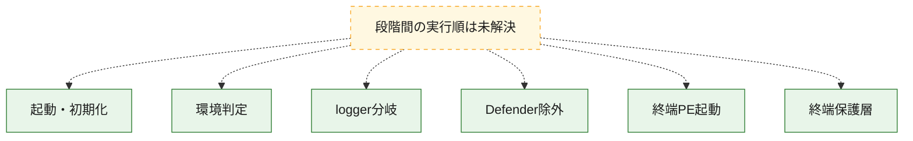
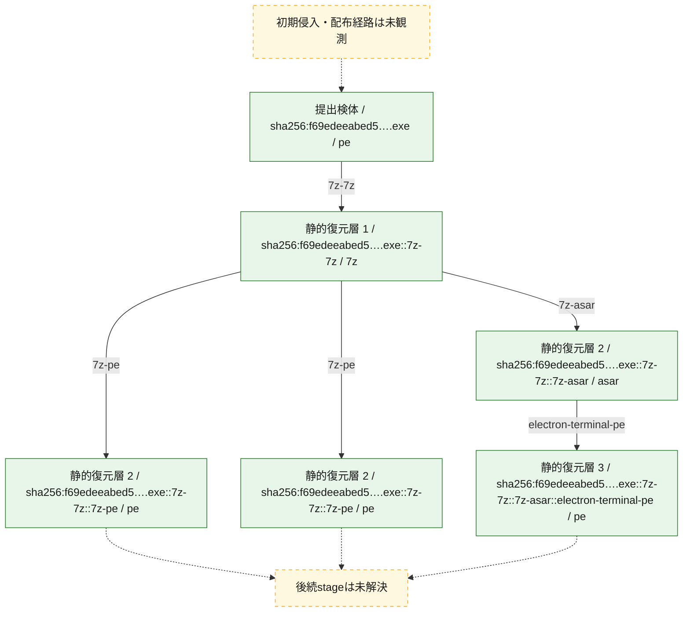
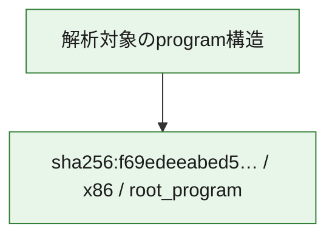

# 全体ロジック：f69edeeabed57cde46630459b12577c97ab13cf1bcd0c6f35bdcf5c6ff84cb7e

NSIS/Electron層から終端PEまでの静的復元と、復号sourceに基づく環境判定・logger・Defender除外・終端起動を確認しました。

## 読み方

- NSIS→7z→ASAR→終端PEは認証済みbyte lineage、環境判定→logger guard→Defender除外→終端起動は復号sourceの文順に基づきます。保護層以後のedgeは断定しません。
- 図の実線は静的に観測した関係、点線と黄色のノードは未観測・未解決の関係を示します。
- 図は静的な要約であり、動的実行を再現するものではありません。
- 詳細な関数解説とfingerprintは[STATIC-LOGIC.md](STATIC-LOGIC.md)を参照してください。

## 静的可視化

### 実行フロー

### 感染チェーン

### モジュール関係

## 処理段階

### 1. 起動・初期化

entry pointから初期化と後続処理への移行を確認します。
確度: `confirmed_static_function_evidence`

- `f69edeeabed57cde46630459b12577c97ab13cf1bcd0c6f35bdcf5c6ff84cb7e:ghidra:0040338f` — 初期化と主要処理への分岐を行う入口関数です。 状態: `succeeded`、選定理由: `entry_point`, `large_function:instructions=421`, `meaningful_symbol_name`, `reviewed_call_centrality:52`, `role:entrypoint`, `small_program_complete_context`

### 2. 環境判定

復号JavaScriptはRAM、CPU、name、ProductType、VM registry、BIOS/cloud、GPUを確認し、不適合時は後続処理を停止します。
確度: `confirmed_decoded_source`

### 3. logger分岐

logger値はplaceholderでscheme guardに拒否されるため、curl.exeは起動しません。
確度: `confirmed_decoded_source`

### 4. Defender除外

PowerShell Add-MpPreferenceで一時directory、終端PE path、終端process名を除外対象へ追加します。
確度: `confirmed_decoded_source`

### 5. 終端PE起動

%TEMP%配下の12hex名PEを引数なし、detached、stdio ignore、windowsHideで起動しunrefします。
確度: `confirmed_decoded_source`

### 6. 終端保護層

高entropy・anti-disassembly保護層の先にあるoriginal entry point、config、C2、dispatcherは未解決です。
確度: `confirmed_structure_with_static_limit`

## 観測したcall関係

- 代表関数間で直接解決できた呼出関係はありません。

## 解析範囲と制約

- 選定外関数は全体inventoryへ残しますが、関数本体の個別解説対象にはしていません。
- indirect call、難読化、packer、VM、壊れたcontrol flowによりcall関係が欠落する場合があります。
- 文書は静的解析に基づき、検体実行や外部通信による動的確認は行っていません。
- 終端PE保護層以後のoriginal entry point、config、C2、dispatcherは未解決です。
## 比較プロファイル

| 軸 | 値 |
|---|---|
| 実行段階 | `startup`, `environment_gate`, `logger_guard`, `defender_exclusion`, `terminal_spawn`, `terminal_protector` |
| 復元層 | `nsis`, `7z`, `asar`, `encrypted_dat`, `terminal_pe` |
| モジュール構成 | `root_nsis_loader`, `electron_asar_javascript`, `encrypted_terminal`, `protected_terminal_pe` |
| 挙動 | `generated_alphabet_rc4`, `aes_256_cbc_pkcs7`, `environment_evasion`, `defender_exclusion`, `detached_process_spawn` |
| 代表役割 | `loader`, `static_decoder`, `environment_gate`, `defense_evasion`, `terminal_launcher`, `protected_terminal` |
| fingerprint根拠 | root、nested 7z、ASAR、ciphertext、terminal PEのSHA-256とAES key/IV byte fingerprintを記録 |

## Electron終端の比較可能な静的証跡

- ASAR sibling相関: main script/key module/暗号化`.dat`を各1件へ一意化し、曖昧なら停止します。
- 変換: generated alphabet/RC4 → AES-256-CBC/PKCS7。key bytes SHA-256 `d212623ea1375f7fb0b130462f0150e21c9f20565bdc9f545a2a388a089000aa`、IV bytes SHA-256 `c89cb37b557079d73dc40a946d22887f8c792dc1b972f88c188cc5990e54b634`。生のkey/IVは公開しません。
- process: Defender除外は`powershell -NoProfile -ExecutionPolicy Bypass -WindowStyle Hidden -Command "Add-MpPreference -ExclusionPath '<tempdir>' -ErrorAction SilentlyContinue; Add-MpPreference -ExclusionPath '<tempdir>\<12hex>.exe' -ErrorAction SilentlyContinue; Add-MpPreference -ExclusionProcess '<12hex>.exe' -ErrorAction SilentlyContinue"`、終端は`"<tempdir>\<12hex>.exe"`（引数なし、detached、stdio ignore、windowsHide、unref）です。
- logger: placeholderがscheme guardを通らず、curl分岐は到達不能。
- 終端: `6ea19fc5764e641d3e8c4116e32232fd65f0d8e2da65c0f556959402c2cead75`、protector=`unknown_high_entropy_anti_disassembly`。protector→OEP→config→C2→dispatcherのedgeは未解決です。
