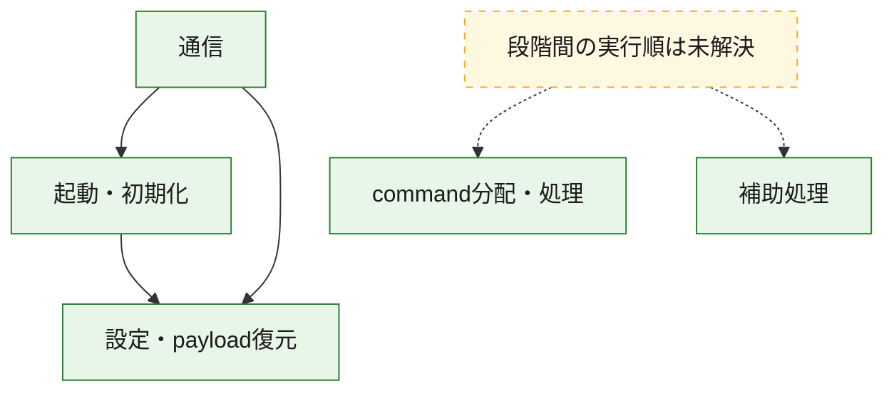
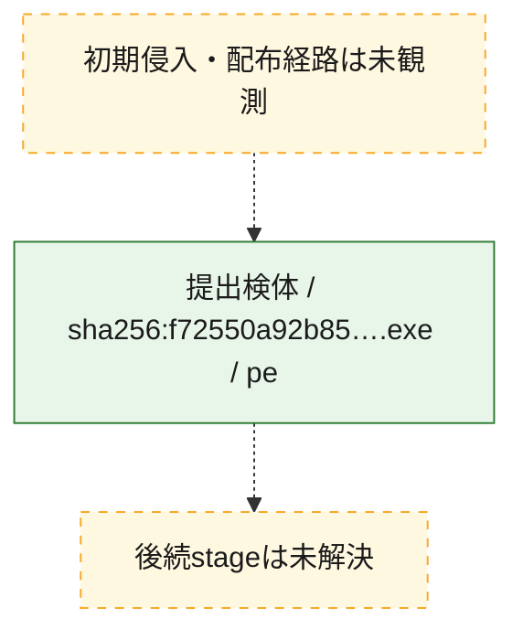
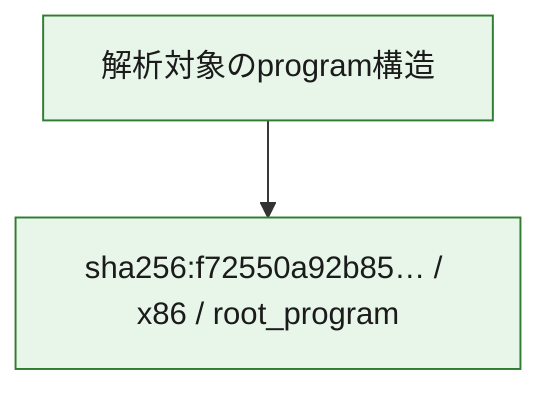

# 全体ロジック：f72550a92b850b6f923f710ac5d4ed32efb9a0aafaa57b7758b88e60f39c9818

代表関数の静的証跡から、起動・初期化、設定・payload復元、通信、command分配・処理の処理群を確認しました。

## 読み方

- phaseの掲載順は解析上の整理順です。observed_call_edgesがない段階間の実行順を断定しません。
- 図の実線は静的に観測した関係、点線と黄色のノードは未観測・未解決の関係を示します。
- 図は静的な要約であり、動的実行を再現するものではありません。
- 詳細な関数解説とfingerprintは[STATIC-LOGIC.md](STATIC-LOGIC.md)を参照してください。

## 静的可視化

### 実行フロー

### 感染チェーン

### モジュール関係

## 処理段階

### 1. 起動・初期化

entry pointから初期化と後続処理への移行を確認します。
確度: `confirmed_static_function_evidence`

- `f72550a92b850b6f923f710ac5d4ed32efb9a0aafaa57b7758b88e60f39c9818:ghidra:140009ba7` — 初期化と主要処理への分岐を行う入口関数です。 状態: `succeeded`、選定理由: `entry_point`, `meaningful_symbol_name`, `reviewed_call_centrality:7`, `role:entrypoint`
- `f72550a92b850b6f923f710ac5d4ed32efb9a0aafaa57b7758b88e60f39c9818:ghidra:14000ff54` — 初期化と主要処理への分岐を行う入口関数です。 状態: `succeeded`、選定理由: `entry_point`, `meaningful_symbol_name`, `probable_go_main_user_code`, `reviewed_call_centrality:23`, `role:entrypoint`

### 2. 設定・payload復元

設定、resource、payload、暗号化データの復元・変換を確認します。
確度: `confirmed_static_function_evidence`

- `f72550a92b850b6f923f710ac5d4ed32efb9a0aafaa57b7758b88e60f39c9818:ghidra:1400016e1` — 設定、resource、payloadなどの解析・変換を行う関数です。 状態: `succeeded`、選定理由: `meaningful_symbol_name`, `reviewed_call_centrality:1`, `role:config_or_data_transform`
- `f72550a92b850b6f923f710ac5d4ed32efb9a0aafaa57b7758b88e60f39c9818:ghidra:140001c94` — 設定、resource、payloadなどの解析・変換を行う関数です。 状態: `succeeded`、選定理由: `meaningful_symbol_name`, `reviewed_call_centrality:1`, `role:config_or_data_transform`
- `f72550a92b850b6f923f710ac5d4ed32efb9a0aafaa57b7758b88e60f39c9818:ghidra:1400022ae` — 暗号、hash、encoding、または復号処理に関係する関数です。 状態: `succeeded`、選定理由: `meaningful_symbol_name`, `reviewed_call_centrality:4`, `role:cryptographic_transform`
- `f72550a92b850b6f923f710ac5d4ed32efb9a0aafaa57b7758b88e60f39c9818:ghidra:140002ecc` — 暗号、hash、encoding、または復号処理に関係する関数です。 状態: `succeeded`、選定理由: `meaningful_symbol_name`, `reviewed_call_centrality:4`, `role:cryptographic_transform`
- `f72550a92b850b6f923f710ac5d4ed32efb9a0aafaa57b7758b88e60f39c9818:ghidra:140002fb6` — 暗号、hash、encoding、または復号処理に関係する関数です。 状態: `succeeded`、選定理由: `meaningful_symbol_name`, `reviewed_call_centrality:12`, `role:cryptographic_transform`
- `f72550a92b850b6f923f710ac5d4ed32efb9a0aafaa57b7758b88e60f39c9818:ghidra:1400031e9` — 設定、resource、payloadなどの解析・変換を行う関数です。 状態: `succeeded`、選定理由: `meaningful_symbol_name`, `reviewed_call_centrality:13`, `role:config_or_data_transform`
- `f72550a92b850b6f923f710ac5d4ed32efb9a0aafaa57b7758b88e60f39c9818:ghidra:140003c95` — 設定、resource、payloadなどの解析・変換を行う関数です。 状態: `succeeded`、選定理由: `meaningful_symbol_name`, `reviewed_call_centrality:1`, `role:config_or_data_transform`
- `f72550a92b850b6f923f710ac5d4ed32efb9a0aafaa57b7758b88e60f39c9818:ghidra:140005261` — 設定、resource、payloadなどの解析・変換を行う関数です。 状態: `succeeded`、選定理由: `meaningful_symbol_name`, `reviewed_call_centrality:2`, `role:config_or_data_transform`
- `f72550a92b850b6f923f710ac5d4ed32efb9a0aafaa57b7758b88e60f39c9818:ghidra:140005dfb` — 暗号、hash、encoding、または復号処理に関係する関数です。 状態: `succeeded`、選定理由: `meaningful_symbol_name`, `reviewed_call_centrality:2`, `role:cryptographic_transform`
- `f72550a92b850b6f923f710ac5d4ed32efb9a0aafaa57b7758b88e60f39c9818:ghidra:140005f7d` — 設定、resource、payloadなどの解析・変換を行う関数です。 状態: `succeeded`、選定理由: `meaningful_symbol_name`, `reviewed_call_centrality:12`, `role:config_or_data_transform`
- `f72550a92b850b6f923f710ac5d4ed32efb9a0aafaa57b7758b88e60f39c9818:ghidra:1400064c3` — 設定、resource、payloadなどの解析・変換を行う関数です。 状態: `succeeded`、選定理由: `meaningful_symbol_name`, `reviewed_call_centrality:9`, `role:config_or_data_transform`
- `f72550a92b850b6f923f710ac5d4ed32efb9a0aafaa57b7758b88e60f39c9818:ghidra:1400082f7` — 設定、resource、payloadなどの解析・変換を行う関数です。 状態: `succeeded`、選定理由: `meaningful_symbol_name`, `reviewed_call_centrality:1`, `role:config_or_data_transform`
- `f72550a92b850b6f923f710ac5d4ed32efb9a0aafaa57b7758b88e60f39c9818:ghidra:14000a75a` — 設定、resource、payloadなどの解析・変換を行う関数です。 状態: `succeeded`、選定理由: `meaningful_symbol_name`, `reviewed_call_centrality:7`, `role:config_or_data_transform`

### 3. 通信

通信初期化、endpoint処理、送受信の役割を確認します。
確度: `confirmed_static_function_evidence`

- `f72550a92b850b6f923f710ac5d4ed32efb9a0aafaa57b7758b88e60f39c9818:ghidra:140005b93` — 通信初期化、送受信、またはendpoint処理に関係する関数です。 状態: `succeeded`、選定理由: `meaningful_symbol_name`, `reviewed_call_centrality:3`, `role:network_communication`
- `f72550a92b850b6f923f710ac5d4ed32efb9a0aafaa57b7758b88e60f39c9818:ghidra:140006a82` — 通信初期化、送受信、またはendpoint処理に関係する関数です。 状態: `succeeded`、選定理由: `meaningful_symbol_name`, `reviewed_call_centrality:3`, `role:network_communication`
- `f72550a92b850b6f923f710ac5d4ed32efb9a0aafaa57b7758b88e60f39c9818:ghidra:1400076c2` — 通信初期化、送受信、またはendpoint処理に関係する関数です。 状態: `succeeded`、選定理由: `meaningful_symbol_name`, `reviewed_call_centrality:3`, `role:network_communication`
- `f72550a92b850b6f923f710ac5d4ed32efb9a0aafaa57b7758b88e60f39c9818:ghidra:1400090e9` — 通信初期化、送受信、またはendpoint処理に関係する関数です。 状態: `succeeded`、選定理由: `meaningful_symbol_name`, `reviewed_call_centrality:20`, `role:network_communication`
- `f72550a92b850b6f923f710ac5d4ed32efb9a0aafaa57b7758b88e60f39c9818:ghidra:140009329` — 通信初期化、送受信、またはendpoint処理に関係する関数です。 状態: `succeeded`、選定理由: `meaningful_symbol_name`, `reviewed_call_centrality:5`, `role:network_communication`
- `f72550a92b850b6f923f710ac5d4ed32efb9a0aafaa57b7758b88e60f39c9818:ghidra:140009686` — 通信初期化、送受信、またはendpoint処理に関係する関数です。 状態: `succeeded`、選定理由: `meaningful_symbol_name`, `reviewed_call_centrality:3`, `role:network_communication`
- `f72550a92b850b6f923f710ac5d4ed32efb9a0aafaa57b7758b88e60f39c9818:ghidra:1400096e5` — 通信初期化、送受信、またはendpoint処理に関係する関数です。 状態: `succeeded`、選定理由: `meaningful_symbol_name`, `reviewed_call_centrality:4`, `role:network_communication`
- `f72550a92b850b6f923f710ac5d4ed32efb9a0aafaa57b7758b88e60f39c9818:ghidra:140009821` — 通信初期化、送受信、またはendpoint処理に関係する関数です。 状態: `succeeded`、選定理由: `meaningful_symbol_name`, `reviewed_call_centrality:9`, `role:network_communication`
- `f72550a92b850b6f923f710ac5d4ed32efb9a0aafaa57b7758b88e60f39c9818:ghidra:140009f95` — 通信初期化、送受信、またはendpoint処理に関係する関数です。 状態: `succeeded`、選定理由: `meaningful_symbol_name`, `reviewed_call_centrality:3`, `role:network_communication`
- `f72550a92b850b6f923f710ac5d4ed32efb9a0aafaa57b7758b88e60f39c9818:ghidra:14000a089` — 通信初期化、送受信、またはendpoint処理に関係する関数です。 状態: `succeeded`、選定理由: `meaningful_symbol_name`, `reviewed_call_centrality:15`, `role:network_communication`
- `f72550a92b850b6f923f710ac5d4ed32efb9a0aafaa57b7758b88e60f39c9818:ghidra:14000b5f7` — 通信初期化、送受信、またはendpoint処理に関係する関数です。 状態: `succeeded`、選定理由: `meaningful_symbol_name`, `reviewed_call_centrality:11`, `role:network_communication`

### 4. command分配・処理

受信commandやtaskの解釈、分配、個別handlerへの移行を確認します。
確度: `confirmed_static_function_evidence`

- `f72550a92b850b6f923f710ac5d4ed32efb9a0aafaa57b7758b88e60f39c9818:ghidra:14000af39` — commandの解釈、分配、または個別処理を担当する関数です。 状態: `succeeded`、選定理由: `meaningful_symbol_name`, `reviewed_call_centrality:5`, `role:command_dispatch_or_handler`
- `f72550a92b850b6f923f710ac5d4ed32efb9a0aafaa57b7758b88e60f39c9818:ghidra:14000b7b4` — commandの解釈、分配、または個別処理を担当する関数です。 状態: `succeeded`、選定理由: `meaningful_symbol_name`, `reviewed_call_centrality:5`, `role:command_dispatch_or_handler`
- `f72550a92b850b6f923f710ac5d4ed32efb9a0aafaa57b7758b88e60f39c9818:ghidra:14000bbbb` — commandの解釈、分配、または個別処理を担当する関数です。 状態: `succeeded`、選定理由: `meaningful_symbol_name`, `reviewed_call_centrality:7`, `role:command_dispatch_or_handler`

### 5. 補助処理

主要処理を支える一般内部関数またはlibrary処理を確認します。
確度: `confirmed_static_function_evidence`

- `f72550a92b850b6f923f710ac5d4ed32efb9a0aafaa57b7758b88e60f39c9818:ghidra:140001410` — 検体内部の一般処理を実装する関数です。 状態: `succeeded`、選定理由: `entry_point`, `meaningful_symbol_name`, `reviewed_call_centrality:1`
- `f72550a92b850b6f923f710ac5d4ed32efb9a0aafaa57b7758b88e60f39c9818:ghidra:1400106f0` — compiler生成処理または汎用library処理とみられる関数です。 状態: `succeeded`、選定理由: `entry_point`, `meaningful_symbol_name`, `reviewed_call_centrality:1`
- `f72550a92b850b6f923f710ac5d4ed32efb9a0aafaa57b7758b88e60f39c9818:ghidra:140010720` — compiler生成処理または汎用library処理とみられる関数です。 状態: `succeeded`、選定理由: `entry_point`, `meaningful_symbol_name`, `reviewed_call_centrality:2`

## 観測したcall関係

- `f72550a92b850b6f923f710ac5d4ed32efb9a0aafaa57b7758b88e60f39c9818:ghidra:140002fb6` → `f72550a92b850b6f923f710ac5d4ed32efb9a0aafaa57b7758b88e60f39c9818:ghidra:140002ecc` （`configuration` → `configuration`）
- `f72550a92b850b6f923f710ac5d4ed32efb9a0aafaa57b7758b88e60f39c9818:ghidra:1400031e9` → `f72550a92b850b6f923f710ac5d4ed32efb9a0aafaa57b7758b88e60f39c9818:ghidra:140002ecc` （`configuration` → `configuration`）
- `f72550a92b850b6f923f710ac5d4ed32efb9a0aafaa57b7758b88e60f39c9818:ghidra:140005dfb` → `f72550a92b850b6f923f710ac5d4ed32efb9a0aafaa57b7758b88e60f39c9818:ghidra:1400022ae` （`configuration` → `configuration`）
- `f72550a92b850b6f923f710ac5d4ed32efb9a0aafaa57b7758b88e60f39c9818:ghidra:1400064c3` → `f72550a92b850b6f923f710ac5d4ed32efb9a0aafaa57b7758b88e60f39c9818:ghidra:1400031e9` （`configuration` → `configuration`）
- `f72550a92b850b6f923f710ac5d4ed32efb9a0aafaa57b7758b88e60f39c9818:ghidra:1400064c3` → `f72550a92b850b6f923f710ac5d4ed32efb9a0aafaa57b7758b88e60f39c9818:ghidra:140005f7d` （`configuration` → `configuration`）
- `f72550a92b850b6f923f710ac5d4ed32efb9a0aafaa57b7758b88e60f39c9818:ghidra:140006a82` → `f72550a92b850b6f923f710ac5d4ed32efb9a0aafaa57b7758b88e60f39c9818:ghidra:140005b93` （`communication` → `communication`）
- `f72550a92b850b6f923f710ac5d4ed32efb9a0aafaa57b7758b88e60f39c9818:ghidra:140009329` → `f72550a92b850b6f923f710ac5d4ed32efb9a0aafaa57b7758b88e60f39c9818:ghidra:1400090e9` （`communication` → `communication`）
- `f72550a92b850b6f923f710ac5d4ed32efb9a0aafaa57b7758b88e60f39c9818:ghidra:140009821` → `f72550a92b850b6f923f710ac5d4ed32efb9a0aafaa57b7758b88e60f39c9818:ghidra:140002fb6` （`communication` → `configuration`）
- `f72550a92b850b6f923f710ac5d4ed32efb9a0aafaa57b7758b88e60f39c9818:ghidra:140009821` → `f72550a92b850b6f923f710ac5d4ed32efb9a0aafaa57b7758b88e60f39c9818:ghidra:140009686` （`communication` → `communication`）
- `f72550a92b850b6f923f710ac5d4ed32efb9a0aafaa57b7758b88e60f39c9818:ghidra:14000a089` → `f72550a92b850b6f923f710ac5d4ed32efb9a0aafaa57b7758b88e60f39c9818:ghidra:140009ba7` （`communication` → `startup`）
- `f72550a92b850b6f923f710ac5d4ed32efb9a0aafaa57b7758b88e60f39c9818:ghidra:14000a089` → `f72550a92b850b6f923f710ac5d4ed32efb9a0aafaa57b7758b88e60f39c9818:ghidra:140009f95` （`communication` → `communication`）
- `f72550a92b850b6f923f710ac5d4ed32efb9a0aafaa57b7758b88e60f39c9818:ghidra:14000b5f7` → `f72550a92b850b6f923f710ac5d4ed32efb9a0aafaa57b7758b88e60f39c9818:ghidra:14000a089` （`communication` → `communication`）
- `f72550a92b850b6f923f710ac5d4ed32efb9a0aafaa57b7758b88e60f39c9818:ghidra:14000ff54` → `f72550a92b850b6f923f710ac5d4ed32efb9a0aafaa57b7758b88e60f39c9818:ghidra:1400064c3` （`startup` → `configuration`）
- `ghidra-function:01d786c2eb1417e0d0f6851f` → `ghidra-external:3f51ce7b5436875a7a9f25f6` （`unclassified` → `unclassified`）
- `ghidra-function:01d786c2eb1417e0d0f6851f` → `ghidra-external:6bda836b02b4ba9e1dfd50fb` （`unclassified` → `unclassified`）
- `ghidra-function:01d786c2eb1417e0d0f6851f` → `ghidra-function:2429b7a93af437095fee2505` （`unclassified` → `unclassified`）
- `ghidra-function:01d786c2eb1417e0d0f6851f` → `ghidra-function:5814d8e5c4d98ef6772f83ae` （`unclassified` → `unclassified`）
- `ghidra-function:01d786c2eb1417e0d0f6851f` → `ghidra-function:cd0df774a28f257010e12ce8` （`unclassified` → `unclassified`）
- `ghidra-function:0647148cab4978cda8f3770d` → `ghidra-function:cee4cdd0997b5590263edc09` （`unclassified` → `unclassified`）
- `ghidra-function:09479752ecc6d5a70036cc3d` → `ghidra-external:1789088de45a53600c3ebfe3` （`unclassified` → `unclassified`）
- `ghidra-function:09479752ecc6d5a70036cc3d` → `ghidra-external:3f51ce7b5436875a7a9f25f6` （`unclassified` → `unclassified`）
- `ghidra-function:167983d753a62ad47ebd4b84` → `ghidra-external:1789088de45a53600c3ebfe3` （`unclassified` → `unclassified`）
- `ghidra-function:167983d753a62ad47ebd4b84` → `ghidra-external:278c615bd331a623f5b920ba` （`unclassified` → `unclassified`）
- `ghidra-function:167983d753a62ad47ebd4b84` → `ghidra-external:3f51ce7b5436875a7a9f25f6` （`unclassified` → `unclassified`）
- `ghidra-function:167983d753a62ad47ebd4b84` → `ghidra-external:d1b285ec79f3c8f2bcfa1d85` （`unclassified` → `unclassified`）
- `ghidra-function:167983d753a62ad47ebd4b84` → `ghidra-function:566b4d1d2a7c363a36dd2fdc` （`unclassified` → `unclassified`）
- `ghidra-function:167983d753a62ad47ebd4b84` → `ghidra-function:6303d51a4ab3187cbf39db4f` （`unclassified` → `unclassified`）
- `ghidra-function:17a7b2c5c536c9263d57bcf2` → `ghidra-external:6d1deb36b61fe1b21e2b307f` （`unclassified` → `unclassified`）
- `ghidra-function:17a7b2c5c536c9263d57bcf2` → `ghidra-external:c18b7eca34f18210226ee4cd` （`unclassified` → `unclassified`）
- `ghidra-function:17a7b2c5c536c9263d57bcf2` → `ghidra-external:cb01bcb3249c229cffae1bac` （`unclassified` → `unclassified`）
- `ghidra-function:17a7b2c5c536c9263d57bcf2` → `ghidra-external:d1b8d5bd2e6ef3db7bb343ea` （`unclassified` → `unclassified`）
- `ghidra-function:17a7b2c5c536c9263d57bcf2` → `ghidra-external:f628e8b0df12e19bed671587` （`unclassified` → `unclassified`）
- `ghidra-function:17a7b2c5c536c9263d57bcf2` → `ghidra-function:787b6c49f990d124e61a9da8` （`unclassified` → `unclassified`）
- `ghidra-function:17a7b2c5c536c9263d57bcf2` → `ghidra-function:7a24eeccda2a081b64105a0b` （`unclassified` → `unclassified`）
- `ghidra-function:17a7b2c5c536c9263d57bcf2` → `ghidra-function:87ba1d319dca78351717478c` （`unclassified` → `unclassified`）
- `ghidra-function:17a7b2c5c536c9263d57bcf2` → `ghidra-function:8e47e299ad8971c513969307` （`unclassified` → `unclassified`）
- `ghidra-function:17a7b2c5c536c9263d57bcf2` → `ghidra-function:b5d7c0bfc8f29fc6e00b5e0a` （`unclassified` → `unclassified`）
- `ghidra-function:17a7b2c5c536c9263d57bcf2` → `ghidra-function:d52b743280c09d2f619ee66f` （`unclassified` → `unclassified`）
- `ghidra-function:17a7b2c5c536c9263d57bcf2` → `ghidra-function:df1f1733683eaeae25e1a38b` （`unclassified` → `unclassified`）
- `ghidra-function:259113d0f4ea55382ec880a6` → `ghidra-external:ce772c1b194cf3130bbb7604` （`unclassified` → `unclassified`）
- `ghidra-function:2bda5e78b41fcd987de58340` → `ghidra-external:741491ce6ef7f3f99c27cb0e` （`unclassified` → `unclassified`）
- `ghidra-function:2bda5e78b41fcd987de58340` → `ghidra-function:704f9784a0507f59e14210a9` （`unclassified` → `unclassified`）
- `ghidra-function:2bda5e78b41fcd987de58340` → `ghidra-function:75c8abdaf3ac59bdbb28e7f2` （`unclassified` → `unclassified`）
- `ghidra-function:2bda5e78b41fcd987de58340` → `ghidra-function:827f1d7656a9d5fef4ebd2c2` （`unclassified` → `unclassified`）
- `ghidra-function:2bda5e78b41fcd987de58340` → `ghidra-function:89b3b72931a44abdfae6c9bd` （`unclassified` → `unclassified`）
- `ghidra-function:2bda5e78b41fcd987de58340` → `ghidra-function:a919e85865f879ccfb416db3` （`unclassified` → `unclassified`）
- `ghidra-function:2bda5e78b41fcd987de58340` → `ghidra-function:acf5644b7099935576cf9eae` （`unclassified` → `unclassified`）
- `ghidra-function:2bda5e78b41fcd987de58340` → `ghidra-function:cd01351386081e130018eaf4` （`unclassified` → `unclassified`）
- `ghidra-function:2bda5e78b41fcd987de58340` → `ghidra-function:cecd0c41eaeeb3371ada6169` （`unclassified` → `unclassified`）
- `ghidra-function:2f6c617fcafa8ae8abe20a8d` → `ghidra-external:6d1deb36b61fe1b21e2b307f` （`unclassified` → `unclassified`）
- `ghidra-function:2f6c617fcafa8ae8abe20a8d` → `ghidra-function:17a7b2c5c536c9263d57bcf2` （`unclassified` → `unclassified`）
- `ghidra-function:2f6c617fcafa8ae8abe20a8d` → `ghidra-function:538d1eae165756aadae111a4` （`unclassified` → `unclassified`）
- `ghidra-function:2f6c617fcafa8ae8abe20a8d` → `ghidra-function:6d602b233cf46511caabe495` （`unclassified` → `unclassified`）
- `ghidra-function:34a5a904ee6f3648e1534e17` → `ghidra-external:24b73ab861672de76a2c4fb8` （`unclassified` → `unclassified`）
- `ghidra-function:34a5a904ee6f3648e1534e17` → `ghidra-external:3f51ce7b5436875a7a9f25f6` （`unclassified` → `unclassified`）
- `ghidra-function:34a5a904ee6f3648e1534e17` → `ghidra-external:6bda836b02b4ba9e1dfd50fb` （`unclassified` → `unclassified`）
- `ghidra-function:34a5a904ee6f3648e1534e17` → `ghidra-external:6d1deb36b61fe1b21e2b307f` （`unclassified` → `unclassified`）
- `ghidra-function:34a5a904ee6f3648e1534e17` → `ghidra-external:b00351fdae0545cba44977d9` （`unclassified` → `unclassified`）
- `ghidra-function:34a5a904ee6f3648e1534e17` → `ghidra-function:2429b7a93af437095fee2505` （`unclassified` → `unclassified`）
- `ghidra-function:34a5a904ee6f3648e1534e17` → `ghidra-function:5814d8e5c4d98ef6772f83ae` （`unclassified` → `unclassified`）
- `ghidra-function:34a5a904ee6f3648e1534e17` → `ghidra-function:6506d1e171cf40edf1de3931` （`unclassified` → `unclassified`）
- `ghidra-function:34a5a904ee6f3648e1534e17` → `ghidra-function:cd0df774a28f257010e12ce8` （`unclassified` → `unclassified`）
- `ghidra-function:34a5a904ee6f3648e1534e17` → `ghidra-function:e2c1fb1c0267865ea66d205e` （`unclassified` → `unclassified`）
- `ghidra-function:34a5a904ee6f3648e1534e17` → `ghidra-function:e74fe84b923390cce794203f` （`unclassified` → `unclassified`）
- `ghidra-function:3751db489be56f4ee531df9d` → `ghidra-function:5318bcaff72110ccac2a7957` （`unclassified` → `unclassified`）
- `ghidra-function:3b975116b4277faab49d2182` → `ghidra-external:0d03c354ee86ac1ef8d1ffc7` （`unclassified` → `unclassified`）
- `ghidra-function:3b975116b4277faab49d2182` → `ghidra-external:741491ce6ef7f3f99c27cb0e` （`unclassified` → `unclassified`）
- `ghidra-function:3b975116b4277faab49d2182` → `ghidra-external:c2bcf0880cf8f9c889ff35bf` （`unclassified` → `unclassified`）
- `ghidra-function:3b975116b4277faab49d2182` → `ghidra-function:c88c67bcaefebf0416435fb9` （`unclassified` → `unclassified`）
- `ghidra-function:47f90d8f93b983f29fd54c72` → `ghidra-function:7112c6f94c10d479cb9e6977` （`unclassified` → `unclassified`）
- `ghidra-function:4a7cc385f55e3b8ffc005176` → `ghidra-external:e849d26b1e621a14d7797fa4` （`unclassified` → `unclassified`）
- `ghidra-function:4a7cc385f55e3b8ffc005176` → `ghidra-function:7112c6f94c10d479cb9e6977` （`unclassified` → `unclassified`）
- `ghidra-function:5267a28ae9826a5469377abc` → `ghidra-external:3f51ce7b5436875a7a9f25f6` （`unclassified` → `unclassified`）
- `ghidra-function:5267a28ae9826a5469377abc` → `ghidra-external:48a9623335909ff90aa58cff` （`unclassified` → `unclassified`）
- `ghidra-function:5267a28ae9826a5469377abc` → `ghidra-external:5fe1c97769c220106f8fe53b` （`unclassified` → `unclassified`）
- `ghidra-function:5267a28ae9826a5469377abc` → `ghidra-external:6d1deb36b61fe1b21e2b307f` （`unclassified` → `unclassified`）
- `ghidra-function:5267a28ae9826a5469377abc` → `ghidra-external:6f9c88a213d494b99fe14a90` （`unclassified` → `unclassified`）
- `ghidra-function:5267a28ae9826a5469377abc` → `ghidra-external:741491ce6ef7f3f99c27cb0e` （`unclassified` → `unclassified`）
- `ghidra-function:5267a28ae9826a5469377abc` → `ghidra-external:c2bcf0880cf8f9c889ff35bf` （`unclassified` → `unclassified`）
- `ghidra-function:5267a28ae9826a5469377abc` → `ghidra-external:fce2a5833a38e8dfff1851be` （`unclassified` → `unclassified`）
- `ghidra-function:5267a28ae9826a5469377abc` → `ghidra-function:167983d753a62ad47ebd4b84` （`unclassified` → `unclassified`）
- `ghidra-function:5267a28ae9826a5469377abc` → `ghidra-function:6d602b233cf46511caabe495` （`unclassified` → `unclassified`）
- `ghidra-function:5267a28ae9826a5469377abc` → `ghidra-function:840de83f6f36e172e328b62c` （`unclassified` → `unclassified`）
- `ghidra-function:5267a28ae9826a5469377abc` → `ghidra-function:b1b577870af88187f196e818` （`unclassified` → `unclassified`）
- `ghidra-function:5267a28ae9826a5469377abc` → `ghidra-function:b34d676b0f65454425a646d5` （`unclassified` → `unclassified`）
- `ghidra-function:5b31fc7aa12e1007fa0cb253` → `ghidra-function:93173636f7d59769b5d82ade` （`unclassified` → `unclassified`）
- `ghidra-function:6f6ded8a5deda3aecb83213f` → `ghidra-external:3f51ce7b5436875a7a9f25f6` （`unclassified` → `unclassified`）
- `ghidra-function:6f6ded8a5deda3aecb83213f` → `ghidra-external:6bda836b02b4ba9e1dfd50fb` （`unclassified` → `unclassified`）
- `ghidra-function:6f6ded8a5deda3aecb83213f` → `ghidra-function:2429b7a93af437095fee2505` （`unclassified` → `unclassified`）
- `ghidra-function:6f6ded8a5deda3aecb83213f` → `ghidra-function:cd0df774a28f257010e12ce8` （`unclassified` → `unclassified`）
- `ghidra-function:6f6ded8a5deda3aecb83213f` → `ghidra-function:e74fe84b923390cce794203f` （`unclassified` → `unclassified`）
- `ghidra-function:75c8abdaf3ac59bdbb28e7f2` → `ghidra-external:33a45297b5422ececa5d5e32` （`unclassified` → `unclassified`）
- `ghidra-function:75c8abdaf3ac59bdbb28e7f2` → `ghidra-function:361c8c9a7effe5dd27897272` （`unclassified` → `unclassified`）
- `ghidra-function:776dfe9f3f24d0f212cbf56a` → `ghidra-function:3c62d5e9a7db84f1abb45db2` （`unclassified` → `unclassified`）
- `ghidra-function:776dfe9f3f24d0f212cbf56a` → `ghidra-function:a80a7f823f26873dbd28371d` （`unclassified` → `unclassified`）
- `ghidra-function:8381a7bcfa1d50869239f965` → `ghidra-external:6d1deb36b61fe1b21e2b307f` （`unclassified` → `unclassified`）
- `ghidra-function:8381a7bcfa1d50869239f965` → `ghidra-external:741491ce6ef7f3f99c27cb0e` （`unclassified` → `unclassified`）
- `ghidra-function:8381a7bcfa1d50869239f965` → `ghidra-external:c18b7eca34f18210226ee4cd` （`unclassified` → `unclassified`）
- `ghidra-function:8381a7bcfa1d50869239f965` → `ghidra-function:34a5a904ee6f3648e1534e17` （`unclassified` → `unclassified`）
- `ghidra-function:8381a7bcfa1d50869239f965` → `ghidra-function:538d1eae165756aadae111a4` （`unclassified` → `unclassified`）
- `ghidra-function:8381a7bcfa1d50869239f965` → `ghidra-function:6d602b233cf46511caabe495` （`unclassified` → `unclassified`）
- `ghidra-function:8381a7bcfa1d50869239f965` → `ghidra-function:8a65e3332d00dce4a20a5dd0` （`unclassified` → `unclassified`）
- `ghidra-function:846ce655f2a10840f6830206` → `ghidra-function:94f60c5fd0a2a7e2107e01fb` （`unclassified` → `unclassified`）
- `ghidra-function:846ce655f2a10840f6830206` → `ghidra-function:a6324533fcf3632d4987ddcf` （`unclassified` → `unclassified`）
- `ghidra-function:8a65e3332d00dce4a20a5dd0` → `ghidra-external:3f51ce7b5436875a7a9f25f6` （`unclassified` → `unclassified`）
- `ghidra-function:8a65e3332d00dce4a20a5dd0` → `ghidra-external:85c1e9b90e952f8011e91ced` （`unclassified` → `unclassified`）
- `ghidra-function:8a65e3332d00dce4a20a5dd0` → `ghidra-external:98a46ab2d6ca7cfd98ca4fcc` （`unclassified` → `unclassified`）
- `ghidra-function:8a65e3332d00dce4a20a5dd0` → `ghidra-external:9cfd191f50835b416a28a966` （`unclassified` → `unclassified`）
- `ghidra-function:8a65e3332d00dce4a20a5dd0` → `ghidra-external:a98d7bad84089390298ebd02` （`unclassified` → `unclassified`）
- `ghidra-function:8a65e3332d00dce4a20a5dd0` → `ghidra-external:ae59b9bbef8e463917b28d0b` （`unclassified` → `unclassified`）
- `ghidra-function:8a65e3332d00dce4a20a5dd0` → `ghidra-external:c2bcf0880cf8f9c889ff35bf` （`unclassified` → `unclassified`）
- `ghidra-function:8a65e3332d00dce4a20a5dd0` → `ghidra-function:3c62d5e9a7db84f1abb45db2` （`unclassified` → `unclassified`）
- `ghidra-function:8a65e3332d00dce4a20a5dd0` → `ghidra-function:76c353a141fd67a9c3af39ce` （`unclassified` → `unclassified`）
- `ghidra-function:8a65e3332d00dce4a20a5dd0` → `ghidra-function:776dfe9f3f24d0f212cbf56a` （`unclassified` → `unclassified`）
- `ghidra-function:8a65e3332d00dce4a20a5dd0` → `ghidra-function:a80a7f823f26873dbd28371d` （`unclassified` → `unclassified`）
- `ghidra-function:8a65e3332d00dce4a20a5dd0` → `ghidra-function:b79b29d2dad1d8c07def43ca` （`unclassified` → `unclassified`）
- `ghidra-function:9018a219c74873e99301b0bd` → `ghidra-external:24b73ab861672de76a2c4fb8` （`unclassified` → `unclassified`）
- `ghidra-function:9018a219c74873e99301b0bd` → `ghidra-function:5e9aa064a3ed3c7a4ff98e07` （`unclassified` → `unclassified`）
- `ghidra-function:9018a219c74873e99301b0bd` → `ghidra-function:bcf24ec42f0bae34608f1da3` （`unclassified` → `unclassified`）
- `ghidra-function:91d89450a4ca876b752e141f` → `ghidra-external:24b73ab861672de76a2c4fb8` （`unclassified` → `unclassified`）
- `ghidra-function:91d89450a4ca876b752e141f` → `ghidra-external:4788b0401fb35d22c073b29f` （`unclassified` → `unclassified`）
- `ghidra-function:91d89450a4ca876b752e141f` → `ghidra-external:6d1deb36b61fe1b21e2b307f` （`unclassified` → `unclassified`）
- `ghidra-function:91d89450a4ca876b752e141f` → `ghidra-external:b00351fdae0545cba44977d9` （`unclassified` → `unclassified`）
- `ghidra-function:91d89450a4ca876b752e141f` → `ghidra-function:37d182f8c56bb20939bc4fe7` （`unclassified` → `unclassified`）
- `ghidra-function:91d89450a4ca876b752e141f` → `ghidra-function:3a5265e9a5b40d4079d6681e` （`unclassified` → `unclassified`）
- `ghidra-function:91d89450a4ca876b752e141f` → `ghidra-function:46e095060f8c2005395aadcd` （`unclassified` → `unclassified`）
- `ghidra-function:91d89450a4ca876b752e141f` → `ghidra-function:47ea4fcdbe9b5e2ce0decbd4` （`unclassified` → `unclassified`）
- `ghidra-function:91d89450a4ca876b752e141f` → `ghidra-function:5616bfbafd9f0b439db40f47` （`unclassified` → `unclassified`）
- `ghidra-function:91d89450a4ca876b752e141f` → `ghidra-function:5637e399e352ae84d5cf45f5` （`unclassified` → `unclassified`）
- `ghidra-function:91d89450a4ca876b752e141f` → `ghidra-function:6248dcba5e853a15040b5d74` （`unclassified` → `unclassified`）
- `ghidra-function:91d89450a4ca876b752e141f` → `ghidra-function:8105b37c23b5a3607b40c085` （`unclassified` → `unclassified`）
- `ghidra-function:91d89450a4ca876b752e141f` → `ghidra-function:8381a7bcfa1d50869239f965` （`unclassified` → `unclassified`）
- `ghidra-function:91d89450a4ca876b752e141f` → `ghidra-function:9ea06bde65c42ea83b504650` （`unclassified` → `unclassified`）
- `ghidra-function:91d89450a4ca876b752e141f` → `ghidra-function:a5745aabcea9f464c10b2349` （`unclassified` → `unclassified`）
- `ghidra-function:91d89450a4ca876b752e141f` → `ghidra-function:cd01351386081e130018eaf4` （`unclassified` → `unclassified`）
- `ghidra-function:91d89450a4ca876b752e141f` → `ghidra-function:d482c4933a9b6596232aa785` （`unclassified` → `unclassified`）
- `ghidra-function:91d89450a4ca876b752e141f` → `ghidra-function:eb9902d655281224dad75240` （`unclassified` → `unclassified`）
- `ghidra-function:91d89450a4ca876b752e141f` → `ghidra-function:ec7c8eba07c9b1bd96657718` （`unclassified` → `unclassified`）
- `ghidra-function:91d89450a4ca876b752e141f` → `ghidra-function:f4f5138a0e167b44e01c4250` （`unclassified` → `unclassified`）
- `ghidra-function:94f60c5fd0a2a7e2107e01fb` → `ghidra-function:40dd34109ac215ea77b131ba` （`unclassified` → `unclassified`）
- `ghidra-function:94f60c5fd0a2a7e2107e01fb` → `ghidra-function:91a27bd0a55a6cf281644309` （`unclassified` → `unclassified`）
- `ghidra-function:94f60c5fd0a2a7e2107e01fb` → `ghidra-function:94821ae2219292993fcfc8d6` （`unclassified` → `unclassified`）
- `ghidra-function:99855afb40d11f36aee7a5db` → `ghidra-external:3f51ce7b5436875a7a9f25f6` （`unclassified` → `unclassified`）
- `ghidra-function:99855afb40d11f36aee7a5db` → `ghidra-external:c2bcf0880cf8f9c889ff35bf` （`unclassified` → `unclassified`）
- `ghidra-function:99855afb40d11f36aee7a5db` → `ghidra-function:bd291df5feacbaaf637427cf` （`unclassified` → `unclassified`）
- `ghidra-function:9c6bfacdf7ab5fd74d417749` → `ghidra-external:32dd3378d704326b9b49a945` （`unclassified` → `unclassified`）
- `ghidra-function:9c6bfacdf7ab5fd74d417749` → `ghidra-external:3f51ce7b5436875a7a9f25f6` （`unclassified` → `unclassified`）
- `ghidra-function:9c6bfacdf7ab5fd74d417749` → `ghidra-external:4ed50b871dc48199a071576f` （`unclassified` → `unclassified`）
- `ghidra-function:9c6bfacdf7ab5fd74d417749` → `ghidra-external:6d1deb36b61fe1b21e2b307f` （`unclassified` → `unclassified`）
- `ghidra-function:9c6bfacdf7ab5fd74d417749` → `ghidra-external:cb01bcb3249c229cffae1bac` （`unclassified` → `unclassified`）
- `ghidra-function:9c6bfacdf7ab5fd74d417749` → `ghidra-external:ce772c1b194cf3130bbb7604` （`unclassified` → `unclassified`）
- `ghidra-function:9c6bfacdf7ab5fd74d417749` → `ghidra-external:d1b8d5bd2e6ef3db7bb343ea` （`unclassified` → `unclassified`）
- `ghidra-function:acf5644b7099935576cf9eae` → `ghidra-external:85c1e9b90e952f8011e91ced` （`unclassified` → `unclassified`）
- `ghidra-function:acf5644b7099935576cf9eae` → `ghidra-external:98a46ab2d6ca7cfd98ca4fcc` （`unclassified` → `unclassified`）
- `ghidra-function:acf5644b7099935576cf9eae` → `ghidra-external:9cfd191f50835b416a28a966` （`unclassified` → `unclassified`）
- `ghidra-function:acf5644b7099935576cf9eae` → `ghidra-external:a98d7bad84089390298ebd02` （`unclassified` → `unclassified`）
- `ghidra-function:acf5644b7099935576cf9eae` → `ghidra-external:c2bcf0880cf8f9c889ff35bf` （`unclassified` → `unclassified`）
- `ghidra-function:acf5644b7099935576cf9eae` → `ghidra-function:3c62d5e9a7db84f1abb45db2` （`unclassified` → `unclassified`）
- `ghidra-function:acf5644b7099935576cf9eae` → `ghidra-function:76c353a141fd67a9c3af39ce` （`unclassified` → `unclassified`）
- `ghidra-function:acf5644b7099935576cf9eae` → `ghidra-function:776dfe9f3f24d0f212cbf56a` （`unclassified` → `unclassified`）
- `ghidra-function:acf5644b7099935576cf9eae` → `ghidra-function:a80a7f823f26873dbd28371d` （`unclassified` → `unclassified`）
- `ghidra-function:acf5644b7099935576cf9eae` → `ghidra-function:b79b29d2dad1d8c07def43ca` （`unclassified` → `unclassified`）
- `ghidra-function:acf5644b7099935576cf9eae` → `ghidra-function:ec7c8eba07c9b1bd96657718` （`unclassified` → `unclassified`）
- `ghidra-function:b1b577870af88187f196e818` → `ghidra-external:741491ce6ef7f3f99c27cb0e` （`unclassified` → `unclassified`）
- `ghidra-function:b1b577870af88187f196e818` → `ghidra-external:c18b7eca34f18210226ee4cd` （`unclassified` → `unclassified`）
- `ghidra-function:b9451353880dc4e8e49e0cf1` → `ghidra-function:3b076a726725a6e90f95b4b4` （`unclassified` → `unclassified`）
- `ghidra-function:b9451353880dc4e8e49e0cf1` → `ghidra-function:5267a28ae9826a5469377abc` （`unclassified` → `unclassified`）
- `ghidra-function:b9451353880dc4e8e49e0cf1` → `ghidra-function:704f9784a0507f59e14210a9` （`unclassified` → `unclassified`）
- `ghidra-function:b9451353880dc4e8e49e0cf1` → `ghidra-function:81322327e81cae97e9a2dd82` （`unclassified` → `unclassified`）
- `ghidra-function:b9451353880dc4e8e49e0cf1` → `ghidra-function:827f1d7656a9d5fef4ebd2c2` （`unclassified` → `unclassified`）
- `ghidra-function:b9451353880dc4e8e49e0cf1` → `ghidra-function:83cafd308e45de502677fb05` （`unclassified` → `unclassified`）
- `ghidra-function:b9451353880dc4e8e49e0cf1` → `ghidra-function:9fdcc62199c34523da6ac95c` （`unclassified` → `unclassified`）
- `ghidra-function:b9451353880dc4e8e49e0cf1` → `ghidra-function:a9691eca4fb131ffefb91d91` （`unclassified` → `unclassified`）
- `ghidra-function:b9451353880dc4e8e49e0cf1` → `ghidra-function:cd01351386081e130018eaf4` （`unclassified` → `unclassified`）
- `ghidra-function:b9451353880dc4e8e49e0cf1` → `ghidra-function:cecd0c41eaeeb3371ada6169` （`unclassified` → `unclassified`）
- `ghidra-function:b9451353880dc4e8e49e0cf1` → `ghidra-function:d283b7ac95a4146f61f40d6a` （`unclassified` → `unclassified`）
- `ghidra-function:bcf24ec42f0bae34608f1da3` → `ghidra-function:174d58d29e4e190d8f1637d1` （`unclassified` → `unclassified`）
- `ghidra-function:bcf24ec42f0bae34608f1da3` → `ghidra-function:9fb1e083c7c5281185b7eb52` （`unclassified` → `unclassified`）
- `ghidra-function:dac22d11795a25dec0d9a86a` → `ghidra-function:3b076a726725a6e90f95b4b4` （`unclassified` → `unclassified`）
- `ghidra-function:dac22d11795a25dec0d9a86a` → `ghidra-function:704f9784a0507f59e14210a9` （`unclassified` → `unclassified`）
- `ghidra-function:dac22d11795a25dec0d9a86a` → `ghidra-function:827f1d7656a9d5fef4ebd2c2` （`unclassified` → `unclassified`）
- `ghidra-function:dac22d11795a25dec0d9a86a` → `ghidra-function:9fdcc62199c34523da6ac95c` （`unclassified` → `unclassified`）
- `ghidra-function:dac22d11795a25dec0d9a86a` → `ghidra-function:cd01351386081e130018eaf4` （`unclassified` → `unclassified`）
- `ghidra-function:dac22d11795a25dec0d9a86a` → `ghidra-function:cecd0c41eaeeb3371ada6169` （`unclassified` → `unclassified`）
- `ghidra-function:dac22d11795a25dec0d9a86a` → `ghidra-function:dd59d00ccda796499b876c90` （`unclassified` → `unclassified`）
- `ghidra-function:f870026cfa82deab40c37061` → `ghidra-function:7a7842b16e6850f7f5556343` （`unclassified` → `unclassified`）

## 解析範囲と制約

- 選定外関数は全体inventoryへ残しますが、関数本体の個別解説対象にはしていません。
- indirect call、難読化、packer、VM、壊れたcontrol flowによりcall関係が欠落する場合があります。
- 文書は静的解析に基づき、検体実行や外部通信による動的確認は行っていません。
