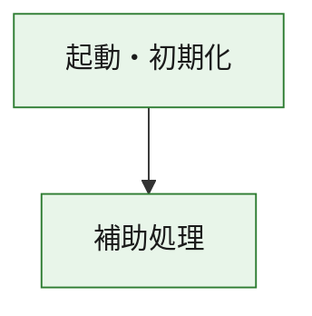
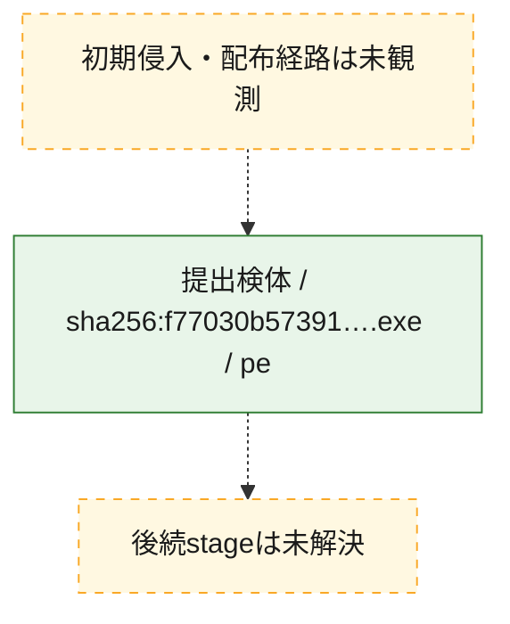
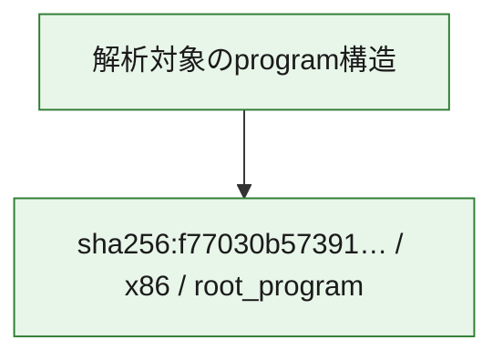

# 全体ロジック：f77030b57391e0e9dd2e71394d4ab9dcaf8cafc0e924729e034857b06010ac4a

代表関数の静的証跡から、起動・初期化の処理群を確認しました。

## 読み方

- phaseの掲載順は解析上の整理順です。observed_call_edgesがない段階間の実行順を断定しません。
- 図の実線は静的に観測した関係、点線と黄色のノードは未観測・未解決の関係を示します。
- 図は静的な要約であり、動的実行を再現するものではありません。
- 詳細な関数解説とfingerprintは[STATIC-LOGIC.md](STATIC-LOGIC.md)を参照してください。

## 静的可視化

### 実行フロー

### 感染チェーン

### モジュール関係

## 処理段階

### 1. 起動・初期化

entry pointから初期化と後続処理への移行を確認します。
確度: `confirmed_static_function_evidence`

- `f77030b57391e0e9dd2e71394d4ab9dcaf8cafc0e924729e034857b06010ac4a:ghidra:180001010` — 初期化と主要処理への分岐を行う入口関数です。 状態: `succeeded`、選定理由: `entry_point`, `meaningful_symbol_name`, `reviewed_call_centrality:22`, `role:entrypoint`, `small_program_complete_context`

### 2. 補助処理

主要処理を支える一般内部関数またはlibrary処理を確認します。
確度: `confirmed_static_function_evidence`

- `f77030b57391e0e9dd2e71394d4ab9dcaf8cafc0e924729e034857b06010ac4a:ghidra:180001240` — 検体内部の一般処理を実装する関数です。 状態: `succeeded`、選定理由: `context_representative`, `reviewed_call_centrality:2`, `small_program_complete_context`
- `f77030b57391e0e9dd2e71394d4ab9dcaf8cafc0e924729e034857b06010ac4a:ghidra:180001350` — 検体内部の一般処理を実装する関数です。 状態: `succeeded`、選定理由: `context_representative`, `reviewed_call_centrality:25`, `small_program_complete_context`
- `f77030b57391e0e9dd2e71394d4ab9dcaf8cafc0e924729e034857b06010ac4a:ghidra:180003780` — 検体内部の一般処理を実装する関数です。 状態: `succeeded`、選定理由: `context_representative`, `reviewed_call_centrality:2`, `small_program_complete_context`
- `f77030b57391e0e9dd2e71394d4ab9dcaf8cafc0e924729e034857b06010ac4a:ghidra:1800038e0` — 検体内部の一般処理を実装する関数です。 状態: `succeeded`、選定理由: `context_representative`, `reviewed_call_centrality:2`, `small_program_complete_context`

## 観測したcall関係

- `f77030b57391e0e9dd2e71394d4ab9dcaf8cafc0e924729e034857b06010ac4a:ghidra:180001010` → `f77030b57391e0e9dd2e71394d4ab9dcaf8cafc0e924729e034857b06010ac4a:ghidra:180001240` （`startup` → `support`）
- `f77030b57391e0e9dd2e71394d4ab9dcaf8cafc0e924729e034857b06010ac4a:ghidra:180001010` → `f77030b57391e0e9dd2e71394d4ab9dcaf8cafc0e924729e034857b06010ac4a:ghidra:180001350` （`startup` → `support`）
- `f77030b57391e0e9dd2e71394d4ab9dcaf8cafc0e924729e034857b06010ac4a:ghidra:180001350` → `f77030b57391e0e9dd2e71394d4ab9dcaf8cafc0e924729e034857b06010ac4a:ghidra:180001240` （`support` → `support`）
- `f77030b57391e0e9dd2e71394d4ab9dcaf8cafc0e924729e034857b06010ac4a:ghidra:180001350` → `f77030b57391e0e9dd2e71394d4ab9dcaf8cafc0e924729e034857b06010ac4a:ghidra:180003780` （`support` → `support`）
- `f77030b57391e0e9dd2e71394d4ab9dcaf8cafc0e924729e034857b06010ac4a:ghidra:180001350` → `f77030b57391e0e9dd2e71394d4ab9dcaf8cafc0e924729e034857b06010ac4a:ghidra:1800038e0` （`support` → `support`）
- `f77030b57391e0e9dd2e71394d4ab9dcaf8cafc0e924729e034857b06010ac4a:ghidra:180003780` → `f77030b57391e0e9dd2e71394d4ab9dcaf8cafc0e924729e034857b06010ac4a:ghidra:1800038e0` （`support` → `support`）
- `ghidra-function:185f39ef34d5a033eac4d260` → `ghidra-function:1e55e2ea2de8c36b28b5d436` （`unclassified` → `unclassified`）
- `ghidra-function:185f39ef34d5a033eac4d260` → `ghidra-function:384e86a35efc992c6c747a71` （`unclassified` → `unclassified`）
- `ghidra-function:185f39ef34d5a033eac4d260` → `ghidra-function:523a5f0da174f02476e561e7` （`unclassified` → `unclassified`）
- `ghidra-function:185f39ef34d5a033eac4d260` → `ghidra-function:5956e9aa5bedfa40fc9b1423` （`unclassified` → `unclassified`）
- `ghidra-function:185f39ef34d5a033eac4d260` → `ghidra-function:62366af6275059a8ca14ac96` （`unclassified` → `unclassified`）
- `ghidra-function:185f39ef34d5a033eac4d260` → `ghidra-function:8c66f2d6d4488e8b444aed44` （`unclassified` → `unclassified`）
- `ghidra-function:185f39ef34d5a033eac4d260` → `ghidra-function:8e53bb228dc41ecda9779371` （`unclassified` → `unclassified`）
- `ghidra-function:185f39ef34d5a033eac4d260` → `ghidra-function:97f04453fe7b14ec68256dec` （`unclassified` → `unclassified`）
- `ghidra-function:185f39ef34d5a033eac4d260` → `ghidra-function:b28314c0e367cd0a01111ab4` （`unclassified` → `unclassified`）
- `ghidra-function:185f39ef34d5a033eac4d260` → `ghidra-function:bb3d41413d8203126144a3da` （`unclassified` → `unclassified`）
- `ghidra-function:185f39ef34d5a033eac4d260` → `ghidra-function:c9619d528e8772b9767235c8` （`unclassified` → `unclassified`）
- `ghidra-function:185f39ef34d5a033eac4d260` → `ghidra-function:f7ffbe99798d35dfd5e7df1f` （`unclassified` → `unclassified`）
- `ghidra-function:c9619d528e8772b9767235c8` → `ghidra-external:243cdb83f3c378ca8b37daa1` （`unclassified` → `unclassified`）
- `ghidra-function:c9619d528e8772b9767235c8` → `ghidra-external:3a98f518833cff5628392b75` （`unclassified` → `unclassified`）
- `ghidra-function:c9619d528e8772b9767235c8` → `ghidra-external:58b70b364d047dcde1d81680` （`unclassified` → `unclassified`）
- `ghidra-function:c9619d528e8772b9767235c8` → `ghidra-external:67c65840605bf8bf7e758b93` （`unclassified` → `unclassified`）
- `ghidra-function:c9619d528e8772b9767235c8` → `ghidra-external:6b01f627bb2dab14a685037c` （`unclassified` → `unclassified`）
- `ghidra-function:c9619d528e8772b9767235c8` → `ghidra-external:6b3a7e1fd6dd388e8ff08a48` （`unclassified` → `unclassified`）
- `ghidra-function:c9619d528e8772b9767235c8` → `ghidra-external:7aba859abbfd884dadb24218` （`unclassified` → `unclassified`）
- `ghidra-function:c9619d528e8772b9767235c8` → `ghidra-external:7c291a64398ec8048f6b84cb` （`unclassified` → `unclassified`）
- `ghidra-function:c9619d528e8772b9767235c8` → `ghidra-external:7f670b8536719a5de9f48b83` （`unclassified` → `unclassified`）
- `ghidra-function:c9619d528e8772b9767235c8` → `ghidra-external:84fc5ea67f402dae6debf905` （`unclassified` → `unclassified`）
- `ghidra-function:c9619d528e8772b9767235c8` → `ghidra-external:850413694222dc3a9d00cea4` （`unclassified` → `unclassified`）
- `ghidra-function:c9619d528e8772b9767235c8` → `ghidra-external:902f1c0a82c64812ade2d609` （`unclassified` → `unclassified`）
- `ghidra-function:c9619d528e8772b9767235c8` → `ghidra-external:a66b9b5834bf2ce06494c460` （`unclassified` → `unclassified`）
- `ghidra-function:c9619d528e8772b9767235c8` → `ghidra-external:a8ff8096808f293ba2d394a4` （`unclassified` → `unclassified`）
- `ghidra-function:c9619d528e8772b9767235c8` → `ghidra-external:b21a043f00a543beb60f7c31` （`unclassified` → `unclassified`）
- `ghidra-function:c9619d528e8772b9767235c8` → `ghidra-external:b70fb0f54e212d9e9ff08634` （`unclassified` → `unclassified`）
- `ghidra-function:c9619d528e8772b9767235c8` → `ghidra-external:b8094502deaa7f731e40d558` （`unclassified` → `unclassified`）
- `ghidra-function:c9619d528e8772b9767235c8` → `ghidra-external:c0c3db1b57a95a1cc6c45751` （`unclassified` → `unclassified`）
- `ghidra-function:c9619d528e8772b9767235c8` → `ghidra-external:c95ec2037a3ec07c1555dbc1` （`unclassified` → `unclassified`）
- `ghidra-function:c9619d528e8772b9767235c8` → `ghidra-external:d6973229f303149eb37134e5` （`unclassified` → `unclassified`）
- `ghidra-function:c9619d528e8772b9767235c8` → `ghidra-external:f4324624ba9305d1e00a3e88` （`unclassified` → `unclassified`）
- `ghidra-function:c9619d528e8772b9767235c8` → `ghidra-function:08e383f7736c467942c58c0d` （`unclassified` → `unclassified`）
- `ghidra-function:c9619d528e8772b9767235c8` → `ghidra-function:97f04453fe7b14ec68256dec` （`unclassified` → `unclassified`）
- `ghidra-function:c9619d528e8772b9767235c8` → `ghidra-function:f602f9dd6ff697bd4e4eae5e` （`unclassified` → `unclassified`）
- `ghidra-function:f602f9dd6ff697bd4e4eae5e` → `ghidra-function:08e383f7736c467942c58c0d` （`unclassified` → `unclassified`）

## 解析範囲と制約

- 選定外関数は全体inventoryへ残しますが、関数本体の個別解説対象にはしていません。
- indirect call、難読化、packer、VM、壊れたcontrol flowによりcall関係が欠落する場合があります。
- 文書は静的解析に基づき、検体実行や外部通信による動的確認は行っていません。
