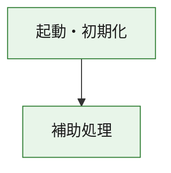
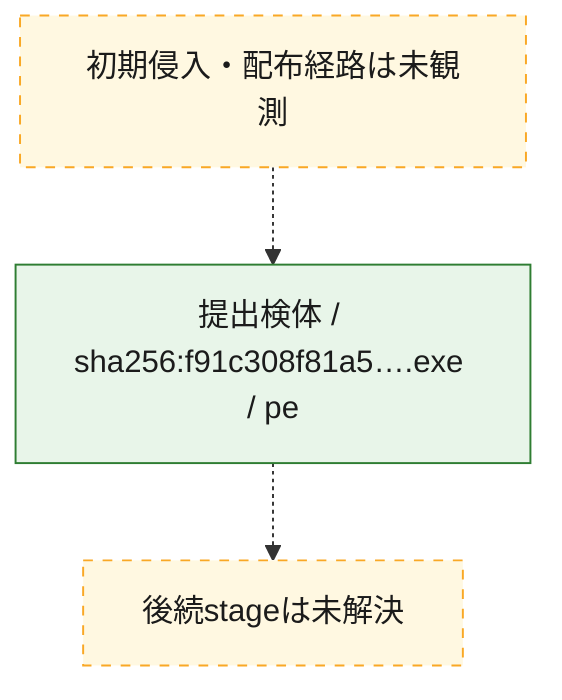
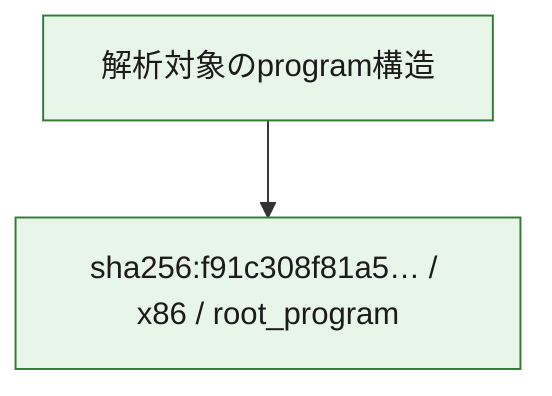

# 全体ロジック：f91c308f81a5fd1580835a97505b06c08286e866f765bf6e38c764dc6ef507e2

代表関数の静的証跡から、起動・初期化の処理群を確認しました。

## 読み方

- phaseの掲載順は解析上の整理順です。observed_call_edgesがない段階間の実行順を断定しません。
- 図の実線は静的に観測した関係、点線と黄色のノードは未観測・未解決の関係を示します。
- 図は静的な要約であり、動的実行を再現するものではありません。
- 詳細な関数解説とfingerprintは[STATIC-LOGIC.md](STATIC-LOGIC.md)を参照してください。

## 静的可視化

### 実行フロー

### 感染チェーン

### モジュール関係

## 処理段階

### 1. 起動・初期化

entry pointから初期化と後続処理への移行を確認します。
確度: `confirmed_static_function_evidence`

- `f91c308f81a5fd1580835a97505b06c08286e866f765bf6e38c764dc6ef507e2:ghidra:180001010` — 初期化と主要処理への分岐を行う入口関数です。 状態: `succeeded`、選定理由: `entry_point`, `meaningful_symbol_name`, `reviewed_call_centrality:22`, `role:entrypoint`, `small_program_complete_context`

### 2. 補助処理

主要処理を支える一般内部関数またはlibrary処理を確認します。
確度: `confirmed_static_function_evidence`

- `f91c308f81a5fd1580835a97505b06c08286e866f765bf6e38c764dc6ef507e2:ghidra:180001240` — 検体内部の一般処理を実装する関数です。 状態: `succeeded`、選定理由: `context_representative`, `reviewed_call_centrality:2`, `small_program_complete_context`
- `f91c308f81a5fd1580835a97505b06c08286e866f765bf6e38c764dc6ef507e2:ghidra:180001350` — 検体内部の一般処理を実装する関数です。 状態: `succeeded`、選定理由: `context_representative`, `reviewed_call_centrality:25`, `small_program_complete_context`
- `f91c308f81a5fd1580835a97505b06c08286e866f765bf6e38c764dc6ef507e2:ghidra:180003780` — 検体内部の一般処理を実装する関数です。 状態: `succeeded`、選定理由: `context_representative`, `reviewed_call_centrality:2`, `small_program_complete_context`
- `f91c308f81a5fd1580835a97505b06c08286e866f765bf6e38c764dc6ef507e2:ghidra:1800038e0` — 検体内部の一般処理を実装する関数です。 状態: `succeeded`、選定理由: `context_representative`, `reviewed_call_centrality:2`, `small_program_complete_context`

## 観測したcall関係

- `f91c308f81a5fd1580835a97505b06c08286e866f765bf6e38c764dc6ef507e2:ghidra:180001010` → `f91c308f81a5fd1580835a97505b06c08286e866f765bf6e38c764dc6ef507e2:ghidra:180001240` （`startup` → `support`）
- `f91c308f81a5fd1580835a97505b06c08286e866f765bf6e38c764dc6ef507e2:ghidra:180001010` → `f91c308f81a5fd1580835a97505b06c08286e866f765bf6e38c764dc6ef507e2:ghidra:180001350` （`startup` → `support`）
- `f91c308f81a5fd1580835a97505b06c08286e866f765bf6e38c764dc6ef507e2:ghidra:180001350` → `f91c308f81a5fd1580835a97505b06c08286e866f765bf6e38c764dc6ef507e2:ghidra:180001240` （`support` → `support`）
- `f91c308f81a5fd1580835a97505b06c08286e866f765bf6e38c764dc6ef507e2:ghidra:180001350` → `f91c308f81a5fd1580835a97505b06c08286e866f765bf6e38c764dc6ef507e2:ghidra:180003780` （`support` → `support`）
- `f91c308f81a5fd1580835a97505b06c08286e866f765bf6e38c764dc6ef507e2:ghidra:180001350` → `f91c308f81a5fd1580835a97505b06c08286e866f765bf6e38c764dc6ef507e2:ghidra:1800038e0` （`support` → `support`）
- `f91c308f81a5fd1580835a97505b06c08286e866f765bf6e38c764dc6ef507e2:ghidra:180003780` → `f91c308f81a5fd1580835a97505b06c08286e866f765bf6e38c764dc6ef507e2:ghidra:1800038e0` （`support` → `support`）
- `ghidra-function:34717693d4bf6c3471ee8187` → `ghidra-function:243b84b69b197d56007f7877` （`unclassified` → `unclassified`）
- `ghidra-function:34717693d4bf6c3471ee8187` → `ghidra-function:32e792d246dd62d9badf06b7` （`unclassified` → `unclassified`）
- `ghidra-function:34717693d4bf6c3471ee8187` → `ghidra-function:3350a436d40eb87c404d415c` （`unclassified` → `unclassified`）
- `ghidra-function:34717693d4bf6c3471ee8187` → `ghidra-function:3375732f6953d96b56d8e84f` （`unclassified` → `unclassified`）
- `ghidra-function:34717693d4bf6c3471ee8187` → `ghidra-function:38131fa27a668abbc2519427` （`unclassified` → `unclassified`）
- `ghidra-function:34717693d4bf6c3471ee8187` → `ghidra-function:3fc2280c90b4f47469a9b8b5` （`unclassified` → `unclassified`）
- `ghidra-function:34717693d4bf6c3471ee8187` → `ghidra-function:479d79acd9642a26856e6b7f` （`unclassified` → `unclassified`）
- `ghidra-function:34717693d4bf6c3471ee8187` → `ghidra-function:567775a541963e71a80b4cae` （`unclassified` → `unclassified`）
- `ghidra-function:34717693d4bf6c3471ee8187` → `ghidra-function:60637ca0900fd69503b8593d` （`unclassified` → `unclassified`）
- `ghidra-function:34717693d4bf6c3471ee8187` → `ghidra-function:f4d826be8d68667168efdecc` （`unclassified` → `unclassified`）
- `ghidra-function:34717693d4bf6c3471ee8187` → `ghidra-function:fc82191e1ba6086ceeaca60b` （`unclassified` → `unclassified`）
- `ghidra-function:34717693d4bf6c3471ee8187` → `ghidra-function:fc99c3f34228cf4c8fa13b89` （`unclassified` → `unclassified`）
- `ghidra-function:38131fa27a668abbc2519427` → `ghidra-external:159d42ccccbb8e58b6b2beca` （`unclassified` → `unclassified`）
- `ghidra-function:38131fa27a668abbc2519427` → `ghidra-external:2474cedb203abe216047aab9` （`unclassified` → `unclassified`）
- `ghidra-function:38131fa27a668abbc2519427` → `ghidra-external:2ad18c68590e0aa2a0c5e8fc` （`unclassified` → `unclassified`）
- `ghidra-function:38131fa27a668abbc2519427` → `ghidra-external:429fc045522234b5102d280a` （`unclassified` → `unclassified`）
- `ghidra-function:38131fa27a668abbc2519427` → `ghidra-external:575d4283aca2569851d61beb` （`unclassified` → `unclassified`）
- `ghidra-function:38131fa27a668abbc2519427` → `ghidra-external:59ec34bbfc1467cbb7729a36` （`unclassified` → `unclassified`）
- `ghidra-function:38131fa27a668abbc2519427` → `ghidra-external:66dd47088360264d642597c9` （`unclassified` → `unclassified`）
- `ghidra-function:38131fa27a668abbc2519427` → `ghidra-external:7cba5958b234c10f69e36807` （`unclassified` → `unclassified`）
- `ghidra-function:38131fa27a668abbc2519427` → `ghidra-external:85c1defd4f3f6527ba287dc1` （`unclassified` → `unclassified`）
- `ghidra-function:38131fa27a668abbc2519427` → `ghidra-external:8ed64873dc2a53826ac3f3fd` （`unclassified` → `unclassified`）
- `ghidra-function:38131fa27a668abbc2519427` → `ghidra-external:a1515e609d58899ec92e3c92` （`unclassified` → `unclassified`）
- `ghidra-function:38131fa27a668abbc2519427` → `ghidra-external:aa3eabf2604d8cdcd7ee390f` （`unclassified` → `unclassified`）
- `ghidra-function:38131fa27a668abbc2519427` → `ghidra-external:b200c0768358d20dffba8f3d` （`unclassified` → `unclassified`）
- `ghidra-function:38131fa27a668abbc2519427` → `ghidra-external:b421a4546347335c13b78da7` （`unclassified` → `unclassified`）
- `ghidra-function:38131fa27a668abbc2519427` → `ghidra-external:caeb06fdc8b0da79eed93e2d` （`unclassified` → `unclassified`）
- `ghidra-function:38131fa27a668abbc2519427` → `ghidra-external:d528e2bc82c96f31a8b19680` （`unclassified` → `unclassified`）
- `ghidra-function:38131fa27a668abbc2519427` → `ghidra-external:da0f0d58182d18f739d3c0eb` （`unclassified` → `unclassified`）
- `ghidra-function:38131fa27a668abbc2519427` → `ghidra-external:e0070cd73dc96d202b851562` （`unclassified` → `unclassified`）
- `ghidra-function:38131fa27a668abbc2519427` → `ghidra-external:ea0631095ebbac7521b93761` （`unclassified` → `unclassified`）
- `ghidra-function:38131fa27a668abbc2519427` → `ghidra-external:f41db220c41ab9da117aa1f0` （`unclassified` → `unclassified`）
- `ghidra-function:38131fa27a668abbc2519427` → `ghidra-external:f959c646f1085659a9a6c1bf` （`unclassified` → `unclassified`）
- `ghidra-function:38131fa27a668abbc2519427` → `ghidra-function:3350a436d40eb87c404d415c` （`unclassified` → `unclassified`）
- `ghidra-function:38131fa27a668abbc2519427` → `ghidra-function:803d4003b5575050fb3ea3e9` （`unclassified` → `unclassified`）
- `ghidra-function:38131fa27a668abbc2519427` → `ghidra-function:ad1935002d747d4ae6eb5fe1` （`unclassified` → `unclassified`）
- `ghidra-function:ad1935002d747d4ae6eb5fe1` → `ghidra-function:803d4003b5575050fb3ea3e9` （`unclassified` → `unclassified`）

## 解析範囲と制約

- 選定外関数は全体inventoryへ残しますが、関数本体の個別解説対象にはしていません。
- indirect call、難読化、packer、VM、壊れたcontrol flowによりcall関係が欠落する場合があります。
- 文書は静的解析に基づき、検体実行や外部通信による動的確認は行っていません。
