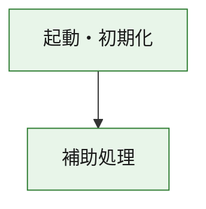
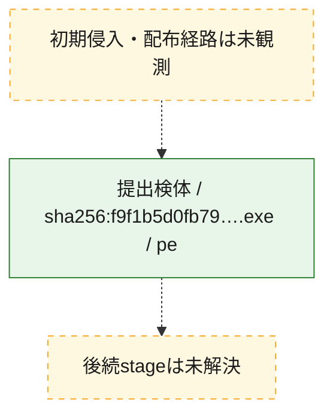
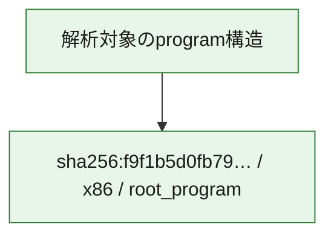

# 全体ロジック：f9f1b5d0fb79b8c6a21d2f6dbe3ea949ff4a0ac54f82531a1f0b28b648e51243

代表関数の静的証跡から、起動・初期化の処理群を確認しました。

## 読み方

- phaseの掲載順は解析上の整理順です。observed_call_edgesがない段階間の実行順を断定しません。
- 図の実線は静的に観測した関係、点線と黄色のノードは未観測・未解決の関係を示します。
- 図は静的な要約であり、動的実行を再現するものではありません。
- 詳細な関数解説とfingerprintは[STATIC-LOGIC.md](STATIC-LOGIC.md)を参照してください。

## 静的可視化

### 実行フロー

### 感染チェーン

### モジュール関係

## 処理段階

### 1. 起動・初期化

entry pointから初期化と後続処理への移行を確認します。
確度: `confirmed_static_function_evidence`

- `f9f1b5d0fb79b8c6a21d2f6dbe3ea949ff4a0ac54f82531a1f0b28b648e51243:ghidra:180001010` — 初期化と主要処理への分岐を行う入口関数です。 状態: `succeeded`、選定理由: `entry_point`, `meaningful_symbol_name`, `reviewed_call_centrality:22`, `role:entrypoint`, `small_program_complete_context`

### 2. 補助処理

主要処理を支える一般内部関数またはlibrary処理を確認します。
確度: `confirmed_static_function_evidence`

- `f9f1b5d0fb79b8c6a21d2f6dbe3ea949ff4a0ac54f82531a1f0b28b648e51243:ghidra:180001240` — 検体内部の一般処理を実装する関数です。 状態: `succeeded`、選定理由: `context_representative`, `reviewed_call_centrality:2`, `small_program_complete_context`
- `f9f1b5d0fb79b8c6a21d2f6dbe3ea949ff4a0ac54f82531a1f0b28b648e51243:ghidra:180001350` — 検体内部の一般処理を実装する関数です。 状態: `succeeded`、選定理由: `context_representative`, `reviewed_call_centrality:25`, `small_program_complete_context`
- `f9f1b5d0fb79b8c6a21d2f6dbe3ea949ff4a0ac54f82531a1f0b28b648e51243:ghidra:180003780` — 検体内部の一般処理を実装する関数です。 状態: `succeeded`、選定理由: `context_representative`, `reviewed_call_centrality:2`, `small_program_complete_context`
- `f9f1b5d0fb79b8c6a21d2f6dbe3ea949ff4a0ac54f82531a1f0b28b648e51243:ghidra:1800038e0` — 検体内部の一般処理を実装する関数です。 状態: `succeeded`、選定理由: `context_representative`, `reviewed_call_centrality:2`, `small_program_complete_context`

## 観測したcall関係

- `f9f1b5d0fb79b8c6a21d2f6dbe3ea949ff4a0ac54f82531a1f0b28b648e51243:ghidra:180001010` → `f9f1b5d0fb79b8c6a21d2f6dbe3ea949ff4a0ac54f82531a1f0b28b648e51243:ghidra:180001240` （`startup` → `support`）
- `f9f1b5d0fb79b8c6a21d2f6dbe3ea949ff4a0ac54f82531a1f0b28b648e51243:ghidra:180001010` → `f9f1b5d0fb79b8c6a21d2f6dbe3ea949ff4a0ac54f82531a1f0b28b648e51243:ghidra:180001350` （`startup` → `support`）
- `f9f1b5d0fb79b8c6a21d2f6dbe3ea949ff4a0ac54f82531a1f0b28b648e51243:ghidra:180001350` → `f9f1b5d0fb79b8c6a21d2f6dbe3ea949ff4a0ac54f82531a1f0b28b648e51243:ghidra:180001240` （`support` → `support`）
- `f9f1b5d0fb79b8c6a21d2f6dbe3ea949ff4a0ac54f82531a1f0b28b648e51243:ghidra:180001350` → `f9f1b5d0fb79b8c6a21d2f6dbe3ea949ff4a0ac54f82531a1f0b28b648e51243:ghidra:180003780` （`support` → `support`）
- `f9f1b5d0fb79b8c6a21d2f6dbe3ea949ff4a0ac54f82531a1f0b28b648e51243:ghidra:180001350` → `f9f1b5d0fb79b8c6a21d2f6dbe3ea949ff4a0ac54f82531a1f0b28b648e51243:ghidra:1800038e0` （`support` → `support`）
- `f9f1b5d0fb79b8c6a21d2f6dbe3ea949ff4a0ac54f82531a1f0b28b648e51243:ghidra:180003780` → `f9f1b5d0fb79b8c6a21d2f6dbe3ea949ff4a0ac54f82531a1f0b28b648e51243:ghidra:1800038e0` （`support` → `support`）
- `ghidra-function:4f04b98801c1cf72a5e1cf35` → `ghidra-function:77d5eb4166cf05f484aa8b02` （`unclassified` → `unclassified`）
- `ghidra-function:521cbcfdae7c57eb561feda0` → `ghidra-function:11f845120259fec01319eadd` （`unclassified` → `unclassified`）
- `ghidra-function:521cbcfdae7c57eb561feda0` → `ghidra-function:2f161e8779cd21ed0b456d43` （`unclassified` → `unclassified`）
- `ghidra-function:521cbcfdae7c57eb561feda0` → `ghidra-function:35698ab5707e5cbda2ba050e` （`unclassified` → `unclassified`）
- `ghidra-function:521cbcfdae7c57eb561feda0` → `ghidra-function:458d2088dc9bf116ebf112ad` （`unclassified` → `unclassified`）
- `ghidra-function:521cbcfdae7c57eb561feda0` → `ghidra-function:572d0cbab15b70a64bbfcf75` （`unclassified` → `unclassified`）
- `ghidra-function:521cbcfdae7c57eb561feda0` → `ghidra-function:8f4a35821ce7572425fe58c8` （`unclassified` → `unclassified`）
- `ghidra-function:521cbcfdae7c57eb561feda0` → `ghidra-function:98bde3cf14efc74bee064850` （`unclassified` → `unclassified`）
- `ghidra-function:521cbcfdae7c57eb561feda0` → `ghidra-function:a2e68fd524bde14558631b41` （`unclassified` → `unclassified`）
- `ghidra-function:521cbcfdae7c57eb561feda0` → `ghidra-function:b349bac6a75458c5ed8ea44a` （`unclassified` → `unclassified`）
- `ghidra-function:521cbcfdae7c57eb561feda0` → `ghidra-function:b74f51396596488980647f1d` （`unclassified` → `unclassified`）
- `ghidra-function:521cbcfdae7c57eb561feda0` → `ghidra-function:f56f38497fcb88a1043202b3` （`unclassified` → `unclassified`）
- `ghidra-function:521cbcfdae7c57eb561feda0` → `ghidra-function:f964a53d2a294bc32b1cb394` （`unclassified` → `unclassified`）
- `ghidra-function:b74f51396596488980647f1d` → `ghidra-external:094825bfdfef4bf344d4e0fc` （`unclassified` → `unclassified`）
- `ghidra-function:b74f51396596488980647f1d` → `ghidra-external:1007a2678b490a256fe852fb` （`unclassified` → `unclassified`）
- `ghidra-function:b74f51396596488980647f1d` → `ghidra-external:1b73e3b37cdf8a2cf0b48644` （`unclassified` → `unclassified`）
- `ghidra-function:b74f51396596488980647f1d` → `ghidra-external:21316e06d5950c0417b3e78b` （`unclassified` → `unclassified`）
- `ghidra-function:b74f51396596488980647f1d` → `ghidra-external:2d1c80508511b8ff0e79c0f2` （`unclassified` → `unclassified`）
- `ghidra-function:b74f51396596488980647f1d` → `ghidra-external:3e4ab751957565b07c80c6b3` （`unclassified` → `unclassified`）
- `ghidra-function:b74f51396596488980647f1d` → `ghidra-external:3f1e2ba470d0466608ba7dfa` （`unclassified` → `unclassified`）
- `ghidra-function:b74f51396596488980647f1d` → `ghidra-external:4a7ff758cdc184cde3a8ab4d` （`unclassified` → `unclassified`）
- `ghidra-function:b74f51396596488980647f1d` → `ghidra-external:6e1f8bf8bce898a1159939d0` （`unclassified` → `unclassified`）
- `ghidra-function:b74f51396596488980647f1d` → `ghidra-external:79005042eeb7adb0703a21eb` （`unclassified` → `unclassified`）
- `ghidra-function:b74f51396596488980647f1d` → `ghidra-external:85fd23efd47d4a30b814e5d6` （`unclassified` → `unclassified`）
- `ghidra-function:b74f51396596488980647f1d` → `ghidra-external:8709b99b90549d2565110fb6` （`unclassified` → `unclassified`）
- `ghidra-function:b74f51396596488980647f1d` → `ghidra-external:a5d0004393ecac88d164f9d2` （`unclassified` → `unclassified`）
- `ghidra-function:b74f51396596488980647f1d` → `ghidra-external:aecd59b03d2d1dcd821b65b9` （`unclassified` → `unclassified`）
- `ghidra-function:b74f51396596488980647f1d` → `ghidra-external:c17ea9aa123ecdd15f14468d` （`unclassified` → `unclassified`）
- `ghidra-function:b74f51396596488980647f1d` → `ghidra-external:cca4c2f6d7a55b4ab958cbe7` （`unclassified` → `unclassified`）
- `ghidra-function:b74f51396596488980647f1d` → `ghidra-external:d2f032923e3886891b38084a` （`unclassified` → `unclassified`）
- `ghidra-function:b74f51396596488980647f1d` → `ghidra-external:dee03cd5de61c6f84d08fdce` （`unclassified` → `unclassified`）
- `ghidra-function:b74f51396596488980647f1d` → `ghidra-external:e062ad9397468b5e01b74c37` （`unclassified` → `unclassified`）
- `ghidra-function:b74f51396596488980647f1d` → `ghidra-external:f051613be2cec37a9384cb53` （`unclassified` → `unclassified`）
- `ghidra-function:b74f51396596488980647f1d` → `ghidra-external:fd0a1d95468e66ad6b4a68bd` （`unclassified` → `unclassified`）
- `ghidra-function:b74f51396596488980647f1d` → `ghidra-function:4f04b98801c1cf72a5e1cf35` （`unclassified` → `unclassified`）
- `ghidra-function:b74f51396596488980647f1d` → `ghidra-function:77d5eb4166cf05f484aa8b02` （`unclassified` → `unclassified`）
- `ghidra-function:b74f51396596488980647f1d` → `ghidra-function:f964a53d2a294bc32b1cb394` （`unclassified` → `unclassified`）

## 解析範囲と制約

- 選定外関数は全体inventoryへ残しますが、関数本体の個別解説対象にはしていません。
- indirect call、難読化、packer、VM、壊れたcontrol flowによりcall関係が欠落する場合があります。
- 文書は静的解析に基づき、検体実行や外部通信による動的確認は行っていません。
