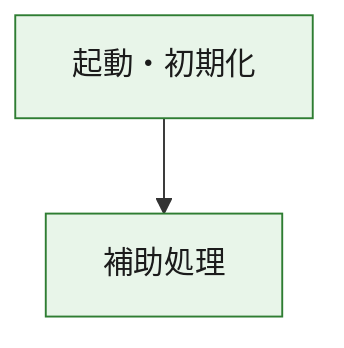
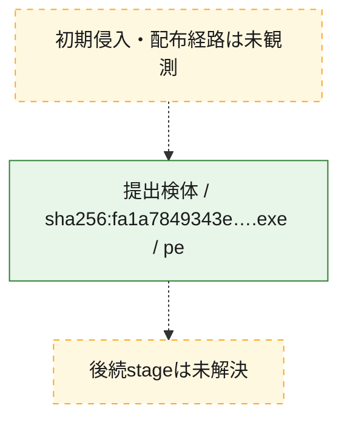
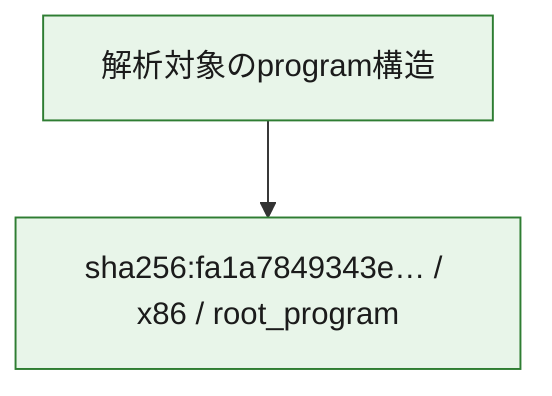

# 全体ロジック：fa1a7849343ed0157e14d3b9816f8a55f924a4e3a4fd11bd45d65e8db97bfea4

代表関数の静的証跡から、起動・初期化の処理群を確認しました。

## 読み方

- phaseの掲載順は解析上の整理順です。observed_call_edgesがない段階間の実行順を断定しません。
- 図の実線は静的に観測した関係、点線と黄色のノードは未観測・未解決の関係を示します。
- 図は静的な要約であり、動的実行を再現するものではありません。
- 詳細な関数解説とfingerprintは[STATIC-LOGIC.md](STATIC-LOGIC.md)を参照してください。

## 静的可視化

### 実行フロー

### 感染チェーン

### モジュール関係

## 処理段階

### 1. 起動・初期化

entry pointから初期化と後続処理への移行を確認します。
確度: `confirmed_static_function_evidence`

- `fa1a7849343ed0157e14d3b9816f8a55f924a4e3a4fd11bd45d65e8db97bfea4:ghidra:180001010` — 初期化と主要処理への分岐を行う入口関数です。 状態: `succeeded`、選定理由: `entry_point`, `meaningful_symbol_name`, `reviewed_call_centrality:22`, `role:entrypoint`, `small_program_complete_context`

### 2. 補助処理

主要処理を支える一般内部関数またはlibrary処理を確認します。
確度: `confirmed_static_function_evidence`

- `fa1a7849343ed0157e14d3b9816f8a55f924a4e3a4fd11bd45d65e8db97bfea4:ghidra:180001240` — 検体内部の一般処理を実装する関数です。 状態: `succeeded`、選定理由: `context_representative`, `reviewed_call_centrality:2`, `small_program_complete_context`
- `fa1a7849343ed0157e14d3b9816f8a55f924a4e3a4fd11bd45d65e8db97bfea4:ghidra:180001350` — 検体内部の一般処理を実装する関数です。 状態: `succeeded`、選定理由: `context_representative`, `reviewed_call_centrality:25`, `small_program_complete_context`
- `fa1a7849343ed0157e14d3b9816f8a55f924a4e3a4fd11bd45d65e8db97bfea4:ghidra:180003780` — 検体内部の一般処理を実装する関数です。 状態: `succeeded`、選定理由: `context_representative`, `reviewed_call_centrality:2`, `small_program_complete_context`
- `fa1a7849343ed0157e14d3b9816f8a55f924a4e3a4fd11bd45d65e8db97bfea4:ghidra:1800038e0` — 検体内部の一般処理を実装する関数です。 状態: `succeeded`、選定理由: `context_representative`, `reviewed_call_centrality:2`, `small_program_complete_context`

## 観測したcall関係

- `fa1a7849343ed0157e14d3b9816f8a55f924a4e3a4fd11bd45d65e8db97bfea4:ghidra:180001010` → `fa1a7849343ed0157e14d3b9816f8a55f924a4e3a4fd11bd45d65e8db97bfea4:ghidra:180001240` （`startup` → `support`）
- `fa1a7849343ed0157e14d3b9816f8a55f924a4e3a4fd11bd45d65e8db97bfea4:ghidra:180001010` → `fa1a7849343ed0157e14d3b9816f8a55f924a4e3a4fd11bd45d65e8db97bfea4:ghidra:180001350` （`startup` → `support`）
- `fa1a7849343ed0157e14d3b9816f8a55f924a4e3a4fd11bd45d65e8db97bfea4:ghidra:180001350` → `fa1a7849343ed0157e14d3b9816f8a55f924a4e3a4fd11bd45d65e8db97bfea4:ghidra:180001240` （`support` → `support`）
- `fa1a7849343ed0157e14d3b9816f8a55f924a4e3a4fd11bd45d65e8db97bfea4:ghidra:180001350` → `fa1a7849343ed0157e14d3b9816f8a55f924a4e3a4fd11bd45d65e8db97bfea4:ghidra:180003780` （`support` → `support`）
- `fa1a7849343ed0157e14d3b9816f8a55f924a4e3a4fd11bd45d65e8db97bfea4:ghidra:180001350` → `fa1a7849343ed0157e14d3b9816f8a55f924a4e3a4fd11bd45d65e8db97bfea4:ghidra:1800038e0` （`support` → `support`）
- `fa1a7849343ed0157e14d3b9816f8a55f924a4e3a4fd11bd45d65e8db97bfea4:ghidra:180003780` → `fa1a7849343ed0157e14d3b9816f8a55f924a4e3a4fd11bd45d65e8db97bfea4:ghidra:1800038e0` （`support` → `support`）
- `ghidra-function:1951ad2186389d0e240c2149` → `ghidra-function:052f1c94f1ed467f841f66ed` （`unclassified` → `unclassified`）
- `ghidra-function:1951ad2186389d0e240c2149` → `ghidra-function:1e55030fc876d6fdadc77d34` （`unclassified` → `unclassified`）
- `ghidra-function:1951ad2186389d0e240c2149` → `ghidra-function:2b8403f8d9731404910a318d` （`unclassified` → `unclassified`）
- `ghidra-function:1951ad2186389d0e240c2149` → `ghidra-function:358de8cf32c384f99fc47a97` （`unclassified` → `unclassified`）
- `ghidra-function:1951ad2186389d0e240c2149` → `ghidra-function:54f925c759fda27ecd9855e9` （`unclassified` → `unclassified`）
- `ghidra-function:1951ad2186389d0e240c2149` → `ghidra-function:572984fe765e7c85af2c90d3` （`unclassified` → `unclassified`）
- `ghidra-function:1951ad2186389d0e240c2149` → `ghidra-function:582a16011e0fb91217dc12bc` （`unclassified` → `unclassified`）
- `ghidra-function:1951ad2186389d0e240c2149` → `ghidra-function:662e59f9ef3429cb9b15a4b6` （`unclassified` → `unclassified`）
- `ghidra-function:1951ad2186389d0e240c2149` → `ghidra-function:84a8a74e30f9b4fdbf100b1d` （`unclassified` → `unclassified`）
- `ghidra-function:1951ad2186389d0e240c2149` → `ghidra-function:b809ac0e8f1fb3bbec290bf4` （`unclassified` → `unclassified`）
- `ghidra-function:1951ad2186389d0e240c2149` → `ghidra-function:e0fef0f1163c9369b6db741a` （`unclassified` → `unclassified`）
- `ghidra-function:1951ad2186389d0e240c2149` → `ghidra-function:ed465708094a59adbaaed2cd` （`unclassified` → `unclassified`）
- `ghidra-function:585aa45481adbdf1bb1662b9` → `ghidra-function:9d13413455dc3e52744bf448` （`unclassified` → `unclassified`）
- `ghidra-function:84a8a74e30f9b4fdbf100b1d` → `ghidra-external:0e77f153a971e2a45bf07454` （`unclassified` → `unclassified`）
- `ghidra-function:84a8a74e30f9b4fdbf100b1d` → `ghidra-external:19d2cb65427ad3ec526ccf34` （`unclassified` → `unclassified`）
- `ghidra-function:84a8a74e30f9b4fdbf100b1d` → `ghidra-external:24c775ca179c773d6bdf24c6` （`unclassified` → `unclassified`）
- `ghidra-function:84a8a74e30f9b4fdbf100b1d` → `ghidra-external:3ee10dda6ffbb6052517e625` （`unclassified` → `unclassified`）
- `ghidra-function:84a8a74e30f9b4fdbf100b1d` → `ghidra-external:4acf120756f77fb893548eae` （`unclassified` → `unclassified`）
- `ghidra-function:84a8a74e30f9b4fdbf100b1d` → `ghidra-external:4e5a0a89a6d1004cf5d11d66` （`unclassified` → `unclassified`）
- `ghidra-function:84a8a74e30f9b4fdbf100b1d` → `ghidra-external:546ff63027f80e6f14d546b0` （`unclassified` → `unclassified`）
- `ghidra-function:84a8a74e30f9b4fdbf100b1d` → `ghidra-external:696b768aec3f54dc099527f5` （`unclassified` → `unclassified`）
- `ghidra-function:84a8a74e30f9b4fdbf100b1d` → `ghidra-external:7fcbbeb8b14c16063e76424e` （`unclassified` → `unclassified`）
- `ghidra-function:84a8a74e30f9b4fdbf100b1d` → `ghidra-external:7fe649d105114c8d4756953e` （`unclassified` → `unclassified`）
- `ghidra-function:84a8a74e30f9b4fdbf100b1d` → `ghidra-external:7ffdeb287d36f394234d6802` （`unclassified` → `unclassified`）
- `ghidra-function:84a8a74e30f9b4fdbf100b1d` → `ghidra-external:82a0df70454e3a0d476725e0` （`unclassified` → `unclassified`）
- `ghidra-function:84a8a74e30f9b4fdbf100b1d` → `ghidra-external:8f1e052fa65fdf591abe1417` （`unclassified` → `unclassified`）
- `ghidra-function:84a8a74e30f9b4fdbf100b1d` → `ghidra-external:a6742b8c86997e6c2cde6320` （`unclassified` → `unclassified`）
- `ghidra-function:84a8a74e30f9b4fdbf100b1d` → `ghidra-external:c07c708a9a46497203e265aa` （`unclassified` → `unclassified`）
- `ghidra-function:84a8a74e30f9b4fdbf100b1d` → `ghidra-external:c6acf1921f80395543598156` （`unclassified` → `unclassified`）
- `ghidra-function:84a8a74e30f9b4fdbf100b1d` → `ghidra-external:cd2ca4caf363b57c6972cdd3` （`unclassified` → `unclassified`）
- `ghidra-function:84a8a74e30f9b4fdbf100b1d` → `ghidra-external:ce5293d7e64265e8bba2e276` （`unclassified` → `unclassified`）
- `ghidra-function:84a8a74e30f9b4fdbf100b1d` → `ghidra-external:e19d6292c1da7bf891ef5c22` （`unclassified` → `unclassified`）
- `ghidra-function:84a8a74e30f9b4fdbf100b1d` → `ghidra-external:f0a1bcded20567fdd0ed8611` （`unclassified` → `unclassified`）
- `ghidra-function:84a8a74e30f9b4fdbf100b1d` → `ghidra-external:f791deb036c7a11e717dbc5e` （`unclassified` → `unclassified`）
- `ghidra-function:84a8a74e30f9b4fdbf100b1d` → `ghidra-function:2b8403f8d9731404910a318d` （`unclassified` → `unclassified`）
- `ghidra-function:84a8a74e30f9b4fdbf100b1d` → `ghidra-function:585aa45481adbdf1bb1662b9` （`unclassified` → `unclassified`）
- `ghidra-function:84a8a74e30f9b4fdbf100b1d` → `ghidra-function:9d13413455dc3e52744bf448` （`unclassified` → `unclassified`）

## 解析範囲と制約

- 選定外関数は全体inventoryへ残しますが、関数本体の個別解説対象にはしていません。
- indirect call、難読化、packer、VM、壊れたcontrol flowによりcall関係が欠落する場合があります。
- 文書は静的解析に基づき、検体実行や外部通信による動的確認は行っていません。
