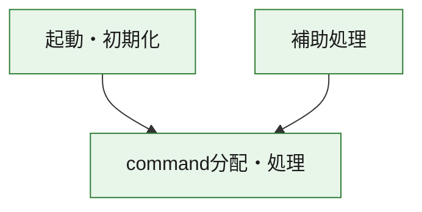
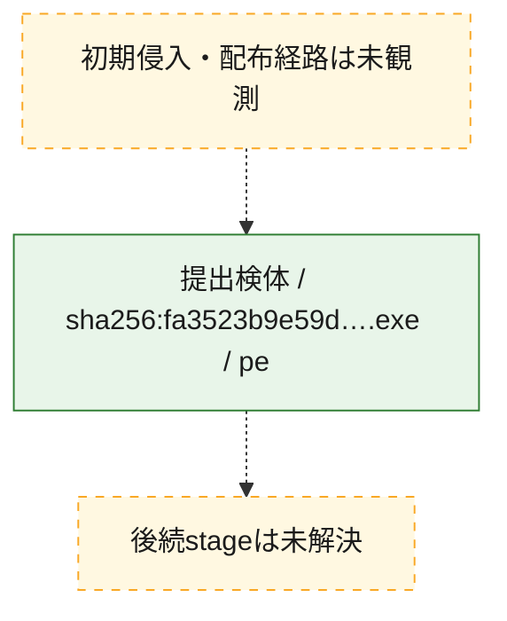
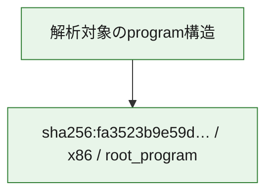

# 全体ロジック：fa3523b9e59def3558f6e9e97563dfd1e511391c290bc642a05962aeccef4afe

代表関数の静的証跡から、起動・初期化、command分配・処理の処理群を確認しました。

## 読み方

- phaseの掲載順は解析上の整理順です。observed_call_edgesがない段階間の実行順を断定しません。
- 図の実線は静的に観測した関係、点線と黄色のノードは未観測・未解決の関係を示します。
- 図は静的な要約であり、動的実行を再現するものではありません。
- 詳細な関数解説とfingerprintは[STATIC-LOGIC.md](STATIC-LOGIC.md)を参照してください。

## 静的可視化

### 実行フロー

### 感染チェーン

### モジュール関係

## 処理段階

### 1. 起動・初期化

entry pointから初期化と後続処理への移行を確認します。
確度: `confirmed_static_function_evidence`

- `fa3523b9e59def3558f6e9e97563dfd1e511391c290bc642a05962aeccef4afe:ghidra:14000d8c0` — 初期化と主要処理への分岐を行う入口関数です。 状態: `succeeded`、選定理由: `entry_point`, `meaningful_symbol_name`, `reviewed_call_centrality:22`, `role:entrypoint`

### 2. command分配・処理

受信commandやtaskの解釈、分配、個別handlerへの移行を確認します。
確度: `confirmed_static_function_evidence_with_limits`

- `fa3523b9e59def3558f6e9e97563dfd1e511391c290bc642a05962aeccef4afe:ghidra:14002d490` — commandの解釈、分配、または個別処理を担当する関数です。 状態: `limited_bad_instruction_or_flow`、選定理由: `meaningful_symbol_name`, `reviewed_call_centrality:3`, `role:command_dispatch_or_handler`

### 3. 補助処理

主要処理を支える一般内部関数またはlibrary処理を確認します。
確度: `confirmed_static_function_evidence`

- `fa3523b9e59def3558f6e9e97563dfd1e511391c290bc642a05962aeccef4afe:ghidra:140001030` — 検体内部の一般処理を実装する関数です。 状態: `succeeded`、選定理由: `context_representative`, `reviewed_call_centrality:12`
- `fa3523b9e59def3558f6e9e97563dfd1e511391c290bc642a05962aeccef4afe:ghidra:1400011f0` — 検体内部の一般処理を実装する関数です。 状態: `succeeded`、選定理由: `context_representative`, `reviewed_call_centrality:7`
- `fa3523b9e59def3558f6e9e97563dfd1e511391c290bc642a05962aeccef4afe:ghidra:140001300` — 検体内部の一般処理を実装する関数です。 状態: `succeeded`、選定理由: `context_representative`, `reviewed_call_centrality:13`
- `fa3523b9e59def3558f6e9e97563dfd1e511391c290bc642a05962aeccef4afe:ghidra:140001540` — 検体内部の一般処理を実装する関数です。 状態: `succeeded`、選定理由: `context_representative`, `reviewed_call_centrality:11`
- `fa3523b9e59def3558f6e9e97563dfd1e511391c290bc642a05962aeccef4afe:ghidra:1400016d0` — 検体内部の一般処理を実装する関数です。 状態: `succeeded`、選定理由: `context_representative`, `reviewed_call_centrality:9`
- `fa3523b9e59def3558f6e9e97563dfd1e511391c290bc642a05962aeccef4afe:ghidra:140001810` — 検体内部の一般処理を実装する関数です。 状態: `succeeded`、選定理由: `context_representative`, `reviewed_call_centrality:2`
- `fa3523b9e59def3558f6e9e97563dfd1e511391c290bc642a05962aeccef4afe:ghidra:140001890` — 検体内部の一般処理を実装する関数です。 状態: `succeeded`、選定理由: `context_representative`, `reviewed_call_centrality:7`
- `fa3523b9e59def3558f6e9e97563dfd1e511391c290bc642a05962aeccef4afe:ghidra:1400018e0` — 検体内部の一般処理を実装する関数です。 状態: `succeeded`、選定理由: `context_representative`, `reviewed_call_centrality:13`
- `fa3523b9e59def3558f6e9e97563dfd1e511391c290bc642a05962aeccef4afe:ghidra:140001bf0` — 検体内部の一般処理を実装する関数です。 状態: `succeeded`、選定理由: `context_representative`, `reviewed_call_centrality:7`
- `fa3523b9e59def3558f6e9e97563dfd1e511391c290bc642a05962aeccef4afe:ghidra:140001c50` — 検体内部の一般処理を実装する関数です。 状態: `succeeded`、選定理由: `context_representative`, `reviewed_call_centrality:6`
- `fa3523b9e59def3558f6e9e97563dfd1e511391c290bc642a05962aeccef4afe:ghidra:140002580` — 検体内部の一般処理を実装する関数です。 状態: `succeeded`、選定理由: `context_representative`, `reviewed_call_centrality:12`
- `fa3523b9e59def3558f6e9e97563dfd1e511391c290bc642a05962aeccef4afe:ghidra:140002700` — 検体内部の一般処理を実装する関数です。 状態: `succeeded`、選定理由: `context_representative`, `reviewed_call_centrality:8`
- `fa3523b9e59def3558f6e9e97563dfd1e511391c290bc642a05962aeccef4afe:ghidra:140002740` — 検体内部の一般処理を実装する関数です。 状態: `succeeded`、選定理由: `context_representative`, `reviewed_call_centrality:8`
- `fa3523b9e59def3558f6e9e97563dfd1e511391c290bc642a05962aeccef4afe:ghidra:1400027e0` — 検体内部の一般処理を実装する関数です。 状態: `succeeded`、選定理由: `context_representative`, `reviewed_call_centrality:3`
- `fa3523b9e59def3558f6e9e97563dfd1e511391c290bc642a05962aeccef4afe:ghidra:140002840` — 検体内部の一般処理を実装する関数です。 状態: `succeeded`、選定理由: `context_representative`, `reviewed_call_centrality:7`
- `fa3523b9e59def3558f6e9e97563dfd1e511391c290bc642a05962aeccef4afe:ghidra:140002f70` — 検体内部の一般処理を実装する関数です。 状態: `succeeded`、選定理由: `context_representative`, `reviewed_call_centrality:10`
- `fa3523b9e59def3558f6e9e97563dfd1e511391c290bc642a05962aeccef4afe:ghidra:140003090` — 検体内部の一般処理を実装する関数です。 状態: `succeeded`、選定理由: `context_representative`, `reviewed_call_centrality:8`
- `fa3523b9e59def3558f6e9e97563dfd1e511391c290bc642a05962aeccef4afe:ghidra:1400030e0` — 検体内部の一般処理を実装する関数です。 状態: `succeeded`、選定理由: `context_representative`, `reviewed_call_centrality:13`
- `fa3523b9e59def3558f6e9e97563dfd1e511391c290bc642a05962aeccef4afe:ghidra:140003210` — 検体内部の一般処理を実装する関数です。 状態: `succeeded`、選定理由: `context_representative`, `reviewed_call_centrality:9`
- `fa3523b9e59def3558f6e9e97563dfd1e511391c290bc642a05962aeccef4afe:ghidra:1400032a0` — 検体内部の一般処理を実装する関数です。 状態: `succeeded`、選定理由: `context_representative`, `reviewed_call_centrality:5`
- `fa3523b9e59def3558f6e9e97563dfd1e511391c290bc642a05962aeccef4afe:ghidra:140003300` — 検体内部の一般処理を実装する関数です。 状態: `succeeded`、選定理由: `context_representative`, `reviewed_call_centrality:3`
- `fa3523b9e59def3558f6e9e97563dfd1e511391c290bc642a05962aeccef4afe:ghidra:140003350` — 検体内部の一般処理を実装する関数です。 状態: `succeeded`、選定理由: `context_representative`, `reviewed_call_centrality:6`
- `fa3523b9e59def3558f6e9e97563dfd1e511391c290bc642a05962aeccef4afe:ghidra:1400033a0` — 検体内部の一般処理を実装する関数です。 状態: `succeeded`、選定理由: `context_representative`, `reviewed_call_centrality:13`
- `fa3523b9e59def3558f6e9e97563dfd1e511391c290bc642a05962aeccef4afe:ghidra:140003480` — 検体内部の一般処理を実装する関数です。 状態: `succeeded`、選定理由: `context_representative`, `reviewed_call_centrality:10`
- `fa3523b9e59def3558f6e9e97563dfd1e511391c290bc642a05962aeccef4afe:ghidra:140003570` — 検体内部の一般処理を実装する関数です。 状態: `succeeded`、選定理由: `context_representative`, `reviewed_call_centrality:15`
- `fa3523b9e59def3558f6e9e97563dfd1e511391c290bc642a05962aeccef4afe:ghidra:140003680` — 検体内部の一般処理を実装する関数です。 状態: `succeeded`、選定理由: `context_representative`, `reviewed_call_centrality:7`
- `fa3523b9e59def3558f6e9e97563dfd1e511391c290bc642a05962aeccef4afe:ghidra:140003760` — 検体内部の一般処理を実装する関数です。 状態: `succeeded`、選定理由: `context_representative`, `reviewed_call_centrality:8`
- `fa3523b9e59def3558f6e9e97563dfd1e511391c290bc642a05962aeccef4afe:ghidra:140003850` — 検体内部の一般処理を実装する関数です。 状態: `succeeded`、選定理由: `context_representative`, `reviewed_call_centrality:15`
- `fa3523b9e59def3558f6e9e97563dfd1e511391c290bc642a05962aeccef4afe:ghidra:1400039c0` — 検体内部の一般処理を実装する関数です。 状態: `succeeded`、選定理由: `context_representative`, `reviewed_call_centrality:8`
- `fa3523b9e59def3558f6e9e97563dfd1e511391c290bc642a05962aeccef4afe:ghidra:140003fa0` — 検体内部の一般処理を実装する関数です。 状態: `succeeded`、選定理由: `meaningful_symbol_name`

## 観測したcall関係

- `fa3523b9e59def3558f6e9e97563dfd1e511391c290bc642a05962aeccef4afe:ghidra:140001030` → `fa3523b9e59def3558f6e9e97563dfd1e511391c290bc642a05962aeccef4afe:ghidra:140001300` （`support` → `support`）
- `fa3523b9e59def3558f6e9e97563dfd1e511391c290bc642a05962aeccef4afe:ghidra:140001030` → `fa3523b9e59def3558f6e9e97563dfd1e511391c290bc642a05962aeccef4afe:ghidra:1400033a0` （`support` → `support`）
- `fa3523b9e59def3558f6e9e97563dfd1e511391c290bc642a05962aeccef4afe:ghidra:140001030` → `fa3523b9e59def3558f6e9e97563dfd1e511391c290bc642a05962aeccef4afe:ghidra:140003570` （`support` → `support`）
- `fa3523b9e59def3558f6e9e97563dfd1e511391c290bc642a05962aeccef4afe:ghidra:1400011f0` → `fa3523b9e59def3558f6e9e97563dfd1e511391c290bc642a05962aeccef4afe:ghidra:140003570` （`support` → `support`）
- `fa3523b9e59def3558f6e9e97563dfd1e511391c290bc642a05962aeccef4afe:ghidra:140001300` → `fa3523b9e59def3558f6e9e97563dfd1e511391c290bc642a05962aeccef4afe:ghidra:1400033a0` （`support` → `support`）
- `fa3523b9e59def3558f6e9e97563dfd1e511391c290bc642a05962aeccef4afe:ghidra:140001540` → `fa3523b9e59def3558f6e9e97563dfd1e511391c290bc642a05962aeccef4afe:ghidra:140001300` （`support` → `support`）
- `fa3523b9e59def3558f6e9e97563dfd1e511391c290bc642a05962aeccef4afe:ghidra:140001540` → `fa3523b9e59def3558f6e9e97563dfd1e511391c290bc642a05962aeccef4afe:ghidra:1400033a0` （`support` → `support`）
- `fa3523b9e59def3558f6e9e97563dfd1e511391c290bc642a05962aeccef4afe:ghidra:140001540` → `fa3523b9e59def3558f6e9e97563dfd1e511391c290bc642a05962aeccef4afe:ghidra:140003570` （`support` → `support`）
- `fa3523b9e59def3558f6e9e97563dfd1e511391c290bc642a05962aeccef4afe:ghidra:1400016d0` → `fa3523b9e59def3558f6e9e97563dfd1e511391c290bc642a05962aeccef4afe:ghidra:140001030` （`support` → `support`）
- `fa3523b9e59def3558f6e9e97563dfd1e511391c290bc642a05962aeccef4afe:ghidra:1400016d0` → `fa3523b9e59def3558f6e9e97563dfd1e511391c290bc642a05962aeccef4afe:ghidra:1400011f0` （`support` → `support`）
- `fa3523b9e59def3558f6e9e97563dfd1e511391c290bc642a05962aeccef4afe:ghidra:1400016d0` → `fa3523b9e59def3558f6e9e97563dfd1e511391c290bc642a05962aeccef4afe:ghidra:140001300` （`support` → `support`）
- `fa3523b9e59def3558f6e9e97563dfd1e511391c290bc642a05962aeccef4afe:ghidra:1400016d0` → `fa3523b9e59def3558f6e9e97563dfd1e511391c290bc642a05962aeccef4afe:ghidra:1400033a0` （`support` → `support`）
- `fa3523b9e59def3558f6e9e97563dfd1e511391c290bc642a05962aeccef4afe:ghidra:1400016d0` → `fa3523b9e59def3558f6e9e97563dfd1e511391c290bc642a05962aeccef4afe:ghidra:140003570` （`support` → `support`）
- `fa3523b9e59def3558f6e9e97563dfd1e511391c290bc642a05962aeccef4afe:ghidra:1400018e0` → `fa3523b9e59def3558f6e9e97563dfd1e511391c290bc642a05962aeccef4afe:ghidra:140001bf0` （`support` → `support`）
- `fa3523b9e59def3558f6e9e97563dfd1e511391c290bc642a05962aeccef4afe:ghidra:1400018e0` → `fa3523b9e59def3558f6e9e97563dfd1e511391c290bc642a05962aeccef4afe:ghidra:1400033a0` （`support` → `support`）
- `fa3523b9e59def3558f6e9e97563dfd1e511391c290bc642a05962aeccef4afe:ghidra:1400018e0` → `fa3523b9e59def3558f6e9e97563dfd1e511391c290bc642a05962aeccef4afe:ghidra:140003570` （`support` → `support`）
- `fa3523b9e59def3558f6e9e97563dfd1e511391c290bc642a05962aeccef4afe:ghidra:140001c50` → `fa3523b9e59def3558f6e9e97563dfd1e511391c290bc642a05962aeccef4afe:ghidra:140003850` （`support` → `support`）
- `fa3523b9e59def3558f6e9e97563dfd1e511391c290bc642a05962aeccef4afe:ghidra:140002580` → `fa3523b9e59def3558f6e9e97563dfd1e511391c290bc642a05962aeccef4afe:ghidra:1400027e0` （`support` → `support`）
- `fa3523b9e59def3558f6e9e97563dfd1e511391c290bc642a05962aeccef4afe:ghidra:140002580` → `fa3523b9e59def3558f6e9e97563dfd1e511391c290bc642a05962aeccef4afe:ghidra:140003480` （`support` → `support`）
- `fa3523b9e59def3558f6e9e97563dfd1e511391c290bc642a05962aeccef4afe:ghidra:140002580` → `fa3523b9e59def3558f6e9e97563dfd1e511391c290bc642a05962aeccef4afe:ghidra:140003850` （`support` → `support`）
- `fa3523b9e59def3558f6e9e97563dfd1e511391c290bc642a05962aeccef4afe:ghidra:140002740` → `fa3523b9e59def3558f6e9e97563dfd1e511391c290bc642a05962aeccef4afe:ghidra:140001c50` （`support` → `support`）
- `fa3523b9e59def3558f6e9e97563dfd1e511391c290bc642a05962aeccef4afe:ghidra:140002740` → `fa3523b9e59def3558f6e9e97563dfd1e511391c290bc642a05962aeccef4afe:ghidra:140002580` （`support` → `support`）
- `fa3523b9e59def3558f6e9e97563dfd1e511391c290bc642a05962aeccef4afe:ghidra:140002740` → `fa3523b9e59def3558f6e9e97563dfd1e511391c290bc642a05962aeccef4afe:ghidra:140003570` （`support` → `support`）
- `fa3523b9e59def3558f6e9e97563dfd1e511391c290bc642a05962aeccef4afe:ghidra:140002840` → `fa3523b9e59def3558f6e9e97563dfd1e511391c290bc642a05962aeccef4afe:ghidra:140003850` （`support` → `support`）
- `fa3523b9e59def3558f6e9e97563dfd1e511391c290bc642a05962aeccef4afe:ghidra:140002840` → `fa3523b9e59def3558f6e9e97563dfd1e511391c290bc642a05962aeccef4afe:ghidra:14002d490` （`support` → `dispatch`）
- `fa3523b9e59def3558f6e9e97563dfd1e511391c290bc642a05962aeccef4afe:ghidra:140002f70` → `fa3523b9e59def3558f6e9e97563dfd1e511391c290bc642a05962aeccef4afe:ghidra:140003480` （`support` → `support`）
- `fa3523b9e59def3558f6e9e97563dfd1e511391c290bc642a05962aeccef4afe:ghidra:140002f70` → `fa3523b9e59def3558f6e9e97563dfd1e511391c290bc642a05962aeccef4afe:ghidra:140003850` （`support` → `support`）
- `fa3523b9e59def3558f6e9e97563dfd1e511391c290bc642a05962aeccef4afe:ghidra:1400030e0` → `fa3523b9e59def3558f6e9e97563dfd1e511391c290bc642a05962aeccef4afe:ghidra:140002840` （`support` → `support`）
- `fa3523b9e59def3558f6e9e97563dfd1e511391c290bc642a05962aeccef4afe:ghidra:1400030e0` → `fa3523b9e59def3558f6e9e97563dfd1e511391c290bc642a05962aeccef4afe:ghidra:140002f70` （`support` → `support`）
- `fa3523b9e59def3558f6e9e97563dfd1e511391c290bc642a05962aeccef4afe:ghidra:1400030e0` → `fa3523b9e59def3558f6e9e97563dfd1e511391c290bc642a05962aeccef4afe:ghidra:140003570` （`support` → `support`）
- `fa3523b9e59def3558f6e9e97563dfd1e511391c290bc642a05962aeccef4afe:ghidra:1400030e0` → `fa3523b9e59def3558f6e9e97563dfd1e511391c290bc642a05962aeccef4afe:ghidra:140003850` （`support` → `support`）
- `fa3523b9e59def3558f6e9e97563dfd1e511391c290bc642a05962aeccef4afe:ghidra:140003210` → `fa3523b9e59def3558f6e9e97563dfd1e511391c290bc642a05962aeccef4afe:ghidra:140003300` （`support` → `support`）
- `fa3523b9e59def3558f6e9e97563dfd1e511391c290bc642a05962aeccef4afe:ghidra:140003210` → `fa3523b9e59def3558f6e9e97563dfd1e511391c290bc642a05962aeccef4afe:ghidra:140003350` （`support` → `support`）
- `fa3523b9e59def3558f6e9e97563dfd1e511391c290bc642a05962aeccef4afe:ghidra:1400033a0` → `fa3523b9e59def3558f6e9e97563dfd1e511391c290bc642a05962aeccef4afe:ghidra:140001bf0` （`support` → `support`）
- `fa3523b9e59def3558f6e9e97563dfd1e511391c290bc642a05962aeccef4afe:ghidra:1400033a0` → `fa3523b9e59def3558f6e9e97563dfd1e511391c290bc642a05962aeccef4afe:ghidra:140003210` （`support` → `support`）
- `fa3523b9e59def3558f6e9e97563dfd1e511391c290bc642a05962aeccef4afe:ghidra:140003480` → `fa3523b9e59def3558f6e9e97563dfd1e511391c290bc642a05962aeccef4afe:ghidra:1400032a0` （`support` → `support`）
- `fa3523b9e59def3558f6e9e97563dfd1e511391c290bc642a05962aeccef4afe:ghidra:140003480` → `fa3523b9e59def3558f6e9e97563dfd1e511391c290bc642a05962aeccef4afe:ghidra:140003350` （`support` → `support`）
- `fa3523b9e59def3558f6e9e97563dfd1e511391c290bc642a05962aeccef4afe:ghidra:140003570` → `fa3523b9e59def3558f6e9e97563dfd1e511391c290bc642a05962aeccef4afe:ghidra:140001bf0` （`support` → `support`）
- `fa3523b9e59def3558f6e9e97563dfd1e511391c290bc642a05962aeccef4afe:ghidra:140003570` → `fa3523b9e59def3558f6e9e97563dfd1e511391c290bc642a05962aeccef4afe:ghidra:140003210` （`support` → `support`）
- `fa3523b9e59def3558f6e9e97563dfd1e511391c290bc642a05962aeccef4afe:ghidra:140003680` → `fa3523b9e59def3558f6e9e97563dfd1e511391c290bc642a05962aeccef4afe:ghidra:140001bf0` （`support` → `support`）
- `fa3523b9e59def3558f6e9e97563dfd1e511391c290bc642a05962aeccef4afe:ghidra:140003680` → `fa3523b9e59def3558f6e9e97563dfd1e511391c290bc642a05962aeccef4afe:ghidra:140003210` （`support` → `support`）
- `fa3523b9e59def3558f6e9e97563dfd1e511391c290bc642a05962aeccef4afe:ghidra:140003760` → `fa3523b9e59def3558f6e9e97563dfd1e511391c290bc642a05962aeccef4afe:ghidra:1400032a0` （`support` → `support`）
- `fa3523b9e59def3558f6e9e97563dfd1e511391c290bc642a05962aeccef4afe:ghidra:140003760` → `fa3523b9e59def3558f6e9e97563dfd1e511391c290bc642a05962aeccef4afe:ghidra:140003350` （`support` → `support`）
- `fa3523b9e59def3558f6e9e97563dfd1e511391c290bc642a05962aeccef4afe:ghidra:140003850` → `fa3523b9e59def3558f6e9e97563dfd1e511391c290bc642a05962aeccef4afe:ghidra:1400032a0` （`support` → `support`）
- `fa3523b9e59def3558f6e9e97563dfd1e511391c290bc642a05962aeccef4afe:ghidra:140003850` → `fa3523b9e59def3558f6e9e97563dfd1e511391c290bc642a05962aeccef4afe:ghidra:140003350` （`support` → `support`）
- `fa3523b9e59def3558f6e9e97563dfd1e511391c290bc642a05962aeccef4afe:ghidra:1400039c0` → `fa3523b9e59def3558f6e9e97563dfd1e511391c290bc642a05962aeccef4afe:ghidra:140001540` （`support` → `support`）
- `fa3523b9e59def3558f6e9e97563dfd1e511391c290bc642a05962aeccef4afe:ghidra:1400039c0` → `fa3523b9e59def3558f6e9e97563dfd1e511391c290bc642a05962aeccef4afe:ghidra:140001bf0` （`support` → `support`）
- `fa3523b9e59def3558f6e9e97563dfd1e511391c290bc642a05962aeccef4afe:ghidra:1400039c0` → `fa3523b9e59def3558f6e9e97563dfd1e511391c290bc642a05962aeccef4afe:ghidra:1400033a0` （`support` → `support`）
- `fa3523b9e59def3558f6e9e97563dfd1e511391c290bc642a05962aeccef4afe:ghidra:1400039c0` → `fa3523b9e59def3558f6e9e97563dfd1e511391c290bc642a05962aeccef4afe:ghidra:14002d490` （`support` → `dispatch`）
- `fa3523b9e59def3558f6e9e97563dfd1e511391c290bc642a05962aeccef4afe:ghidra:14000d8c0` → `fa3523b9e59def3558f6e9e97563dfd1e511391c290bc642a05962aeccef4afe:ghidra:14002d490` （`startup` → `dispatch`）
- `ghidra-function:06d0e632556ffc25aa3e064f` → `ghidra-external:4511be41c7ac9da2c189ff70` （`unclassified` → `unclassified`）
- `ghidra-function:06d0e632556ffc25aa3e064f` → `ghidra-external:83671cdb0b2f6f5af48d7983` （`unclassified` → `unclassified`）
- `ghidra-function:06d0e632556ffc25aa3e064f` → `ghidra-function:1535974977595d74e493cf61` （`unclassified` → `unclassified`）
- `ghidra-function:06d0e632556ffc25aa3e064f` → `ghidra-function:9328f8f664e93d1169c619bf` （`unclassified` → `unclassified`）
- `ghidra-function:06d0e632556ffc25aa3e064f` → `ghidra-function:eacec25041f258a409604aea` （`unclassified` → `unclassified`）
- `ghidra-function:06d0e632556ffc25aa3e064f` → `ghidra-function:eea83e54946718be5e16d023` （`unclassified` → `unclassified`）
- `ghidra-function:06d0e632556ffc25aa3e064f` → `ghidra-function:eef9b7233822e3183f89e8f8` （`unclassified` → `unclassified`）
- `ghidra-function:06d0e632556ffc25aa3e064f` → `ghidra-function:fd6cfd346efa9e20dcf80b9f` （`unclassified` → `unclassified`）
- `ghidra-function:12452f73e14662cd115fe4b1` → `ghidra-external:c069fdad22710cc2223fa8ba` （`unclassified` → `unclassified`）
- `ghidra-function:12452f73e14662cd115fe4b1` → `ghidra-function:ac61dc07cab2e33b961e3ea5` （`unclassified` → `unclassified`）
- `ghidra-function:1535974977595d74e493cf61` → `ghidra-external:b7a1bbd2cfeb6ec392b1db08` （`unclassified` → `unclassified`）
- `ghidra-function:1535974977595d74e493cf61` → `ghidra-function:2e447bb97153fb1f19121f7b` （`unclassified` → `unclassified`）
- `ghidra-function:1535974977595d74e493cf61` → `ghidra-function:68cd88a08694c9ef15650c70` （`unclassified` → `unclassified`）
- `ghidra-function:1535974977595d74e493cf61` → `ghidra-function:a9199e4956caf10012286895` （`unclassified` → `unclassified`）
- `ghidra-function:1535974977595d74e493cf61` → `ghidra-function:eef9b7233822e3183f89e8f8` （`unclassified` → `unclassified`）
- `ghidra-function:1535974977595d74e493cf61` → `ghidra-function:fd6cfd346efa9e20dcf80b9f` （`unclassified` → `unclassified`）
- `ghidra-function:16602ff4d28af2cd6c356470` → `ghidra-external:23a9f640c480507f31573d3b` （`unclassified` → `unclassified`）
- `ghidra-function:16602ff4d28af2cd6c356470` → `ghidra-external:72431aa23fb0fddffeca7447` （`unclassified` → `unclassified`）
- `ghidra-function:16602ff4d28af2cd6c356470` → `ghidra-function:06d0e632556ffc25aa3e064f` （`unclassified` → `unclassified`）
- `ghidra-function:16602ff4d28af2cd6c356470` → `ghidra-function:67e5285272a1b7550c234442` （`unclassified` → `unclassified`）
- `ghidra-function:16602ff4d28af2cd6c356470` → `ghidra-function:8f0fc4189c7a5140731b32a6` （`unclassified` → `unclassified`）
- `ghidra-function:16602ff4d28af2cd6c356470` → `ghidra-function:995e6c169efd07aba3843acd` （`unclassified` → `unclassified`）
- `ghidra-function:16602ff4d28af2cd6c356470` → `ghidra-function:c14e5430ef92be9222a5f532` （`unclassified` → `unclassified`）
- `ghidra-function:16602ff4d28af2cd6c356470` → `ghidra-function:c5a7d111f552fb6f7f543182` （`unclassified` → `unclassified`）
- `ghidra-function:16602ff4d28af2cd6c356470` → `ghidra-function:d32c50a9f2a34b72aad7f584` （`unclassified` → `unclassified`）
- `ghidra-function:16602ff4d28af2cd6c356470` → `ghidra-function:e590f8957a112e4760f2d807` （`unclassified` → `unclassified`）
- `ghidra-function:1ce4f70031e6466e1b8e0cd8` → `ghidra-function:383d5b0c34eb1fbb5dbac627` （`unclassified` → `unclassified`）
- `ghidra-function:1ce4f70031e6466e1b8e0cd8` → `ghidra-function:5bb7d67203d184e00644f51d` （`unclassified` → `unclassified`）
- `ghidra-function:1ce4f70031e6466e1b8e0cd8` → `ghidra-function:67e5285272a1b7550c234442` （`unclassified` → `unclassified`）
- `ghidra-function:1ce4f70031e6466e1b8e0cd8` → `ghidra-function:8f0fc4189c7a5140731b32a6` （`unclassified` → `unclassified`）
- `ghidra-function:1ce4f70031e6466e1b8e0cd8` → `ghidra-function:d32c50a9f2a34b72aad7f584` （`unclassified` → `unclassified`）
- `ghidra-function:21c633d56d34c2e7964a95a2` → `ghidra-function:06d0e632556ffc25aa3e064f` （`unclassified` → `unclassified`）
- `ghidra-function:21c633d56d34c2e7964a95a2` → `ghidra-function:4e7cd671e0b643adab003c3b` （`unclassified` → `unclassified`）
- `ghidra-function:21c633d56d34c2e7964a95a2` → `ghidra-function:70fc56cdc781b524a70f082d` （`unclassified` → `unclassified`）
- `ghidra-function:21c633d56d34c2e7964a95a2` → `ghidra-function:8b4d5ae2589a4a9f503ace27` （`unclassified` → `unclassified`）
- `ghidra-function:21c633d56d34c2e7964a95a2` → `ghidra-function:928e3d9057f1e3a656452520` （`unclassified` → `unclassified`）
- `ghidra-function:21c633d56d34c2e7964a95a2` → `ghidra-function:99661f31d22a681b552ef099` （`unclassified` → `unclassified`）
- `ghidra-function:21c633d56d34c2e7964a95a2` → `ghidra-function:a74b8b20a624f2e9f7542cb4` （`unclassified` → `unclassified`）
- `ghidra-function:21c633d56d34c2e7964a95a2` → `ghidra-function:b6190cf80fd21ae4021e4303` （`unclassified` → `unclassified`）
- `ghidra-function:21c633d56d34c2e7964a95a2` → `ghidra-function:d32c50a9f2a34b72aad7f584` （`unclassified` → `unclassified`）
- `ghidra-function:230736311ee8628cec2020b4` → `ghidra-external:4511be41c7ac9da2c189ff70` （`unclassified` → `unclassified`）
- `ghidra-function:230736311ee8628cec2020b4` → `ghidra-function:fa1e4580bef38f4a8f168a7e` （`unclassified` → `unclassified`）
- `ghidra-function:2a89475c59946e005a273312` → `ghidra-external:4511be41c7ac9da2c189ff70` （`unclassified` → `unclassified`）
- `ghidra-function:2a89475c59946e005a273312` → `ghidra-external:83671cdb0b2f6f5af48d7983` （`unclassified` → `unclassified`）
- `ghidra-function:2a89475c59946e005a273312` → `ghidra-function:1535974977595d74e493cf61` （`unclassified` → `unclassified`）
- `ghidra-function:2a89475c59946e005a273312` → `ghidra-function:eacec25041f258a409604aea` （`unclassified` → `unclassified`）
- `ghidra-function:2a89475c59946e005a273312` → `ghidra-function:eea83e54946718be5e16d023` （`unclassified` → `unclassified`）
- `ghidra-function:2a89475c59946e005a273312` → `ghidra-function:eef9b7233822e3183f89e8f8` （`unclassified` → `unclassified`）
- `ghidra-function:2a89475c59946e005a273312` → `ghidra-function:fd6cfd346efa9e20dcf80b9f` （`unclassified` → `unclassified`）
- `ghidra-function:2e447bb97153fb1f19121f7b` → `ghidra-external:4511be41c7ac9da2c189ff70` （`unclassified` → `unclassified`）
- `ghidra-function:2e447bb97153fb1f19121f7b` → `ghidra-function:ec48bad2bd5f7607859c9368` （`unclassified` → `unclassified`）
- `ghidra-function:4dc463ab18764d8b3b456792` → `ghidra-external:e5d2534eae595d113996fde6` （`unclassified` → `unclassified`）
- `ghidra-function:4dc463ab18764d8b3b456792` → `ghidra-function:383d5b0c34eb1fbb5dbac627` （`unclassified` → `unclassified`）
- `ghidra-function:4dc463ab18764d8b3b456792` → `ghidra-function:5bb7d67203d184e00644f51d` （`unclassified` → `unclassified`）
- `ghidra-function:4dc463ab18764d8b3b456792` → `ghidra-function:8f0fc4189c7a5140731b32a6` （`unclassified` → `unclassified`）
- `ghidra-function:4dc463ab18764d8b3b456792` → `ghidra-function:d32c50a9f2a34b72aad7f584` （`unclassified` → `unclassified`）
- `ghidra-function:68f52fc6705248fe0f673832` → `ghidra-external:4511be41c7ac9da2c189ff70` （`unclassified` → `unclassified`）
- `ghidra-function:68f52fc6705248fe0f673832` → `ghidra-function:fa1e4580bef38f4a8f168a7e` （`unclassified` → `unclassified`）
- `ghidra-function:70fc56cdc781b524a70f082d` → `ghidra-external:4511be41c7ac9da2c189ff70` （`unclassified` → `unclassified`）
- `ghidra-function:70fc56cdc781b524a70f082d` → `ghidra-external:83671cdb0b2f6f5af48d7983` （`unclassified` → `unclassified`）
- `ghidra-function:70fc56cdc781b524a70f082d` → `ghidra-function:1535974977595d74e493cf61` （`unclassified` → `unclassified`）
- `ghidra-function:70fc56cdc781b524a70f082d` → `ghidra-function:eacec25041f258a409604aea` （`unclassified` → `unclassified`）
- `ghidra-function:70fc56cdc781b524a70f082d` → `ghidra-function:eea83e54946718be5e16d023` （`unclassified` → `unclassified`）
- `ghidra-function:70fc56cdc781b524a70f082d` → `ghidra-function:eef9b7233822e3183f89e8f8` （`unclassified` → `unclassified`）
- `ghidra-function:70fc56cdc781b524a70f082d` → `ghidra-function:fd6cfd346efa9e20dcf80b9f` （`unclassified` → `unclassified`）
- `ghidra-function:94befa64c91c5ac319666ea8` → `ghidra-external:40b79fbf94d3699f6bfd6443` （`unclassified` → `unclassified`）
- `ghidra-function:94befa64c91c5ac319666ea8` → `ghidra-external:4fa3065ebb99654a828ccf73` （`unclassified` → `unclassified`）
- `ghidra-function:94befa64c91c5ac319666ea8` → `ghidra-external:92946b58b62e5fb61dca2e5a` （`unclassified` → `unclassified`）
- `ghidra-function:94befa64c91c5ac319666ea8` → `ghidra-external:9f644b420cd393ffb1a26bd9` （`unclassified` → `unclassified`）
- `ghidra-function:94befa64c91c5ac319666ea8` → `ghidra-external:a0bb7ed527fb9385ca8b13a5` （`unclassified` → `unclassified`）
- `ghidra-function:94befa64c91c5ac319666ea8` → `ghidra-external:a35bda2176abbd311f9d1212` （`unclassified` → `unclassified`）
- `ghidra-function:94befa64c91c5ac319666ea8` → `ghidra-external:d262768ae6d2e3858a046a7f` （`unclassified` → `unclassified`）
- `ghidra-function:94befa64c91c5ac319666ea8` → `ghidra-external:d2e305d75e6b2ad607094d76` （`unclassified` → `unclassified`）
- `ghidra-function:94befa64c91c5ac319666ea8` → `ghidra-external:d461998f5b48d65164f7293e` （`unclassified` → `unclassified`）
- `ghidra-function:94befa64c91c5ac319666ea8` → `ghidra-external:d4fb7fa9d5508ae959e75161` （`unclassified` → `unclassified`）
- `ghidra-function:94befa64c91c5ac319666ea8` → `ghidra-function:1c7af885754c2e1ed32bc26f` （`unclassified` → `unclassified`）
- `ghidra-function:94befa64c91c5ac319666ea8` → `ghidra-function:306fed9148e716ef7e6cbb12` （`unclassified` → `unclassified`）
- `ghidra-function:94befa64c91c5ac319666ea8` → `ghidra-function:459e872e12e459be155b501f` （`unclassified` → `unclassified`）
- `ghidra-function:94befa64c91c5ac319666ea8` → `ghidra-function:621dba08f14f3877c8bf9a04` （`unclassified` → `unclassified`）
- `ghidra-function:94befa64c91c5ac319666ea8` → `ghidra-function:9ad139abebbad6085ae5bfaf` （`unclassified` → `unclassified`）
- `ghidra-function:94befa64c91c5ac319666ea8` → `ghidra-function:9c647d0bed272e1dcdb1a8f3` （`unclassified` → `unclassified`）
- `ghidra-function:94befa64c91c5ac319666ea8` → `ghidra-function:b346815705d80cf9500f063c` （`unclassified` → `unclassified`）
- `ghidra-function:94befa64c91c5ac319666ea8` → `ghidra-function:caf9652ec869aa788b9f226e` （`unclassified` → `unclassified`）
- `ghidra-function:94befa64c91c5ac319666ea8` → `ghidra-function:d9deea727b1c39c85af0983a` （`unclassified` → `unclassified`）
- `ghidra-function:94befa64c91c5ac319666ea8` → `ghidra-function:e9666e55752f2a4270d051e7` （`unclassified` → `unclassified`）
- `ghidra-function:94befa64c91c5ac319666ea8` → `ghidra-function:f48efa4fd9c064b6dde9ccca` （`unclassified` → `unclassified`）
- `ghidra-function:94befa64c91c5ac319666ea8` → `ghidra-function:f5698d12b372276b8054af73` （`unclassified` → `unclassified`）
- `ghidra-function:967ca124b47b2023553e5875` → `ghidra-external:4511be41c7ac9da2c189ff70` （`unclassified` → `unclassified`）
- `ghidra-function:967ca124b47b2023553e5875` → `ghidra-external:83671cdb0b2f6f5af48d7983` （`unclassified` → `unclassified`）
- `ghidra-function:967ca124b47b2023553e5875` → `ghidra-external:b7a1bbd2cfeb6ec392b1db08` （`unclassified` → `unclassified`）
- `ghidra-function:967ca124b47b2023553e5875` → `ghidra-function:230736311ee8628cec2020b4` （`unclassified` → `unclassified`）
- `ghidra-function:967ca124b47b2023553e5875` → `ghidra-function:2e447bb97153fb1f19121f7b` （`unclassified` → `unclassified`）
- `ghidra-function:967ca124b47b2023553e5875` → `ghidra-function:eef9b7233822e3183f89e8f8` （`unclassified` → `unclassified`）
- `ghidra-function:967ca124b47b2023553e5875` → `ghidra-function:fa1e4580bef38f4a8f168a7e` （`unclassified` → `unclassified`）
- `ghidra-function:967ca124b47b2023553e5875` → `ghidra-function:fd6cfd346efa9e20dcf80b9f` （`unclassified` → `unclassified`）
- `ghidra-function:98d53e5ffa04873bf6cf5f30` → `ghidra-function:8f0fc4189c7a5140731b32a6` （`unclassified` → `unclassified`）
- `ghidra-function:98d53e5ffa04873bf6cf5f30` → `ghidra-function:c14e5430ef92be9222a5f532` （`unclassified` → `unclassified`）
- `ghidra-function:98d53e5ffa04873bf6cf5f30` → `ghidra-function:e590f8957a112e4760f2d807` （`unclassified` → `unclassified`）
- `ghidra-function:995e6c169efd07aba3843acd` → `ghidra-function:621dba08f14f3877c8bf9a04` （`unclassified` → `unclassified`）
- `ghidra-function:995e6c169efd07aba3843acd` → `ghidra-function:8f0fc4189c7a5140731b32a6` （`unclassified` → `unclassified`）
- `ghidra-function:995e6c169efd07aba3843acd` → `ghidra-function:c14e5430ef92be9222a5f532` （`unclassified` → `unclassified`）
- `ghidra-function:995e6c169efd07aba3843acd` → `ghidra-function:e590f8957a112e4760f2d807` （`unclassified` → `unclassified`）
- `ghidra-function:99661f31d22a681b552ef099` → `ghidra-external:d50b3fc64174362254f28ea7` （`unclassified` → `unclassified`）
- `ghidra-function:99661f31d22a681b552ef099` → `ghidra-function:0fac6ac04150d40e6f53f7f3` （`unclassified` → `unclassified`）
- `ghidra-function:99661f31d22a681b552ef099` → `ghidra-function:2037ae47ad4e2c34bf09384f` （`unclassified` → `unclassified`）
- `ghidra-function:99661f31d22a681b552ef099` → `ghidra-function:2e8841c0b476e10d54e4113c` （`unclassified` → `unclassified`）
- `ghidra-function:99661f31d22a681b552ef099` → `ghidra-function:702a1cbfc4e335d51e89da64` （`unclassified` → `unclassified`）
- `ghidra-function:99661f31d22a681b552ef099` → `ghidra-function:70fc56cdc781b524a70f082d` （`unclassified` → `unclassified`）
- `ghidra-function:99661f31d22a681b552ef099` → `ghidra-function:c69349068596c12924a4676e` （`unclassified` → `unclassified`）
- `ghidra-function:99661f31d22a681b552ef099` → `ghidra-function:dbf5387d7afa75782dca1451` （`unclassified` → `unclassified`）
- `ghidra-function:99661f31d22a681b552ef099` → `ghidra-function:eef9b7233822e3183f89e8f8` （`unclassified` → `unclassified`）
- `ghidra-function:99661f31d22a681b552ef099` → `ghidra-function:fd6cfd346efa9e20dcf80b9f` （`unclassified` → `unclassified`）
- `ghidra-function:a32ca6c73904a5366a64f35e` → `ghidra-external:84b95117aaf8bc5ac2e4e319` （`unclassified` → `unclassified`）
- `ghidra-function:a32ca6c73904a5366a64f35e` → `ghidra-function:50ec59927928e0d6d8769c21` （`unclassified` → `unclassified`）
- `ghidra-function:a32ca6c73904a5366a64f35e` → `ghidra-function:68cd88a08694c9ef15650c70` （`unclassified` → `unclassified`）
- `ghidra-function:a32ca6c73904a5366a64f35e` → `ghidra-function:68f52fc6705248fe0f673832` （`unclassified` → `unclassified`）
- `ghidra-function:a32ca6c73904a5366a64f35e` → `ghidra-function:8f0fc4189c7a5140731b32a6` （`unclassified` → `unclassified`）
- `ghidra-function:a32ca6c73904a5366a64f35e` → `ghidra-function:c14e5430ef92be9222a5f532` （`unclassified` → `unclassified`）
- `ghidra-function:a32ca6c73904a5366a64f35e` → `ghidra-function:e383f2236121c8346436243a` （`unclassified` → `unclassified`）
- `ghidra-function:a32ca6c73904a5366a64f35e` → `ghidra-function:eef9b7233822e3183f89e8f8` （`unclassified` → `unclassified`）
- `ghidra-function:a32ca6c73904a5366a64f35e` → `ghidra-function:fd6cfd346efa9e20dcf80b9f` （`unclassified` → `unclassified`）
- `ghidra-function:a74b8b20a624f2e9f7542cb4` → `ghidra-external:72431aa23fb0fddffeca7447` （`unclassified` → `unclassified`）
- `ghidra-function:a74b8b20a624f2e9f7542cb4` → `ghidra-external:f065bd789e1657c3eae077f0` （`unclassified` → `unclassified`）
- `ghidra-function:a74b8b20a624f2e9f7542cb4` → `ghidra-function:06d0e632556ffc25aa3e064f` （`unclassified` → `unclassified`）
- `ghidra-function:a74b8b20a624f2e9f7542cb4` → `ghidra-function:4e7cd671e0b643adab003c3b` （`unclassified` → `unclassified`）
- `ghidra-function:a74b8b20a624f2e9f7542cb4` → `ghidra-function:5d78fbae5d56adf21c549fe5` （`unclassified` → `unclassified`）
- `ghidra-function:a74b8b20a624f2e9f7542cb4` → `ghidra-function:702a1cbfc4e335d51e89da64` （`unclassified` → `unclassified`）
- `ghidra-function:a74b8b20a624f2e9f7542cb4` → `ghidra-function:70fc56cdc781b524a70f082d` （`unclassified` → `unclassified`）
- `ghidra-function:a74b8b20a624f2e9f7542cb4` → `ghidra-function:8b4d5ae2589a4a9f503ace27` （`unclassified` → `unclassified`）
- `ghidra-function:a74b8b20a624f2e9f7542cb4` → `ghidra-function:928e3d9057f1e3a656452520` （`unclassified` → `unclassified`）
- `ghidra-function:a74b8b20a624f2e9f7542cb4` → `ghidra-function:99661f31d22a681b552ef099` （`unclassified` → `unclassified`）
- `ghidra-function:a74b8b20a624f2e9f7542cb4` → `ghidra-function:d32c50a9f2a34b72aad7f584` （`unclassified` → `unclassified`）
- `ghidra-function:a9199e4956caf10012286895` → `ghidra-external:4511be41c7ac9da2c189ff70` （`unclassified` → `unclassified`）
- `ghidra-function:a9199e4956caf10012286895` → `ghidra-function:3fc6d9a2777476f48b950a4a` （`unclassified` → `unclassified`）
- `ghidra-function:ab55b71dcf24170ff9aab423` → `ghidra-external:72431aa23fb0fddffeca7447` （`unclassified` → `unclassified`）
- `ghidra-function:ab55b71dcf24170ff9aab423` → `ghidra-external:f065bd789e1657c3eae077f0` （`unclassified` → `unclassified`）
- `ghidra-function:ab55b71dcf24170ff9aab423` → `ghidra-function:06d0e632556ffc25aa3e064f` （`unclassified` → `unclassified`）
- `ghidra-function:ab55b71dcf24170ff9aab423` → `ghidra-function:4e7cd671e0b643adab003c3b` （`unclassified` → `unclassified`）
- `ghidra-function:ab55b71dcf24170ff9aab423` → `ghidra-function:702a1cbfc4e335d51e89da64` （`unclassified` → `unclassified`）
- `ghidra-function:ab55b71dcf24170ff9aab423` → `ghidra-function:70fc56cdc781b524a70f082d` （`unclassified` → `unclassified`）
- `ghidra-function:ab55b71dcf24170ff9aab423` → `ghidra-function:8b4d5ae2589a4a9f503ace27` （`unclassified` → `unclassified`）
- `ghidra-function:ab55b71dcf24170ff9aab423` → `ghidra-function:928e3d9057f1e3a656452520` （`unclassified` → `unclassified`）
- `ghidra-function:ab55b71dcf24170ff9aab423` → `ghidra-function:99661f31d22a681b552ef099` （`unclassified` → `unclassified`）
- `ghidra-function:ab55b71dcf24170ff9aab423` → `ghidra-function:d32c50a9f2a34b72aad7f584` （`unclassified` → `unclassified`）
- `ghidra-function:b6190cf80fd21ae4021e4303` → `ghidra-function:06d0e632556ffc25aa3e064f` （`unclassified` → `unclassified`）
- `ghidra-function:b6190cf80fd21ae4021e4303` → `ghidra-function:2037ae47ad4e2c34bf09384f` （`unclassified` → `unclassified`）
- `ghidra-function:b6190cf80fd21ae4021e4303` → `ghidra-function:702a1cbfc4e335d51e89da64` （`unclassified` → `unclassified`）
- `ghidra-function:b6190cf80fd21ae4021e4303` → `ghidra-function:d32c50a9f2a34b72aad7f584` （`unclassified` → `unclassified`）
- `ghidra-function:b6190cf80fd21ae4021e4303` → `ghidra-function:eef9b7233822e3183f89e8f8` （`unclassified` → `unclassified`）
- `ghidra-function:b6190cf80fd21ae4021e4303` → `ghidra-function:fd6cfd346efa9e20dcf80b9f` （`unclassified` → `unclassified`）
- 残り59件は`static-logic.json`に記録しています。

## 解析範囲と制約

- 選定外関数は全体inventoryへ残しますが、関数本体の個別解説対象にはしていません。
- indirect call、難読化、packer、VM、壊れたcontrol flowによりcall関係が欠落する場合があります。
- 文書は静的解析に基づき、検体実行や外部通信による動的確認は行っていません。
