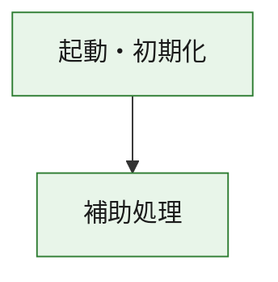
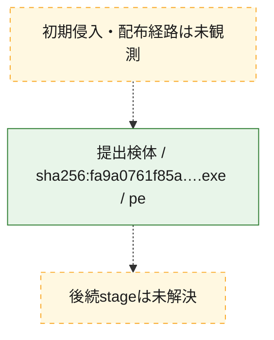
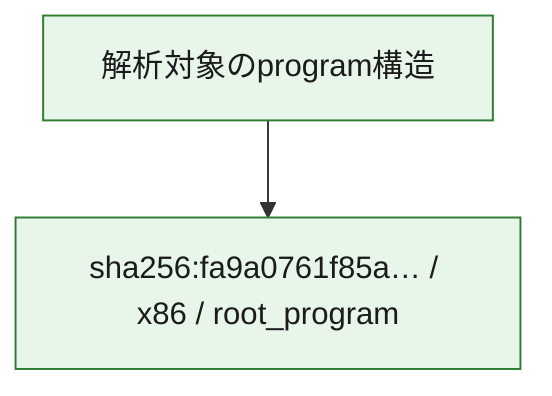

# 全体ロジック：fa9a0761f85ab411c81874cd873d6d4e0bb0a539437043b96066d1e456af020c

代表関数の静的証跡から、起動・初期化の処理群を確認しました。

## 読み方

- phaseの掲載順は解析上の整理順です。observed_call_edgesがない段階間の実行順を断定しません。
- 図の実線は静的に観測した関係、点線と黄色のノードは未観測・未解決の関係を示します。
- 図は静的な要約であり、動的実行を再現するものではありません。
- 詳細な関数解説とfingerprintは[STATIC-LOGIC.md](STATIC-LOGIC.md)を参照してください。

## 静的可視化

### 実行フロー

### 感染チェーン

### モジュール関係

## 処理段階

### 1. 起動・初期化

entry pointから初期化と後続処理への移行を確認します。
確度: `confirmed_static_function_evidence`

- `fa9a0761f85ab411c81874cd873d6d4e0bb0a539437043b96066d1e456af020c:ghidra:180001010` — 初期化と主要処理への分岐を行う入口関数です。 状態: `succeeded`、選定理由: `entry_point`, `meaningful_symbol_name`, `reviewed_call_centrality:22`, `role:entrypoint`, `small_program_complete_context`

### 2. 補助処理

主要処理を支える一般内部関数またはlibrary処理を確認します。
確度: `confirmed_static_function_evidence`

- `fa9a0761f85ab411c81874cd873d6d4e0bb0a539437043b96066d1e456af020c:ghidra:180001240` — 検体内部の一般処理を実装する関数です。 状態: `succeeded`、選定理由: `context_representative`, `reviewed_call_centrality:2`, `small_program_complete_context`
- `fa9a0761f85ab411c81874cd873d6d4e0bb0a539437043b96066d1e456af020c:ghidra:180001350` — 検体内部の一般処理を実装する関数です。 状態: `succeeded`、選定理由: `context_representative`, `reviewed_call_centrality:25`, `small_program_complete_context`
- `fa9a0761f85ab411c81874cd873d6d4e0bb0a539437043b96066d1e456af020c:ghidra:180003780` — 検体内部の一般処理を実装する関数です。 状態: `succeeded`、選定理由: `context_representative`, `reviewed_call_centrality:2`, `small_program_complete_context`
- `fa9a0761f85ab411c81874cd873d6d4e0bb0a539437043b96066d1e456af020c:ghidra:1800038e0` — 検体内部の一般処理を実装する関数です。 状態: `succeeded`、選定理由: `context_representative`, `reviewed_call_centrality:2`, `small_program_complete_context`

## 観測したcall関係

- `fa9a0761f85ab411c81874cd873d6d4e0bb0a539437043b96066d1e456af020c:ghidra:180001010` → `fa9a0761f85ab411c81874cd873d6d4e0bb0a539437043b96066d1e456af020c:ghidra:180001240` （`startup` → `support`）
- `fa9a0761f85ab411c81874cd873d6d4e0bb0a539437043b96066d1e456af020c:ghidra:180001010` → `fa9a0761f85ab411c81874cd873d6d4e0bb0a539437043b96066d1e456af020c:ghidra:180001350` （`startup` → `support`）
- `fa9a0761f85ab411c81874cd873d6d4e0bb0a539437043b96066d1e456af020c:ghidra:180001350` → `fa9a0761f85ab411c81874cd873d6d4e0bb0a539437043b96066d1e456af020c:ghidra:180001240` （`support` → `support`）
- `fa9a0761f85ab411c81874cd873d6d4e0bb0a539437043b96066d1e456af020c:ghidra:180001350` → `fa9a0761f85ab411c81874cd873d6d4e0bb0a539437043b96066d1e456af020c:ghidra:180003780` （`support` → `support`）
- `fa9a0761f85ab411c81874cd873d6d4e0bb0a539437043b96066d1e456af020c:ghidra:180001350` → `fa9a0761f85ab411c81874cd873d6d4e0bb0a539437043b96066d1e456af020c:ghidra:1800038e0` （`support` → `support`）
- `fa9a0761f85ab411c81874cd873d6d4e0bb0a539437043b96066d1e456af020c:ghidra:180003780` → `fa9a0761f85ab411c81874cd873d6d4e0bb0a539437043b96066d1e456af020c:ghidra:1800038e0` （`support` → `support`）
- `ghidra-function:2e276ca329b0087a8daa3a18` → `ghidra-external:1812a95485e0641f601ebe5a` （`unclassified` → `unclassified`）
- `ghidra-function:2e276ca329b0087a8daa3a18` → `ghidra-external:1c99d01bd79f79a543baf024` （`unclassified` → `unclassified`）
- `ghidra-function:2e276ca329b0087a8daa3a18` → `ghidra-external:4dd4f701213a7b3f06ee08de` （`unclassified` → `unclassified`）
- `ghidra-function:2e276ca329b0087a8daa3a18` → `ghidra-external:60cc41298f3a64f59c275e86` （`unclassified` → `unclassified`）
- `ghidra-function:2e276ca329b0087a8daa3a18` → `ghidra-external:66e2480edf154f0b3adb0655` （`unclassified` → `unclassified`）
- `ghidra-function:2e276ca329b0087a8daa3a18` → `ghidra-external:7538d7e6f6d32bc60514c0eb` （`unclassified` → `unclassified`）
- `ghidra-function:2e276ca329b0087a8daa3a18` → `ghidra-external:8f6080952b295dcb120f975b` （`unclassified` → `unclassified`）
- `ghidra-function:2e276ca329b0087a8daa3a18` → `ghidra-external:9137ecca97fa8793ce4a5e78` （`unclassified` → `unclassified`）
- `ghidra-function:2e276ca329b0087a8daa3a18` → `ghidra-external:92d10c662eab2b88ca07ba18` （`unclassified` → `unclassified`）
- `ghidra-function:2e276ca329b0087a8daa3a18` → `ghidra-external:a2aa582e35e37154a45964eb` （`unclassified` → `unclassified`）
- `ghidra-function:2e276ca329b0087a8daa3a18` → `ghidra-external:a40ce0c2366d8e44e12059df` （`unclassified` → `unclassified`）
- `ghidra-function:2e276ca329b0087a8daa3a18` → `ghidra-external:a72f474625e2191ff683294a` （`unclassified` → `unclassified`）
- `ghidra-function:2e276ca329b0087a8daa3a18` → `ghidra-external:c27d2048030c4b9a13343f40` （`unclassified` → `unclassified`）
- `ghidra-function:2e276ca329b0087a8daa3a18` → `ghidra-external:c818ceb4c1d2f730da03c7c7` （`unclassified` → `unclassified`）
- `ghidra-function:2e276ca329b0087a8daa3a18` → `ghidra-external:cc2ae547568626b3ecfb008e` （`unclassified` → `unclassified`）
- `ghidra-function:2e276ca329b0087a8daa3a18` → `ghidra-external:cec3e6e91c894db7e11fe760` （`unclassified` → `unclassified`）
- `ghidra-function:2e276ca329b0087a8daa3a18` → `ghidra-external:d8aaa60b4cb77e888a1314d6` （`unclassified` → `unclassified`）
- `ghidra-function:2e276ca329b0087a8daa3a18` → `ghidra-external:dfc2107d245300c984b50af3` （`unclassified` → `unclassified`）
- `ghidra-function:2e276ca329b0087a8daa3a18` → `ghidra-external:f1667e4930a8f1e8eb2822a5` （`unclassified` → `unclassified`）
- `ghidra-function:2e276ca329b0087a8daa3a18` → `ghidra-external:f4d3240a61fb822496d47a45` （`unclassified` → `unclassified`）
- `ghidra-function:2e276ca329b0087a8daa3a18` → `ghidra-external:fc8cdf9bc2ba30856d32abba` （`unclassified` → `unclassified`）
- `ghidra-function:2e276ca329b0087a8daa3a18` → `ghidra-function:c3689bbb94744710f1becf74` （`unclassified` → `unclassified`）
- `ghidra-function:2e276ca329b0087a8daa3a18` → `ghidra-function:dcf3538f2674dd3c6d6d9a2f` （`unclassified` → `unclassified`）
- `ghidra-function:2e276ca329b0087a8daa3a18` → `ghidra-function:ee4a1324af9dd1ad60e2bae1` （`unclassified` → `unclassified`）
- `ghidra-function:4e6cf502f01cfcded25c46a1` → `ghidra-function:061eb2c54f9c0b52d2c2de8b` （`unclassified` → `unclassified`）
- `ghidra-function:4e6cf502f01cfcded25c46a1` → `ghidra-function:09cc617b0168a4bbcbe9d492` （`unclassified` → `unclassified`）
- `ghidra-function:4e6cf502f01cfcded25c46a1` → `ghidra-function:2e276ca329b0087a8daa3a18` （`unclassified` → `unclassified`）
- `ghidra-function:4e6cf502f01cfcded25c46a1` → `ghidra-function:5854bb5e2aa2419d5cff230d` （`unclassified` → `unclassified`）
- `ghidra-function:4e6cf502f01cfcded25c46a1` → `ghidra-function:6750e684aa7a287170b45f15` （`unclassified` → `unclassified`）
- `ghidra-function:4e6cf502f01cfcded25c46a1` → `ghidra-function:6a92b0dcc5912dba98cfd494` （`unclassified` → `unclassified`）
- `ghidra-function:4e6cf502f01cfcded25c46a1` → `ghidra-function:6afcbe82cf6314cafe4e7e67` （`unclassified` → `unclassified`）
- `ghidra-function:4e6cf502f01cfcded25c46a1` → `ghidra-function:7d46de5d39e6358a47c15935` （`unclassified` → `unclassified`）
- `ghidra-function:4e6cf502f01cfcded25c46a1` → `ghidra-function:b1919d196410587524e82527` （`unclassified` → `unclassified`）
- `ghidra-function:4e6cf502f01cfcded25c46a1` → `ghidra-function:b74e6495f1ab913a453fb3ff` （`unclassified` → `unclassified`）
- `ghidra-function:4e6cf502f01cfcded25c46a1` → `ghidra-function:b7a0cd7fb6b5e2421d9b8262` （`unclassified` → `unclassified`）
- `ghidra-function:4e6cf502f01cfcded25c46a1` → `ghidra-function:c3689bbb94744710f1becf74` （`unclassified` → `unclassified`）
- `ghidra-function:ee4a1324af9dd1ad60e2bae1` → `ghidra-function:dcf3538f2674dd3c6d6d9a2f` （`unclassified` → `unclassified`）

## 解析範囲と制約

- 選定外関数は全体inventoryへ残しますが、関数本体の個別解説対象にはしていません。
- indirect call、難読化、packer、VM、壊れたcontrol flowによりcall関係が欠落する場合があります。
- 文書は静的解析に基づき、検体実行や外部通信による動的確認は行っていません。
