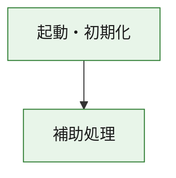
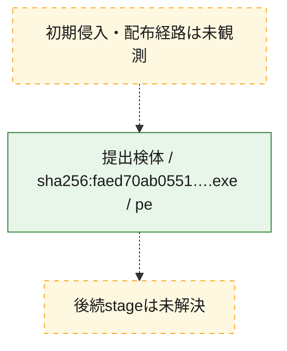
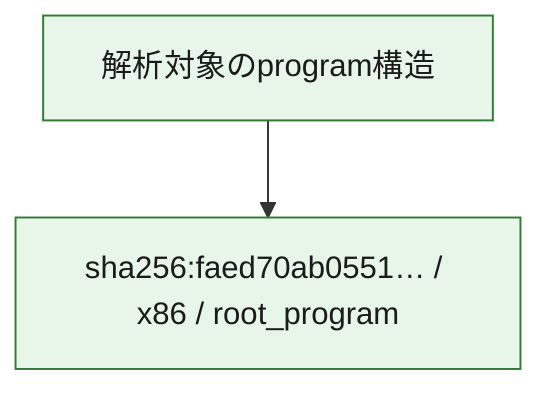

# 全体ロジック：faed70ab05519d00215606f9f405374565bd535e072ff47fe425898da72996db

代表関数の静的証跡から、起動・初期化の処理群を確認しました。

## 読み方

- phaseの掲載順は解析上の整理順です。observed_call_edgesがない段階間の実行順を断定しません。
- 図の実線は静的に観測した関係、点線と黄色のノードは未観測・未解決の関係を示します。
- 図は静的な要約であり、動的実行を再現するものではありません。
- 詳細な関数解説とfingerprintは[STATIC-LOGIC.md](STATIC-LOGIC.md)を参照してください。

## 静的可視化

### 実行フロー

### 感染チェーン

### モジュール関係

## 処理段階

### 1. 起動・初期化

entry pointから初期化と後続処理への移行を確認します。
確度: `confirmed_static_function_evidence`

- `faed70ab05519d00215606f9f405374565bd535e072ff47fe425898da72996db:ghidra:180001010` — 初期化と主要処理への分岐を行う入口関数です。 状態: `succeeded`、選定理由: `entry_point`, `meaningful_symbol_name`, `reviewed_call_centrality:22`, `role:entrypoint`, `small_program_complete_context`

### 2. 補助処理

主要処理を支える一般内部関数またはlibrary処理を確認します。
確度: `confirmed_static_function_evidence`

- `faed70ab05519d00215606f9f405374565bd535e072ff47fe425898da72996db:ghidra:180001240` — 検体内部の一般処理を実装する関数です。 状態: `succeeded`、選定理由: `context_representative`, `reviewed_call_centrality:2`, `small_program_complete_context`
- `faed70ab05519d00215606f9f405374565bd535e072ff47fe425898da72996db:ghidra:180001350` — 検体内部の一般処理を実装する関数です。 状態: `succeeded`、選定理由: `context_representative`, `reviewed_call_centrality:25`, `small_program_complete_context`
- `faed70ab05519d00215606f9f405374565bd535e072ff47fe425898da72996db:ghidra:180003780` — 検体内部の一般処理を実装する関数です。 状態: `succeeded`、選定理由: `context_representative`, `reviewed_call_centrality:2`, `small_program_complete_context`
- `faed70ab05519d00215606f9f405374565bd535e072ff47fe425898da72996db:ghidra:1800038e0` — 検体内部の一般処理を実装する関数です。 状態: `succeeded`、選定理由: `context_representative`, `reviewed_call_centrality:2`, `small_program_complete_context`

## 観測したcall関係

- `faed70ab05519d00215606f9f405374565bd535e072ff47fe425898da72996db:ghidra:180001010` → `faed70ab05519d00215606f9f405374565bd535e072ff47fe425898da72996db:ghidra:180001240` （`startup` → `support`）
- `faed70ab05519d00215606f9f405374565bd535e072ff47fe425898da72996db:ghidra:180001010` → `faed70ab05519d00215606f9f405374565bd535e072ff47fe425898da72996db:ghidra:180001350` （`startup` → `support`）
- `faed70ab05519d00215606f9f405374565bd535e072ff47fe425898da72996db:ghidra:180001350` → `faed70ab05519d00215606f9f405374565bd535e072ff47fe425898da72996db:ghidra:180001240` （`support` → `support`）
- `faed70ab05519d00215606f9f405374565bd535e072ff47fe425898da72996db:ghidra:180001350` → `faed70ab05519d00215606f9f405374565bd535e072ff47fe425898da72996db:ghidra:180003780` （`support` → `support`）
- `faed70ab05519d00215606f9f405374565bd535e072ff47fe425898da72996db:ghidra:180001350` → `faed70ab05519d00215606f9f405374565bd535e072ff47fe425898da72996db:ghidra:1800038e0` （`support` → `support`）
- `faed70ab05519d00215606f9f405374565bd535e072ff47fe425898da72996db:ghidra:180003780` → `faed70ab05519d00215606f9f405374565bd535e072ff47fe425898da72996db:ghidra:1800038e0` （`support` → `support`）
- `ghidra-function:27e137d5e2bd0809b6b1d9dc` → `ghidra-function:0470b2aa340a078d735d1890` （`unclassified` → `unclassified`）
- `ghidra-function:27e137d5e2bd0809b6b1d9dc` → `ghidra-function:1b9dfc09572042871c8230a0` （`unclassified` → `unclassified`）
- `ghidra-function:27e137d5e2bd0809b6b1d9dc` → `ghidra-function:4863839f651fd6fb1c2676fd` （`unclassified` → `unclassified`）
- `ghidra-function:27e137d5e2bd0809b6b1d9dc` → `ghidra-function:70c88c464c6150e5c55c2e8a` （`unclassified` → `unclassified`）
- `ghidra-function:27e137d5e2bd0809b6b1d9dc` → `ghidra-function:7ce990b5db3385f53ff1eeb0` （`unclassified` → `unclassified`）
- `ghidra-function:27e137d5e2bd0809b6b1d9dc` → `ghidra-function:84df83df1f2e802945a4caa1` （`unclassified` → `unclassified`）
- `ghidra-function:27e137d5e2bd0809b6b1d9dc` → `ghidra-function:850ed5e3c366b1bc54318656` （`unclassified` → `unclassified`）
- `ghidra-function:27e137d5e2bd0809b6b1d9dc` → `ghidra-function:9fae8df1b07bdf7f408d70ce` （`unclassified` → `unclassified`）
- `ghidra-function:27e137d5e2bd0809b6b1d9dc` → `ghidra-function:a6845ae32eb82b0825e142cb` （`unclassified` → `unclassified`）
- `ghidra-function:27e137d5e2bd0809b6b1d9dc` → `ghidra-function:ba6fccdf2f96744168ad384d` （`unclassified` → `unclassified`）
- `ghidra-function:27e137d5e2bd0809b6b1d9dc` → `ghidra-function:c4e90f8ee43c46625e1411ac` （`unclassified` → `unclassified`）
- `ghidra-function:27e137d5e2bd0809b6b1d9dc` → `ghidra-function:e47ac71a7bfc7b51f430d47f` （`unclassified` → `unclassified`）
- `ghidra-function:7ce990b5db3385f53ff1eeb0` → `ghidra-external:047df5438c424c067faeb789` （`unclassified` → `unclassified`）
- `ghidra-function:7ce990b5db3385f53ff1eeb0` → `ghidra-external:09c469c2dca996237e3039ac` （`unclassified` → `unclassified`）
- `ghidra-function:7ce990b5db3385f53ff1eeb0` → `ghidra-external:0ea4d2141aa61a17c0afa11f` （`unclassified` → `unclassified`）
- `ghidra-function:7ce990b5db3385f53ff1eeb0` → `ghidra-external:19d6d60ac9bd5729dbd2752b` （`unclassified` → `unclassified`）
- `ghidra-function:7ce990b5db3385f53ff1eeb0` → `ghidra-external:1cdfe0902bf02a0d727d38bd` （`unclassified` → `unclassified`）
- `ghidra-function:7ce990b5db3385f53ff1eeb0` → `ghidra-external:379c9dc861c6cd5f2d3c69fa` （`unclassified` → `unclassified`）
- `ghidra-function:7ce990b5db3385f53ff1eeb0` → `ghidra-external:3c5e7fdcbaa7facf3b27cd16` （`unclassified` → `unclassified`）
- `ghidra-function:7ce990b5db3385f53ff1eeb0` → `ghidra-external:5498e0248071076a095b349d` （`unclassified` → `unclassified`）
- `ghidra-function:7ce990b5db3385f53ff1eeb0` → `ghidra-external:54b05b5801095d59b51e86ca` （`unclassified` → `unclassified`）
- `ghidra-function:7ce990b5db3385f53ff1eeb0` → `ghidra-external:600e8899d0be34f7bd234b28` （`unclassified` → `unclassified`）
- `ghidra-function:7ce990b5db3385f53ff1eeb0` → `ghidra-external:60f03560b39ed2980cd1396c` （`unclassified` → `unclassified`）
- `ghidra-function:7ce990b5db3385f53ff1eeb0` → `ghidra-external:614ad96b0402e5d66db8ecff` （`unclassified` → `unclassified`）
- `ghidra-function:7ce990b5db3385f53ff1eeb0` → `ghidra-external:8755c650a7b45df20c40e043` （`unclassified` → `unclassified`）
- `ghidra-function:7ce990b5db3385f53ff1eeb0` → `ghidra-external:884c17ceb6f3dfd5111147c0` （`unclassified` → `unclassified`）
- `ghidra-function:7ce990b5db3385f53ff1eeb0` → `ghidra-external:96442204cace9eb1668311c3` （`unclassified` → `unclassified`）
- `ghidra-function:7ce990b5db3385f53ff1eeb0` → `ghidra-external:9adec2a009a6a858b5f8c293` （`unclassified` → `unclassified`）
- `ghidra-function:7ce990b5db3385f53ff1eeb0` → `ghidra-external:a185dd49bd08ff15f112b34c` （`unclassified` → `unclassified`）
- `ghidra-function:7ce990b5db3385f53ff1eeb0` → `ghidra-external:ba0172ad82dd7499e1f47f54` （`unclassified` → `unclassified`）
- `ghidra-function:7ce990b5db3385f53ff1eeb0` → `ghidra-external:c0891c1456bdaaa0cc6923a8` （`unclassified` → `unclassified`）
- `ghidra-function:7ce990b5db3385f53ff1eeb0` → `ghidra-external:c3a3c5300c383c394a14742a` （`unclassified` → `unclassified`）
- `ghidra-function:7ce990b5db3385f53ff1eeb0` → `ghidra-external:d79af798a4290f4661972377` （`unclassified` → `unclassified`）
- `ghidra-function:7ce990b5db3385f53ff1eeb0` → `ghidra-function:7ae3c8f4a012ebf4c28e0504` （`unclassified` → `unclassified`）
- `ghidra-function:7ce990b5db3385f53ff1eeb0` → `ghidra-function:850ed5e3c366b1bc54318656` （`unclassified` → `unclassified`）
- `ghidra-function:7ce990b5db3385f53ff1eeb0` → `ghidra-function:c1c036235cb883e00a671181` （`unclassified` → `unclassified`）
- `ghidra-function:c1c036235cb883e00a671181` → `ghidra-function:7ae3c8f4a012ebf4c28e0504` （`unclassified` → `unclassified`）

## 解析範囲と制約

- 選定外関数は全体inventoryへ残しますが、関数本体の個別解説対象にはしていません。
- indirect call、難読化、packer、VM、壊れたcontrol flowによりcall関係が欠落する場合があります。
- 文書は静的解析に基づき、検体実行や外部通信による動的確認は行っていません。
