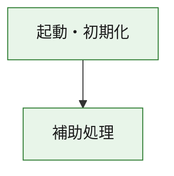
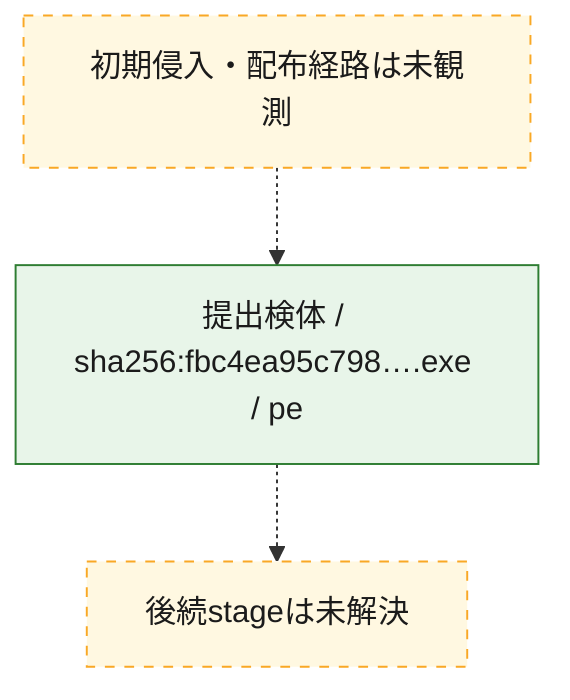
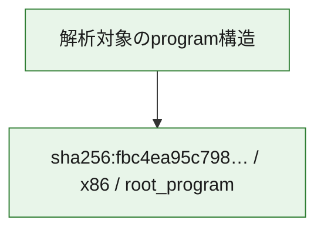

# 全体ロジック：fbc4ea95c798b07e9a25b83948547adb9f35319ff92170aff574581c2d9a56e3

代表関数の静的証跡から、起動・初期化の処理群を確認しました。

## 読み方

- phaseの掲載順は解析上の整理順です。observed_call_edgesがない段階間の実行順を断定しません。
- 図の実線は静的に観測した関係、点線と黄色のノードは未観測・未解決の関係を示します。
- 図は静的な要約であり、動的実行を再現するものではありません。
- 詳細な関数解説とfingerprintは[STATIC-LOGIC.md](STATIC-LOGIC.md)を参照してください。

## 静的可視化

### 実行フロー

### 感染チェーン

### モジュール関係

## 処理段階

### 1. 起動・初期化

entry pointから初期化と後続処理への移行を確認します。
確度: `confirmed_static_function_evidence`

- `fbc4ea95c798b07e9a25b83948547adb9f35319ff92170aff574581c2d9a56e3:ghidra:180001010` — 初期化と主要処理への分岐を行う入口関数です。 状態: `succeeded`、選定理由: `entry_point`, `meaningful_symbol_name`, `reviewed_call_centrality:22`, `role:entrypoint`, `small_program_complete_context`

### 2. 補助処理

主要処理を支える一般内部関数またはlibrary処理を確認します。
確度: `confirmed_static_function_evidence`

- `fbc4ea95c798b07e9a25b83948547adb9f35319ff92170aff574581c2d9a56e3:ghidra:180001240` — 検体内部の一般処理を実装する関数です。 状態: `succeeded`、選定理由: `context_representative`, `reviewed_call_centrality:2`, `small_program_complete_context`
- `fbc4ea95c798b07e9a25b83948547adb9f35319ff92170aff574581c2d9a56e3:ghidra:180001350` — 検体内部の一般処理を実装する関数です。 状態: `succeeded`、選定理由: `context_representative`, `reviewed_call_centrality:25`, `small_program_complete_context`
- `fbc4ea95c798b07e9a25b83948547adb9f35319ff92170aff574581c2d9a56e3:ghidra:180003780` — 検体内部の一般処理を実装する関数です。 状態: `succeeded`、選定理由: `context_representative`, `reviewed_call_centrality:2`, `small_program_complete_context`
- `fbc4ea95c798b07e9a25b83948547adb9f35319ff92170aff574581c2d9a56e3:ghidra:1800038e0` — 検体内部の一般処理を実装する関数です。 状態: `succeeded`、選定理由: `context_representative`, `reviewed_call_centrality:2`, `small_program_complete_context`

## 観測したcall関係

- `fbc4ea95c798b07e9a25b83948547adb9f35319ff92170aff574581c2d9a56e3:ghidra:180001010` → `fbc4ea95c798b07e9a25b83948547adb9f35319ff92170aff574581c2d9a56e3:ghidra:180001240` （`startup` → `support`）
- `fbc4ea95c798b07e9a25b83948547adb9f35319ff92170aff574581c2d9a56e3:ghidra:180001010` → `fbc4ea95c798b07e9a25b83948547adb9f35319ff92170aff574581c2d9a56e3:ghidra:180001350` （`startup` → `support`）
- `fbc4ea95c798b07e9a25b83948547adb9f35319ff92170aff574581c2d9a56e3:ghidra:180001350` → `fbc4ea95c798b07e9a25b83948547adb9f35319ff92170aff574581c2d9a56e3:ghidra:180001240` （`support` → `support`）
- `fbc4ea95c798b07e9a25b83948547adb9f35319ff92170aff574581c2d9a56e3:ghidra:180001350` → `fbc4ea95c798b07e9a25b83948547adb9f35319ff92170aff574581c2d9a56e3:ghidra:180003780` （`support` → `support`）
- `fbc4ea95c798b07e9a25b83948547adb9f35319ff92170aff574581c2d9a56e3:ghidra:180001350` → `fbc4ea95c798b07e9a25b83948547adb9f35319ff92170aff574581c2d9a56e3:ghidra:1800038e0` （`support` → `support`）
- `fbc4ea95c798b07e9a25b83948547adb9f35319ff92170aff574581c2d9a56e3:ghidra:180003780` → `fbc4ea95c798b07e9a25b83948547adb9f35319ff92170aff574581c2d9a56e3:ghidra:1800038e0` （`support` → `support`）
- `ghidra-function:0c3aa434fcc6f717b605a20d` → `ghidra-function:e8945d6bc6e5237e4bb4dca8` （`unclassified` → `unclassified`）
- `ghidra-function:1e024ba7cf283ffd22ebeb55` → `ghidra-external:07f196d569eec2cb638e47ab` （`unclassified` → `unclassified`）
- `ghidra-function:1e024ba7cf283ffd22ebeb55` → `ghidra-external:13059d91fd6e77772aefdff2` （`unclassified` → `unclassified`）
- `ghidra-function:1e024ba7cf283ffd22ebeb55` → `ghidra-external:17c31faee145236a344d3b86` （`unclassified` → `unclassified`）
- `ghidra-function:1e024ba7cf283ffd22ebeb55` → `ghidra-external:1d4f3675323718439b4926fb` （`unclassified` → `unclassified`）
- `ghidra-function:1e024ba7cf283ffd22ebeb55` → `ghidra-external:1d5c2ad8c29e376ccf3fa739` （`unclassified` → `unclassified`）
- `ghidra-function:1e024ba7cf283ffd22ebeb55` → `ghidra-external:456e5c2f4038762c8272a90b` （`unclassified` → `unclassified`）
- `ghidra-function:1e024ba7cf283ffd22ebeb55` → `ghidra-external:466e6813e5f1ed537887f15f` （`unclassified` → `unclassified`）
- `ghidra-function:1e024ba7cf283ffd22ebeb55` → `ghidra-external:4c474bbea23009732e277052` （`unclassified` → `unclassified`）
- `ghidra-function:1e024ba7cf283ffd22ebeb55` → `ghidra-external:53ebb8416ebe16fa51e8299f` （`unclassified` → `unclassified`）
- `ghidra-function:1e024ba7cf283ffd22ebeb55` → `ghidra-external:565cf94aade3da6ed329ffa2` （`unclassified` → `unclassified`）
- `ghidra-function:1e024ba7cf283ffd22ebeb55` → `ghidra-external:7031424622c4ea8135ef0ed1` （`unclassified` → `unclassified`）
- `ghidra-function:1e024ba7cf283ffd22ebeb55` → `ghidra-external:7cab24446a7a93c63af40745` （`unclassified` → `unclassified`）
- `ghidra-function:1e024ba7cf283ffd22ebeb55` → `ghidra-external:86dadad8e0195a924172f2ec` （`unclassified` → `unclassified`）
- `ghidra-function:1e024ba7cf283ffd22ebeb55` → `ghidra-external:8c57b2f1e012049711bc4322` （`unclassified` → `unclassified`）
- `ghidra-function:1e024ba7cf283ffd22ebeb55` → `ghidra-external:8fecd863ccc20dcaeb8d41b4` （`unclassified` → `unclassified`）
- `ghidra-function:1e024ba7cf283ffd22ebeb55` → `ghidra-external:9b15e5a1107e6824886b54b3` （`unclassified` → `unclassified`）
- `ghidra-function:1e024ba7cf283ffd22ebeb55` → `ghidra-external:a9be681a46add01e472dd56a` （`unclassified` → `unclassified`）
- `ghidra-function:1e024ba7cf283ffd22ebeb55` → `ghidra-external:bd3a8abf3fbac37a9e9b0854` （`unclassified` → `unclassified`）
- `ghidra-function:1e024ba7cf283ffd22ebeb55` → `ghidra-external:c4fc13f3b6736fef8c74c7c0` （`unclassified` → `unclassified`）
- `ghidra-function:1e024ba7cf283ffd22ebeb55` → `ghidra-external:ddf6327cbd9051c55a66f088` （`unclassified` → `unclassified`）
- `ghidra-function:1e024ba7cf283ffd22ebeb55` → `ghidra-external:ff13fca86c270c5cc2f3ec24` （`unclassified` → `unclassified`）
- `ghidra-function:1e024ba7cf283ffd22ebeb55` → `ghidra-function:0c3aa434fcc6f717b605a20d` （`unclassified` → `unclassified`）
- `ghidra-function:1e024ba7cf283ffd22ebeb55` → `ghidra-function:7fb2b1b824bbee9abce6c050` （`unclassified` → `unclassified`）
- `ghidra-function:1e024ba7cf283ffd22ebeb55` → `ghidra-function:e8945d6bc6e5237e4bb4dca8` （`unclassified` → `unclassified`）
- `ghidra-function:9845bad67d99cee40d3d77ee` → `ghidra-function:0a40a88140ec45d7398aa283` （`unclassified` → `unclassified`）
- `ghidra-function:9845bad67d99cee40d3d77ee` → `ghidra-function:1e024ba7cf283ffd22ebeb55` （`unclassified` → `unclassified`）
- `ghidra-function:9845bad67d99cee40d3d77ee` → `ghidra-function:2b18a9a557050fef399342f6` （`unclassified` → `unclassified`）
- `ghidra-function:9845bad67d99cee40d3d77ee` → `ghidra-function:7cd9bf5709018a27745d87f8` （`unclassified` → `unclassified`）
- `ghidra-function:9845bad67d99cee40d3d77ee` → `ghidra-function:7fb2b1b824bbee9abce6c050` （`unclassified` → `unclassified`）
- `ghidra-function:9845bad67d99cee40d3d77ee` → `ghidra-function:8561c2d457a4eacfbd4fb2fc` （`unclassified` → `unclassified`）
- `ghidra-function:9845bad67d99cee40d3d77ee` → `ghidra-function:9bc85b1051c98853fac5f4c3` （`unclassified` → `unclassified`）
- `ghidra-function:9845bad67d99cee40d3d77ee` → `ghidra-function:c1c74654fa6ff2900d1b5f87` （`unclassified` → `unclassified`）
- `ghidra-function:9845bad67d99cee40d3d77ee` → `ghidra-function:d54c5ebc84b9966cab89eb5c` （`unclassified` → `unclassified`）
- `ghidra-function:9845bad67d99cee40d3d77ee` → `ghidra-function:d78c053b99005b978037a883` （`unclassified` → `unclassified`）
- `ghidra-function:9845bad67d99cee40d3d77ee` → `ghidra-function:f979b05c11ac075d2a01252d` （`unclassified` → `unclassified`）
- `ghidra-function:9845bad67d99cee40d3d77ee` → `ghidra-function:fc5e0ffbac7140f766fc57cb` （`unclassified` → `unclassified`）

## 解析範囲と制約

- 選定外関数は全体inventoryへ残しますが、関数本体の個別解説対象にはしていません。
- indirect call、難読化、packer、VM、壊れたcontrol flowによりcall関係が欠落する場合があります。
- 文書は静的解析に基づき、検体実行や外部通信による動的確認は行っていません。
