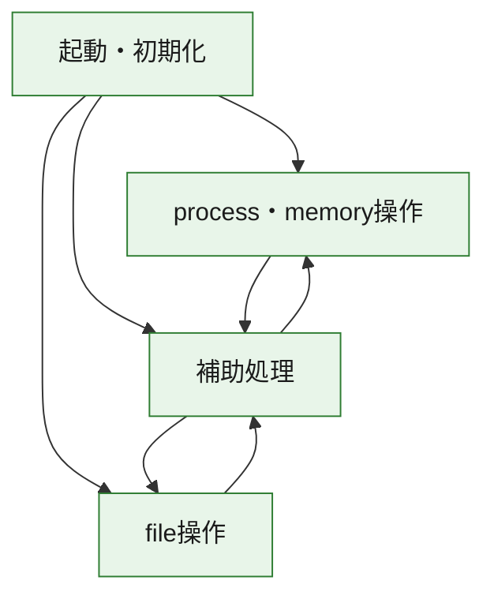
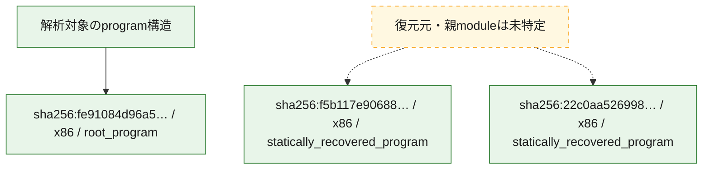

# 全体ロジック：fe91084d96a5f55268a7a72372182e0264730660588e642876a0506abdc61ed7

代表関数の静的証跡から、起動・初期化、process・memory操作、file操作の処理群を確認しました。

## 読み方

- phaseの掲載順は解析上の整理順です。observed_call_edgesがない段階間の実行順を断定しません。
- 図の実線は静的に観測した関係、点線と黄色のノードは未観測・未解決の関係を示します。
- 図は静的な要約であり、動的実行を再現するものではありません。
- 詳細な関数解説とfingerprintは[STATIC-LOGIC.md](STATIC-LOGIC.md)を参照してください。

## 静的可視化

### 実行フロー

### 感染チェーン

```mermaid
flowchart TD
  chain_initial["初期侵入・配布経路は未観測"]
  chain_01["提出検体 / sha256:fe91084d96a5….exe / pe"]
  chain_02["静的復元層 1 / sha256:fe91084d96a5….exe::nsis-member-006-7z.7z / 7z"]
  chain_03["静的復元層 2 / sha256:fe91084d96a5….exe::nsis-member-006-7z.7z::7z-asar / asar"]
  chain_04["静的復元層 3 / sha256:fe91084d96a5….exe::nsis-member-006-7z.7z::7z-asar::asar-s / script"]
  chain_05["静的復元層 3 / sha256:fe91084d96a5….exe::nsis-member-006-7z.7z::7z-asar::asar-s / script"]
  chain_06["静的復元層 3 / sha256:fe91084d96a5….exe::nsis-member-006-7z.7z::7z-asar::asar-s / script"]
  chain_07["静的復元層 3 / sha256:fe91084d96a5….exe::nsis-member-006-7z.7z::7z-asar::asar-s / script"]
  chain_08["静的復元層 3 / sha256:fe91084d96a5….exe::nsis-member-006-7z.7z::7z-asar::asar-s / script"]
  chain_09["静的復元層 3 / sha256:fe91084d96a5….exe::nsis-member-006-7z.7z::7z-asar::asar-s / script"]
  chain_10["静的復元層 3 / sha256:fe91084d96a5….exe::nsis-member-006-7z.7z::7z-asar::asar-s / script"]
  chain_11["静的復元層 3 / sha256:fe91084d96a5….exe::nsis-member-006-7z.7z::7z-asar::asar-s / script"]
  chain_12["静的復元層 3 / sha256:fe91084d96a5….exe::nsis-member-006-7z.7z::7z-asar::asar-s / script"]
  chain_13["静的復元層 3 / sha256:fe91084d96a5….exe::nsis-member-006-7z.7z::7z-asar::asar-s / script"]
  chain_14["静的復元層 3 / sha256:fe91084d96a5….exe::nsis-member-006-7z.7z::7z-asar::asar-s / script"]
  chain_15["静的復元層 3 / sha256:fe91084d96a5….exe::nsis-member-006-7z.7z::7z-asar::asar-s / script"]
  chain_16["静的復元層 3 / sha256:fe91084d96a5….exe::nsis-member-006-7z.7z::7z-asar::asar-s / script"]
  chain_01 -->|nsis-member-006-7z.7z| chain_02
  chain_02 -->|7z-asar| chain_03
  chain_03 -->|asar-script| chain_04
  chain_03 -->|asar-script| chain_05
  chain_03 -->|asar-script| chain_06
  chain_03 -->|asar-script| chain_07
  chain_03 -->|asar-script| chain_08
  chain_03 -->|asar-script| chain_09
  chain_03 -->|asar-script| chain_10
  chain_03 -->|asar-script| chain_11
  chain_03 -->|asar-script| chain_12
  chain_03 -->|asar-script| chain_13
  chain_03 -->|asar-script| chain_14
  chain_03 -->|asar-script| chain_15
  chain_03 -->|asar-script| chain_16
  chain_initial -.-> chain_01
  chain_more["その他240層はstatic-layers.jsonを参照"]
  chain_04 -.-> chain_more
  chain_05 -.-> chain_more
  chain_06 -.-> chain_more
  chain_07 -.-> chain_more
  chain_08 -.-> chain_more
  chain_09 -.-> chain_more
  chain_10 -.-> chain_more
  chain_11 -.-> chain_more
  chain_12 -.-> chain_more
  chain_13 -.-> chain_more
  chain_14 -.-> chain_more
  chain_15 -.-> chain_more
  chain_16 -.-> chain_more
  class chain_more unresolved
  class chain_01,chain_02,chain_03,chain_04,chain_05,chain_06,chain_07,chain_08,chain_09,chain_10,chain_11,chain_12,chain_13,chain_14,chain_15,chain_16 confirmed
  class chain_initial unresolved
  classDef confirmed fill:#e8f5e9,stroke:#2e7d32,color:#1b1b1b
  classDef unresolved fill:#fff8e1,stroke:#f9a825,color:#1b1b1b,stroke-dasharray:5 5
```

### モジュール関係

## 処理段階

### 1. 起動・初期化

entry pointから初期化と後続処理への移行を確認します。
確度: `confirmed_static_function_evidence`

- `f5b117e9068861c9e5994652fdca01b4c138f79cd920c5d4fcacb962993fee7d:ghidra:180009a50` — 初期化と主要処理への分岐を行う入口関数です。 状態: `succeeded`、選定理由: `entry_point`, `meaningful_symbol_name`, `reviewed_call_centrality:5`, `role:entrypoint`
- `22c0aa5269981a29a528eb3ddcf4e214dfd0d7cfd2449c3661a2d3cd25657b48:ghidra:180008280` — 初期化と主要処理への分岐を行う入口関数です。 状態: `succeeded`、選定理由: `entry_point`, `meaningful_symbol_name`, `reviewed_call_centrality:5`, `role:entrypoint`
- `fe91084d96a5f55268a7a72372182e0264730660588e642876a0506abdc61ed7:ghidra:0040338f` — 初期化と主要処理への分岐を行う入口関数です。 状態: `succeeded`、選定理由: `call_graph_centrality:in=0,out=18`, `entry_point`, `large_function:instructions=410`, `meaningful_symbol_name`, `reviewed_call_centrality:18`, `reviewed_call_centrality:67`, `role:entrypoint`

### 2. process・memory操作

process、thread、module、memory操作と実行移行を確認します。
確度: `confirmed_static_function_evidence_with_limits`

- `22c0aa5269981a29a528eb3ddcf4e214dfd0d7cfd2449c3661a2d3cd25657b48:ghidra:180007b50` — process、thread、module、またはmemory操作に関係する関数です。 状態: `succeeded`、選定理由: `context_representative`, `reviewed_call_centrality:13`, `role:process_or_memory_operation`
- `22c0aa5269981a29a528eb3ddcf4e214dfd0d7cfd2449c3661a2d3cd25657b48:ghidra:180007c90` — process、thread、module、またはmemory操作に関係する関数です。 状態: `succeeded`、選定理由: `context_representative`, `reviewed_call_centrality:9`, `role:process_or_memory_operation`
- `22c0aa5269981a29a528eb3ddcf4e214dfd0d7cfd2449c3661a2d3cd25657b48:ghidra:180007f38` — process、thread、module、またはmemory操作に関係する関数です。 状態: `limited_bad_instruction_or_flow`、選定理由: `context_representative`, `reviewed_call_centrality:10`, `role:process_or_memory_operation`
- `fe91084d96a5f55268a7a72372182e0264730660588e642876a0506abdc61ed7:ghidra:004058a3` — process、thread、module、またはmemory操作に関係する関数です。 状態: `succeeded`、選定理由: `call_graph_centrality:in=1,out=0`, `entry_reachable_call_depth:1`, `reviewed_call_centrality:1`, `reviewed_call_centrality:5`, `role:process_or_memory_operation`

### 3. file操作

fileやdirectoryの作成、読書き、削除を確認します。
確度: `confirmed_static_function_evidence`

- `fe91084d96a5f55268a7a72372182e0264730660588e642876a0506abdc61ed7:ghidra:004059cc` — fileまたはdirectoryの読書き・管理に関係する関数です。 状態: `succeeded`、選定理由: `call_graph_centrality:in=2,out=11`, `entry_reachable_call_depth:2`, `large_function:instructions=148`, `reviewed_call_centrality:13`, `reviewed_call_centrality:22`, `role:file_operation`

### 4. 補助処理

主要処理を支える一般内部関数またはlibrary処理を確認します。
確度: `confirmed_static_function_evidence_with_limits`

- `f5b117e9068861c9e5994652fdca01b4c138f79cd920c5d4fcacb962993fee7d:ghidra:180001010` — 検体内部の一般処理を実装する関数です。 状態: `succeeded`、選定理由: `entry_point`, `meaningful_symbol_name`, `reviewed_call_centrality:5`
- `f5b117e9068861c9e5994652fdca01b4c138f79cd920c5d4fcacb962993fee7d:ghidra:180018256` — 検体内部の一般処理を実装する関数です。 状態: `limited_bad_instruction_or_flow`、選定理由: `meaningful_symbol_name`, `reviewed_call_centrality:1`
- `f5b117e9068861c9e5994652fdca01b4c138f79cd920c5d4fcacb962993fee7d:ghidra:180018262` — 検体内部の一般処理を実装する関数です。 状態: `limited_bad_instruction_or_flow`、選定理由: `meaningful_symbol_name`, `reviewed_call_centrality:1`
- `f5b117e9068861c9e5994652fdca01b4c138f79cd920c5d4fcacb962993fee7d:ghidra:18001826e` — 検体内部の一般処理を実装する関数です。 状態: `limited_bad_instruction_or_flow`、選定理由: `meaningful_symbol_name`, `reviewed_call_centrality:1`
- `f5b117e9068861c9e5994652fdca01b4c138f79cd920c5d4fcacb962993fee7d:ghidra:18001827a` — 検体内部の一般処理を実装する関数です。 状態: `limited_bad_instruction_or_flow`、選定理由: `meaningful_symbol_name`, `reviewed_call_centrality:1`
- `f5b117e9068861c9e5994652fdca01b4c138f79cd920c5d4fcacb962993fee7d:ghidra:180018286` — 検体内部の一般処理を実装する関数です。 状態: `limited_bad_instruction_or_flow`、選定理由: `meaningful_symbol_name`, `reviewed_call_centrality:1`
- `f5b117e9068861c9e5994652fdca01b4c138f79cd920c5d4fcacb962993fee7d:ghidra:180018292` — 検体内部の一般処理を実装する関数です。 状態: `limited_bad_instruction_or_flow`、選定理由: `meaningful_symbol_name`, `reviewed_call_centrality:1`
- `f5b117e9068861c9e5994652fdca01b4c138f79cd920c5d4fcacb962993fee7d:ghidra:18001829e` — 検体内部の一般処理を実装する関数です。 状態: `limited_bad_instruction_or_flow`、選定理由: `meaningful_symbol_name`, `reviewed_call_centrality:1`
- `f5b117e9068861c9e5994652fdca01b4c138f79cd920c5d4fcacb962993fee7d:ghidra:1800182aa` — 検体内部の一般処理を実装する関数です。 状態: `limited_bad_instruction_or_flow`、選定理由: `meaningful_symbol_name`, `reviewed_call_centrality:1`
- `f5b117e9068861c9e5994652fdca01b4c138f79cd920c5d4fcacb962993fee7d:ghidra:1800182b6` — 検体内部の一般処理を実装する関数です。 状態: `limited_bad_instruction_or_flow`、選定理由: `meaningful_symbol_name`, `reviewed_call_centrality:1`
- `f5b117e9068861c9e5994652fdca01b4c138f79cd920c5d4fcacb962993fee7d:ghidra:1800182c2` — 検体内部の一般処理を実装する関数です。 状態: `limited_bad_instruction_or_flow`、選定理由: `meaningful_symbol_name`, `reviewed_call_centrality:1`
- `f5b117e9068861c9e5994652fdca01b4c138f79cd920c5d4fcacb962993fee7d:ghidra:1800182ce` — 検体内部の一般処理を実装する関数です。 状態: `limited_bad_instruction_or_flow`、選定理由: `meaningful_symbol_name`, `reviewed_call_centrality:1`
- `f5b117e9068861c9e5994652fdca01b4c138f79cd920c5d4fcacb962993fee7d:ghidra:1800182da` — 検体内部の一般処理を実装する関数です。 状態: `limited_bad_instruction_or_flow`、選定理由: `meaningful_symbol_name`, `reviewed_call_centrality:1`
- `f5b117e9068861c9e5994652fdca01b4c138f79cd920c5d4fcacb962993fee7d:ghidra:1800182e6` — 検体内部の一般処理を実装する関数です。 状態: `limited_bad_instruction_or_flow`、選定理由: `meaningful_symbol_name`, `reviewed_call_centrality:1`
- `f5b117e9068861c9e5994652fdca01b4c138f79cd920c5d4fcacb962993fee7d:ghidra:1800182f2` — 検体内部の一般処理を実装する関数です。 状態: `limited_bad_instruction_or_flow`、選定理由: `meaningful_symbol_name`, `reviewed_call_centrality:1`
- `f5b117e9068861c9e5994652fdca01b4c138f79cd920c5d4fcacb962993fee7d:ghidra:1800182fe` — 検体内部の一般処理を実装する関数です。 状態: `limited_bad_instruction_or_flow`、選定理由: `meaningful_symbol_name`, `reviewed_call_centrality:1`
- `f5b117e9068861c9e5994652fdca01b4c138f79cd920c5d4fcacb962993fee7d:ghidra:18001830a` — 検体内部の一般処理を実装する関数です。 状態: `limited_bad_instruction_or_flow`、選定理由: `meaningful_symbol_name`, `reviewed_call_centrality:1`
- `f5b117e9068861c9e5994652fdca01b4c138f79cd920c5d4fcacb962993fee7d:ghidra:180018316` — 検体内部の一般処理を実装する関数です。 状態: `limited_bad_instruction_or_flow`、選定理由: `meaningful_symbol_name`, `reviewed_call_centrality:1`
- `f5b117e9068861c9e5994652fdca01b4c138f79cd920c5d4fcacb962993fee7d:ghidra:180018322` — 検体内部の一般処理を実装する関数です。 状態: `limited_bad_instruction_or_flow`、選定理由: `meaningful_symbol_name`, `reviewed_call_centrality:1`
- `f5b117e9068861c9e5994652fdca01b4c138f79cd920c5d4fcacb962993fee7d:ghidra:18001832e` — 検体内部の一般処理を実装する関数です。 状態: `limited_bad_instruction_or_flow`、選定理由: `meaningful_symbol_name`, `reviewed_call_centrality:1`
- `f5b117e9068861c9e5994652fdca01b4c138f79cd920c5d4fcacb962993fee7d:ghidra:18001833a` — 検体内部の一般処理を実装する関数です。 状態: `limited_bad_instruction_or_flow`、選定理由: `meaningful_symbol_name`, `reviewed_call_centrality:1`
- `f5b117e9068861c9e5994652fdca01b4c138f79cd920c5d4fcacb962993fee7d:ghidra:180018346` — 検体内部の一般処理を実装する関数です。 状態: `limited_bad_instruction_or_flow`、選定理由: `meaningful_symbol_name`, `reviewed_call_centrality:1`
- `f5b117e9068861c9e5994652fdca01b4c138f79cd920c5d4fcacb962993fee7d:ghidra:180018352` — 検体内部の一般処理を実装する関数です。 状態: `limited_bad_instruction_or_flow`、選定理由: `meaningful_symbol_name`, `reviewed_call_centrality:1`
- `f5b117e9068861c9e5994652fdca01b4c138f79cd920c5d4fcacb962993fee7d:ghidra:18001835e` — 検体内部の一般処理を実装する関数です。 状態: `limited_bad_instruction_or_flow`、選定理由: `meaningful_symbol_name`, `reviewed_call_centrality:1`
- `f5b117e9068861c9e5994652fdca01b4c138f79cd920c5d4fcacb962993fee7d:ghidra:18001836a` — 検体内部の一般処理を実装する関数です。 状態: `limited_bad_instruction_or_flow`、選定理由: `meaningful_symbol_name`, `reviewed_call_centrality:1`
- `f5b117e9068861c9e5994652fdca01b4c138f79cd920c5d4fcacb962993fee7d:ghidra:180018376` — 検体内部の一般処理を実装する関数です。 状態: `limited_bad_instruction_or_flow`、選定理由: `meaningful_symbol_name`, `reviewed_call_centrality:1`
- `f5b117e9068861c9e5994652fdca01b4c138f79cd920c5d4fcacb962993fee7d:ghidra:180018382` — 検体内部の一般処理を実装する関数です。 状態: `limited_bad_instruction_or_flow`、選定理由: `meaningful_symbol_name`, `reviewed_call_centrality:1`
- `f5b117e9068861c9e5994652fdca01b4c138f79cd920c5d4fcacb962993fee7d:ghidra:18001838e` — 検体内部の一般処理を実装する関数です。 状態: `limited_bad_instruction_or_flow`、選定理由: `meaningful_symbol_name`, `reviewed_call_centrality:1`
- `f5b117e9068861c9e5994652fdca01b4c138f79cd920c5d4fcacb962993fee7d:ghidra:18001839a` — 検体内部の一般処理を実装する関数です。 状態: `limited_bad_instruction_or_flow`、選定理由: `meaningful_symbol_name`, `reviewed_call_centrality:1`
- `f5b117e9068861c9e5994652fdca01b4c138f79cd920c5d4fcacb962993fee7d:ghidra:1800183a6` — 検体内部の一般処理を実装する関数です。 状態: `limited_bad_instruction_or_flow`、選定理由: `meaningful_symbol_name`, `reviewed_call_centrality:1`
- `f5b117e9068861c9e5994652fdca01b4c138f79cd920c5d4fcacb962993fee7d:ghidra:1800183b2` — 検体内部の一般処理を実装する関数です。 状態: `limited_bad_instruction_or_flow`、選定理由: `meaningful_symbol_name`, `reviewed_call_centrality:1`
- `22c0aa5269981a29a528eb3ddcf4e214dfd0d7cfd2449c3661a2d3cd25657b48:ghidra:180001010` — 検体内部の一般処理を実装する関数です。 状態: `succeeded`、選定理由: `entry_point`, `meaningful_symbol_name`, `reviewed_call_centrality:4`
- `22c0aa5269981a29a528eb3ddcf4e214dfd0d7cfd2449c3661a2d3cd25657b48:ghidra:1800010f0` — 検体内部の一般処理を実装する関数です。 状態: `succeeded`、選定理由: `context_representative`, `reviewed_call_centrality:13`
- `22c0aa5269981a29a528eb3ddcf4e214dfd0d7cfd2449c3661a2d3cd25657b48:ghidra:180001490` — 検体内部の一般処理を実装する関数です。 状態: `succeeded`、選定理由: `context_representative`, `reviewed_call_centrality:10`
- `22c0aa5269981a29a528eb3ddcf4e214dfd0d7cfd2449c3661a2d3cd25657b48:ghidra:180001780` — 検体内部の一般処理を実装する関数です。 状態: `succeeded`、選定理由: `context_representative`, `reviewed_call_centrality:22`
- `22c0aa5269981a29a528eb3ddcf4e214dfd0d7cfd2449c3661a2d3cd25657b48:ghidra:1800057c0` — 検体内部の一般処理を実装する関数です。 状態: `succeeded`、選定理由: `entry_point`, `meaningful_symbol_name`, `reviewed_call_centrality:4`
- `22c0aa5269981a29a528eb3ddcf4e214dfd0d7cfd2449c3661a2d3cd25657b48:ghidra:1800058c0` — 検体内部の一般処理を実装する関数です。 状態: `succeeded`、選定理由: `entry_point`, `meaningful_symbol_name`, `reviewed_call_centrality:5`
- `22c0aa5269981a29a528eb3ddcf4e214dfd0d7cfd2449c3661a2d3cd25657b48:ghidra:1800059d0` — 検体内部の一般処理を実装する関数です。 状態: `succeeded`、選定理由: `entry_point`, `meaningful_symbol_name`, `reviewed_call_centrality:4`
- `22c0aa5269981a29a528eb3ddcf4e214dfd0d7cfd2449c3661a2d3cd25657b48:ghidra:180005ab0` — 検体内部の一般処理を実装する関数です。 状態: `succeeded`、選定理由: `context_representative`, `reviewed_call_centrality:1`
- `22c0aa5269981a29a528eb3ddcf4e214dfd0d7cfd2449c3661a2d3cd25657b48:ghidra:180005b60` — 検体内部の一般処理を実装する関数です。 状態: `succeeded`、選定理由: `context_representative`, `reviewed_call_centrality:5`
- `22c0aa5269981a29a528eb3ddcf4e214dfd0d7cfd2449c3661a2d3cd25657b48:ghidra:180005d60` — 検体内部の一般処理を実装する関数です。 状態: `succeeded`、選定理由: `context_representative`, `reviewed_call_centrality:16`
- `22c0aa5269981a29a528eb3ddcf4e214dfd0d7cfd2449c3661a2d3cd25657b48:ghidra:180007630` — 検体内部の一般処理を実装する関数です。 状態: `succeeded`、選定理由: `entry_point`, `meaningful_symbol_name`, `reviewed_call_centrality:5`
- `22c0aa5269981a29a528eb3ddcf4e214dfd0d7cfd2449c3661a2d3cd25657b48:ghidra:180007770` — 検体内部の一般処理を実装する関数です。 状態: `succeeded`、選定理由: `context_representative`, `reviewed_call_centrality:6`
- `22c0aa5269981a29a528eb3ddcf4e214dfd0d7cfd2449c3661a2d3cd25657b48:ghidra:180007ac0` — 検体内部の一般処理を実装する関数です。 状態: `succeeded`、選定理由: `entry_point`, `meaningful_symbol_name`, `reviewed_call_centrality:5`
- `22c0aa5269981a29a528eb3ddcf4e214dfd0d7cfd2449c3661a2d3cd25657b48:ghidra:180007dd0` — 検体内部の一般処理を実装する関数です。 状態: `succeeded`、選定理由: `context_representative`, `reviewed_call_centrality:13`
- `22c0aa5269981a29a528eb3ddcf4e214dfd0d7cfd2449c3661a2d3cd25657b48:ghidra:180007df0` — 検体内部の一般処理を実装する関数です。 状態: `succeeded`、選定理由: `context_representative`, `reviewed_call_centrality:5`
- `22c0aa5269981a29a528eb3ddcf4e214dfd0d7cfd2449c3661a2d3cd25657b48:ghidra:180007ec4` — 検体内部の一般処理を実装する関数です。 状態: `succeeded`、選定理由: `context_representative`, `reviewed_call_centrality:8`
- `22c0aa5269981a29a528eb3ddcf4e214dfd0d7cfd2449c3661a2d3cd25657b48:ghidra:180007f6c` — 検体内部の一般処理を実装する関数です。 状態: `succeeded`、選定理由: `context_representative`, `reviewed_call_centrality:15`
- `22c0aa5269981a29a528eb3ddcf4e214dfd0d7cfd2449c3661a2d3cd25657b48:ghidra:180008084` — 検体内部の一般処理を実装する関数です。 状態: `succeeded`、選定理由: `context_representative`, `reviewed_call_centrality:10`
- `22c0aa5269981a29a528eb3ddcf4e214dfd0d7cfd2449c3661a2d3cd25657b48:ghidra:18001cb86` — 検体内部の一般処理を実装する関数です。 状態: `limited_bad_instruction_or_flow`、選定理由: `meaningful_symbol_name`, `reviewed_call_centrality:1`
- `22c0aa5269981a29a528eb3ddcf4e214dfd0d7cfd2449c3661a2d3cd25657b48:ghidra:18001cb92` — 検体内部の一般処理を実装する関数です。 状態: `limited_bad_instruction_or_flow`、選定理由: `meaningful_symbol_name`, `reviewed_call_centrality:1`
- `22c0aa5269981a29a528eb3ddcf4e214dfd0d7cfd2449c3661a2d3cd25657b48:ghidra:18001cb9e` — 検体内部の一般処理を実装する関数です。 状態: `limited_bad_instruction_or_flow`、選定理由: `meaningful_symbol_name`, `reviewed_call_centrality:1`
- `22c0aa5269981a29a528eb3ddcf4e214dfd0d7cfd2449c3661a2d3cd25657b48:ghidra:18001cbaa` — 検体内部の一般処理を実装する関数です。 状態: `limited_bad_instruction_or_flow`、選定理由: `meaningful_symbol_name`, `reviewed_call_centrality:1`
- `22c0aa5269981a29a528eb3ddcf4e214dfd0d7cfd2449c3661a2d3cd25657b48:ghidra:18001cbb6` — 検体内部の一般処理を実装する関数です。 状態: `limited_bad_instruction_or_flow`、選定理由: `meaningful_symbol_name`, `reviewed_call_centrality:1`
- `22c0aa5269981a29a528eb3ddcf4e214dfd0d7cfd2449c3661a2d3cd25657b48:ghidra:18001cbc2` — 検体内部の一般処理を実装する関数です。 状態: `limited_bad_instruction_or_flow`、選定理由: `meaningful_symbol_name`, `reviewed_call_centrality:1`
- `22c0aa5269981a29a528eb3ddcf4e214dfd0d7cfd2449c3661a2d3cd25657b48:ghidra:18001cbce` — 検体内部の一般処理を実装する関数です。 状態: `limited_bad_instruction_or_flow`、選定理由: `meaningful_symbol_name`, `reviewed_call_centrality:1`
- `22c0aa5269981a29a528eb3ddcf4e214dfd0d7cfd2449c3661a2d3cd25657b48:ghidra:18001cbda` — 検体内部の一般処理を実装する関数です。 状態: `limited_bad_instruction_or_flow`、選定理由: `meaningful_symbol_name`, `reviewed_call_centrality:1`
- `22c0aa5269981a29a528eb3ddcf4e214dfd0d7cfd2449c3661a2d3cd25657b48:ghidra:18001cbe6` — 検体内部の一般処理を実装する関数です。 状態: `limited_bad_instruction_or_flow`、選定理由: `meaningful_symbol_name`, `reviewed_call_centrality:1`
- `22c0aa5269981a29a528eb3ddcf4e214dfd0d7cfd2449c3661a2d3cd25657b48:ghidra:18001cbf2` — 検体内部の一般処理を実装する関数です。 状態: `limited_bad_instruction_or_flow`、選定理由: `meaningful_symbol_name`, `reviewed_call_centrality:1`
- `fe91084d96a5f55268a7a72372182e0264730660588e642876a0506abdc61ed7:ghidra:00401389` — 検体内部の一般処理を実装する関数です。 状態: `succeeded`、選定理由: `call_graph_centrality:in=2,out=2`, `entry_reachable_call_depth:2`, `reviewed_call_centrality:4`, `reviewed_call_centrality:8`
- `fe91084d96a5f55268a7a72372182e0264730660588e642876a0506abdc61ed7:ghidra:0040140b` — 検体内部の一般処理を実装する関数です。 状態: `succeeded`、選定理由: `call_graph_centrality:in=2,out=1`, `entry_reachable_call_depth:1`, `reviewed_call_centrality:3`
- `fe91084d96a5f55268a7a72372182e0264730660588e642876a0506abdc61ed7:ghidra:00402edd` — 検体内部の一般処理を実装する関数です。 状態: `succeeded`、選定理由: `call_graph_centrality:in=1,out=9`, `entry_reachable_call_depth:1`, `large_function:instructions=182`, `reviewed_call_centrality:10`, `reviewed_call_centrality:20`
- `fe91084d96a5f55268a7a72372182e0264730660588e642876a0506abdc61ed7:ghidra:00403116` — 検体内部の一般処理を実装する関数です。 状態: `succeeded`、選定理由: `call_graph_centrality:in=1,out=5`, `entry_reachable_call_depth:2`, `large_function:instructions=166`, `reviewed_call_centrality:12`, `reviewed_call_centrality:6`
- `fe91084d96a5f55268a7a72372182e0264730660588e642876a0506abdc61ed7:ghidra:00403331` — 検体内部の一般処理を実装する関数です。 状態: `succeeded`、選定理由: `call_graph_centrality:in=2,out=1`, `entry_reachable_call_depth:2`, `reviewed_call_centrality:3`
- `fe91084d96a5f55268a7a72372182e0264730660588e642876a0506abdc61ed7:ghidra:0040335e` — 検体内部の一般処理を実装する関数です。 状態: `succeeded`、選定理由: `call_graph_centrality:in=1,out=5`, `entry_reachable_call_depth:1`, `reviewed_call_centrality:6`
- `fe91084d96a5f55268a7a72372182e0264730660588e642876a0506abdc61ed7:ghidra:004038d0` — 検体内部の一般処理を実装する関数です。 状態: `succeeded`、選定理由: `call_graph_centrality:in=1,out=2`, `entry_reachable_call_depth:1`, `reviewed_call_centrality:3`, `reviewed_call_centrality:5`
- `fe91084d96a5f55268a7a72372182e0264730660588e642876a0506abdc61ed7:ghidra:004039aa` — 検体内部の一般処理を実装する関数です。 状態: `succeeded`、選定理由: `call_graph_centrality:in=1,out=16`, `entry_reachable_call_depth:1`, `large_function:instructions=215`, `reviewed_call_centrality:17`, `reviewed_call_centrality:35`
- `fe91084d96a5f55268a7a72372182e0264730660588e642876a0506abdc61ed7:ghidra:00403c80` — 検体内部の一般処理を実装する関数です。 状態: `succeeded`、選定理由: `call_graph_centrality:in=1,out=4`, `entry_reachable_call_depth:2`, `large_function:instructions=66`, `reviewed_call_centrality:5`
- `fe91084d96a5f55268a7a72372182e0264730660588e642876a0506abdc61ed7:ghidra:004053f5` — 検体内部の一般処理を実装する関数です。 状態: `succeeded`、選定理由: `call_graph_centrality:in=1,out=2`, `entry_reachable_call_depth:2`, `reviewed_call_centrality:3`, `reviewed_call_centrality:7`
- `fe91084d96a5f55268a7a72372182e0264730660588e642876a0506abdc61ed7:ghidra:004057f1` — 検体内部の一般処理を実装する関数です。 状態: `succeeded`、選定理由: `call_graph_centrality:in=1,out=0`, `entry_reachable_call_depth:1`, `reviewed_call_centrality:1`, `reviewed_call_centrality:7`
- `fe91084d96a5f55268a7a72372182e0264730660588e642876a0506abdc61ed7:ghidra:0040586e` — 検体内部の一般処理を実装する関数です。 状態: `succeeded`、選定理由: `call_graph_centrality:in=2,out=0`, `entry_reachable_call_depth:1`, `reviewed_call_centrality:2`, `reviewed_call_centrality:6`
- `fe91084d96a5f55268a7a72372182e0264730660588e642876a0506abdc61ed7:ghidra:0040588b` — 検体内部の一般処理を実装する関数です。 状態: `succeeded`、選定理由: `call_graph_centrality:in=1,out=1`, `entry_reachable_call_depth:1`, `reviewed_call_centrality:2`
- `fe91084d96a5f55268a7a72372182e0264730660588e642876a0506abdc61ed7:ghidra:00405920` — 検体内部の一般処理を実装する関数です。 状態: `succeeded`、選定理由: `call_graph_centrality:in=1,out=0`, `entry_reachable_call_depth:1`, `reviewed_call_centrality:1`, `reviewed_call_centrality:3`
- `fe91084d96a5f55268a7a72372182e0264730660588e642876a0506abdc61ed7:ghidra:00405b8f` — 検体内部の一般処理を実装する関数です。 状態: `succeeded`、選定理由: `call_graph_centrality:in=4,out=2`, `entry_reachable_call_depth:2`, `reviewed_call_centrality:6`, `reviewed_call_centrality:8`
- `fe91084d96a5f55268a7a72372182e0264730660588e642876a0506abdc61ed7:ghidra:00405bbc` — 検体内部の一般処理を実装する関数です。 状態: `succeeded`、選定理由: `call_graph_centrality:in=4,out=0`, `entry_reachable_call_depth:1`, `reviewed_call_centrality:4`, `reviewed_call_centrality:6`
- `fe91084d96a5f55268a7a72372182e0264730660588e642876a0506abdc61ed7:ghidra:00405bdb` — 検体内部の一般処理を実装する関数です。 状態: `succeeded`、選定理由: `call_graph_centrality:in=4,out=1`, `entry_reachable_call_depth:2`, `reviewed_call_centrality:5`, `reviewed_call_centrality:7`
- `fe91084d96a5f55268a7a72372182e0264730660588e642876a0506abdc61ed7:ghidra:00405c3a` — 検体内部の一般処理を実装する関数です。 状態: `succeeded`、選定理由: `call_graph_centrality:in=1,out=1`, `entry_reachable_call_depth:2`, `reviewed_call_centrality:2`, `reviewed_call_centrality:4`
- `fe91084d96a5f55268a7a72372182e0264730660588e642876a0506abdc61ed7:ghidra:00405c97` — 検体内部の一般処理を実装する関数です。 状態: `succeeded`、選定理由: `call_graph_centrality:in=3,out=7`, `entry_reachable_call_depth:1`, `reviewed_call_centrality:10`, `reviewed_call_centrality:12`
- `fe91084d96a5f55268a7a72372182e0264730660588e642876a0506abdc61ed7:ghidra:00405d6b` — 検体内部の一般処理を実装する関数です。 状態: `succeeded`、選定理由: `call_graph_centrality:in=4,out=0`, `entry_reachable_call_depth:2`, `reviewed_call_centrality:4`
- `fe91084d96a5f55268a7a72372182e0264730660588e642876a0506abdc61ed7:ghidra:00405f06` — 検体内部の一般処理を実装する関数です。 状態: `succeeded`、選定理由: `call_graph_centrality:in=1,out=6`, `entry_reachable_call_depth:2`, `large_function:instructions=130`, `reviewed_call_centrality:23`, `reviewed_call_centrality:7`
- `fe91084d96a5f55268a7a72372182e0264730660588e642876a0506abdc61ed7:ghidra:00406080` — 検体内部の一般処理を実装する関数です。 状態: `succeeded`、選定理由: `call_graph_centrality:in=2,out=1`, `entry_reachable_call_depth:1`, `reviewed_call_centrality:3`, `reviewed_call_centrality:5`
- `fe91084d96a5f55268a7a72372182e0264730660588e642876a0506abdc61ed7:ghidra:00406188` — 検体内部の一般処理を実装する関数です。 状態: `succeeded`、選定理由: `call_graph_centrality:in=2,out=1`, `entry_reachable_call_depth:2`, `reviewed_call_centrality:3`, `reviewed_call_centrality:7`
- `fe91084d96a5f55268a7a72372182e0264730660588e642876a0506abdc61ed7:ghidra:00406201` — 検体内部の一般処理を実装する関数です。 状態: `succeeded`、選定理由: `call_graph_centrality:in=3,out=0`, `entry_reachable_call_depth:2`, `reviewed_call_centrality:3`, `reviewed_call_centrality:5`
- `fe91084d96a5f55268a7a72372182e0264730660588e642876a0506abdc61ed7:ghidra:004062ba` — 検体内部の一般処理を実装する関数です。 状態: `succeeded`、選定理由: `call_graph_centrality:in=6,out=0`, `entry_reachable_call_depth:1`, `reviewed_call_centrality:6`, `reviewed_call_centrality:8`
- `fe91084d96a5f55268a7a72372182e0264730660588e642876a0506abdc61ed7:ghidra:004062dc` — 検体内部の一般処理を実装する関数です。 状態: `succeeded`、選定理由: `call_graph_centrality:in=7,out=7`, `entry_reachable_call_depth:1`, `large_function:instructions=209`, `reviewed_call_centrality:14`, `reviewed_call_centrality:24`
- `fe91084d96a5f55268a7a72372182e0264730660588e642876a0506abdc61ed7:ghidra:0040654e` — 検体内部の一般処理を実装する関数です。 状態: `succeeded`、選定理由: `call_graph_centrality:in=3,out=3`, `entry_reachable_call_depth:2`, `large_function:instructions=69`, `reviewed_call_centrality:10`, `reviewed_call_centrality:6`
- `fe91084d96a5f55268a7a72372182e0264730660588e642876a0506abdc61ed7:ghidra:00406624` — 検体内部の一般処理を実装する関数です。 状態: `succeeded`、選定理由: `call_graph_centrality:in=3,out=0`, `entry_reachable_call_depth:1`, `reviewed_call_centrality:3`, `reviewed_call_centrality:9`
- `fe91084d96a5f55268a7a72372182e0264730660588e642876a0506abdc61ed7:ghidra:00406694` — 検体内部の一般処理を実装する関数です。 状態: `succeeded`、選定理由: `call_graph_centrality:in=3,out=1`, `entry_reachable_call_depth:1`, `reviewed_call_centrality:4`, `reviewed_call_centrality:8`

## 観測したcall関係

- `01b64f63f3aba6ba003fd2ece4af4b65ccb06a4f64f872cbb5a16385c1c813a6:script:script:nthArg` → `da79a1f3d3be300e26a6fda4a45a67adc91411525645f527fea622b2d4ac56e4:script:script:toInteger` （`unclassified` → `unclassified`）
- `067f5a2844b0be3f84b3778cb9ff92f78e6178ef10fc6d558e679808f34b589b:script:script:functionsIn` → `98e1c1fb5206aa2d25292d33f375b6ab7979e1bb0b9b65728e2c130db00702da:script:script:baseFunctions` （`unclassified` → `unclassified`）
- `0d2d6dd259a70e40b806f82f6b82c5defcc7b5a7b21810d4a483ae8f61b52962:script:script:orderBy` → `4b1b2025fb81e0eb46c0af49464f294436586eaf48e015dbd4db02a1f0cc326f:script:script:baseOrderBy` （`unclassified` → `unclassified`）
- `134f0585f7c665db89f332a379158c6f113274422e42aaf54e0aa9d5ac37f577:script:script:getFirst` → `134f0585f7c665db89f332a379158c6f113274422e42aaf54e0aa9d5ac37f577:script:script:readdirSync` （`unclassified` → `unclassified`）
- `134f0585f7c665db89f332a379158c6f113274422e42aaf54e0aa9d5ac37f577:script:script:load` → `134f0585f7c665db89f332a379158c6f113274422e42aaf54e0aa9d5ac37f577:script:script:getFirst` （`unclassified` → `unclassified`）
- `134f0585f7c665db89f332a379158c6f113274422e42aaf54e0aa9d5ac37f577:script:script:load` → `134f0585f7c665db89f332a379158c6f113274422e42aaf54e0aa9d5ac37f577:script:script:resolve` （`unclassified` → `unclassified`）
- `134f0585f7c665db89f332a379158c6f113274422e42aaf54e0aa9d5ac37f577:script:script:matchTags` → `134f0585f7c665db89f332a379158c6f113274422e42aaf54e0aa9d5ac37f577:script:script:runtimeAgnostic` （`unclassified` → `unclassified`）
- `134f0585f7c665db89f332a379158c6f113274422e42aaf54e0aa9d5ac37f577:script:script:parseTuple` → `9ddd17c2b6f10fcae28e91b8e8448ec8e5a8d97e3b4c8c005fc6d684060b8926:script:script:split` （`unclassified` → `unclassified`）
- `134f0585f7c665db89f332a379158c6f113274422e42aaf54e0aa9d5ac37f577:script:script:resolve` → `134f0585f7c665db89f332a379158c6f113274422e42aaf54e0aa9d5ac37f577:script:script:compareTags` （`unclassified` → `unclassified`）
- `134f0585f7c665db89f332a379158c6f113274422e42aaf54e0aa9d5ac37f577:script:script:resolve` → `134f0585f7c665db89f332a379158c6f113274422e42aaf54e0aa9d5ac37f577:script:script:matchTags` （`unclassified` → `unclassified`）
- `134f0585f7c665db89f332a379158c6f113274422e42aaf54e0aa9d5ac37f577:script:script:resolve` → `134f0585f7c665db89f332a379158c6f113274422e42aaf54e0aa9d5ac37f577:script:script:matchTuple` （`unclassified` → `unclassified`）
- `134f0585f7c665db89f332a379158c6f113274422e42aaf54e0aa9d5ac37f577:script:script:resolve` → `134f0585f7c665db89f332a379158c6f113274422e42aaf54e0aa9d5ac37f577:script:script:readdirSync` （`unclassified` → `unclassified`）
- `14c2f2bcba3d735d473b2a99c80035a1a31963ee6ec079457a7552567602f97d:script:script:byteLength` → `8122851133ec42e520e687924370854a7c8fc9118210a45aef2bf6f08a856ffd:script:script:byteLength` （`unclassified` → `unclassified`）
- `1ce47b8310f9000ea4aa9fad1c847fb728b289e51a794de0d9a6ea0fac49eff6:script:script:baseIsDate` → `c9d3dbb76eeafd3007bceca376afc743370ab0c5487d78b5c6e097a4b0f6dd9b:script:script:baseGetTag` （`unclassified` → `unclassified`）
- `222b8e99ac3dda61e98e8d31994e45a4603720b6c1e6b453c2c14ec096bd81ba:script:script:wrapperClone` → `48b34858ac0dcc49bbf4e62a863a6bdd0dad39d238a50de389ac2cd938667e6e:script:script:LodashWrapper` （`unclassified` → `unclassified`）
- `22c0aa5269981a29a528eb3ddcf4e214dfd0d7cfd2449c3661a2d3cd25657b48:ghidra:180001010` → `22c0aa5269981a29a528eb3ddcf4e214dfd0d7cfd2449c3661a2d3cd25657b48:ghidra:180007dd0` （`support` → `support`）
- `22c0aa5269981a29a528eb3ddcf4e214dfd0d7cfd2449c3661a2d3cd25657b48:ghidra:1800010f0` → `22c0aa5269981a29a528eb3ddcf4e214dfd0d7cfd2449c3661a2d3cd25657b48:ghidra:180001780` （`support` → `support`）
- `22c0aa5269981a29a528eb3ddcf4e214dfd0d7cfd2449c3661a2d3cd25657b48:ghidra:1800010f0` → `22c0aa5269981a29a528eb3ddcf4e214dfd0d7cfd2449c3661a2d3cd25657b48:ghidra:180007dd0` （`support` → `support`）
- `22c0aa5269981a29a528eb3ddcf4e214dfd0d7cfd2449c3661a2d3cd25657b48:ghidra:180001490` → `22c0aa5269981a29a528eb3ddcf4e214dfd0d7cfd2449c3661a2d3cd25657b48:ghidra:180001780` （`support` → `support`）
- `22c0aa5269981a29a528eb3ddcf4e214dfd0d7cfd2449c3661a2d3cd25657b48:ghidra:180001490` → `22c0aa5269981a29a528eb3ddcf4e214dfd0d7cfd2449c3661a2d3cd25657b48:ghidra:180007dd0` （`support` → `support`）
- `22c0aa5269981a29a528eb3ddcf4e214dfd0d7cfd2449c3661a2d3cd25657b48:ghidra:180001780` → `22c0aa5269981a29a528eb3ddcf4e214dfd0d7cfd2449c3661a2d3cd25657b48:ghidra:1800057c0` （`support` → `support`）
- `22c0aa5269981a29a528eb3ddcf4e214dfd0d7cfd2449c3661a2d3cd25657b48:ghidra:180001780` → `22c0aa5269981a29a528eb3ddcf4e214dfd0d7cfd2449c3661a2d3cd25657b48:ghidra:1800058c0` （`support` → `support`）
- `22c0aa5269981a29a528eb3ddcf4e214dfd0d7cfd2449c3661a2d3cd25657b48:ghidra:180001780` → `22c0aa5269981a29a528eb3ddcf4e214dfd0d7cfd2449c3661a2d3cd25657b48:ghidra:1800059d0` （`support` → `support`）
- `22c0aa5269981a29a528eb3ddcf4e214dfd0d7cfd2449c3661a2d3cd25657b48:ghidra:180001780` → `22c0aa5269981a29a528eb3ddcf4e214dfd0d7cfd2449c3661a2d3cd25657b48:ghidra:180005ab0` （`support` → `support`）
- `22c0aa5269981a29a528eb3ddcf4e214dfd0d7cfd2449c3661a2d3cd25657b48:ghidra:180001780` → `22c0aa5269981a29a528eb3ddcf4e214dfd0d7cfd2449c3661a2d3cd25657b48:ghidra:180005b60` （`support` → `support`）
- `22c0aa5269981a29a528eb3ddcf4e214dfd0d7cfd2449c3661a2d3cd25657b48:ghidra:180001780` → `22c0aa5269981a29a528eb3ddcf4e214dfd0d7cfd2449c3661a2d3cd25657b48:ghidra:180005d60` （`support` → `support`）
- `22c0aa5269981a29a528eb3ddcf4e214dfd0d7cfd2449c3661a2d3cd25657b48:ghidra:180001780` → `22c0aa5269981a29a528eb3ddcf4e214dfd0d7cfd2449c3661a2d3cd25657b48:ghidra:180007630` （`support` → `support`）
- `22c0aa5269981a29a528eb3ddcf4e214dfd0d7cfd2449c3661a2d3cd25657b48:ghidra:180001780` → `22c0aa5269981a29a528eb3ddcf4e214dfd0d7cfd2449c3661a2d3cd25657b48:ghidra:180007770` （`support` → `support`）
- `22c0aa5269981a29a528eb3ddcf4e214dfd0d7cfd2449c3661a2d3cd25657b48:ghidra:180001780` → `22c0aa5269981a29a528eb3ddcf4e214dfd0d7cfd2449c3661a2d3cd25657b48:ghidra:180007dd0` （`support` → `support`）
- `22c0aa5269981a29a528eb3ddcf4e214dfd0d7cfd2449c3661a2d3cd25657b48:ghidra:180005d60` → `22c0aa5269981a29a528eb3ddcf4e214dfd0d7cfd2449c3661a2d3cd25657b48:ghidra:180007770` （`support` → `support`）
- `22c0aa5269981a29a528eb3ddcf4e214dfd0d7cfd2449c3661a2d3cd25657b48:ghidra:180005d60` → `22c0aa5269981a29a528eb3ddcf4e214dfd0d7cfd2449c3661a2d3cd25657b48:ghidra:180007ac0` （`support` → `support`）
- `22c0aa5269981a29a528eb3ddcf4e214dfd0d7cfd2449c3661a2d3cd25657b48:ghidra:180005d60` → `22c0aa5269981a29a528eb3ddcf4e214dfd0d7cfd2449c3661a2d3cd25657b48:ghidra:180007dd0` （`support` → `support`）
- `22c0aa5269981a29a528eb3ddcf4e214dfd0d7cfd2449c3661a2d3cd25657b48:ghidra:180007770` → `22c0aa5269981a29a528eb3ddcf4e214dfd0d7cfd2449c3661a2d3cd25657b48:ghidra:180005b60` （`support` → `support`）
- `22c0aa5269981a29a528eb3ddcf4e214dfd0d7cfd2449c3661a2d3cd25657b48:ghidra:180007ac0` → `22c0aa5269981a29a528eb3ddcf4e214dfd0d7cfd2449c3661a2d3cd25657b48:ghidra:180007dd0` （`support` → `support`）
- `22c0aa5269981a29a528eb3ddcf4e214dfd0d7cfd2449c3661a2d3cd25657b48:ghidra:180007b50` → `22c0aa5269981a29a528eb3ddcf4e214dfd0d7cfd2449c3661a2d3cd25657b48:ghidra:180007dd0` （`execution` → `support`）
- `22c0aa5269981a29a528eb3ddcf4e214dfd0d7cfd2449c3661a2d3cd25657b48:ghidra:180007c90` → `22c0aa5269981a29a528eb3ddcf4e214dfd0d7cfd2449c3661a2d3cd25657b48:ghidra:180007dd0` （`execution` → `support`）
- `22c0aa5269981a29a528eb3ddcf4e214dfd0d7cfd2449c3661a2d3cd25657b48:ghidra:180007dd0` → `22c0aa5269981a29a528eb3ddcf4e214dfd0d7cfd2449c3661a2d3cd25657b48:ghidra:180007ec4` （`support` → `support`）
- `22c0aa5269981a29a528eb3ddcf4e214dfd0d7cfd2449c3661a2d3cd25657b48:ghidra:180007dd0` → `22c0aa5269981a29a528eb3ddcf4e214dfd0d7cfd2449c3661a2d3cd25657b48:ghidra:180007f38` （`support` → `execution`）
- `22c0aa5269981a29a528eb3ddcf4e214dfd0d7cfd2449c3661a2d3cd25657b48:ghidra:180007df0` → `22c0aa5269981a29a528eb3ddcf4e214dfd0d7cfd2449c3661a2d3cd25657b48:ghidra:180007ec4` （`support` → `support`）
- `22c0aa5269981a29a528eb3ddcf4e214dfd0d7cfd2449c3661a2d3cd25657b48:ghidra:180007df0` → `22c0aa5269981a29a528eb3ddcf4e214dfd0d7cfd2449c3661a2d3cd25657b48:ghidra:180007f38` （`support` → `execution`）
- `22c0aa5269981a29a528eb3ddcf4e214dfd0d7cfd2449c3661a2d3cd25657b48:ghidra:180008280` → `22c0aa5269981a29a528eb3ddcf4e214dfd0d7cfd2449c3661a2d3cd25657b48:ghidra:180008084` （`startup` → `support`）
- `242d9d729f1044522cb20637602f0ed56f3e1ac26eb58f4d17751ef04caa4d31:script:script:createPadding` → `2672ae17e3d91c246546bf3d56e78c95570eec79381ec143f41d45ec498bccab:script:script:stringToArray` （`unclassified` → `unclassified`）
- `2552b396fa46955713dde74e78d1711b582d82d0c6f044590443d88ce9218465:script:script:initCloneByTag` → `04d0e9fb36e4c8612a9ae693a2b10f74a3687a9fdc9dcb22f00855eeca57a37b:script:script:cloneArrayBuffer` （`unclassified` → `unclassified`）
- `2552b396fa46955713dde74e78d1711b582d82d0c6f044590443d88ce9218465:script:script:initCloneByTag` → `ae5f8ddeecd67e4ab2f539ca4cbdbac72d73bd86ea84956535316dc14a8d62d4:script:script:cloneSymbol` （`unclassified` → `unclassified`）
- `31d4ae76fc00b58c632e9cd7fa888acf9c4b94d09ad77837b682d33fee57e8b2:script:script:padStart` → `14c2f2bcba3d735d473b2a99c80035a1a31963ee6ec079457a7552567602f97d:script:script:toString` （`unclassified` → `unclassified`）
- `31d4ae76fc00b58c632e9cd7fa888acf9c4b94d09ad77837b682d33fee57e8b2:script:script:padStart` → `242d9d729f1044522cb20637602f0ed56f3e1ac26eb58f4d17751ef04caa4d31:script:script:createPadding` （`unclassified` → `unclassified`）
- `31d4ae76fc00b58c632e9cd7fa888acf9c4b94d09ad77837b682d33fee57e8b2:script:script:padStart` → `da79a1f3d3be300e26a6fda4a45a67adc91411525645f527fea622b2d4ac56e4:script:script:toInteger` （`unclassified` → `unclassified`）
- `3a6f533812e836bb88bf2a656ca51860fa0af543461d97c135814c01652f7bb6:script:script:castArrayLikeObject` → `29fac39136e67b4e38c7bc2adf0702b6e2ef6be7f70e0e6c67980a1c24899ab7:script:script:isArrayLikeObject` （`unclassified` → `unclassified`）
- `41b4cd949b5ac1fa51dccc0efc7084050b36056633a4b8edef73d83bbeeb4618:script:script:script_top_level` → `134f0585f7c665db89f332a379158c6f113274422e42aaf54e0aa9d5ac37f577:script:script:load` （`unclassified` → `unclassified`）
- `41b4cd949b5ac1fa51dccc0efc7084050b36056633a4b8edef73d83bbeeb4618:script:script:script_top_level` → `47aa7bdfe769f6c51d1345eaf5be9767805717d3c53e6bd28fc6311b2c5aacc9:script:script:tail` （`unclassified` → `unclassified`）
- `44ac616ac0042b55a20dfa8705d6fff0d9a4b44b1915660298671ff3600dbfbd:script:script:truncate` → `14c2f2bcba3d735d473b2a99c80035a1a31963ee6ec079457a7552567602f97d:script:script:toString` （`unclassified` → `unclassified`）
- `44ac616ac0042b55a20dfa8705d6fff0d9a4b44b1915660298671ff3600dbfbd:script:script:truncate` → `2672ae17e3d91c246546bf3d56e78c95570eec79381ec143f41d45ec498bccab:script:script:stringToArray` （`unclassified` → `unclassified`）
- `44ac616ac0042b55a20dfa8705d6fff0d9a4b44b1915660298671ff3600dbfbd:script:script:truncate` → `da79a1f3d3be300e26a6fda4a45a67adc91411525645f527fea622b2d4ac56e4:script:script:toInteger` （`unclassified` → `unclassified`）
- `4b1b2025fb81e0eb46c0af49464f294436586eaf48e015dbd4db02a1f0cc326f:script:script:baseOrderBy` → `7787722e7cd97155c5cf3e6d09ce7c2599fab924424d527b0b4705306ff04dae:script:script:baseMap` （`unclassified` → `unclassified`）
- `4e364f2b0ac343212c92f0e03a6268baa042db0e6800e5c0c6590651ed4e605b:script:script:baseFill` → `da79a1f3d3be300e26a6fda4a45a67adc91411525645f527fea622b2d4ac56e4:script:script:toInteger` （`unclassified` → `unclassified`）
- `4ef5c7d375489169be1a95d136e8149a2a064e1c08be3c6ec8c80e486a385f6d:script:script:sampleSize` → `da79a1f3d3be300e26a6fda4a45a67adc91411525645f527fea622b2d4ac56e4:script:script:toInteger` （`unclassified` → `unclassified`）
- `5356b2252d56296c5bbfbbf54263d75e7e642d708c66b5ffd64141aaf82a4abe:script:script:escapeBraces` → `9ddd17c2b6f10fcae28e91b8e8448ec8e5a8d97e3b4c8c005fc6d684060b8926:script:script:split` （`unclassified` → `unclassified`）
- `5356b2252d56296c5bbfbbf54263d75e7e642d708c66b5ffd64141aaf82a4abe:script:script:expand` → `5356b2252d56296c5bbfbbf54263d75e7e642d708c66b5ffd64141aaf82a4abe:script:script:numeric` （`unclassified` → `unclassified`）
- `5356b2252d56296c5bbfbbf54263d75e7e642d708c66b5ffd64141aaf82a4abe:script:script:expand` → `5356b2252d56296c5bbfbbf54263d75e7e642d708c66b5ffd64141aaf82a4abe:script:script:parseCommaParts` （`unclassified` → `unclassified`）
- `5356b2252d56296c5bbfbbf54263d75e7e642d708c66b5ffd64141aaf82a4abe:script:script:expandTop` → `5356b2252d56296c5bbfbbf54263d75e7e642d708c66b5ffd64141aaf82a4abe:script:script:escapeBraces` （`unclassified` → `unclassified`）
- `5356b2252d56296c5bbfbbf54263d75e7e642d708c66b5ffd64141aaf82a4abe:script:script:expandTop` → `5356b2252d56296c5bbfbbf54263d75e7e642d708c66b5ffd64141aaf82a4abe:script:script:expand` （`unclassified` → `unclassified`）
- `5356b2252d56296c5bbfbbf54263d75e7e642d708c66b5ffd64141aaf82a4abe:script:script:unescapeBraces` → `9ddd17c2b6f10fcae28e91b8e8448ec8e5a8d97e3b4c8c005fc6d684060b8926:script:script:split` （`unclassified` → `unclassified`）
- `674640e6cd6e098f233d6dc067239c66483cb3b24900b13ee718a35f8a86688c:script:script:uniqBy` → `0441219faeeb60c196f99f8258a92b48bf87189d4cb04379d51dcecb003ffa18:script:script:baseUniq` （`unclassified` → `unclassified`）
- `67c8e0de8c0c3209fbc506831bc09fc4330266d468f90bbc2ceb5d3c92bd93c8:script:script:isMatchWith` → `cab17bf58d85e518955c73d983384a130c48cd0e233f38e4498123239325ee4b:script:script:baseIsMatch` （`unclassified` → `unclassified`）
- `6ee8b4c5e8ded944d0afc55eba298c2bad1c621db1af56b427e96117cf63e41b:script:script:descending` → `6ee8b4c5e8ded944d0afc55eba298c2bad1c621db1af56b427e96117cf63e41b:script:script:ascending` （`unclassified` → `unclassified`）
- `70f974187f6d9140a971e515ea00246ac3a36b647d5960e2b95510ae73d56de6:script:script:baseIsTypedArray` → `c9d3dbb76eeafd3007bceca376afc743370ab0c5487d78b5c6e097a4b0f6dd9b:script:script:baseGetTag` （`unclassified` → `unclassified`）
- `72483dd199939b063097198b572261b71241eda9e7d7c03beb646a239c75d8f8:script:script:inRange` → `1dceb1da4f87066299be510852a9106b73240df14258385b2ae13255d23c665a:script:script:toNumber` （`unclassified` → `unclassified`）
- `7557307601cff2f4071cf9d7fa9aa5316064c8974f8cf30404acb5897d5ba242:script:script:listCacheSet` → `f98b725ea04a2979f0ad29afff6794ec83ec420342bae041934a829244dacb96:script:script:assocIndexOf` （`unclassified` → `unclassified`）
- `79ca7e2ca5e995494427ea9eeaee425fc00aadf22010458f97c5ef045a0d6db2:script:script:rest` → `da79a1f3d3be300e26a6fda4a45a67adc91411525645f527fea622b2d4ac56e4:script:script:toInteger` （`unclassified` → `unclassified`）
- `8066a249004ee1087bd0e2d907f8c6facce77568bb8d79beadf157a418807a31:script:script:isElement` → `994b111bc6f2b384d4e58e7fe6204337db4c8bbbb8a54eff4955f3cad8cbe9c5:script:script:isPlainObject` （`unclassified` → `unclassified`）
- `8122851133ec42e520e687924370854a7c8fc9118210a45aef2bf6f08a856ffd:script:script:byteLength` → `14c2f2bcba3d735d473b2a99c80035a1a31963ee6ec079457a7552567602f97d:script:script:toString` （`unclassified` → `unclassified`）
- `8122851133ec42e520e687924370854a7c8fc9118210a45aef2bf6f08a856ffd:script:script:byteLength` → `14c2f2bcba3d735d473b2a99c80035a1a31963ee6ec079457a7552567602f97d:script:script:write` （`unclassified` → `unclassified`）
- `906dae046928f840df7693081d7dc8f5f062773badb6658e201a382b97f7eda0:script:script:script_top_level` → `5356b2252d56296c5bbfbbf54263d75e7e642d708c66b5ffd64141aaf82a4abe:script:script:expand` （`unclassified` → `unclassified`）
- `994b111bc6f2b384d4e58e7fe6204337db4c8bbbb8a54eff4955f3cad8cbe9c5:script:script:isPlainObject` → `c9d3dbb76eeafd3007bceca376afc743370ab0c5487d78b5c6e097a4b0f6dd9b:script:script:baseGetTag` （`unclassified` → `unclassified`）
- `9ddd17c2b6f10fcae28e91b8e8448ec8e5a8d97e3b4c8c005fc6d684060b8926:script:script:split` → `14c2f2bcba3d735d473b2a99c80035a1a31963ee6ec079457a7552567602f97d:script:script:toString` （`unclassified` → `unclassified`）
- `9ddd17c2b6f10fcae28e91b8e8448ec8e5a8d97e3b4c8c005fc6d684060b8926:script:script:split` → `2672ae17e3d91c246546bf3d56e78c95570eec79381ec143f41d45ec498bccab:script:script:stringToArray` （`unclassified` → `unclassified`）
- `a3760383a9251969424b63e0cd9cbed3e376e94b18dfe462c2a5bdbd0281568d:script:script:listCacheDelete` → `f98b725ea04a2979f0ad29afff6794ec83ec420342bae041934a829244dacb96:script:script:assocIndexOf` （`unclassified` → `unclassified`）
- `b4fbd68d3aeb8081412cdaa28e6ae218b5d014db61fdf12199942d953c578d4f:script:script:escapeRegExp` → `14c2f2bcba3d735d473b2a99c80035a1a31963ee6ec079457a7552567602f97d:script:script:toString` （`unclassified` → `unclassified`）
- `bf039101776c42209d49dc4d6aa71766f6379b649570cbe1820a8665bbd2697f:script:script:sortedLastIndexOf` → `ae9ad3a007da156f796188f9745c226fe98006204ae29a797ba7c3ccff35cb08:script:script:baseSortedIndex` （`unclassified` → `unclassified`）
- `c178b152e9291dff5e8a67df8a1d28013fcfbe576ab1b0af3a85651b8d6f9c0a:script:script:createRelationalOperation` → `1dceb1da4f87066299be510852a9106b73240df14258385b2ae13255d23c665a:script:script:toNumber` （`unclassified` → `unclassified`）
- `c3635eb6c74a9b523cebd93c46f3e8c816ffafb613aa9774cce2714b60aca630:script:script:customOmitClone` → `994b111bc6f2b384d4e58e7fe6204337db4c8bbbb8a54eff4955f3cad8cbe9c5:script:script:isPlainObject` （`unclassified` → `unclassified`）
- `c7e18c887a1871cd4fbc21cc79ce0976e180cd2c3b96dd8832aff658c07bb210:script:script:createCaseFirst` → `14c2f2bcba3d735d473b2a99c80035a1a31963ee6ec079457a7552567602f97d:script:script:toString` （`unclassified` → `unclassified`）
- `c7e18c887a1871cd4fbc21cc79ce0976e180cd2c3b96dd8832aff658c07bb210:script:script:createCaseFirst` → `2672ae17e3d91c246546bf3d56e78c95570eec79381ec143f41d45ec498bccab:script:script:stringToArray` （`unclassified` → `unclassified`）
- `c803206c4600839eec340ce698c1e6c44809240a33ab108df4c1ca4dc398d9d5:script:script:wrapperReverse` → `48b34858ac0dcc49bbf4e62a863a6bdd0dad39d238a50de389ac2cd938667e6e:script:script:LodashWrapper` （`unclassified` → `unclassified`）
- `c84423133be6432565b8a64496b372ffd237fe12cc9b6b82e311c9af8ebaf3cc:script:script:baseInvoke` → `16f6bb9f50ab65818dca375f29bb77f72e6c073bd06a804856dcc476ed224eec:script:script:toKey` （`unclassified` → `unclassified`）
- `d1bfee9cde1e5e1bafdb114ec78ecdcb5ffc2468df53f3fc57949e7033ce41f3:script:script:baseAssignIn` → `540cc88da53fd6db2c8faeeb5a37ffd5ee3dbd291a4d9a6233d779ff03f162dc:script:script:copyObject` （`unclassified` → `unclassified`）
- `d2048e129af96538a5821eb7048e5b9084eb447d32af8d623a4fd1ad478fa29a:script:script:isInteger` → `da79a1f3d3be300e26a6fda4a45a67adc91411525645f527fea622b2d4ac56e4:script:script:toInteger` （`unclassified` → `unclassified`）
- `d50ddf93b7ab950fe08af9e2fc297f6e459d1b007580edbb62ed77b8604bfd7c:script:script:script_top_level` → `540cc88da53fd6db2c8faeeb5a37ffd5ee3dbd291a4d9a6233d779ff03f162dc:script:script:copyObject` （`unclassified` → `unclassified`）
- `deff3ef01920380262562edb16762044e5bb9d871a06c44c9d5a856e37d73936:script:script:wrapperPlant` → `222b8e99ac3dda61e98e8d31994e45a4603720b6c1e6b453c2c14ec096bd81ba:script:script:wrapperClone` （`unclassified` → `unclassified`）
- `e6c76c206c821ac85bb92a08c685dad03d3edf097c122ed8a22aa0449170c672:script:script:equalByTag` → `b3d25cc61f10d0d9d27f26312d6d4cbd21f16e2446a5cdddcc4374a3313c8fbc:script:script:convert` （`unclassified` → `unclassified`）
- `e8f0a121e046ea54577951025d2bff430b12db1ae3de19bce5a41ace8ab2b21a:script:script:script_top_level` → `c84423133be6432565b8a64496b372ffd237fe12cc9b6b82e311c9af8ebaf3cc:script:script:baseInvoke` （`unclassified` → `unclassified`）
- `e97ed43f77aac5c8faa3689ab3620360ba3c51e422f419bf04093385caedef2d:script:script:script_top_level` → `540cc88da53fd6db2c8faeeb5a37ffd5ee3dbd291a4d9a6233d779ff03f162dc:script:script:copyObject` （`unclassified` → `unclassified`）
- `f25cb210adc84f80ceb07dc3b4d13563b60883459c11b069bf92f1c3315fb36c:script:script:toPlainObject` → `540cc88da53fd6db2c8faeeb5a37ffd5ee3dbd291a4d9a6233d779ff03f162dc:script:script:copyObject` （`unclassified` → `unclassified`）
- `fe91084d96a5f55268a7a72372182e0264730660588e642876a0506abdc61ed7:ghidra:0040140b` → `fe91084d96a5f55268a7a72372182e0264730660588e642876a0506abdc61ed7:ghidra:00401389` （`support` → `support`）
- `fe91084d96a5f55268a7a72372182e0264730660588e642876a0506abdc61ed7:ghidra:00402edd` → `fe91084d96a5f55268a7a72372182e0264730660588e642876a0506abdc61ed7:ghidra:00403116` （`support` → `support`）
- `fe91084d96a5f55268a7a72372182e0264730660588e642876a0506abdc61ed7:ghidra:00402edd` → `fe91084d96a5f55268a7a72372182e0264730660588e642876a0506abdc61ed7:ghidra:00403331` （`support` → `support`）
- `fe91084d96a5f55268a7a72372182e0264730660588e642876a0506abdc61ed7:ghidra:00402edd` → `fe91084d96a5f55268a7a72372182e0264730660588e642876a0506abdc61ed7:ghidra:00405bdb` （`support` → `support`）
- `fe91084d96a5f55268a7a72372182e0264730660588e642876a0506abdc61ed7:ghidra:00402edd` → `fe91084d96a5f55268a7a72372182e0264730660588e642876a0506abdc61ed7:ghidra:00405d6b` （`support` → `support`）
- `fe91084d96a5f55268a7a72372182e0264730660588e642876a0506abdc61ed7:ghidra:00402edd` → `fe91084d96a5f55268a7a72372182e0264730660588e642876a0506abdc61ed7:ghidra:004062ba` （`support` → `support`）
- `fe91084d96a5f55268a7a72372182e0264730660588e642876a0506abdc61ed7:ghidra:00403116` → `fe91084d96a5f55268a7a72372182e0264730660588e642876a0506abdc61ed7:ghidra:00403331` （`support` → `support`）
- `fe91084d96a5f55268a7a72372182e0264730660588e642876a0506abdc61ed7:ghidra:0040335e` → `fe91084d96a5f55268a7a72372182e0264730660588e642876a0506abdc61ed7:ghidra:0040586e` （`support` → `support`）
- `fe91084d96a5f55268a7a72372182e0264730660588e642876a0506abdc61ed7:ghidra:0040335e` → `fe91084d96a5f55268a7a72372182e0264730660588e642876a0506abdc61ed7:ghidra:00405b8f` （`support` → `support`）
- `fe91084d96a5f55268a7a72372182e0264730660588e642876a0506abdc61ed7:ghidra:0040335e` → `fe91084d96a5f55268a7a72372182e0264730660588e642876a0506abdc61ed7:ghidra:0040654e` （`support` → `support`）
- `fe91084d96a5f55268a7a72372182e0264730660588e642876a0506abdc61ed7:ghidra:0040338f` → `fe91084d96a5f55268a7a72372182e0264730660588e642876a0506abdc61ed7:ghidra:0040140b` （`startup` → `support`）
- `fe91084d96a5f55268a7a72372182e0264730660588e642876a0506abdc61ed7:ghidra:0040338f` → `fe91084d96a5f55268a7a72372182e0264730660588e642876a0506abdc61ed7:ghidra:00402edd` （`startup` → `support`）
- `fe91084d96a5f55268a7a72372182e0264730660588e642876a0506abdc61ed7:ghidra:0040338f` → `fe91084d96a5f55268a7a72372182e0264730660588e642876a0506abdc61ed7:ghidra:0040335e` （`startup` → `support`）
- `fe91084d96a5f55268a7a72372182e0264730660588e642876a0506abdc61ed7:ghidra:0040338f` → `fe91084d96a5f55268a7a72372182e0264730660588e642876a0506abdc61ed7:ghidra:004038d0` （`startup` → `support`）
- `fe91084d96a5f55268a7a72372182e0264730660588e642876a0506abdc61ed7:ghidra:0040338f` → `fe91084d96a5f55268a7a72372182e0264730660588e642876a0506abdc61ed7:ghidra:004039aa` （`startup` → `support`）
- `fe91084d96a5f55268a7a72372182e0264730660588e642876a0506abdc61ed7:ghidra:0040338f` → `fe91084d96a5f55268a7a72372182e0264730660588e642876a0506abdc61ed7:ghidra:004057f1` （`startup` → `support`）
- `fe91084d96a5f55268a7a72372182e0264730660588e642876a0506abdc61ed7:ghidra:0040338f` → `fe91084d96a5f55268a7a72372182e0264730660588e642876a0506abdc61ed7:ghidra:0040586e` （`startup` → `support`）
- `fe91084d96a5f55268a7a72372182e0264730660588e642876a0506abdc61ed7:ghidra:0040338f` → `fe91084d96a5f55268a7a72372182e0264730660588e642876a0506abdc61ed7:ghidra:0040588b` （`startup` → `support`）
- `fe91084d96a5f55268a7a72372182e0264730660588e642876a0506abdc61ed7:ghidra:0040338f` → `fe91084d96a5f55268a7a72372182e0264730660588e642876a0506abdc61ed7:ghidra:004058a3` （`startup` → `execution`）
- `fe91084d96a5f55268a7a72372182e0264730660588e642876a0506abdc61ed7:ghidra:0040338f` → `fe91084d96a5f55268a7a72372182e0264730660588e642876a0506abdc61ed7:ghidra:00405920` （`startup` → `support`）
- `fe91084d96a5f55268a7a72372182e0264730660588e642876a0506abdc61ed7:ghidra:0040338f` → `fe91084d96a5f55268a7a72372182e0264730660588e642876a0506abdc61ed7:ghidra:004059cc` （`startup` → `file_activity`）
- `fe91084d96a5f55268a7a72372182e0264730660588e642876a0506abdc61ed7:ghidra:0040338f` → `fe91084d96a5f55268a7a72372182e0264730660588e642876a0506abdc61ed7:ghidra:00405bbc` （`startup` → `support`）
- `fe91084d96a5f55268a7a72372182e0264730660588e642876a0506abdc61ed7:ghidra:0040338f` → `fe91084d96a5f55268a7a72372182e0264730660588e642876a0506abdc61ed7:ghidra:00405c97` （`startup` → `support`）
- `fe91084d96a5f55268a7a72372182e0264730660588e642876a0506abdc61ed7:ghidra:0040338f` → `fe91084d96a5f55268a7a72372182e0264730660588e642876a0506abdc61ed7:ghidra:00406080` （`startup` → `support`）
- `fe91084d96a5f55268a7a72372182e0264730660588e642876a0506abdc61ed7:ghidra:0040338f` → `fe91084d96a5f55268a7a72372182e0264730660588e642876a0506abdc61ed7:ghidra:004062ba` （`startup` → `support`）
- `fe91084d96a5f55268a7a72372182e0264730660588e642876a0506abdc61ed7:ghidra:0040338f` → `fe91084d96a5f55268a7a72372182e0264730660588e642876a0506abdc61ed7:ghidra:004062dc` （`startup` → `support`）
- `fe91084d96a5f55268a7a72372182e0264730660588e642876a0506abdc61ed7:ghidra:0040338f` → `fe91084d96a5f55268a7a72372182e0264730660588e642876a0506abdc61ed7:ghidra:00406624` （`startup` → `support`）
- `fe91084d96a5f55268a7a72372182e0264730660588e642876a0506abdc61ed7:ghidra:0040338f` → `fe91084d96a5f55268a7a72372182e0264730660588e642876a0506abdc61ed7:ghidra:00406694` （`startup` → `support`）
- `fe91084d96a5f55268a7a72372182e0264730660588e642876a0506abdc61ed7:ghidra:004038d0` → `fe91084d96a5f55268a7a72372182e0264730660588e642876a0506abdc61ed7:ghidra:004059cc` （`support` → `file_activity`）
- `fe91084d96a5f55268a7a72372182e0264730660588e642876a0506abdc61ed7:ghidra:004039aa` → `fe91084d96a5f55268a7a72372182e0264730660588e642876a0506abdc61ed7:ghidra:0040140b` （`support` → `support`）
- `fe91084d96a5f55268a7a72372182e0264730660588e642876a0506abdc61ed7:ghidra:004039aa` → `fe91084d96a5f55268a7a72372182e0264730660588e642876a0506abdc61ed7:ghidra:00403c80` （`support` → `support`）
- `fe91084d96a5f55268a7a72372182e0264730660588e642876a0506abdc61ed7:ghidra:004039aa` → `fe91084d96a5f55268a7a72372182e0264730660588e642876a0506abdc61ed7:ghidra:004053f5` （`support` → `support`）
- `fe91084d96a5f55268a7a72372182e0264730660588e642876a0506abdc61ed7:ghidra:004039aa` → `fe91084d96a5f55268a7a72372182e0264730660588e642876a0506abdc61ed7:ghidra:00405b8f` （`support` → `support`）
- `fe91084d96a5f55268a7a72372182e0264730660588e642876a0506abdc61ed7:ghidra:004039aa` → `fe91084d96a5f55268a7a72372182e0264730660588e642876a0506abdc61ed7:ghidra:00405bbc` （`support` → `support`）
- `fe91084d96a5f55268a7a72372182e0264730660588e642876a0506abdc61ed7:ghidra:004039aa` → `fe91084d96a5f55268a7a72372182e0264730660588e642876a0506abdc61ed7:ghidra:00405bdb` （`support` → `support`）
- `fe91084d96a5f55268a7a72372182e0264730660588e642876a0506abdc61ed7:ghidra:004039aa` → `fe91084d96a5f55268a7a72372182e0264730660588e642876a0506abdc61ed7:ghidra:00405c97` （`support` → `support`）
- `fe91084d96a5f55268a7a72372182e0264730660588e642876a0506abdc61ed7:ghidra:004039aa` → `fe91084d96a5f55268a7a72372182e0264730660588e642876a0506abdc61ed7:ghidra:00406188` （`support` → `support`）
- `fe91084d96a5f55268a7a72372182e0264730660588e642876a0506abdc61ed7:ghidra:004039aa` → `fe91084d96a5f55268a7a72372182e0264730660588e642876a0506abdc61ed7:ghidra:00406201` （`support` → `support`）
- `fe91084d96a5f55268a7a72372182e0264730660588e642876a0506abdc61ed7:ghidra:004039aa` → `fe91084d96a5f55268a7a72372182e0264730660588e642876a0506abdc61ed7:ghidra:004062ba` （`support` → `support`）
- `fe91084d96a5f55268a7a72372182e0264730660588e642876a0506abdc61ed7:ghidra:004039aa` → `fe91084d96a5f55268a7a72372182e0264730660588e642876a0506abdc61ed7:ghidra:004062dc` （`support` → `support`）
- `fe91084d96a5f55268a7a72372182e0264730660588e642876a0506abdc61ed7:ghidra:004039aa` → `fe91084d96a5f55268a7a72372182e0264730660588e642876a0506abdc61ed7:ghidra:00406624` （`support` → `support`）
- `fe91084d96a5f55268a7a72372182e0264730660588e642876a0506abdc61ed7:ghidra:004039aa` → `fe91084d96a5f55268a7a72372182e0264730660588e642876a0506abdc61ed7:ghidra:00406694` （`support` → `support`）
- `fe91084d96a5f55268a7a72372182e0264730660588e642876a0506abdc61ed7:ghidra:00403c80` → `fe91084d96a5f55268a7a72372182e0264730660588e642876a0506abdc61ed7:ghidra:00406201` （`support` → `support`）
- `fe91084d96a5f55268a7a72372182e0264730660588e642876a0506abdc61ed7:ghidra:00403c80` → `fe91084d96a5f55268a7a72372182e0264730660588e642876a0506abdc61ed7:ghidra:004062dc` （`support` → `support`）
- `fe91084d96a5f55268a7a72372182e0264730660588e642876a0506abdc61ed7:ghidra:004053f5` → `fe91084d96a5f55268a7a72372182e0264730660588e642876a0506abdc61ed7:ghidra:00401389` （`support` → `support`）
- `fe91084d96a5f55268a7a72372182e0264730660588e642876a0506abdc61ed7:ghidra:0040588b` → `fe91084d96a5f55268a7a72372182e0264730660588e642876a0506abdc61ed7:ghidra:00406694` （`support` → `support`）
- `fe91084d96a5f55268a7a72372182e0264730660588e642876a0506abdc61ed7:ghidra:004059cc` → `fe91084d96a5f55268a7a72372182e0264730660588e642876a0506abdc61ed7:ghidra:00405b8f` （`file_activity` → `support`）
- `fe91084d96a5f55268a7a72372182e0264730660588e642876a0506abdc61ed7:ghidra:004059cc` → `fe91084d96a5f55268a7a72372182e0264730660588e642876a0506abdc61ed7:ghidra:00405bdb` （`file_activity` → `support`）
- `fe91084d96a5f55268a7a72372182e0264730660588e642876a0506abdc61ed7:ghidra:004059cc` → `fe91084d96a5f55268a7a72372182e0264730660588e642876a0506abdc61ed7:ghidra:00405c97` （`file_activity` → `support`）
- `fe91084d96a5f55268a7a72372182e0264730660588e642876a0506abdc61ed7:ghidra:004059cc` → `fe91084d96a5f55268a7a72372182e0264730660588e642876a0506abdc61ed7:ghidra:00406080` （`file_activity` → `support`）
- `fe91084d96a5f55268a7a72372182e0264730660588e642876a0506abdc61ed7:ghidra:004059cc` → `fe91084d96a5f55268a7a72372182e0264730660588e642876a0506abdc61ed7:ghidra:004062ba` （`file_activity` → `support`）
- `fe91084d96a5f55268a7a72372182e0264730660588e642876a0506abdc61ed7:ghidra:00405c3a` → `fe91084d96a5f55268a7a72372182e0264730660588e642876a0506abdc61ed7:ghidra:00405bbc` （`support` → `support`）
- `fe91084d96a5f55268a7a72372182e0264730660588e642876a0506abdc61ed7:ghidra:00405c97` → `fe91084d96a5f55268a7a72372182e0264730660588e642876a0506abdc61ed7:ghidra:00405b8f` （`support` → `support`）
- `fe91084d96a5f55268a7a72372182e0264730660588e642876a0506abdc61ed7:ghidra:00405c97` → `fe91084d96a5f55268a7a72372182e0264730660588e642876a0506abdc61ed7:ghidra:00405bdb` （`support` → `support`）
- `fe91084d96a5f55268a7a72372182e0264730660588e642876a0506abdc61ed7:ghidra:00405c97` → `fe91084d96a5f55268a7a72372182e0264730660588e642876a0506abdc61ed7:ghidra:00405c3a` （`support` → `support`）
- `fe91084d96a5f55268a7a72372182e0264730660588e642876a0506abdc61ed7:ghidra:00405c97` → `fe91084d96a5f55268a7a72372182e0264730660588e642876a0506abdc61ed7:ghidra:004062ba` （`support` → `support`）
- `fe91084d96a5f55268a7a72372182e0264730660588e642876a0506abdc61ed7:ghidra:00405c97` → `fe91084d96a5f55268a7a72372182e0264730660588e642876a0506abdc61ed7:ghidra:0040654e` （`support` → `support`）
- `fe91084d96a5f55268a7a72372182e0264730660588e642876a0506abdc61ed7:ghidra:00405f06` → `fe91084d96a5f55268a7a72372182e0264730660588e642876a0506abdc61ed7:ghidra:00405d6b` （`support` → `support`）
- `fe91084d96a5f55268a7a72372182e0264730660588e642876a0506abdc61ed7:ghidra:00405f06` → `fe91084d96a5f55268a7a72372182e0264730660588e642876a0506abdc61ed7:ghidra:004062dc` （`support` → `support`）
- `fe91084d96a5f55268a7a72372182e0264730660588e642876a0506abdc61ed7:ghidra:00406080` → `fe91084d96a5f55268a7a72372182e0264730660588e642876a0506abdc61ed7:ghidra:00405f06` （`support` → `support`）
- `fe91084d96a5f55268a7a72372182e0264730660588e642876a0506abdc61ed7:ghidra:004062dc` → `fe91084d96a5f55268a7a72372182e0264730660588e642876a0506abdc61ed7:ghidra:00406188` （`support` → `support`）
- `fe91084d96a5f55268a7a72372182e0264730660588e642876a0506abdc61ed7:ghidra:004062dc` → `fe91084d96a5f55268a7a72372182e0264730660588e642876a0506abdc61ed7:ghidra:00406201` （`support` → `support`）
- `fe91084d96a5f55268a7a72372182e0264730660588e642876a0506abdc61ed7:ghidra:004062dc` → `fe91084d96a5f55268a7a72372182e0264730660588e642876a0506abdc61ed7:ghidra:004062ba` （`support` → `support`）
- `fe91084d96a5f55268a7a72372182e0264730660588e642876a0506abdc61ed7:ghidra:004062dc` → `fe91084d96a5f55268a7a72372182e0264730660588e642876a0506abdc61ed7:ghidra:0040654e` （`support` → `support`）
- `fe91084d96a5f55268a7a72372182e0264730660588e642876a0506abdc61ed7:ghidra:0040654e` → `fe91084d96a5f55268a7a72372182e0264730660588e642876a0506abdc61ed7:ghidra:00405bbc` （`support` → `support`）
- `fe91084d96a5f55268a7a72372182e0264730660588e642876a0506abdc61ed7:ghidra:0040654e` → `fe91084d96a5f55268a7a72372182e0264730660588e642876a0506abdc61ed7:ghidra:00405d6b` （`support` → `support`）
- `fe91084d96a5f55268a7a72372182e0264730660588e642876a0506abdc61ed7:ghidra:00406694` → `fe91084d96a5f55268a7a72372182e0264730660588e642876a0506abdc61ed7:ghidra:00406624` （`support` → `support`）
- `ghidra-function:0516aa0e3c58bb293e269804` → `ghidra-function:4e3f6100f53653cf9b0055e8` （`unclassified` → `unclassified`）
- `ghidra-function:0516aa0e3c58bb293e269804` → `ghidra-function:a4f06104f098ec56e1ec440b` （`unclassified` → `unclassified`）
- `ghidra-function:0516aa0e3c58bb293e269804` → `ghidra-function:a58b9b6cb24d998fd85a3159` （`unclassified` → `unclassified`）
- `ghidra-function:06a127e23f24c172acd4ac60` → `ghidra-function:903da8d621f748ce168b6a40` （`unclassified` → `unclassified`）
- `ghidra-function:099f4485b61f9bbb2790776e` → `ghidra-function:df1f517b32834bb68f417c6d` （`unclassified` → `unclassified`）
- `ghidra-function:09f84ed65ae16e4f1dbdc0a4` → `ghidra-function:4d4a4dce9edb503f2b665ec5` （`unclassified` → `unclassified`）
- `ghidra-function:09f84ed65ae16e4f1dbdc0a4` → `ghidra-function:745b5e0860cdfa652fd65c9d` （`unclassified` → `unclassified`）
- `ghidra-function:09f84ed65ae16e4f1dbdc0a4` → `ghidra-function:ec1e7ccc3b45cfbb008859de` （`unclassified` → `unclassified`）
- `ghidra-function:09f84ed65ae16e4f1dbdc0a4` → `ghidra-function:ef9ce0a9d63d239c3e6d50ed` （`unclassified` → `unclassified`）
- `ghidra-function:0d2861ab88c455017c565ffd` → `ghidra-function:df1f517b32834bb68f417c6d` （`unclassified` → `unclassified`）
- `ghidra-function:0ef3a03ddd2aa64f520277a6` → `ghidra-function:06a127e23f24c172acd4ac60` （`unclassified` → `unclassified`）
- `ghidra-function:0ef3a03ddd2aa64f520277a6` → `ghidra-function:17fbb91b752a87c3d983b919` （`unclassified` → `unclassified`）
- `ghidra-function:0ef3a03ddd2aa64f520277a6` → `ghidra-function:2d53eed4cc4e761d681115e3` （`unclassified` → `unclassified`）
- `ghidra-function:0ef3a03ddd2aa64f520277a6` → `ghidra-function:322cae4cf2db488e0eb44f8f` （`unclassified` → `unclassified`）
- `ghidra-function:0ef3a03ddd2aa64f520277a6` → `ghidra-function:81baba19486e74b8db7ad93b` （`unclassified` → `unclassified`）
- `ghidra-function:0ef3a03ddd2aa64f520277a6` → `ghidra-function:8dcdce131a38f58e951cb083` （`unclassified` → `unclassified`）
- `ghidra-function:0ef3a03ddd2aa64f520277a6` → `ghidra-function:b0efe0b5537c665a4bc61ef3` （`unclassified` → `unclassified`）
- `ghidra-function:0ef3a03ddd2aa64f520277a6` → `ghidra-function:c6341183063dc653949f7d30` （`unclassified` → `unclassified`）
- `ghidra-function:0ef3a03ddd2aa64f520277a6` → `ghidra-function:c6816118daaf2d482628fb14` （`unclassified` → `unclassified`）
- `ghidra-function:0ef3a03ddd2aa64f520277a6` → `ghidra-function:c8e726e04f2dcad300634aa1` （`unclassified` → `unclassified`）
- `ghidra-function:0ef3a03ddd2aa64f520277a6` → `ghidra-function:ca6854e11e0c74c09a22f234` （`unclassified` → `unclassified`）
- `ghidra-function:0ef3a03ddd2aa64f520277a6` → `ghidra-function:e6983307b2aa46a0f0eee52b` （`unclassified` → `unclassified`）
- `ghidra-function:0ef3a03ddd2aa64f520277a6` → `ghidra-function:e95b0e32dbe3e644c8a0ba06` （`unclassified` → `unclassified`）
- `ghidra-function:0ef3a03ddd2aa64f520277a6` → `ghidra-function:f80983bffb7e2595aef1a07c` （`unclassified` → `unclassified`）
- `ghidra-function:0fdec7e28579c92b31727bd1` → `ghidra-function:df1f517b32834bb68f417c6d` （`unclassified` → `unclassified`）
- `ghidra-function:158ec885db5df5c39cdd03ea` → `ghidra-external:4f4825a5b4ddbdf4e2592990` （`unclassified` → `unclassified`）
- `ghidra-function:158ec885db5df5c39cdd03ea` → `ghidra-external:ad3df8d85faee8dbd3e6a3c8` （`unclassified` → `unclassified`）
- `ghidra-function:158ec885db5df5c39cdd03ea` → `ghidra-function:546c58e09c5a1cd3ae287da3` （`unclassified` → `unclassified`）
- `ghidra-function:158ec885db5df5c39cdd03ea` → `ghidra-function:7640ceb2018026ed679eb9d5` （`unclassified` → `unclassified`）
- `ghidra-function:158ec885db5df5c39cdd03ea` → `ghidra-function:e88d3789041663bb04d27f2e` （`unclassified` → `unclassified`）
- `ghidra-function:18fd1be25b6a01dc9884cac8` → `ghidra-function:06a127e23f24c172acd4ac60` （`unclassified` → `unclassified`）
- `ghidra-function:18fd1be25b6a01dc9884cac8` → `ghidra-function:0a24bd768d5273c6ff855762` （`unclassified` → `unclassified`）
- `ghidra-function:18fd1be25b6a01dc9884cac8` → `ghidra-function:1ff4c68de2d13fe76bf91c31` （`unclassified` → `unclassified`）
- `ghidra-function:18fd1be25b6a01dc9884cac8` → `ghidra-function:222ee003fd63f36782d69f94` （`unclassified` → `unclassified`）
- `ghidra-function:18fd1be25b6a01dc9884cac8` → `ghidra-function:2794689c6454d8b20ce3bdf5` （`unclassified` → `unclassified`）
- `ghidra-function:18fd1be25b6a01dc9884cac8` → `ghidra-function:31acaf2537aa8e82ed2ec0ba` （`unclassified` → `unclassified`）
- `ghidra-function:18fd1be25b6a01dc9884cac8` → `ghidra-function:3837cc2330121e393155e4b2` （`unclassified` → `unclassified`）
- `ghidra-function:18fd1be25b6a01dc9884cac8` → `ghidra-function:49b3fb8301df43234be6b417` （`unclassified` → `unclassified`）
- `ghidra-function:18fd1be25b6a01dc9884cac8` → `ghidra-function:4c5c6c979eb2d44f75fbb085` （`unclassified` → `unclassified`）
- `ghidra-function:18fd1be25b6a01dc9884cac8` → `ghidra-function:5227cc34367f680240fea9a1` （`unclassified` → `unclassified`）
- 残り363件は`static-logic.json`に記録しています。

## 解析範囲と制約

- 選定外関数は全体inventoryへ残しますが、関数本体の個別解説対象にはしていません。
- indirect call、難読化、packer、VM、壊れたcontrol flowによりcall関係が欠落する場合があります。
- 文書は静的解析に基づき、検体実行や外部通信による動的確認は行っていません。
