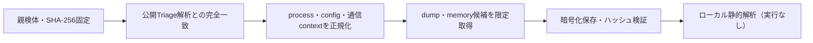

# Triage公開解析・後段取得証跡

## 完全ハッシュ一致

- [260907-hlgshaywh1](https://tria.ge/260907-hlgshaywh1): ファミリー候補 `asyncrat`、評価score `10`

## プロセス・通信

- 観測process: `23e2483bf694f39d708fa972f3e10b25.exe, powershell.exe, svchost.exe, wefault.exe`
- raw commandは保存せず、command SHA-256と処理patternだけをJSONへ保持します。
- sandbox background trafficは`context_only`であり、C2へ自動昇格しません。

- `qaqfaxian.com:22`（sandbox config候補）
- `qaqfaxian.com:8848`（sandbox config候補）

## 後段取得物

- `08c4da486a1810a60691b4dd666069faedbc463c4bc1bbf12f9080e1e8fe9f88` / `memory_image` / 10108928 bytes / 親と同一: `false` / 静的解析: `未実施`

## 判定境界

Triage由来のfamily、process、config、通信は外部sandbox証跡です。Config extractorが返したendpointはC2候補として扱いますが、静的設定復元またはprocess帰属とprotocol応答が揃うまでは確認済みC2とはしません。取得成果物と検体は実行していません。
