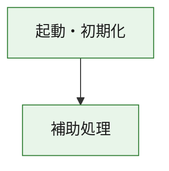
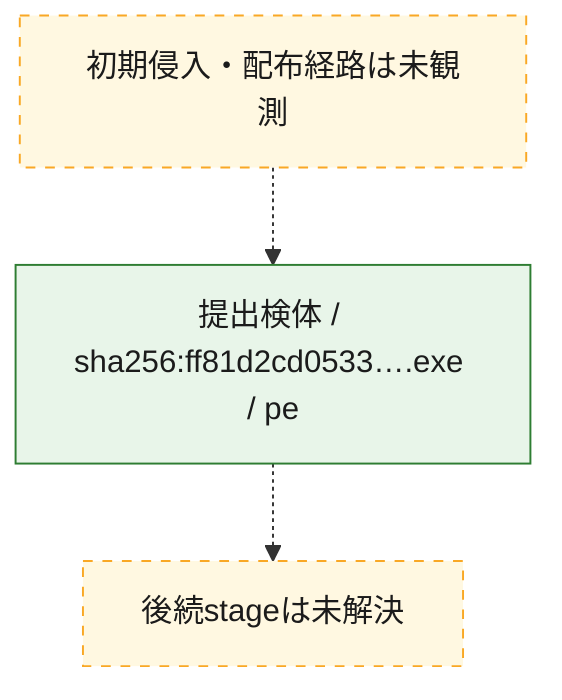
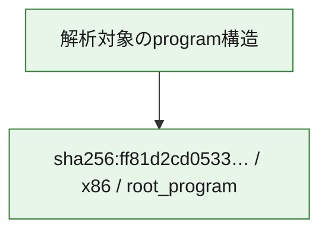

# 全体ロジック：ff81d2cd053320f91747bae417dae27d467af2c13df1f08998c9f2b38deab21f

代表関数の静的証跡から、起動・初期化の処理群を確認しました。

## 読み方

- phaseの掲載順は解析上の整理順です。observed_call_edgesがない段階間の実行順を断定しません。
- 図の実線は静的に観測した関係、点線と黄色のノードは未観測・未解決の関係を示します。
- 図は静的な要約であり、動的実行を再現するものではありません。
- 詳細な関数解説とfingerprintは[STATIC-LOGIC.md](STATIC-LOGIC.md)を参照してください。

## 静的可視化

### 実行フロー

### 感染チェーン

### モジュール関係

## 処理段階

### 1. 起動・初期化

entry pointから初期化と後続処理への移行を確認します。
確度: `confirmed_static_function_evidence`

- `ff81d2cd053320f91747bae417dae27d467af2c13df1f08998c9f2b38deab21f:ghidra:180001010` — 初期化と主要処理への分岐を行う入口関数です。 状態: `succeeded`、選定理由: `entry_point`, `meaningful_symbol_name`, `reviewed_call_centrality:22`, `role:entrypoint`, `small_program_complete_context`

### 2. 補助処理

主要処理を支える一般内部関数またはlibrary処理を確認します。
確度: `confirmed_static_function_evidence`

- `ff81d2cd053320f91747bae417dae27d467af2c13df1f08998c9f2b38deab21f:ghidra:180001240` — 検体内部の一般処理を実装する関数です。 状態: `succeeded`、選定理由: `context_representative`, `reviewed_call_centrality:2`, `small_program_complete_context`
- `ff81d2cd053320f91747bae417dae27d467af2c13df1f08998c9f2b38deab21f:ghidra:180001350` — 検体内部の一般処理を実装する関数です。 状態: `succeeded`、選定理由: `context_representative`, `reviewed_call_centrality:25`, `small_program_complete_context`
- `ff81d2cd053320f91747bae417dae27d467af2c13df1f08998c9f2b38deab21f:ghidra:180003780` — 検体内部の一般処理を実装する関数です。 状態: `succeeded`、選定理由: `context_representative`, `reviewed_call_centrality:2`, `small_program_complete_context`
- `ff81d2cd053320f91747bae417dae27d467af2c13df1f08998c9f2b38deab21f:ghidra:1800038e0` — 検体内部の一般処理を実装する関数です。 状態: `succeeded`、選定理由: `context_representative`, `reviewed_call_centrality:2`, `small_program_complete_context`

## 観測したcall関係

- `ff81d2cd053320f91747bae417dae27d467af2c13df1f08998c9f2b38deab21f:ghidra:180001010` → `ff81d2cd053320f91747bae417dae27d467af2c13df1f08998c9f2b38deab21f:ghidra:180001240` （`startup` → `support`）
- `ff81d2cd053320f91747bae417dae27d467af2c13df1f08998c9f2b38deab21f:ghidra:180001010` → `ff81d2cd053320f91747bae417dae27d467af2c13df1f08998c9f2b38deab21f:ghidra:180001350` （`startup` → `support`）
- `ff81d2cd053320f91747bae417dae27d467af2c13df1f08998c9f2b38deab21f:ghidra:180001350` → `ff81d2cd053320f91747bae417dae27d467af2c13df1f08998c9f2b38deab21f:ghidra:180001240` （`support` → `support`）
- `ff81d2cd053320f91747bae417dae27d467af2c13df1f08998c9f2b38deab21f:ghidra:180001350` → `ff81d2cd053320f91747bae417dae27d467af2c13df1f08998c9f2b38deab21f:ghidra:180003780` （`support` → `support`）
- `ff81d2cd053320f91747bae417dae27d467af2c13df1f08998c9f2b38deab21f:ghidra:180001350` → `ff81d2cd053320f91747bae417dae27d467af2c13df1f08998c9f2b38deab21f:ghidra:1800038e0` （`support` → `support`）
- `ff81d2cd053320f91747bae417dae27d467af2c13df1f08998c9f2b38deab21f:ghidra:180003780` → `ff81d2cd053320f91747bae417dae27d467af2c13df1f08998c9f2b38deab21f:ghidra:1800038e0` （`support` → `support`）
- `ghidra-function:6e387fc1f75604c22b7ce824` → `ghidra-function:bd51e728f865db8154b25b2c` （`unclassified` → `unclassified`）
- `ghidra-function:6f847e3915df4009782c433e` → `ghidra-external:06c350b25eb344a798d08d1b` （`unclassified` → `unclassified`）
- `ghidra-function:6f847e3915df4009782c433e` → `ghidra-external:17540ace01f935c66debc3c3` （`unclassified` → `unclassified`）
- `ghidra-function:6f847e3915df4009782c433e` → `ghidra-external:2290b9235e52397918fd89ba` （`unclassified` → `unclassified`）
- `ghidra-function:6f847e3915df4009782c433e` → `ghidra-external:23df1593dd3780e6f5c15da4` （`unclassified` → `unclassified`）
- `ghidra-function:6f847e3915df4009782c433e` → `ghidra-external:2cfc28f320306675047cb2c3` （`unclassified` → `unclassified`）
- `ghidra-function:6f847e3915df4009782c433e` → `ghidra-external:2ef97d739c1e483eb7fd3eae` （`unclassified` → `unclassified`）
- `ghidra-function:6f847e3915df4009782c433e` → `ghidra-external:34f83131fbc3e239a76cd896` （`unclassified` → `unclassified`）
- `ghidra-function:6f847e3915df4009782c433e` → `ghidra-external:5027bbb7e58898f502e703b0` （`unclassified` → `unclassified`）
- `ghidra-function:6f847e3915df4009782c433e` → `ghidra-external:52ba2a3b53b396fec7ada3e1` （`unclassified` → `unclassified`）
- `ghidra-function:6f847e3915df4009782c433e` → `ghidra-external:55962abb273767a093174298` （`unclassified` → `unclassified`）
- `ghidra-function:6f847e3915df4009782c433e` → `ghidra-external:575d3be35577cf56c74d70cc` （`unclassified` → `unclassified`）
- `ghidra-function:6f847e3915df4009782c433e` → `ghidra-external:88051e2bcb7fe038bce3fc10` （`unclassified` → `unclassified`）
- `ghidra-function:6f847e3915df4009782c433e` → `ghidra-external:8aad44ed1aca586c8f3bf6a3` （`unclassified` → `unclassified`）
- `ghidra-function:6f847e3915df4009782c433e` → `ghidra-external:8e15960b695e5c349efd3f0d` （`unclassified` → `unclassified`）
- `ghidra-function:6f847e3915df4009782c433e` → `ghidra-external:93b6151db4ddabb7172b0ef2` （`unclassified` → `unclassified`）
- `ghidra-function:6f847e3915df4009782c433e` → `ghidra-external:9de1897a99b2c8b91d708cca` （`unclassified` → `unclassified`）
- `ghidra-function:6f847e3915df4009782c433e` → `ghidra-external:a1f9304109c828a9380cf10e` （`unclassified` → `unclassified`）
- `ghidra-function:6f847e3915df4009782c433e` → `ghidra-external:b09db7e69bb44f9cc457b96d` （`unclassified` → `unclassified`）
- `ghidra-function:6f847e3915df4009782c433e` → `ghidra-external:c0059ebcc059bf8d697f7e64` （`unclassified` → `unclassified`）
- `ghidra-function:6f847e3915df4009782c433e` → `ghidra-external:c7e656ab36491f4a0c3fd7c5` （`unclassified` → `unclassified`）
- `ghidra-function:6f847e3915df4009782c433e` → `ghidra-external:ffe9e021415c56c0d30b0632` （`unclassified` → `unclassified`）
- `ghidra-function:6f847e3915df4009782c433e` → `ghidra-function:6e387fc1f75604c22b7ce824` （`unclassified` → `unclassified`）
- `ghidra-function:6f847e3915df4009782c433e` → `ghidra-function:7c7695dc04c8a2b197414e0d` （`unclassified` → `unclassified`）
- `ghidra-function:6f847e3915df4009782c433e` → `ghidra-function:bd51e728f865db8154b25b2c` （`unclassified` → `unclassified`）
- `ghidra-function:a1847ca8e8d3461805f2604a` → `ghidra-function:1546dcd29bbe29271d5d2de8` （`unclassified` → `unclassified`）
- `ghidra-function:a1847ca8e8d3461805f2604a` → `ghidra-function:2026a39b8309ecb590b82a65` （`unclassified` → `unclassified`）
- `ghidra-function:a1847ca8e8d3461805f2604a` → `ghidra-function:6f847e3915df4009782c433e` （`unclassified` → `unclassified`）
- `ghidra-function:a1847ca8e8d3461805f2604a` → `ghidra-function:7bac9beed57c1574dd88fa96` （`unclassified` → `unclassified`）
- `ghidra-function:a1847ca8e8d3461805f2604a` → `ghidra-function:7c7695dc04c8a2b197414e0d` （`unclassified` → `unclassified`）
- `ghidra-function:a1847ca8e8d3461805f2604a` → `ghidra-function:8e0bbf56136cdd1f36d3fcf8` （`unclassified` → `unclassified`）
- `ghidra-function:a1847ca8e8d3461805f2604a` → `ghidra-function:943bade90f829282bf8df9aa` （`unclassified` → `unclassified`）
- `ghidra-function:a1847ca8e8d3461805f2604a` → `ghidra-function:a27df70c6abb4fbce7af6875` （`unclassified` → `unclassified`）
- `ghidra-function:a1847ca8e8d3461805f2604a` → `ghidra-function:add1884fa78db00b3a32d0fb` （`unclassified` → `unclassified`）
- `ghidra-function:a1847ca8e8d3461805f2604a` → `ghidra-function:b8eaf4580dbb91821b452285` （`unclassified` → `unclassified`）
- `ghidra-function:a1847ca8e8d3461805f2604a` → `ghidra-function:be4767519ec6b58696e4a281` （`unclassified` → `unclassified`）
- `ghidra-function:a1847ca8e8d3461805f2604a` → `ghidra-function:c479ba25655dfc419170b2de` （`unclassified` → `unclassified`）

## 解析範囲と制約

- 選定外関数は全体inventoryへ残しますが、関数本体の個別解説対象にはしていません。
- indirect call、難読化、packer、VM、壊れたcontrol flowによりcall関係が欠落する場合があります。
- 文書は静的解析に基づき、検体実行や外部通信による動的確認は行っていません。
