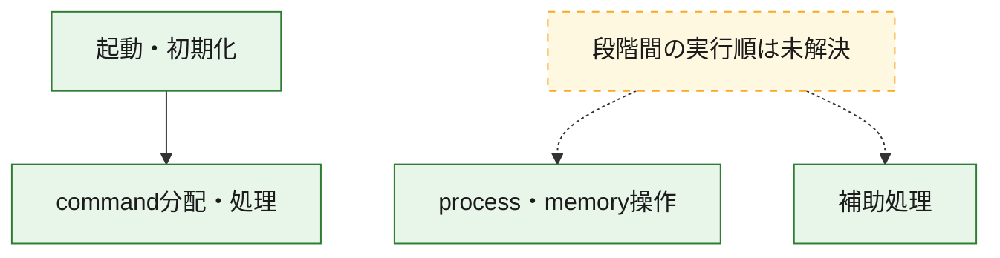
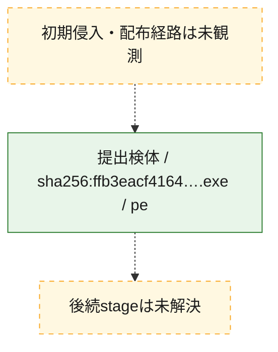
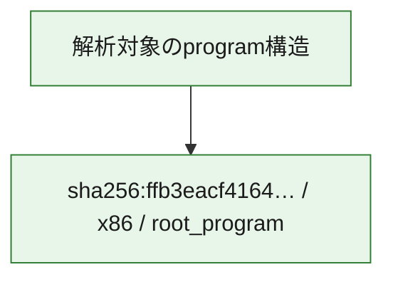

# 全体ロジック：ffb3eacf4164d66a8d5e591c043f3f86d599e8d39384417d6fdf78796ae18a84

代表関数の静的証跡から、起動・初期化、process・memory操作、command分配・処理の処理群を確認しました。

## 読み方

- phaseの掲載順は解析上の整理順です。observed_call_edgesがない段階間の実行順を断定しません。
- 図の実線は静的に観測した関係、点線と黄色のノードは未観測・未解決の関係を示します。
- 図は静的な要約であり、動的実行を再現するものではありません。
- 詳細な関数解説とfingerprintは[STATIC-LOGIC.md](STATIC-LOGIC.md)を参照してください。

## 静的可視化

### 実行フロー

### 感染チェーン

### モジュール関係

## 処理段階

### 1. 起動・初期化

entry pointから初期化と後続処理への移行を確認します。
確度: `confirmed_static_function_evidence`

- `ffb3eacf4164d66a8d5e591c043f3f86d599e8d39384417d6fdf78796ae18a84:ghidra:1404be36c` — 初期化と主要処理への分岐を行う入口関数です。 状態: `succeeded`、選定理由: `entry_point`, `meaningful_symbol_name`, `reviewed_call_centrality:22`, `role:entrypoint`

### 2. process・memory操作

process、thread、module、memory操作と実行移行を確認します。
確度: `confirmed_static_function_evidence`

- `ffb3eacf4164d66a8d5e591c043f3f86d599e8d39384417d6fdf78796ae18a84:ghidra:1400023d0` — process、thread、module、またはmemory操作に関係する関数です。 状態: `succeeded`、選定理由: `context_representative`, `reviewed_call_centrality:27`, `role:process_or_memory_operation`

### 3. command分配・処理

受信commandやtaskの解釈、分配、個別handlerへの移行を確認します。
確度: `confirmed_static_function_evidence_with_limits`

- `ffb3eacf4164d66a8d5e591c043f3f86d599e8d39384417d6fdf78796ae18a84:ghidra:1404d0980` — commandの解釈、分配、または個別処理を担当する関数です。 状態: `limited_bad_instruction_or_flow`、選定理由: `meaningful_symbol_name`, `reviewed_call_centrality:1`, `role:command_dispatch_or_handler`

### 4. 補助処理

主要処理を支える一般内部関数またはlibrary処理を確認します。
確度: `confirmed_static_function_evidence_with_limits`

- `ffb3eacf4164d66a8d5e591c043f3f86d599e8d39384417d6fdf78796ae18a84:ghidra:140001000` — 検体内部の一般処理を実装する関数です。 状態: `succeeded`、選定理由: `context_representative`
- `ffb3eacf4164d66a8d5e591c043f3f86d599e8d39384417d6fdf78796ae18a84:ghidra:140001280` — 検体内部の一般処理を実装する関数です。 状態: `succeeded`、選定理由: `context_representative`
- `ffb3eacf4164d66a8d5e591c043f3f86d599e8d39384417d6fdf78796ae18a84:ghidra:1400013e0` — 検体内部の一般処理を実装する関数です。 状態: `succeeded`、選定理由: `context_representative`, `reviewed_call_centrality:4`
- `ffb3eacf4164d66a8d5e591c043f3f86d599e8d39384417d6fdf78796ae18a84:ghidra:1400016c0` — 検体内部の一般処理を実装する関数です。 状態: `succeeded`、選定理由: `context_representative`, `reviewed_call_centrality:3`
- `ffb3eacf4164d66a8d5e591c043f3f86d599e8d39384417d6fdf78796ae18a84:ghidra:140001780` — 検体内部の一般処理を実装する関数です。 状態: `succeeded`、選定理由: `context_representative`, `reviewed_call_centrality:4`
- `ffb3eacf4164d66a8d5e591c043f3f86d599e8d39384417d6fdf78796ae18a84:ghidra:140001890` — 検体内部の一般処理を実装する関数です。 状態: `succeeded`、選定理由: `context_representative`, `reviewed_call_centrality:1`
- `ffb3eacf4164d66a8d5e591c043f3f86d599e8d39384417d6fdf78796ae18a84:ghidra:1400018d0` — 検体内部の一般処理を実装する関数です。 状態: `succeeded`、選定理由: `context_representative`
- `ffb3eacf4164d66a8d5e591c043f3f86d599e8d39384417d6fdf78796ae18a84:ghidra:140001930` — 検体内部の一般処理を実装する関数です。 状態: `succeeded`、選定理由: `context_representative`, `reviewed_call_centrality:1`
- `ffb3eacf4164d66a8d5e591c043f3f86d599e8d39384417d6fdf78796ae18a84:ghidra:140001970` — 検体内部の一般処理を実装する関数です。 状態: `succeeded`、選定理由: `context_representative`, `reviewed_call_centrality:4`
- `ffb3eacf4164d66a8d5e591c043f3f86d599e8d39384417d6fdf78796ae18a84:ghidra:140001a70` — 検体内部の一般処理を実装する関数です。 状態: `succeeded`、選定理由: `context_representative`
- `ffb3eacf4164d66a8d5e591c043f3f86d599e8d39384417d6fdf78796ae18a84:ghidra:140001ad0` — 検体内部の一般処理を実装する関数です。 状態: `succeeded`、選定理由: `context_representative`, `reviewed_call_centrality:1`
- `ffb3eacf4164d66a8d5e591c043f3f86d599e8d39384417d6fdf78796ae18a84:ghidra:140001b10` — 検体内部の一般処理を実装する関数です。 状態: `succeeded`、選定理由: `context_representative`, `reviewed_call_centrality:2`
- `ffb3eacf4164d66a8d5e591c043f3f86d599e8d39384417d6fdf78796ae18a84:ghidra:140001c10` — 検体内部の一般処理を実装する関数です。 状態: `limited_bad_instruction_or_flow`、選定理由: `context_representative`, `reviewed_call_centrality:14`
- `ffb3eacf4164d66a8d5e591c043f3f86d599e8d39384417d6fdf78796ae18a84:ghidra:140002320` — 検体内部の一般処理を実装する関数です。 状態: `succeeded`、選定理由: `context_representative`
- `ffb3eacf4164d66a8d5e591c043f3f86d599e8d39384417d6fdf78796ae18a84:ghidra:140002380` — 検体内部の一般処理を実装する関数です。 状態: `succeeded`、選定理由: `context_representative`
- `ffb3eacf4164d66a8d5e591c043f3f86d599e8d39384417d6fdf78796ae18a84:ghidra:1400028f0` — 検体内部の一般処理を実装する関数です。 状態: `succeeded`、選定理由: `context_representative`, `reviewed_call_centrality:1`
- `ffb3eacf4164d66a8d5e591c043f3f86d599e8d39384417d6fdf78796ae18a84:ghidra:140002930` — 検体内部の一般処理を実装する関数です。 状態: `succeeded`、選定理由: `context_representative`, `reviewed_call_centrality:1`
- `ffb3eacf4164d66a8d5e591c043f3f86d599e8d39384417d6fdf78796ae18a84:ghidra:140002970` — 検体内部の一般処理を実装する関数です。 状態: `succeeded`、選定理由: `context_representative`, `reviewed_call_centrality:1`
- `ffb3eacf4164d66a8d5e591c043f3f86d599e8d39384417d6fdf78796ae18a84:ghidra:1400029a0` — 検体内部の一般処理を実装する関数です。 状態: `succeeded`、選定理由: `context_representative`, `reviewed_call_centrality:4`
- `ffb3eacf4164d66a8d5e591c043f3f86d599e8d39384417d6fdf78796ae18a84:ghidra:140002a00` — 検体内部の一般処理を実装する関数です。 状態: `succeeded`、選定理由: `context_representative`, `reviewed_call_centrality:1`
- `ffb3eacf4164d66a8d5e591c043f3f86d599e8d39384417d6fdf78796ae18a84:ghidra:140002a60` — 検体内部の一般処理を実装する関数です。 状態: `succeeded`、選定理由: `context_representative`, `reviewed_call_centrality:3`
- `ffb3eacf4164d66a8d5e591c043f3f86d599e8d39384417d6fdf78796ae18a84:ghidra:140002ab0` — 検体内部の一般処理を実装する関数です。 状態: `succeeded`、選定理由: `context_representative`, `reviewed_call_centrality:5`
- `ffb3eacf4164d66a8d5e591c043f3f86d599e8d39384417d6fdf78796ae18a84:ghidra:140002b30` — 検体内部の一般処理を実装する関数です。 状態: `succeeded`、選定理由: `context_representative`, `reviewed_call_centrality:15`
- `ffb3eacf4164d66a8d5e591c043f3f86d599e8d39384417d6fdf78796ae18a84:ghidra:140003530` — 検体内部の一般処理を実装する関数です。 状態: `succeeded`、選定理由: `context_representative`, `reviewed_call_centrality:4`
- `ffb3eacf4164d66a8d5e591c043f3f86d599e8d39384417d6fdf78796ae18a84:ghidra:140003590` — 検体内部の一般処理を実装する関数です。 状態: `succeeded`、選定理由: `context_representative`, `reviewed_call_centrality:4`
- `ffb3eacf4164d66a8d5e591c043f3f86d599e8d39384417d6fdf78796ae18a84:ghidra:1400035f0` — 検体内部の一般処理を実装する関数です。 状態: `succeeded`、選定理由: `context_representative`, `reviewed_call_centrality:4`
- `ffb3eacf4164d66a8d5e591c043f3f86d599e8d39384417d6fdf78796ae18a84:ghidra:140003640` — 検体内部の一般処理を実装する関数です。 状態: `succeeded`、選定理由: `context_representative`, `reviewed_call_centrality:4`
- `ffb3eacf4164d66a8d5e591c043f3f86d599e8d39384417d6fdf78796ae18a84:ghidra:140317b70` — compiler生成処理または汎用library処理とみられる関数です。 状態: `limited_bad_instruction_or_flow`、選定理由: `entry_point`, `meaningful_symbol_name`, `reviewed_call_centrality:8`
- `ffb3eacf4164d66a8d5e591c043f3f86d599e8d39384417d6fdf78796ae18a84:ghidra:1404bed10` — 検体内部の一般処理を実装する関数です。 状態: `succeeded`、選定理由: `meaningful_symbol_name`

## 観測したcall関係

- `ffb3eacf4164d66a8d5e591c043f3f86d599e8d39384417d6fdf78796ae18a84:ghidra:1404be36c` → `ffb3eacf4164d66a8d5e591c043f3f86d599e8d39384417d6fdf78796ae18a84:ghidra:1404d0980` （`startup` → `dispatch`）
- `ghidra-function:0c77e6775ed0ebc48025e933` → `ghidra-function:40ee03423b9f5c90879f52fc` （`unclassified` → `unclassified`）
- `ghidra-function:0c77e6775ed0ebc48025e933` → `ghidra-function:4596bfe4c322f470794b9e93` （`unclassified` → `unclassified`）
- `ghidra-function:1c4beaeec6699ec07e506bcc` → `ghidra-function:d5720f8e2aa18ce124f83fe3` （`unclassified` → `unclassified`）
- `ghidra-function:2a03fd54224c894204cae369` → `ghidra-external:091842ad29bfc050b072fd0f` （`unclassified` → `unclassified`）
- `ghidra-function:2a03fd54224c894204cae369` → `ghidra-external:2c293e824b7b59b1145f2f3b` （`unclassified` → `unclassified`）
- `ghidra-function:2a03fd54224c894204cae369` → `ghidra-external:9e42a9605fc6d0fa7b3b6f7d` （`unclassified` → `unclassified`）
- `ghidra-function:2a03fd54224c894204cae369` → `ghidra-function:40ee03423b9f5c90879f52fc` （`unclassified` → `unclassified`）
- `ghidra-function:2a03fd54224c894204cae369` → `ghidra-function:4596bfe4c322f470794b9e93` （`unclassified` → `unclassified`）
- `ghidra-function:2a03fd54224c894204cae369` → `ghidra-function:ed8573383ee2f30405bf92e2` （`unclassified` → `unclassified`）
- `ghidra-function:311f593f84e5a26f09a884e9` → `ghidra-function:070ce735c793a3ba747b737d` （`unclassified` → `unclassified`）
- `ghidra-function:3d2e2d6ee2d6a2e5d5573f2b` → `ghidra-external:2c293e824b7b59b1145f2f3b` （`unclassified` → `unclassified`）
- `ghidra-function:3d2e2d6ee2d6a2e5d5573f2b` → `ghidra-function:60cac6ad015df11c0e410fae` （`unclassified` → `unclassified`）
- `ghidra-function:3d2e2d6ee2d6a2e5d5573f2b` → `ghidra-function:8494bce7ecb8ceb76973f777` （`unclassified` → `unclassified`）
- `ghidra-function:3d2e2d6ee2d6a2e5d5573f2b` → `ghidra-function:9de39df79e4321aa4d9a7e2f` （`unclassified` → `unclassified`）
- `ghidra-function:3d7d4430625bdf9ae8358c42` → `ghidra-function:40ee03423b9f5c90879f52fc` （`unclassified` → `unclassified`）
- `ghidra-function:3d7d4430625bdf9ae8358c42` → `ghidra-function:4596bfe4c322f470794b9e93` （`unclassified` → `unclassified`）
- `ghidra-function:4e97fb82fa0ff59f112b4502` → `ghidra-function:fec003bc00e32888fd5c8cb4` （`unclassified` → `unclassified`）
- `ghidra-function:585486277ff704a19b65bb21` → `ghidra-external:0ecb6505b03585c6f10880b7` （`unclassified` → `unclassified`）
- `ghidra-function:585486277ff704a19b65bb21` → `ghidra-external:1cc0d925b7158c27e094e241` （`unclassified` → `unclassified`）
- `ghidra-function:585486277ff704a19b65bb21` → `ghidra-external:8e605958ae05b25bc96e7ac9` （`unclassified` → `unclassified`）
- `ghidra-function:585486277ff704a19b65bb21` → `ghidra-external:9a5d90fe76348b3e887aa41e` （`unclassified` → `unclassified`）
- `ghidra-function:585486277ff704a19b65bb21` → `ghidra-external:ad364b5673bd21688a5d6897` （`unclassified` → `unclassified`）
- `ghidra-function:585486277ff704a19b65bb21` → `ghidra-external:e2e3ca5b85df66e915535614` （`unclassified` → `unclassified`）
- `ghidra-function:585486277ff704a19b65bb21` → `ghidra-external:f80c6a24d64254e1ddb915e7` （`unclassified` → `unclassified`）
- `ghidra-function:585486277ff704a19b65bb21` → `ghidra-external:f875b203f1997d1cbef8f15f` （`unclassified` → `unclassified`）
- `ghidra-function:585486277ff704a19b65bb21` → `ghidra-function:0551c154b92ed9a509ab3b7e` （`unclassified` → `unclassified`）
- `ghidra-function:585486277ff704a19b65bb21` → `ghidra-function:1d90ea12282d5e94ec9916dd` （`unclassified` → `unclassified`）
- `ghidra-function:585486277ff704a19b65bb21` → `ghidra-function:267b40926517acb063bb7ec0` （`unclassified` → `unclassified`）
- `ghidra-function:585486277ff704a19b65bb21` → `ghidra-function:3e005934757e4479f56e1d21` （`unclassified` → `unclassified`）
- `ghidra-function:585486277ff704a19b65bb21` → `ghidra-function:3f0df19490cfa0d06a581d25` （`unclassified` → `unclassified`）
- `ghidra-function:585486277ff704a19b65bb21` → `ghidra-function:4e325307a66733e0ff66dc6e` （`unclassified` → `unclassified`）
- `ghidra-function:585486277ff704a19b65bb21` → `ghidra-function:5e43e95a8c7cc11122918eae` （`unclassified` → `unclassified`）
- `ghidra-function:585486277ff704a19b65bb21` → `ghidra-function:86ddc039759eadeaac9a2776` （`unclassified` → `unclassified`）
- `ghidra-function:585486277ff704a19b65bb21` → `ghidra-function:8749b4dd905fb11bea151132` （`unclassified` → `unclassified`）
- `ghidra-function:585486277ff704a19b65bb21` → `ghidra-function:9d93c7e12ee8a27f37288b9b` （`unclassified` → `unclassified`）
- `ghidra-function:585486277ff704a19b65bb21` → `ghidra-function:b72dd37931b5e8d2f3bc4e50` （`unclassified` → `unclassified`）
- `ghidra-function:585486277ff704a19b65bb21` → `ghidra-function:d45b12ec4f835af20df218db` （`unclassified` → `unclassified`）
- `ghidra-function:585486277ff704a19b65bb21` → `ghidra-function:e462f3cd6de8f772e0425f4d` （`unclassified` → `unclassified`）
- `ghidra-function:585486277ff704a19b65bb21` → `ghidra-function:f140f891d85c4dfee7c0ea71` （`unclassified` → `unclassified`）
- `ghidra-function:6149d7e638debb5d2280ab4b` → `ghidra-function:40ee03423b9f5c90879f52fc` （`unclassified` → `unclassified`）
- `ghidra-function:6149d7e638debb5d2280ab4b` → `ghidra-function:4596bfe4c322f470794b9e93` （`unclassified` → `unclassified`）
- `ghidra-function:6a10ff2081985a5f4cd1697b` → `ghidra-function:40ee03423b9f5c90879f52fc` （`unclassified` → `unclassified`）
- `ghidra-function:6a10ff2081985a5f4cd1697b` → `ghidra-function:4596bfe4c322f470794b9e93` （`unclassified` → `unclassified`）
- `ghidra-function:70ecc42587f657102dc4c8dd` → `ghidra-external:2c293e824b7b59b1145f2f3b` （`unclassified` → `unclassified`）
- `ghidra-function:70ecc42587f657102dc4c8dd` → `ghidra-function:01beb2ec55340ac4b01f7a23` （`unclassified` → `unclassified`）
- `ghidra-function:70ecc42587f657102dc4c8dd` → `ghidra-function:ad632d3e1af77e134b8cdbc1` （`unclassified` → `unclassified`）
- `ghidra-function:70ecc42587f657102dc4c8dd` → `ghidra-function:f1e7e1bd52a7ad8a71ce9dcc` （`unclassified` → `unclassified`）
- `ghidra-function:84d8ff966556beb4d07239f8` → `ghidra-external:0a450b25e4b86ea537e4f791` （`unclassified` → `unclassified`）
- `ghidra-function:84d8ff966556beb4d07239f8` → `ghidra-external:2c293e824b7b59b1145f2f3b` （`unclassified` → `unclassified`）
- `ghidra-function:84d8ff966556beb4d07239f8` → `ghidra-external:45f06267346e44c19814f458` （`unclassified` → `unclassified`）
- `ghidra-function:84d8ff966556beb4d07239f8` → `ghidra-external:b53dc5db836c41c727ef786f` （`unclassified` → `unclassified`）
- `ghidra-function:84d8ff966556beb4d07239f8` → `ghidra-external:e7efd6f8fbdf7b65ab3d3d49` （`unclassified` → `unclassified`）
- `ghidra-function:84d8ff966556beb4d07239f8` → `ghidra-function:45506f807c7d767b72e90b5d` （`unclassified` → `unclassified`）
- `ghidra-function:84d8ff966556beb4d07239f8` → `ghidra-function:47fffe65c68e3a15666809a1` （`unclassified` → `unclassified`）
- `ghidra-function:84d8ff966556beb4d07239f8` → `ghidra-function:8494bce7ecb8ceb76973f777` （`unclassified` → `unclassified`）
- `ghidra-function:84d8ff966556beb4d07239f8` → `ghidra-function:8f2eff9e948052b3020581a2` （`unclassified` → `unclassified`）
- `ghidra-function:84d8ff966556beb4d07239f8` → `ghidra-function:9458934aa5722252f1c653a4` （`unclassified` → `unclassified`）
- `ghidra-function:84d8ff966556beb4d07239f8` → `ghidra-function:99015e5a1b1688dddf3c7ac0` （`unclassified` → `unclassified`）
- `ghidra-function:84d8ff966556beb4d07239f8` → `ghidra-function:9de39df79e4321aa4d9a7e2f` （`unclassified` → `unclassified`）
- `ghidra-function:84d8ff966556beb4d07239f8` → `ghidra-function:b247609e2efce470350c509b` （`unclassified` → `unclassified`）
- `ghidra-function:84d8ff966556beb4d07239f8` → `ghidra-function:e69c55a64cf3c5e79a0f2a00` （`unclassified` → `unclassified`）
- `ghidra-function:94cef1047f5d4f59fc7971f8` → `ghidra-function:dca1e750c54832d100231a60` （`unclassified` → `unclassified`）
- `ghidra-function:95dba09b10a81d2661f3cd23` → `ghidra-function:d5720f8e2aa18ce124f83fe3` （`unclassified` → `unclassified`）
- `ghidra-function:968b52c8a878262dde570c2c` → `ghidra-external:e2e3ca5b85df66e915535614` （`unclassified` → `unclassified`）
- `ghidra-function:968b52c8a878262dde570c2c` → `ghidra-external:f10fad9d315065596bda5007` （`unclassified` → `unclassified`）
- `ghidra-function:a90d1a1565e5988308da82e4` → `ghidra-function:1c0391c33d22c72fdd4ffb44` （`unclassified` → `unclassified`）
- `ghidra-function:ab26ff6dc54dae5882e54d2e` → `ghidra-external:2c293e824b7b59b1145f2f3b` （`unclassified` → `unclassified`）
- `ghidra-function:ab26ff6dc54dae5882e54d2e` → `ghidra-function:8f2eff9e948052b3020581a2` （`unclassified` → `unclassified`）
- `ghidra-function:ab26ff6dc54dae5882e54d2e` → `ghidra-function:9de39df79e4321aa4d9a7e2f` （`unclassified` → `unclassified`）
- `ghidra-function:b37103fec883920d75f5e7c2` → `ghidra-external:091842ad29bfc050b072fd0f` （`unclassified` → `unclassified`）
- `ghidra-function:b37103fec883920d75f5e7c2` → `ghidra-external:9e42a9605fc6d0fa7b3b6f7d` （`unclassified` → `unclassified`）
- `ghidra-function:b37103fec883920d75f5e7c2` → `ghidra-function:bac83dbccf314c3827d8f460` （`unclassified` → `unclassified`）
- `ghidra-function:bb7ee8b4fd3a0bdb7c4a6aeb` → `ghidra-external:091842ad29bfc050b072fd0f` （`unclassified` → `unclassified`）
- `ghidra-function:bb7ee8b4fd3a0bdb7c4a6aeb` → `ghidra-external:2c293e824b7b59b1145f2f3b` （`unclassified` → `unclassified`）
- `ghidra-function:bb7ee8b4fd3a0bdb7c4a6aeb` → `ghidra-external:45f06267346e44c19814f458` （`unclassified` → `unclassified`）
- `ghidra-function:bb7ee8b4fd3a0bdb7c4a6aeb` → `ghidra-external:517bee9a1c720d318ce114de` （`unclassified` → `unclassified`）
- `ghidra-function:bb7ee8b4fd3a0bdb7c4a6aeb` → `ghidra-external:97bda0adfa165f38f9edf2bf` （`unclassified` → `unclassified`）
- `ghidra-function:bb7ee8b4fd3a0bdb7c4a6aeb` → `ghidra-external:9e42a9605fc6d0fa7b3b6f7d` （`unclassified` → `unclassified`）
- `ghidra-function:bb7ee8b4fd3a0bdb7c4a6aeb` → `ghidra-external:ae34a9d7758f27034b21c1fc` （`unclassified` → `unclassified`）
- `ghidra-function:bb7ee8b4fd3a0bdb7c4a6aeb` → `ghidra-external:fc8108e13ec6a171644779a9` （`unclassified` → `unclassified`）
- `ghidra-function:bb7ee8b4fd3a0bdb7c4a6aeb` → `ghidra-function:0371c590366ffe9bc48fe69d` （`unclassified` → `unclassified`）
- `ghidra-function:bb7ee8b4fd3a0bdb7c4a6aeb` → `ghidra-function:2992389742cf567bb4e0de8c` （`unclassified` → `unclassified`）
- `ghidra-function:bb7ee8b4fd3a0bdb7c4a6aeb` → `ghidra-function:2dbf8f014b2e476a64fb55bf` （`unclassified` → `unclassified`）
- `ghidra-function:bb7ee8b4fd3a0bdb7c4a6aeb` → `ghidra-function:2e206793ce695eaceca2a5d0` （`unclassified` → `unclassified`）
- `ghidra-function:bb7ee8b4fd3a0bdb7c4a6aeb` → `ghidra-function:40ee03423b9f5c90879f52fc` （`unclassified` → `unclassified`）
- `ghidra-function:bb7ee8b4fd3a0bdb7c4a6aeb` → `ghidra-function:4596bfe4c322f470794b9e93` （`unclassified` → `unclassified`）
- `ghidra-function:bb7ee8b4fd3a0bdb7c4a6aeb` → `ghidra-function:47fffe65c68e3a15666809a1` （`unclassified` → `unclassified`）
- `ghidra-function:bb7ee8b4fd3a0bdb7c4a6aeb` → `ghidra-function:60cac6ad015df11c0e410fae` （`unclassified` → `unclassified`）
- `ghidra-function:bb7ee8b4fd3a0bdb7c4a6aeb` → `ghidra-function:9de39df79e4321aa4d9a7e2f` （`unclassified` → `unclassified`）
- `ghidra-function:bb7ee8b4fd3a0bdb7c4a6aeb` → `ghidra-function:bac83dbccf314c3827d8f460` （`unclassified` → `unclassified`）
- `ghidra-function:bb7ee8b4fd3a0bdb7c4a6aeb` → `ghidra-function:c3487aae628255a41efb1197` （`unclassified` → `unclassified`）
- `ghidra-function:bb7ee8b4fd3a0bdb7c4a6aeb` → `ghidra-function:d44865008e85edcf2b0315ff` （`unclassified` → `unclassified`）
- `ghidra-function:bb7ee8b4fd3a0bdb7c4a6aeb` → `ghidra-function:e5673c54602ff4f6bed75da0` （`unclassified` → `unclassified`）
- `ghidra-function:bb7ee8b4fd3a0bdb7c4a6aeb` → `ghidra-function:ec6f2cef5b7872f163055c12` （`unclassified` → `unclassified`）
- `ghidra-function:bb7ee8b4fd3a0bdb7c4a6aeb` → `ghidra-function:f6acf4857fdb38ba826ea479` （`unclassified` → `unclassified`）
- `ghidra-function:d884f94f860d1105007b59e4` → `ghidra-external:2c293e824b7b59b1145f2f3b` （`unclassified` → `unclassified`）
- `ghidra-function:d884f94f860d1105007b59e4` → `ghidra-function:60cac6ad015df11c0e410fae` （`unclassified` → `unclassified`）
- `ghidra-function:d884f94f860d1105007b59e4` → `ghidra-function:8494bce7ecb8ceb76973f777` （`unclassified` → `unclassified`）
- `ghidra-function:d884f94f860d1105007b59e4` → `ghidra-function:9de39df79e4321aa4d9a7e2f` （`unclassified` → `unclassified`）
- `ghidra-function:e2b30a3dcd7afcf537769e5f` → `ghidra-function:d51ea536eef09aa33e123b90` （`unclassified` → `unclassified`）
- `ghidra-function:e75720b56f4c73399d576a71` → `ghidra-external:1069a066e6cc1ab08906a0c6` （`unclassified` → `unclassified`）
- `ghidra-function:e75720b56f4c73399d576a71` → `ghidra-external:45f06267346e44c19814f458` （`unclassified` → `unclassified`）
- `ghidra-function:e75720b56f4c73399d576a71` → `ghidra-external:cab0c04e8f5ba8b48adb430c` （`unclassified` → `unclassified`）
- `ghidra-function:e75720b56f4c73399d576a71` → `ghidra-external:f05d844dab0b2b4ebea7dcb8` （`unclassified` → `unclassified`）
- `ghidra-function:e75720b56f4c73399d576a71` → `ghidra-external:f6453460ef3c4ddabe85eec6` （`unclassified` → `unclassified`）
- `ghidra-function:e75720b56f4c73399d576a71` → `ghidra-function:0215581fc7228338e7fd45fb` （`unclassified` → `unclassified`）
- `ghidra-function:e75720b56f4c73399d576a71` → `ghidra-function:39a1552679887869abb69f45` （`unclassified` → `unclassified`）
- `ghidra-function:e75720b56f4c73399d576a71` → `ghidra-function:40ee03423b9f5c90879f52fc` （`unclassified` → `unclassified`）
- `ghidra-function:e75720b56f4c73399d576a71` → `ghidra-function:4596bfe4c322f470794b9e93` （`unclassified` → `unclassified`）
- `ghidra-function:e75720b56f4c73399d576a71` → `ghidra-function:47fffe65c68e3a15666809a1` （`unclassified` → `unclassified`）
- `ghidra-function:e75720b56f4c73399d576a71` → `ghidra-function:8494bce7ecb8ceb76973f777` （`unclassified` → `unclassified`）
- `ghidra-function:e75720b56f4c73399d576a71` → `ghidra-function:c1d3dad7b8d8e06353a1c2c4` （`unclassified` → `unclassified`）
- `ghidra-function:e75720b56f4c73399d576a71` → `ghidra-function:f384b81fcae3b1b07dc3b7bc` （`unclassified` → `unclassified`）
- `ghidra-function:edc3b2d8df0e9c7529aa98f2` → `ghidra-external:091842ad29bfc050b072fd0f` （`unclassified` → `unclassified`）
- `ghidra-function:edc3b2d8df0e9c7529aa98f2` → `ghidra-external:9e42a9605fc6d0fa7b3b6f7d` （`unclassified` → `unclassified`）
- `ghidra-function:edc3b2d8df0e9c7529aa98f2` → `ghidra-function:070ce735c793a3ba747b737d` （`unclassified` → `unclassified`）
- `ghidra-function:edc3b2d8df0e9c7529aa98f2` → `ghidra-function:2992389742cf567bb4e0de8c` （`unclassified` → `unclassified`）
- `ghidra-function:fb163f24f38646c782df1973` → `ghidra-function:40ee03423b9f5c90879f52fc` （`unclassified` → `unclassified`）
- `ghidra-function:fb163f24f38646c782df1973` → `ghidra-function:4596bfe4c322f470794b9e93` （`unclassified` → `unclassified`）
- `ghidra-function:fb163f24f38646c782df1973` → `ghidra-function:53c19b0502afa81007010beb` （`unclassified` → `unclassified`）

## 解析範囲と制約

- 選定外関数は全体inventoryへ残しますが、関数本体の個別解説対象にはしていません。
- indirect call、難読化、packer、VM、壊れたcontrol flowによりcall関係が欠落する場合があります。
- 文書は静的解析に基づき、検体実行や外部通信による動的確認は行っていません。
