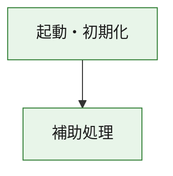
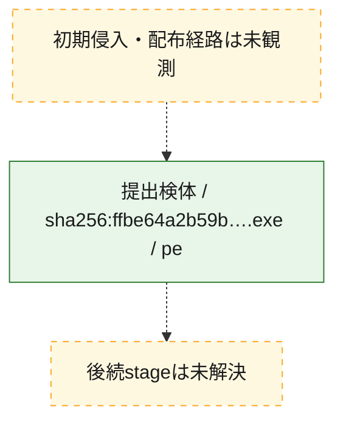
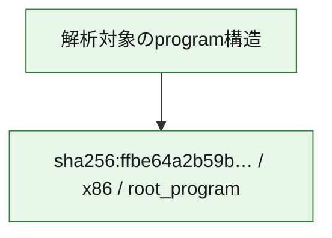

# 全体ロジック：ffbe64a2b59b376fda9d1268e502ac2453c0e0b6133ed2af25c6ab07027d6da0

代表関数の静的証跡から、起動・初期化の処理群を確認しました。

## 読み方

- phaseの掲載順は解析上の整理順です。observed_call_edgesがない段階間の実行順を断定しません。
- 図の実線は静的に観測した関係、点線と黄色のノードは未観測・未解決の関係を示します。
- 図は静的な要約であり、動的実行を再現するものではありません。
- 詳細な関数解説とfingerprintは[STATIC-LOGIC.md](STATIC-LOGIC.md)を参照してください。

## 静的可視化

### 実行フロー

### 感染チェーン

### モジュール関係

## 処理段階

### 1. 起動・初期化

entry pointから初期化と後続処理への移行を確認します。
確度: `confirmed_static_function_evidence`

- `ffbe64a2b59b376fda9d1268e502ac2453c0e0b6133ed2af25c6ab07027d6da0:ghidra:180001010` — 初期化と主要処理への分岐を行う入口関数です。 状態: `succeeded`、選定理由: `entry_point`, `meaningful_symbol_name`, `reviewed_call_centrality:22`, `role:entrypoint`, `small_program_complete_context`

### 2. 補助処理

主要処理を支える一般内部関数またはlibrary処理を確認します。
確度: `confirmed_static_function_evidence`

- `ffbe64a2b59b376fda9d1268e502ac2453c0e0b6133ed2af25c6ab07027d6da0:ghidra:180001240` — 検体内部の一般処理を実装する関数です。 状態: `succeeded`、選定理由: `context_representative`, `reviewed_call_centrality:2`, `small_program_complete_context`
- `ffbe64a2b59b376fda9d1268e502ac2453c0e0b6133ed2af25c6ab07027d6da0:ghidra:180001350` — 検体内部の一般処理を実装する関数です。 状態: `succeeded`、選定理由: `context_representative`, `reviewed_call_centrality:25`, `small_program_complete_context`
- `ffbe64a2b59b376fda9d1268e502ac2453c0e0b6133ed2af25c6ab07027d6da0:ghidra:180003780` — 検体内部の一般処理を実装する関数です。 状態: `succeeded`、選定理由: `context_representative`, `reviewed_call_centrality:2`, `small_program_complete_context`
- `ffbe64a2b59b376fda9d1268e502ac2453c0e0b6133ed2af25c6ab07027d6da0:ghidra:1800038e0` — 検体内部の一般処理を実装する関数です。 状態: `succeeded`、選定理由: `context_representative`, `reviewed_call_centrality:2`, `small_program_complete_context`

## 観測したcall関係

- `ffbe64a2b59b376fda9d1268e502ac2453c0e0b6133ed2af25c6ab07027d6da0:ghidra:180001010` → `ffbe64a2b59b376fda9d1268e502ac2453c0e0b6133ed2af25c6ab07027d6da0:ghidra:180001240` （`startup` → `support`）
- `ffbe64a2b59b376fda9d1268e502ac2453c0e0b6133ed2af25c6ab07027d6da0:ghidra:180001010` → `ffbe64a2b59b376fda9d1268e502ac2453c0e0b6133ed2af25c6ab07027d6da0:ghidra:180001350` （`startup` → `support`）
- `ffbe64a2b59b376fda9d1268e502ac2453c0e0b6133ed2af25c6ab07027d6da0:ghidra:180001350` → `ffbe64a2b59b376fda9d1268e502ac2453c0e0b6133ed2af25c6ab07027d6da0:ghidra:180001240` （`support` → `support`）
- `ffbe64a2b59b376fda9d1268e502ac2453c0e0b6133ed2af25c6ab07027d6da0:ghidra:180001350` → `ffbe64a2b59b376fda9d1268e502ac2453c0e0b6133ed2af25c6ab07027d6da0:ghidra:180003780` （`support` → `support`）
- `ffbe64a2b59b376fda9d1268e502ac2453c0e0b6133ed2af25c6ab07027d6da0:ghidra:180001350` → `ffbe64a2b59b376fda9d1268e502ac2453c0e0b6133ed2af25c6ab07027d6da0:ghidra:1800038e0` （`support` → `support`）
- `ffbe64a2b59b376fda9d1268e502ac2453c0e0b6133ed2af25c6ab07027d6da0:ghidra:180003780` → `ffbe64a2b59b376fda9d1268e502ac2453c0e0b6133ed2af25c6ab07027d6da0:ghidra:1800038e0` （`support` → `support`）
- `ghidra-function:5443148d1afbc3d916fbe3e9` → `ghidra-function:6c45580c467aca902bb00a6e` （`unclassified` → `unclassified`）
- `ghidra-function:8f2c5a7ab98752d03d4357f9` → `ghidra-function:1b74440e5ce3da5a99253af1` （`unclassified` → `unclassified`）
- `ghidra-function:8f2c5a7ab98752d03d4357f9` → `ghidra-function:2acb91c9ed11982bd6846777` （`unclassified` → `unclassified`）
- `ghidra-function:8f2c5a7ab98752d03d4357f9` → `ghidra-function:4337f9b12baaf850ce1d4c47` （`unclassified` → `unclassified`）
- `ghidra-function:8f2c5a7ab98752d03d4357f9` → `ghidra-function:6ac013490ed6bb31754cb169` （`unclassified` → `unclassified`）
- `ghidra-function:8f2c5a7ab98752d03d4357f9` → `ghidra-function:6cc865cdba02a4fb1ab9006c` （`unclassified` → `unclassified`）
- `ghidra-function:8f2c5a7ab98752d03d4357f9` → `ghidra-function:9b2c0fe1f16624d1cc160d98` （`unclassified` → `unclassified`）
- `ghidra-function:8f2c5a7ab98752d03d4357f9` → `ghidra-function:a47699aeda7079140919bf1c` （`unclassified` → `unclassified`）
- `ghidra-function:8f2c5a7ab98752d03d4357f9` → `ghidra-function:ae147562423e448ec8a7cc4f` （`unclassified` → `unclassified`）
- `ghidra-function:8f2c5a7ab98752d03d4357f9` → `ghidra-function:b4cbd3c7d40cc7e5d6fa72d8` （`unclassified` → `unclassified`）
- `ghidra-function:8f2c5a7ab98752d03d4357f9` → `ghidra-function:b50af0e3bfdca731743097fb` （`unclassified` → `unclassified`）
- `ghidra-function:8f2c5a7ab98752d03d4357f9` → `ghidra-function:f57e32afa8ec704a666cce30` （`unclassified` → `unclassified`）
- `ghidra-function:8f2c5a7ab98752d03d4357f9` → `ghidra-function:fcced624c53027d3d674fe33` （`unclassified` → `unclassified`）
- `ghidra-function:b50af0e3bfdca731743097fb` → `ghidra-external:0a5ba2da95f48291c0e27982` （`unclassified` → `unclassified`）
- `ghidra-function:b50af0e3bfdca731743097fb` → `ghidra-external:12850e7d50b57aff180fff47` （`unclassified` → `unclassified`）
- `ghidra-function:b50af0e3bfdca731743097fb` → `ghidra-external:2058ff84c5b40715144918da` （`unclassified` → `unclassified`）
- `ghidra-function:b50af0e3bfdca731743097fb` → `ghidra-external:24e44adf0f8ffcd436680d94` （`unclassified` → `unclassified`）
- `ghidra-function:b50af0e3bfdca731743097fb` → `ghidra-external:29439ddd35246e2502d4f753` （`unclassified` → `unclassified`）
- `ghidra-function:b50af0e3bfdca731743097fb` → `ghidra-external:3bf32e796867aabc37d0b8bf` （`unclassified` → `unclassified`）
- `ghidra-function:b50af0e3bfdca731743097fb` → `ghidra-external:4b734e774fa256a102276aa3` （`unclassified` → `unclassified`）
- `ghidra-function:b50af0e3bfdca731743097fb` → `ghidra-external:4c9d7dac7e4e584d8de49196` （`unclassified` → `unclassified`）
- `ghidra-function:b50af0e3bfdca731743097fb` → `ghidra-external:4e1c880edc5e9f2de7388547` （`unclassified` → `unclassified`）
- `ghidra-function:b50af0e3bfdca731743097fb` → `ghidra-external:684e6aaf8e6793b64bd9ed4d` （`unclassified` → `unclassified`）
- `ghidra-function:b50af0e3bfdca731743097fb` → `ghidra-external:6c96104bc60f44dbe789c79b` （`unclassified` → `unclassified`）
- `ghidra-function:b50af0e3bfdca731743097fb` → `ghidra-external:72fd0c0dbd23f0d1e3cc5eb4` （`unclassified` → `unclassified`）
- `ghidra-function:b50af0e3bfdca731743097fb` → `ghidra-external:8c15b086143325f723a96a2e` （`unclassified` → `unclassified`）
- `ghidra-function:b50af0e3bfdca731743097fb` → `ghidra-external:94a952e8fb9211cb8ca96b86` （`unclassified` → `unclassified`）
- `ghidra-function:b50af0e3bfdca731743097fb` → `ghidra-external:af78e94a3e46da482c67e0d9` （`unclassified` → `unclassified`）
- `ghidra-function:b50af0e3bfdca731743097fb` → `ghidra-external:b3bc498d8e56c20e10bda1bf` （`unclassified` → `unclassified`）
- `ghidra-function:b50af0e3bfdca731743097fb` → `ghidra-external:d6dd75f88216300b33f888cd` （`unclassified` → `unclassified`）
- `ghidra-function:b50af0e3bfdca731743097fb` → `ghidra-external:e33302692258c17f331b7fe4` （`unclassified` → `unclassified`）
- `ghidra-function:b50af0e3bfdca731743097fb` → `ghidra-external:e43e00b862835fbf999c1946` （`unclassified` → `unclassified`）
- `ghidra-function:b50af0e3bfdca731743097fb` → `ghidra-external:f2e496ac32f2280573d10a8f` （`unclassified` → `unclassified`）
- `ghidra-function:b50af0e3bfdca731743097fb` → `ghidra-external:fb623705d5700d5ae66b2ec0` （`unclassified` → `unclassified`）
- `ghidra-function:b50af0e3bfdca731743097fb` → `ghidra-function:2acb91c9ed11982bd6846777` （`unclassified` → `unclassified`）
- `ghidra-function:b50af0e3bfdca731743097fb` → `ghidra-function:5443148d1afbc3d916fbe3e9` （`unclassified` → `unclassified`）
- `ghidra-function:b50af0e3bfdca731743097fb` → `ghidra-function:6c45580c467aca902bb00a6e` （`unclassified` → `unclassified`）

## 解析範囲と制約

- 選定外関数は全体inventoryへ残しますが、関数本体の個別解説対象にはしていません。
- indirect call、難読化、packer、VM、壊れたcontrol flowによりcall関係が欠落する場合があります。
- 文書は静的解析に基づき、検体実行や外部通信による動的確認は行っていません。
