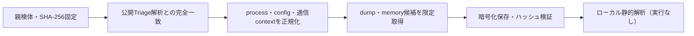

# Triage公開解析・後段取得証跡

## 完全ハッシュ一致

- [260821-plr2sstygz](https://tria.ge/260821-plr2sstygz): ファミリー候補 `未確定`、評価score `None`
- [260821-pamypstvht](https://tria.ge/260821-pamypstvht): ファミリー候補 `未確定`、評価score `None`
- [260821-kdlgtswend](https://tria.ge/260821-kdlgtswend): ファミリー候補 `未確定`、評価score `None`

## プロセス・通信

- 観測process: `取得できず`
- raw commandは保存せず、command SHA-256と処理patternだけをJSONへ保持します。
- sandbox background trafficは`context_only`であり、C2へ自動昇格しません。

- 取得できませんでした。

## 後段取得物

- `b171f938300f963e1a95dffaa7002cf7b4d7005f8c2eed13835b8c22a2a17bbb` / `memory_image` / 2052096 bytes / 親と同一: `false` / 静的解析: `partial`
- `38f6f5027c79c767aaa9acee1dfd1cc4ce36dd3c26770324e0b6176817c3fe6e` / `memory_image` / 2052096 bytes / 親と同一: `false` / 静的解析: `partial`
- `139bcb1d4a841d1b9b3722a18b072d116fe693f78bc9941fb65999b5255a16a3` / `memory_image` / 4096 bytes / 親と同一: `false` / 静的解析: `partial`
- `34f123aae1539949edcf0ab78966e7915336a785511909f3e0d792ce56d1d61c` / `memory_image` / 323584 bytes / 親と同一: `false` / 静的解析: `partial`
- `58faa2d5c85661529af0b3a8c891f541464476f954ee4128beb4112e9b60b0ad` / `memory_image` / 819200 bytes / 親と同一: `false` / 静的解析: `partial`
- `b0bf2a1011b25f8e377497ca179a1d2b773aba52b8d6a2a89b800b8fedbc9ac8` / `memory_image` / 2052096 bytes / 親と同一: `false` / 静的解析: `partial`
- `4c67687b2e45d22bea469c958a718655482efa7ca32c6d319bc5e39a8ac10e0c` / `memory_image` / 2502656 bytes / 親と同一: `false` / 静的解析: `partial`
- `6c2e7ae747eb8d628557763c9b889738ff5287581daf9c5ad800893bae99ebfb` / `memory_image` / 2502656 bytes / 親と同一: `false` / 静的解析: `partial`
- `89bab79db36c5af6ba941ec265132e006c67aa8232d0210ab42c2a5938bab181` / `memory_image` / 323584 bytes / 親と同一: `false` / 静的解析: `partial`
- `8b60cbf3152890988e2cf32a9d6fc67d26efd20c55a67eeb3a701465adfa07cc` / `memory_image` / 819200 bytes / 親と同一: `false` / 静的解析: `partial`
- `813ddbca0b9c71d3989ee99be5039d0da7ea42b83d46c7984b7a1486e0bf1889` / `memory_image` / 2502656 bytes / 親と同一: `false` / 静的解析: `partial`
- `e79e49390db7791eac59c302cbc0022f0784dc404e247320601e85a757c74a09` / `memory_image` / 2134016 bytes / 親と同一: `false` / 静的解析: `partial`
- `9e2004da518500cd6ba9052881df610a94bdfcd61f6470ea970a159f79f65524` / `memory_image` / 2134016 bytes / 親と同一: `false` / 静的解析: `partial`
- `139bcb1d4a841d1b9b3722a18b072d116fe693f78bc9941fb65999b5255a16a3` / `memory_image` / 4096 bytes / 親と同一: `false` / 静的解析: `partial`
- `f0061ea8a28f6f6d4d4050e55acb1885f1921a1780707f92cf80fea6bbda33e4` / `memory_image` / 323584 bytes / 親と同一: `false` / 静的解析: `partial`
- `d120a83e326d37e747a60f87c4adfefecf150d59c76b151fd4cd45f2859fdfa5` / `memory_image` / 819200 bytes / 親と同一: `false` / 静的解析: `partial`
- `b2491398b39c5647ac63d2611eb62b8732f26bd5c3d1ef95a67f119917266799` / `memory_image` / 2134016 bytes / 親と同一: `false` / 静的解析: `partial`
- `b0c774f57444d1a60749116aff1385039fb52916428c9fcc3dbf9999e8698c6a` / `memory_image` / 2052096 bytes / 親と同一: `false` / 静的解析: `partial`
- `2e0b08ec4fd3076b6e54360f83b94422d37e9eb70d1f78fc89f078c3a6692d44` / `memory_image` / 2052096 bytes / 親と同一: `false` / 静的解析: `partial`
- `139bcb1d4a841d1b9b3722a18b072d116fe693f78bc9941fb65999b5255a16a3` / `memory_image` / 4096 bytes / 親と同一: `false` / 静的解析: `partial`
- `17cc9f56461869e1459d8158930a3b50da1860f6d6a8082e08a175ecfef0c4e0` / `memory_image` / 323584 bytes / 親と同一: `false` / 静的解析: `partial`
- `be9d5fe25bda05b3ce6e3a2d2c9c7c614915b9c124c563e52796f0eb4d3027f9` / `memory_image` / 819200 bytes / 親と同一: `false` / 静的解析: `partial`
- `c30ea2e091888d3dfda90c6e2a1051a2c96d8ef7783f3a595744e0489146ff67` / `memory_image` / 2052096 bytes / 親と同一: `false` / 静的解析: `partial`
- `002e0296d3f17abcaaa1ceec5ab220be65ba423f8245e6717c7dc4fd6f0071b5` / `memory_image` / 2052096 bytes / 親と同一: `false` / 静的解析: `partial`

## 判定境界

Triage由来のfamily、process、config、通信は外部sandbox証跡です。Config extractorが返したendpointはC2候補として扱いますが、静的設定復元またはprocess帰属とprotocol応答が揃うまでは確認済みC2とはしません。取得成果物と検体は実行していません。
