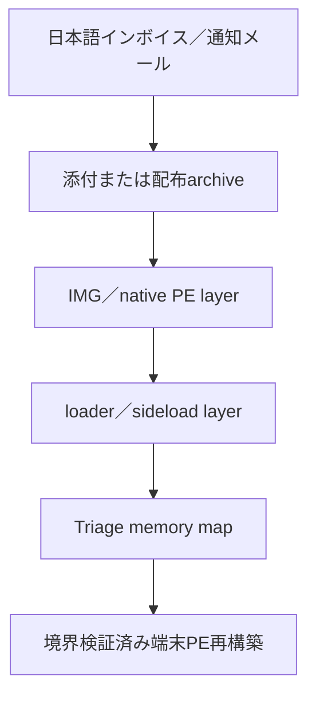
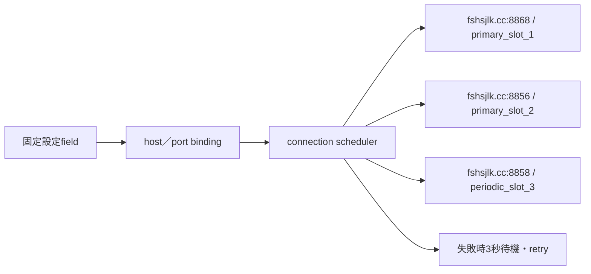
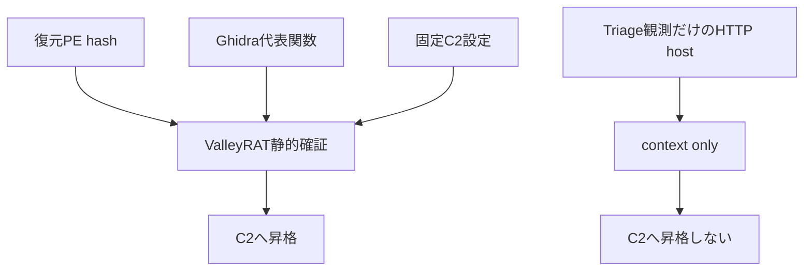

# 全体ロジック

## 配布・復元の流れ

```mermaid
flowchart TD
  A["日本語インボイス／通知メール"] --> B["添付または配布archive"]
  B --> C["IMG／native PE layer"]
  C --> D["loader／sideload layer"]
  D --> E["Triage memory map"]
  E --> F["境界検証済み端末PE再構築"]
```

## 設定から接続まで

```mermaid
flowchart LR
  A["固定設定field"] --> B["host／port binding"]
  B --> S["connection scheduler"]
  S --> C1["fshsjlk.cc:8868 / primary_slot_1"]
  S --> C2["fshsjlk.cc:8856 / primary_slot_2"]
  S --> C3["fshsjlk.cc:8858 / periodic_slot_3"]
  S --> R["失敗時3秒待機・retry"]
```

## 証拠と判定境界

```mermaid
flowchart TD
  A["復元PE hash"] --> D["ValleyRAT静的確証"]
  B["Ghidra代表関数"] --> D
  C["固定C2設定"] --> D
  E["Triage観測だけのHTTP host"] --> F["context only"]
  D --> G["C2へ昇格"]
  F --> H["C2へ昇格しない"]
```
