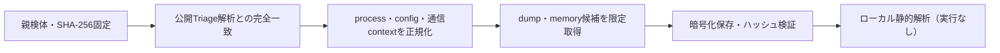

# Triage公開解析・後段取得証跡

## 完全ハッシュ一致

- [260923-rf9e1avy4r](https://tria.ge/260923-rf9e1avy4r): ファミリー候補 `未確定`、評価score `10`
- [260923-q1aazacg27](https://tria.ge/260923-q1aazacg27): ファミリー候補 `未確定`、評価score `10`
- [260923-jf15mawtfs](https://tria.ge/260923-jf15mawtfs): ファミリー候補 `未確定`、評価score `10`

## プロセス・通信

- 観測process: `01Hyh.exe, 089cd5a891a8f212df5f54a6b08205e06e85eacbe6ff9bfcfcb5fd6e51d1813b.exe, 8dxHBm.exe, 9I7NJ.exe, BzlwCy.exe, JfWF4Yf.exe, bPLWRx.exe, cbn9Vv.exe, cmd.exe, d7hIPu.exe, ibGzpP.exe, icacls.exe, instapp.a.1.06.sfx.exe, instapp.a.1.08.exe, j1k79fF.exe, net.exe, net1.exe, nflKVb.exe, o9CU5h.exe, oCMspS.exe, powershell.exe, q24Cu2.exe, reg.exe, sc.exe, schtasks.exe, wjpLOUN.exe`
- raw commandは保存せず、command SHA-256と処理patternだけをJSONへ保持します。
- sandbox background trafficは`context_only`であり、C2へ自動昇格しません。

- 取得できませんでした。

## 後段取得物

- 取得できませんでした。

## 判定境界

Triage由来のfamily、process、config、通信は外部sandbox証跡です。Config extractorが返したendpointはC2候補として扱いますが、静的設定復元またはprocess帰属とprotocol応答が揃うまでは確認済みC2とはしません。取得成果物と検体は実行していません。
