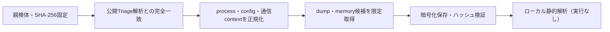

# Triage公開解析・後段取得証跡

## 完全ハッシュ一致

- [260826-n75pcavzgw](https://tria.ge/260826-n75pcavzgw): ファミリー候補 `未確定`、評価score `None`
- [260826-ns9dzscr4x](https://tria.ge/260826-ns9dzscr4x): ファミリー候補 `未確定`、評価score `None`

## プロセス・通信

- 観測process: `取得できず`
- raw commandは保存せず、command SHA-256と処理patternだけをJSONへ保持します。
- sandbox background trafficは`context_only`であり、C2へ自動昇格しません。

- 取得できませんでした。

## 後段取得物

- `9e7a863572553c05e09507e366eb5285009751b678102af26ee872988dca519e` / `memory_image` / 2052096 bytes / 親と同一: `false` / 静的解析: `partial`
- `ee6f583e8a99d0a366351f62d4e188ec85c080fc3ec49a821382e676e1ce0473` / `memory_image` / 430080 bytes / 親と同一: `false` / 静的解析: `partial`
- `296ae0816e858642526d51459c6d27b7b277033b3b431d0a3dfbdd1708d34647` / `memory_image` / 2052096 bytes / 親と同一: `false` / 静的解析: `partial`
- `e8af82f58aa30f4a32cdb76d263339d4d0f82cfc8a43bffc321b2cd3317cf82e` / `memory_image` / 430080 bytes / 親と同一: `false` / 静的解析: `partial`
- `871d157020693fc842ef5977c61f0bec6fc934b95cbcc744b38b5f2860f32d58` / `memory_image` / 4096 bytes / 親と同一: `false` / 静的解析: `partial`
- `b8a625ccf8ad0e6f66b8ed5099c2606832fe298f05ad1fd07bf8f4ce1dccffad` / `memory_image` / 806912 bytes / 親と同一: `false` / 静的解析: `partial`
- `71616704eac8579610dde9c1e1477d231b2902a3bff6bd6f6d3efe1eca612629` / `memory_image` / 2052096 bytes / 親と同一: `false` / 静的解析: `partial`
- `002e0296d3f17abcaaa1ceec5ab220be65ba423f8245e6717c7dc4fd6f0071b5` / `memory_image` / 2052096 bytes / 親と同一: `false` / 静的解析: `partial`
- `a7096cbc3a84e37180c648a628ad5c106453c88d4cde8ce923edb0cd6821fd6c` / `memory_image` / 2502656 bytes / 親と同一: `false` / 静的解析: `partial`
- `32d3de63d7c8c72a04000d83a974904e2eeb55798455c930079ecdffd11e7ff1` / `memory_image` / 430080 bytes / 親と同一: `false` / 静的解析: `partial`
- `046f08b1887f3af8b39b9d042f4d757c880fde948d57de71cfd43541701acb49` / `memory_image` / 2502656 bytes / 親と同一: `false` / 静的解析: `partial`
- `3cceaf1ebc63a47fe29668a63877d0bca1e820715ffde2f2ed49d3d8657d7d74` / `memory_image` / 430080 bytes / 親と同一: `false` / 静的解析: `partial`
- `6e139d814b2f2824b7000170eae27b53d6b21e6f265fdfa2138e031957a05a84` / `memory_image` / 806912 bytes / 親と同一: `false` / 静的解析: `partial`
- `fd9fb67b6d76ac93ed0f2b33ed28b4c18d93687434ff606cebddbc090a9ebe41` / `memory_image` / 2502656 bytes / 親と同一: `false` / 静的解析: `partial`
- `64a9111686921032931daac0d301d6e80d30cc55f33f9979394473c6cf0a5801` / `memory_image` / 2134016 bytes / 親と同一: `false` / 静的解析: `partial`
- `c04a95396d0d38f221fcad4bf11b77c0bcf3cfdafdf717a09c85f4c7be1c9a04` / `memory_image` / 430080 bytes / 親と同一: `false` / 静的解析: `partial`
- `d32750944c5fa0ff56f9e76d8cf5779e431d89542cd9094c3b76a4f8c6762791` / `memory_image` / 2134016 bytes / 親と同一: `false` / 静的解析: `partial`
- `871d157020693fc842ef5977c61f0bec6fc934b95cbcc744b38b5f2860f32d58` / `memory_image` / 4096 bytes / 親と同一: `false` / 静的解析: `partial`
- `d7d85b2861bc0e75699cbeb8c3924c2528d6f9cf43c87d195fae5f4b06b90c2e` / `memory_image` / 430080 bytes / 親と同一: `false` / 静的解析: `partial`
- `417655d21599eb4e26cbd6b96fee969a07434b672c314ffe3dab07afbb13eec9` / `memory_image` / 806912 bytes / 親と同一: `false` / 静的解析: `partial`
- `d62e9c86a529e4d100dedfcef7ab845272393684ad5f1c3d5328dc52aca6cf51` / `memory_image` / 2134016 bytes / 親と同一: `false` / 静的解析: `partial`

## 判定境界

Triage由来のfamily、process、config、通信は外部sandbox証跡です。Config extractorが返したendpointはC2候補として扱いますが、静的設定復元またはprocess帰属とprotocol応答が揃うまでは確認済みC2とはしません。取得成果物と検体は実行していません。
