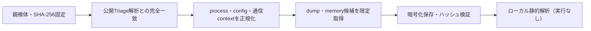

# Triage公開解析・後段取得証跡

## 完全ハッシュ一致

- [260822-a1dematzes](https://tria.ge/260822-a1dematzes): ファミリー候補 `未確定`、評価score `None`
- [260819-ls436atsfs](https://tria.ge/260819-ls436atsfs): ファミリー候補 `未確定`、評価score `None`

## プロセス・通信

- 観測process: `取得できず`
- raw commandは保存せず、command SHA-256と処理patternだけをJSONへ保持します。
- sandbox background trafficは`context_only`であり、C2へ自動昇格しません。

- 取得できませんでした。

## 後段取得物

- `a0ba52aabff9cbdd1bb49f8562fff10b85177d8f7e7f519d8f16ac1f4fc4e239` / `memory_image` / 360448 bytes / 親と同一: `false` / 静的解析: `partial`
- `45558621e9f81a940d22d74cd24132a0cb282012b1e0518d0c389a6c66287e21` / `memory_image` / 360448 bytes / 親と同一: `false` / 静的解析: `partial`
- `25a8e9f802b675bf57611e570c8635c16ee1a7abe72c28a80b406ab74468df61` / `memory_image` / 339968 bytes / 親と同一: `false` / 静的解析: `partial`
- `98d013bffb2c5dc9c5be17aa8c65382d4086dca687db219d928d34a5d45633f4` / `memory_image` / 360448 bytes / 親と同一: `false` / 静的解析: `partial`
- `047077ba6cddbb6be97fa9afa7bcfb48dd2f1b3d5f5b28e9e822592c97081911` / `memory_image` / 360448 bytes / 親と同一: `false` / 静的解析: `partial`
- `8d0a8772004b01c7daa42ccd79349a109ee7b646a72a6e5f9aab77194772d2f5` / `memory_image` / 360448 bytes / 親と同一: `false` / 静的解析: `partial`
- `f298b664ecbe31fdd151fe075c5d3a9652192804830bce7c0bca3e13bb6c0f67` / `memory_image` / 360448 bytes / 親と同一: `false` / 静的解析: `partial`
- `6b61a5b54e82245650fc34d7d1c556f36b2252d352ca38905986382a8542829c` / `memory_image` / 360448 bytes / 親と同一: `false` / 静的解析: `partial`
- `4e65b4ba0cac92f5f6821e2662455a509c2a579b63f89e4bbb8638fb7f2e2e57` / `memory_image` / 360448 bytes / 親と同一: `false` / 静的解析: `partial`
- `15cbde47f8964fa4e95126ec3b299ec7bf3dd889b12cc576b81ad52e441e4ea9` / `memory_image` / 360448 bytes / 親と同一: `false` / 静的解析: `partial`
- `58367406f96946a0bcb3f5684fe5665f597a3c9c56b342a862051cd1c091c5a3` / `memory_image` / 360448 bytes / 親と同一: `false` / 静的解析: `partial`
- `e3771e9ff3cfb8abd0da1c4e3e7103a8f6f9dbf3cc3fb447b83fa853d72c505d` / `memory_image` / 360448 bytes / 親と同一: `false` / 静的解析: `partial`
- `25a8e9f802b675bf57611e570c8635c16ee1a7abe72c28a80b406ab74468df61` / `memory_image` / 339968 bytes / 親と同一: `false` / 静的解析: `partial`
- `f2f91b62f34b24387bb4b55baa23953bfff5badf0519dfeba2d1c2ea5b9cae77` / `memory_image` / 360448 bytes / 親と同一: `false` / 静的解析: `partial`
- `b7d27830d327a22cbca8bbd24c8d32536be843983a1f3a9ecf1d9563b7c15dd6` / `memory_image` / 360448 bytes / 親と同一: `false` / 静的解析: `partial`
- `b4fe62d56146d52598cca2d2ccc81b5bd96d72753c7a8a7bea97e53f97c317cb` / `memory_image` / 360448 bytes / 親と同一: `false` / 静的解析: `partial`
- `06ef65dcef925e9261cbaef300ee50eb3d8fd428e31076341c46cb47e9d5d1ef` / `memory_image` / 360448 bytes / 親と同一: `false` / 静的解析: `partial`
- `b8dd0d872daa6d915e691fd67a4a6705b4cd5e9603f949c4ce740d8db4ddcb52` / `memory_image` / 360448 bytes / 親と同一: `false` / 静的解析: `partial`
- `de707de26f2a145e9b7b1f913f28bd15d3780decc789036ecb1cbc7dc0da2bed` / `memory_image` / 360448 bytes / 親と同一: `false` / 静的解析: `partial`
- `8c51ab7a72828fd0346e2d344ecaa72fb14983789d7daca00865866ad3ad72bb` / `memory_image` / 360448 bytes / 親と同一: `false` / 静的解析: `partial`
- `6a83fb073884942740145bcc267e51bdc4caa0526c1806cb52df0f6cb4e527ac` / `memory_image` / 360448 bytes / 親と同一: `false` / 静的解析: `partial`
- `63d7c8eb6409e78b5bdcb659b58598ea1c1d5df7d0b9af0f1ac3a59d5cac90f4` / `memory_image` / 360448 bytes / 親と同一: `false` / 静的解析: `partial`
- `5dc222a74ab73634663300f257bbe12cf257884c94d55dbdc988dfca77401a93` / `memory_image` / 360448 bytes / 親と同一: `false` / 静的解析: `partial`
- `0a4334a0c4eb47241d1bd8d3676bcbf2a763d247bdaa1a0b6ca374815336d9c3` / `memory_image` / 360448 bytes / 親と同一: `false` / 静的解析: `partial`

## 判定境界

Triage由来のfamily、process、config、通信は外部sandbox証跡です。Config extractorが返したendpointはC2候補として扱いますが、静的設定復元またはprocess帰属とprotocol応答が揃うまでは確認済みC2とはしません。取得成果物と検体は実行していません。
