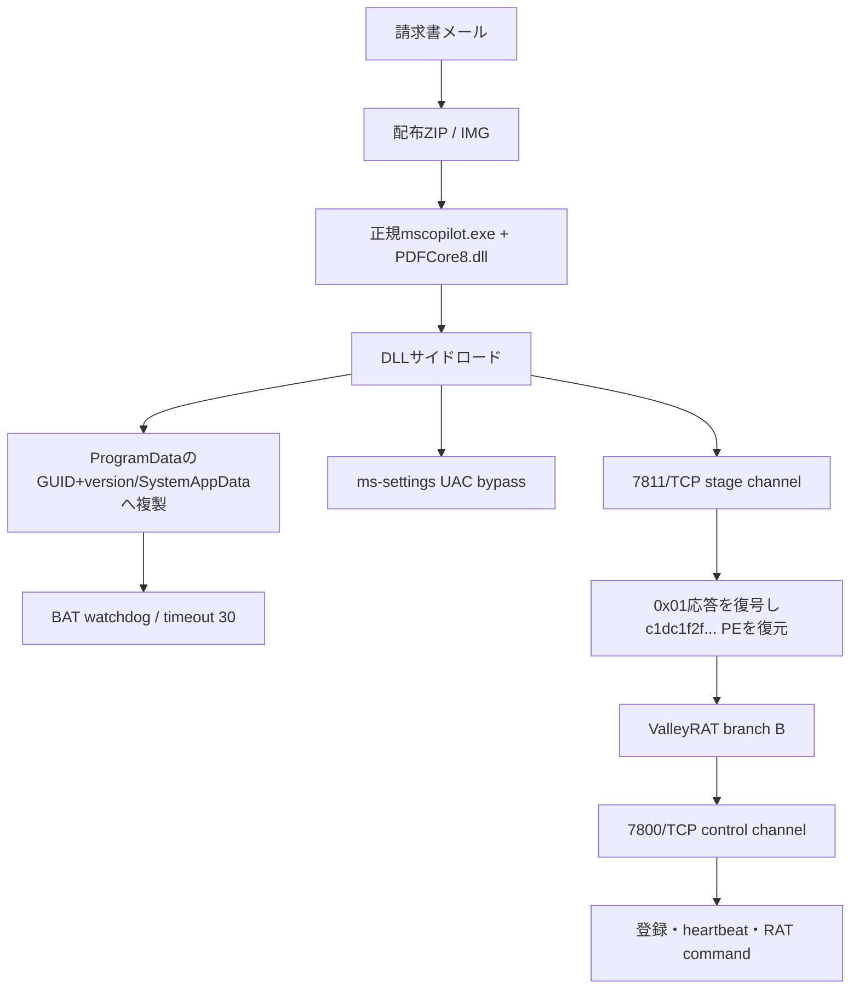

# 全体ロジック

```mermaid
flowchart TD
  A["請求書メール"] --> B["配布ZIP / IMG"]
  B --> C["正規mscopilot.exe + PDFCore8.dll"]
  C --> D["DLLサイドロード"]
  D --> E["ProgramDataのGUID+version/SystemAppDataへ複製"]
  D --> F["ms-settings UAC bypass"]
  E --> G["BAT watchdog / timeout 30"]
  D --> H["7811/TCP stage channel"]
  H --> I["0x01応答を復号しc1dc1f2f... PEを復元"]
  I --> J["ValleyRAT branch B"]
  J --> K["7800/TCP control channel"]
  K --> L["登録・heartbeat・RAT command"]
```

PCAP再構成により、stage取得とcontrol通信を混同せず別channelとして確認しました。live時にはstage取得を再送せず、両portの到達性だけを限定確認しています。
