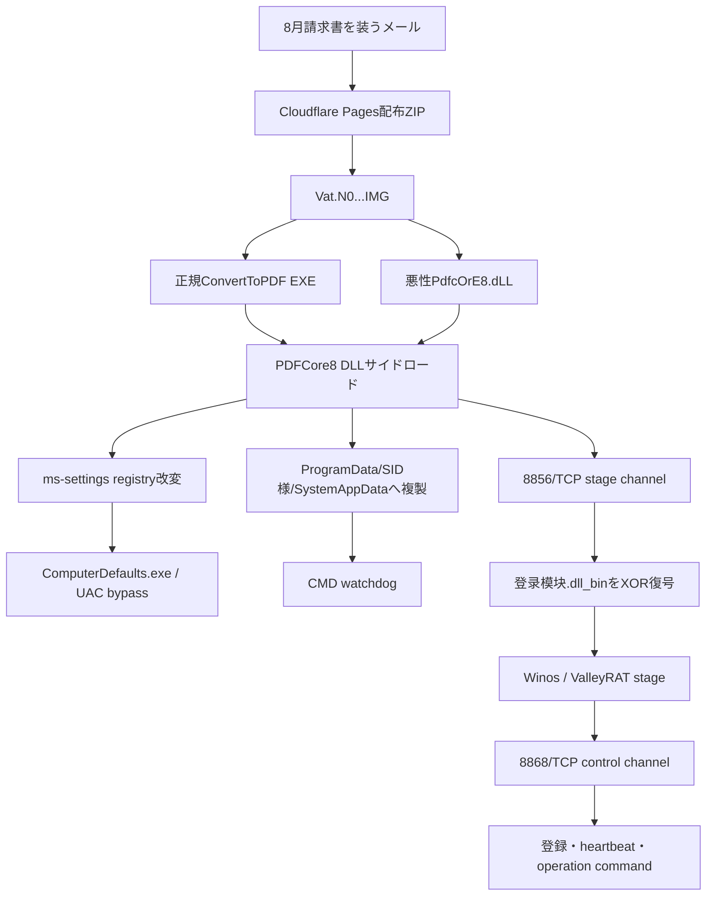

# 全体ロジック

```mermaid
flowchart TD
  A["8月請求書を装うメール"] --> B["Cloudflare Pages配布ZIP"]
  B --> C["Vat.N0...IMG"]
  C --> D["正規ConvertToPDF EXE"]
  C --> E["悪性PdfcOrE8.dLL"]
  D --> F["PDFCore8 DLLサイドロード"]
  E --> F
  F --> G["ProgramData/SID様/SystemAppDataへ複製"]
  F --> H["ms-settings registry改変"]
  H --> I["ComputerDefaults.exe / UAC bypass"]
  G --> J["CMD watchdog"]
  F --> K["8856/TCP stage channel"]
  K --> L["登录模块.dll_binをXOR復号"]
  L --> M["Winos / ValleyRAT stage"]
  M --> N["8868/TCP control channel"]
  N --> O["登録・heartbeat・operation command"]
```

外層プロキシ、権限昇格・監視、stage取得、control通信を別moduleとして統一表現しています。
