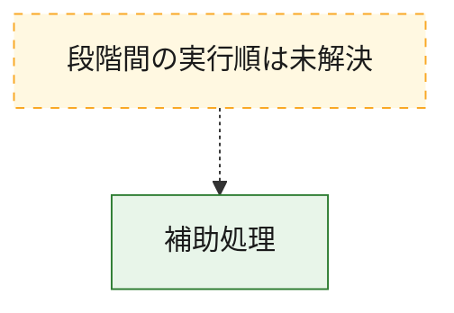
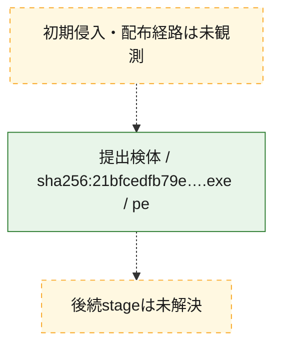
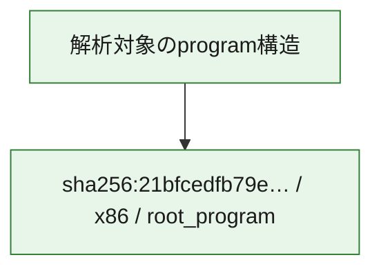

# 全体ロジック：21bfcedfb79ec8427ad3d766b66997983a2910d05164773159263b52a5cd6317

代表関数から主要なmalware処理段階を自動分類できませんでした。

## 読み方

- phaseの掲載順は解析上の整理順です。observed_call_edgesがない段階間の実行順を断定しません。
- 図の実線は静的に観測した関係、点線と黄色のノードは未観測・未解決の関係を示します。
- 図は静的な要約であり、動的実行を再現するものではありません。
- 詳細な関数解説とfingerprintは[STATIC-LOGIC.md](STATIC-LOGIC.md)を参照してください。

## 静的可視化

### 実行フロー

### 感染チェーン

### モジュール関係

## 処理段階

### 1. 補助処理

主要処理を支える一般内部関数またはlibrary処理を確認します。
確度: `confirmed_static_function_evidence`

- `21bfcedfb79ec8427ad3d766b66997983a2910d05164773159263b52a5cd6317:ghidra:1400010a0` — 検体内部の一般処理を実装する関数です。 状態: `succeeded`、選定理由: `context_representative`, `reviewed_call_centrality:2`
- `21bfcedfb79ec8427ad3d766b66997983a2910d05164773159263b52a5cd6317:ghidra:140001240` — 検体内部の一般処理を実装する関数です。 状態: `succeeded`、選定理由: `context_representative`, `reviewed_call_centrality:2`
- `21bfcedfb79ec8427ad3d766b66997983a2910d05164773159263b52a5cd6317:ghidra:1400012a0` — 検体内部の一般処理を実装する関数です。 状態: `succeeded`、選定理由: `context_representative`, `reviewed_call_centrality:4`
- `21bfcedfb79ec8427ad3d766b66997983a2910d05164773159263b52a5cd6317:ghidra:140001320` — 検体内部の一般処理を実装する関数です。 状態: `succeeded`、選定理由: `context_representative`, `reviewed_call_centrality:4`
- `21bfcedfb79ec8427ad3d766b66997983a2910d05164773159263b52a5cd6317:ghidra:1400013c0` — 検体内部の一般処理を実装する関数です。 状態: `succeeded`、選定理由: `context_representative`, `reviewed_call_centrality:4`
- `21bfcedfb79ec8427ad3d766b66997983a2910d05164773159263b52a5cd6317:ghidra:1400014c0` — 検体内部の一般処理を実装する関数です。 状態: `succeeded`、選定理由: `context_representative`, `reviewed_call_centrality:8`
- `21bfcedfb79ec8427ad3d766b66997983a2910d05164773159263b52a5cd6317:ghidra:140001940` — 検体内部の一般処理を実装する関数です。 状態: `succeeded`、選定理由: `context_representative`, `reviewed_call_centrality:2`
- `21bfcedfb79ec8427ad3d766b66997983a2910d05164773159263b52a5cd6317:ghidra:140001b80` — 検体内部の一般処理を実装する関数です。 状態: `succeeded`、選定理由: `context_representative`, `reviewed_call_centrality:2`
- `21bfcedfb79ec8427ad3d766b66997983a2910d05164773159263b52a5cd6317:ghidra:140001c00` — 検体内部の一般処理を実装する関数です。 状態: `succeeded`、選定理由: `context_representative`, `reviewed_call_centrality:3`
- `21bfcedfb79ec8427ad3d766b66997983a2910d05164773159263b52a5cd6317:ghidra:140001c60` — 検体内部の一般処理を実装する関数です。 状態: `succeeded`、選定理由: `context_representative`, `reviewed_call_centrality:11`
- `21bfcedfb79ec8427ad3d766b66997983a2910d05164773159263b52a5cd6317:ghidra:1400021a0` — 検体内部の一般処理を実装する関数です。 状態: `succeeded`、選定理由: `context_representative`, `reviewed_call_centrality:11`
- `21bfcedfb79ec8427ad3d766b66997983a2910d05164773159263b52a5cd6317:ghidra:140002ae0` — 検体内部の一般処理を実装する関数です。 状態: `succeeded`、選定理由: `context_representative`, `reviewed_call_centrality:2`
- `21bfcedfb79ec8427ad3d766b66997983a2910d05164773159263b52a5cd6317:ghidra:140002b60` — 検体内部の一般処理を実装する関数です。 状態: `succeeded`、選定理由: `context_representative`, `reviewed_call_centrality:2`
- `21bfcedfb79ec8427ad3d766b66997983a2910d05164773159263b52a5cd6317:ghidra:140003be0` — 検体内部の一般処理を実装する関数です。 状態: `succeeded`、選定理由: `context_representative`, `reviewed_call_centrality:1`
- `21bfcedfb79ec8427ad3d766b66997983a2910d05164773159263b52a5cd6317:ghidra:140003c20` — 検体内部の一般処理を実装する関数です。 状態: `succeeded`、選定理由: `context_representative`, `reviewed_call_centrality:1`
- `21bfcedfb79ec8427ad3d766b66997983a2910d05164773159263b52a5cd6317:ghidra:140003c60` — 検体内部の一般処理を実装する関数です。 状態: `succeeded`、選定理由: `context_representative`, `reviewed_call_centrality:5`
- `21bfcedfb79ec8427ad3d766b66997983a2910d05164773159263b52a5cd6317:ghidra:140003e40` — 検体内部の一般処理を実装する関数です。 状態: `succeeded`、選定理由: `context_representative`, `reviewed_call_centrality:10`
- `21bfcedfb79ec8427ad3d766b66997983a2910d05164773159263b52a5cd6317:ghidra:1400040c0` — 検体内部の一般処理を実装する関数です。 状態: `succeeded`、選定理由: `context_representative`, `reviewed_call_centrality:5`
- `21bfcedfb79ec8427ad3d766b66997983a2910d05164773159263b52a5cd6317:ghidra:140004340` — 検体内部の一般処理を実装する関数です。 状態: `succeeded`、選定理由: `context_representative`, `reviewed_call_centrality:4`
- `21bfcedfb79ec8427ad3d766b66997983a2910d05164773159263b52a5cd6317:ghidra:140004460` — 検体内部の一般処理を実装する関数です。 状態: `succeeded`、選定理由: `context_representative`, `reviewed_call_centrality:7`
- `21bfcedfb79ec8427ad3d766b66997983a2910d05164773159263b52a5cd6317:ghidra:1400045a0` — 検体内部の一般処理を実装する関数です。 状態: `succeeded`、選定理由: `context_representative`, `reviewed_call_centrality:9`
- `21bfcedfb79ec8427ad3d766b66997983a2910d05164773159263b52a5cd6317:ghidra:140004860` — 検体内部の一般処理を実装する関数です。 状態: `succeeded`、選定理由: `context_representative`, `reviewed_call_centrality:3`
- `21bfcedfb79ec8427ad3d766b66997983a2910d05164773159263b52a5cd6317:ghidra:1400048e0` — 検体内部の一般処理を実装する関数です。 状態: `succeeded`、選定理由: `context_representative`, `reviewed_call_centrality:5`
- `21bfcedfb79ec8427ad3d766b66997983a2910d05164773159263b52a5cd6317:ghidra:140004a80` — 検体内部の一般処理を実装する関数です。 状態: `succeeded`、選定理由: `context_representative`, `reviewed_call_centrality:8`
- `21bfcedfb79ec8427ad3d766b66997983a2910d05164773159263b52a5cd6317:ghidra:140004c20` — 検体内部の一般処理を実装する関数です。 状態: `succeeded`、選定理由: `context_representative`, `reviewed_call_centrality:8`
- `21bfcedfb79ec8427ad3d766b66997983a2910d05164773159263b52a5cd6317:ghidra:140004e00` — 検体内部の一般処理を実装する関数です。 状態: `succeeded`、選定理由: `context_representative`, `reviewed_call_centrality:14`
- `21bfcedfb79ec8427ad3d766b66997983a2910d05164773159263b52a5cd6317:ghidra:1400050c0` — 検体内部の一般処理を実装する関数です。 状態: `succeeded`、選定理由: `context_representative`, `reviewed_call_centrality:3`
- `21bfcedfb79ec8427ad3d766b66997983a2910d05164773159263b52a5cd6317:ghidra:1400052c0` — 検体内部の一般処理を実装する関数です。 状態: `succeeded`、選定理由: `context_representative`, `reviewed_call_centrality:3`
- `21bfcedfb79ec8427ad3d766b66997983a2910d05164773159263b52a5cd6317:ghidra:140005320` — 検体内部の一般処理を実装する関数です。 状態: `succeeded`、選定理由: `context_representative`, `reviewed_call_centrality:6`
- `21bfcedfb79ec8427ad3d766b66997983a2910d05164773159263b52a5cd6317:ghidra:140005480` — 検体内部の一般処理を実装する関数です。 状態: `succeeded`、選定理由: `context_representative`, `reviewed_call_centrality:6`
- `21bfcedfb79ec8427ad3d766b66997983a2910d05164773159263b52a5cd6317:ghidra:1400055e0` — 検体内部の一般処理を実装する関数です。 状態: `succeeded`、選定理由: `context_representative`, `reviewed_call_centrality:7`
- `21bfcedfb79ec8427ad3d766b66997983a2910d05164773159263b52a5cd6317:ghidra:140005760` — 検体内部の一般処理を実装する関数です。 状態: `succeeded`、選定理由: `context_representative`, `reviewed_call_centrality:2`

## 観測したcall関係

- 代表関数間で直接解決できた呼出関係はありません。

## 解析範囲と制約

- 選定外関数は全体inventoryへ残しますが、関数本体の個別解説対象にはしていません。
- indirect call、難読化、packer、VM、壊れたcontrol flowによりcall関係が欠落する場合があります。
- 文書は静的解析に基づき、検体実行や外部通信による動的確認は行っていません。
