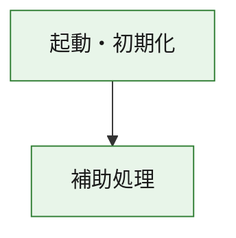
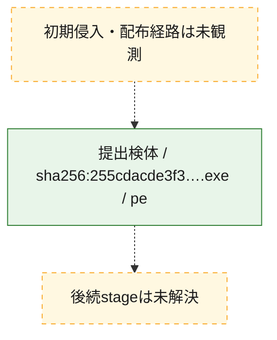
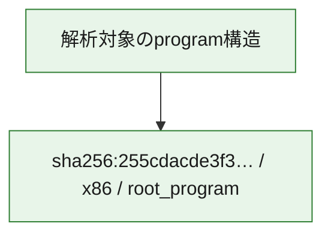

# 全体ロジック：255cdacde3f3951fc41cad1d6a248f0bf27ae7aa4fa5b058848b3a1cb93533c4

代表関数の静的証跡から、起動・初期化の処理群を確認しました。

## 読み方

- phaseの掲載順は解析上の整理順です。observed_call_edgesがない段階間の実行順を断定しません。
- 図の実線は静的に観測した関係、点線と黄色のノードは未観測・未解決の関係を示します。
- 図は静的な要約であり、動的実行を再現するものではありません。
- 詳細な関数解説とfingerprintは[STATIC-LOGIC.md](STATIC-LOGIC.md)を参照してください。

## 静的可視化

### 実行フロー

### 感染チェーン

### モジュール関係

## 処理段階

### 1. 起動・初期化

entry pointから初期化と後続処理への移行を確認します。
確度: `confirmed_static_function_evidence`

- `255cdacde3f3951fc41cad1d6a248f0bf27ae7aa4fa5b058848b3a1cb93533c4:ghidra:180221f28` — 初期化と主要処理への分岐を行う入口関数です。 状態: `succeeded`、選定理由: `entry_point`, `meaningful_symbol_name`, `reviewed_call_centrality:4`, `role:entrypoint`

### 2. 補助処理

主要処理を支える一般内部関数またはlibrary処理を確認します。
確度: `confirmed_static_function_evidence`

- `255cdacde3f3951fc41cad1d6a248f0bf27ae7aa4fa5b058848b3a1cb93533c4:ghidra:180001040` — 検体内部の一般処理を実装する関数です。 状態: `succeeded`、選定理由: `context_representative`, `reviewed_call_centrality:1`
- `255cdacde3f3951fc41cad1d6a248f0bf27ae7aa4fa5b058848b3a1cb93533c4:ghidra:180001080` — 検体内部の一般処理を実装する関数です。 状態: `succeeded`、選定理由: `context_representative`, `reviewed_call_centrality:2`
- `255cdacde3f3951fc41cad1d6a248f0bf27ae7aa4fa5b058848b3a1cb93533c4:ghidra:1800010b0` — 検体内部の一般処理を実装する関数です。 状態: `succeeded`、選定理由: `context_representative`, `reviewed_call_centrality:2`
- `255cdacde3f3951fc41cad1d6a248f0bf27ae7aa4fa5b058848b3a1cb93533c4:ghidra:1800010f0` — 検体内部の一般処理を実装する関数です。 状態: `succeeded`、選定理由: `context_representative`, `reviewed_call_centrality:3`
- `255cdacde3f3951fc41cad1d6a248f0bf27ae7aa4fa5b058848b3a1cb93533c4:ghidra:180001120` — 検体内部の一般処理を実装する関数です。 状態: `succeeded`、選定理由: `context_representative`, `reviewed_call_centrality:1`
- `255cdacde3f3951fc41cad1d6a248f0bf27ae7aa4fa5b058848b3a1cb93533c4:ghidra:1800011a0` — 検体内部の一般処理を実装する関数です。 状態: `succeeded`、選定理由: `context_representative`, `reviewed_call_centrality:6`
- `255cdacde3f3951fc41cad1d6a248f0bf27ae7aa4fa5b058848b3a1cb93533c4:ghidra:180001200` — 検体内部の一般処理を実装する関数です。 状態: `succeeded`、選定理由: `context_representative`, `reviewed_call_centrality:3`
- `255cdacde3f3951fc41cad1d6a248f0bf27ae7aa4fa5b058848b3a1cb93533c4:ghidra:1800012a0` — 検体内部の一般処理を実装する関数です。 状態: `succeeded`、選定理由: `context_representative`, `reviewed_call_centrality:4`
- `255cdacde3f3951fc41cad1d6a248f0bf27ae7aa4fa5b058848b3a1cb93533c4:ghidra:180001300` — 検体内部の一般処理を実装する関数です。 状態: `succeeded`、選定理由: `context_representative`, `reviewed_call_centrality:3`
- `255cdacde3f3951fc41cad1d6a248f0bf27ae7aa4fa5b058848b3a1cb93533c4:ghidra:180001330` — 検体内部の一般処理を実装する関数です。 状態: `succeeded`、選定理由: `context_representative`, `reviewed_call_centrality:19`
- `255cdacde3f3951fc41cad1d6a248f0bf27ae7aa4fa5b058848b3a1cb93533c4:ghidra:1800014d0` — 検体内部の一般処理を実装する関数です。 状態: `succeeded`、選定理由: `context_representative`, `reviewed_call_centrality:11`
- `255cdacde3f3951fc41cad1d6a248f0bf27ae7aa4fa5b058848b3a1cb93533c4:ghidra:1800015a0` — 検体内部の一般処理を実装する関数です。 状態: `succeeded`、選定理由: `context_representative`, `reviewed_call_centrality:9`
- `255cdacde3f3951fc41cad1d6a248f0bf27ae7aa4fa5b058848b3a1cb93533c4:ghidra:180001670` — 検体内部の一般処理を実装する関数です。 状態: `succeeded`、選定理由: `context_representative`, `reviewed_call_centrality:5`
- `255cdacde3f3951fc41cad1d6a248f0bf27ae7aa4fa5b058848b3a1cb93533c4:ghidra:1800016d0` — 検体内部の一般処理を実装する関数です。 状態: `succeeded`、選定理由: `context_representative`, `reviewed_call_centrality:5`
- `255cdacde3f3951fc41cad1d6a248f0bf27ae7aa4fa5b058848b3a1cb93533c4:ghidra:180001740` — 検体内部の一般処理を実装する関数です。 状態: `succeeded`、選定理由: `context_representative`, `reviewed_call_centrality:3`
- `255cdacde3f3951fc41cad1d6a248f0bf27ae7aa4fa5b058848b3a1cb93533c4:ghidra:180001770` — 検体内部の一般処理を実装する関数です。 状態: `succeeded`、選定理由: `context_representative`, `reviewed_call_centrality:2`
- `255cdacde3f3951fc41cad1d6a248f0bf27ae7aa4fa5b058848b3a1cb93533c4:ghidra:1800017b0` — 検体内部の一般処理を実装する関数です。 状態: `succeeded`、選定理由: `context_representative`, `reviewed_call_centrality:4`
- `255cdacde3f3951fc41cad1d6a248f0bf27ae7aa4fa5b058848b3a1cb93533c4:ghidra:180001810` — 検体内部の一般処理を実装する関数です。 状態: `succeeded`、選定理由: `context_representative`, `reviewed_call_centrality:3`
- `255cdacde3f3951fc41cad1d6a248f0bf27ae7aa4fa5b058848b3a1cb93533c4:ghidra:180001850` — 検体内部の一般処理を実装する関数です。 状態: `succeeded`、選定理由: `context_representative`, `reviewed_call_centrality:7`
- `255cdacde3f3951fc41cad1d6a248f0bf27ae7aa4fa5b058848b3a1cb93533c4:ghidra:180001900` — 検体内部の一般処理を実装する関数です。 状態: `succeeded`、選定理由: `context_representative`, `reviewed_call_centrality:6`
- `255cdacde3f3951fc41cad1d6a248f0bf27ae7aa4fa5b058848b3a1cb93533c4:ghidra:1800019a0` — 検体内部の一般処理を実装する関数です。 状態: `succeeded`、選定理由: `context_representative`, `reviewed_call_centrality:2`
- `255cdacde3f3951fc41cad1d6a248f0bf27ae7aa4fa5b058848b3a1cb93533c4:ghidra:1800019e0` — 検体内部の一般処理を実装する関数です。 状態: `succeeded`、選定理由: `context_representative`, `reviewed_call_centrality:2`
- `255cdacde3f3951fc41cad1d6a248f0bf27ae7aa4fa5b058848b3a1cb93533c4:ghidra:180001a40` — 検体内部の一般処理を実装する関数です。 状態: `succeeded`、選定理由: `context_representative`, `reviewed_call_centrality:8`
- `255cdacde3f3951fc41cad1d6a248f0bf27ae7aa4fa5b058848b3a1cb93533c4:ghidra:180001b60` — 検体内部の一般処理を実装する関数です。 状態: `succeeded`、選定理由: `context_representative`, `reviewed_call_centrality:4`
- `255cdacde3f3951fc41cad1d6a248f0bf27ae7aa4fa5b058848b3a1cb93533c4:ghidra:180001c00` — 検体内部の一般処理を実装する関数です。 状態: `succeeded`、選定理由: `context_representative`, `reviewed_call_centrality:2`
- `255cdacde3f3951fc41cad1d6a248f0bf27ae7aa4fa5b058848b3a1cb93533c4:ghidra:180001c70` — 検体内部の一般処理を実装する関数です。 状態: `succeeded`、選定理由: `context_representative`, `reviewed_call_centrality:9`
- `255cdacde3f3951fc41cad1d6a248f0bf27ae7aa4fa5b058848b3a1cb93533c4:ghidra:180001d80` — 検体内部の一般処理を実装する関数です。 状態: `succeeded`、選定理由: `context_representative`, `reviewed_call_centrality:6`
- `255cdacde3f3951fc41cad1d6a248f0bf27ae7aa4fa5b058848b3a1cb93533c4:ghidra:180001dd0` — 検体内部の一般処理を実装する関数です。 状態: `succeeded`、選定理由: `context_representative`, `reviewed_call_centrality:7`
- `255cdacde3f3951fc41cad1d6a248f0bf27ae7aa4fa5b058848b3a1cb93533c4:ghidra:180001eb0` — 検体内部の一般処理を実装する関数です。 状態: `succeeded`、選定理由: `context_representative`, `reviewed_call_centrality:3`
- `255cdacde3f3951fc41cad1d6a248f0bf27ae7aa4fa5b058848b3a1cb93533c4:ghidra:180001f00` — 検体内部の一般処理を実装する関数です。 状態: `succeeded`、選定理由: `context_representative`, `reviewed_call_centrality:4`
- `255cdacde3f3951fc41cad1d6a248f0bf27ae7aa4fa5b058848b3a1cb93533c4:ghidra:180001f40` — 検体内部の一般処理を実装する関数です。 状態: `succeeded`、選定理由: `context_representative`, `reviewed_call_centrality:2`

## 観測したcall関係

- `255cdacde3f3951fc41cad1d6a248f0bf27ae7aa4fa5b058848b3a1cb93533c4:ghidra:1800010b0` → `255cdacde3f3951fc41cad1d6a248f0bf27ae7aa4fa5b058848b3a1cb93533c4:ghidra:180001080` （`support` → `support`）
- `255cdacde3f3951fc41cad1d6a248f0bf27ae7aa4fa5b058848b3a1cb93533c4:ghidra:180001200` → `255cdacde3f3951fc41cad1d6a248f0bf27ae7aa4fa5b058848b3a1cb93533c4:ghidra:180001770` （`support` → `support`）
- `255cdacde3f3951fc41cad1d6a248f0bf27ae7aa4fa5b058848b3a1cb93533c4:ghidra:180001330` → `255cdacde3f3951fc41cad1d6a248f0bf27ae7aa4fa5b058848b3a1cb93533c4:ghidra:180001200` （`support` → `support`）
- `255cdacde3f3951fc41cad1d6a248f0bf27ae7aa4fa5b058848b3a1cb93533c4:ghidra:180001330` → `255cdacde3f3951fc41cad1d6a248f0bf27ae7aa4fa5b058848b3a1cb93533c4:ghidra:180001300` （`support` → `support`）
- `255cdacde3f3951fc41cad1d6a248f0bf27ae7aa4fa5b058848b3a1cb93533c4:ghidra:180001330` → `255cdacde3f3951fc41cad1d6a248f0bf27ae7aa4fa5b058848b3a1cb93533c4:ghidra:1800016d0` （`support` → `support`）
- `255cdacde3f3951fc41cad1d6a248f0bf27ae7aa4fa5b058848b3a1cb93533c4:ghidra:180001330` → `255cdacde3f3951fc41cad1d6a248f0bf27ae7aa4fa5b058848b3a1cb93533c4:ghidra:180001740` （`support` → `support`）
- `255cdacde3f3951fc41cad1d6a248f0bf27ae7aa4fa5b058848b3a1cb93533c4:ghidra:180001330` → `255cdacde3f3951fc41cad1d6a248f0bf27ae7aa4fa5b058848b3a1cb93533c4:ghidra:1800017b0` （`support` → `support`）
- `255cdacde3f3951fc41cad1d6a248f0bf27ae7aa4fa5b058848b3a1cb93533c4:ghidra:180001330` → `255cdacde3f3951fc41cad1d6a248f0bf27ae7aa4fa5b058848b3a1cb93533c4:ghidra:180001810` （`support` → `support`）
- `255cdacde3f3951fc41cad1d6a248f0bf27ae7aa4fa5b058848b3a1cb93533c4:ghidra:180001670` → `255cdacde3f3951fc41cad1d6a248f0bf27ae7aa4fa5b058848b3a1cb93533c4:ghidra:1800011a0` （`support` → `support`）
- `255cdacde3f3951fc41cad1d6a248f0bf27ae7aa4fa5b058848b3a1cb93533c4:ghidra:180001670` → `255cdacde3f3951fc41cad1d6a248f0bf27ae7aa4fa5b058848b3a1cb93533c4:ghidra:180001330` （`support` → `support`）
- `255cdacde3f3951fc41cad1d6a248f0bf27ae7aa4fa5b058848b3a1cb93533c4:ghidra:180001670` → `255cdacde3f3951fc41cad1d6a248f0bf27ae7aa4fa5b058848b3a1cb93533c4:ghidra:1800014d0` （`support` → `support`）
- `255cdacde3f3951fc41cad1d6a248f0bf27ae7aa4fa5b058848b3a1cb93533c4:ghidra:180001670` → `255cdacde3f3951fc41cad1d6a248f0bf27ae7aa4fa5b058848b3a1cb93533c4:ghidra:1800015a0` （`support` → `support`）
- `255cdacde3f3951fc41cad1d6a248f0bf27ae7aa4fa5b058848b3a1cb93533c4:ghidra:1800016d0` → `255cdacde3f3951fc41cad1d6a248f0bf27ae7aa4fa5b058848b3a1cb93533c4:ghidra:180001850` （`support` → `support`）
- `255cdacde3f3951fc41cad1d6a248f0bf27ae7aa4fa5b058848b3a1cb93533c4:ghidra:1800016d0` → `255cdacde3f3951fc41cad1d6a248f0bf27ae7aa4fa5b058848b3a1cb93533c4:ghidra:180001900` （`support` → `support`）
- `255cdacde3f3951fc41cad1d6a248f0bf27ae7aa4fa5b058848b3a1cb93533c4:ghidra:1800016d0` → `255cdacde3f3951fc41cad1d6a248f0bf27ae7aa4fa5b058848b3a1cb93533c4:ghidra:1800019e0` （`support` → `support`）
- `255cdacde3f3951fc41cad1d6a248f0bf27ae7aa4fa5b058848b3a1cb93533c4:ghidra:180001740` → `255cdacde3f3951fc41cad1d6a248f0bf27ae7aa4fa5b058848b3a1cb93533c4:ghidra:180001900` （`support` → `support`）
- `255cdacde3f3951fc41cad1d6a248f0bf27ae7aa4fa5b058848b3a1cb93533c4:ghidra:180001770` → `255cdacde3f3951fc41cad1d6a248f0bf27ae7aa4fa5b058848b3a1cb93533c4:ghidra:1800019a0` （`support` → `support`）
- `255cdacde3f3951fc41cad1d6a248f0bf27ae7aa4fa5b058848b3a1cb93533c4:ghidra:1800017b0` → `255cdacde3f3951fc41cad1d6a248f0bf27ae7aa4fa5b058848b3a1cb93533c4:ghidra:180001a40` （`support` → `support`）
- `255cdacde3f3951fc41cad1d6a248f0bf27ae7aa4fa5b058848b3a1cb93533c4:ghidra:1800017b0` → `255cdacde3f3951fc41cad1d6a248f0bf27ae7aa4fa5b058848b3a1cb93533c4:ghidra:180001c00` （`support` → `support`）
- `255cdacde3f3951fc41cad1d6a248f0bf27ae7aa4fa5b058848b3a1cb93533c4:ghidra:180001810` → `255cdacde3f3951fc41cad1d6a248f0bf27ae7aa4fa5b058848b3a1cb93533c4:ghidra:180001b60` （`support` → `support`）
- `255cdacde3f3951fc41cad1d6a248f0bf27ae7aa4fa5b058848b3a1cb93533c4:ghidra:180001850` → `255cdacde3f3951fc41cad1d6a248f0bf27ae7aa4fa5b058848b3a1cb93533c4:ghidra:1800010f0` （`support` → `support`）
- `255cdacde3f3951fc41cad1d6a248f0bf27ae7aa4fa5b058848b3a1cb93533c4:ghidra:180001850` → `255cdacde3f3951fc41cad1d6a248f0bf27ae7aa4fa5b058848b3a1cb93533c4:ghidra:180001c70` （`support` → `support`）
- `255cdacde3f3951fc41cad1d6a248f0bf27ae7aa4fa5b058848b3a1cb93533c4:ghidra:180001850` → `255cdacde3f3951fc41cad1d6a248f0bf27ae7aa4fa5b058848b3a1cb93533c4:ghidra:180001d80` （`support` → `support`）
- `255cdacde3f3951fc41cad1d6a248f0bf27ae7aa4fa5b058848b3a1cb93533c4:ghidra:180001850` → `255cdacde3f3951fc41cad1d6a248f0bf27ae7aa4fa5b058848b3a1cb93533c4:ghidra:180001dd0` （`support` → `support`）
- `255cdacde3f3951fc41cad1d6a248f0bf27ae7aa4fa5b058848b3a1cb93533c4:ghidra:180001850` → `255cdacde3f3951fc41cad1d6a248f0bf27ae7aa4fa5b058848b3a1cb93533c4:ghidra:180001eb0` （`support` → `support`）
- `255cdacde3f3951fc41cad1d6a248f0bf27ae7aa4fa5b058848b3a1cb93533c4:ghidra:180001850` → `255cdacde3f3951fc41cad1d6a248f0bf27ae7aa4fa5b058848b3a1cb93533c4:ghidra:180001f00` （`support` → `support`）
- `255cdacde3f3951fc41cad1d6a248f0bf27ae7aa4fa5b058848b3a1cb93533c4:ghidra:180001900` → `255cdacde3f3951fc41cad1d6a248f0bf27ae7aa4fa5b058848b3a1cb93533c4:ghidra:1800010f0` （`support` → `support`）
- `255cdacde3f3951fc41cad1d6a248f0bf27ae7aa4fa5b058848b3a1cb93533c4:ghidra:180001900` → `255cdacde3f3951fc41cad1d6a248f0bf27ae7aa4fa5b058848b3a1cb93533c4:ghidra:180001d80` （`support` → `support`）
- `255cdacde3f3951fc41cad1d6a248f0bf27ae7aa4fa5b058848b3a1cb93533c4:ghidra:180001c70` → `255cdacde3f3951fc41cad1d6a248f0bf27ae7aa4fa5b058848b3a1cb93533c4:ghidra:1800010f0` （`support` → `support`）
- `255cdacde3f3951fc41cad1d6a248f0bf27ae7aa4fa5b058848b3a1cb93533c4:ghidra:180001c70` → `255cdacde3f3951fc41cad1d6a248f0bf27ae7aa4fa5b058848b3a1cb93533c4:ghidra:1800019a0` （`support` → `support`）
- `255cdacde3f3951fc41cad1d6a248f0bf27ae7aa4fa5b058848b3a1cb93533c4:ghidra:180001c70` → `255cdacde3f3951fc41cad1d6a248f0bf27ae7aa4fa5b058848b3a1cb93533c4:ghidra:180001d80` （`support` → `support`）
- `255cdacde3f3951fc41cad1d6a248f0bf27ae7aa4fa5b058848b3a1cb93533c4:ghidra:180001c70` → `255cdacde3f3951fc41cad1d6a248f0bf27ae7aa4fa5b058848b3a1cb93533c4:ghidra:180001dd0` （`support` → `support`）
- `255cdacde3f3951fc41cad1d6a248f0bf27ae7aa4fa5b058848b3a1cb93533c4:ghidra:180001c70` → `255cdacde3f3951fc41cad1d6a248f0bf27ae7aa4fa5b058848b3a1cb93533c4:ghidra:180001f00` （`support` → `support`）
- `255cdacde3f3951fc41cad1d6a248f0bf27ae7aa4fa5b058848b3a1cb93533c4:ghidra:180001c70` → `255cdacde3f3951fc41cad1d6a248f0bf27ae7aa4fa5b058848b3a1cb93533c4:ghidra:180001f40` （`support` → `support`）
- `255cdacde3f3951fc41cad1d6a248f0bf27ae7aa4fa5b058848b3a1cb93533c4:ghidra:180001d80` → `255cdacde3f3951fc41cad1d6a248f0bf27ae7aa4fa5b058848b3a1cb93533c4:ghidra:180001f00` （`support` → `support`）
- `255cdacde3f3951fc41cad1d6a248f0bf27ae7aa4fa5b058848b3a1cb93533c4:ghidra:180001dd0` → `255cdacde3f3951fc41cad1d6a248f0bf27ae7aa4fa5b058848b3a1cb93533c4:ghidra:180001900` （`support` → `support`）
- `255cdacde3f3951fc41cad1d6a248f0bf27ae7aa4fa5b058848b3a1cb93533c4:ghidra:180001dd0` → `255cdacde3f3951fc41cad1d6a248f0bf27ae7aa4fa5b058848b3a1cb93533c4:ghidra:180001d80` （`support` → `support`）
- `255cdacde3f3951fc41cad1d6a248f0bf27ae7aa4fa5b058848b3a1cb93533c4:ghidra:180001eb0` → `255cdacde3f3951fc41cad1d6a248f0bf27ae7aa4fa5b058848b3a1cb93533c4:ghidra:180001f00` （`support` → `support`）
- `255cdacde3f3951fc41cad1d6a248f0bf27ae7aa4fa5b058848b3a1cb93533c4:ghidra:180221f28` → `255cdacde3f3951fc41cad1d6a248f0bf27ae7aa4fa5b058848b3a1cb93533c4:ghidra:180001670` （`startup` → `support`）
- `ghidra-function:057e8a9128dfa1ac579b407e` → `ghidra-function:83f662f342f0b49a6ce866db` （`unclassified` → `unclassified`）
- `ghidra-function:057e8a9128dfa1ac579b407e` → `ghidra-function:946568c9c1ec55d32f12b1aa` （`unclassified` → `unclassified`）
- `ghidra-function:057e8a9128dfa1ac579b407e` → `ghidra-function:b24ee25808a30e4558f475de` （`unclassified` → `unclassified`）
- `ghidra-function:057e8a9128dfa1ac579b407e` → `ghidra-function:d92aba7459612585f31bc2f7` （`unclassified` → `unclassified`）
- `ghidra-function:0ef818cb901c536be260c429` → `ghidra-function:2eacc1b2ccb5fbe3e59b14ce` （`unclassified` → `unclassified`）
- `ghidra-function:0ef818cb901c536be260c429` → `ghidra-function:a571e97e541dc9c2c1deca59` （`unclassified` → `unclassified`）
- `ghidra-function:0ef818cb901c536be260c429` → `ghidra-function:cc9046141c24bc4cc29a68d2` （`unclassified` → `unclassified`）
- `ghidra-function:2af39a476b8544917a5ac76c` → `ghidra-external:dbd92a640898339d8bd8bae5` （`unclassified` → `unclassified`）
- `ghidra-function:2af39a476b8544917a5ac76c` → `ghidra-function:8b8ff331f39dae86ed2afe5e` （`unclassified` → `unclassified`）
- `ghidra-function:2af39a476b8544917a5ac76c` → `ghidra-function:9e84755a1684593724e3bf47` （`unclassified` → `unclassified`）
- `ghidra-function:39fe3cd62286461812efb7fd` → `ghidra-function:5d4ce66acb5acafd9c17db3d` （`unclassified` → `unclassified`）
- `ghidra-function:47490fee9a4f984da27bf131` → `ghidra-external:10a5e6f290480d7ae2b53dd7` （`unclassified` → `unclassified`）
- `ghidra-function:47490fee9a4f984da27bf131` → `ghidra-function:057e8a9128dfa1ac579b407e` （`unclassified` → `unclassified`）
- `ghidra-function:47490fee9a4f984da27bf131` → `ghidra-function:5bfcd467bd69cc952a975eb3` （`unclassified` → `unclassified`）
- `ghidra-function:47490fee9a4f984da27bf131` → `ghidra-function:d3fc44bd89ffadcb6e73658c` （`unclassified` → `unclassified`）
- `ghidra-function:4c04f066c5f6ed30b6935f73` → `ghidra-function:2eacc1b2ccb5fbe3e59b14ce` （`unclassified` → `unclassified`）
- `ghidra-function:4c04f066c5f6ed30b6935f73` → `ghidra-function:9c5bd774e0113782d216dbe4` （`unclassified` → `unclassified`）
- `ghidra-function:4c04f066c5f6ed30b6935f73` → `ghidra-function:9e62575540bef320aaf26d2e` （`unclassified` → `unclassified`）
- `ghidra-function:4c04f066c5f6ed30b6935f73` → `ghidra-function:a68d47b3e762ee9b648a2c06` （`unclassified` → `unclassified`）
- `ghidra-function:4c04f066c5f6ed30b6935f73` → `ghidra-function:cc9046141c24bc4cc29a68d2` （`unclassified` → `unclassified`）
- `ghidra-function:4c04f066c5f6ed30b6935f73` → `ghidra-function:f48339c155b97654e4d03e7b` （`unclassified` → `unclassified`）
- `ghidra-function:5ce6a403454385b2dd9ff9ce` → `ghidra-function:576bc9f5d2f320c9fb5eaa63` （`unclassified` → `unclassified`）
- `ghidra-function:6b428ef1f9b0bf0a48bc8fc2` → `ghidra-external:5ad610ef5715cf9bb85ee98c` （`unclassified` → `unclassified`）
- `ghidra-function:6b428ef1f9b0bf0a48bc8fc2` → `ghidra-function:8155ac05b5045e0022374b26` （`unclassified` → `unclassified`）
- `ghidra-function:6b7caf84399a8b756f3e08a5` → `ghidra-external:53a3dc2942cfeb69f82c124b` （`unclassified` → `unclassified`）
- `ghidra-function:8155ac05b5045e0022374b26` → `ghidra-external:b42b7c4fc71b4c380071ad7f` （`unclassified` → `unclassified`）
- `ghidra-function:83d3aa05855f301bf340f629` → `ghidra-external:2c23333d2d04fa995a05e868` （`unclassified` → `unclassified`）
- `ghidra-function:83d3aa05855f301bf340f629` → `ghidra-function:a4ae89c26d87995f75f6eaf1` （`unclassified` → `unclassified`）
- `ghidra-function:83f662f342f0b49a6ce866db` → `ghidra-external:11f81538f618aa01d9968223` （`unclassified` → `unclassified`）
- `ghidra-function:83f662f342f0b49a6ce866db` → `ghidra-function:10c18d0da32f9eed3c18d432` （`unclassified` → `unclassified`）
- `ghidra-function:83f662f342f0b49a6ce866db` → `ghidra-function:12aa00dc5abc2fdb01245ecd` （`unclassified` → `unclassified`）
- `ghidra-function:83f662f342f0b49a6ce866db` → `ghidra-function:2af39a476b8544917a5ac76c` （`unclassified` → `unclassified`）
- `ghidra-function:83f662f342f0b49a6ce866db` → `ghidra-function:4c0047012230f89da6df7093` （`unclassified` → `unclassified`）
- `ghidra-function:83f662f342f0b49a6ce866db` → `ghidra-function:5d4ce66acb5acafd9c17db3d` （`unclassified` → `unclassified`）
- `ghidra-function:83f662f342f0b49a6ce866db` → `ghidra-function:6d9736b1d6ffb06bd743dfce` （`unclassified` → `unclassified`）
- `ghidra-function:83f662f342f0b49a6ce866db` → `ghidra-function:83d3aa05855f301bf340f629` （`unclassified` → `unclassified`）
- `ghidra-function:83f662f342f0b49a6ce866db` → `ghidra-function:a50db7e9d72b01a3c73dc239` （`unclassified` → `unclassified`）
- `ghidra-function:83f662f342f0b49a6ce866db` → `ghidra-function:abb20beebf7c616768c9df0a` （`unclassified` → `unclassified`）
- `ghidra-function:83f662f342f0b49a6ce866db` → `ghidra-function:c0d84d0a89beb04529cd4553` （`unclassified` → `unclassified`）
- `ghidra-function:83f662f342f0b49a6ce866db` → `ghidra-function:c86a65c76ba5385e8327c863` （`unclassified` → `unclassified`）
- `ghidra-function:83f662f342f0b49a6ce866db` → `ghidra-function:f0324222cadf48460ec8fbe3` （`unclassified` → `unclassified`）
- `ghidra-function:8b8ff331f39dae86ed2afe5e` → `ghidra-external:53a3dc2942cfeb69f82c124b` （`unclassified` → `unclassified`）
- `ghidra-function:946568c9c1ec55d32f12b1aa` → `ghidra-function:264307017320b874e0a7b6ed` （`unclassified` → `unclassified`）
- `ghidra-function:946568c9c1ec55d32f12b1aa` → `ghidra-function:33e9ecc2ec7b45211d3c8220` （`unclassified` → `unclassified`）
- `ghidra-function:946568c9c1ec55d32f12b1aa` → `ghidra-function:cdec6b9f14a34de070e4a570` （`unclassified` → `unclassified`）
- `ghidra-function:946568c9c1ec55d32f12b1aa` → `ghidra-function:ce16c042d9fc01b470459806` （`unclassified` → `unclassified`）
- `ghidra-function:9c5bd774e0113782d216dbe4` → `ghidra-external:2c23333d2d04fa995a05e868` （`unclassified` → `unclassified`）
- `ghidra-function:9c5bd774e0113782d216dbe4` → `ghidra-function:2eacc1b2ccb5fbe3e59b14ce` （`unclassified` → `unclassified`）
- `ghidra-function:9c5bd774e0113782d216dbe4` → `ghidra-function:2ed8be7dca130cdb151d05ca` （`unclassified` → `unclassified`）
- `ghidra-function:9c5bd774e0113782d216dbe4` → `ghidra-function:7dd3604f6208e72ff6f0fddb` （`unclassified` → `unclassified`）
- `ghidra-function:9c5bd774e0113782d216dbe4` → `ghidra-function:9e62575540bef320aaf26d2e` （`unclassified` → `unclassified`）
- `ghidra-function:9c5bd774e0113782d216dbe4` → `ghidra-function:a68d47b3e762ee9b648a2c06` （`unclassified` → `unclassified`）
- `ghidra-function:9c5bd774e0113782d216dbe4` → `ghidra-function:c4309db8d6e33d69a2ef129b` （`unclassified` → `unclassified`）
- `ghidra-function:9c5bd774e0113782d216dbe4` → `ghidra-function:cc9046141c24bc4cc29a68d2` （`unclassified` → `unclassified`）
- `ghidra-function:9e84755a1684593724e3bf47` → `ghidra-external:463c453cb908cefbe860d4ba` （`unclassified` → `unclassified`）
- `ghidra-function:9e84755a1684593724e3bf47` → `ghidra-function:1478072716f342c362e71b39` （`unclassified` → `unclassified`）
- `ghidra-function:9e84755a1684593724e3bf47` → `ghidra-function:1e86eace015be0347fb1a7ee` （`unclassified` → `unclassified`）
- `ghidra-function:9e84755a1684593724e3bf47` → `ghidra-function:2f219ab0f3fef98e825d1a05` （`unclassified` → `unclassified`）
- `ghidra-function:9e84755a1684593724e3bf47` → `ghidra-function:3d12e43ebf15e8a50de0e8e9` （`unclassified` → `unclassified`）
- `ghidra-function:9e84755a1684593724e3bf47` → `ghidra-function:8d38ec760dfe51388e704699` （`unclassified` → `unclassified`）
- `ghidra-function:9e84755a1684593724e3bf47` → `ghidra-function:af2c2b4285c52721a9502a55` （`unclassified` → `unclassified`）
- `ghidra-function:a4ae89c26d87995f75f6eaf1` → `ghidra-function:2ed8be7dca130cdb151d05ca` （`unclassified` → `unclassified`）
- `ghidra-function:a50db7e9d72b01a3c73dc239` → `ghidra-external:dad88d8d4b55e067a5b5df84` （`unclassified` → `unclassified`）
- `ghidra-function:a50db7e9d72b01a3c73dc239` → `ghidra-function:dfd30376f7cc37dfc26ac342` （`unclassified` → `unclassified`）
- `ghidra-function:a68d47b3e762ee9b648a2c06` → `ghidra-function:0be240e26da1cc97502f6c89` （`unclassified` → `unclassified`）
- `ghidra-function:a68d47b3e762ee9b648a2c06` → `ghidra-function:0ef818cb901c536be260c429` （`unclassified` → `unclassified`）
- `ghidra-function:a68d47b3e762ee9b648a2c06` → `ghidra-function:6385d4888715132c22e960c5` （`unclassified` → `unclassified`）
- `ghidra-function:a68d47b3e762ee9b648a2c06` → `ghidra-function:92ba52467abe709d80037d62` （`unclassified` → `unclassified`）
- `ghidra-function:a68d47b3e762ee9b648a2c06` → `ghidra-function:cc9046141c24bc4cc29a68d2` （`unclassified` → `unclassified`）
- `ghidra-function:abb20beebf7c616768c9df0a` → `ghidra-function:4c0047012230f89da6df7093` （`unclassified` → `unclassified`）
- `ghidra-function:b24ee25808a30e4558f475de` → `ghidra-external:9eebfe8ffc48718c88ef8151` （`unclassified` → `unclassified`）
- `ghidra-function:b24ee25808a30e4558f475de` → `ghidra-function:6d9736b1d6ffb06bd743dfce` （`unclassified` → `unclassified`）
- `ghidra-function:b24ee25808a30e4558f475de` → `ghidra-function:de6e726081b0fba9fea3de65` （`unclassified` → `unclassified`）
- `ghidra-function:c0d84d0a89beb04529cd4553` → `ghidra-external:15d8ae1388642ea0d4cf0edf` （`unclassified` → `unclassified`）
- `ghidra-function:c0d84d0a89beb04529cd4553` → `ghidra-function:0ef818cb901c536be260c429` （`unclassified` → `unclassified`）
- `ghidra-function:c4309db8d6e33d69a2ef129b` → `ghidra-function:895f9a0a1cbf1bb1f066340f` （`unclassified` → `unclassified`）
- `ghidra-function:c7c3509b4b04641c6ee8dee9` → `ghidra-function:727d8adde766957ae399bc7c` （`unclassified` → `unclassified`）
- `ghidra-function:c7c3509b4b04641c6ee8dee9` → `ghidra-function:a3abc1ddb6215bba357ef81f` （`unclassified` → `unclassified`）
- `ghidra-function:cc9046141c24bc4cc29a68d2` → `ghidra-external:4babfee80c3592b68ebfe9f5` （`unclassified` → `unclassified`）
- `ghidra-function:cc9046141c24bc4cc29a68d2` → `ghidra-function:9e62575540bef320aaf26d2e` （`unclassified` → `unclassified`）
- `ghidra-function:d92aba7459612585f31bc2f7` → `ghidra-function:10c18d0da32f9eed3c18d432` （`unclassified` → `unclassified`）
- `ghidra-function:d92aba7459612585f31bc2f7` → `ghidra-function:264307017320b874e0a7b6ed` （`unclassified` → `unclassified`）
- `ghidra-function:d92aba7459612585f31bc2f7` → `ghidra-function:2b17c7a7a99d4d491d4dac27` （`unclassified` → `unclassified`）
- `ghidra-function:d92aba7459612585f31bc2f7` → `ghidra-function:41b9e7ad56a0b7ef5fbb9f59` （`unclassified` → `unclassified`）
- `ghidra-function:d92aba7459612585f31bc2f7` → `ghidra-function:c334ad450a580d0e24e65729` （`unclassified` → `unclassified`）
- `ghidra-function:dfd30376f7cc37dfc26ac342` → `ghidra-external:da8325291860db74cf505e1e` （`unclassified` → `unclassified`）
- `ghidra-function:dfd30376f7cc37dfc26ac342` → `ghidra-function:a571e97e541dc9c2c1deca59` （`unclassified` → `unclassified`）
- `ghidra-function:dfd30376f7cc37dfc26ac342` → `ghidra-function:d44d9e55261ecea479974763` （`unclassified` → `unclassified`）
- `ghidra-function:f0324222cadf48460ec8fbe3` → `ghidra-external:dbd92a640898339d8bd8bae5` （`unclassified` → `unclassified`）
- `ghidra-function:f0324222cadf48460ec8fbe3` → `ghidra-function:0ef818cb901c536be260c429` （`unclassified` → `unclassified`）
- `ghidra-function:f0324222cadf48460ec8fbe3` → `ghidra-function:4c04f066c5f6ed30b6935f73` （`unclassified` → `unclassified`）
- `ghidra-function:f0324222cadf48460ec8fbe3` → `ghidra-function:6b7caf84399a8b756f3e08a5` （`unclassified` → `unclassified`）
- `ghidra-function:f48339c155b97654e4d03e7b` → `ghidra-external:6c0d42e15b2b7256c8fefd67` （`unclassified` → `unclassified`）
- `ghidra-function:f48339c155b97654e4d03e7b` → `ghidra-function:9e62575540bef320aaf26d2e` （`unclassified` → `unclassified`）

## 解析範囲と制約

- 選定外関数は全体inventoryへ残しますが、関数本体の個別解説対象にはしていません。
- indirect call、難読化、packer、VM、壊れたcontrol flowによりcall関係が欠落する場合があります。
- 文書は静的解析に基づき、検体実行や外部通信による動的確認は行っていません。
