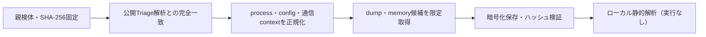

# Triage公開解析・後段取得証跡

## 完全ハッシュ一致

- [260822-b65azaea45](https://tria.ge/260822-b65azaea45): ファミリー候補 `未確定`、評価score `None`
- [260821-3shctstvdz](https://tria.ge/260821-3shctstvdz): ファミリー候補 `未確定`、評価score `None`

## プロセス・通信

- 観測process: `取得できず`
- raw commandは保存せず、command SHA-256と処理patternだけをJSONへ保持します。
- sandbox background trafficは`context_only`であり、C2へ自動昇格しません。

- 取得できませんでした。

## 後段取得物

- `6cf04eca3a13627df865ebec6251e81a52ebbeedf170830fc1f1fda0b0139ef1` / `memory_image` / 143360 bytes / 親と同一: `false` / 静的解析: `partial`
- `a019740ceba2f8e7fc53244bf85520c5dfb3ee0cc3980aa70ddd6f194d7a718c` / `memory_image` / 4091904 bytes / 親と同一: `false` / 静的解析: `partial`
- `f5546db696ee1eb7ba679a961460f9dedf3fdaebbad097f086e9b52ffcaf64ef` / `memory_image` / 143360 bytes / 親と同一: `false` / 静的解析: `partial`
- `a4cea36fdea72d86db48d8feefde055d44dfb4c900a519467fec130bdb8cfea3` / `memory_image` / 143360 bytes / 親と同一: `false` / 静的解析: `partial`

## 判定境界

Triage由来のfamily、process、config、通信は外部sandbox証跡です。Config extractorが返したendpointはC2候補として扱いますが、静的設定復元またはprocess帰属とprotocol応答が揃うまでは確認済みC2とはしません。取得成果物と検体は実行していません。
