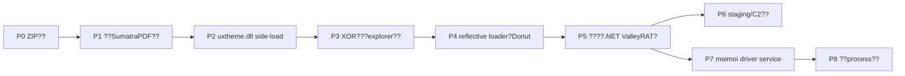
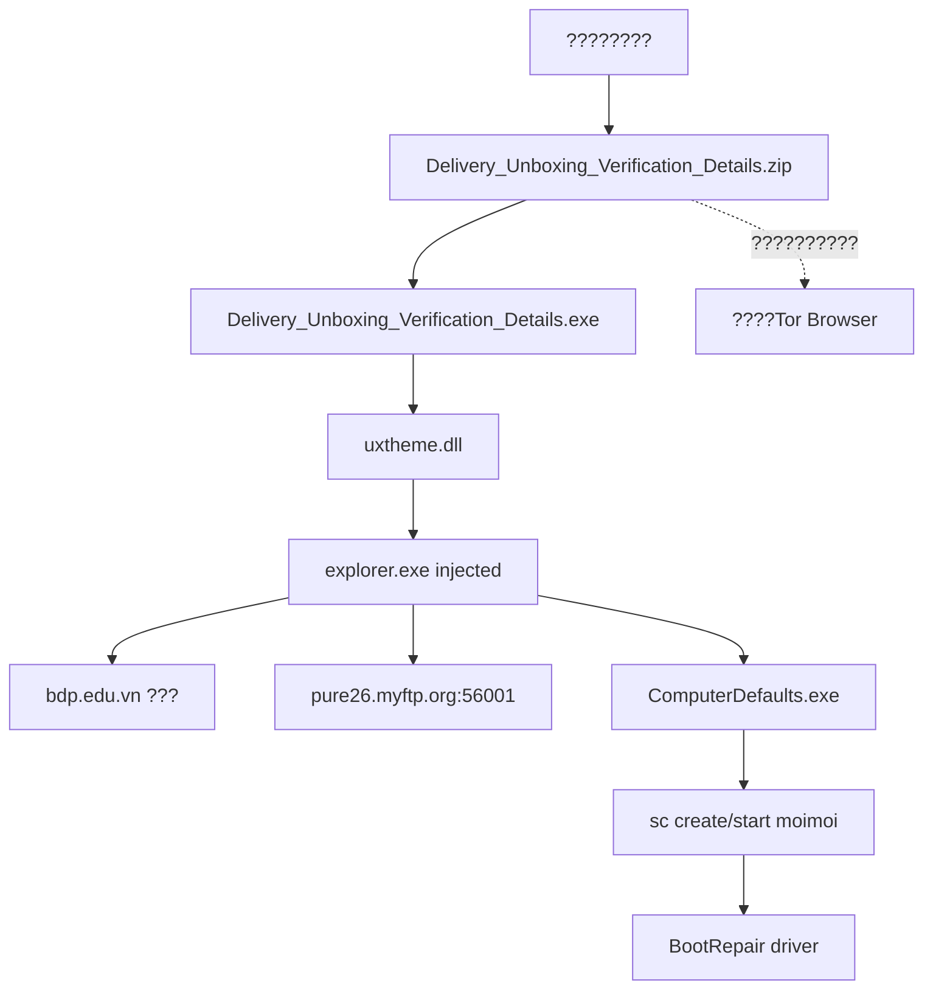
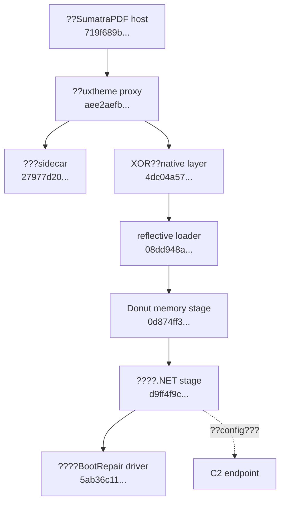

# ??????

?????phase ID??????????????????sandbox???????????????????

## ?????

## ??????

## ???????

## ?????????

`uxtheme.dll` proxy??API hash???0x3b6e0-byte XOR??suspended `explorer.exe`?Donut?279-record proxy??`BootRepair` device?IOCTL `0x222014`?`moimoi` service?????????????
