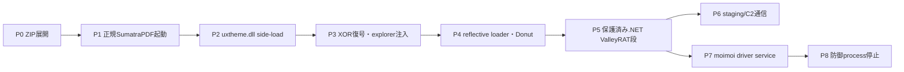
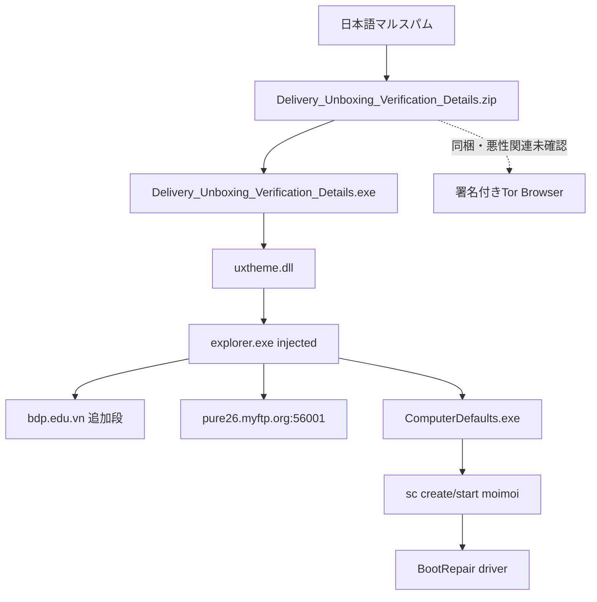
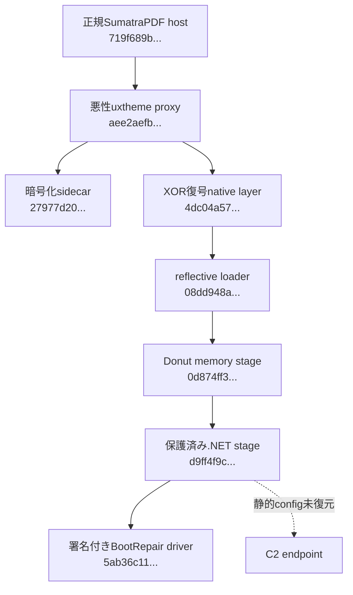

# 全体ロジック

以下は共通phase IDで整理しています。実線は検体又は既存sandboxで確認済み、破線は未観測又は推定です。

## 実行フロー

## 感染チェーン

## モジュール関係

## 比較に使える固定点

`uxtheme.dll` proxy名、API hash定数、0x3b6e0-byte XOR層、suspended `explorer.exe`、Donut、279-record proxy表、`BootRepair` device、IOCTL `0x222014`、`moimoi` serviceを同系統比較の軸とします。
