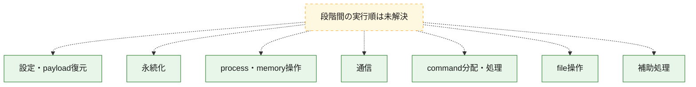
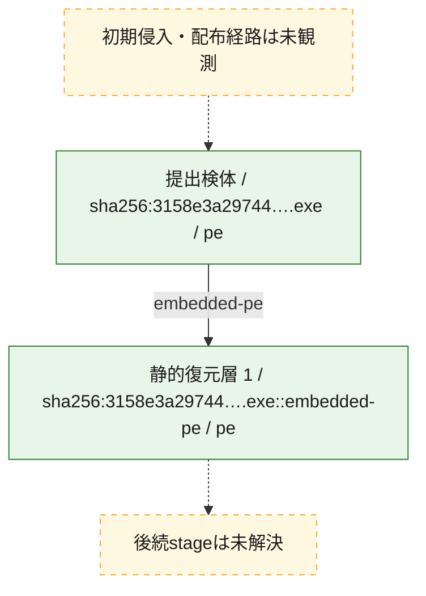
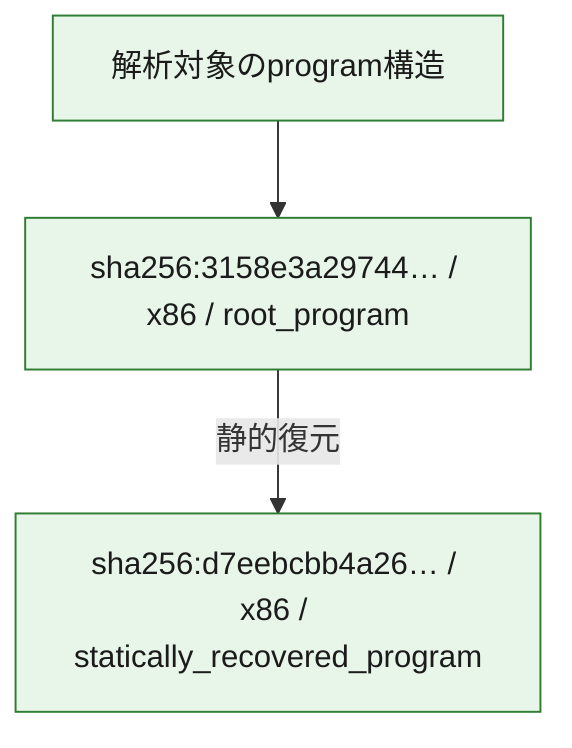

# 全体ロジック：3158e3a29744b23d21d840220a1f238e57df86959998df9ba481dcd324cc47a0

代表関数の静的証跡から、設定・payload復元、永続化、process・memory操作、通信、command分配・処理、file操作の処理群を確認しました。

## 読み方

- phaseの掲載順は解析上の整理順です。observed_call_edgesがない段階間の実行順を断定しません。
- 図の実線は静的に観測した関係、点線と黄色のノードは未観測・未解決の関係を示します。
- 図は静的な要約であり、動的実行を再現するものではありません。
- 詳細な関数解説とfingerprintは[STATIC-LOGIC.md](STATIC-LOGIC.md)を参照してください。

## 静的可視化

### 実行フロー

### 感染チェーン

### モジュール関係

## 処理段階

### 1. 設定・payload復元

設定、resource、payload、暗号化データの復元・変換を確認します。
確度: `confirmed_static_function_evidence_with_limits`

- `3158e3a29744b23d21d840220a1f238e57df86959998df9ba481dcd324cc47a0:ghidra:0041a6da` — 暗号、hash、encoding、または復号処理に関係する関数です。 状態: `limited_bad_instruction_or_flow`、選定理由: `meaningful_symbol_name`, `reviewed_call_centrality:1`, `role:cryptographic_transform`

### 2. 永続化

自動起動や永続化に関係する設定変更を確認します。
確度: `confirmed_static_function_evidence_with_limits`

- `3158e3a29744b23d21d840220a1f238e57df86959998df9ba481dcd324cc47a0:ghidra:0041a9eb` — 自動起動または永続化に関係する処理を含む関数です。 状態: `limited_bad_instruction_or_flow`、選定理由: `meaningful_symbol_name`, `reviewed_call_centrality:1`, `role:persistence`

### 3. process・memory操作

process、thread、module、memory操作と実行移行を確認します。
確度: `confirmed_static_function_evidence_with_limits`

- `3158e3a29744b23d21d840220a1f238e57df86959998df9ba481dcd324cc47a0:ghidra:0041a77e` — process、thread、module、またはmemory操作に関係する関数です。 状態: `limited_bad_instruction_or_flow`、選定理由: `meaningful_symbol_name`, `reviewed_call_centrality:1`, `role:process_or_memory_operation`
- `3158e3a29744b23d21d840220a1f238e57df86959998df9ba481dcd324cc47a0:ghidra:0041a9cd` — process、thread、module、またはmemory操作に関係する関数です。 状態: `limited_bad_instruction_or_flow`、選定理由: `meaningful_symbol_name`, `reviewed_call_centrality:1`, `role:process_or_memory_operation`

### 4. 通信

通信初期化、endpoint処理、送受信の役割を確認します。
確度: `confirmed_static_function_evidence_with_limits`

- `3158e3a29744b23d21d840220a1f238e57df86959998df9ba481dcd324cc47a0:ghidra:0041a7ba` — 通信初期化、送受信、またはendpoint処理に関係する関数です。 状態: `limited_bad_instruction_or_flow`、選定理由: `meaningful_symbol_name`, `reviewed_call_centrality:1`, `role:network_communication`
- `3158e3a29744b23d21d840220a1f238e57df86959998df9ba481dcd324cc47a0:ghidra:0041a7ec` — 通信初期化、送受信、またはendpoint処理に関係する関数です。 状態: `limited_bad_instruction_or_flow`、選定理由: `meaningful_symbol_name`, `reviewed_call_centrality:1`, `role:network_communication`

### 5. command分配・処理

受信commandやtaskの解釈、分配、個別handlerへの移行を確認します。
確度: `confirmed_static_function_evidence_with_limits`

- `3158e3a29744b23d21d840220a1f238e57df86959998df9ba481dcd324cc47a0:ghidra:0041a792` — commandの解釈、分配、または個別処理を担当する関数です。 状態: `limited_bad_instruction_or_flow`、選定理由: `meaningful_symbol_name`, `reviewed_call_centrality:1`, `role:command_dispatch_or_handler`
- `3158e3a29744b23d21d840220a1f238e57df86959998df9ba481dcd324cc47a0:ghidra:0041aa60` — commandの解釈、分配、または個別処理を担当する関数です。 状態: `limited_bad_instruction_or_flow`、選定理由: `meaningful_symbol_name`, `reviewed_call_centrality:1`, `role:command_dispatch_or_handler`

### 6. file操作

fileやdirectoryの作成、読書き、削除を確認します。
確度: `confirmed_static_function_evidence_with_limits`

- `3158e3a29744b23d21d840220a1f238e57df86959998df9ba481dcd324cc47a0:ghidra:0041a994` — fileまたはdirectoryの読書き・管理に関係する関数です。 状態: `limited_bad_instruction_or_flow`、選定理由: `meaningful_symbol_name`, `reviewed_call_centrality:1`, `role:file_operation`
- `3158e3a29744b23d21d840220a1f238e57df86959998df9ba481dcd324cc47a0:ghidra:0041a99e` — fileまたはdirectoryの読書き・管理に関係する関数です。 状態: `limited_bad_instruction_or_flow`、選定理由: `meaningful_symbol_name`, `reviewed_call_centrality:1`, `role:file_operation`
- `3158e3a29744b23d21d840220a1f238e57df86959998df9ba481dcd324cc47a0:ghidra:0041a9d7` — fileまたはdirectoryの読書き・管理に関係する関数です。 状態: `limited_bad_instruction_or_flow`、選定理由: `meaningful_symbol_name`, `reviewed_call_centrality:1`, `role:file_operation`
- `3158e3a29744b23d21d840220a1f238e57df86959998df9ba481dcd324cc47a0:ghidra:0041aa4c` — fileまたはdirectoryの読書き・管理に関係する関数です。 状態: `limited_bad_instruction_or_flow`、選定理由: `meaningful_symbol_name`, `reviewed_call_centrality:1`, `role:file_operation`
- `3158e3a29744b23d21d840220a1f238e57df86959998df9ba481dcd324cc47a0:ghidra:0041aa56` — fileまたはdirectoryの読書き・管理に関係する関数です。 状態: `limited_bad_instruction_or_flow`、選定理由: `meaningful_symbol_name`, `reviewed_call_centrality:1`, `role:file_operation`
- `3158e3a29744b23d21d840220a1f238e57df86959998df9ba481dcd324cc47a0:ghidra:0041aaad` — fileまたはdirectoryの読書き・管理に関係する関数です。 状態: `limited_bad_instruction_or_flow`、選定理由: `meaningful_symbol_name`, `reviewed_call_centrality:1`, `role:file_operation`

### 7. 補助処理

主要処理を支える一般内部関数またはlibrary処理を確認します。
確度: `confirmed_static_function_evidence_with_limits`

- `3158e3a29744b23d21d840220a1f238e57df86959998df9ba481dcd324cc47a0:ghidra:0041a6bf` — 検体内部の一般処理を実装する関数です。 状態: `limited_bad_instruction_or_flow`、選定理由: `meaningful_symbol_name`, `reviewed_call_centrality:1`
- `3158e3a29744b23d21d840220a1f238e57df86959998df9ba481dcd324cc47a0:ghidra:0041a6f5` — 検体内部の一般処理を実装する関数です。 状態: `limited_bad_instruction_or_flow`、選定理由: `meaningful_symbol_name`, `reviewed_call_centrality:1`
- `3158e3a29744b23d21d840220a1f238e57df86959998df9ba481dcd324cc47a0:ghidra:0041a710` — 検体内部の一般処理を実装する関数です。 状態: `limited_bad_instruction_or_flow`、選定理由: `meaningful_symbol_name`, `reviewed_call_centrality:1`
- `3158e3a29744b23d21d840220a1f238e57df86959998df9ba481dcd324cc47a0:ghidra:0041a71a` — 検体内部の一般処理を実装する関数です。 状態: `limited_bad_instruction_or_flow`、選定理由: `meaningful_symbol_name`, `reviewed_call_centrality:1`
- `3158e3a29744b23d21d840220a1f238e57df86959998df9ba481dcd324cc47a0:ghidra:0041a724` — 検体内部の一般処理を実装する関数です。 状態: `limited_bad_instruction_or_flow`、選定理由: `meaningful_symbol_name`, `reviewed_call_centrality:1`
- `3158e3a29744b23d21d840220a1f238e57df86959998df9ba481dcd324cc47a0:ghidra:0041a72e` — 検体内部の一般処理を実装する関数です。 状態: `limited_bad_instruction_or_flow`、選定理由: `meaningful_symbol_name`, `reviewed_call_centrality:1`
- `3158e3a29744b23d21d840220a1f238e57df86959998df9ba481dcd324cc47a0:ghidra:0041a738` — 検体内部の一般処理を実装する関数です。 状態: `limited_bad_instruction_or_flow`、選定理由: `meaningful_symbol_name`, `reviewed_call_centrality:1`
- `3158e3a29744b23d21d840220a1f238e57df86959998df9ba481dcd324cc47a0:ghidra:0041a742` — 検体内部の一般処理を実装する関数です。 状態: `limited_bad_instruction_or_flow`、選定理由: `meaningful_symbol_name`, `reviewed_call_centrality:1`
- `3158e3a29744b23d21d840220a1f238e57df86959998df9ba481dcd324cc47a0:ghidra:0041a74c` — 検体内部の一般処理を実装する関数です。 状態: `limited_bad_instruction_or_flow`、選定理由: `meaningful_symbol_name`, `reviewed_call_centrality:1`
- `3158e3a29744b23d21d840220a1f238e57df86959998df9ba481dcd324cc47a0:ghidra:0041a756` — 検体内部の一般処理を実装する関数です。 状態: `limited_bad_instruction_or_flow`、選定理由: `meaningful_symbol_name`, `reviewed_call_centrality:1`
- `3158e3a29744b23d21d840220a1f238e57df86959998df9ba481dcd324cc47a0:ghidra:0041a760` — 検体内部の一般処理を実装する関数です。 状態: `limited_bad_instruction_or_flow`、選定理由: `meaningful_symbol_name`, `reviewed_call_centrality:1`
- `3158e3a29744b23d21d840220a1f238e57df86959998df9ba481dcd324cc47a0:ghidra:0041a76a` — 検体内部の一般処理を実装する関数です。 状態: `limited_bad_instruction_or_flow`、選定理由: `meaningful_symbol_name`, `reviewed_call_centrality:1`
- `3158e3a29744b23d21d840220a1f238e57df86959998df9ba481dcd324cc47a0:ghidra:0041a774` — 検体内部の一般処理を実装する関数です。 状態: `limited_bad_instruction_or_flow`、選定理由: `meaningful_symbol_name`, `reviewed_call_centrality:1`
- `3158e3a29744b23d21d840220a1f238e57df86959998df9ba481dcd324cc47a0:ghidra:0041a788` — 検体内部の一般処理を実装する関数です。 状態: `limited_bad_instruction_or_flow`、選定理由: `meaningful_symbol_name`, `reviewed_call_centrality:1`
- `3158e3a29744b23d21d840220a1f238e57df86959998df9ba481dcd324cc47a0:ghidra:0041a79c` — 検体内部の一般処理を実装する関数です。 状態: `limited_bad_instruction_or_flow`、選定理由: `meaningful_symbol_name`, `reviewed_call_centrality:1`
- `3158e3a29744b23d21d840220a1f238e57df86959998df9ba481dcd324cc47a0:ghidra:0041a7a6` — 検体内部の一般処理を実装する関数です。 状態: `limited_bad_instruction_or_flow`、選定理由: `meaningful_symbol_name`, `reviewed_call_centrality:1`
- `3158e3a29744b23d21d840220a1f238e57df86959998df9ba481dcd324cc47a0:ghidra:0041a7b0` — 検体内部の一般処理を実装する関数です。 状態: `limited_bad_instruction_or_flow`、選定理由: `meaningful_symbol_name`, `reviewed_call_centrality:1`
- `3158e3a29744b23d21d840220a1f238e57df86959998df9ba481dcd324cc47a0:ghidra:0041a7c4` — 検体内部の一般処理を実装する関数です。 状態: `limited_bad_instruction_or_flow`、選定理由: `meaningful_symbol_name`, `reviewed_call_centrality:1`

## 観測したcall関係

- 代表関数間で直接解決できた呼出関係はありません。

## 解析範囲と制約

- 選定外関数は全体inventoryへ残しますが、関数本体の個別解説対象にはしていません。
- indirect call、難読化、packer、VM、壊れたcontrol flowによりcall関係が欠落する場合があります。
- 文書は静的解析に基づき、検体実行や外部通信による動的確認は行っていません。
