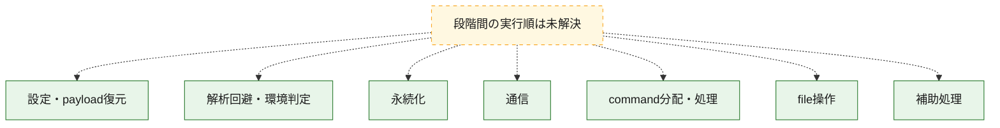

# 全体ロジック：324126d263910469357915525f2637ec1b0a2a6b875399b96c979687fed86e40

代表関数の静的証跡から、設定・payload復元、解析回避・環境判定、永続化、通信、command分配・処理、file操作の処理群を確認しました。

## 読み方

- phaseの掲載順は解析上の整理順です。observed_call_edgesがない段階間の実行順を断定しません。
- 図の実線は静的に観測した関係、点線と黄色のノードは未観測・未解決の関係を示します。
- 図は静的な要約であり、動的実行を再現するものではありません。
- 詳細な関数解説とfingerprintは[STATIC-LOGIC.md](STATIC-LOGIC.md)を参照してください。

## 静的可視化

### 実行フロー

### 感染チェーン

```mermaid
flowchart TD
  chain_initial["初期侵入・配布経路は未観測"]
  chain_01["提出検体 / sha256:324126d26391….exe / pe"]
  chain_02["静的復元層 1 / sha256:324126d26391….exe::embedded-pe / pe"]
  chain_03["静的復元層 1 / sha256:324126d26391….exe::embedded-pe / pe"]
  chain_04["静的復元層 1 / sha256:324126d26391….exe::embedded-pe / pe"]
  chain_05["静的復元層 1 / sha256:324126d26391….exe::embedded-pe / pe"]
  chain_06["静的復元層 1 / sha256:324126d26391….exe::embedded-pe / pe"]
  chain_07["静的復元層 1 / sha256:324126d26391….exe::embedded-pe / pe"]
  chain_08["静的復元層 1 / sha256:324126d26391….exe::embedded-pe / pe"]
  chain_09["静的復元層 1 / sha256:324126d26391….exe::embedded-pe / pe"]
  chain_10["静的復元層 1 / sha256:324126d26391….exe::embedded-pe / pe"]
  chain_11["静的復元層 1 / sha256:324126d26391….exe::embedded-pe / pe"]
  chain_12["静的復元層 1 / sha256:324126d26391….exe::embedded-pe / pe"]
  chain_13["静的復元層 1 / sha256:324126d26391….exe::embedded-pe / pe"]
  chain_14["静的復元層 1 / sha256:324126d26391….exe::embedded-pe / pe"]
  chain_15["静的復元層 1 / sha256:324126d26391….exe::embedded-pe / pe"]
  chain_16["静的復元層 1 / sha256:324126d26391….exe::embedded-pe / pe"]
  chain_01 -->|embedded-pe| chain_02
  chain_01 -->|embedded-pe| chain_03
  chain_01 -->|embedded-pe| chain_04
  chain_01 -->|embedded-pe| chain_05
  chain_01 -->|embedded-pe| chain_06
  chain_01 -->|embedded-pe| chain_07
  chain_01 -->|embedded-pe| chain_08
  chain_01 -->|embedded-pe| chain_09
  chain_01 -->|embedded-pe| chain_10
  chain_01 -->|embedded-pe| chain_11
  chain_01 -->|embedded-pe| chain_12
  chain_01 -->|embedded-pe| chain_13
  chain_01 -->|embedded-pe| chain_14
  chain_01 -->|embedded-pe| chain_15
  chain_01 -->|embedded-pe| chain_16
  chain_initial -.-> chain_01
  chain_more["その他1層はstatic-layers.jsonを参照"]
  chain_02 -.-> chain_more
  chain_03 -.-> chain_more
  chain_04 -.-> chain_more
  chain_05 -.-> chain_more
  chain_06 -.-> chain_more
  chain_07 -.-> chain_more
  chain_08 -.-> chain_more
  chain_09 -.-> chain_more
  chain_10 -.-> chain_more
  chain_11 -.-> chain_more
  chain_12 -.-> chain_more
  chain_13 -.-> chain_more
  chain_14 -.-> chain_more
  chain_15 -.-> chain_more
  chain_16 -.-> chain_more
  class chain_more unresolved
  class chain_01,chain_02,chain_03,chain_04,chain_05,chain_06,chain_07,chain_08,chain_09,chain_10,chain_11,chain_12,chain_13,chain_14,chain_15,chain_16 confirmed
  class chain_initial unresolved
  classDef confirmed fill:#e8f5e9,stroke:#2e7d32,color:#1b1b1b
  classDef unresolved fill:#fff8e1,stroke:#f9a825,color:#1b1b1b,stroke-dasharray:5 5
```

### モジュール関係

```mermaid
flowchart TD
  module_scope["解析対象のprogram構造"]
  module_01["sha256:63e1985a37d5… / x86 / statically_recovered_program"]
  module_02["sha256:c76269c61784… / x86 / statically_recovered_program"]
  module_03["sha256:5e32c21ac953… / x86 / statically_recovered_program"]
  module_04["sha256:e5d6e73a22f7… / x86 / statically_recovered_program"]
  module_05["sha256:92993314aba2… / x86 / statically_recovered_program"]
  module_06["sha256:87c42ca15547… / x86 / statically_recovered_program"]
  module_07["sha256:7940f7fb1206… / x86 / statically_recovered_program"]
  module_08["sha256:f0cda2a0cf1f… / x86 / statically_recovered_program"]
  module_09["sha256:bd6ebcf35aff… / x86 / statically_recovered_program"]
  module_10["sha256:f7b62920f0eb… / x86 / statically_recovered_program"]
  module_11["sha256:86e39b5995af… / x86 / statically_recovered_program"]
  module_12["sha256:a2ac851f3506… / x86 / statically_recovered_program"]
  module_parent_unknown["復元元・親moduleは未特定"]
  module_parent_unknown -.-> module_01
  module_parent_unknown -.-> module_02
  module_parent_unknown -.-> module_03
  module_parent_unknown -.-> module_04
  module_parent_unknown -.-> module_05
  module_parent_unknown -.-> module_06
  module_parent_unknown -.-> module_07
  module_parent_unknown -.-> module_08
  module_parent_unknown -.-> module_09
  module_parent_unknown -.-> module_10
  module_parent_unknown -.-> module_11
  module_parent_unknown -.-> module_12
  class module_parent_unknown unresolved
  module_more["その他5moduleはstatic-logic.jsonを参照"]
  module_scope -.-> module_more
  class module_more unresolved
  class module_scope confirmed
  class module_01,module_02,module_03,module_04,module_05,module_06,module_07,module_08,module_09,module_10,module_11,module_12 confirmed
  classDef confirmed fill:#e8f5e9,stroke:#2e7d32,color:#1b1b1b
  classDef unresolved fill:#fff8e1,stroke:#f9a825,color:#1b1b1b,stroke-dasharray:5 5
```

## 処理段階

### 1. 設定・payload復元

設定、resource、payload、暗号化データの復元・変換を確認します。
確度: `confirmed_static_function_evidence_with_limits`

- `63e1985a37d5993d170373bc28d067c13c1541ca2b63968b82e35eaacd927b49:ghidra:7c63b577` — 暗号、hash、encoding、または復号処理に関係する関数です。 状態: `limited_bad_instruction_or_flow`、選定理由: `meaningful_symbol_name`, `reviewed_call_centrality:1`, `role:cryptographic_transform`
- `63e1985a37d5993d170373bc28d067c13c1541ca2b63968b82e35eaacd927b49:ghidra:7c63b581` — 暗号、hash、encoding、または復号処理に関係する関数です。 状態: `limited_bad_instruction_or_flow`、選定理由: `meaningful_symbol_name`, `reviewed_call_centrality:1`, `role:cryptographic_transform`
- `63e1985a37d5993d170373bc28d067c13c1541ca2b63968b82e35eaacd927b49:ghidra:7c63b595` — 暗号、hash、encoding、または復号処理に関係する関数です。 状態: `limited_bad_instruction_or_flow`、選定理由: `meaningful_symbol_name`, `reviewed_call_centrality:1`, `role:cryptographic_transform`
- `f0cda2a0cf1fe6fbbf579b9098462329d3aaa7513a207af2e0f33b01456e388a:ghidra:1000b370` — 暗号、hash、encoding、または復号処理に関係する関数です。 状態: `succeeded`、選定理由: `entry_point`, `meaningful_symbol_name`, `reviewed_call_centrality:2`, `role:cryptographic_transform`
- `f0cda2a0cf1fe6fbbf579b9098462329d3aaa7513a207af2e0f33b01456e388a:ghidra:1000b380` — 暗号、hash、encoding、または復号処理に関係する関数です。 状態: `succeeded`、選定理由: `entry_point`, `meaningful_symbol_name`, `reviewed_call_centrality:2`, `role:cryptographic_transform`
- `bd6ebcf35aff1b8ca99f474d90bdb1841cd672eda91b2882defef369f18f3c4d:ghidra:1000e4e0` — 暗号、hash、encoding、または復号処理に関係する関数です。 状態: `succeeded`、選定理由: `entry_point`, `meaningful_symbol_name`, `reviewed_call_centrality:2`, `role:cryptographic_transform`
- `bd6ebcf35aff1b8ca99f474d90bdb1841cd672eda91b2882defef369f18f3c4d:ghidra:1000e500` — 暗号、hash、encoding、または復号処理に関係する関数です。 状態: `succeeded`、選定理由: `entry_point`, `meaningful_symbol_name`, `reviewed_call_centrality:2`, `role:cryptographic_transform`
- `c2d0e285e2333a9c620be04a5747881af0d5615da32226886e659ff31a9761cc:ghidra:10257744` — 暗号、hash、encoding、または復号処理に関係する関数です。 状態: `limited_bad_instruction_or_flow`、選定理由: `meaningful_symbol_name`, `reviewed_call_centrality:1`, `role:cryptographic_transform`
- `c2d0e285e2333a9c620be04a5747881af0d5615da32226886e659ff31a9761cc:ghidra:102577b9` — 暗号、hash、encoding、または復号処理に関係する関数です。 状態: `limited_bad_instruction_or_flow`、選定理由: `meaningful_symbol_name`, `reviewed_call_centrality:1`, `role:cryptographic_transform`

### 2. 解析回避・環境判定

debugger、sandbox、仮想環境、時間差などの判定を確認します。
確度: `confirmed_static_function_evidence_with_limits`

- `63e1985a37d5993d170373bc28d067c13c1541ca2b63968b82e35eaacd927b49:ghidra:7c63b646` — debugger、仮想環境、sandbox、または時間差の確認に関係する関数です。 状態: `limited_bad_instruction_or_flow`、選定理由: `meaningful_symbol_name`, `reviewed_call_centrality:1`, `role:anti_analysis`

### 3. 永続化

自動起動や永続化に関係する設定変更を確認します。
確度: `confirmed_static_function_evidence_with_limits`

- `63e1985a37d5993d170373bc28d067c13c1541ca2b63968b82e35eaacd927b49:ghidra:7c63b701` — 自動起動または永続化に関係する処理を含む関数です。 状態: `limited_bad_instruction_or_flow`、選定理由: `meaningful_symbol_name`, `reviewed_call_centrality:1`, `role:persistence`
- `a2ac851f35066c2f13a7452b7a9a3fee05bfb42907ae77a6b85b212a2227fc36:ghidra:783a67a2` — 自動起動または永続化に関係する処理を含む関数です。 状態: `limited_bad_instruction_or_flow`、選定理由: `meaningful_symbol_name`, `reviewed_call_centrality:1`, `role:persistence`
- `a2ac851f35066c2f13a7452b7a9a3fee05bfb42907ae77a6b85b212a2227fc36:ghidra:783a67b6` — 自動起動または永続化に関係する処理を含む関数です。 状態: `limited_bad_instruction_or_flow`、選定理由: `meaningful_symbol_name`, `reviewed_call_centrality:1`, `role:persistence`
- `c2d0e285e2333a9c620be04a5747881af0d5615da32226886e659ff31a9761cc:ghidra:10258003` — 自動起動または永続化に関係する処理を含む関数です。 状態: `limited_bad_instruction_or_flow`、選定理由: `meaningful_symbol_name`, `reviewed_call_centrality:1`, `role:persistence`

### 4. 通信

通信初期化、endpoint処理、送受信の役割を確認します。
確度: `confirmed_static_function_evidence_with_limits`

- `63e1985a37d5993d170373bc28d067c13c1541ca2b63968b82e35eaacd927b49:ghidra:7c63b7d0` — 通信初期化、送受信、またはendpoint処理に関係する関数です。 状態: `limited_bad_instruction_or_flow`、選定理由: `meaningful_symbol_name`, `reviewed_call_centrality:1`, `role:network_communication`
- `a2ac851f35066c2f13a7452b7a9a3fee05bfb42907ae77a6b85b212a2227fc36:ghidra:783a6ac9` — 通信初期化、送受信、またはendpoint処理に関係する関数です。 状態: `limited_bad_instruction_or_flow`、選定理由: `meaningful_symbol_name`, `reviewed_call_centrality:1`, `role:network_communication`
- `a2ac851f35066c2f13a7452b7a9a3fee05bfb42907ae77a6b85b212a2227fc36:ghidra:783a6d71` — 通信初期化、送受信、またはendpoint処理に関係する関数です。 状態: `limited_bad_instruction_or_flow`、選定理由: `meaningful_symbol_name`, `reviewed_call_centrality:1`, `role:network_communication`
- `a2ac851f35066c2f13a7452b7a9a3fee05bfb42907ae77a6b85b212a2227fc36:ghidra:783a6d8c` — 通信初期化、送受信、またはendpoint処理に関係する関数です。 状態: `limited_bad_instruction_or_flow`、選定理由: `meaningful_symbol_name`, `reviewed_call_centrality:1`, `role:network_communication`
- `a2ac851f35066c2f13a7452b7a9a3fee05bfb42907ae77a6b85b212a2227fc36:ghidra:783a6d96` — 通信初期化、送受信、またはendpoint処理に関係する関数です。 状態: `limited_bad_instruction_or_flow`、選定理由: `meaningful_symbol_name`, `reviewed_call_centrality:1`, `role:network_communication`
- `a2ac851f35066c2f13a7452b7a9a3fee05bfb42907ae77a6b85b212a2227fc36:ghidra:783a6da0` — 通信初期化、送受信、またはendpoint処理に関係する関数です。 状態: `limited_bad_instruction_or_flow`、選定理由: `meaningful_symbol_name`, `reviewed_call_centrality:1`, `role:network_communication`
- `a2ac851f35066c2f13a7452b7a9a3fee05bfb42907ae77a6b85b212a2227fc36:ghidra:783a6daa` — 通信初期化、送受信、またはendpoint処理に関係する関数です。 状態: `limited_bad_instruction_or_flow`、選定理由: `meaningful_symbol_name`, `reviewed_call_centrality:1`, `role:network_communication`
- `a2ac851f35066c2f13a7452b7a9a3fee05bfb42907ae77a6b85b212a2227fc36:ghidra:783a6db4` — 通信初期化、送受信、またはendpoint処理に関係する関数です。 状態: `limited_bad_instruction_or_flow`、選定理由: `meaningful_symbol_name`, `reviewed_call_centrality:1`, `role:network_communication`
- `a2ac851f35066c2f13a7452b7a9a3fee05bfb42907ae77a6b85b212a2227fc36:ghidra:783a6dbe` — 通信初期化、送受信、またはendpoint処理に関係する関数です。 状態: `limited_bad_instruction_or_flow`、選定理由: `meaningful_symbol_name`, `reviewed_call_centrality:1`, `role:network_communication`
- `a2ac851f35066c2f13a7452b7a9a3fee05bfb42907ae77a6b85b212a2227fc36:ghidra:783a6dc8` — 通信初期化、送受信、またはendpoint処理に関係する関数です。 状態: `limited_bad_instruction_or_flow`、選定理由: `meaningful_symbol_name`, `reviewed_call_centrality:1`, `role:network_communication`
- `a2ac851f35066c2f13a7452b7a9a3fee05bfb42907ae77a6b85b212a2227fc36:ghidra:783a6dd2` — 通信初期化、送受信、またはendpoint処理に関係する関数です。 状態: `limited_bad_instruction_or_flow`、選定理由: `meaningful_symbol_name`, `reviewed_call_centrality:1`, `role:network_communication`
- `a2ac851f35066c2f13a7452b7a9a3fee05bfb42907ae77a6b85b212a2227fc36:ghidra:783a6ddc` — 通信初期化、送受信、またはendpoint処理に関係する関数です。 状態: `limited_bad_instruction_or_flow`、選定理由: `meaningful_symbol_name`, `reviewed_call_centrality:1`, `role:network_communication`
- `a2ac851f35066c2f13a7452b7a9a3fee05bfb42907ae77a6b85b212a2227fc36:ghidra:783a6de6` — 通信初期化、送受信、またはendpoint処理に関係する関数です。 状態: `limited_bad_instruction_or_flow`、選定理由: `meaningful_symbol_name`, `reviewed_call_centrality:1`, `role:network_communication`
- `c2d0e285e2333a9c620be04a5747881af0d5615da32226886e659ff31a9761cc:ghidra:102577e1` — 通信初期化、送受信、またはendpoint処理に関係する関数です。 状態: `limited_bad_instruction_or_flow`、選定理由: `meaningful_symbol_name`, `reviewed_call_centrality:1`, `role:network_communication`
- `c2d0e285e2333a9c620be04a5747881af0d5615da32226886e659ff31a9761cc:ghidra:102577fc` — 通信初期化、送受信、またはendpoint処理に関係する関数です。 状態: `limited_bad_instruction_or_flow`、選定理由: `meaningful_symbol_name`, `reviewed_call_centrality:1`, `role:network_communication`
- `c2d0e285e2333a9c620be04a5747881af0d5615da32226886e659ff31a9761cc:ghidra:10257806` — 通信初期化、送受信、またはendpoint処理に関係する関数です。 状態: `limited_bad_instruction_or_flow`、選定理由: `meaningful_symbol_name`, `reviewed_call_centrality:1`, `role:network_communication`
- `c2d0e285e2333a9c620be04a5747881af0d5615da32226886e659ff31a9761cc:ghidra:10257810` — 通信初期化、送受信、またはendpoint処理に関係する関数です。 状態: `limited_bad_instruction_or_flow`、選定理由: `meaningful_symbol_name`, `reviewed_call_centrality:1`, `role:network_communication`
- `c2d0e285e2333a9c620be04a5747881af0d5615da32226886e659ff31a9761cc:ghidra:1025781a` — 通信初期化、送受信、またはendpoint処理に関係する関数です。 状態: `limited_bad_instruction_or_flow`、選定理由: `meaningful_symbol_name`, `reviewed_call_centrality:1`, `role:network_communication`
- `c2d0e285e2333a9c620be04a5747881af0d5615da32226886e659ff31a9761cc:ghidra:10257824` — 通信初期化、送受信、またはendpoint処理に関係する関数です。 状態: `limited_bad_instruction_or_flow`、選定理由: `meaningful_symbol_name`, `reviewed_call_centrality:1`, `role:network_communication`
- `c2d0e285e2333a9c620be04a5747881af0d5615da32226886e659ff31a9761cc:ghidra:1025782e` — 通信初期化、送受信、またはendpoint処理に関係する関数です。 状態: `limited_bad_instruction_or_flow`、選定理由: `meaningful_symbol_name`, `reviewed_call_centrality:1`, `role:network_communication`
- `c2d0e285e2333a9c620be04a5747881af0d5615da32226886e659ff31a9761cc:ghidra:10257838` — 通信初期化、送受信、またはendpoint処理に関係する関数です。 状態: `limited_bad_instruction_or_flow`、選定理由: `meaningful_symbol_name`, `reviewed_call_centrality:1`, `role:network_communication`
- `c2d0e285e2333a9c620be04a5747881af0d5615da32226886e659ff31a9761cc:ghidra:10257842` — 通信初期化、送受信、またはendpoint処理に関係する関数です。 状態: `limited_bad_instruction_or_flow`、選定理由: `meaningful_symbol_name`, `reviewed_call_centrality:1`, `role:network_communication`
- `c2d0e285e2333a9c620be04a5747881af0d5615da32226886e659ff31a9761cc:ghidra:1025784c` — 通信初期化、送受信、またはendpoint処理に関係する関数です。 状態: `limited_bad_instruction_or_flow`、選定理由: `meaningful_symbol_name`, `reviewed_call_centrality:1`, `role:network_communication`
- `c2d0e285e2333a9c620be04a5747881af0d5615da32226886e659ff31a9761cc:ghidra:10257856` — 通信初期化、送受信、またはendpoint処理に関係する関数です。 状態: `limited_bad_instruction_or_flow`、選定理由: `meaningful_symbol_name`, `reviewed_call_centrality:1`, `role:network_communication`
- `c2d0e285e2333a9c620be04a5747881af0d5615da32226886e659ff31a9761cc:ghidra:10257860` — 通信初期化、送受信、またはendpoint処理に関係する関数です。 状態: `limited_bad_instruction_or_flow`、選定理由: `meaningful_symbol_name`, `reviewed_call_centrality:1`, `role:network_communication`
- `c2d0e285e2333a9c620be04a5747881af0d5615da32226886e659ff31a9761cc:ghidra:1025786a` — 通信初期化、送受信、またはendpoint処理に関係する関数です。 状態: `limited_bad_instruction_or_flow`、選定理由: `meaningful_symbol_name`, `reviewed_call_centrality:1`, `role:network_communication`
- `c2d0e285e2333a9c620be04a5747881af0d5615da32226886e659ff31a9761cc:ghidra:10257874` — 通信初期化、送受信、またはendpoint処理に関係する関数です。 状態: `limited_bad_instruction_or_flow`、選定理由: `meaningful_symbol_name`, `reviewed_call_centrality:1`, `role:network_communication`
- `c2d0e285e2333a9c620be04a5747881af0d5615da32226886e659ff31a9761cc:ghidra:1025787e` — 通信初期化、送受信、またはendpoint処理に関係する関数です。 状態: `limited_bad_instruction_or_flow`、選定理由: `meaningful_symbol_name`, `reviewed_call_centrality:1`, `role:network_communication`
- `c2d0e285e2333a9c620be04a5747881af0d5615da32226886e659ff31a9761cc:ghidra:10257888` — 通信初期化、送受信、またはendpoint処理に関係する関数です。 状態: `limited_bad_instruction_or_flow`、選定理由: `meaningful_symbol_name`, `reviewed_call_centrality:1`, `role:network_communication`
- `c2d0e285e2333a9c620be04a5747881af0d5615da32226886e659ff31a9761cc:ghidra:10257892` — 通信初期化、送受信、またはendpoint処理に関係する関数です。 状態: `limited_bad_instruction_or_flow`、選定理由: `meaningful_symbol_name`, `reviewed_call_centrality:1`, `role:network_communication`
- `c2d0e285e2333a9c620be04a5747881af0d5615da32226886e659ff31a9761cc:ghidra:1025789c` — 通信初期化、送受信、またはendpoint処理に関係する関数です。 状態: `limited_bad_instruction_or_flow`、選定理由: `meaningful_symbol_name`, `reviewed_call_centrality:1`, `role:network_communication`
- `c2d0e285e2333a9c620be04a5747881af0d5615da32226886e659ff31a9761cc:ghidra:102578a6` — 通信初期化、送受信、またはendpoint処理に関係する関数です。 状態: `limited_bad_instruction_or_flow`、選定理由: `meaningful_symbol_name`, `reviewed_call_centrality:1`, `role:network_communication`
- `c2d0e285e2333a9c620be04a5747881af0d5615da32226886e659ff31a9761cc:ghidra:102578b0` — 通信初期化、送受信、またはendpoint処理に関係する関数です。 状態: `limited_bad_instruction_or_flow`、選定理由: `meaningful_symbol_name`, `reviewed_call_centrality:1`, `role:network_communication`
- `c2d0e285e2333a9c620be04a5747881af0d5615da32226886e659ff31a9761cc:ghidra:102578ba` — 通信初期化、送受信、またはendpoint処理に関係する関数です。 状態: `limited_bad_instruction_or_flow`、選定理由: `meaningful_symbol_name`, `reviewed_call_centrality:1`, `role:network_communication`
- `c2d0e285e2333a9c620be04a5747881af0d5615da32226886e659ff31a9761cc:ghidra:102578c4` — 通信初期化、送受信、またはendpoint処理に関係する関数です。 状態: `limited_bad_instruction_or_flow`、選定理由: `meaningful_symbol_name`, `reviewed_call_centrality:1`, `role:network_communication`
- `c2d0e285e2333a9c620be04a5747881af0d5615da32226886e659ff31a9761cc:ghidra:102578ce` — 通信初期化、送受信、またはendpoint処理に関係する関数です。 状態: `limited_bad_instruction_or_flow`、選定理由: `meaningful_symbol_name`, `reviewed_call_centrality:1`, `role:network_communication`

### 5. command分配・処理

受信commandやtaskの解釈、分配、個別handlerへの移行を確認します。
確度: `confirmed_static_function_evidence_with_limits`

- `63e1985a37d5993d170373bc28d067c13c1541ca2b63968b82e35eaacd927b49:ghidra:7c63b53b` — commandの解釈、分配、または個別処理を担当する関数です。 状態: `limited_bad_instruction_or_flow`、選定理由: `meaningful_symbol_name`, `reviewed_call_centrality:1`, `role:command_dispatch_or_handler`
- `63e1985a37d5993d170373bc28d067c13c1541ca2b63968b82e35eaacd927b49:ghidra:7c63b545` — commandの解釈、分配、または個別処理を担当する関数です。 状態: `limited_bad_instruction_or_flow`、選定理由: `meaningful_symbol_name`, `reviewed_call_centrality:1`, `role:command_dispatch_or_handler`
- `63e1985a37d5993d170373bc28d067c13c1541ca2b63968b82e35eaacd927b49:ghidra:7c63b54f` — commandの解釈、分配、または個別処理を担当する関数です。 状態: `limited_bad_instruction_or_flow`、選定理由: `meaningful_symbol_name`, `reviewed_call_centrality:1`, `role:command_dispatch_or_handler`
- `63e1985a37d5993d170373bc28d067c13c1541ca2b63968b82e35eaacd927b49:ghidra:7c63b776` — commandの解釈、分配、または個別処理を担当する関数です。 状態: `limited_bad_instruction_or_flow`、選定理由: `meaningful_symbol_name`, `reviewed_call_centrality:1`, `role:command_dispatch_or_handler`
- `63e1985a37d5993d170373bc28d067c13c1541ca2b63968b82e35eaacd927b49:ghidra:7c63b780` — commandの解釈、分配、または個別処理を担当する関数です。 状態: `limited_bad_instruction_or_flow`、選定理由: `meaningful_symbol_name`, `reviewed_call_centrality:1`, `role:command_dispatch_or_handler`
- `f0cda2a0cf1fe6fbbf579b9098462329d3aaa7513a207af2e0f33b01456e388a:ghidra:1000a390` — commandの解釈、分配、または個別処理を担当する関数です。 状態: `succeeded`、選定理由: `entry_point`, `meaningful_symbol_name`, `reviewed_call_centrality:3`, `role:command_dispatch_or_handler`
- `f0cda2a0cf1fe6fbbf579b9098462329d3aaa7513a207af2e0f33b01456e388a:ghidra:1001cc20` — commandの解釈、分配、または個別処理を担当する関数です。 状態: `succeeded`、選定理由: `entry_point`, `meaningful_symbol_name`, `reviewed_call_centrality:5`, `role:command_dispatch_or_handler`
- `a2ac851f35066c2f13a7452b7a9a3fee05bfb42907ae77a6b85b212a2227fc36:ghidra:783a6867` — commandの解釈、分配、または個別処理を担当する関数です。 状態: `limited_bad_instruction_or_flow`、選定理由: `meaningful_symbol_name`, `reviewed_call_centrality:1`, `role:command_dispatch_or_handler`
- `a2ac851f35066c2f13a7452b7a9a3fee05bfb42907ae77a6b85b212a2227fc36:ghidra:783a69ed` — commandの解釈、分配、または個別処理を担当する関数です。 状態: `limited_bad_instruction_or_flow`、選定理由: `meaningful_symbol_name`, `reviewed_call_centrality:1`, `role:command_dispatch_or_handler`
- `c2d0e285e2333a9c620be04a5747881af0d5615da32226886e659ff31a9761cc:ghidra:1025775f` — commandの解釈、分配、または個別処理を担当する関数です。 状態: `limited_bad_instruction_or_flow`、選定理由: `meaningful_symbol_name`, `reviewed_call_centrality:1`, `role:command_dispatch_or_handler`
- `c2d0e285e2333a9c620be04a5747881af0d5615da32226886e659ff31a9761cc:ghidra:10257769` — commandの解釈、分配、または個別処理を担当する関数です。 状態: `limited_bad_instruction_or_flow`、選定理由: `meaningful_symbol_name`, `reviewed_call_centrality:1`, `role:command_dispatch_or_handler`

### 6. file操作

fileやdirectoryの作成、読書き、削除を確認します。
確度: `confirmed_static_function_evidence_with_limits`

- `63e1985a37d5993d170373bc28d067c13c1541ca2b63968b82e35eaacd927b49:ghidra:7c63b559` — fileまたはdirectoryの読書き・管理に関係する関数です。 状態: `limited_bad_instruction_or_flow`、選定理由: `meaningful_symbol_name`, `reviewed_call_centrality:1`, `role:file_operation`
- `63e1985a37d5993d170373bc28d067c13c1541ca2b63968b82e35eaacd927b49:ghidra:7c63b58b` — fileまたはdirectoryの読書き・管理に関係する関数です。 状態: `limited_bad_instruction_or_flow`、選定理由: `meaningful_symbol_name`, `reviewed_call_centrality:1`, `role:file_operation`
- `63e1985a37d5993d170373bc28d067c13c1541ca2b63968b82e35eaacd927b49:ghidra:7c63b5a9` — fileまたはdirectoryの読書き・管理に関係する関数です。 状態: `limited_bad_instruction_or_flow`、選定理由: `meaningful_symbol_name`, `reviewed_call_centrality:1`, `role:file_operation`
- `f0cda2a0cf1fe6fbbf579b9098462329d3aaa7513a207af2e0f33b01456e388a:ghidra:1000bec0` — fileまたはdirectoryの読書き・管理に関係する関数です。 状態: `succeeded`、選定理由: `entry_point`, `meaningful_symbol_name`, `reviewed_call_centrality:9`, `role:file_operation`
- `f0cda2a0cf1fe6fbbf579b9098462329d3aaa7513a207af2e0f33b01456e388a:ghidra:1000c0b0` — fileまたはdirectoryの読書き・管理に関係する関数です。 状態: `succeeded`、選定理由: `entry_point`, `meaningful_symbol_name`, `reviewed_call_centrality:4`, `role:file_operation`
- `f0cda2a0cf1fe6fbbf579b9098462329d3aaa7513a207af2e0f33b01456e388a:ghidra:1000da50` — fileまたはdirectoryの読書き・管理に関係する関数です。 状態: `succeeded`、選定理由: `entry_point`, `meaningful_symbol_name`, `reviewed_call_centrality:1`, `role:file_operation`
- `f0cda2a0cf1fe6fbbf579b9098462329d3aaa7513a207af2e0f33b01456e388a:ghidra:1000da70` — fileまたはdirectoryの読書き・管理に関係する関数です。 状態: `succeeded`、選定理由: `entry_point`, `meaningful_symbol_name`, `reviewed_call_centrality:3`, `role:file_operation`
- `f0cda2a0cf1fe6fbbf579b9098462329d3aaa7513a207af2e0f33b01456e388a:ghidra:1000e020` — fileまたはdirectoryの読書き・管理に関係する関数です。 状態: `succeeded`、選定理由: `entry_point`, `meaningful_symbol_name`, `reviewed_call_centrality:2`, `role:file_operation`
- `f0cda2a0cf1fe6fbbf579b9098462329d3aaa7513a207af2e0f33b01456e388a:ghidra:1000f4d0` — fileまたはdirectoryの読書き・管理に関係する関数です。 状態: `succeeded`、選定理由: `entry_point`, `meaningful_symbol_name`, `reviewed_call_centrality:1`, `role:file_operation`
- `f0cda2a0cf1fe6fbbf579b9098462329d3aaa7513a207af2e0f33b01456e388a:ghidra:1000f4f0` — fileまたはdirectoryの読書き・管理に関係する関数です。 状態: `succeeded`、選定理由: `entry_point`, `meaningful_symbol_name`, `reviewed_call_centrality:1`, `role:file_operation`
- `f0cda2a0cf1fe6fbbf579b9098462329d3aaa7513a207af2e0f33b01456e388a:ghidra:1000f500` — fileまたはdirectoryの読書き・管理に関係する関数です。 状態: `succeeded`、選定理由: `entry_point`, `meaningful_symbol_name`, `reviewed_call_centrality:1`, `role:file_operation`
- `f0cda2a0cf1fe6fbbf579b9098462329d3aaa7513a207af2e0f33b01456e388a:ghidra:1000f610` — fileまたはdirectoryの読書き・管理に関係する関数です。 状態: `succeeded`、選定理由: `entry_point`, `meaningful_symbol_name`, `reviewed_call_centrality:1`, `role:file_operation`
- `f0cda2a0cf1fe6fbbf579b9098462329d3aaa7513a207af2e0f33b01456e388a:ghidra:1000f640` — fileまたはdirectoryの読書き・管理に関係する関数です。 状態: `succeeded`、選定理由: `entry_point`, `meaningful_symbol_name`, `reviewed_call_centrality:1`, `role:file_operation`
- `f0cda2a0cf1fe6fbbf579b9098462329d3aaa7513a207af2e0f33b01456e388a:ghidra:1000f850` — fileまたはdirectoryの読書き・管理に関係する関数です。 状態: `succeeded`、選定理由: `entry_point`, `meaningful_symbol_name`, `reviewed_call_centrality:1`, `role:file_operation`
- `f0cda2a0cf1fe6fbbf579b9098462329d3aaa7513a207af2e0f33b01456e388a:ghidra:1000f870` — fileまたはdirectoryの読書き・管理に関係する関数です。 状態: `succeeded`、選定理由: `entry_point`, `meaningful_symbol_name`, `reviewed_call_centrality:1`, `role:file_operation`
- `f0cda2a0cf1fe6fbbf579b9098462329d3aaa7513a207af2e0f33b01456e388a:ghidra:10010f00` — fileまたはdirectoryの読書き・管理に関係する関数です。 状態: `succeeded`、選定理由: `entry_point`, `meaningful_symbol_name`, `reviewed_call_centrality:1`, `role:file_operation`
- `f0cda2a0cf1fe6fbbf579b9098462329d3aaa7513a207af2e0f33b01456e388a:ghidra:10010f10` — fileまたはdirectoryの読書き・管理に関係する関数です。 状態: `succeeded`、選定理由: `entry_point`, `meaningful_symbol_name`, `reviewed_call_centrality:1`, `role:file_operation`
- `f0cda2a0cf1fe6fbbf579b9098462329d3aaa7513a207af2e0f33b01456e388a:ghidra:10010f50` — fileまたはdirectoryの読書き・管理に関係する関数です。 状態: `succeeded`、選定理由: `entry_point`, `meaningful_symbol_name`, `reviewed_call_centrality:1`, `role:file_operation`
- `f0cda2a0cf1fe6fbbf579b9098462329d3aaa7513a207af2e0f33b01456e388a:ghidra:10011090` — fileまたはdirectoryの読書き・管理に関係する関数です。 状態: `succeeded`、選定理由: `entry_point`, `meaningful_symbol_name`, `reviewed_call_centrality:1`, `role:file_operation`
- `f0cda2a0cf1fe6fbbf579b9098462329d3aaa7513a207af2e0f33b01456e388a:ghidra:100110a0` — fileまたはdirectoryの読書き・管理に関係する関数です。 状態: `succeeded`、選定理由: `entry_point`, `meaningful_symbol_name`, `reviewed_call_centrality:1`, `role:file_operation`
- `f0cda2a0cf1fe6fbbf579b9098462329d3aaa7513a207af2e0f33b01456e388a:ghidra:10011100` — fileまたはdirectoryの読書き・管理に関係する関数です。 状態: `succeeded`、選定理由: `entry_point`, `meaningful_symbol_name`, `reviewed_call_centrality:1`, `role:file_operation`
- `f0cda2a0cf1fe6fbbf579b9098462329d3aaa7513a207af2e0f33b01456e388a:ghidra:100112f0` — fileまたはdirectoryの読書き・管理に関係する関数です。 状態: `succeeded`、選定理由: `entry_point`, `meaningful_symbol_name`, `reviewed_call_centrality:9`, `role:file_operation`
- `f0cda2a0cf1fe6fbbf579b9098462329d3aaa7513a207af2e0f33b01456e388a:ghidra:100118b0` — fileまたはdirectoryの読書き・管理に関係する関数です。 状態: `succeeded`、選定理由: `entry_point`, `meaningful_symbol_name`, `reviewed_call_centrality:1`, `role:file_operation`
- `f0cda2a0cf1fe6fbbf579b9098462329d3aaa7513a207af2e0f33b01456e388a:ghidra:10011970` — fileまたはdirectoryの読書き・管理に関係する関数です。 状態: `succeeded`、選定理由: `entry_point`, `meaningful_symbol_name`, `reviewed_call_centrality:1`, `role:file_operation`
- `f0cda2a0cf1fe6fbbf579b9098462329d3aaa7513a207af2e0f33b01456e388a:ghidra:10011990` — fileまたはdirectoryの読書き・管理に関係する関数です。 状態: `succeeded`、選定理由: `entry_point`, `meaningful_symbol_name`, `reviewed_call_centrality:1`, `role:file_operation`
- `f0cda2a0cf1fe6fbbf579b9098462329d3aaa7513a207af2e0f33b01456e388a:ghidra:10011d00` — fileまたはdirectoryの読書き・管理に関係する関数です。 状態: `succeeded`、選定理由: `entry_point`, `meaningful_symbol_name`, `reviewed_call_centrality:1`, `role:file_operation`
- `f0cda2a0cf1fe6fbbf579b9098462329d3aaa7513a207af2e0f33b01456e388a:ghidra:10011e00` — fileまたはdirectoryの読書き・管理に関係する関数です。 状態: `succeeded`、選定理由: `entry_point`, `meaningful_symbol_name`, `reviewed_call_centrality:1`, `role:file_operation`
- `f0cda2a0cf1fe6fbbf579b9098462329d3aaa7513a207af2e0f33b01456e388a:ghidra:10011e90` — fileまたはdirectoryの読書き・管理に関係する関数です。 状態: `succeeded`、選定理由: `entry_point`, `meaningful_symbol_name`, `reviewed_call_centrality:1`, `role:file_operation`
- `f0cda2a0cf1fe6fbbf579b9098462329d3aaa7513a207af2e0f33b01456e388a:ghidra:10011ef0` — fileまたはdirectoryの読書き・管理に関係する関数です。 状態: `succeeded`、選定理由: `entry_point`, `meaningful_symbol_name`, `reviewed_call_centrality:1`, `role:file_operation`
- `f0cda2a0cf1fe6fbbf579b9098462329d3aaa7513a207af2e0f33b01456e388a:ghidra:10011f20` — fileまたはdirectoryの読書き・管理に関係する関数です。 状態: `succeeded`、選定理由: `entry_point`, `meaningful_symbol_name`, `reviewed_call_centrality:1`, `role:file_operation`
- `bd6ebcf35aff1b8ca99f474d90bdb1841cd672eda91b2882defef369f18f3c4d:ghidra:1000fd70` — fileまたはdirectoryの読書き・管理に関係する関数です。 状態: `succeeded`、選定理由: `entry_point`, `meaningful_symbol_name`, `reviewed_call_centrality:3`, `role:file_operation`
- `bd6ebcf35aff1b8ca99f474d90bdb1841cd672eda91b2882defef369f18f3c4d:ghidra:1000fe30` — fileまたはdirectoryの読書き・管理に関係する関数です。 状態: `succeeded`、選定理由: `entry_point`, `meaningful_symbol_name`, `reviewed_call_centrality:4`, `role:file_operation`
- `bd6ebcf35aff1b8ca99f474d90bdb1841cd672eda91b2882defef369f18f3c4d:ghidra:10011790` — fileまたはdirectoryの読書き・管理に関係する関数です。 状態: `succeeded`、選定理由: `entry_point`, `meaningful_symbol_name`, `reviewed_call_centrality:1`, `role:file_operation`
- `bd6ebcf35aff1b8ca99f474d90bdb1841cd672eda91b2882defef369f18f3c4d:ghidra:100117d0` — fileまたはdirectoryの読書き・管理に関係する関数です。 状態: `succeeded`、選定理由: `entry_point`, `meaningful_symbol_name`, `reviewed_call_centrality:2`, `role:file_operation`
- `bd6ebcf35aff1b8ca99f474d90bdb1841cd672eda91b2882defef369f18f3c4d:ghidra:10012300` — fileまたはdirectoryの読書き・管理に関係する関数です。 状態: `succeeded`、選定理由: `entry_point`, `meaningful_symbol_name`, `reviewed_call_centrality:3`, `role:file_operation`
- `bd6ebcf35aff1b8ca99f474d90bdb1841cd672eda91b2882defef369f18f3c4d:ghidra:100144d0` — fileまたはdirectoryの読書き・管理に関係する関数です。 状態: `succeeded`、選定理由: `entry_point`, `meaningful_symbol_name`, `reviewed_call_centrality:1`, `role:file_operation`
- `bd6ebcf35aff1b8ca99f474d90bdb1841cd672eda91b2882defef369f18f3c4d:ghidra:10014500` — fileまたはdirectoryの読書き・管理に関係する関数です。 状態: `succeeded`、選定理由: `entry_point`, `meaningful_symbol_name`, `reviewed_call_centrality:1`, `role:file_operation`
- `bd6ebcf35aff1b8ca99f474d90bdb1841cd672eda91b2882defef369f18f3c4d:ghidra:10014540` — fileまたはdirectoryの読書き・管理に関係する関数です。 状態: `succeeded`、選定理由: `entry_point`, `meaningful_symbol_name`, `reviewed_call_centrality:1`, `role:file_operation`
- `bd6ebcf35aff1b8ca99f474d90bdb1841cd672eda91b2882defef369f18f3c4d:ghidra:10014680` — fileまたはdirectoryの読書き・管理に関係する関数です。 状態: `succeeded`、選定理由: `entry_point`, `meaningful_symbol_name`, `reviewed_call_centrality:1`, `role:file_operation`
- `bd6ebcf35aff1b8ca99f474d90bdb1841cd672eda91b2882defef369f18f3c4d:ghidra:100146d0` — fileまたはdirectoryの読書き・管理に関係する関数です。 状態: `succeeded`、選定理由: `entry_point`, `meaningful_symbol_name`, `reviewed_call_centrality:3`, `role:file_operation`
- `bd6ebcf35aff1b8ca99f474d90bdb1841cd672eda91b2882defef369f18f3c4d:ghidra:10014a90` — fileまたはdirectoryの読書き・管理に関係する関数です。 状態: `succeeded`、選定理由: `entry_point`, `meaningful_symbol_name`, `reviewed_call_centrality:1`, `role:file_operation`
- `bd6ebcf35aff1b8ca99f474d90bdb1841cd672eda91b2882defef369f18f3c4d:ghidra:10014cb0` — fileまたはdirectoryの読書き・管理に関係する関数です。 状態: `succeeded`、選定理由: `entry_point`, `meaningful_symbol_name`, `reviewed_call_centrality:1`, `role:file_operation`
- `bd6ebcf35aff1b8ca99f474d90bdb1841cd672eda91b2882defef369f18f3c4d:ghidra:10014ce0` — fileまたはdirectoryの読書き・管理に関係する関数です。 状態: `succeeded`、選定理由: `entry_point`, `meaningful_symbol_name`, `reviewed_call_centrality:1`, `role:file_operation`
- `bd6ebcf35aff1b8ca99f474d90bdb1841cd672eda91b2882defef369f18f3c4d:ghidra:10015370` — fileまたはdirectoryの読書き・管理に関係する関数です。 状態: `succeeded`、選定理由: `entry_point`, `meaningful_symbol_name`, `reviewed_call_centrality:1`, `role:file_operation`
- `bd6ebcf35aff1b8ca99f474d90bdb1841cd672eda91b2882defef369f18f3c4d:ghidra:10017ab0` — fileまたはdirectoryの読書き・管理に関係する関数です。 状態: `succeeded`、選定理由: `entry_point`, `meaningful_symbol_name`, `reviewed_call_centrality:1`, `role:file_operation`
- `bd6ebcf35aff1b8ca99f474d90bdb1841cd672eda91b2882defef369f18f3c4d:ghidra:10017ad0` — fileまたはdirectoryの読書き・管理に関係する関数です。 状態: `succeeded`、選定理由: `entry_point`, `meaningful_symbol_name`, `reviewed_call_centrality:1`, `role:file_operation`
- `bd6ebcf35aff1b8ca99f474d90bdb1841cd672eda91b2882defef369f18f3c4d:ghidra:10017b80` — fileまたはdirectoryの読書き・管理に関係する関数です。 状態: `succeeded`、選定理由: `entry_point`, `meaningful_symbol_name`, `reviewed_call_centrality:1`, `role:file_operation`
- `bd6ebcf35aff1b8ca99f474d90bdb1841cd672eda91b2882defef369f18f3c4d:ghidra:10017e00` — fileまたはdirectoryの読書き・管理に関係する関数です。 状態: `succeeded`、選定理由: `entry_point`, `meaningful_symbol_name`, `reviewed_call_centrality:1`, `role:file_operation`
- `bd6ebcf35aff1b8ca99f474d90bdb1841cd672eda91b2882defef369f18f3c4d:ghidra:10017e90` — fileまたはdirectoryの読書き・管理に関係する関数です。 状態: `succeeded`、選定理由: `entry_point`, `meaningful_symbol_name`, `reviewed_call_centrality:1`, `role:file_operation`
- `bd6ebcf35aff1b8ca99f474d90bdb1841cd672eda91b2882defef369f18f3c4d:ghidra:10017ee0` — fileまたはdirectoryの読書き・管理に関係する関数です。 状態: `succeeded`、選定理由: `entry_point`, `meaningful_symbol_name`, `reviewed_call_centrality:1`, `role:file_operation`
- `bd6ebcf35aff1b8ca99f474d90bdb1841cd672eda91b2882defef369f18f3c4d:ghidra:10018110` — fileまたはdirectoryの読書き・管理に関係する関数です。 状態: `succeeded`、選定理由: `entry_point`, `meaningful_symbol_name`, `reviewed_call_centrality:5`, `role:file_operation`
- `bd6ebcf35aff1b8ca99f474d90bdb1841cd672eda91b2882defef369f18f3c4d:ghidra:10018cb0` — fileまたはdirectoryの読書き・管理に関係する関数です。 状態: `succeeded`、選定理由: `entry_point`, `meaningful_symbol_name`, `reviewed_call_centrality:2`, `role:file_operation`
- `bd6ebcf35aff1b8ca99f474d90bdb1841cd672eda91b2882defef369f18f3c4d:ghidra:10018e20` — fileまたはdirectoryの読書き・管理に関係する関数です。 状態: `succeeded`、選定理由: `entry_point`, `meaningful_symbol_name`, `reviewed_call_centrality:2`, `role:file_operation`
- `bd6ebcf35aff1b8ca99f474d90bdb1841cd672eda91b2882defef369f18f3c4d:ghidra:10018e40` — fileまたはdirectoryの読書き・管理に関係する関数です。 状態: `succeeded`、選定理由: `entry_point`, `meaningful_symbol_name`, `reviewed_call_centrality:1`, `role:file_operation`
- `bd6ebcf35aff1b8ca99f474d90bdb1841cd672eda91b2882defef369f18f3c4d:ghidra:10018e80` — fileまたはdirectoryの読書き・管理に関係する関数です。 状態: `succeeded`、選定理由: `entry_point`, `meaningful_symbol_name`, `reviewed_call_centrality:1`, `role:file_operation`
- `bd6ebcf35aff1b8ca99f474d90bdb1841cd672eda91b2882defef369f18f3c4d:ghidra:10019310` — fileまたはdirectoryの読書き・管理に関係する関数です。 状態: `succeeded`、選定理由: `entry_point`, `meaningful_symbol_name`, `reviewed_call_centrality:2`, `role:file_operation`
- `bd6ebcf35aff1b8ca99f474d90bdb1841cd672eda91b2882defef369f18f3c4d:ghidra:100193d0` — fileまたはdirectoryの読書き・管理に関係する関数です。 状態: `succeeded`、選定理由: `entry_point`, `meaningful_symbol_name`, `reviewed_call_centrality:2`, `role:file_operation`
- `bd6ebcf35aff1b8ca99f474d90bdb1841cd672eda91b2882defef369f18f3c4d:ghidra:10019480` — fileまたはdirectoryの読書き・管理に関係する関数です。 状態: `succeeded`、選定理由: `entry_point`, `meaningful_symbol_name`, `reviewed_call_centrality:1`, `role:file_operation`
- `a2ac851f35066c2f13a7452b7a9a3fee05bfb42907ae77a6b85b212a2227fc36:ghidra:783a677a` — fileまたはdirectoryの読書き・管理に関係する関数です。 状態: `limited_bad_instruction_or_flow`、選定理由: `meaningful_symbol_name`, `reviewed_call_centrality:1`, `role:file_operation`
- `a2ac851f35066c2f13a7452b7a9a3fee05bfb42907ae77a6b85b212a2227fc36:ghidra:783a6784` — fileまたはdirectoryの読書き・管理に関係する関数です。 状態: `limited_bad_instruction_or_flow`、選定理由: `meaningful_symbol_name`, `reviewed_call_centrality:1`, `role:file_operation`
- `a2ac851f35066c2f13a7452b7a9a3fee05bfb42907ae77a6b85b212a2227fc36:ghidra:783a6899` — fileまたはdirectoryの読書き・管理に関係する関数です。 状態: `limited_bad_instruction_or_flow`、選定理由: `meaningful_symbol_name`, `reviewed_call_centrality:1`, `role:file_operation`
- `a2ac851f35066c2f13a7452b7a9a3fee05bfb42907ae77a6b85b212a2227fc36:ghidra:783a68a3` — fileまたはdirectoryの読書き・管理に関係する関数です。 状態: `limited_bad_instruction_or_flow`、選定理由: `meaningful_symbol_name`, `reviewed_call_centrality:1`, `role:file_operation`
- `a2ac851f35066c2f13a7452b7a9a3fee05bfb42907ae77a6b85b212a2227fc36:ghidra:783a68d5` — fileまたはdirectoryの読書き・管理に関係する関数です。 状態: `limited_bad_instruction_or_flow`、選定理由: `meaningful_symbol_name`, `reviewed_call_centrality:1`, `role:file_operation`
- `a2ac851f35066c2f13a7452b7a9a3fee05bfb42907ae77a6b85b212a2227fc36:ghidra:783a6907` — fileまたはdirectoryの読書き・管理に関係する関数です。 状態: `limited_bad_instruction_or_flow`、選定理由: `meaningful_symbol_name`, `reviewed_call_centrality:1`, `role:file_operation`
- `a2ac851f35066c2f13a7452b7a9a3fee05bfb42907ae77a6b85b212a2227fc36:ghidra:783a6911` — fileまたはdirectoryの読書き・管理に関係する関数です。 状態: `limited_bad_instruction_or_flow`、選定理由: `meaningful_symbol_name`, `reviewed_call_centrality:1`, `role:file_operation`
- `a2ac851f35066c2f13a7452b7a9a3fee05bfb42907ae77a6b85b212a2227fc36:ghidra:783a69b1` — fileまたはdirectoryの読書き・管理に関係する関数です。 状態: `limited_bad_instruction_or_flow`、選定理由: `meaningful_symbol_name`, `reviewed_call_centrality:1`, `role:file_operation`
- `a2ac851f35066c2f13a7452b7a9a3fee05bfb42907ae77a6b85b212a2227fc36:ghidra:783a69c5` — fileまたはdirectoryの読書き・管理に関係する関数です。 状態: `limited_bad_instruction_or_flow`、選定理由: `meaningful_symbol_name`, `reviewed_call_centrality:1`, `role:file_operation`
- `a2ac851f35066c2f13a7452b7a9a3fee05bfb42907ae77a6b85b212a2227fc36:ghidra:783a6a01` — fileまたはdirectoryの読書き・管理に関係する関数です。 状態: `limited_bad_instruction_or_flow`、選定理由: `meaningful_symbol_name`, `reviewed_call_centrality:1`, `role:file_operation`
- `a2ac851f35066c2f13a7452b7a9a3fee05bfb42907ae77a6b85b212a2227fc36:ghidra:783a6a0b` — fileまたはdirectoryの読書き・管理に関係する関数です。 状態: `limited_bad_instruction_or_flow`、選定理由: `meaningful_symbol_name`, `reviewed_call_centrality:1`, `role:file_operation`
- `a2ac851f35066c2f13a7452b7a9a3fee05bfb42907ae77a6b85b212a2227fc36:ghidra:783a6b19` — fileまたはdirectoryの読書き・管理に関係する関数です。 状態: `limited_bad_instruction_or_flow`、選定理由: `meaningful_symbol_name`, `reviewed_call_centrality:1`, `role:file_operation`
- `a2ac851f35066c2f13a7452b7a9a3fee05bfb42907ae77a6b85b212a2227fc36:ghidra:783a6b23` — fileまたはdirectoryの読書き・管理に関係する関数です。 状態: `limited_bad_instruction_or_flow`、選定理由: `meaningful_symbol_name`, `reviewed_call_centrality:1`, `role:file_operation`
- `a2ac851f35066c2f13a7452b7a9a3fee05bfb42907ae77a6b85b212a2227fc36:ghidra:783a6b3e` — fileまたはdirectoryの読書き・管理に関係する関数です。 状態: `limited_bad_instruction_or_flow`、選定理由: `meaningful_symbol_name`, `reviewed_call_centrality:1`, `role:file_operation`
- `a2ac851f35066c2f13a7452b7a9a3fee05bfb42907ae77a6b85b212a2227fc36:ghidra:783a6b5c` — fileまたはdirectoryの読書き・管理に関係する関数です。 状態: `limited_bad_instruction_or_flow`、選定理由: `meaningful_symbol_name`, `reviewed_call_centrality:1`, `role:file_operation`
- `c2d0e285e2333a9c620be04a5747881af0d5615da32226886e659ff31a9761cc:ghidra:10257773` — fileまたはdirectoryの読書き・管理に関係する関数です。 状態: `limited_bad_instruction_or_flow`、選定理由: `meaningful_symbol_name`, `reviewed_call_centrality:1`, `role:file_operation`
- `c2d0e285e2333a9c620be04a5747881af0d5615da32226886e659ff31a9761cc:ghidra:102577c3` — fileまたはdirectoryの読書き・管理に関係する関数です。 状態: `limited_bad_instruction_or_flow`、選定理由: `meaningful_symbol_name`, `reviewed_call_centrality:1`, `role:file_operation`
- `c2d0e285e2333a9c620be04a5747881af0d5615da32226886e659ff31a9761cc:ghidra:102577cd` — fileまたはdirectoryの読書き・管理に関係する関数です。 状態: `limited_bad_instruction_or_flow`、選定理由: `meaningful_symbol_name`, `reviewed_call_centrality:1`, `role:file_operation`

### 7. 補助処理

主要処理を支える一般内部関数またはlibrary処理を確認します。
確度: `confirmed_static_function_evidence_with_limits`

- `63e1985a37d5993d170373bc28d067c13c1541ca2b63968b82e35eaacd927b49:ghidra:7c63b520` — 検体内部の一般処理を実装する関数です。 状態: `limited_bad_instruction_or_flow`、選定理由: `meaningful_symbol_name`, `reviewed_call_centrality:1`
- `63e1985a37d5993d170373bc28d067c13c1541ca2b63968b82e35eaacd927b49:ghidra:7c63b563` — 検体内部の一般処理を実装する関数です。 状態: `limited_bad_instruction_or_flow`、選定理由: `meaningful_symbol_name`, `reviewed_call_centrality:1`
- `63e1985a37d5993d170373bc28d067c13c1541ca2b63968b82e35eaacd927b49:ghidra:7c63b56d` — 検体内部の一般処理を実装する関数です。 状態: `limited_bad_instruction_or_flow`、選定理由: `meaningful_symbol_name`, `reviewed_call_centrality:1`
- `63e1985a37d5993d170373bc28d067c13c1541ca2b63968b82e35eaacd927b49:ghidra:7c63b59f` — 検体内部の一般処理を実装する関数です。 状態: `limited_bad_instruction_or_flow`、選定理由: `meaningful_symbol_name`, `reviewed_call_centrality:1`
- `63e1985a37d5993d170373bc28d067c13c1541ca2b63968b82e35eaacd927b49:ghidra:7c63b5b3` — 検体内部の一般処理を実装する関数です。 状態: `limited_bad_instruction_or_flow`、選定理由: `meaningful_symbol_name`, `reviewed_call_centrality:1`
- `63e1985a37d5993d170373bc28d067c13c1541ca2b63968b82e35eaacd927b49:ghidra:7c63b5bd` — 検体内部の一般処理を実装する関数です。 状態: `limited_bad_instruction_or_flow`、選定理由: `meaningful_symbol_name`, `reviewed_call_centrality:1`
- `63e1985a37d5993d170373bc28d067c13c1541ca2b63968b82e35eaacd927b49:ghidra:7c63b5c7` — 検体内部の一般処理を実装する関数です。 状態: `limited_bad_instruction_or_flow`、選定理由: `meaningful_symbol_name`, `reviewed_call_centrality:1`
- `63e1985a37d5993d170373bc28d067c13c1541ca2b63968b82e35eaacd927b49:ghidra:7c63b5d1` — 検体内部の一般処理を実装する関数です。 状態: `limited_bad_instruction_or_flow`、選定理由: `meaningful_symbol_name`, `reviewed_call_centrality:1`
- `63e1985a37d5993d170373bc28d067c13c1541ca2b63968b82e35eaacd927b49:ghidra:7c63b5db` — 検体内部の一般処理を実装する関数です。 状態: `limited_bad_instruction_or_flow`、選定理由: `meaningful_symbol_name`, `reviewed_call_centrality:1`
- `63e1985a37d5993d170373bc28d067c13c1541ca2b63968b82e35eaacd927b49:ghidra:7c63b5e5` — 検体内部の一般処理を実装する関数です。 状態: `limited_bad_instruction_or_flow`、選定理由: `meaningful_symbol_name`, `reviewed_call_centrality:1`
- `63e1985a37d5993d170373bc28d067c13c1541ca2b63968b82e35eaacd927b49:ghidra:7c63b5ef` — 検体内部の一般処理を実装する関数です。 状態: `limited_bad_instruction_or_flow`、選定理由: `meaningful_symbol_name`, `reviewed_call_centrality:1`
- `63e1985a37d5993d170373bc28d067c13c1541ca2b63968b82e35eaacd927b49:ghidra:7c63b5f9` — 検体内部の一般処理を実装する関数です。 状態: `limited_bad_instruction_or_flow`、選定理由: `meaningful_symbol_name`, `reviewed_call_centrality:1`
- `63e1985a37d5993d170373bc28d067c13c1541ca2b63968b82e35eaacd927b49:ghidra:7c63b603` — 検体内部の一般処理を実装する関数です。 状態: `limited_bad_instruction_or_flow`、選定理由: `meaningful_symbol_name`, `reviewed_call_centrality:1`
- `63e1985a37d5993d170373bc28d067c13c1541ca2b63968b82e35eaacd927b49:ghidra:7c63b61e` — 検体内部の一般処理を実装する関数です。 状態: `limited_bad_instruction_or_flow`、選定理由: `meaningful_symbol_name`, `reviewed_call_centrality:1`
- `63e1985a37d5993d170373bc28d067c13c1541ca2b63968b82e35eaacd927b49:ghidra:7c63b628` — 検体内部の一般処理を実装する関数です。 状態: `limited_bad_instruction_or_flow`、選定理由: `meaningful_symbol_name`, `reviewed_call_centrality:1`
- `63e1985a37d5993d170373bc28d067c13c1541ca2b63968b82e35eaacd927b49:ghidra:7c63b632` — 検体内部の一般処理を実装する関数です。 状態: `limited_bad_instruction_or_flow`、選定理由: `meaningful_symbol_name`, `reviewed_call_centrality:1`
- `63e1985a37d5993d170373bc28d067c13c1541ca2b63968b82e35eaacd927b49:ghidra:7c63b63c` — 検体内部の一般処理を実装する関数です。 状態: `limited_bad_instruction_or_flow`、選定理由: `meaningful_symbol_name`, `reviewed_call_centrality:1`
- `63e1985a37d5993d170373bc28d067c13c1541ca2b63968b82e35eaacd927b49:ghidra:7c63b650` — 検体内部の一般処理を実装する関数です。 状態: `limited_bad_instruction_or_flow`、選定理由: `meaningful_symbol_name`, `reviewed_call_centrality:1`
- `f0cda2a0cf1fe6fbbf579b9098462329d3aaa7513a207af2e0f33b01456e388a:ghidra:1000aa80` — compiler生成処理または汎用library処理とみられる関数です。 状態: `succeeded`、選定理由: `entry_point`, `meaningful_symbol_name`, `reviewed_call_centrality:13`
- `bd6ebcf35aff1b8ca99f474d90bdb1841cd672eda91b2882defef369f18f3c4d:ghidra:1000d150` — 検体内部の一般処理を実装する関数です。 状態: `succeeded`、選定理由: `entry_point`, `meaningful_symbol_name`, `reviewed_call_centrality:2`
- `bd6ebcf35aff1b8ca99f474d90bdb1841cd672eda91b2882defef369f18f3c4d:ghidra:1000d5e0` — compiler生成処理または汎用library処理とみられる関数です。 状態: `succeeded`、選定理由: `entry_point`, `meaningful_symbol_name`, `reviewed_call_centrality:20`
- `a2ac851f35066c2f13a7452b7a9a3fee05bfb42907ae77a6b85b212a2227fc36:ghidra:783a674b` — 検体内部の一般処理を実装する関数です。 状態: `limited_bad_instruction_or_flow`、選定理由: `meaningful_symbol_name`, `reviewed_call_centrality:1`
- `5cd5ed5ebdc7b09c4ab060594d65f2ebee804340c80d32de3cbc96491bc7b55e:ghidra:004064f0` — 検体内部の一般処理を実装する関数です。 状態: `succeeded`、選定理由: `meaningful_symbol_name`, `small_program_complete_context`
- `03529bbc6730ea6c73ffe3fa9b35f530aaf84a409f1880c8706228d1cc9cc82d:ghidra:00408d2c` — 検体内部の一般処理を実装する関数です。 状態: `succeeded`、選定理由: `meaningful_symbol_name`, `small_program_complete_context`
- `c2d0e285e2333a9c620be04a5747881af0d5615da32226886e659ff31a9761cc:ghidra:1025777d` — 検体内部の一般処理を実装する関数です。 状態: `limited_bad_instruction_or_flow`、選定理由: `meaningful_symbol_name`, `reviewed_call_centrality:1`

## 観測したcall関係

- 代表関数間で直接解決できた呼出関係はありません。

## 解析範囲と制約

- 選定外関数は全体inventoryへ残しますが、関数本体の個別解説対象にはしていません。
- indirect call、難読化、packer、VM、壊れたcontrol flowによりcall関係が欠落する場合があります。
- 文書は静的解析に基づき、検体実行や外部通信による動的確認は行っていません。
