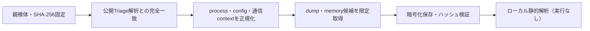

# Triage公開解析・後段取得証跡

## 完全ハッシュ一致

- [260923-rf848svy4q](https://tria.ge/260923-rf848svy4q): ファミリー候補 `未確定`、評価score `7`
- [260923-qz6msavs6r](https://tria.ge/260923-qz6msavs6r): ファミリー候補 `未確定`、評価score `6`

## プロセス・通信

- 観測process: `2026年第2季度内职人员违纪名单信息.exe, svchost.exe`
- raw commandは保存せず、command SHA-256と処理patternだけをJSONへ保持します。
- sandbox background trafficは`context_only`であり、C2へ自動昇格しません。

- 取得できませんでした。

## 後段取得物

- `57b6c9b577d376f6a0104a695af9e293f44dba5a9b46fe6c38db0c69ac9c12b0` / `memory_image` / 2502656 bytes / 親と同一: `false` / 静的解析: `partial`

## 判定境界

Triage由来のfamily、process、config、通信は外部sandbox証跡です。Config extractorが返したendpointはC2候補として扱いますが、静的設定復元またはprocess帰属とprotocol応答が揃うまでは確認済みC2とはしません。取得成果物と検体は実行していません。
