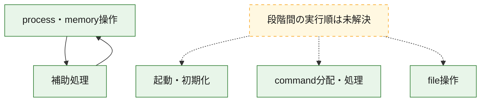
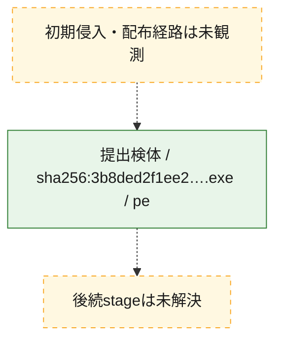
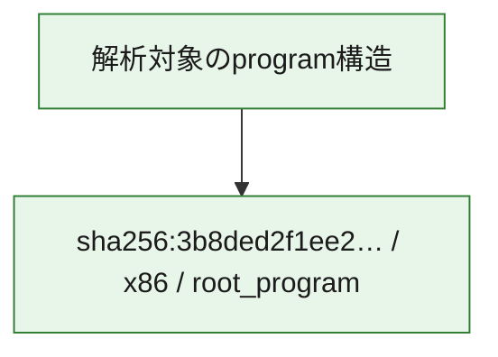

# 全体ロジック：3b8ded2f1ee256b99296ef86d74a270e735e4181425f04772701b3fcee16998d

代表関数の静的証跡から、起動・初期化、process・memory操作、command分配・処理、file操作の処理群を確認しました。

## 読み方

- phaseの掲載順は解析上の整理順です。observed_call_edgesがない段階間の実行順を断定しません。
- 図の実線は静的に観測した関係、点線と黄色のノードは未観測・未解決の関係を示します。
- 図は静的な要約であり、動的実行を再現するものではありません。
- 詳細な関数解説とfingerprintは[STATIC-LOGIC.md](STATIC-LOGIC.md)を参照してください。

## 静的可視化

### 実行フロー

### 感染チェーン

### モジュール関係

## 処理段階

### 1. 起動・初期化

entry pointから初期化と後続処理への移行を確認します。
確度: `confirmed_static_function_evidence`

- `3b8ded2f1ee256b99296ef86d74a270e735e4181425f04772701b3fcee16998d:ghidra:140011adc` — 初期化と主要処理への分岐を行う入口関数です。 状態: `succeeded`、選定理由: `entry_point`, `meaningful_symbol_name`, `reviewed_call_centrality:4`, `role:entrypoint`

### 2. process・memory操作

process、thread、module、memory操作と実行移行を確認します。
確度: `confirmed_static_function_evidence`

- `3b8ded2f1ee256b99296ef86d74a270e735e4181425f04772701b3fcee16998d:ghidra:140004460` — process、thread、module、またはmemory操作に関係する関数です。 状態: `succeeded`、選定理由: `context_representative`, `reviewed_call_centrality:34`, `role:process_or_memory_operation`
- `3b8ded2f1ee256b99296ef86d74a270e735e4181425f04772701b3fcee16998d:ghidra:140004a80` — process、thread、module、またはmemory操作に関係する関数です。 状態: `succeeded`、選定理由: `context_representative`, `reviewed_call_centrality:22`, `role:process_or_memory_operation`
- `3b8ded2f1ee256b99296ef86d74a270e735e4181425f04772701b3fcee16998d:ghidra:140004d80` — process、thread、module、またはmemory操作に関係する関数です。 状態: `succeeded`、選定理由: `context_representative`, `reviewed_call_centrality:34`, `role:process_or_memory_operation`

### 3. command分配・処理

受信commandやtaskの解釈、分配、個別handlerへの移行を確認します。
確度: `confirmed_static_function_evidence_with_limits`

- `3b8ded2f1ee256b99296ef86d74a270e735e4181425f04772701b3fcee16998d:ghidra:14005c6b0` — commandの解釈、分配、または個別処理を担当する関数です。 状態: `limited_bad_instruction_or_flow`、選定理由: `meaningful_symbol_name`, `role:command_dispatch_or_handler`

### 4. file操作

fileやdirectoryの作成、読書き、削除を確認します。
確度: `confirmed_static_function_evidence`

- `3b8ded2f1ee256b99296ef86d74a270e735e4181425f04772701b3fcee16998d:ghidra:140005420` — fileまたはdirectoryの読書き・管理に関係する関数です。 状態: `succeeded`、選定理由: `context_representative`, `reviewed_call_centrality:25`, `role:file_operation`

### 5. 補助処理

主要処理を支える一般内部関数またはlibrary処理を確認します。
確度: `confirmed_static_function_evidence`

- `3b8ded2f1ee256b99296ef86d74a270e735e4181425f04772701b3fcee16998d:ghidra:140004000` — 検体内部の一般処理を実装する関数です。 状態: `succeeded`、選定理由: `context_representative`, `reviewed_call_centrality:2`
- `3b8ded2f1ee256b99296ef86d74a270e735e4181425f04772701b3fcee16998d:ghidra:140004040` — 検体内部の一般処理を実装する関数です。 状態: `succeeded`、選定理由: `context_representative`, `reviewed_call_centrality:2`
- `3b8ded2f1ee256b99296ef86d74a270e735e4181425f04772701b3fcee16998d:ghidra:1400040b0` — 検体内部の一般処理を実装する関数です。 状態: `succeeded`、選定理由: `context_representative`, `reviewed_call_centrality:2`
- `3b8ded2f1ee256b99296ef86d74a270e735e4181425f04772701b3fcee16998d:ghidra:140004120` — 検体内部の一般処理を実装する関数です。 状態: `succeeded`、選定理由: `context_representative`, `reviewed_call_centrality:2`
- `3b8ded2f1ee256b99296ef86d74a270e735e4181425f04772701b3fcee16998d:ghidra:140004180` — 検体内部の一般処理を実装する関数です。 状態: `succeeded`、選定理由: `context_representative`, `reviewed_call_centrality:2`
- `3b8ded2f1ee256b99296ef86d74a270e735e4181425f04772701b3fcee16998d:ghidra:1400041e0` — 検体内部の一般処理を実装する関数です。 状態: `succeeded`、選定理由: `context_representative`, `reviewed_call_centrality:1`
- `3b8ded2f1ee256b99296ef86d74a270e735e4181425f04772701b3fcee16998d:ghidra:140004260` — 検体内部の一般処理を実装する関数です。 状態: `succeeded`、選定理由: `context_representative`, `reviewed_call_centrality:2`
- `3b8ded2f1ee256b99296ef86d74a270e735e4181425f04772701b3fcee16998d:ghidra:1400042a0` — 検体内部の一般処理を実装する関数です。 状態: `succeeded`、選定理由: `context_representative`, `reviewed_call_centrality:13`
- `3b8ded2f1ee256b99296ef86d74a270e735e4181425f04772701b3fcee16998d:ghidra:140004380` — 検体内部の一般処理を実装する関数です。 状態: `succeeded`、選定理由: `context_representative`, `reviewed_call_centrality:12`
- `3b8ded2f1ee256b99296ef86d74a270e735e4181425f04772701b3fcee16998d:ghidra:140004800` — 検体内部の一般処理を実装する関数です。 状態: `succeeded`、選定理由: `context_representative`, `reviewed_call_centrality:10`
- `3b8ded2f1ee256b99296ef86d74a270e735e4181425f04772701b3fcee16998d:ghidra:140004950` — 検体内部の一般処理を実装する関数です。 状態: `succeeded`、選定理由: `context_representative`, `reviewed_call_centrality:3`
- `3b8ded2f1ee256b99296ef86d74a270e735e4181425f04772701b3fcee16998d:ghidra:1400049b0` — 検体内部の一般処理を実装する関数です。 状態: `succeeded`、選定理由: `context_representative`, `reviewed_call_centrality:2`
- `3b8ded2f1ee256b99296ef86d74a270e735e4181425f04772701b3fcee16998d:ghidra:1400049f0` — 検体内部の一般処理を実装する関数です。 状態: `succeeded`、選定理由: `context_representative`, `reviewed_call_centrality:4`
- `3b8ded2f1ee256b99296ef86d74a270e735e4181425f04772701b3fcee16998d:ghidra:140004d40` — 検体内部の一般処理を実装する関数です。 状態: `succeeded`、選定理由: `context_representative`, `reviewed_call_centrality:2`
- `3b8ded2f1ee256b99296ef86d74a270e735e4181425f04772701b3fcee16998d:ghidra:140005740` — 検体内部の一般処理を実装する関数です。 状態: `succeeded`、選定理由: `context_representative`, `reviewed_call_centrality:1`
- `3b8ded2f1ee256b99296ef86d74a270e735e4181425f04772701b3fcee16998d:ghidra:1400059b0` — 検体内部の一般処理を実装する関数です。 状態: `succeeded`、選定理由: `context_representative`, `reviewed_call_centrality:3`
- `3b8ded2f1ee256b99296ef86d74a270e735e4181425f04772701b3fcee16998d:ghidra:140005a70` — 検体内部の一般処理を実装する関数です。 状態: `succeeded`、選定理由: `context_representative`, `reviewed_call_centrality:2`
- `3b8ded2f1ee256b99296ef86d74a270e735e4181425f04772701b3fcee16998d:ghidra:140005b20` — 検体内部の一般処理を実装する関数です。 状態: `succeeded`、選定理由: `context_representative`, `reviewed_call_centrality:3`
- `3b8ded2f1ee256b99296ef86d74a270e735e4181425f04772701b3fcee16998d:ghidra:140005d30` — 検体内部の一般処理を実装する関数です。 状態: `succeeded`、選定理由: `context_representative`, `reviewed_call_centrality:3`
- `3b8ded2f1ee256b99296ef86d74a270e735e4181425f04772701b3fcee16998d:ghidra:140005dc0` — 検体内部の一般処理を実装する関数です。 状態: `succeeded`、選定理由: `context_representative`, `reviewed_call_centrality:3`
- `3b8ded2f1ee256b99296ef86d74a270e735e4181425f04772701b3fcee16998d:ghidra:140005e80` — 検体内部の一般処理を実装する関数です。 状態: `succeeded`、選定理由: `context_representative`, `reviewed_call_centrality:7`
- `3b8ded2f1ee256b99296ef86d74a270e735e4181425f04772701b3fcee16998d:ghidra:140005ff0` — 検体内部の一般処理を実装する関数です。 状態: `succeeded`、選定理由: `context_representative`, `reviewed_call_centrality:1`
- `3b8ded2f1ee256b99296ef86d74a270e735e4181425f04772701b3fcee16998d:ghidra:140006020` — 検体内部の一般処理を実装する関数です。 状態: `succeeded`、選定理由: `context_representative`, `reviewed_call_centrality:2`
- `3b8ded2f1ee256b99296ef86d74a270e735e4181425f04772701b3fcee16998d:ghidra:140006210` — 検体内部の一般処理を実装する関数です。 状態: `succeeded`、選定理由: `context_representative`, `reviewed_call_centrality:8`
- `3b8ded2f1ee256b99296ef86d74a270e735e4181425f04772701b3fcee16998d:ghidra:140006260` — 検体内部の一般処理を実装する関数です。 状態: `succeeded`、選定理由: `context_representative`, `reviewed_call_centrality:2`
- `3b8ded2f1ee256b99296ef86d74a270e735e4181425f04772701b3fcee16998d:ghidra:1400122ec` — 検体内部の一般処理を実装する関数です。 状態: `succeeded`、選定理由: `meaningful_symbol_name`

## 観測したcall関係

- `3b8ded2f1ee256b99296ef86d74a270e735e4181425f04772701b3fcee16998d:ghidra:140004800` → `3b8ded2f1ee256b99296ef86d74a270e735e4181425f04772701b3fcee16998d:ghidra:140004460` （`support` → `execution`）
- `3b8ded2f1ee256b99296ef86d74a270e735e4181425f04772701b3fcee16998d:ghidra:140004800` → `3b8ded2f1ee256b99296ef86d74a270e735e4181425f04772701b3fcee16998d:ghidra:140005e80` （`support` → `support`）
- `3b8ded2f1ee256b99296ef86d74a270e735e4181425f04772701b3fcee16998d:ghidra:140004a80` → `3b8ded2f1ee256b99296ef86d74a270e735e4181425f04772701b3fcee16998d:ghidra:140004800` （`execution` → `support`）
- `3b8ded2f1ee256b99296ef86d74a270e735e4181425f04772701b3fcee16998d:ghidra:140004a80` → `3b8ded2f1ee256b99296ef86d74a270e735e4181425f04772701b3fcee16998d:ghidra:140004d80` （`execution` → `execution`）
- `ghidra-function:0795c1df65709ea5ee73a2d3` → `ghidra-external:70c077079edf1654f9eb13d6` （`unclassified` → `unclassified`）
- `ghidra-function:0795c1df65709ea5ee73a2d3` → `ghidra-external:f817342b7ac4bb5731e78667` （`unclassified` → `unclassified`）
- `ghidra-function:0795c1df65709ea5ee73a2d3` → `ghidra-function:6a67f2a4fb3e50d470bec80f` （`unclassified` → `unclassified`）
- `ghidra-function:0795c1df65709ea5ee73a2d3` → `ghidra-function:93e7acec921e2d3c2e2ff1f0` （`unclassified` → `unclassified`）
- `ghidra-function:0795c1df65709ea5ee73a2d3` → `ghidra-function:94b959fb508933cd851326d2` （`unclassified` → `unclassified`）
- `ghidra-function:0795c1df65709ea5ee73a2d3` → `ghidra-function:e206a464eb0c1dd4386f3ff7` （`unclassified` → `unclassified`）
- `ghidra-function:0e8c2f2ec756a3529ed1b023` → `ghidra-function:384d65415e1d339897536c30` （`unclassified` → `unclassified`）
- `ghidra-function:1af0a7fa0bc46d6b72ad3343` → `ghidra-external:f817342b7ac4bb5731e78667` （`unclassified` → `unclassified`）
- `ghidra-function:1af0a7fa0bc46d6b72ad3343` → `ghidra-function:94b959fb508933cd851326d2` （`unclassified` → `unclassified`）
- `ghidra-function:225c5f5f0178a34f69bd115d` → `ghidra-external:7ca0d08c7072df232bd4653c` （`unclassified` → `unclassified`）
- `ghidra-function:225c5f5f0178a34f69bd115d` → `ghidra-function:eefd71efc94b1ea4e76ed429` （`unclassified` → `unclassified`）
- `ghidra-function:284283c17b0ddcdfca942b61` → `ghidra-external:1f96be3aa6bfaf314ef6e842` （`unclassified` → `unclassified`）
- `ghidra-function:284283c17b0ddcdfca942b61` → `ghidra-external:f817342b7ac4bb5731e78667` （`unclassified` → `unclassified`）
- `ghidra-function:284283c17b0ddcdfca942b61` → `ghidra-function:384d65415e1d339897536c30` （`unclassified` → `unclassified`）
- `ghidra-function:284283c17b0ddcdfca942b61` → `ghidra-function:6e3c8a175e26be5aa478c238` （`unclassified` → `unclassified`）
- `ghidra-function:284283c17b0ddcdfca942b61` → `ghidra-function:8aad07f5c35221236156592a` （`unclassified` → `unclassified`）
- `ghidra-function:284283c17b0ddcdfca942b61` → `ghidra-function:94b959fb508933cd851326d2` （`unclassified` → `unclassified`）
- `ghidra-function:42514090caa7c99ef85b2676` → `ghidra-external:4370a3c14b301deffcb5f12f` （`unclassified` → `unclassified`）
- `ghidra-function:42514090caa7c99ef85b2676` → `ghidra-function:29ea57e52d4523fb571cfd47` （`unclassified` → `unclassified`）
- `ghidra-function:539909439892f37c8040f815` → `ghidra-external:1f96be3aa6bfaf314ef6e842` （`unclassified` → `unclassified`）
- `ghidra-function:539909439892f37c8040f815` → `ghidra-function:6d3ac85e9c355acc20999be2` （`unclassified` → `unclassified`）
- `ghidra-function:54b9ac6a376e40d7378c12ed` → `ghidra-external:d2b86be34045c7c02fafdce4` （`unclassified` → `unclassified`）
- `ghidra-function:54b9ac6a376e40d7378c12ed` → `ghidra-function:0439e3a3fa67567d5be02334` （`unclassified` → `unclassified`）
- `ghidra-function:54b9ac6a376e40d7378c12ed` → `ghidra-function:286e675ac4400abaa01b554f` （`unclassified` → `unclassified`）
- `ghidra-function:54b9ac6a376e40d7378c12ed` → `ghidra-function:2ad7e1ff8d067e6179c13d5f` （`unclassified` → `unclassified`）
- `ghidra-function:54b9ac6a376e40d7378c12ed` → `ghidra-function:3e6aff4376c515a7ff4a2b79` （`unclassified` → `unclassified`）
- `ghidra-function:54b9ac6a376e40d7378c12ed` → `ghidra-function:6a67f2a4fb3e50d470bec80f` （`unclassified` → `unclassified`）
- `ghidra-function:54b9ac6a376e40d7378c12ed` → `ghidra-function:6ec39d07a4c8a16fe0ef2c51` （`unclassified` → `unclassified`）
- `ghidra-function:54b9ac6a376e40d7378c12ed` → `ghidra-function:7e6bd0e0f0488a03dbd57acf` （`unclassified` → `unclassified`）
- `ghidra-function:54b9ac6a376e40d7378c12ed` → `ghidra-function:987ff4c6dcea5049aca8e870` （`unclassified` → `unclassified`）
- `ghidra-function:54b9ac6a376e40d7378c12ed` → `ghidra-function:bf3157847b0e3cea344a83ed` （`unclassified` → `unclassified`）
- `ghidra-function:54b9ac6a376e40d7378c12ed` → `ghidra-function:c20e15e71239717550c7c9c3` （`unclassified` → `unclassified`）
- `ghidra-function:54b9ac6a376e40d7378c12ed` → `ghidra-function:daabed1efdc74a94e05364a1` （`unclassified` → `unclassified`）
- `ghidra-function:54b9ac6a376e40d7378c12ed` → `ghidra-function:dae56d81db4d81c573534bc3` （`unclassified` → `unclassified`）
- `ghidra-function:54b9ac6a376e40d7378c12ed` → `ghidra-function:eaa0cfeff3f35c2f239b4502` （`unclassified` → `unclassified`）
- `ghidra-function:54b9ac6a376e40d7378c12ed` → `ghidra-function:eb0b0b3f2abc8b5fead5b680` （`unclassified` → `unclassified`）
- `ghidra-function:54b9ac6a376e40d7378c12ed` → `ghidra-function:f2efecdd87733cc01765105e` （`unclassified` → `unclassified`）
- `ghidra-function:54b9ac6a376e40d7378c12ed` → `ghidra-function:f81c8ab27f2a15bc2ea9d591` （`unclassified` → `unclassified`）
- `ghidra-function:54b9ac6a376e40d7378c12ed` → `ghidra-function:ff9d7b3e3f63035b15f38cff` （`unclassified` → `unclassified`）
- `ghidra-function:59fc8604fe5d1baac8363787` → `ghidra-function:2ad7e1ff8d067e6179c13d5f` （`unclassified` → `unclassified`）
- `ghidra-function:59fc8604fe5d1baac8363787` → `ghidra-function:6a67f2a4fb3e50d470bec80f` （`unclassified` → `unclassified`）
- `ghidra-function:59fc8604fe5d1baac8363787` → `ghidra-function:7e6bd0e0f0488a03dbd57acf` （`unclassified` → `unclassified`）
- `ghidra-function:59fc8604fe5d1baac8363787` → `ghidra-function:987ff4c6dcea5049aca8e870` （`unclassified` → `unclassified`）
- `ghidra-function:59fc8604fe5d1baac8363787` → `ghidra-function:c20e15e71239717550c7c9c3` （`unclassified` → `unclassified`）
- `ghidra-function:59fc8604fe5d1baac8363787` → `ghidra-function:f81c8ab27f2a15bc2ea9d591` （`unclassified` → `unclassified`）
- `ghidra-function:59fc8604fe5d1baac8363787` → `ghidra-function:ff9d7b3e3f63035b15f38cff` （`unclassified` → `unclassified`）
- `ghidra-function:62684a88cc0074d872e2b7e8` → `ghidra-external:4370a3c14b301deffcb5f12f` （`unclassified` → `unclassified`）
- `ghidra-function:62684a88cc0074d872e2b7e8` → `ghidra-function:29ea57e52d4523fb571cfd47` （`unclassified` → `unclassified`）
- `ghidra-function:71d246a206b5f4683c1b04e6` → `ghidra-function:6d3ac85e9c355acc20999be2` （`unclassified` → `unclassified`）
- `ghidra-function:82a2526130ac563054453ad2` → `ghidra-function:286e675ac4400abaa01b554f` （`unclassified` → `unclassified`）
- `ghidra-function:82a2526130ac563054453ad2` → `ghidra-function:6ec39d07a4c8a16fe0ef2c51` （`unclassified` → `unclassified`）
- `ghidra-function:82a2526130ac563054453ad2` → `ghidra-function:987ff4c6dcea5049aca8e870` （`unclassified` → `unclassified`）
- `ghidra-function:82a2526130ac563054453ad2` → `ghidra-function:bf3157847b0e3cea344a83ed` （`unclassified` → `unclassified`）
- `ghidra-function:82a2526130ac563054453ad2` → `ghidra-function:dae56d81db4d81c573534bc3` （`unclassified` → `unclassified`）
- `ghidra-function:82a2526130ac563054453ad2` → `ghidra-function:eb0b0b3f2abc8b5fead5b680` （`unclassified` → `unclassified`）
- `ghidra-function:82a2526130ac563054453ad2` → `ghidra-function:f81c8ab27f2a15bc2ea9d591` （`unclassified` → `unclassified`）
- `ghidra-function:84e79bd082236c1e23cfd217` → `ghidra-external:4370a3c14b301deffcb5f12f` （`unclassified` → `unclassified`）
- `ghidra-function:84e79bd082236c1e23cfd217` → `ghidra-function:20cac7c27fe0e07131ffc36f` （`unclassified` → `unclassified`）
- `ghidra-function:861ed0fee2b790681042db2a` → `ghidra-external:1f96be3aa6bfaf314ef6e842` （`unclassified` → `unclassified`）
- `ghidra-function:861ed0fee2b790681042db2a` → `ghidra-external:f817342b7ac4bb5731e78667` （`unclassified` → `unclassified`）
- `ghidra-function:861ed0fee2b790681042db2a` → `ghidra-function:94b959fb508933cd851326d2` （`unclassified` → `unclassified`）
- `ghidra-function:90fa70b114c4f06f922c8620` → `ghidra-function:384d65415e1d339897536c30` （`unclassified` → `unclassified`）
- `ghidra-function:942cc9601f20a74096818718` → `ghidra-external:4370a3c14b301deffcb5f12f` （`unclassified` → `unclassified`）
- `ghidra-function:942cc9601f20a74096818718` → `ghidra-function:20cac7c27fe0e07131ffc36f` （`unclassified` → `unclassified`）
- `ghidra-function:9fcb4e3a5da955e576ccc04b` → `ghidra-function:6d3ac85e9c355acc20999be2` （`unclassified` → `unclassified`）
- `ghidra-function:a1d4d6181105836fd0ebfb33` → `ghidra-external:0548b1063ccc834cf15a3286` （`unclassified` → `unclassified`）
- `ghidra-function:a1d4d6181105836fd0ebfb33` → `ghidra-external:d2b86be34045c7c02fafdce4` （`unclassified` → `unclassified`）
- `ghidra-function:a1d4d6181105836fd0ebfb33` → `ghidra-function:084522eccf573fd1b69569f8` （`unclassified` → `unclassified`）
- `ghidra-function:a1d4d6181105836fd0ebfb33` → `ghidra-function:374dbb9223953bddcbfa6504` （`unclassified` → `unclassified`）
- `ghidra-function:a1d4d6181105836fd0ebfb33` → `ghidra-function:393db573ee17781a35dee9fb` （`unclassified` → `unclassified`）
- `ghidra-function:a1d4d6181105836fd0ebfb33` → `ghidra-function:3973e62fe474c08db65c1dce` （`unclassified` → `unclassified`）
- `ghidra-function:a1d4d6181105836fd0ebfb33` → `ghidra-function:88c0c24739283334ec5cd807` （`unclassified` → `unclassified`）
- `ghidra-function:a1d4d6181105836fd0ebfb33` → `ghidra-function:92b0ff42f64982ded0c69990` （`unclassified` → `unclassified`）
- `ghidra-function:a1d4d6181105836fd0ebfb33` → `ghidra-function:987ff4c6dcea5049aca8e870` （`unclassified` → `unclassified`）
- `ghidra-function:a1d4d6181105836fd0ebfb33` → `ghidra-function:a0adfeecd4dda510fe16c470` （`unclassified` → `unclassified`）
- `ghidra-function:a1d4d6181105836fd0ebfb33` → `ghidra-function:bb82cfaaa0df7309a6edd88d` （`unclassified` → `unclassified`）
- `ghidra-function:a1d4d6181105836fd0ebfb33` → `ghidra-function:bc1b7e9a66ad8b27d487835a` （`unclassified` → `unclassified`）
- `ghidra-function:a1d4d6181105836fd0ebfb33` → `ghidra-function:c148e3ef7faabd55a9735db7` （`unclassified` → `unclassified`）
- `ghidra-function:a1d4d6181105836fd0ebfb33` → `ghidra-function:cf13edef5ef8191476cb0c89` （`unclassified` → `unclassified`）
- `ghidra-function:a1d4d6181105836fd0ebfb33` → `ghidra-function:f81c8ab27f2a15bc2ea9d591` （`unclassified` → `unclassified`）
- `ghidra-function:a1d4d6181105836fd0ebfb33` → `ghidra-function:ff9d7b3e3f63035b15f38cff` （`unclassified` → `unclassified`）
- `ghidra-function:a31521d84fe885d1569ac8ab` → `ghidra-function:1b73668d79523c4db4becdf1` （`unclassified` → `unclassified`）
- `ghidra-function:a31521d84fe885d1569ac8ab` → `ghidra-function:284283c17b0ddcdfca942b61` （`unclassified` → `unclassified`）
- `ghidra-function:a31521d84fe885d1569ac8ab` → `ghidra-function:54b9ac6a376e40d7378c12ed` （`unclassified` → `unclassified`）
- `ghidra-function:a31521d84fe885d1569ac8ab` → `ghidra-function:987ff4c6dcea5049aca8e870` （`unclassified` → `unclassified`）
- `ghidra-function:a31521d84fe885d1569ac8ab` → `ghidra-function:be2445881b74efdfae144c9d` （`unclassified` → `unclassified`）
- `ghidra-function:a31521d84fe885d1569ac8ab` → `ghidra-function:f81c8ab27f2a15bc2ea9d591` （`unclassified` → `unclassified`）
- `ghidra-function:aff643c0b837fc3b5aed08cf` → `ghidra-function:00ec480992123ff6bab8fdae` （`unclassified` → `unclassified`）
- `ghidra-function:aff643c0b837fc3b5aed08cf` → `ghidra-function:384d65415e1d339897536c30` （`unclassified` → `unclassified`）
- `ghidra-function:b404183d273f2a66aa4cfb8e` → `ghidra-external:1f96be3aa6bfaf314ef6e842` （`unclassified` → `unclassified`）
- `ghidra-function:b404183d273f2a66aa4cfb8e` → `ghidra-external:f817342b7ac4bb5731e78667` （`unclassified` → `unclassified`）
- `ghidra-function:b404183d273f2a66aa4cfb8e` → `ghidra-function:94b959fb508933cd851326d2` （`unclassified` → `unclassified`）
- `ghidra-function:b53fbf292e3f5af95f65d3be` → `ghidra-external:1f96be3aa6bfaf314ef6e842` （`unclassified` → `unclassified`）
- `ghidra-function:b53fbf292e3f5af95f65d3be` → `ghidra-external:f817342b7ac4bb5731e78667` （`unclassified` → `unclassified`）
- `ghidra-function:b53fbf292e3f5af95f65d3be` → `ghidra-function:94b959fb508933cd851326d2` （`unclassified` → `unclassified`）
- `ghidra-function:c531d35f999a748eee247d36` → `ghidra-function:00ec480992123ff6bab8fdae` （`unclassified` → `unclassified`）
- `ghidra-function:c531d35f999a748eee247d36` → `ghidra-function:384d65415e1d339897536c30` （`unclassified` → `unclassified`）
- `ghidra-function:ca2dfc7950be97e5a45822db` → `ghidra-external:1f96be3aa6bfaf314ef6e842` （`unclassified` → `unclassified`）
- `ghidra-function:ca2dfc7950be97e5a45822db` → `ghidra-external:f817342b7ac4bb5731e78667` （`unclassified` → `unclassified`）
- `ghidra-function:ca2dfc7950be97e5a45822db` → `ghidra-function:00ec480992123ff6bab8fdae` （`unclassified` → `unclassified`）
- `ghidra-function:ca2dfc7950be97e5a45822db` → `ghidra-function:0439e3a3fa67567d5be02334` （`unclassified` → `unclassified`）
- `ghidra-function:ca2dfc7950be97e5a45822db` → `ghidra-function:12ae15954366feb8c22f9fc3` （`unclassified` → `unclassified`）
- `ghidra-function:ca2dfc7950be97e5a45822db` → `ghidra-function:384d65415e1d339897536c30` （`unclassified` → `unclassified`）
- `ghidra-function:ca2dfc7950be97e5a45822db` → `ghidra-function:393db573ee17781a35dee9fb` （`unclassified` → `unclassified`）
- `ghidra-function:ca2dfc7950be97e5a45822db` → `ghidra-function:6d3ac85e9c355acc20999be2` （`unclassified` → `unclassified`）
- `ghidra-function:ca2dfc7950be97e5a45822db` → `ghidra-function:92b0ff42f64982ded0c69990` （`unclassified` → `unclassified`）
- `ghidra-function:ca2dfc7950be97e5a45822db` → `ghidra-function:94b959fb508933cd851326d2` （`unclassified` → `unclassified`）
- `ghidra-function:ca2dfc7950be97e5a45822db` → `ghidra-function:a31521d84fe885d1569ac8ab` （`unclassified` → `unclassified`）
- `ghidra-function:ca2dfc7950be97e5a45822db` → `ghidra-function:b1218834f9675fcda4d89c46` （`unclassified` → `unclassified`）
- `ghidra-function:ca2dfc7950be97e5a45822db` → `ghidra-function:bc1b7e9a66ad8b27d487835a` （`unclassified` → `unclassified`）
- `ghidra-function:ca2dfc7950be97e5a45822db` → `ghidra-function:c148e3ef7faabd55a9735db7` （`unclassified` → `unclassified`）
- `ghidra-function:ca2dfc7950be97e5a45822db` → `ghidra-function:d592dc4121e759a995b292cb` （`unclassified` → `unclassified`）
- `ghidra-function:ca2dfc7950be97e5a45822db` → `ghidra-function:f81c8ab27f2a15bc2ea9d591` （`unclassified` → `unclassified`）
- `ghidra-function:ca2dfc7950be97e5a45822db` → `ghidra-function:fc72027c21ca4866f0b65d41` （`unclassified` → `unclassified`）
- `ghidra-function:d5f49cc3898f02cb7e5e145d` → `ghidra-external:1f96be3aa6bfaf314ef6e842` （`unclassified` → `unclassified`）
- `ghidra-function:d5f49cc3898f02cb7e5e145d` → `ghidra-external:f817342b7ac4bb5731e78667` （`unclassified` → `unclassified`）
- `ghidra-function:d5f49cc3898f02cb7e5e145d` → `ghidra-function:94b959fb508933cd851326d2` （`unclassified` → `unclassified`）
- `ghidra-function:dcf054855f59b9453c56460c` → `ghidra-function:393db573ee17781a35dee9fb` （`unclassified` → `unclassified`）
- `ghidra-function:dcf054855f59b9453c56460c` → `ghidra-function:bc1b7e9a66ad8b27d487835a` （`unclassified` → `unclassified`）
- `ghidra-function:dcf054855f59b9453c56460c` → `ghidra-function:c148e3ef7faabd55a9735db7` （`unclassified` → `unclassified`）
- `ghidra-function:de281bc28dbe622b3cf4cdbd` → `ghidra-external:5ca6d85a4131aedbbede42f3` （`unclassified` → `unclassified`）
- `ghidra-function:de281bc28dbe622b3cf4cdbd` → `ghidra-external:78582bad81ea33824b5598cd` （`unclassified` → `unclassified`）
- `ghidra-function:de281bc28dbe622b3cf4cdbd` → `ghidra-external:b455d8117985c9eb61a9bb9d` （`unclassified` → `unclassified`）
- `ghidra-function:de281bc28dbe622b3cf4cdbd` → `ghidra-function:e5cc1f9121088ea1d91dfdd1` （`unclassified` → `unclassified`）
- `ghidra-function:e663f78e0190c22aabed0f17` → `ghidra-function:384d65415e1d339897536c30` （`unclassified` → `unclassified`）
- `ghidra-function:e77544672e5f6343b24775e7` → `ghidra-function:00ec480992123ff6bab8fdae` （`unclassified` → `unclassified`）
- `ghidra-function:e77544672e5f6343b24775e7` → `ghidra-function:384d65415e1d339897536c30` （`unclassified` → `unclassified`）
- `ghidra-function:fc72027c21ca4866f0b65d41` → `ghidra-external:0548b1063ccc834cf15a3286` （`unclassified` → `unclassified`）
- `ghidra-function:fc72027c21ca4866f0b65d41` → `ghidra-external:1f96be3aa6bfaf314ef6e842` （`unclassified` → `unclassified`）
- `ghidra-function:fc72027c21ca4866f0b65d41` → `ghidra-external:f817342b7ac4bb5731e78667` （`unclassified` → `unclassified`）
- `ghidra-function:fc72027c21ca4866f0b65d41` → `ghidra-function:084522eccf573fd1b69569f8` （`unclassified` → `unclassified`）
- `ghidra-function:fc72027c21ca4866f0b65d41` → `ghidra-function:1cb7868d19cf65544949a6d4` （`unclassified` → `unclassified`）
- `ghidra-function:fc72027c21ca4866f0b65d41` → `ghidra-function:384d65415e1d339897536c30` （`unclassified` → `unclassified`）
- `ghidra-function:fc72027c21ca4866f0b65d41` → `ghidra-function:393db573ee17781a35dee9fb` （`unclassified` → `unclassified`）
- `ghidra-function:fc72027c21ca4866f0b65d41` → `ghidra-function:51dd2f15fb2b9a6b265d3eb1` （`unclassified` → `unclassified`）
- `ghidra-function:fc72027c21ca4866f0b65d41` → `ghidra-function:6a67f2a4fb3e50d470bec80f` （`unclassified` → `unclassified`）
- `ghidra-function:fc72027c21ca4866f0b65d41` → `ghidra-function:920f65768d1dd2dc4f8b1092` （`unclassified` → `unclassified`）
- `ghidra-function:fc72027c21ca4866f0b65d41` → `ghidra-function:92b0ff42f64982ded0c69990` （`unclassified` → `unclassified`）
- `ghidra-function:fc72027c21ca4866f0b65d41` → `ghidra-function:94b959fb508933cd851326d2` （`unclassified` → `unclassified`）
- `ghidra-function:fc72027c21ca4866f0b65d41` → `ghidra-function:a3a83feebba9363535c3c093` （`unclassified` → `unclassified`）
- `ghidra-function:fc72027c21ca4866f0b65d41` → `ghidra-function:b0061877cf312b8e7337ed91` （`unclassified` → `unclassified`）
- `ghidra-function:fc72027c21ca4866f0b65d41` → `ghidra-function:bb82cfaaa0df7309a6edd88d` （`unclassified` → `unclassified`）
- `ghidra-function:fc72027c21ca4866f0b65d41` → `ghidra-function:bc1b7e9a66ad8b27d487835a` （`unclassified` → `unclassified`）
- `ghidra-function:fc72027c21ca4866f0b65d41` → `ghidra-function:c148e3ef7faabd55a9735db7` （`unclassified` → `unclassified`）
- `ghidra-function:fc72027c21ca4866f0b65d41` → `ghidra-function:cfa1d30005c6ab93ec3d1bd6` （`unclassified` → `unclassified`）
- `ghidra-function:fc72027c21ca4866f0b65d41` → `ghidra-function:e0ad0942c7c11dbd5e699444` （`unclassified` → `unclassified`）
- `ghidra-function:fc72027c21ca4866f0b65d41` → `ghidra-function:e18e8f485a1ea362f8b77258` （`unclassified` → `unclassified`）
- `ghidra-function:fc72027c21ca4866f0b65d41` → `ghidra-function:eb0b0b3f2abc8b5fead5b680` （`unclassified` → `unclassified`）
- `ghidra-function:fc72027c21ca4866f0b65d41` → `ghidra-function:f81c8ab27f2a15bc2ea9d591` （`unclassified` → `unclassified`）
- `ghidra-function:fc72027c21ca4866f0b65d41` → `ghidra-function:ff90f2567462b77a47c64c0f` （`unclassified` → `unclassified`）

## 解析範囲と制約

- 選定外関数は全体inventoryへ残しますが、関数本体の個別解説対象にはしていません。
- indirect call、難読化、packer、VM、壊れたcontrol flowによりcall関係が欠落する場合があります。
- 文書は静的解析に基づき、検体実行や外部通信による動的確認は行っていません。
