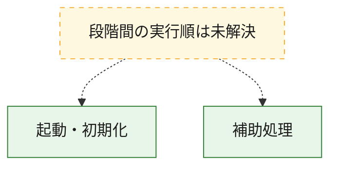

# 全体ロジック：3cd1c2577869cca762d3d10f4a2d1ac852d6a39ff3a40010deabf9882e74a046

代表関数の静的証跡から、起動・初期化の処理群を確認しました。

## 読み方

- phaseの掲載順は解析上の整理順です。observed_call_edgesがない段階間の実行順を断定しません。
- 図の実線は静的に観測した関係、点線と黄色のノードは未観測・未解決の関係を示します。
- 図は静的な要約であり、動的実行を再現するものではありません。
- 詳細な関数解説とfingerprintは[STATIC-LOGIC.md](STATIC-LOGIC.md)を参照してください。

## 静的可視化

### 実行フロー

### 感染チェーン

```mermaid
flowchart TD
  chain_initial["初期侵入・配布経路は未観測"]
  chain_01["提出検体 / sha256:3cd1c2577869….exe / pe"]
  chain_02["静的復元層 1 / sha256:3cd1c2577869….exe::embedded-pe / pe"]
  chain_03["静的復元層 2 / sha256:3cd1c2577869….exe::embedded-pe::embedded-pe / pe"]
  chain_04["静的復元層 2 / sha256:3cd1c2577869….exe::embedded-pe::embedded-pe / pe"]
  chain_05["静的復元層 2 / sha256:3cd1c2577869….exe::embedded-pe::embedded-pe / pe"]
  chain_06["静的復元層 2 / sha256:3cd1c2577869….exe::embedded-pe::embedded-pe / pe"]
  chain_07["静的復元層 2 / sha256:3cd1c2577869….exe::embedded-pe::embedded-pe / pe"]
  chain_08["静的復元層 2 / sha256:3cd1c2577869….exe::embedded-pe::embedded-pe / pe"]
  chain_09["静的復元層 2 / sha256:3cd1c2577869….exe::embedded-pe::embedded-pe / pe"]
  chain_10["静的復元層 2 / sha256:3cd1c2577869….exe::embedded-pe::embedded-pe / pe"]
  chain_11["静的復元層 2 / sha256:3cd1c2577869….exe::embedded-pe::embedded-pe / pe"]
  chain_12["静的復元層 2 / sha256:3cd1c2577869….exe::embedded-pe::embedded-pe / pe"]
  chain_13["静的復元層 2 / sha256:3cd1c2577869….exe::embedded-pe::embedded-pe / pe"]
  chain_14["静的復元層 2 / sha256:3cd1c2577869….exe::embedded-pe::embedded-pe / pe"]
  chain_15["静的復元層 2 / sha256:3cd1c2577869….exe::embedded-pe::embedded-pe / pe"]
  chain_16["静的復元層 2 / sha256:3cd1c2577869….exe::embedded-pe::embedded-pe / pe"]
  chain_01 -->|embedded-pe| chain_02
  chain_02 -->|embedded-pe| chain_03
  chain_02 -->|embedded-pe| chain_04
  chain_02 -->|embedded-pe| chain_05
  chain_02 -->|embedded-pe| chain_06
  chain_02 -->|embedded-pe| chain_07
  chain_02 -->|embedded-pe| chain_08
  chain_02 -->|embedded-pe| chain_09
  chain_02 -->|embedded-pe| chain_10
  chain_02 -->|embedded-pe| chain_11
  chain_02 -->|embedded-pe| chain_12
  chain_02 -->|embedded-pe| chain_13
  chain_02 -->|embedded-pe| chain_14
  chain_02 -->|embedded-pe| chain_15
  chain_02 -->|embedded-pe| chain_16
  chain_initial -.-> chain_01
  chain_more["その他2層はstatic-layers.jsonを参照"]
  chain_03 -.-> chain_more
  chain_04 -.-> chain_more
  chain_05 -.-> chain_more
  chain_06 -.-> chain_more
  chain_07 -.-> chain_more
  chain_08 -.-> chain_more
  chain_09 -.-> chain_more
  chain_10 -.-> chain_more
  chain_11 -.-> chain_more
  chain_12 -.-> chain_more
  chain_13 -.-> chain_more
  chain_14 -.-> chain_more
  chain_15 -.-> chain_more
  chain_16 -.-> chain_more
  class chain_more unresolved
  class chain_01,chain_02,chain_03,chain_04,chain_05,chain_06,chain_07,chain_08,chain_09,chain_10,chain_11,chain_12,chain_13,chain_14,chain_15,chain_16 confirmed
  class chain_initial unresolved
  classDef confirmed fill:#e8f5e9,stroke:#2e7d32,color:#1b1b1b
  classDef unresolved fill:#fff8e1,stroke:#f9a825,color:#1b1b1b,stroke-dasharray:5 5
```

### モジュール関係

```mermaid
flowchart TD
  module_scope["解析対象のprogram構造"]
  module_01["sha256:5815ecff0164… / x86 / statically_recovered_program"]
  module_02["sha256:3c88b6c883c1… / x86 / statically_recovered_program"]
  module_03["sha256:c493ffbd50b2… / x86 / statically_recovered_program"]
  module_04["sha256:41aafe03d5f0… / x86 / statically_recovered_program"]
  module_05["sha256:764df7877c9f… / x86 / statically_recovered_program"]
  module_06["sha256:f5492586581e… / x86 / statically_recovered_program"]
  module_07["sha256:437e5d512f2b… / x86 / statically_recovered_program"]
  module_08["sha256:dcc831d8bd03… / x86 / statically_recovered_program"]
  module_09["sha256:121f23a860aa… / x86 / statically_recovered_program"]
  module_10["sha256:27fbb5541ee6… / x86 / statically_recovered_program"]
  module_11["sha256:b73550e61b63… / x86 / statically_recovered_program"]
  module_12["sha256:6f834c726c24… / x86 / statically_recovered_program"]
  module_parent_unknown["復元元・親moduleは未特定"]
  module_parent_unknown -.-> module_01
  module_parent_unknown -.-> module_02
  module_parent_unknown -.-> module_03
  module_parent_unknown -.-> module_04
  module_parent_unknown -.-> module_05
  module_parent_unknown -.-> module_06
  module_parent_unknown -.-> module_07
  module_parent_unknown -.-> module_08
  module_parent_unknown -.-> module_09
  module_parent_unknown -.-> module_10
  module_parent_unknown -.-> module_11
  module_parent_unknown -.-> module_12
  class module_parent_unknown unresolved
  module_more["その他6moduleはstatic-logic.jsonを参照"]
  module_scope -.-> module_more
  class module_more unresolved
  class module_scope confirmed
  class module_01,module_02,module_03,module_04,module_05,module_06,module_07,module_08,module_09,module_10,module_11,module_12 confirmed
  classDef confirmed fill:#e8f5e9,stroke:#2e7d32,color:#1b1b1b
  classDef unresolved fill:#fff8e1,stroke:#f9a825,color:#1b1b1b,stroke-dasharray:5 5
```

## 処理段階

### 1. 起動・初期化

entry pointから初期化と後続処理への移行を確認します。
確度: `confirmed_static_function_evidence`

- `5815ecff01640d091226327ebb52336961054954c70bc2a76b4dfc0d9846506f:ghidra:000010f4` — 初期化と主要処理への分岐を行う入口関数です。 状態: `succeeded`、選定理由: `entry_point`, `meaningful_symbol_name`, `reviewed_call_centrality:2`, `role:entrypoint`, `small_program_complete_context`
- `3c88b6c883c19100d2b51f7922b4bbc4408458a5fdf547ebd51a8e231f99bc79:ghidra:000010f8` — 初期化と主要処理への分岐を行う入口関数です。 状態: `succeeded`、選定理由: `entry_point`, `meaningful_symbol_name`, `role:entrypoint`, `small_program_complete_context`
- `c493ffbd50b28310de3dff33dc4fde52f9887cf849879e8537dd7d80fc436ecb:ghidra:000010a0` — 初期化と主要処理への分岐を行う入口関数です。 状態: `succeeded`、選定理由: `entry_point`, `meaningful_symbol_name`, `reviewed_call_centrality:2`, `role:entrypoint`, `small_program_complete_context`
- `41aafe03d5f04783bcc88d20696058363039a67f6ed144bce10730f485470248:ghidra:00001120` — 初期化と主要処理への分岐を行う入口関数です。 状態: `succeeded`、選定理由: `entry_point`, `meaningful_symbol_name`, `reviewed_call_centrality:2`, `role:entrypoint`, `small_program_complete_context`
- `764df7877c9fee12e3931fa634e7e5bbcd9b06aee751f5083916118133764ff5:ghidra:00001100` — 初期化と主要処理への分岐を行う入口関数です。 状態: `succeeded`、選定理由: `entry_point`, `meaningful_symbol_name`, `reviewed_call_centrality:2`, `role:entrypoint`
- `f5492586581e3cb63b8bfcf8f71cc7a13fe3e23063000825f99cea10a3128e95:ghidra:000010a0` — 初期化と主要処理への分岐を行う入口関数です。 状態: `succeeded`、選定理由: `entry_point`, `meaningful_symbol_name`, `reviewed_call_centrality:2`, `role:entrypoint`
- `437e5d512f2b689ad7a8e29d4f3bd52eaa473ebecead6fe54d1fc3139bc36671:ghidra:000010c0` — 初期化と主要処理への分岐を行う入口関数です。 状態: `succeeded`、選定理由: `entry_point`, `meaningful_symbol_name`, `reviewed_call_centrality:2`, `role:entrypoint`
- `dcc831d8bd03846a5dfb62bf9e81d50d43bf6fd7fc9b5056144ef9cf4d6915d7:ghidra:000010c0` — 初期化と主要処理への分岐を行う入口関数です。 状態: `succeeded`、選定理由: `entry_point`, `meaningful_symbol_name`, `reviewed_call_centrality:2`, `role:entrypoint`
- `121f23a860aadcf28e5dca98911d9b0d15e735e5186a6fc246fa81a3e99d0ae5:ghidra:000010c0` — 初期化と主要処理への分岐を行う入口関数です。 状態: `succeeded`、選定理由: `entry_point`, `meaningful_symbol_name`, `reviewed_call_centrality:2`, `role:entrypoint`
- `27fbb5541ee60725e8b8b1a5373434e385a110242cbafb3ae31931896364eff4:ghidra:00001100` — 初期化と主要処理への分岐を行う入口関数です。 状態: `succeeded`、選定理由: `entry_point`, `meaningful_symbol_name`, `reviewed_call_centrality:2`, `role:entrypoint`
- `b73550e61b639b05e7ce50b51e9434f73ac3edeb6fb23d66a840f1e403ccffdd:ghidra:000010c0` — 初期化と主要処理への分岐を行う入口関数です。 状態: `succeeded`、選定理由: `entry_point`, `meaningful_symbol_name`, `reviewed_call_centrality:2`, `role:entrypoint`
- `6f834c726c24e9a4a975906447e459795c9d9466cc7f8f2fb13e6bc59d7208bd:ghidra:00001128` — 初期化と主要処理への分岐を行う入口関数です。 状態: `succeeded`、選定理由: `entry_point`, `meaningful_symbol_name`, `reviewed_call_centrality:4`, `role:entrypoint`
- `c5d8d09f9a5ac93794e9ca19355dbb1cec65dee07467a65d73ad2553483dfeed:ghidra:000011d8` — 初期化と主要処理への分岐を行う入口関数です。 状態: `succeeded`、選定理由: `entry_point`, `meaningful_symbol_name`, `reviewed_call_centrality:5`, `role:entrypoint`
- `3a55a0045cf0b862ce1701634744436b65b2e6459641f647418b65d1ec539736:ghidra:000010a0` — 初期化と主要処理への分岐を行う入口関数です。 状態: `succeeded`、選定理由: `entry_point`, `meaningful_symbol_name`, `reviewed_call_centrality:1`, `role:entrypoint`
- `590ebf94a42bab3b5d5bab3c19994feac1f0d54579f27b82ad815ac058b16020:ghidra:000010a0` — 初期化と主要処理への分岐を行う入口関数です。 状態: `succeeded`、選定理由: `entry_point`, `meaningful_symbol_name`, `reviewed_call_centrality:2`, `role:entrypoint`
- `0ea130be53f15b8cb3b8e541fb0aed7714f2409bbe8bc9d5c9fe4524d35dcfcd:ghidra:00001120` — 初期化と主要処理への分岐を行う入口関数です。 状態: `succeeded`、選定理由: `entry_point`, `meaningful_symbol_name`, `reviewed_call_centrality:3`, `role:entrypoint`

### 2. 補助処理

主要処理を支える一般内部関数またはlibrary処理を確認します。
確度: `confirmed_static_function_evidence_with_limits`

- `5815ecff01640d091226327ebb52336961054954c70bc2a76b4dfc0d9846506f:ghidra:000011a0` — 検体内部の一般処理を実装する関数です。 状態: `succeeded`、選定理由: `context_representative`, `reviewed_call_centrality:1`, `small_program_complete_context`
- `5815ecff01640d091226327ebb52336961054954c70bc2a76b4dfc0d9846506f:ghidra:00001268` — 検体内部の一般処理を実装する関数です。 状態: `limited_bad_instruction_or_flow`、選定理由: `context_representative`, `reviewed_call_centrality:1`, `small_program_complete_context`
- `5815ecff01640d091226327ebb52336961054954c70bc2a76b4dfc0d9846506f:ghidra:000012a4` — 検体内部の一般処理を実装する関数です。 状態: `succeeded`、選定理由: `context_representative`, `small_program_complete_context`
- `5815ecff01640d091226327ebb52336961054954c70bc2a76b4dfc0d9846506f:ghidra:00001360` — 検体内部の一般処理を実装する関数です。 状態: `succeeded`、選定理由: `context_representative`, `small_program_complete_context`
- `5815ecff01640d091226327ebb52336961054954c70bc2a76b4dfc0d9846506f:ghidra:00001438` — 検体内部の一般処理を実装する関数です。 状態: `succeeded`、選定理由: `context_representative`, `reviewed_call_centrality:1`, `small_program_complete_context`
- `5815ecff01640d091226327ebb52336961054954c70bc2a76b4dfc0d9846506f:ghidra:00001488` — 検体内部の一般処理を実装する関数です。 状態: `succeeded`、選定理由: `context_representative`, `reviewed_call_centrality:2`, `small_program_complete_context`
- `3c88b6c883c19100d2b51f7922b4bbc4408458a5fdf547ebd51a8e231f99bc79:ghidra:00001228` — 検体内部の一般処理を実装する関数です。 状態: `succeeded`、選定理由: `context_representative`, `reviewed_call_centrality:3`, `small_program_complete_context`
- `3c88b6c883c19100d2b51f7922b4bbc4408458a5fdf547ebd51a8e231f99bc79:ghidra:00001494` — 検体内部の一般処理を実装する関数です。 状態: `succeeded`、選定理由: `context_representative`, `reviewed_call_centrality:1`, `small_program_complete_context`
- `3c88b6c883c19100d2b51f7922b4bbc4408458a5fdf547ebd51a8e231f99bc79:ghidra:000014b4` — 検体内部の一般処理を実装する関数です。 状態: `succeeded`、選定理由: `context_representative`, `reviewed_call_centrality:1`, `small_program_complete_context`
- `3c88b6c883c19100d2b51f7922b4bbc4408458a5fdf547ebd51a8e231f99bc79:ghidra:000016d0` — 検体内部の一般処理を実装する関数です。 状態: `succeeded`、選定理由: `context_representative`, `reviewed_call_centrality:2`, `small_program_complete_context`
- `c493ffbd50b28310de3dff33dc4fde52f9887cf849879e8537dd7d80fc436ecb:ghidra:000010b4` — 検体内部の一般処理を実装する関数です。 状態: `succeeded`、選定理由: `context_representative`, `reviewed_call_centrality:3`, `small_program_complete_context`
- `c493ffbd50b28310de3dff33dc4fde52f9887cf849879e8537dd7d80fc436ecb:ghidra:00001238` — 検体内部の一般処理を実装する関数です。 状態: `succeeded`、選定理由: `context_representative`, `reviewed_call_centrality:3`, `small_program_complete_context`
- `c493ffbd50b28310de3dff33dc4fde52f9887cf849879e8537dd7d80fc436ecb:ghidra:0000137c` — 検体内部の一般処理を実装する関数です。 状態: `succeeded`、選定理由: `context_representative`, `reviewed_call_centrality:1`, `small_program_complete_context`
- `c493ffbd50b28310de3dff33dc4fde52f9887cf849879e8537dd7d80fc436ecb:ghidra:00001424` — 検体内部の一般処理を実装する関数です。 状態: `succeeded`、選定理由: `context_representative`, `reviewed_call_centrality:3`, `small_program_complete_context`
- `c493ffbd50b28310de3dff33dc4fde52f9887cf849879e8537dd7d80fc436ecb:ghidra:000015cc` — 検体内部の一般処理を実装する関数です。 状態: `succeeded`、選定理由: `context_representative`, `reviewed_call_centrality:5`, `small_program_complete_context`
- `c493ffbd50b28310de3dff33dc4fde52f9887cf849879e8537dd7d80fc436ecb:ghidra:00001780` — 検体内部の一般処理を実装する関数です。 状態: `succeeded`、選定理由: `context_representative`, `reviewed_call_centrality:4`, `small_program_complete_context`
- `c493ffbd50b28310de3dff33dc4fde52f9887cf849879e8537dd7d80fc436ecb:ghidra:000018b4` — 検体内部の一般処理を実装する関数です。 状態: `succeeded`、選定理由: `context_representative`, `reviewed_call_centrality:1`, `small_program_complete_context`
- `c493ffbd50b28310de3dff33dc4fde52f9887cf849879e8537dd7d80fc436ecb:ghidra:000018d0` — 検体内部の一般処理を実装する関数です。 状態: `succeeded`、選定理由: `context_representative`, `reviewed_call_centrality:8`, `small_program_complete_context`
- `c493ffbd50b28310de3dff33dc4fde52f9887cf849879e8537dd7d80fc436ecb:ghidra:000019fc` — 検体内部の一般処理を実装する関数です。 状態: `succeeded`、選定理由: `context_representative`, `reviewed_call_centrality:2`, `small_program_complete_context`
- `c493ffbd50b28310de3dff33dc4fde52f9887cf849879e8537dd7d80fc436ecb:ghidra:00001a28` — 検体内部の一般処理を実装する関数です。 状態: `succeeded`、選定理由: `context_representative`, `reviewed_call_centrality:4`, `small_program_complete_context`
- `c493ffbd50b28310de3dff33dc4fde52f9887cf849879e8537dd7d80fc436ecb:ghidra:00001ac8` — 検体内部の一般処理を実装する関数です。 状態: `succeeded`、選定理由: `context_representative`, `reviewed_call_centrality:4`, `small_program_complete_context`
- `c493ffbd50b28310de3dff33dc4fde52f9887cf849879e8537dd7d80fc436ecb:ghidra:00001b78` — 検体内部の一般処理を実装する関数です。 状態: `succeeded`、選定理由: `context_representative`, `reviewed_call_centrality:1`, `small_program_complete_context`
- `c493ffbd50b28310de3dff33dc4fde52f9887cf849879e8537dd7d80fc436ecb:ghidra:00001c7c` — 検体内部の一般処理を実装する関数です。 状態: `succeeded`、選定理由: `context_representative`, `reviewed_call_centrality:7`, `small_program_complete_context`
- `c493ffbd50b28310de3dff33dc4fde52f9887cf849879e8537dd7d80fc436ecb:ghidra:00001f84` — 検体内部の一般処理を実装する関数です。 状態: `succeeded`、選定理由: `context_representative`, `reviewed_call_centrality:9`, `small_program_complete_context`
- `c493ffbd50b28310de3dff33dc4fde52f9887cf849879e8537dd7d80fc436ecb:ghidra:00003004` — 検体内部の一般処理を実装する関数です。 状態: `succeeded`、選定理由: `context_representative`, `reviewed_call_centrality:2`, `small_program_complete_context`
- `c493ffbd50b28310de3dff33dc4fde52f9887cf849879e8537dd7d80fc436ecb:ghidra:00003028` — 検体内部の一般処理を実装する関数です。 状態: `succeeded`、選定理由: `context_representative`, `reviewed_call_centrality:2`, `small_program_complete_context`
- `c493ffbd50b28310de3dff33dc4fde52f9887cf849879e8537dd7d80fc436ecb:ghidra:00003050` — 検体内部の一般処理を実装する関数です。 状態: `succeeded`、選定理由: `context_representative`, `reviewed_call_centrality:3`, `small_program_complete_context`
- `41aafe03d5f04783bcc88d20696058363039a67f6ed144bce10730f485470248:ghidra:00001134` — 検体内部の一般処理を実装する関数です。 状態: `succeeded`、選定理由: `context_representative`, `reviewed_call_centrality:4`, `small_program_complete_context`
- `41aafe03d5f04783bcc88d20696058363039a67f6ed144bce10730f485470248:ghidra:000012c4` — 検体内部の一般処理を実装する関数です。 状態: `succeeded`、選定理由: `context_representative`, `reviewed_call_centrality:6`, `small_program_complete_context`
- `41aafe03d5f04783bcc88d20696058363039a67f6ed144bce10730f485470248:ghidra:000013e4` — 検体内部の一般処理を実装する関数です。 状態: `succeeded`、選定理由: `context_representative`, `reviewed_call_centrality:5`, `small_program_complete_context`
- `41aafe03d5f04783bcc88d20696058363039a67f6ed144bce10730f485470248:ghidra:000014c4` — 検体内部の一般処理を実装する関数です。 状態: `succeeded`、選定理由: `context_representative`, `reviewed_call_centrality:5`, `small_program_complete_context`
- `41aafe03d5f04783bcc88d20696058363039a67f6ed144bce10730f485470248:ghidra:000015b4` — 検体内部の一般処理を実装する関数です。 状態: `succeeded`、選定理由: `context_representative`, `reviewed_call_centrality:3`, `small_program_complete_context`
- `41aafe03d5f04783bcc88d20696058363039a67f6ed144bce10730f485470248:ghidra:0000165c` — 検体内部の一般処理を実装する関数です。 状態: `succeeded`、選定理由: `context_representative`, `reviewed_call_centrality:3`, `small_program_complete_context`
- `41aafe03d5f04783bcc88d20696058363039a67f6ed144bce10730f485470248:ghidra:00001858` — 検体内部の一般処理を実装する関数です。 状態: `succeeded`、選定理由: `context_representative`, `reviewed_call_centrality:10`, `small_program_complete_context`
- `41aafe03d5f04783bcc88d20696058363039a67f6ed144bce10730f485470248:ghidra:000021e4` — 検体内部の一般処理を実装する関数です。 状態: `succeeded`、選定理由: `context_representative`, `reviewed_call_centrality:3`, `small_program_complete_context`
- `41aafe03d5f04783bcc88d20696058363039a67f6ed144bce10730f485470248:ghidra:000023e8` — 検体内部の一般処理を実装する関数です。 状態: `succeeded`、選定理由: `context_representative`, `reviewed_call_centrality:6`, `small_program_complete_context`
- `41aafe03d5f04783bcc88d20696058363039a67f6ed144bce10730f485470248:ghidra:000026f8` — 検体内部の一般処理を実装する関数です。 状態: `succeeded`、選定理由: `context_representative`, `reviewed_call_centrality:5`, `small_program_complete_context`
- `41aafe03d5f04783bcc88d20696058363039a67f6ed144bce10730f485470248:ghidra:0000288c` — 検体内部の一般処理を実装する関数です。 状態: `succeeded`、選定理由: `context_representative`, `reviewed_call_centrality:10`, `small_program_complete_context`
- `41aafe03d5f04783bcc88d20696058363039a67f6ed144bce10730f485470248:ghidra:00002c4c` — 検体内部の一般処理を実装する関数です。 状態: `succeeded`、選定理由: `context_representative`, `reviewed_call_centrality:7`, `small_program_complete_context`
- `41aafe03d5f04783bcc88d20696058363039a67f6ed144bce10730f485470248:ghidra:00003104` — 検体内部の一般処理を実装する関数です。 状態: `succeeded`、選定理由: `context_representative`, `reviewed_call_centrality:1`, `small_program_complete_context`
- `41aafe03d5f04783bcc88d20696058363039a67f6ed144bce10730f485470248:ghidra:000031e4` — 検体内部の一般処理を実装する関数です。 状態: `succeeded`、選定理由: `context_representative`, `reviewed_call_centrality:3`, `small_program_complete_context`
- `41aafe03d5f04783bcc88d20696058363039a67f6ed144bce10730f485470248:ghidra:00003244` — 検体内部の一般処理を実装する関数です。 状態: `succeeded`、選定理由: `context_representative`, `reviewed_call_centrality:3`, `small_program_complete_context`
- `41aafe03d5f04783bcc88d20696058363039a67f6ed144bce10730f485470248:ghidra:0000333c` — 検体内部の一般処理を実装する関数です。 状態: `succeeded`、選定理由: `context_representative`, `reviewed_call_centrality:8`, `small_program_complete_context`
- `41aafe03d5f04783bcc88d20696058363039a67f6ed144bce10730f485470248:ghidra:000034c4` — 検体内部の一般処理を実装する関数です。 状態: `succeeded`、選定理由: `context_representative`, `reviewed_call_centrality:3`, `small_program_complete_context`
- `41aafe03d5f04783bcc88d20696058363039a67f6ed144bce10730f485470248:ghidra:000035c4` — 検体内部の一般処理を実装する関数です。 状態: `succeeded`、選定理由: `context_representative`, `reviewed_call_centrality:9`, `small_program_complete_context`
- `41aafe03d5f04783bcc88d20696058363039a67f6ed144bce10730f485470248:ghidra:000036f0` — 検体内部の一般処理を実装する関数です。 状態: `succeeded`、選定理由: `context_representative`, `reviewed_call_centrality:3`, `small_program_complete_context`
- `41aafe03d5f04783bcc88d20696058363039a67f6ed144bce10730f485470248:ghidra:0000371c` — 検体内部の一般処理を実装する関数です。 状態: `succeeded`、選定理由: `context_representative`, `reviewed_call_centrality:4`, `small_program_complete_context`
- `41aafe03d5f04783bcc88d20696058363039a67f6ed144bce10730f485470248:ghidra:000037bc` — 検体内部の一般処理を実装する関数です。 状態: `succeeded`、選定理由: `context_representative`, `reviewed_call_centrality:3`, `small_program_complete_context`
- `41aafe03d5f04783bcc88d20696058363039a67f6ed144bce10730f485470248:ghidra:0000382c` — 検体内部の一般処理を実装する関数です。 状態: `succeeded`、選定理由: `context_representative`, `reviewed_call_centrality:2`, `small_program_complete_context`
- `41aafe03d5f04783bcc88d20696058363039a67f6ed144bce10730f485470248:ghidra:000038d4` — 検体内部の一般処理を実装する関数です。 状態: `succeeded`、選定理由: `context_representative`, `reviewed_call_centrality:5`, `small_program_complete_context`
- `41aafe03d5f04783bcc88d20696058363039a67f6ed144bce10730f485470248:ghidra:00003a30` — 検体内部の一般処理を実装する関数です。 状態: `succeeded`、選定理由: `context_representative`, `reviewed_call_centrality:9`, `small_program_complete_context`
- `41aafe03d5f04783bcc88d20696058363039a67f6ed144bce10730f485470248:ghidra:00004ab0` — 検体内部の一般処理を実装する関数です。 状態: `succeeded`、選定理由: `context_representative`, `reviewed_call_centrality:2`, `small_program_complete_context`
- `41aafe03d5f04783bcc88d20696058363039a67f6ed144bce10730f485470248:ghidra:00004ad4` — 検体内部の一般処理を実装する関数です。 状態: `succeeded`、選定理由: `context_representative`, `reviewed_call_centrality:2`, `small_program_complete_context`
- `41aafe03d5f04783bcc88d20696058363039a67f6ed144bce10730f485470248:ghidra:00004b00` — 検体内部の一般処理を実装する関数です。 状態: `succeeded`、選定理由: `context_representative`, `reviewed_call_centrality:3`, `small_program_complete_context`
- `764df7877c9fee12e3931fa634e7e5bbcd9b06aee751f5083916118133764ff5:ghidra:0000111c` — 検体内部の一般処理を実装する関数です。 状態: `succeeded`、選定理由: `context_representative`, `reviewed_call_centrality:3`
- `764df7877c9fee12e3931fa634e7e5bbcd9b06aee751f5083916118133764ff5:ghidra:00001294` — 検体内部の一般処理を実装する関数です。 状態: `succeeded`、選定理由: `context_representative`, `reviewed_call_centrality:3`
- `764df7877c9fee12e3931fa634e7e5bbcd9b06aee751f5083916118133764ff5:ghidra:000013e8` — 検体内部の一般処理を実装する関数です。 状態: `succeeded`、選定理由: `context_representative`, `reviewed_call_centrality:3`
- `764df7877c9fee12e3931fa634e7e5bbcd9b06aee751f5083916118133764ff5:ghidra:00001584` — 検体内部の一般処理を実装する関数です。 状態: `succeeded`、選定理由: `context_representative`, `reviewed_call_centrality:8`
- `764df7877c9fee12e3931fa634e7e5bbcd9b06aee751f5083916118133764ff5:ghidra:00001984` — 検体内部の一般処理を実装する関数です。 状態: `succeeded`、選定理由: `context_representative`, `reviewed_call_centrality:2`
- `764df7877c9fee12e3931fa634e7e5bbcd9b06aee751f5083916118133764ff5:ghidra:00001cac` — 検体内部の一般処理を実装する関数です。 状態: `succeeded`、選定理由: `context_representative`, `reviewed_call_centrality:2`
- `764df7877c9fee12e3931fa634e7e5bbcd9b06aee751f5083916118133764ff5:ghidra:00001d40` — 検体内部の一般処理を実装する関数です。 状態: `limited_bad_instruction_or_flow`、選定理由: `context_representative`, `reviewed_call_centrality:2`
- `764df7877c9fee12e3931fa634e7e5bbcd9b06aee751f5083916118133764ff5:ghidra:00001dbc` — 検体内部の一般処理を実装する関数です。 状態: `succeeded`、選定理由: `context_representative`, `reviewed_call_centrality:4`
- `764df7877c9fee12e3931fa634e7e5bbcd9b06aee751f5083916118133764ff5:ghidra:00001e84` — 検体内部の一般処理を実装する関数です。 状態: `succeeded`、選定理由: `context_representative`, `reviewed_call_centrality:7`
- `764df7877c9fee12e3931fa634e7e5bbcd9b06aee751f5083916118133764ff5:ghidra:00002134` — 検体内部の一般処理を実装する関数です。 状態: `succeeded`、選定理由: `context_representative`, `reviewed_call_centrality:9`
- `764df7877c9fee12e3931fa634e7e5bbcd9b06aee751f5083916118133764ff5:ghidra:000023a0` — 検体内部の一般処理を実装する関数です。 状態: `succeeded`、選定理由: `context_representative`, `reviewed_call_centrality:5`
- `764df7877c9fee12e3931fa634e7e5bbcd9b06aee751f5083916118133764ff5:ghidra:000025b4` — 検体内部の一般処理を実装する関数です。 状態: `limited_bad_instruction_or_flow`、選定理由: `context_representative`, `reviewed_call_centrality:1`
- `764df7877c9fee12e3931fa634e7e5bbcd9b06aee751f5083916118133764ff5:ghidra:00002608` — 検体内部の一般処理を実装する関数です。 状態: `succeeded`、選定理由: `context_representative`, `reviewed_call_centrality:3`
- `764df7877c9fee12e3931fa634e7e5bbcd9b06aee751f5083916118133764ff5:ghidra:00002708` — 検体内部の一般処理を実装する関数です。 状態: `succeeded`、選定理由: `context_representative`, `reviewed_call_centrality:1`
- `764df7877c9fee12e3931fa634e7e5bbcd9b06aee751f5083916118133764ff5:ghidra:00002724` — 検体内部の一般処理を実装する関数です。 状態: `succeeded`、選定理由: `context_representative`, `reviewed_call_centrality:8`
- `764df7877c9fee12e3931fa634e7e5bbcd9b06aee751f5083916118133764ff5:ghidra:000028a8` — 検体内部の一般処理を実装する関数です。 状態: `succeeded`、選定理由: `context_representative`, `reviewed_call_centrality:8`
- `764df7877c9fee12e3931fa634e7e5bbcd9b06aee751f5083916118133764ff5:ghidra:000029d4` — 検体内部の一般処理を実装する関数です。 状態: `succeeded`、選定理由: `context_representative`, `reviewed_call_centrality:3`
- `764df7877c9fee12e3931fa634e7e5bbcd9b06aee751f5083916118133764ff5:ghidra:00002c18` — 検体内部の一般処理を実装する関数です。 状態: `succeeded`、選定理由: `context_representative`, `reviewed_call_centrality:3`
- `764df7877c9fee12e3931fa634e7e5bbcd9b06aee751f5083916118133764ff5:ghidra:00002cc4` — 検体内部の一般処理を実装する関数です。 状態: `succeeded`、選定理由: `context_representative`, `reviewed_call_centrality:5`
- `764df7877c9fee12e3931fa634e7e5bbcd9b06aee751f5083916118133764ff5:ghidra:00002cf0` — 検体内部の一般処理を実装する関数です。 状態: `succeeded`、選定理由: `context_representative`, `reviewed_call_centrality:4`
- `764df7877c9fee12e3931fa634e7e5bbcd9b06aee751f5083916118133764ff5:ghidra:00002d18` — 検体内部の一般処理を実装する関数です。 状態: `succeeded`、選定理由: `context_representative`, `reviewed_call_centrality:5`
- `764df7877c9fee12e3931fa634e7e5bbcd9b06aee751f5083916118133764ff5:ghidra:00002db8` — 検体内部の一般処理を実装する関数です。 状態: `succeeded`、選定理由: `context_representative`, `reviewed_call_centrality:7`
- `764df7877c9fee12e3931fa634e7e5bbcd9b06aee751f5083916118133764ff5:ghidra:00002e28` — 検体内部の一般処理を実装する関数です。 状態: `succeeded`、選定理由: `context_representative`, `reviewed_call_centrality:6`
- `764df7877c9fee12e3931fa634e7e5bbcd9b06aee751f5083916118133764ff5:ghidra:00002f7c` — 検体内部の一般処理を実装する関数です。 状態: `succeeded`、選定理由: `context_representative`, `reviewed_call_centrality:5`
- `764df7877c9fee12e3931fa634e7e5bbcd9b06aee751f5083916118133764ff5:ghidra:0000303c` — 検体内部の一般処理を実装する関数です。 状態: `succeeded`、選定理由: `context_representative`, `reviewed_call_centrality:7`
- `764df7877c9fee12e3931fa634e7e5bbcd9b06aee751f5083916118133764ff5:ghidra:000030cc` — 検体内部の一般処理を実装する関数です。 状態: `succeeded`、選定理由: `context_representative`, `reviewed_call_centrality:6`
- `764df7877c9fee12e3931fa634e7e5bbcd9b06aee751f5083916118133764ff5:ghidra:0000312c` — 検体内部の一般処理を実装する関数です。 状態: `succeeded`、選定理由: `context_representative`, `reviewed_call_centrality:6`
- `764df7877c9fee12e3931fa634e7e5bbcd9b06aee751f5083916118133764ff5:ghidra:00003204` — 検体内部の一般処理を実装する関数です。 状態: `succeeded`、選定理由: `context_representative`, `reviewed_call_centrality:10`
- `764df7877c9fee12e3931fa634e7e5bbcd9b06aee751f5083916118133764ff5:ghidra:00003308` — 検体内部の一般処理を実装する関数です。 状態: `succeeded`、選定理由: `context_representative`, `reviewed_call_centrality:4`
- `764df7877c9fee12e3931fa634e7e5bbcd9b06aee751f5083916118133764ff5:ghidra:00003580` — 検体内部の一般処理を実装する関数です。 状態: `succeeded`、選定理由: `context_representative`, `reviewed_call_centrality:2`
- `764df7877c9fee12e3931fa634e7e5bbcd9b06aee751f5083916118133764ff5:ghidra:00003604` — 検体内部の一般処理を実装する関数です。 状態: `succeeded`、選定理由: `context_representative`
- `f5492586581e3cb63b8bfcf8f71cc7a13fe3e23063000825f99cea10a3128e95:ghidra:000010bc` — 検体内部の一般処理を実装する関数です。 状態: `succeeded`、選定理由: `context_representative`, `reviewed_call_centrality:3`
- `f5492586581e3cb63b8bfcf8f71cc7a13fe3e23063000825f99cea10a3128e95:ghidra:00001234` — 検体内部の一般処理を実装する関数です。 状態: `succeeded`、選定理由: `context_representative`, `reviewed_call_centrality:3`
- `f5492586581e3cb63b8bfcf8f71cc7a13fe3e23063000825f99cea10a3128e95:ghidra:00001388` — 検体内部の一般処理を実装する関数です。 状態: `succeeded`、選定理由: `context_representative`
- `f5492586581e3cb63b8bfcf8f71cc7a13fe3e23063000825f99cea10a3128e95:ghidra:000013f4` — 検体内部の一般処理を実装する関数です。 状態: `succeeded`、選定理由: `context_representative`, `reviewed_call_centrality:5`
- `f5492586581e3cb63b8bfcf8f71cc7a13fe3e23063000825f99cea10a3128e95:ghidra:000016b4` — 検体内部の一般処理を実装する関数です。 状態: `succeeded`、選定理由: `context_representative`, `reviewed_call_centrality:7`
- `f5492586581e3cb63b8bfcf8f71cc7a13fe3e23063000825f99cea10a3128e95:ghidra:000019b0` — 検体内部の一般処理を実装する関数です。 状態: `succeeded`、選定理由: `context_representative`, `reviewed_call_centrality:8`
- `f5492586581e3cb63b8bfcf8f71cc7a13fe3e23063000825f99cea10a3128e95:ghidra:00001a78` — 検体内部の一般処理を実装する関数です。 状態: `succeeded`、選定理由: `context_representative`, `reviewed_call_centrality:4`
- `f5492586581e3cb63b8bfcf8f71cc7a13fe3e23063000825f99cea10a3128e95:ghidra:00001bc4` — 検体内部の一般処理を実装する関数です。 状態: `succeeded`、選定理由: `context_representative`, `reviewed_call_centrality:4`
- `f5492586581e3cb63b8bfcf8f71cc7a13fe3e23063000825f99cea10a3128e95:ghidra:00001cb0` — 検体内部の一般処理を実装する関数です。 状態: `succeeded`、選定理由: `context_representative`, `reviewed_call_centrality:10`
- `f5492586581e3cb63b8bfcf8f71cc7a13fe3e23063000825f99cea10a3128e95:ghidra:00002190` — 検体内部の一般処理を実装する関数です。 状態: `succeeded`、選定理由: `context_representative`, `reviewed_call_centrality:6`
- `f5492586581e3cb63b8bfcf8f71cc7a13fe3e23063000825f99cea10a3128e95:ghidra:000022b4` — 検体内部の一般処理を実装する関数です。 状態: `succeeded`、選定理由: `context_representative`, `reviewed_call_centrality:10`
- `f5492586581e3cb63b8bfcf8f71cc7a13fe3e23063000825f99cea10a3128e95:ghidra:000023d8` — 検体内部の一般処理を実装する関数です。 状態: `succeeded`、選定理由: `context_representative`, `reviewed_call_centrality:19`
- `f5492586581e3cb63b8bfcf8f71cc7a13fe3e23063000825f99cea10a3128e95:ghidra:00002988` — 検体内部の一般処理を実装する関数です。 状態: `succeeded`、選定理由: `context_representative`, `reviewed_call_centrality:2`
- `f5492586581e3cb63b8bfcf8f71cc7a13fe3e23063000825f99cea10a3128e95:ghidra:00002a04` — 検体内部の一般処理を実装する関数です。 状態: `succeeded`、選定理由: `context_representative`, `reviewed_call_centrality:2`
- `f5492586581e3cb63b8bfcf8f71cc7a13fe3e23063000825f99cea10a3128e95:ghidra:00002a80` — 検体内部の一般処理を実装する関数です。 状態: `succeeded`、選定理由: `context_representative`, `reviewed_call_centrality:2`
- `f5492586581e3cb63b8bfcf8f71cc7a13fe3e23063000825f99cea10a3128e95:ghidra:00002af4` — 検体内部の一般処理を実装する関数です。 状態: `succeeded`、選定理由: `context_representative`, `reviewed_call_centrality:3`
- `f5492586581e3cb63b8bfcf8f71cc7a13fe3e23063000825f99cea10a3128e95:ghidra:00002c2c` — 検体内部の一般処理を実装する関数です。 状態: `succeeded`、選定理由: `context_representative`, `reviewed_call_centrality:2`
- `f5492586581e3cb63b8bfcf8f71cc7a13fe3e23063000825f99cea10a3128e95:ghidra:00002ca4` — 検体内部の一般処理を実装する関数です。 状態: `succeeded`、選定理由: `context_representative`, `reviewed_call_centrality:2`
- `f5492586581e3cb63b8bfcf8f71cc7a13fe3e23063000825f99cea10a3128e95:ghidra:00002d1c` — 検体内部の一般処理を実装する関数です。 状態: `succeeded`、選定理由: `context_representative`, `reviewed_call_centrality:3`
- `f5492586581e3cb63b8bfcf8f71cc7a13fe3e23063000825f99cea10a3128e95:ghidra:00002e1c` — 検体内部の一般処理を実装する関数です。 状態: `succeeded`、選定理由: `context_representative`, `reviewed_call_centrality:1`
- `f5492586581e3cb63b8bfcf8f71cc7a13fe3e23063000825f99cea10a3128e95:ghidra:00002efc` — 検体内部の一般処理を実装する関数です。 状態: `succeeded`、選定理由: `context_representative`, `reviewed_call_centrality:4`
- `f5492586581e3cb63b8bfcf8f71cc7a13fe3e23063000825f99cea10a3128e95:ghidra:00002f5c` — 検体内部の一般処理を実装する関数です。 状態: `succeeded`、選定理由: `context_representative`, `reviewed_call_centrality:6`
- `f5492586581e3cb63b8bfcf8f71cc7a13fe3e23063000825f99cea10a3128e95:ghidra:00002fa4` — 検体内部の一般処理を実装する関数です。 状態: `succeeded`、選定理由: `context_representative`, `reviewed_call_centrality:5`
- `f5492586581e3cb63b8bfcf8f71cc7a13fe3e23063000825f99cea10a3128e95:ghidra:00002fec` — 検体内部の一般処理を実装する関数です。 状態: `succeeded`、選定理由: `context_representative`, `reviewed_call_centrality:7`
- `f5492586581e3cb63b8bfcf8f71cc7a13fe3e23063000825f99cea10a3128e95:ghidra:00003038` — 検体内部の一般処理を実装する関数です。 状態: `succeeded`、選定理由: `context_representative`, `reviewed_call_centrality:6`
- `f5492586581e3cb63b8bfcf8f71cc7a13fe3e23063000825f99cea10a3128e95:ghidra:00003088` — 検体内部の一般処理を実装する関数です。 状態: `succeeded`、選定理由: `context_representative`, `reviewed_call_centrality:5`
- `f5492586581e3cb63b8bfcf8f71cc7a13fe3e23063000825f99cea10a3128e95:ghidra:00003138` — 検体内部の一般処理を実装する関数です。 状態: `succeeded`、選定理由: `context_representative`, `reviewed_call_centrality:3`
- `f5492586581e3cb63b8bfcf8f71cc7a13fe3e23063000825f99cea10a3128e95:ghidra:000031ec` — 検体内部の一般処理を実装する関数です。 状態: `succeeded`、選定理由: `context_representative`, `reviewed_call_centrality:9`
- `f5492586581e3cb63b8bfcf8f71cc7a13fe3e23063000825f99cea10a3128e95:ghidra:00003318` — 検体内部の一般処理を実装する関数です。 状態: `succeeded`、選定理由: `context_representative`, `reviewed_call_centrality:4`
- `f5492586581e3cb63b8bfcf8f71cc7a13fe3e23063000825f99cea10a3128e95:ghidra:0000355c` — 検体内部の一般処理を実装する関数です。 状態: `succeeded`、選定理由: `context_representative`, `reviewed_call_centrality:5`
- `f5492586581e3cb63b8bfcf8f71cc7a13fe3e23063000825f99cea10a3128e95:ghidra:00003608` — 検体内部の一般処理を実装する関数です。 状態: `succeeded`、選定理由: `context_representative`, `reviewed_call_centrality:3`
- `437e5d512f2b689ad7a8e29d4f3bd52eaa473ebecead6fe54d1fc3139bc36671:ghidra:000010dc` — 検体内部の一般処理を実装する関数です。 状態: `succeeded`、選定理由: `context_representative`, `reviewed_call_centrality:9`
- `437e5d512f2b689ad7a8e29d4f3bd52eaa473ebecead6fe54d1fc3139bc36671:ghidra:00001568` — 検体内部の一般処理を実装する関数です。 状態: `succeeded`、選定理由: `context_representative`, `reviewed_call_centrality:4`
- `437e5d512f2b689ad7a8e29d4f3bd52eaa473ebecead6fe54d1fc3139bc36671:ghidra:0000167c` — 検体内部の一般処理を実装する関数です。 状態: `succeeded`、選定理由: `context_representative`
- `437e5d512f2b689ad7a8e29d4f3bd52eaa473ebecead6fe54d1fc3139bc36671:ghidra:00001720` — 検体内部の一般処理を実装する関数です。 状態: `succeeded`、選定理由: `context_representative`, `reviewed_call_centrality:1`
- `437e5d512f2b689ad7a8e29d4f3bd52eaa473ebecead6fe54d1fc3139bc36671:ghidra:0000181c` — 検体内部の一般処理を実装する関数です。 状態: `succeeded`、選定理由: `context_representative`, `reviewed_call_centrality:2`
- `437e5d512f2b689ad7a8e29d4f3bd52eaa473ebecead6fe54d1fc3139bc36671:ghidra:000019f4` — 検体内部の一般処理を実装する関数です。 状態: `succeeded`、選定理由: `context_representative`, `reviewed_call_centrality:2`
- `437e5d512f2b689ad7a8e29d4f3bd52eaa473ebecead6fe54d1fc3139bc36671:ghidra:00001a8c` — 検体内部の一般処理を実装する関数です。 状態: `succeeded`、選定理由: `context_representative`, `reviewed_call_centrality:2`
- `437e5d512f2b689ad7a8e29d4f3bd52eaa473ebecead6fe54d1fc3139bc36671:ghidra:00001b4c` — 検体内部の一般処理を実装する関数です。 状態: `succeeded`、選定理由: `context_representative`, `reviewed_call_centrality:2`
- `437e5d512f2b689ad7a8e29d4f3bd52eaa473ebecead6fe54d1fc3139bc36671:ghidra:00001bac` — 検体内部の一般処理を実装する関数です。 状態: `succeeded`、選定理由: `context_representative`, `reviewed_call_centrality:5`
- `437e5d512f2b689ad7a8e29d4f3bd52eaa473ebecead6fe54d1fc3139bc36671:ghidra:00001e80` — 検体内部の一般処理を実装する関数です。 状態: `succeeded`、選定理由: `context_representative`, `reviewed_call_centrality:7`
- `437e5d512f2b689ad7a8e29d4f3bd52eaa473ebecead6fe54d1fc3139bc36671:ghidra:00002060` — 検体内部の一般処理を実装する関数です。 状態: `succeeded`、選定理由: `context_representative`, `reviewed_call_centrality:8`
- `437e5d512f2b689ad7a8e29d4f3bd52eaa473ebecead6fe54d1fc3139bc36671:ghidra:0000231c` — 検体内部の一般処理を実装する関数です。 状態: `succeeded`、選定理由: `context_representative`, `reviewed_call_centrality:15`
- `437e5d512f2b689ad7a8e29d4f3bd52eaa473ebecead6fe54d1fc3139bc36671:ghidra:0000268c` — 検体内部の一般処理を実装する関数です。 状態: `succeeded`、選定理由: `context_representative`, `reviewed_call_centrality:9`
- `437e5d512f2b689ad7a8e29d4f3bd52eaa473ebecead6fe54d1fc3139bc36671:ghidra:000027ec` — 検体内部の一般処理を実装する関数です。 状態: `succeeded`、選定理由: `context_representative`, `reviewed_call_centrality:3`
- `437e5d512f2b689ad7a8e29d4f3bd52eaa473ebecead6fe54d1fc3139bc36671:ghidra:000028ec` — 検体内部の一般処理を実装する関数です。 状態: `succeeded`、選定理由: `context_representative`, `reviewed_call_centrality:1`
- `437e5d512f2b689ad7a8e29d4f3bd52eaa473ebecead6fe54d1fc3139bc36671:ghidra:00002a58` — 検体内部の一般処理を実装する関数です。 状態: `succeeded`、選定理由: `context_representative`, `reviewed_call_centrality:4`
- `437e5d512f2b689ad7a8e29d4f3bd52eaa473ebecead6fe54d1fc3139bc36671:ghidra:00002d98` — 検体内部の一般処理を実装する関数です。 状態: `succeeded`、選定理由: `context_representative`, `reviewed_call_centrality:2`
- `437e5d512f2b689ad7a8e29d4f3bd52eaa473ebecead6fe54d1fc3139bc36671:ghidra:00002e98` — 検体内部の一般処理を実装する関数です。 状態: `succeeded`、選定理由: `context_representative`, `reviewed_call_centrality:4`
- `437e5d512f2b689ad7a8e29d4f3bd52eaa473ebecead6fe54d1fc3139bc36671:ghidra:00002f4c` — 検体内部の一般処理を実装する関数です。 状態: `succeeded`、選定理由: `context_representative`, `reviewed_call_centrality:8`
- `437e5d512f2b689ad7a8e29d4f3bd52eaa473ebecead6fe54d1fc3139bc36671:ghidra:00003078` — 検体内部の一般処理を実装する関数です。 状態: `succeeded`、選定理由: `context_representative`, `reviewed_call_centrality:4`
- `437e5d512f2b689ad7a8e29d4f3bd52eaa473ebecead6fe54d1fc3139bc36671:ghidra:000030a4` — 検体内部の一般処理を実装する関数です。 状態: `succeeded`、選定理由: `context_representative`, `reviewed_call_centrality:4`
- `437e5d512f2b689ad7a8e29d4f3bd52eaa473ebecead6fe54d1fc3139bc36671:ghidra:00003144` — 検体内部の一般処理を実装する関数です。 状態: `succeeded`、選定理由: `context_representative`, `reviewed_call_centrality:6`
- `437e5d512f2b689ad7a8e29d4f3bd52eaa473ebecead6fe54d1fc3139bc36671:ghidra:000031b4` — 検体内部の一般処理を実装する関数です。 状態: `succeeded`、選定理由: `context_representative`, `reviewed_call_centrality:8`
- `437e5d512f2b689ad7a8e29d4f3bd52eaa473ebecead6fe54d1fc3139bc36671:ghidra:00003308` — 検体内部の一般処理を実装する関数です。 状態: `succeeded`、選定理由: `context_representative`, `reviewed_call_centrality:9`
- `437e5d512f2b689ad7a8e29d4f3bd52eaa473ebecead6fe54d1fc3139bc36671:ghidra:000033c8` — 検体内部の一般処理を実装する関数です。 状態: `succeeded`、選定理由: `context_representative`, `reviewed_call_centrality:7`
- `437e5d512f2b689ad7a8e29d4f3bd52eaa473ebecead6fe54d1fc3139bc36671:ghidra:00003458` — 検体内部の一般処理を実装する関数です。 状態: `succeeded`、選定理由: `context_representative`, `reviewed_call_centrality:8`
- `437e5d512f2b689ad7a8e29d4f3bd52eaa473ebecead6fe54d1fc3139bc36671:ghidra:000034b8` — 検体内部の一般処理を実装する関数です。 状態: `succeeded`、選定理由: `context_representative`, `reviewed_call_centrality:5`
- `437e5d512f2b689ad7a8e29d4f3bd52eaa473ebecead6fe54d1fc3139bc36671:ghidra:000034e0` — 検体内部の一般処理を実装する関数です。 状態: `succeeded`、選定理由: `context_representative`, `reviewed_call_centrality:8`
- `437e5d512f2b689ad7a8e29d4f3bd52eaa473ebecead6fe54d1fc3139bc36671:ghidra:000035b4` — 検体内部の一般処理を実装する関数です。 状態: `succeeded`、選定理由: `context_representative`, `reviewed_call_centrality:6`
- `437e5d512f2b689ad7a8e29d4f3bd52eaa473ebecead6fe54d1fc3139bc36671:ghidra:0000372c` — 検体内部の一般処理を実装する関数です。 状態: `succeeded`、選定理由: `context_representative`, `reviewed_call_centrality:3`
- `437e5d512f2b689ad7a8e29d4f3bd52eaa473ebecead6fe54d1fc3139bc36671:ghidra:00003824` — 検体内部の一般処理を実装する関数です。 状態: `succeeded`、選定理由: `context_representative`, `reviewed_call_centrality:2`
- `dcc831d8bd03846a5dfb62bf9e81d50d43bf6fd7fc9b5056144ef9cf4d6915d7:ghidra:000010dc` — 検体内部の一般処理を実装する関数です。 状態: `succeeded`、選定理由: `context_representative`, `reviewed_call_centrality:5`
- `dcc831d8bd03846a5dfb62bf9e81d50d43bf6fd7fc9b5056144ef9cf4d6915d7:ghidra:000012b8` — 検体内部の一般処理を実装する関数です。 状態: `succeeded`、選定理由: `context_representative`
- `dcc831d8bd03846a5dfb62bf9e81d50d43bf6fd7fc9b5056144ef9cf4d6915d7:ghidra:00001410` — 検体内部の一般処理を実装する関数です。 状態: `succeeded`、選定理由: `context_representative`, `reviewed_call_centrality:3`
- `dcc831d8bd03846a5dfb62bf9e81d50d43bf6fd7fc9b5056144ef9cf4d6915d7:ghidra:000016ac` — 検体内部の一般処理を実装する関数です。 状態: `succeeded`、選定理由: `context_representative`, `reviewed_call_centrality:5`
- `dcc831d8bd03846a5dfb62bf9e81d50d43bf6fd7fc9b5056144ef9cf4d6915d7:ghidra:00001a94` — 検体内部の一般処理を実装する関数です。 状態: `succeeded`、選定理由: `context_representative`, `reviewed_call_centrality:2`
- `dcc831d8bd03846a5dfb62bf9e81d50d43bf6fd7fc9b5056144ef9cf4d6915d7:ghidra:00001bdc` — 検体内部の一般処理を実装する関数です。 状態: `succeeded`、選定理由: `context_representative`, `reviewed_call_centrality:2`
- `dcc831d8bd03846a5dfb62bf9e81d50d43bf6fd7fc9b5056144ef9cf4d6915d7:ghidra:00001ca4` — 検体内部の一般処理を実装する関数です。 状態: `succeeded`、選定理由: `context_representative`
- `dcc831d8bd03846a5dfb62bf9e81d50d43bf6fd7fc9b5056144ef9cf4d6915d7:ghidra:00001cd0` — 検体内部の一般処理を実装する関数です。 状態: `succeeded`、選定理由: `context_representative`, `reviewed_call_centrality:3`
- `dcc831d8bd03846a5dfb62bf9e81d50d43bf6fd7fc9b5056144ef9cf4d6915d7:ghidra:00002174` — 検体内部の一般処理を実装する関数です。 状態: `succeeded`、選定理由: `context_representative`, `reviewed_call_centrality:1`
- `dcc831d8bd03846a5dfb62bf9e81d50d43bf6fd7fc9b5056144ef9cf4d6915d7:ghidra:00002208` — 検体内部の一般処理を実装する関数です。 状態: `succeeded`、選定理由: `context_representative`, `reviewed_call_centrality:1`
- `dcc831d8bd03846a5dfb62bf9e81d50d43bf6fd7fc9b5056144ef9cf4d6915d7:ghidra:00002304` — 検体内部の一般処理を実装する関数です。 状態: `succeeded`、選定理由: `context_representative`, `reviewed_call_centrality:4`
- `dcc831d8bd03846a5dfb62bf9e81d50d43bf6fd7fc9b5056144ef9cf4d6915d7:ghidra:00002558` — 検体内部の一般処理を実装する関数です。 状態: `succeeded`、選定理由: `context_representative`, `reviewed_call_centrality:1`
- `dcc831d8bd03846a5dfb62bf9e81d50d43bf6fd7fc9b5056144ef9cf4d6915d7:ghidra:000025d8` — 検体内部の一般処理を実装する関数です。 状態: `succeeded`、選定理由: `context_representative`, `reviewed_call_centrality:2`
- `dcc831d8bd03846a5dfb62bf9e81d50d43bf6fd7fc9b5056144ef9cf4d6915d7:ghidra:00002710` — 検体内部の一般処理を実装する関数です。 状態: `succeeded`、選定理由: `context_representative`, `reviewed_call_centrality:2`
- `dcc831d8bd03846a5dfb62bf9e81d50d43bf6fd7fc9b5056144ef9cf4d6915d7:ghidra:00002824` — 検体内部の一般処理を実装する関数です。 状態: `succeeded`、選定理由: `context_representative`, `reviewed_call_centrality:1`
- `dcc831d8bd03846a5dfb62bf9e81d50d43bf6fd7fc9b5056144ef9cf4d6915d7:ghidra:00002898` — 検体内部の一般処理を実装する関数です。 状態: `succeeded`、選定理由: `context_representative`, `reviewed_call_centrality:5`
- `dcc831d8bd03846a5dfb62bf9e81d50d43bf6fd7fc9b5056144ef9cf4d6915d7:ghidra:00002c60` — 検体内部の一般処理を実装する関数です。 状態: `succeeded`、選定理由: `context_representative`, `reviewed_call_centrality:8`
- `dcc831d8bd03846a5dfb62bf9e81d50d43bf6fd7fc9b5056144ef9cf4d6915d7:ghidra:00002e40` — 検体内部の一般処理を実装する関数です。 状態: `succeeded`、選定理由: `context_representative`, `reviewed_call_centrality:5`
- `dcc831d8bd03846a5dfb62bf9e81d50d43bf6fd7fc9b5056144ef9cf4d6915d7:ghidra:00002f60` — 検体内部の一般処理を実装する関数です。 状態: `succeeded`、選定理由: `context_representative`, `reviewed_call_centrality:3`
- `dcc831d8bd03846a5dfb62bf9e81d50d43bf6fd7fc9b5056144ef9cf4d6915d7:ghidra:000031f8` — 検体内部の一般処理を実装する関数です。 状態: `succeeded`、選定理由: `context_representative`, `reviewed_call_centrality:3`
- `dcc831d8bd03846a5dfb62bf9e81d50d43bf6fd7fc9b5056144ef9cf4d6915d7:ghidra:000032f8` — 検体内部の一般処理を実装する関数です。 状態: `succeeded`、選定理由: `context_representative`, `reviewed_call_centrality:1`
- `dcc831d8bd03846a5dfb62bf9e81d50d43bf6fd7fc9b5056144ef9cf4d6915d7:ghidra:00003314` — 検体内部の一般処理を実装する関数です。 状態: `succeeded`、選定理由: `context_representative`, `reviewed_call_centrality:4`
- `dcc831d8bd03846a5dfb62bf9e81d50d43bf6fd7fc9b5056144ef9cf4d6915d7:ghidra:000033c8` — 検体内部の一般処理を実装する関数です。 状態: `succeeded`、選定理由: `context_representative`, `reviewed_call_centrality:8`
- `dcc831d8bd03846a5dfb62bf9e81d50d43bf6fd7fc9b5056144ef9cf4d6915d7:ghidra:000034f4` — 検体内部の一般処理を実装する関数です。 状態: `succeeded`、選定理由: `context_representative`, `reviewed_call_centrality:3`
- `dcc831d8bd03846a5dfb62bf9e81d50d43bf6fd7fc9b5056144ef9cf4d6915d7:ghidra:00003520` — 検体内部の一般処理を実装する関数です。 状態: `succeeded`、選定理由: `context_representative`, `reviewed_call_centrality:6`
- `dcc831d8bd03846a5dfb62bf9e81d50d43bf6fd7fc9b5056144ef9cf4d6915d7:ghidra:00003548` — 検体内部の一般処理を実装する関数です。 状態: `succeeded`、選定理由: `context_representative`, `reviewed_call_centrality:5`
- `dcc831d8bd03846a5dfb62bf9e81d50d43bf6fd7fc9b5056144ef9cf4d6915d7:ghidra:000035e8` — 検体内部の一般処理を実装する関数です。 状態: `succeeded`、選定理由: `context_representative`, `reviewed_call_centrality:10`
- `dcc831d8bd03846a5dfb62bf9e81d50d43bf6fd7fc9b5056144ef9cf4d6915d7:ghidra:00003658` — 検体内部の一般処理を実装する関数です。 状態: `succeeded`、選定理由: `context_representative`, `reviewed_call_centrality:3`
- `dcc831d8bd03846a5dfb62bf9e81d50d43bf6fd7fc9b5056144ef9cf4d6915d7:ghidra:0000389c` — 検体内部の一般処理を実装する関数です。 状態: `succeeded`、選定理由: `context_representative`, `reviewed_call_centrality:2`
- `dcc831d8bd03846a5dfb62bf9e81d50d43bf6fd7fc9b5056144ef9cf4d6915d7:ghidra:00003924` — 検体内部の一般処理を実装する関数です。 状態: `succeeded`、選定理由: `context_representative`, `reviewed_call_centrality:6`
- `dcc831d8bd03846a5dfb62bf9e81d50d43bf6fd7fc9b5056144ef9cf4d6915d7:ghidra:00003b4c` — 検体内部の一般処理を実装する関数です。 状態: `succeeded`、選定理由: `context_representative`, `reviewed_call_centrality:4`
- `121f23a860aadcf28e5dca98911d9b0d15e735e5186a6fc246fa81a3e99d0ae5:ghidra:000010dc` — 検体内部の一般処理を実装する関数です。 状態: `succeeded`、選定理由: `context_representative`, `reviewed_call_centrality:3`
- `121f23a860aadcf28e5dca98911d9b0d15e735e5186a6fc246fa81a3e99d0ae5:ghidra:00001254` — 検体内部の一般処理を実装する関数です。 状態: `succeeded`、選定理由: `context_representative`, `reviewed_call_centrality:3`
- `121f23a860aadcf28e5dca98911d9b0d15e735e5186a6fc246fa81a3e99d0ae5:ghidra:000013a8` — 検体内部の一般処理を実装する関数です。 状態: `succeeded`、選定理由: `context_representative`, `reviewed_call_centrality:2`
- `121f23a860aadcf28e5dca98911d9b0d15e735e5186a6fc246fa81a3e99d0ae5:ghidra:000014f8` — 検体内部の一般処理を実装する関数です。 状態: `succeeded`、選定理由: `context_representative`, `reviewed_call_centrality:3`
- `121f23a860aadcf28e5dca98911d9b0d15e735e5186a6fc246fa81a3e99d0ae5:ghidra:000017b4` — 検体内部の一般処理を実装する関数です。 状態: `succeeded`、選定理由: `context_representative`, `reviewed_call_centrality:4`
- `121f23a860aadcf28e5dca98911d9b0d15e735e5186a6fc246fa81a3e99d0ae5:ghidra:00001c74` — 検体内部の一般処理を実装する関数です。 状態: `succeeded`、選定理由: `context_representative`, `reviewed_call_centrality:2`
- `121f23a860aadcf28e5dca98911d9b0d15e735e5186a6fc246fa81a3e99d0ae5:ghidra:00001cc0` — 検体内部の一般処理を実装する関数です。 状態: `succeeded`、選定理由: `context_representative`, `reviewed_call_centrality:2`
- `121f23a860aadcf28e5dca98911d9b0d15e735e5186a6fc246fa81a3e99d0ae5:ghidra:00001d90` — 検体内部の一般処理を実装する関数です。 状態: `succeeded`、選定理由: `context_representative`, `reviewed_call_centrality:2`
- `121f23a860aadcf28e5dca98911d9b0d15e735e5186a6fc246fa81a3e99d0ae5:ghidra:00001eb8` — 検体内部の一般処理を実装する関数です。 状態: `succeeded`、選定理由: `context_representative`, `reviewed_call_centrality:2`
- `121f23a860aadcf28e5dca98911d9b0d15e735e5186a6fc246fa81a3e99d0ae5:ghidra:00001f64` — 検体内部の一般処理を実装する関数です。 状態: `succeeded`、選定理由: `context_representative`, `reviewed_call_centrality:2`
- `121f23a860aadcf28e5dca98911d9b0d15e735e5186a6fc246fa81a3e99d0ae5:ghidra:00001fa4` — 検体内部の一般処理を実装する関数です。 状態: `succeeded`、選定理由: `context_representative`, `reviewed_call_centrality:5`
- `121f23a860aadcf28e5dca98911d9b0d15e735e5186a6fc246fa81a3e99d0ae5:ghidra:0000200c` — 検体内部の一般処理を実装する関数です。 状態: `succeeded`、選定理由: `context_representative`, `reviewed_call_centrality:4`
- `121f23a860aadcf28e5dca98911d9b0d15e735e5186a6fc246fa81a3e99d0ae5:ghidra:0000217c` — 検体内部の一般処理を実装する関数です。 状態: `succeeded`、選定理由: `context_representative`, `reviewed_call_centrality:4`
- `121f23a860aadcf28e5dca98911d9b0d15e735e5186a6fc246fa81a3e99d0ae5:ghidra:000022ec` — 検体内部の一般処理を実装する関数です。 状態: `succeeded`、選定理由: `context_representative`, `reviewed_call_centrality:3`
- `121f23a860aadcf28e5dca98911d9b0d15e735e5186a6fc246fa81a3e99d0ae5:ghidra:000023b8` — 検体内部の一般処理を実装する関数です。 状態: `succeeded`、選定理由: `context_representative`, `reviewed_call_centrality:12`
- `121f23a860aadcf28e5dca98911d9b0d15e735e5186a6fc246fa81a3e99d0ae5:ghidra:00002780` — 検体内部の一般処理を実装する関数です。 状態: `succeeded`、選定理由: `context_representative`, `reviewed_call_centrality:4`
- `121f23a860aadcf28e5dca98911d9b0d15e735e5186a6fc246fa81a3e99d0ae5:ghidra:0000283c` — 検体内部の一般処理を実装する関数です。 状態: `succeeded`、選定理由: `context_representative`, `reviewed_call_centrality:5`
- `121f23a860aadcf28e5dca98911d9b0d15e735e5186a6fc246fa81a3e99d0ae5:ghidra:00002ac4` — 検体内部の一般処理を実装する関数です。 状態: `succeeded`、選定理由: `context_representative`, `reviewed_call_centrality:4`
- `121f23a860aadcf28e5dca98911d9b0d15e735e5186a6fc246fa81a3e99d0ae5:ghidra:00002c9c` — 検体内部の一般処理を実装する関数です。 状態: `succeeded`、選定理由: `context_representative`, `reviewed_call_centrality:4`
- `121f23a860aadcf28e5dca98911d9b0d15e735e5186a6fc246fa81a3e99d0ae5:ghidra:00002e70` — 検体内部の一般処理を実装する関数です。 状態: `succeeded`、選定理由: `context_representative`, `reviewed_call_centrality:10`
- `121f23a860aadcf28e5dca98911d9b0d15e735e5186a6fc246fa81a3e99d0ae5:ghidra:00003088` — 検体内部の一般処理を実装する関数です。 状態: `succeeded`、選定理由: `context_representative`, `reviewed_call_centrality:3`
- `121f23a860aadcf28e5dca98911d9b0d15e735e5186a6fc246fa81a3e99d0ae5:ghidra:00003188` — 検体内部の一般処理を実装する関数です。 状態: `succeeded`、選定理由: `context_representative`, `reviewed_call_centrality:5`
- `121f23a860aadcf28e5dca98911d9b0d15e735e5186a6fc246fa81a3e99d0ae5:ghidra:000032e0` — 検体内部の一般処理を実装する関数です。 状態: `succeeded`、選定理由: `context_representative`, `reviewed_call_centrality:12`
- `121f23a860aadcf28e5dca98911d9b0d15e735e5186a6fc246fa81a3e99d0ae5:ghidra:000038b4` — 検体内部の一般処理を実装する関数です。 状態: `succeeded`、選定理由: `context_representative`, `reviewed_call_centrality:17`
- `121f23a860aadcf28e5dca98911d9b0d15e735e5186a6fc246fa81a3e99d0ae5:ghidra:00003ea0` — 検体内部の一般処理を実装する関数です。 状態: `succeeded`、選定理由: `context_representative`, `reviewed_call_centrality:8`
- `121f23a860aadcf28e5dca98911d9b0d15e735e5186a6fc246fa81a3e99d0ae5:ghidra:00003fe4` — 検体内部の一般処理を実装する関数です。 状態: `succeeded`、選定理由: `context_representative`, `reviewed_call_centrality:5`
- `121f23a860aadcf28e5dca98911d9b0d15e735e5186a6fc246fa81a3e99d0ae5:ghidra:000040ec` — 検体内部の一般処理を実装する関数です。 状態: `succeeded`、選定理由: `context_representative`, `reviewed_call_centrality:6`
- `121f23a860aadcf28e5dca98911d9b0d15e735e5186a6fc246fa81a3e99d0ae5:ghidra:000042ac` — 検体内部の一般処理を実装する関数です。 状態: `succeeded`、選定理由: `context_representative`, `reviewed_call_centrality:2`
- `121f23a860aadcf28e5dca98911d9b0d15e735e5186a6fc246fa81a3e99d0ae5:ghidra:000043ec` — 検体内部の一般処理を実装する関数です。 状態: `succeeded`、選定理由: `context_representative`, `reviewed_call_centrality:2`
- `121f23a860aadcf28e5dca98911d9b0d15e735e5186a6fc246fa81a3e99d0ae5:ghidra:000044d8` — 検体内部の一般処理を実装する関数です。 状態: `succeeded`、選定理由: `context_representative`, `reviewed_call_centrality:10`
- `121f23a860aadcf28e5dca98911d9b0d15e735e5186a6fc246fa81a3e99d0ae5:ghidra:00004978` — 検体内部の一般処理を実装する関数です。 状態: `succeeded`、選定理由: `context_representative`, `reviewed_call_centrality:1`
- `27fbb5541ee60725e8b8b1a5373434e385a110242cbafb3ae31931896364eff4:ghidra:0000111c` — 検体内部の一般処理を実装する関数です。 状態: `succeeded`、選定理由: `context_representative`, `reviewed_call_centrality:3`
- `27fbb5541ee60725e8b8b1a5373434e385a110242cbafb3ae31931896364eff4:ghidra:00001294` — 検体内部の一般処理を実装する関数です。 状態: `succeeded`、選定理由: `context_representative`
- `27fbb5541ee60725e8b8b1a5373434e385a110242cbafb3ae31931896364eff4:ghidra:00001318` — 検体内部の一般処理を実装する関数です。 状態: `succeeded`、選定理由: `context_representative`, `reviewed_call_centrality:1`
- `27fbb5541ee60725e8b8b1a5373434e385a110242cbafb3ae31931896364eff4:ghidra:00001380` — 検体内部の一般処理を実装する関数です。 状態: `succeeded`、選定理由: `context_representative`, `reviewed_call_centrality:6`
- `27fbb5541ee60725e8b8b1a5373434e385a110242cbafb3ae31931896364eff4:ghidra:000017b0` — 検体内部の一般処理を実装する関数です。 状態: `succeeded`、選定理由: `context_representative`, `reviewed_call_centrality:5`
- `27fbb5541ee60725e8b8b1a5373434e385a110242cbafb3ae31931896364eff4:ghidra:00001b80` — 検体内部の一般処理を実装する関数です。 状態: `succeeded`、選定理由: `context_representative`, `reviewed_call_centrality:5`
- `27fbb5541ee60725e8b8b1a5373434e385a110242cbafb3ae31931896364eff4:ghidra:00001d54` — 検体内部の一般処理を実装する関数です。 状態: `succeeded`、選定理由: `context_representative`
- `27fbb5541ee60725e8b8b1a5373434e385a110242cbafb3ae31931896364eff4:ghidra:00001e28` — 検体内部の一般処理を実装する関数です。 状態: `succeeded`、選定理由: `context_representative`, `reviewed_call_centrality:5`
- `27fbb5541ee60725e8b8b1a5373434e385a110242cbafb3ae31931896364eff4:ghidra:00001f28` — 検体内部の一般処理を実装する関数です。 状態: `succeeded`、選定理由: `context_representative`, `reviewed_call_centrality:4`
- `27fbb5541ee60725e8b8b1a5373434e385a110242cbafb3ae31931896364eff4:ghidra:00002020` — 検体内部の一般処理を実装する関数です。 状態: `succeeded`、選定理由: `context_representative`, `reviewed_call_centrality:2`
- `27fbb5541ee60725e8b8b1a5373434e385a110242cbafb3ae31931896364eff4:ghidra:000020b8` — 検体内部の一般処理を実装する関数です。 状態: `succeeded`、選定理由: `context_representative`, `reviewed_call_centrality:2`
- `27fbb5541ee60725e8b8b1a5373434e385a110242cbafb3ae31931896364eff4:ghidra:00002150` — 検体内部の一般処理を実装する関数です。 状態: `succeeded`、選定理由: `context_representative`, `reviewed_call_centrality:5`
- `27fbb5541ee60725e8b8b1a5373434e385a110242cbafb3ae31931896364eff4:ghidra:00002328` — 検体内部の一般処理を実装する関数です。 状態: `succeeded`、選定理由: `context_representative`, `reviewed_call_centrality:3`
- `27fbb5541ee60725e8b8b1a5373434e385a110242cbafb3ae31931896364eff4:ghidra:0000239c` — 検体内部の一般処理を実装する関数です。 状態: `succeeded`、選定理由: `context_representative`, `reviewed_call_centrality:5`
- `27fbb5541ee60725e8b8b1a5373434e385a110242cbafb3ae31931896364eff4:ghidra:00002438` — 検体内部の一般処理を実装する関数です。 状態: `succeeded`、選定理由: `context_representative`, `reviewed_call_centrality:1`
- `27fbb5541ee60725e8b8b1a5373434e385a110242cbafb3ae31931896364eff4:ghidra:000025dc` — 検体内部の一般処理を実装する関数です。 状態: `succeeded`、選定理由: `context_representative`, `reviewed_call_centrality:1`
- `27fbb5541ee60725e8b8b1a5373434e385a110242cbafb3ae31931896364eff4:ghidra:000026a0` — 検体内部の一般処理を実装する関数です。 状態: `succeeded`、選定理由: `context_representative`, `reviewed_call_centrality:1`
- `27fbb5541ee60725e8b8b1a5373434e385a110242cbafb3ae31931896364eff4:ghidra:00002764` — 検体内部の一般処理を実装する関数です。 状態: `succeeded`、選定理由: `context_representative`, `reviewed_call_centrality:2`
- `27fbb5541ee60725e8b8b1a5373434e385a110242cbafb3ae31931896364eff4:ghidra:000027b8` — 検体内部の一般処理を実装する関数です。 状態: `succeeded`、選定理由: `context_representative`, `reviewed_call_centrality:2`
- `27fbb5541ee60725e8b8b1a5373434e385a110242cbafb3ae31931896364eff4:ghidra:0000280c` — 検体内部の一般処理を実装する関数です。 状態: `succeeded`、選定理由: `context_representative`, `reviewed_call_centrality:9`
- `27fbb5541ee60725e8b8b1a5373434e385a110242cbafb3ae31931896364eff4:ghidra:00002858` — 検体内部の一般処理を実装する関数です。 状態: `succeeded`、選定理由: `context_representative`, `reviewed_call_centrality:3`
- `27fbb5541ee60725e8b8b1a5373434e385a110242cbafb3ae31931896364eff4:ghidra:00002a60` — 検体内部の一般処理を実装する関数です。 状態: `succeeded`、選定理由: `context_representative`, `reviewed_call_centrality:6`
- `27fbb5541ee60725e8b8b1a5373434e385a110242cbafb3ae31931896364eff4:ghidra:00002b3c` — 検体内部の一般処理を実装する関数です。 状態: `succeeded`、選定理由: `context_representative`, `reviewed_call_centrality:4`
- `27fbb5541ee60725e8b8b1a5373434e385a110242cbafb3ae31931896364eff4:ghidra:00002c2c` — 検体内部の一般処理を実装する関数です。 状態: `succeeded`、選定理由: `context_representative`, `reviewed_call_centrality:3`
- `27fbb5541ee60725e8b8b1a5373434e385a110242cbafb3ae31931896364eff4:ghidra:00002cec` — 検体内部の一般処理を実装する関数です。 状態: `succeeded`、選定理由: `context_representative`, `reviewed_call_centrality:3`
- `27fbb5541ee60725e8b8b1a5373434e385a110242cbafb3ae31931896364eff4:ghidra:00002e0c` — 検体内部の一般処理を実装する関数です。 状態: `succeeded`、選定理由: `context_representative`, `reviewed_call_centrality:6`
- `27fbb5541ee60725e8b8b1a5373434e385a110242cbafb3ae31931896364eff4:ghidra:000030a0` — 検体内部の一般処理を実装する関数です。 状態: `succeeded`、選定理由: `context_representative`, `reviewed_call_centrality:6`
- `27fbb5541ee60725e8b8b1a5373434e385a110242cbafb3ae31931896364eff4:ghidra:00003668` — 検体内部の一般処理を実装する関数です。 状態: `succeeded`、選定理由: `context_representative`, `reviewed_call_centrality:2`
- `27fbb5541ee60725e8b8b1a5373434e385a110242cbafb3ae31931896364eff4:ghidra:000037b0` — 検体内部の一般処理を実装する関数です。 状態: `succeeded`、選定理由: `context_representative`, `reviewed_call_centrality:12`
- `27fbb5541ee60725e8b8b1a5373434e385a110242cbafb3ae31931896364eff4:ghidra:00003a3c` — 検体内部の一般処理を実装する関数です。 状態: `succeeded`、選定理由: `context_representative`, `reviewed_call_centrality:8`
- `27fbb5541ee60725e8b8b1a5373434e385a110242cbafb3ae31931896364eff4:ghidra:00003be0` — 検体内部の一般処理を実装する関数です。 状態: `succeeded`、選定理由: `context_representative`, `reviewed_call_centrality:2`
- `b73550e61b639b05e7ce50b51e9434f73ac3edeb6fb23d66a840f1e403ccffdd:ghidra:000010dc` — 検体内部の一般処理を実装する関数です。 状態: `succeeded`、選定理由: `context_representative`, `reviewed_call_centrality:3`
- `b73550e61b639b05e7ce50b51e9434f73ac3edeb6fb23d66a840f1e403ccffdd:ghidra:00001254` — 検体内部の一般処理を実装する関数です。 状態: `succeeded`、選定理由: `context_representative`, `reviewed_call_centrality:3`
- `b73550e61b639b05e7ce50b51e9434f73ac3edeb6fb23d66a840f1e403ccffdd:ghidra:000013a8` — 検体内部の一般処理を実装する関数です。 状態: `succeeded`、選定理由: `context_representative`, `reviewed_call_centrality:3`
- `b73550e61b639b05e7ce50b51e9434f73ac3edeb6fb23d66a840f1e403ccffdd:ghidra:000013f0` — 検体内部の一般処理を実装する関数です。 状態: `succeeded`、選定理由: `context_representative`, `reviewed_call_centrality:3`
- `b73550e61b639b05e7ce50b51e9434f73ac3edeb6fb23d66a840f1e403ccffdd:ghidra:00001518` — 検体内部の一般処理を実装する関数です。 状態: `limited_bad_instruction_or_flow`、選定理由: `context_representative`, `reviewed_call_centrality:2`
- `b73550e61b639b05e7ce50b51e9434f73ac3edeb6fb23d66a840f1e403ccffdd:ghidra:00001574` — 検体内部の一般処理を実装する関数です。 状態: `succeeded`、選定理由: `context_representative`, `reviewed_call_centrality:3`
- `b73550e61b639b05e7ce50b51e9434f73ac3edeb6fb23d66a840f1e403ccffdd:ghidra:00001734` — 検体内部の一般処理を実装する関数です。 状態: `succeeded`、選定理由: `context_representative`, `reviewed_call_centrality:4`
- `b73550e61b639b05e7ce50b51e9434f73ac3edeb6fb23d66a840f1e403ccffdd:ghidra:00001854` — 検体内部の一般処理を実装する関数です。 状態: `succeeded`、選定理由: `context_representative`, `reviewed_call_centrality:17`
- `b73550e61b639b05e7ce50b51e9434f73ac3edeb6fb23d66a840f1e403ccffdd:ghidra:000023d0` — 検体内部の一般処理を実装する関数です。 状態: `succeeded`、選定理由: `context_representative`, `reviewed_call_centrality:8`
- `b73550e61b639b05e7ce50b51e9434f73ac3edeb6fb23d66a840f1e403ccffdd:ghidra:000027ac` — 検体内部の一般処理を実装する関数です。 状態: `succeeded`、選定理由: `context_representative`, `reviewed_call_centrality:13`
- `b73550e61b639b05e7ce50b51e9434f73ac3edeb6fb23d66a840f1e403ccffdd:ghidra:00002990` — 検体内部の一般処理を実装する関数です。 状態: `succeeded`、選定理由: `context_representative`, `reviewed_call_centrality:17`
- `b73550e61b639b05e7ce50b51e9434f73ac3edeb6fb23d66a840f1e403ccffdd:ghidra:00002da0` — 検体内部の一般処理を実装する関数です。 状態: `succeeded`、選定理由: `context_representative`, `reviewed_call_centrality:8`
- `b73550e61b639b05e7ce50b51e9434f73ac3edeb6fb23d66a840f1e403ccffdd:ghidra:00002e54` — 検体内部の一般処理を実装する関数です。 状態: `succeeded`、選定理由: `context_representative`, `reviewed_call_centrality:4`
- `b73550e61b639b05e7ce50b51e9434f73ac3edeb6fb23d66a840f1e403ccffdd:ghidra:00002f3c` — 検体内部の一般処理を実装する関数です。 状態: `succeeded`、選定理由: `context_representative`, `reviewed_call_centrality:2`
- `b73550e61b639b05e7ce50b51e9434f73ac3edeb6fb23d66a840f1e403ccffdd:ghidra:00003000` — 検体内部の一般処理を実装する関数です。 状態: `succeeded`、選定理由: `context_representative`, `reviewed_call_centrality:3`
- `b73550e61b639b05e7ce50b51e9434f73ac3edeb6fb23d66a840f1e403ccffdd:ghidra:000032cc` — 検体内部の一般処理を実装する関数です。 状態: `succeeded`、選定理由: `context_representative`, `reviewed_call_centrality:2`
- `b73550e61b639b05e7ce50b51e9434f73ac3edeb6fb23d66a840f1e403ccffdd:ghidra:0000341c` — 検体内部の一般処理を実装する関数です。 状態: `succeeded`、選定理由: `context_representative`, `reviewed_call_centrality:1`
- `b73550e61b639b05e7ce50b51e9434f73ac3edeb6fb23d66a840f1e403ccffdd:ghidra:00003504` — 検体内部の一般処理を実装する関数です。 状態: `succeeded`、選定理由: `context_representative`, `reviewed_call_centrality:1`
- `b73550e61b639b05e7ce50b51e9434f73ac3edeb6fb23d66a840f1e403ccffdd:ghidra:00003708` — 検体内部の一般処理を実装する関数です。 状態: `succeeded`、選定理由: `context_representative`, `reviewed_call_centrality:1`
- `b73550e61b639b05e7ce50b51e9434f73ac3edeb6fb23d66a840f1e403ccffdd:ghidra:0000379c` — 検体内部の一般処理を実装する関数です。 状態: `succeeded`、選定理由: `context_representative`, `reviewed_call_centrality:1`
- `b73550e61b639b05e7ce50b51e9434f73ac3edeb6fb23d66a840f1e403ccffdd:ghidra:00003a44` — 検体内部の一般処理を実装する関数です。 状態: `succeeded`、選定理由: `context_representative`, `reviewed_call_centrality:2`
- `b73550e61b639b05e7ce50b51e9434f73ac3edeb6fb23d66a840f1e403ccffdd:ghidra:00003b28` — 検体内部の一般処理を実装する関数です。 状態: `succeeded`、選定理由: `context_representative`, `reviewed_call_centrality:4`
- `b73550e61b639b05e7ce50b51e9434f73ac3edeb6fb23d66a840f1e403ccffdd:ghidra:00003c30` — 検体内部の一般処理を実装する関数です。 状態: `succeeded`、選定理由: `context_representative`
- `b73550e61b639b05e7ce50b51e9434f73ac3edeb6fb23d66a840f1e403ccffdd:ghidra:00003c54` — 検体内部の一般処理を実装する関数です。 状態: `succeeded`、選定理由: `context_representative`, `reviewed_call_centrality:1`
- `b73550e61b639b05e7ce50b51e9434f73ac3edeb6fb23d66a840f1e403ccffdd:ghidra:00003cd0` — 検体内部の一般処理を実装する関数です。 状態: `succeeded`、選定理由: `context_representative`, `reviewed_call_centrality:2`
- `b73550e61b639b05e7ce50b51e9434f73ac3edeb6fb23d66a840f1e403ccffdd:ghidra:00003d80` — 検体内部の一般処理を実装する関数です。 状態: `succeeded`、選定理由: `context_representative`, `reviewed_call_centrality:8`
- `b73550e61b639b05e7ce50b51e9434f73ac3edeb6fb23d66a840f1e403ccffdd:ghidra:00003f0c` — 検体内部の一般処理を実装する関数です。 状態: `succeeded`、選定理由: `context_representative`, `reviewed_call_centrality:5`
- `b73550e61b639b05e7ce50b51e9434f73ac3edeb6fb23d66a840f1e403ccffdd:ghidra:00004028` — 検体内部の一般処理を実装する関数です。 状態: `succeeded`、選定理由: `context_representative`, `reviewed_call_centrality:4`
- `b73550e61b639b05e7ce50b51e9434f73ac3edeb6fb23d66a840f1e403ccffdd:ghidra:000040f0` — 検体内部の一般処理を実装する関数です。 状態: `succeeded`、選定理由: `context_representative`, `reviewed_call_centrality:3`
- `b73550e61b639b05e7ce50b51e9434f73ac3edeb6fb23d66a840f1e403ccffdd:ghidra:00004290` — 検体内部の一般処理を実装する関数です。 状態: `succeeded`、選定理由: `context_representative`, `reviewed_call_centrality:7`
- `b73550e61b639b05e7ce50b51e9434f73ac3edeb6fb23d66a840f1e403ccffdd:ghidra:00004440` — 検体内部の一般処理を実装する関数です。 状態: `succeeded`、選定理由: `context_representative`, `reviewed_call_centrality:7`
- `6f834c726c24e9a4a975906447e459795c9d9466cc7f8f2fb13e6bc59d7208bd:ghidra:000011d0` — 検体内部の一般処理を実装する関数です。 状態: `succeeded`、選定理由: `context_representative`, `reviewed_call_centrality:3`
- `6f834c726c24e9a4a975906447e459795c9d9466cc7f8f2fb13e6bc59d7208bd:ghidra:00001348` — 検体内部の一般処理を実装する関数です。 状態: `succeeded`、選定理由: `context_representative`, `reviewed_call_centrality:3`
- `6f834c726c24e9a4a975906447e459795c9d9466cc7f8f2fb13e6bc59d7208bd:ghidra:0000149c` — 検体内部の一般処理を実装する関数です。 状態: `succeeded`、選定理由: `context_representative`, `reviewed_call_centrality:2`
- `6f834c726c24e9a4a975906447e459795c9d9466cc7f8f2fb13e6bc59d7208bd:ghidra:00001640` — 検体内部の一般処理を実装する関数です。 状態: `succeeded`、選定理由: `context_representative`
- `6f834c726c24e9a4a975906447e459795c9d9466cc7f8f2fb13e6bc59d7208bd:ghidra:000016d8` — 検体内部の一般処理を実装する関数です。 状態: `succeeded`、選定理由: `context_representative`, `reviewed_call_centrality:4`
- `6f834c726c24e9a4a975906447e459795c9d9466cc7f8f2fb13e6bc59d7208bd:ghidra:000018b0` — 検体内部の一般処理を実装する関数です。 状態: `succeeded`、選定理由: `context_representative`, `reviewed_call_centrality:6`
- `6f834c726c24e9a4a975906447e459795c9d9466cc7f8f2fb13e6bc59d7208bd:ghidra:00001afc` — 検体内部の一般処理を実装する関数です。 状態: `succeeded`、選定理由: `context_representative`, `reviewed_call_centrality:1`
- `6f834c726c24e9a4a975906447e459795c9d9466cc7f8f2fb13e6bc59d7208bd:ghidra:00001b30` — 検体内部の一般処理を実装する関数です。 状態: `succeeded`、選定理由: `context_representative`, `reviewed_call_centrality:2`
- `6f834c726c24e9a4a975906447e459795c9d9466cc7f8f2fb13e6bc59d7208bd:ghidra:00001b9c` — 検体内部の一般処理を実装する関数です。 状態: `succeeded`、選定理由: `context_representative`, `reviewed_call_centrality:2`
- `6f834c726c24e9a4a975906447e459795c9d9466cc7f8f2fb13e6bc59d7208bd:ghidra:00001c5c` — 検体内部の一般処理を実装する関数です。 状態: `succeeded`、選定理由: `context_representative`, `reviewed_call_centrality:5`
- `6f834c726c24e9a4a975906447e459795c9d9466cc7f8f2fb13e6bc59d7208bd:ghidra:00001cf4` — 検体内部の一般処理を実装する関数です。 状態: `succeeded`、選定理由: `context_representative`, `reviewed_call_centrality:3`
- `6f834c726c24e9a4a975906447e459795c9d9466cc7f8f2fb13e6bc59d7208bd:ghidra:00001d38` — 検体内部の一般処理を実装する関数です。 状態: `succeeded`、選定理由: `context_representative`, `reviewed_call_centrality:5`
- `6f834c726c24e9a4a975906447e459795c9d9466cc7f8f2fb13e6bc59d7208bd:ghidra:00001d78` — 検体内部の一般処理を実装する関数です。 状態: `succeeded`、選定理由: `context_representative`, `reviewed_call_centrality:11`
- `6f834c726c24e9a4a975906447e459795c9d9466cc7f8f2fb13e6bc59d7208bd:ghidra:00001fb8` — 検体内部の一般処理を実装する関数です。 状態: `succeeded`、選定理由: `context_representative`, `reviewed_call_centrality:5`
- `6f834c726c24e9a4a975906447e459795c9d9466cc7f8f2fb13e6bc59d7208bd:ghidra:00002104` — 検体内部の一般処理を実装する関数です。 状態: `succeeded`、選定理由: `context_representative`, `reviewed_call_centrality:8`
- `6f834c726c24e9a4a975906447e459795c9d9466cc7f8f2fb13e6bc59d7208bd:ghidra:0000229c` — 検体内部の一般処理を実装する関数です。 状態: `succeeded`、選定理由: `context_representative`, `reviewed_call_centrality:3`
- `6f834c726c24e9a4a975906447e459795c9d9466cc7f8f2fb13e6bc59d7208bd:ghidra:0000232c` — 検体内部の一般処理を実装する関数です。 状態: `succeeded`、選定理由: `context_representative`, `reviewed_call_centrality:6`
- `6f834c726c24e9a4a975906447e459795c9d9466cc7f8f2fb13e6bc59d7208bd:ghidra:000024b4` — 検体内部の一般処理を実装する関数です。 状態: `succeeded`、選定理由: `context_representative`, `reviewed_call_centrality:3`
- `6f834c726c24e9a4a975906447e459795c9d9466cc7f8f2fb13e6bc59d7208bd:ghidra:000025c0` — 検体内部の一般処理を実装する関数です。 状態: `succeeded`、選定理由: `context_representative`, `reviewed_call_centrality:6`
- `6f834c726c24e9a4a975906447e459795c9d9466cc7f8f2fb13e6bc59d7208bd:ghidra:0000275c` — 検体内部の一般処理を実装する関数です。 状態: `succeeded`、選定理由: `context_representative`, `reviewed_call_centrality:5`
- `6f834c726c24e9a4a975906447e459795c9d9466cc7f8f2fb13e6bc59d7208bd:ghidra:00002b0c` — 検体内部の一般処理を実装する関数です。 状態: `succeeded`、選定理由: `context_representative`, `reviewed_call_centrality:4`
- `6f834c726c24e9a4a975906447e459795c9d9466cc7f8f2fb13e6bc59d7208bd:ghidra:00002c4c` — 検体内部の一般処理を実装する関数です。 状態: `limited_bad_instruction_or_flow`、選定理由: `context_representative`, `reviewed_call_centrality:2`
- `6f834c726c24e9a4a975906447e459795c9d9466cc7f8f2fb13e6bc59d7208bd:ghidra:00002d34` — 検体内部の一般処理を実装する関数です。 状態: `limited_bad_instruction_or_flow`、選定理由: `context_representative`, `reviewed_call_centrality:2`
- `6f834c726c24e9a4a975906447e459795c9d9466cc7f8f2fb13e6bc59d7208bd:ghidra:00002dcc` — 検体内部の一般処理を実装する関数です。 状態: `limited_bad_instruction_or_flow`、選定理由: `context_representative`, `reviewed_call_centrality:2`
- `6f834c726c24e9a4a975906447e459795c9d9466cc7f8f2fb13e6bc59d7208bd:ghidra:00002e64` — 検体内部の一般処理を実装する関数です。 状態: `limited_bad_instruction_or_flow`、選定理由: `context_representative`, `reviewed_call_centrality:2`
- `6f834c726c24e9a4a975906447e459795c9d9466cc7f8f2fb13e6bc59d7208bd:ghidra:00002fa0` — 検体内部の一般処理を実装する関数です。 状態: `succeeded`、選定理由: `context_representative`, `reviewed_call_centrality:2`
- `6f834c726c24e9a4a975906447e459795c9d9466cc7f8f2fb13e6bc59d7208bd:ghidra:0000309c` — 検体内部の一般処理を実装する関数です。 状態: `succeeded`、選定理由: `context_representative`, `reviewed_call_centrality:2`
- `6f834c726c24e9a4a975906447e459795c9d9466cc7f8f2fb13e6bc59d7208bd:ghidra:0000319c` — 検体内部の一般処理を実装する関数です。 状態: `succeeded`、選定理由: `context_representative`, `reviewed_call_centrality:6`
- `6f834c726c24e9a4a975906447e459795c9d9466cc7f8f2fb13e6bc59d7208bd:ghidra:000033cc` — 検体内部の一般処理を実装する関数です。 状態: `succeeded`、選定理由: `context_representative`, `reviewed_call_centrality:4`
- `6f834c726c24e9a4a975906447e459795c9d9466cc7f8f2fb13e6bc59d7208bd:ghidra:00003500` — 検体内部の一般処理を実装する関数です。 状態: `succeeded`、選定理由: `context_representative`, `reviewed_call_centrality:7`
- `6f834c726c24e9a4a975906447e459795c9d9466cc7f8f2fb13e6bc59d7208bd:ghidra:00003720` — 検体内部の一般処理を実装する関数です。 状態: `succeeded`、選定理由: `context_representative`, `reviewed_call_centrality:1`
- `c5d8d09f9a5ac93794e9ca19355dbb1cec65dee07467a65d73ad2553483dfeed:ghidra:00001110` — 検体内部の一般処理を実装する関数です。 状態: `succeeded`、選定理由: `context_representative`, `reviewed_call_centrality:4`
- `c5d8d09f9a5ac93794e9ca19355dbb1cec65dee07467a65d73ad2553483dfeed:ghidra:0000128c` — 検体内部の一般処理を実装する関数です。 状態: `succeeded`、選定理由: `context_representative`, `reviewed_call_centrality:7`
- `c5d8d09f9a5ac93794e9ca19355dbb1cec65dee07467a65d73ad2553483dfeed:ghidra:000014e4` — 検体内部の一般処理を実装する関数です。 状態: `succeeded`、選定理由: `context_representative`, `reviewed_call_centrality:6`
- `c5d8d09f9a5ac93794e9ca19355dbb1cec65dee07467a65d73ad2553483dfeed:ghidra:000015f8` — 検体内部の一般処理を実装する関数です。 状態: `succeeded`、選定理由: `context_representative`, `reviewed_call_centrality:7`
- `c5d8d09f9a5ac93794e9ca19355dbb1cec65dee07467a65d73ad2553483dfeed:ghidra:00001764` — 検体内部の一般処理を実装する関数です。 状態: `succeeded`、選定理由: `context_representative`, `reviewed_call_centrality:2`
- `c5d8d09f9a5ac93794e9ca19355dbb1cec65dee07467a65d73ad2553483dfeed:ghidra:00001868` — 検体内部の一般処理を実装する関数です。 状態: `succeeded`、選定理由: `context_representative`, `reviewed_call_centrality:4`
- `c5d8d09f9a5ac93794e9ca19355dbb1cec65dee07467a65d73ad2553483dfeed:ghidra:00001924` — 検体内部の一般処理を実装する関数です。 状態: `succeeded`、選定理由: `context_representative`, `reviewed_call_centrality:6`
- `c5d8d09f9a5ac93794e9ca19355dbb1cec65dee07467a65d73ad2553483dfeed:ghidra:00001a20` — 検体内部の一般処理を実装する関数です。 状態: `succeeded`、選定理由: `context_representative`, `reviewed_call_centrality:12`
- `c5d8d09f9a5ac93794e9ca19355dbb1cec65dee07467a65d73ad2553483dfeed:ghidra:00001e84` — 検体内部の一般処理を実装する関数です。 状態: `succeeded`、選定理由: `context_representative`, `reviewed_call_centrality:9`
- `c5d8d09f9a5ac93794e9ca19355dbb1cec65dee07467a65d73ad2553483dfeed:ghidra:0000218c` — 検体内部の一般処理を実装する関数です。 状態: `succeeded`、選定理由: `context_representative`, `reviewed_call_centrality:12`
- `c5d8d09f9a5ac93794e9ca19355dbb1cec65dee07467a65d73ad2553483dfeed:ghidra:00002498` — 検体内部の一般処理を実装する関数です。 状態: `succeeded`、選定理由: `context_representative`, `reviewed_call_centrality:7`
- `c5d8d09f9a5ac93794e9ca19355dbb1cec65dee07467a65d73ad2553483dfeed:ghidra:000026cc` — 検体内部の一般処理を実装する関数です。 状態: `succeeded`、選定理由: `context_representative`, `reviewed_call_centrality:2`
- `c5d8d09f9a5ac93794e9ca19355dbb1cec65dee07467a65d73ad2553483dfeed:ghidra:00002794` — 検体内部の一般処理を実装する関数です。 状態: `succeeded`、選定理由: `context_representative`, `reviewed_call_centrality:5`
- `c5d8d09f9a5ac93794e9ca19355dbb1cec65dee07467a65d73ad2553483dfeed:ghidra:000027fc` — 検体内部の一般処理を実装する関数です。 状態: `succeeded`、選定理由: `context_representative`, `reviewed_call_centrality:5`
- `c5d8d09f9a5ac93794e9ca19355dbb1cec65dee07467a65d73ad2553483dfeed:ghidra:0000295c` — 検体内部の一般処理を実装する関数です。 状態: `succeeded`、選定理由: `context_representative`, `reviewed_call_centrality:17`
- `c5d8d09f9a5ac93794e9ca19355dbb1cec65dee07467a65d73ad2553483dfeed:ghidra:00002e9c` — 検体内部の一般処理を実装する関数です。 状態: `succeeded`、選定理由: `context_representative`, `reviewed_call_centrality:11`
- `c5d8d09f9a5ac93794e9ca19355dbb1cec65dee07467a65d73ad2553483dfeed:ghidra:00003144` — 検体内部の一般処理を実装する関数です。 状態: `succeeded`、選定理由: `context_representative`, `reviewed_call_centrality:11`
- `c5d8d09f9a5ac93794e9ca19355dbb1cec65dee07467a65d73ad2553483dfeed:ghidra:0000364c` — 検体内部の一般処理を実装する関数です。 状態: `succeeded`、選定理由: `context_representative`, `reviewed_call_centrality:4`
- `c5d8d09f9a5ac93794e9ca19355dbb1cec65dee07467a65d73ad2553483dfeed:ghidra:0000375c` — 検体内部の一般処理を実装する関数です。 状態: `succeeded`、選定理由: `context_representative`, `reviewed_call_centrality:3`
- `c5d8d09f9a5ac93794e9ca19355dbb1cec65dee07467a65d73ad2553483dfeed:ghidra:00003834` — 検体内部の一般処理を実装する関数です。 状態: `succeeded`、選定理由: `context_representative`, `reviewed_call_centrality:3`
- `c5d8d09f9a5ac93794e9ca19355dbb1cec65dee07467a65d73ad2553483dfeed:ghidra:00003928` — 検体内部の一般処理を実装する関数です。 状態: `succeeded`、選定理由: `context_representative`, `reviewed_call_centrality:2`
- `c5d8d09f9a5ac93794e9ca19355dbb1cec65dee07467a65d73ad2553483dfeed:ghidra:000039bc` — 検体内部の一般処理を実装する関数です。 状態: `succeeded`、選定理由: `context_representative`, `reviewed_call_centrality:2`
- `c5d8d09f9a5ac93794e9ca19355dbb1cec65dee07467a65d73ad2553483dfeed:ghidra:00003a50` — 検体内部の一般処理を実装する関数です。 状態: `succeeded`、選定理由: `context_representative`, `reviewed_call_centrality:1`
- `c5d8d09f9a5ac93794e9ca19355dbb1cec65dee07467a65d73ad2553483dfeed:ghidra:00003bc0` — 検体内部の一般処理を実装する関数です。 状態: `succeeded`、選定理由: `context_representative`, `reviewed_call_centrality:4`
- `c5d8d09f9a5ac93794e9ca19355dbb1cec65dee07467a65d73ad2553483dfeed:ghidra:00003cc0` — 検体内部の一般処理を実装する関数です。 状態: `succeeded`、選定理由: `context_representative`, `reviewed_call_centrality:6`
- `c5d8d09f9a5ac93794e9ca19355dbb1cec65dee07467a65d73ad2553483dfeed:ghidra:00003e94` — 検体内部の一般処理を実装する関数です。 状態: `succeeded`、選定理由: `context_representative`, `reviewed_call_centrality:1`
- `c5d8d09f9a5ac93794e9ca19355dbb1cec65dee07467a65d73ad2553483dfeed:ghidra:00003f74` — 検体内部の一般処理を実装する関数です。 状態: `succeeded`、選定理由: `context_representative`, `reviewed_call_centrality:4`
- `c5d8d09f9a5ac93794e9ca19355dbb1cec65dee07467a65d73ad2553483dfeed:ghidra:00003fd4` — 検体内部の一般処理を実装する関数です。 状態: `succeeded`、選定理由: `context_representative`, `reviewed_call_centrality:8`
- `c5d8d09f9a5ac93794e9ca19355dbb1cec65dee07467a65d73ad2553483dfeed:ghidra:00004020` — 検体内部の一般処理を実装する関数です。 状態: `succeeded`、選定理由: `context_representative`, `reviewed_call_centrality:5`
- `c5d8d09f9a5ac93794e9ca19355dbb1cec65dee07467a65d73ad2553483dfeed:ghidra:0000410c` — 検体内部の一般処理を実装する関数です。 状態: `succeeded`、選定理由: `context_representative`, `reviewed_call_centrality:3`
- `c5d8d09f9a5ac93794e9ca19355dbb1cec65dee07467a65d73ad2553483dfeed:ghidra:000041a4` — 検体内部の一般処理を実装する関数です。 状態: `succeeded`、選定理由: `context_representative`, `reviewed_call_centrality:2`
- `3a55a0045cf0b862ce1701634744436b65b2e6459641f647418b65d1ec539736:ghidra:00001108` — 検体内部の一般処理を実装する関数です。 状態: `succeeded`、選定理由: `context_representative`, `reviewed_call_centrality:3`
- `3a55a0045cf0b862ce1701634744436b65b2e6459641f647418b65d1ec539736:ghidra:00001218` — 検体内部の一般処理を実装する関数です。 状態: `succeeded`、選定理由: `context_representative`, `reviewed_call_centrality:1`
- `3a55a0045cf0b862ce1701634744436b65b2e6459641f647418b65d1ec539736:ghidra:00001234` — 検体内部の一般処理を実装する関数です。 状態: `succeeded`、選定理由: `context_representative`, `reviewed_call_centrality:4`
- `3a55a0045cf0b862ce1701634744436b65b2e6459641f647418b65d1ec539736:ghidra:00001364` — 検体内部の一般処理を実装する関数です。 状態: `succeeded`、選定理由: `context_representative`, `reviewed_call_centrality:7`
- `3a55a0045cf0b862ce1701634744436b65b2e6459641f647418b65d1ec539736:ghidra:000013c4` — 検体内部の一般処理を実装する関数です。 状態: `succeeded`、選定理由: `context_representative`, `reviewed_call_centrality:6`
- `3a55a0045cf0b862ce1701634744436b65b2e6459641f647418b65d1ec539736:ghidra:000013ec` — 検体内部の一般処理を実装する関数です。 状態: `succeeded`、選定理由: `context_representative`, `reviewed_call_centrality:6`
- `3a55a0045cf0b862ce1701634744436b65b2e6459641f647418b65d1ec539736:ghidra:000014b4` — 検体内部の一般処理を実装する関数です。 状態: `succeeded`、選定理由: `context_representative`, `reviewed_call_centrality:9`
- `3a55a0045cf0b862ce1701634744436b65b2e6459641f647418b65d1ec539736:ghidra:0000159c` — 検体内部の一般処理を実装する関数です。 状態: `succeeded`、選定理由: `context_representative`, `reviewed_call_centrality:7`
- `3a55a0045cf0b862ce1701634744436b65b2e6459641f647418b65d1ec539736:ghidra:00001670` — 検体内部の一般処理を実装する関数です。 状態: `succeeded`、選定理由: `context_representative`, `reviewed_call_centrality:5`
- `3a55a0045cf0b862ce1701634744436b65b2e6459641f647418b65d1ec539736:ghidra:00001760` — 検体内部の一般処理を実装する関数です。 状態: `succeeded`、選定理由: `context_representative`, `reviewed_call_centrality:14`
- `3a55a0045cf0b862ce1701634744436b65b2e6459641f647418b65d1ec539736:ghidra:000017d8` — 検体内部の一般処理を実装する関数です。 状態: `succeeded`、選定理由: `context_representative`, `reviewed_call_centrality:5`
- `3a55a0045cf0b862ce1701634744436b65b2e6459641f647418b65d1ec539736:ghidra:000018ac` — 検体内部の一般処理を実装する関数です。 状態: `succeeded`、選定理由: `context_representative`, `reviewed_call_centrality:3`
- `3a55a0045cf0b862ce1701634744436b65b2e6459641f647418b65d1ec539736:ghidra:000019b0` — 検体内部の一般処理を実装する関数です。 状態: `succeeded`、選定理由: `context_representative`, `reviewed_call_centrality:9`
- `3a55a0045cf0b862ce1701634744436b65b2e6459641f647418b65d1ec539736:ghidra:00001b50` — 検体内部の一般処理を実装する関数です。 状態: `succeeded`、選定理由: `context_representative`, `reviewed_call_centrality:9`
- `3a55a0045cf0b862ce1701634744436b65b2e6459641f647418b65d1ec539736:ghidra:00001cfc` — 検体内部の一般処理を実装する関数です。 状態: `succeeded`、選定理由: `context_representative`, `reviewed_call_centrality:9`
- `3a55a0045cf0b862ce1701634744436b65b2e6459641f647418b65d1ec539736:ghidra:00001e50` — 検体内部の一般処理を実装する関数です。 状態: `succeeded`、選定理由: `context_representative`, `reviewed_call_centrality:9`
- `3a55a0045cf0b862ce1701634744436b65b2e6459641f647418b65d1ec539736:ghidra:00001f10` — 検体内部の一般処理を実装する関数です。 状態: `succeeded`、選定理由: `context_representative`, `reviewed_call_centrality:7`
- `3a55a0045cf0b862ce1701634744436b65b2e6459641f647418b65d1ec539736:ghidra:00002154` — 検体内部の一般処理を実装する関数です。 状態: `succeeded`、選定理由: `context_representative`, `reviewed_call_centrality:12`
- `3a55a0045cf0b862ce1701634744436b65b2e6459641f647418b65d1ec539736:ghidra:000021c4` — 検体内部の一般処理を実装する関数です。 状態: `succeeded`、選定理由: `context_representative`, `reviewed_call_centrality:3`
- `3a55a0045cf0b862ce1701634744436b65b2e6459641f647418b65d1ec539736:ghidra:0000221c` — 検体内部の一般処理を実装する関数です。 状態: `succeeded`、選定理由: `context_representative`, `reviewed_call_centrality:5`
- `3a55a0045cf0b862ce1701634744436b65b2e6459641f647418b65d1ec539736:ghidra:000022b4` — 検体内部の一般処理を実装する関数です。 状態: `succeeded`、選定理由: `context_representative`, `reviewed_call_centrality:5`
- `3a55a0045cf0b862ce1701634744436b65b2e6459641f647418b65d1ec539736:ghidra:000022ec` — 検体内部の一般処理を実装する関数です。 状態: `succeeded`、選定理由: `context_representative`, `reviewed_call_centrality:3`
- `3a55a0045cf0b862ce1701634744436b65b2e6459641f647418b65d1ec539736:ghidra:0000235c` — 検体内部の一般処理を実装する関数です。 状態: `succeeded`、選定理由: `context_representative`, `reviewed_call_centrality:3`
- `3a55a0045cf0b862ce1701634744436b65b2e6459641f647418b65d1ec539736:ghidra:000023a8` — 検体内部の一般処理を実装する関数です。 状態: `succeeded`、選定理由: `context_representative`, `reviewed_call_centrality:4`
- `3a55a0045cf0b862ce1701634744436b65b2e6459641f647418b65d1ec539736:ghidra:00002438` — 検体内部の一般処理を実装する関数です。 状態: `succeeded`、選定理由: `context_representative`, `reviewed_call_centrality:5`
- `3a55a0045cf0b862ce1701634744436b65b2e6459641f647418b65d1ec539736:ghidra:000024d8` — 検体内部の一般処理を実装する関数です。 状態: `succeeded`、選定理由: `context_representative`, `reviewed_call_centrality:3`
- `3a55a0045cf0b862ce1701634744436b65b2e6459641f647418b65d1ec539736:ghidra:00002524` — 検体内部の一般処理を実装する関数です。 状態: `succeeded`、選定理由: `context_representative`, `reviewed_call_centrality:5`
- `3a55a0045cf0b862ce1701634744436b65b2e6459641f647418b65d1ec539736:ghidra:000025d8` — 検体内部の一般処理を実装する関数です。 状態: `succeeded`、選定理由: `context_representative`, `reviewed_call_centrality:3`
- `3a55a0045cf0b862ce1701634744436b65b2e6459641f647418b65d1ec539736:ghidra:00002634` — 検体内部の一般処理を実装する関数です。 状態: `succeeded`、選定理由: `context_representative`, `reviewed_call_centrality:4`
- `3a55a0045cf0b862ce1701634744436b65b2e6459641f647418b65d1ec539736:ghidra:000026a4` — 検体内部の一般処理を実装する関数です。 状態: `succeeded`、選定理由: `context_representative`, `reviewed_call_centrality:3`
- `3a55a0045cf0b862ce1701634744436b65b2e6459641f647418b65d1ec539736:ghidra:00002750` — 検体内部の一般処理を実装する関数です。 状態: `succeeded`、選定理由: `context_representative`, `reviewed_call_centrality:6`
- `590ebf94a42bab3b5d5bab3c19994feac1f0d54579f27b82ad815ac058b16020:ghidra:000010bc` — 検体内部の一般処理を実装する関数です。 状態: `succeeded`、選定理由: `context_representative`, `reviewed_call_centrality:3`
- `590ebf94a42bab3b5d5bab3c19994feac1f0d54579f27b82ad815ac058b16020:ghidra:00001234` — 検体内部の一般処理を実装する関数です。 状態: `succeeded`、選定理由: `context_representative`, `reviewed_call_centrality:3`
- `590ebf94a42bab3b5d5bab3c19994feac1f0d54579f27b82ad815ac058b16020:ghidra:00001388` — 検体内部の一般処理を実装する関数です。 状態: `succeeded`、選定理由: `context_representative`
- `590ebf94a42bab3b5d5bab3c19994feac1f0d54579f27b82ad815ac058b16020:ghidra:00001438` — 検体内部の一般処理を実装する関数です。 状態: `succeeded`、選定理由: `context_representative`, `reviewed_call_centrality:15`
- `590ebf94a42bab3b5d5bab3c19994feac1f0d54579f27b82ad815ac058b16020:ghidra:000019a4` — 検体内部の一般処理を実装する関数です。 状態: `succeeded`、選定理由: `context_representative`, `reviewed_call_centrality:3`
- `590ebf94a42bab3b5d5bab3c19994feac1f0d54579f27b82ad815ac058b16020:ghidra:00001b24` — 検体内部の一般処理を実装する関数です。 状態: `succeeded`、選定理由: `context_representative`, `reviewed_call_centrality:1`
- `590ebf94a42bab3b5d5bab3c19994feac1f0d54579f27b82ad815ac058b16020:ghidra:00001c14` — 検体内部の一般処理を実装する関数です。 状態: `succeeded`、選定理由: `context_representative`, `reviewed_call_centrality:5`
- `590ebf94a42bab3b5d5bab3c19994feac1f0d54579f27b82ad815ac058b16020:ghidra:00001e54` — 検体内部の一般処理を実装する関数です。 状態: `succeeded`、選定理由: `context_representative`, `reviewed_call_centrality:5`
- `590ebf94a42bab3b5d5bab3c19994feac1f0d54579f27b82ad815ac058b16020:ghidra:000020a8` — 検体内部の一般処理を実装する関数です。 状態: `succeeded`、選定理由: `context_representative`, `reviewed_call_centrality:1`
- `590ebf94a42bab3b5d5bab3c19994feac1f0d54579f27b82ad815ac058b16020:ghidra:00002198` — 検体内部の一般処理を実装する関数です。 状態: `succeeded`、選定理由: `context_representative`, `reviewed_call_centrality:6`
- `590ebf94a42bab3b5d5bab3c19994feac1f0d54579f27b82ad815ac058b16020:ghidra:0000242c` — 検体内部の一般処理を実装する関数です。 状態: `succeeded`、選定理由: `context_representative`, `reviewed_call_centrality:6`
- `590ebf94a42bab3b5d5bab3c19994feac1f0d54579f27b82ad815ac058b16020:ghidra:000026d8` — 検体内部の一般処理を実装する関数です。 状態: `succeeded`、選定理由: `context_representative`, `reviewed_call_centrality:5`
- `590ebf94a42bab3b5d5bab3c19994feac1f0d54579f27b82ad815ac058b16020:ghidra:000028b0` — 検体内部の一般処理を実装する関数です。 状態: `limited_bad_instruction_or_flow`、選定理由: `context_representative`, `reviewed_call_centrality:5`
- `590ebf94a42bab3b5d5bab3c19994feac1f0d54579f27b82ad815ac058b16020:ghidra:00002984` — 検体内部の一般処理を実装する関数です。 状態: `succeeded`、選定理由: `context_representative`, `reviewed_call_centrality:10`
- `590ebf94a42bab3b5d5bab3c19994feac1f0d54579f27b82ad815ac058b16020:ghidra:00002d14` — 検体内部の一般処理を実装する関数です。 状態: `succeeded`、選定理由: `context_representative`, `reviewed_call_centrality:5`
- `590ebf94a42bab3b5d5bab3c19994feac1f0d54579f27b82ad815ac058b16020:ghidra:00002f4c` — 検体内部の一般処理を実装する関数です。 状態: `succeeded`、選定理由: `context_representative`, `reviewed_call_centrality:11`
- `590ebf94a42bab3b5d5bab3c19994feac1f0d54579f27b82ad815ac058b16020:ghidra:000032a8` — 検体内部の一般処理を実装する関数です。 状態: `succeeded`、選定理由: `context_representative`, `reviewed_call_centrality:11`
- `590ebf94a42bab3b5d5bab3c19994feac1f0d54579f27b82ad815ac058b16020:ghidra:000035d4` — 検体内部の一般処理を実装する関数です。 状態: `succeeded`、選定理由: `context_representative`, `reviewed_call_centrality:13`
- `590ebf94a42bab3b5d5bab3c19994feac1f0d54579f27b82ad815ac058b16020:ghidra:00003c78` — 検体内部の一般処理を実装する関数です。 状態: `succeeded`、選定理由: `context_representative`, `reviewed_call_centrality:13`
- `590ebf94a42bab3b5d5bab3c19994feac1f0d54579f27b82ad815ac058b16020:ghidra:0000410c` — 検体内部の一般処理を実装する関数です。 状態: `succeeded`、選定理由: `context_representative`, `reviewed_call_centrality:8`
- `590ebf94a42bab3b5d5bab3c19994feac1f0d54579f27b82ad815ac058b16020:ghidra:0000432c` — 検体内部の一般処理を実装する関数です。 状態: `succeeded`、選定理由: `context_representative`, `reviewed_call_centrality:4`
- `590ebf94a42bab3b5d5bab3c19994feac1f0d54579f27b82ad815ac058b16020:ghidra:00004550` — 検体内部の一般処理を実装する関数です。 状態: `succeeded`、選定理由: `context_representative`, `reviewed_call_centrality:11`
- `590ebf94a42bab3b5d5bab3c19994feac1f0d54579f27b82ad815ac058b16020:ghidra:00004884` — 検体内部の一般処理を実装する関数です。 状態: `succeeded`、選定理由: `context_representative`, `reviewed_call_centrality:9`
- `590ebf94a42bab3b5d5bab3c19994feac1f0d54579f27b82ad815ac058b16020:ghidra:00004c1c` — 検体内部の一般処理を実装する関数です。 状態: `succeeded`、選定理由: `context_representative`, `reviewed_call_centrality:4`
- `590ebf94a42bab3b5d5bab3c19994feac1f0d54579f27b82ad815ac058b16020:ghidra:00004da4` — 検体内部の一般処理を実装する関数です。 状態: `succeeded`、選定理由: `context_representative`, `reviewed_call_centrality:4`
- `590ebf94a42bab3b5d5bab3c19994feac1f0d54579f27b82ad815ac058b16020:ghidra:00004f2c` — 検体内部の一般処理を実装する関数です。 状態: `succeeded`、選定理由: `context_representative`, `reviewed_call_centrality:9`
- `590ebf94a42bab3b5d5bab3c19994feac1f0d54579f27b82ad815ac058b16020:ghidra:000051f0` — 検体内部の一般処理を実装する関数です。 状態: `succeeded`、選定理由: `context_representative`, `reviewed_call_centrality:9`
- `590ebf94a42bab3b5d5bab3c19994feac1f0d54579f27b82ad815ac058b16020:ghidra:000054b4` — 検体内部の一般処理を実装する関数です。 状態: `succeeded`、選定理由: `context_representative`, `reviewed_call_centrality:6`
- `590ebf94a42bab3b5d5bab3c19994feac1f0d54579f27b82ad815ac058b16020:ghidra:0000570c` — 検体内部の一般処理を実装する関数です。 状態: `succeeded`、選定理由: `context_representative`, `reviewed_call_centrality:6`
- `590ebf94a42bab3b5d5bab3c19994feac1f0d54579f27b82ad815ac058b16020:ghidra:00005964` — 検体内部の一般処理を実装する関数です。 状態: `succeeded`、選定理由: `context_representative`, `reviewed_call_centrality:6`
- `590ebf94a42bab3b5d5bab3c19994feac1f0d54579f27b82ad815ac058b16020:ghidra:00005bbc` — 検体内部の一般処理を実装する関数です。 状態: `succeeded`、選定理由: `context_representative`, `reviewed_call_centrality:6`
- `0ea130be53f15b8cb3b8e541fb0aed7714f2409bbe8bc9d5c9fe4524d35dcfcd:ghidra:00001148` — 検体内部の一般処理を実装する関数です。 状態: `succeeded`、選定理由: `context_representative`, `reviewed_call_centrality:10`
- `0ea130be53f15b8cb3b8e541fb0aed7714f2409bbe8bc9d5c9fe4524d35dcfcd:ghidra:00001564` — 検体内部の一般処理を実装する関数です。 状態: `succeeded`、選定理由: `context_representative`, `reviewed_call_centrality:2`
- `0ea130be53f15b8cb3b8e541fb0aed7714f2409bbe8bc9d5c9fe4524d35dcfcd:ghidra:000015b4` — 検体内部の一般処理を実装する関数です。 状態: `succeeded`、選定理由: `context_representative`, `reviewed_call_centrality:3`
- `0ea130be53f15b8cb3b8e541fb0aed7714f2409bbe8bc9d5c9fe4524d35dcfcd:ghidra:000016f4` — 検体内部の一般処理を実装する関数です。 状態: `succeeded`、選定理由: `context_representative`, `reviewed_call_centrality:2`
- `0ea130be53f15b8cb3b8e541fb0aed7714f2409bbe8bc9d5c9fe4524d35dcfcd:ghidra:00001804` — 検体内部の一般処理を実装する関数です。 状態: `succeeded`、選定理由: `context_representative`, `reviewed_call_centrality:5`
- `0ea130be53f15b8cb3b8e541fb0aed7714f2409bbe8bc9d5c9fe4524d35dcfcd:ghidra:00001978` — 検体内部の一般処理を実装する関数です。 状態: `succeeded`、選定理由: `context_representative`, `reviewed_call_centrality:6`
- `0ea130be53f15b8cb3b8e541fb0aed7714f2409bbe8bc9d5c9fe4524d35dcfcd:ghidra:00001a54` — 検体内部の一般処理を実装する関数です。 状態: `succeeded`、選定理由: `context_representative`, `reviewed_call_centrality:7`
- `0ea130be53f15b8cb3b8e541fb0aed7714f2409bbe8bc9d5c9fe4524d35dcfcd:ghidra:00001c74` — 検体内部の一般処理を実装する関数です。 状態: `succeeded`、選定理由: `context_representative`, `reviewed_call_centrality:33`
- `0ea130be53f15b8cb3b8e541fb0aed7714f2409bbe8bc9d5c9fe4524d35dcfcd:ghidra:00002bc8` — 検体内部の一般処理を実装する関数です。 状態: `succeeded`、選定理由: `context_representative`, `reviewed_call_centrality:8`
- `0ea130be53f15b8cb3b8e541fb0aed7714f2409bbe8bc9d5c9fe4524d35dcfcd:ghidra:00002cd4` — 検体内部の一般処理を実装する関数です。 状態: `succeeded`、選定理由: `context_representative`, `reviewed_call_centrality:3`
- `0ea130be53f15b8cb3b8e541fb0aed7714f2409bbe8bc9d5c9fe4524d35dcfcd:ghidra:00002da0` — 検体内部の一般処理を実装する関数です。 状態: `succeeded`、選定理由: `context_representative`, `reviewed_call_centrality:7`
- `0ea130be53f15b8cb3b8e541fb0aed7714f2409bbe8bc9d5c9fe4524d35dcfcd:ghidra:00002e7c` — 検体内部の一般処理を実装する関数です。 状態: `succeeded`、選定理由: `context_representative`, `reviewed_call_centrality:4`
- `0ea130be53f15b8cb3b8e541fb0aed7714f2409bbe8bc9d5c9fe4524d35dcfcd:ghidra:0000303c` — 検体内部の一般処理を実装する関数です。 状態: `succeeded`、選定理由: `context_representative`, `reviewed_call_centrality:1`
- `0ea130be53f15b8cb3b8e541fb0aed7714f2409bbe8bc9d5c9fe4524d35dcfcd:ghidra:0000313c` — 検体内部の一般処理を実装する関数です。 状態: `succeeded`、選定理由: `context_representative`, `reviewed_call_centrality:2`
- `0ea130be53f15b8cb3b8e541fb0aed7714f2409bbe8bc9d5c9fe4524d35dcfcd:ghidra:000031f0` — 検体内部の一般処理を実装する関数です。 状態: `succeeded`、選定理由: `context_representative`, `reviewed_call_centrality:1`
- `0ea130be53f15b8cb3b8e541fb0aed7714f2409bbe8bc9d5c9fe4524d35dcfcd:ghidra:000032d0` — 検体内部の一般処理を実装する関数です。 状態: `succeeded`、選定理由: `context_representative`, `reviewed_call_centrality:2`
- `0ea130be53f15b8cb3b8e541fb0aed7714f2409bbe8bc9d5c9fe4524d35dcfcd:ghidra:00003390` — 検体内部の一般処理を実装する関数です。 状態: `succeeded`、選定理由: `context_representative`, `reviewed_call_centrality:2`
- `0ea130be53f15b8cb3b8e541fb0aed7714f2409bbe8bc9d5c9fe4524d35dcfcd:ghidra:00003544` — 検体内部の一般処理を実装する関数です。 状態: `succeeded`、選定理由: `context_representative`, `reviewed_call_centrality:3`
- `0ea130be53f15b8cb3b8e541fb0aed7714f2409bbe8bc9d5c9fe4524d35dcfcd:ghidra:000036bc` — 検体内部の一般処理を実装する関数です。 状態: `succeeded`、選定理由: `context_representative`, `reviewed_call_centrality:3`
- `0ea130be53f15b8cb3b8e541fb0aed7714f2409bbe8bc9d5c9fe4524d35dcfcd:ghidra:0000380c` — 検体内部の一般処理を実装する関数です。 状態: `succeeded`、選定理由: `context_representative`, `reviewed_call_centrality:2`
- `0ea130be53f15b8cb3b8e541fb0aed7714f2409bbe8bc9d5c9fe4524d35dcfcd:ghidra:000039a0` — 検体内部の一般処理を実装する関数です。 状態: `succeeded`、選定理由: `context_representative`, `reviewed_call_centrality:1`
- `0ea130be53f15b8cb3b8e541fb0aed7714f2409bbe8bc9d5c9fe4524d35dcfcd:ghidra:00003aa0` — 検体内部の一般処理を実装する関数です。 状態: `succeeded`、選定理由: `context_representative`, `reviewed_call_centrality:3`
- `0ea130be53f15b8cb3b8e541fb0aed7714f2409bbe8bc9d5c9fe4524d35dcfcd:ghidra:00003b38` — 検体内部の一般処理を実装する関数です。 状態: `succeeded`、選定理由: `context_representative`, `reviewed_call_centrality:2`
- `0ea130be53f15b8cb3b8e541fb0aed7714f2409bbe8bc9d5c9fe4524d35dcfcd:ghidra:00003b58` — 検体内部の一般処理を実装する関数です。 状態: `succeeded`、選定理由: `context_representative`, `reviewed_call_centrality:2`
- `0ea130be53f15b8cb3b8e541fb0aed7714f2409bbe8bc9d5c9fe4524d35dcfcd:ghidra:00003ba0` — 検体内部の一般処理を実装する関数です。 状態: `succeeded`、選定理由: `context_representative`, `reviewed_call_centrality:2`
- `0ea130be53f15b8cb3b8e541fb0aed7714f2409bbe8bc9d5c9fe4524d35dcfcd:ghidra:00003c9c` — 検体内部の一般処理を実装する関数です。 状態: `succeeded`、選定理由: `context_representative`, `reviewed_call_centrality:4`
- `0ea130be53f15b8cb3b8e541fb0aed7714f2409bbe8bc9d5c9fe4524d35dcfcd:ghidra:00003e84` — 検体内部の一般処理を実装する関数です。 状態: `succeeded`、選定理由: `context_representative`, `reviewed_call_centrality:13`
- `0ea130be53f15b8cb3b8e541fb0aed7714f2409bbe8bc9d5c9fe4524d35dcfcd:ghidra:00004f08` — 検体内部の一般処理を実装する関数です。 状態: `succeeded`、選定理由: `context_representative`, `reviewed_call_centrality:2`
- `0ea130be53f15b8cb3b8e541fb0aed7714f2409bbe8bc9d5c9fe4524d35dcfcd:ghidra:00004f2c` — 検体内部の一般処理を実装する関数です。 状態: `succeeded`、選定理由: `context_representative`, `reviewed_call_centrality:12`
- `0ea130be53f15b8cb3b8e541fb0aed7714f2409bbe8bc9d5c9fe4524d35dcfcd:ghidra:00005058` — 検体内部の一般処理を実装する関数です。 状態: `succeeded`、選定理由: `context_representative`, `reviewed_call_centrality:2`
- `0ea130be53f15b8cb3b8e541fb0aed7714f2409bbe8bc9d5c9fe4524d35dcfcd:ghidra:00005224` — 検体内部の一般処理を実装する関数です。 状態: `succeeded`、選定理由: `context_representative`, `reviewed_call_centrality:2`
- `3cd1c2577869cca762d3d10f4a2d1ac852d6a39ff3a40010deabf9882e74a046:ghidra:14000d800` — 検体内部の一般処理を実装する関数です。 状態: `succeeded`、選定理由: `context_representative`, `reviewed_call_centrality:2`
- `3cd1c2577869cca762d3d10f4a2d1ac852d6a39ff3a40010deabf9882e74a046:ghidra:14000d880` — 検体内部の一般処理を実装する関数です。 状態: `succeeded`、選定理由: `context_representative`, `reviewed_call_centrality:8`
- `3cd1c2577869cca762d3d10f4a2d1ac852d6a39ff3a40010deabf9882e74a046:ghidra:14000db70` — 検体内部の一般処理を実装する関数です。 状態: `succeeded`、選定理由: `context_representative`, `reviewed_call_centrality:4`
- `3cd1c2577869cca762d3d10f4a2d1ac852d6a39ff3a40010deabf9882e74a046:ghidra:14000dc60` — 検体内部の一般処理を実装する関数です。 状態: `succeeded`、選定理由: `context_representative`, `reviewed_call_centrality:10`
- `3cd1c2577869cca762d3d10f4a2d1ac852d6a39ff3a40010deabf9882e74a046:ghidra:14000e050` — 検体内部の一般処理を実装する関数です。 状態: `succeeded`、選定理由: `context_representative`, `reviewed_call_centrality:14`
- `3cd1c2577869cca762d3d10f4a2d1ac852d6a39ff3a40010deabf9882e74a046:ghidra:140010cc0` — 検体内部の一般処理を実装する関数です。 状態: `succeeded`、選定理由: `context_representative`, `reviewed_call_centrality:1`
- `3cd1c2577869cca762d3d10f4a2d1ac852d6a39ff3a40010deabf9882e74a046:ghidra:140010d20` — 検体内部の一般処理を実装する関数です。 状態: `succeeded`、選定理由: `context_representative`, `reviewed_call_centrality:10`
- `3cd1c2577869cca762d3d10f4a2d1ac852d6a39ff3a40010deabf9882e74a046:ghidra:140010db0` — 検体内部の一般処理を実装する関数です。 状態: `succeeded`、選定理由: `context_representative`, `reviewed_call_centrality:10`
- `3cd1c2577869cca762d3d10f4a2d1ac852d6a39ff3a40010deabf9882e74a046:ghidra:140010e40` — 検体内部の一般処理を実装する関数です。 状態: `succeeded`、選定理由: `context_representative`, `reviewed_call_centrality:10`
- `3cd1c2577869cca762d3d10f4a2d1ac852d6a39ff3a40010deabf9882e74a046:ghidra:140010ed0` — 検体内部の一般処理を実装する関数です。 状態: `succeeded`、選定理由: `context_representative`, `reviewed_call_centrality:10`
- `3cd1c2577869cca762d3d10f4a2d1ac852d6a39ff3a40010deabf9882e74a046:ghidra:140010f60` — 検体内部の一般処理を実装する関数です。 状態: `succeeded`、選定理由: `context_representative`, `reviewed_call_centrality:10`
- `3cd1c2577869cca762d3d10f4a2d1ac852d6a39ff3a40010deabf9882e74a046:ghidra:140010ff0` — 検体内部の一般処理を実装する関数です。 状態: `succeeded`、選定理由: `context_representative`, `reviewed_call_centrality:10`
- `3cd1c2577869cca762d3d10f4a2d1ac852d6a39ff3a40010deabf9882e74a046:ghidra:140011080` — 検体内部の一般処理を実装する関数です。 状態: `succeeded`、選定理由: `context_representative`, `reviewed_call_centrality:10`
- `3cd1c2577869cca762d3d10f4a2d1ac852d6a39ff3a40010deabf9882e74a046:ghidra:140011110` — 検体内部の一般処理を実装する関数です。 状態: `succeeded`、選定理由: `context_representative`, `reviewed_call_centrality:10`
- `3cd1c2577869cca762d3d10f4a2d1ac852d6a39ff3a40010deabf9882e74a046:ghidra:1400111a0` — 検体内部の一般処理を実装する関数です。 状態: `succeeded`、選定理由: `context_representative`, `reviewed_call_centrality:10`
- `3cd1c2577869cca762d3d10f4a2d1ac852d6a39ff3a40010deabf9882e74a046:ghidra:140011230` — 検体内部の一般処理を実装する関数です。 状態: `succeeded`、選定理由: `context_representative`, `reviewed_call_centrality:10`
- `3cd1c2577869cca762d3d10f4a2d1ac852d6a39ff3a40010deabf9882e74a046:ghidra:1400112c0` — 検体内部の一般処理を実装する関数です。 状態: `succeeded`、選定理由: `context_representative`, `reviewed_call_centrality:2`
- `3cd1c2577869cca762d3d10f4a2d1ac852d6a39ff3a40010deabf9882e74a046:ghidra:1400112f0` — 検体内部の一般処理を実装する関数です。 状態: `succeeded`、選定理由: `context_representative`, `reviewed_call_centrality:1`
- `3cd1c2577869cca762d3d10f4a2d1ac852d6a39ff3a40010deabf9882e74a046:ghidra:140011310` — 検体内部の一般処理を実装する関数です。 状態: `succeeded`、選定理由: `context_representative`, `reviewed_call_centrality:1`
- `3cd1c2577869cca762d3d10f4a2d1ac852d6a39ff3a40010deabf9882e74a046:ghidra:140011330` — 検体内部の一般処理を実装する関数です。 状態: `succeeded`、選定理由: `context_representative`, `reviewed_call_centrality:10`
- `3cd1c2577869cca762d3d10f4a2d1ac852d6a39ff3a40010deabf9882e74a046:ghidra:1400113c0` — 検体内部の一般処理を実装する関数です。 状態: `succeeded`、選定理由: `context_representative`, `reviewed_call_centrality:2`
- `3cd1c2577869cca762d3d10f4a2d1ac852d6a39ff3a40010deabf9882e74a046:ghidra:140011460` — 検体内部の一般処理を実装する関数です。 状態: `succeeded`、選定理由: `context_representative`, `reviewed_call_centrality:6`
- `3cd1c2577869cca762d3d10f4a2d1ac852d6a39ff3a40010deabf9882e74a046:ghidra:140011500` — 検体内部の一般処理を実装する関数です。 状態: `succeeded`、選定理由: `context_representative`, `reviewed_call_centrality:5`
- `3cd1c2577869cca762d3d10f4a2d1ac852d6a39ff3a40010deabf9882e74a046:ghidra:1400115a0` — 検体内部の一般処理を実装する関数です。 状態: `succeeded`、選定理由: `context_representative`, `reviewed_call_centrality:6`
- `3cd1c2577869cca762d3d10f4a2d1ac852d6a39ff3a40010deabf9882e74a046:ghidra:140011640` — 検体内部の一般処理を実装する関数です。 状態: `succeeded`、選定理由: `context_representative`, `reviewed_call_centrality:5`
- `3cd1c2577869cca762d3d10f4a2d1ac852d6a39ff3a40010deabf9882e74a046:ghidra:1400116e0` — 検体内部の一般処理を実装する関数です。 状態: `succeeded`、選定理由: `context_representative`, `reviewed_call_centrality:6`
- `3cd1c2577869cca762d3d10f4a2d1ac852d6a39ff3a40010deabf9882e74a046:ghidra:140011780` — 検体内部の一般処理を実装する関数です。 状態: `succeeded`、選定理由: `context_representative`, `reviewed_call_centrality:5`
- `3cd1c2577869cca762d3d10f4a2d1ac852d6a39ff3a40010deabf9882e74a046:ghidra:140011820` — 検体内部の一般処理を実装する関数です。 状態: `succeeded`、選定理由: `context_representative`, `reviewed_call_centrality:6`
- `3cd1c2577869cca762d3d10f4a2d1ac852d6a39ff3a40010deabf9882e74a046:ghidra:1400118c0` — 検体内部の一般処理を実装する関数です。 状態: `succeeded`、選定理由: `context_representative`, `reviewed_call_centrality:5`
- `3cd1c2577869cca762d3d10f4a2d1ac852d6a39ff3a40010deabf9882e74a046:ghidra:140011960` — 検体内部の一般処理を実装する関数です。 状態: `succeeded`、選定理由: `context_representative`, `reviewed_call_centrality:6`
- `3cd1c2577869cca762d3d10f4a2d1ac852d6a39ff3a40010deabf9882e74a046:ghidra:140011a00` — 検体内部の一般処理を実装する関数です。 状態: `succeeded`、選定理由: `context_representative`, `reviewed_call_centrality:5`
- `3cd1c2577869cca762d3d10f4a2d1ac852d6a39ff3a40010deabf9882e74a046:ghidra:14009b2a0` — 検体内部の一般処理を実装する関数です。 状態: `succeeded`、選定理由: `meaningful_symbol_name`

## 観測したcall関係

- 代表関数間で直接解決できた呼出関係はありません。

## 解析範囲と制約

- 選定外関数は全体inventoryへ残しますが、関数本体の個別解説対象にはしていません。
- indirect call、難読化、packer、VM、壊れたcontrol flowによりcall関係が欠落する場合があります。
- 文書は静的解析に基づき、検体実行や外部通信による動的確認は行っていません。
