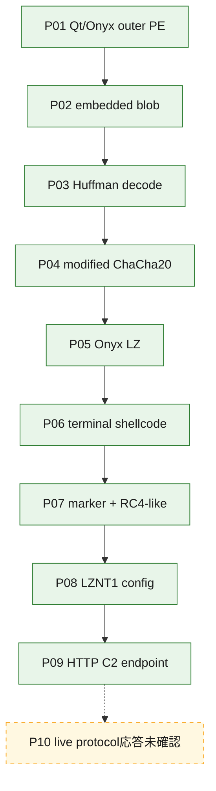
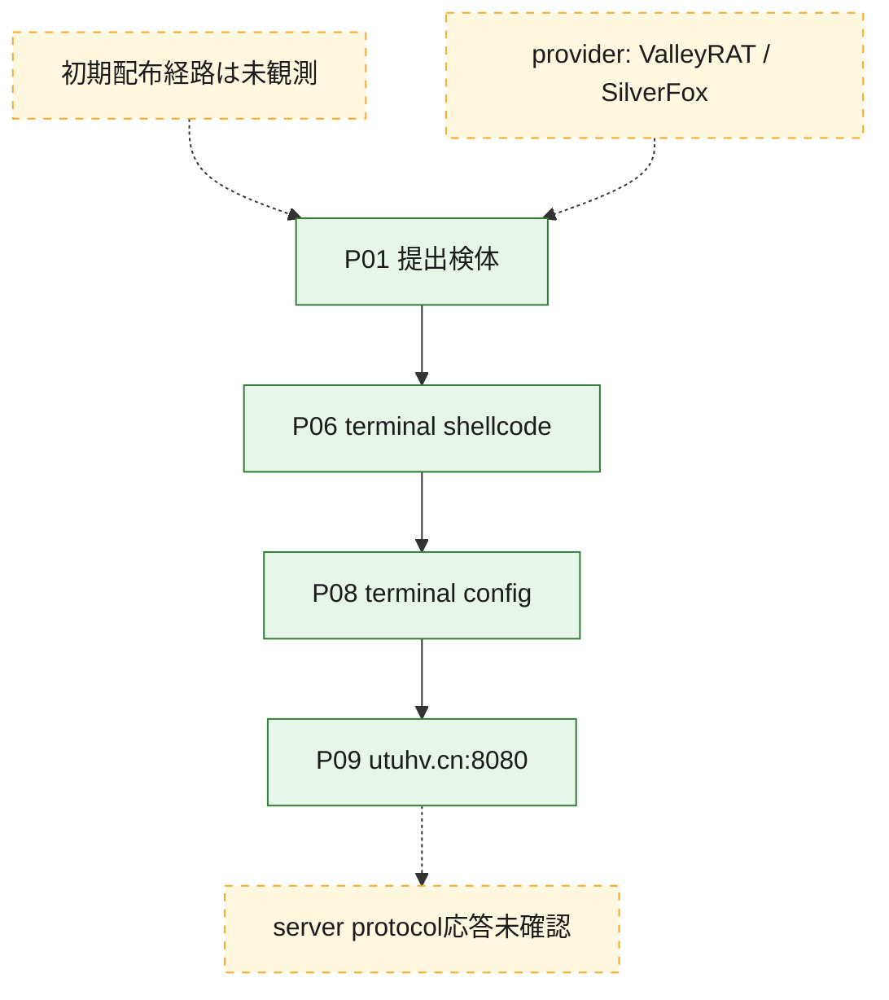
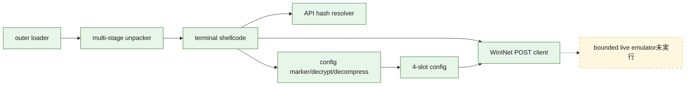

# 全体ロジック：4972c57c77b67c080fca0e1f97e650894f7b60fb50d049ae9f43d83759fad701

Qt/Onyx outer loaderからterminal shellcodeと設定を完全静的に復元しました。静的componentはOnyxですが、MalwareBazaarのValleyRAT/SilverFox tagだけではterminal familyを確定しません。

## 読み方

- 実線は静的に確認した復元・call・設定関係です。
- 点線は初期配布、provider family label、live protocol確認の未解決関係です。
- 代表関数は[静的追加解析](STATIC-DEEP-DIVE.md)を参照してください。

## 静的可視化

### 実行フロー

### 感染チェーン

### モジュール関係

## 処理段階

1. outer blobをHuffman、modified ChaCha20、custom LZの順で復元しました。
2. terminal shellcodeの7代表関数を明示的program selectorで逆コンパイルしました。
3. markerからcustom stream transform後にLZNT1を適用し、2708 bytesの設定を復元しました。
4. 4 slotが同一host、port、HTTP transportを保持することを確認しました。
5. TCP/8080 openは到達性だけで、protocol一致ではありません。

## 比較プロファイルと他ケースとの比較

- `Qt/Onyx metadataと多段復元pipeline`、`terminal WinINet/config schema`の2軸がOnyx componentとして整合します。
- providerのValleyRAT/SilverFox tagは独立したterminal code証拠ではなく、campaign・actor帰属にも使いません。
- 既存ValleyRAT caseとの比較は、config/protocol、復号routine、代表関数fingerprintを揃えてから実施します。
