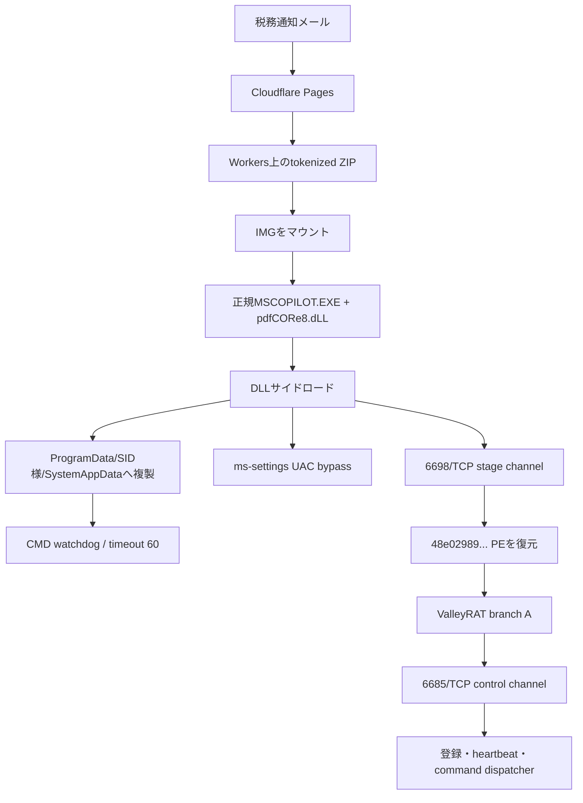

# 全体ロジック

```mermaid
flowchart TD
  A["税務通知メール"] --> B["Cloudflare Pages"]
  B --> C["Workers上のtokenized ZIP"]
  C --> D["IMGをマウント"]
  D --> E["正規MSCOPILOT.EXE + pdfCORe8.dLL"]
  E --> F["DLLサイドロード"]
  F --> G["ProgramData/SID様/SystemAppDataへ複製"]
  F --> H["ms-settings UAC bypass"]
  G --> I["CMD watchdog / timeout 60"]
  F --> J["6698/TCP stage channel"]
  J --> K["48e02989... PEを復元"]
  K --> L["ValleyRAT branch A"]
  L --> M["6685/TCP control channel"]
  M --> N["登録・heartbeat・command dispatcher"]
```

ケース1とは配布domain、外層hash、C2が異なりますが、復元stageとmodule IDが一致します。包装差分と後段コード同一性を別軸で記録しています。
