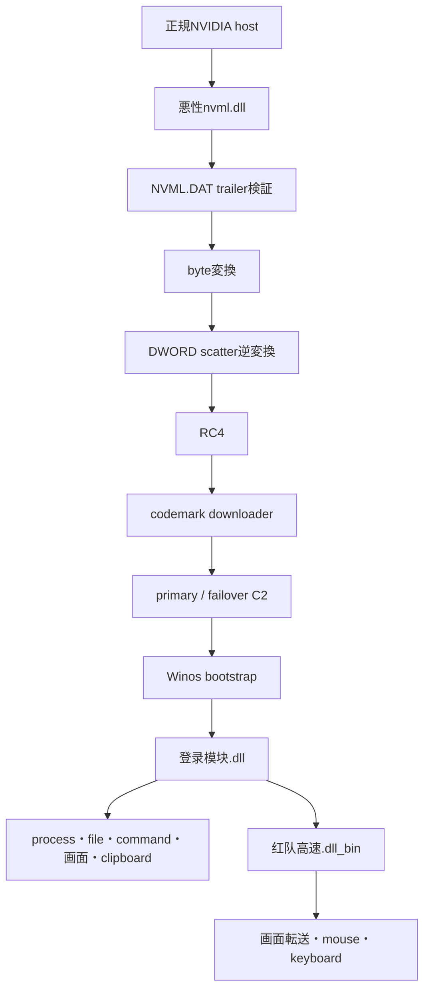

# 全体ロジック

## 処理段階

1. 利用者がIMG内の正規NVIDIA実行ファイルを起動する。
2. WindowsのDLL検索順序により、同梱された悪性`nvml.dll`がサイドロードされる。
3. DLLは`NVML.DAT`を静的parameterどおり復号し、2,160-byte x64 downloaderをAPCで実行する。
4. 同時に正規host、DLL、DATを`Crypto\RuntimeBroker`へ複製し、RunOnceで次回logon時の再実行を確保する。
5. downloaderはcodemarkに格納されたprimary/failoverへ接続し、Winos bootstrapを取得する。
6. bootstrapはWinos frameで端末登録し、主制御`登录模块.dll`を受信する。
7. 主制御moduleはprocess、file、command、画面、clipboard、入力などをdispatchし、必要に応じて`红队高速.dll_bin`を読み込む。
8. 遠隔画面pluginは高速画面転送と入力制御を担当する。

## データフロー

## 類似性へ使える軸

- 9個のNVML exportと同一imphash
- DAT末尾26-byte trailerと3段復号順序
- `QueueUserAPC`とRuntimeBroker RunOnceの組合せ
- codemark内の2 endpoint slot
- Winos module IDとmodule名
- 主制御moduleのshared-memory magic `0x31484d43`

ファイル名やC2だけよりも、これらの独立したロジックを複数組み合わせることで、新しいhashや別campaignでもコード系譜を追跡できます。
