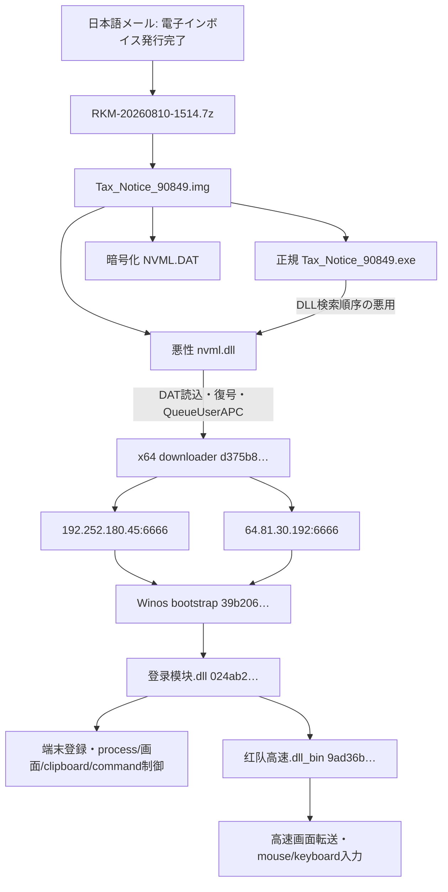
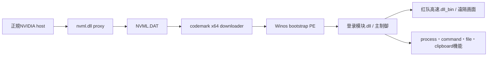
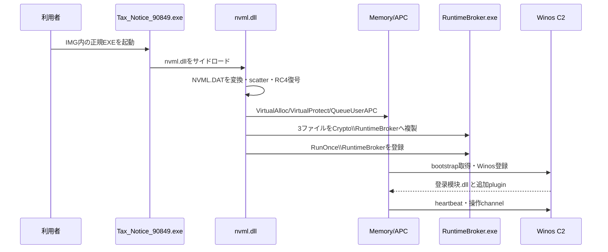

# ValleyRAT 日本語電子インボイス・NVML DATサイドロード（2026-08-10）

## 結論

本ケースは、電子インボイスを装う日本語メールから、`7z → IMG → 正規EXE + nvml.dll + NVML.DAT`へ進むValleyRAT/Winos系の感染チェーンです。悪性DLL、暗号化DAT、復元shellcode、PCAPから復元した3つの後段PEを静的に解析し、終端の主制御moduleまで到達しました。

`192.252.180.45:6666`と`64.81.30.192:6666`は、2026-08-11 03:24 JSTの限定ライブ確認で、最小Winos heartbeatへ正しい`0xC9` frameを返しました。これはTCP port openだけではなく、両endpointでWinos互換C2 protocolが稼働していたことを示します。検体、被害端末情報、追加stage要求、操作commandは送信していません。

ローカルでは検体を実行していません。Triageの既存sandbox結果、PCAP、memory artifactと静的解析だけを使用しました。

今回追加した通信深掘りは、既存PCAPと復元済みbinaryだけを使うオフライン解析です。2026-08-11の履歴的な限定確認は再実施せず、C2、検体、復元payloadへ新たな接続や実行を行っていません。「通信契約を復元した」とは、検体ごとのframe、cipher、方向、command ID、長さ・最小構造を静的分類できる範囲であり、攻撃操作、plugin実行、被害端末作用、結果送信の再現ではありません。

## 配布物と復元層

| 深さ | ファイル・復元物 | SHA-256 | 役割 |
|---|---|---|---|
| 0 | `RKM-20260810-1514.7z` | `6469edd613ceb62dd8e14a75628a6b75fa443ef4311da2b45e805bc7d18afe25` | メール添付。外層本体は未取得で、投稿・VT metadataにより確認 |
| 1 | `Tax_Notice_90849.img` | `f0fdef3caf392f65514f439bbd5e807f9c89f5263d1b7ade0c597c9ed194dc89` | Triageからraw取得しhash一致 |
| 2 | `Tax_Notice_90849.exe` | `93694473622f770d539263ae211dde4715264b0f23c858ba69796adca76cae35` | 正規NVIDIA Debug Dump。悪性IOCにはしない |
| 2 | `nvml.dll` | `31a3852f210044c5beb96515497f1178cb6549e4390ea4c6a1d8b8a5c9ac9639` | NVML proxy、DAT復号、APC実行 |
| 2 | `NVML.DAT` | `2c04749e422e398ee63c6feb23bb015272e0b6ba1b932d4ef6f1a2092a99b650` | 暗号化x64 downloader |
| 3 | 復元x64 downloader | `d375b89b23e5f1479623a21c1335b67a2c748a54e2b610257940dafc13614067` | 2 endpointを持つcodemark shellcode、2,160 bytes |
| 4 | Winos bootstrap PE | `39b206588c743913ce1235c398e7bcea37393afe16b1f5dc26428a659d2add60` | 初期socket/bootstrap、194,048 bytes |
| 5 | `登录模块.dll` | `024ab2a62c91090e576557302c8aadd35ab77303bab4e4c7ba7964d3fccbbf2c` | 主制御module、908,800 bytes |
| 5 | `红队高速.dll_bin` | `9ad36bf24222cc8591c72ea42beaf1b45db27699a67e359f05396b3108946353` | 高速リモート画面・入力操作plugin、652,288 bytes |

PCAPからの3 PEは、独立した`behavioral1`と`behavioral2`の両方で同一SHA-256として復元できました。単一taskの偶発的な誤抽出ではありません。

## 感染チェーン

## module関係

## 実行・永続化フロー

## DAT復号ロジック

`NVML.DAT`末尾26 bytesをheaderとして使用します。復号順序は次のとおりです。

1. `payload_size`、2つのXOR byte、seed、16-byte RC4 key materialを検証する。
2. 各cipher byteへ`~(cipher ^ xor_b) ^ xor_a`を適用する。
3. `seed ^ 0x5A5A5A5A`を初期値とし、LCG `state = state * 0x41C64E6D + 0x3039`でDWORD単位のFisher-Yates scatterを戻す。
4. RC4を適用して2,160-byte x64 downloaderを得る。
5. 復元物のSHA-256と、Triage memory artifactの先頭2,160 bytesが完全一致することを確認する。

RC4 key materialそのものは公開せず、識別用SHA-256 `2fc08d9d65d664fa037acd999501454763c7c388c870fa4b67bc229636287efc`だけを記録します。

## Ghidra関数解析のcoverage

明示selector `/Malware/ValleyRAT/20260810/31a3852f/nvml.dll`では内部5関数をinventory化し、代表4件のうち3件を制約なく解析、DPI thunk 1件を制約付きで解析しました。verified stage selector `/Malware/ValleyRAT/20260810/31a3852f/nvml-stage-static.bin`では内部3関数を全件解析しました。

| program | 代表関数 | 主な役割 |
|---|---|---|
| `nvml.dll` | `HandleNvmlDatProcessAttach` | DAT復号、ntdll unhook、APC予約 |
| `nvml.dll` | `ProcessNvmlDatStageApc` | DPI、管理者判定とrunas、hidden複製、RunOnce、RX stage実行 |
| 復元downloader | `InitializeWinosBootstrap` | PEB/API hash、codemark、slot retry |
| 復元downloader | `ConnectDownloadAndExecuteWinosStage` | 307,214-byte受信、14-byte prefix除外、10-byte反復materialと0x36による復号 |

旧selector `/Malware/ValleyRAT/20260810/31a3852f/nvml-stage.bin`は誤復元かつ関数0件のため使用しません。関数別address、命令数、hash、制約は[特徴関数の静的解析](STATIC-LOGIC.md)に記録しています。

## C2とライブ確認

| endpoint | 静的役割 | 観測役割 | 確認方法 | 結果 | 確度 |
|---|---|---|---|---|---|
| `192.252.180.45:6666` | primary | stage + control | Nmap NSEの最小15-byte Winos heartbeat | 16-byte frame、復号command `0xC9` | 0.95 / 高 |
| `64.81.30.192:6666` | secondary/failover | control | Nmap NSEの最小15-byte Winos heartbeat | 16-byte frame、復号command `0xC9` | 0.95 / 高 |

`192.252.180.45`は`登录模块.dll`と追加pluginの配信もPCAPで確認しました。`64.81.30.192`は今回のPCAPでは端末登録・control trafficを担い、同一module配信は観測していません。

## 通信契約のセッション分離

本chainには契約の異なる4段階があります。predecessor downloaderを通常Winos command sessionとして解釈してはいけません。

| 段階 | exact対象 | frame／cipher | 到達点 |
|---|---|---|---|
| downloader | `d375b89b23e5f1479623a21c1335b67a2c748a54e2b610257940dafc13614067`、selector `/Malware/ValleyRAT/20260810/31a3852f/nvml-stage-static.bin`、`ConnectDownloadAndExecuteWinosStage` (`0x3a8`) | clientは正確に`36 34 00`（ASCII `64\0`）を送り、合計307,214 bytesを受信。14-byte prefixを除いた307,200 bytesを10-byte materialと`0x36`でrolling XOR復号 | stageへの制御移譲。offline emulatorは`stage_handoff_refused`で閉じる |
| bootstrap | `39b206588c743913ce1235c398e7bcea37393afe16b1f5dc26428a659d2add60` | `uint32le total + 10-byte header + payload`、`rolling_header_plus_0x36`。15-byte client `C9` frameあり | module名要求・transfer分類 |
| 主制御 | `024ab2a62c91090e576557302c8aadd35ab77303bab4e4c7ba7964d3fccbbf2c` | 同じ14-byte overhead、rolling方式 | 登録、process、file、画面、設定、delegated plugin分類 |
| remote desktop | `9ad36bf24222cc8591c72ea42beaf1b45db27699a67e359f05396b3108946353` | 同じframeを双方向で使用、rolling方式 | 画面、clipboard、入力、表示設定の方向別分類 |

既存PCAPのbehavioral 1／2では各2 session、計4 sessionが同じ契約に一致しました。requestは`36 34 00`、307,214-byte raw frame SHA-256は`29e111f9412824bedc49f2042f6e7571f4805004935c29d5c8a983179b065891`、10-byte header SHA-256は`01d448afd928065458cf670b60f5a594d735af0172c8d67f22a81680132681ca`、復号307,200-byte body SHA-256は`f0d1e2baa2a33e79c68e3486960a4116acc1805d609607858701ad7ae9674f52`でした。復号先頭は`MZ`ではありません。本文は保存・公開・実行していません。

rolling XORは先頭byteで`header[0] + 0x36`、2 byte目以降で`header[(index - 1) mod 10] + 0x36`を8-bit加算してXORします。header末尾`CA 01`だけではcipherを決定できません。本ケースの`CA01`はrolling方式ですが、日本語マルスパムの`807361fe…`は同じsuffixで固定`0xCC` XORです。

| module | exact Ghidra selector | parser／dispatcher | 静的command coverage |
|---|---|---|---|
| bootstrap | `/Malware/ValleyRAT/20260810/6469edd6/recovered/39b206588c743913ce1235c398e7bcea37393afe16b1f5dc26428a659d2add60.bin` | `FUN_180002bc0`／`FUN_180008c40`、client builder `FUN_180001f10` | server→client `01,04,05,C9` |
| 主制御 | `/Malware/ValleyRAT/20260810/6469edd6/recovered/024ab2a62c91090e576557302c8aadd35ab77303bab4e4c7ba7964d3fccbbf2c.bin` | parser本体`0x1800028d0`（cap比較`0x180002958/95b/960`）／`FUN_180021ca0` | server→client `00`〜`13`,`59`〜`5A`,`64`〜`81`,`C9`,`CA` |
| remote desktop | `/Malware/ValleyRAT/20260810/6469edd6/recovered/9ad36bf24222cc8591c72ea42beaf1b45db27699a67e359f05396b3108946353.bin` | builder `FUN_1800158c0`、parser `FUN_180015e50`、dispatcher `FUN_1800178f0` | server→client `04`〜`14`,`C9`。client→server `00`〜`03`,`17`,`C9` |

bootstrapの`04`は固定100-byte UTF-16名、`01/05`はdescriptor付きmodule transferです。主制御はmodule、画面、drop-and-execute、UTF-16 command line、event log消去、再起動・終了・電源、C2再設定、tunnel、desktop stream、登録を識別します。`64`〜`81`には複数のdelegated handler familyがあります。remote desktopは方向ごとにIDを分離します。

bootstrap／主制御／remote desktop parserで直接確認したprofile内wire total上限は`0x02000000`（32 MiB）です。14-byte overhead後の復号payload上限は`0x01fffff2`（33,554,418 bytes）、module body offset `0xA43`後の1-frame到達上限は`0x01fff5af`（33,551,791 bytes）です。dispatcherのadvertised module limit `0x02000000`自体は単一frameへ収まりません。この値をValleyRAT全変種やCA00／CA01全般へ一般化しません。

offline実装はbounded frame、exact profile、復号、方向別分類、最小構造、状態遷移、metadata-only PCAP replayだけを扱います。本文、UTF-16値、画面、clipboard、入力、被害端末metadataは長さとSHA-256へ縮約し、socket、stage/module load、process/file/registry/service、描画、入力注入、clipboard、電源、plugin callback、wire replyを拒否します。主制御`64`〜`81`のdelegated内部schema、未取得plugin、各操作のresult serializer、実reply bodyは未解決であり、確認済みreply IDもmetadataのみです。完全な互換serverや実作用client emulationは完成扱いにしません。

## 2026-08-04 NVML APC branchとの比較

| 比較項目 | 2026-08-04ケース | 本ケース | 評価 |
|---|---|---|---|
| 正規host | `93694473…` | `93694473…` | 完全一致 |
| DLL構造 | 9 NVML exports、DAT、APC | 同じ9 exports、DAT、APC | 同一loader系譜 |
| DLL imphash | `38635fb6aa9fc723412530df72c15ac2` | 同値 | 強いコード近縁性 |
| 永続化 | Crypto\\RuntimeBroker + RunOnce | 同じ | 同一template |
| C2 | `192.252.180.45:6666` | 同endpoint + `64.81.30.192:6666` | failover拡張 |
| 外層 | ZIP→IMG | 7z→IMG | 容器変更 |

この一致により、両ケースを`nvml_apc_branch`へまとめます。ただし、同じbranchであることは同じactorを自動的に意味しません。

## 検知・自動解析

- NVML proxyの構造判定: `analysis-framework/malware/valleyrat/campaigns/signed_proxy_sideload/analyze.py`
- DAT復号・stage検証: 同campaign配下のNVML DAT unpacker
- Winos PCAP解析: `winos_pcap.py`
- 後段PE復元: `winos_stage_recovery.py`
- protocol確認: `winos_protocol.py`、`analysis-framework/nmap/scripts/valleyrat-c2.nse`
- 永続化Sigma: `analysis-framework/malware/valleyrat/rules/valleyrat_nvml_runtimebroker_runonce.yml`
- 構造YARA: `analysis-framework/malware/valleyrat/rules/signed_proxy_sideload.yar`

## 帰属と制限

ValleyRATは公開報告でSilver FoxやTA4922と関連付けられる場合がありますが、本ケース固有のactor帰属に必要な独立証拠はありません。ここでは`actor_attribution: unresolved`とします。

- 外層7zそのものは取得できず、IMG以降をhash一致で取得しました。
- C2へ追加stageや操作commandを要求していないため、serverが条件付きで配信する全pluginを網羅したとは断定しません。
- `192.252.180.45`が別familyの通信先として使われた履歴は、共有・再利用infrastructureのpivotとしてのみ扱い、同一actorの根拠にはしません。

## 解析データの保全

検体、復号stage、PCAPなどrepository外の73ファイル、合計18,068,264 bytesを、target `valleyrat-nvml-6469edd613ceb62d`としてWinZip AES-256 archiveへまとめました。S3 objectは`s3://malware-analysis-datastore-720232834682/analysis-targets/valleyrat-nvml-6469edd613ceb62d/2026/08/valleyrat-nvml-6469edd613ceb62d-20260810T192543Z-5037d5a703e0.zip`です。

archive SHA-256は`333c6098a7c0acc505ae2c756eb1e49e71769a5cb9a87e337e16f422a6027b39`です。upload後にsize、SSE-S3 `AES256`、archive SHA-256、manifest SHA-256、target metadataの一致を確認しました。

ローカルsourceは自動削除していません。archiveにはGitHub token、API key、AWS credential、`.env`、`creds.txt`、SSH秘密鍵を含めていません。

## 参照

- 観測投稿: <https://x.com/bomccss/status/2086685233056043119>
- Triage: <https://tria.ge/260810-ezt37sar5v>、<https://tria.ge/260810-frgnkswvex>
- ProofpointによるTA4922分析: <https://www.proofpoint.com/us/blog/threat-insight/ta4922-suspected-chinese-crime-group-going-global>
- eSentireによるWinos 4.0技術分析: <https://www.esentire.com/blog/winos4-0-online-module-staging-component-used-in-cleversoar-campaign>
