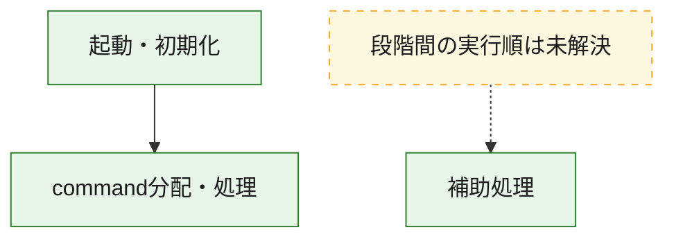
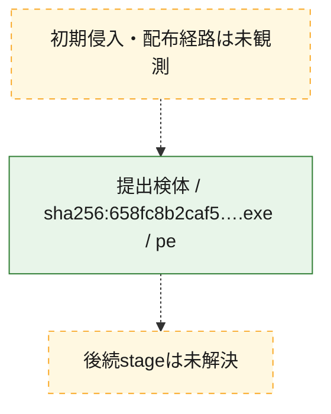
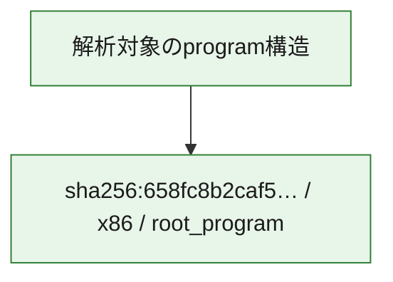

# 全体ロジック：658fc8b2caf56d7572f065bdc7bcf248f1ba3e96901ba6ed3eee4291e524d46e

代表関数の静的証跡から、起動・初期化、command分配・処理の処理群を確認しました。

## 読み方

- phaseの掲載順は解析上の整理順です。observed_call_edgesがない段階間の実行順を断定しません。
- 図の実線は静的に観測した関係、点線と黄色のノードは未観測・未解決の関係を示します。
- 図は静的な要約であり、動的実行を再現するものではありません。
- 詳細な関数解説とfingerprintは[STATIC-LOGIC.md](STATIC-LOGIC.md)を参照してください。

## 静的可視化

### 実行フロー

### 感染チェーン

### モジュール関係

## 処理段階

### 1. 起動・初期化

entry pointから初期化と後続処理への移行を確認します。
確度: `confirmed_static_function_evidence`

- `658fc8b2caf56d7572f065bdc7bcf248f1ba3e96901ba6ed3eee4291e524d46e:ghidra:140042218` — 初期化と主要処理への分岐を行う入口関数です。 状態: `succeeded`、選定理由: `entry_point`, `meaningful_symbol_name`, `reviewed_call_centrality:22`, `role:entrypoint`

### 2. command分配・処理

受信commandやtaskの解釈、分配、個別handlerへの移行を確認します。
確度: `confirmed_static_function_evidence_with_limits`

- `658fc8b2caf56d7572f065bdc7bcf248f1ba3e96901ba6ed3eee4291e524d46e:ghidra:140065ab0` — commandの解釈、分配、または個別処理を担当する関数です。 状態: `limited_bad_instruction_or_flow`、選定理由: `meaningful_symbol_name`, `reviewed_call_centrality:1`, `role:command_dispatch_or_handler`

### 3. 補助処理

主要処理を支える一般内部関数またはlibrary処理を確認します。
確度: `confirmed_static_function_evidence`

- `658fc8b2caf56d7572f065bdc7bcf248f1ba3e96901ba6ed3eee4291e524d46e:ghidra:140001080` — 検体内部の一般処理を実装する関数です。 状態: `succeeded`、選定理由: `context_representative`, `reviewed_call_centrality:1`
- `658fc8b2caf56d7572f065bdc7bcf248f1ba3e96901ba6ed3eee4291e524d46e:ghidra:140001090` — 検体内部の一般処理を実装する関数です。 状態: `succeeded`、選定理由: `context_representative`, `reviewed_call_centrality:1`
- `658fc8b2caf56d7572f065bdc7bcf248f1ba3e96901ba6ed3eee4291e524d46e:ghidra:1400010a0` — 検体内部の一般処理を実装する関数です。 状態: `succeeded`、選定理由: `context_representative`, `reviewed_call_centrality:1`
- `658fc8b2caf56d7572f065bdc7bcf248f1ba3e96901ba6ed3eee4291e524d46e:ghidra:1400010b0` — 検体内部の一般処理を実装する関数です。 状態: `succeeded`、選定理由: `context_representative`, `reviewed_call_centrality:1`
- `658fc8b2caf56d7572f065bdc7bcf248f1ba3e96901ba6ed3eee4291e524d46e:ghidra:1400010c0` — 検体内部の一般処理を実装する関数です。 状態: `succeeded`、選定理由: `context_representative`, `reviewed_call_centrality:1`
- `658fc8b2caf56d7572f065bdc7bcf248f1ba3e96901ba6ed3eee4291e524d46e:ghidra:1400010d0` — 検体内部の一般処理を実装する関数です。 状態: `succeeded`、選定理由: `context_representative`, `reviewed_call_centrality:1`
- `658fc8b2caf56d7572f065bdc7bcf248f1ba3e96901ba6ed3eee4291e524d46e:ghidra:1400010e0` — 検体内部の一般処理を実装する関数です。 状態: `succeeded`、選定理由: `context_representative`, `reviewed_call_centrality:1`
- `658fc8b2caf56d7572f065bdc7bcf248f1ba3e96901ba6ed3eee4291e524d46e:ghidra:1400010f0` — 検体内部の一般処理を実装する関数です。 状態: `succeeded`、選定理由: `context_representative`, `reviewed_call_centrality:1`
- `658fc8b2caf56d7572f065bdc7bcf248f1ba3e96901ba6ed3eee4291e524d46e:ghidra:140001100` — 検体内部の一般処理を実装する関数です。 状態: `succeeded`、選定理由: `context_representative`, `reviewed_call_centrality:1`
- `658fc8b2caf56d7572f065bdc7bcf248f1ba3e96901ba6ed3eee4291e524d46e:ghidra:140001110` — 検体内部の一般処理を実装する関数です。 状態: `succeeded`、選定理由: `context_representative`, `reviewed_call_centrality:1`
- `658fc8b2caf56d7572f065bdc7bcf248f1ba3e96901ba6ed3eee4291e524d46e:ghidra:1400011a0` — 検体内部の一般処理を実装する関数です。 状態: `succeeded`、選定理由: `context_representative`, `reviewed_call_centrality:1`
- `658fc8b2caf56d7572f065bdc7bcf248f1ba3e96901ba6ed3eee4291e524d46e:ghidra:1400011b0` — 検体内部の一般処理を実装する関数です。 状態: `succeeded`、選定理由: `context_representative`, `reviewed_call_centrality:1`
- `658fc8b2caf56d7572f065bdc7bcf248f1ba3e96901ba6ed3eee4291e524d46e:ghidra:1400011c0` — 検体内部の一般処理を実装する関数です。 状態: `succeeded`、選定理由: `context_representative`, `reviewed_call_centrality:1`
- `658fc8b2caf56d7572f065bdc7bcf248f1ba3e96901ba6ed3eee4291e524d46e:ghidra:1400011d0` — 検体内部の一般処理を実装する関数です。 状態: `succeeded`、選定理由: `context_representative`, `reviewed_call_centrality:1`
- `658fc8b2caf56d7572f065bdc7bcf248f1ba3e96901ba6ed3eee4291e524d46e:ghidra:1400011e0` — 検体内部の一般処理を実装する関数です。 状態: `succeeded`、選定理由: `context_representative`, `reviewed_call_centrality:1`
- `658fc8b2caf56d7572f065bdc7bcf248f1ba3e96901ba6ed3eee4291e524d46e:ghidra:1400011f0` — 検体内部の一般処理を実装する関数です。 状態: `succeeded`、選定理由: `context_representative`, `reviewed_call_centrality:1`
- `658fc8b2caf56d7572f065bdc7bcf248f1ba3e96901ba6ed3eee4291e524d46e:ghidra:140001200` — 検体内部の一般処理を実装する関数です。 状態: `succeeded`、選定理由: `context_representative`, `reviewed_call_centrality:1`
- `658fc8b2caf56d7572f065bdc7bcf248f1ba3e96901ba6ed3eee4291e524d46e:ghidra:140001210` — 検体内部の一般処理を実装する関数です。 状態: `succeeded`、選定理由: `context_representative`, `reviewed_call_centrality:1`
- `658fc8b2caf56d7572f065bdc7bcf248f1ba3e96901ba6ed3eee4291e524d46e:ghidra:140001220` — 検体内部の一般処理を実装する関数です。 状態: `succeeded`、選定理由: `context_representative`, `reviewed_call_centrality:1`
- `658fc8b2caf56d7572f065bdc7bcf248f1ba3e96901ba6ed3eee4291e524d46e:ghidra:140001230` — 検体内部の一般処理を実装する関数です。 状態: `succeeded`、選定理由: `context_representative`, `reviewed_call_centrality:1`
- `658fc8b2caf56d7572f065bdc7bcf248f1ba3e96901ba6ed3eee4291e524d46e:ghidra:140001240` — 検体内部の一般処理を実装する関数です。 状態: `succeeded`、選定理由: `context_representative`, `reviewed_call_centrality:1`
- `658fc8b2caf56d7572f065bdc7bcf248f1ba3e96901ba6ed3eee4291e524d46e:ghidra:140001250` — 検体内部の一般処理を実装する関数です。 状態: `succeeded`、選定理由: `context_representative`, `reviewed_call_centrality:1`
- `658fc8b2caf56d7572f065bdc7bcf248f1ba3e96901ba6ed3eee4291e524d46e:ghidra:140001260` — 検体内部の一般処理を実装する関数です。 状態: `succeeded`、選定理由: `context_representative`, `reviewed_call_centrality:1`
- `658fc8b2caf56d7572f065bdc7bcf248f1ba3e96901ba6ed3eee4291e524d46e:ghidra:140001270` — 検体内部の一般処理を実装する関数です。 状態: `succeeded`、選定理由: `context_representative`, `reviewed_call_centrality:1`
- `658fc8b2caf56d7572f065bdc7bcf248f1ba3e96901ba6ed3eee4291e524d46e:ghidra:140001280` — 検体内部の一般処理を実装する関数です。 状態: `succeeded`、選定理由: `context_representative`, `reviewed_call_centrality:1`
- `658fc8b2caf56d7572f065bdc7bcf248f1ba3e96901ba6ed3eee4291e524d46e:ghidra:140001290` — 検体内部の一般処理を実装する関数です。 状態: `succeeded`、選定理由: `context_representative`, `reviewed_call_centrality:1`
- `658fc8b2caf56d7572f065bdc7bcf248f1ba3e96901ba6ed3eee4291e524d46e:ghidra:1400012c0` — 検体内部の一般処理を実装する関数です。 状態: `succeeded`、選定理由: `context_representative`, `reviewed_call_centrality:1`
- `658fc8b2caf56d7572f065bdc7bcf248f1ba3e96901ba6ed3eee4291e524d46e:ghidra:1400012d0` — 検体内部の一般処理を実装する関数です。 状態: `succeeded`、選定理由: `context_representative`, `reviewed_call_centrality:1`
- `658fc8b2caf56d7572f065bdc7bcf248f1ba3e96901ba6ed3eee4291e524d46e:ghidra:1400012e0` — 検体内部の一般処理を実装する関数です。 状態: `succeeded`、選定理由: `context_representative`, `reviewed_call_centrality:1`
- `658fc8b2caf56d7572f065bdc7bcf248f1ba3e96901ba6ed3eee4291e524d46e:ghidra:14003fc28` — 検体内部の一般処理を実装する関数です。 状態: `succeeded`、選定理由: `meaningful_symbol_name`

## 観測したcall関係

- `658fc8b2caf56d7572f065bdc7bcf248f1ba3e96901ba6ed3eee4291e524d46e:ghidra:140042218` → `658fc8b2caf56d7572f065bdc7bcf248f1ba3e96901ba6ed3eee4291e524d46e:ghidra:140065ab0` （`startup` → `dispatch`）
- `ghidra-function:11ff208fe283e77501667aa9` → `ghidra-function:53800118919d615e2d459377` （`unclassified` → `unclassified`）
- `ghidra-function:20d22db17ca90601b658cccc` → `ghidra-function:53800118919d615e2d459377` （`unclassified` → `unclassified`）
- `ghidra-function:26a1cb9a822c9bee4aad2788` → `ghidra-function:53800118919d615e2d459377` （`unclassified` → `unclassified`）
- `ghidra-function:27b699b6dc39d04252b869b3` → `ghidra-function:53800118919d615e2d459377` （`unclassified` → `unclassified`）
- `ghidra-function:2922d80435c7750881aa35d6` → `ghidra-function:53800118919d615e2d459377` （`unclassified` → `unclassified`）
- `ghidra-function:31770ba7224d87a499820f9d` → `ghidra-function:53800118919d615e2d459377` （`unclassified` → `unclassified`）
- `ghidra-function:47efbd4b55d9a94fc12e307b` → `ghidra-function:53800118919d615e2d459377` （`unclassified` → `unclassified`）
- `ghidra-function:4abc08ef3b959d768d9a111c` → `ghidra-function:53800118919d615e2d459377` （`unclassified` → `unclassified`）
- `ghidra-function:4b68499858b4564a704cb81a` → `ghidra-function:53800118919d615e2d459377` （`unclassified` → `unclassified`）
- `ghidra-function:5ea31afa0df9f9472486d0cc` → `ghidra-function:53800118919d615e2d459377` （`unclassified` → `unclassified`）
- `ghidra-function:61ee18634a6b171e78fd0a26` → `ghidra-function:53800118919d615e2d459377` （`unclassified` → `unclassified`）
- `ghidra-function:6d5521801f01bd7ba9accff2` → `ghidra-external:221cbb8a0ffe150af058f59f` （`unclassified` → `unclassified`）
- `ghidra-function:6d5521801f01bd7ba9accff2` → `ghidra-external:2eaa3066b71cc0a9af8e3a1b` （`unclassified` → `unclassified`）
- `ghidra-function:6d5521801f01bd7ba9accff2` → `ghidra-external:4c02f99bae3ee877de5e03ef` （`unclassified` → `unclassified`）
- `ghidra-function:6d5521801f01bd7ba9accff2` → `ghidra-external:5661ee1d643a1ddda27e6550` （`unclassified` → `unclassified`）
- `ghidra-function:6d5521801f01bd7ba9accff2` → `ghidra-external:68756b828c4b63c8cbb3fd87` （`unclassified` → `unclassified`）
- `ghidra-function:6d5521801f01bd7ba9accff2` → `ghidra-external:8a0d12c81bbdf0001277a366` （`unclassified` → `unclassified`）
- `ghidra-function:6d5521801f01bd7ba9accff2` → `ghidra-external:92b18893627c6c69d0877e1b` （`unclassified` → `unclassified`）
- `ghidra-function:6d5521801f01bd7ba9accff2` → `ghidra-external:a4eaca5ce3bbe7b660f4b0be` （`unclassified` → `unclassified`）
- `ghidra-function:6d5521801f01bd7ba9accff2` → `ghidra-function:1c77d6764329fdc3303ec8c3` （`unclassified` → `unclassified`）
- `ghidra-function:6d5521801f01bd7ba9accff2` → `ghidra-function:2167ec19323e78e75301558f` （`unclassified` → `unclassified`）
- `ghidra-function:6d5521801f01bd7ba9accff2` → `ghidra-function:2a658e039dd2235d3dbc044d` （`unclassified` → `unclassified`）
- `ghidra-function:6d5521801f01bd7ba9accff2` → `ghidra-function:63225351d29674a35f5dda21` （`unclassified` → `unclassified`）
- `ghidra-function:6d5521801f01bd7ba9accff2` → `ghidra-function:68a458bf36c3ea657cc1aff8` （`unclassified` → `unclassified`）
- `ghidra-function:6d5521801f01bd7ba9accff2` → `ghidra-function:714af05316173b7ac8ec2e49` （`unclassified` → `unclassified`）
- `ghidra-function:6d5521801f01bd7ba9accff2` → `ghidra-function:8708bbc800d6ac6c368a1dd6` （`unclassified` → `unclassified`）
- `ghidra-function:6d5521801f01bd7ba9accff2` → `ghidra-function:8dd5a70c8a395d28808ac903` （`unclassified` → `unclassified`）
- `ghidra-function:6d5521801f01bd7ba9accff2` → `ghidra-function:a2b76427e001658da544f0fe` （`unclassified` → `unclassified`）
- `ghidra-function:6d5521801f01bd7ba9accff2` → `ghidra-function:a5d8c6d6a2a11e88f7ce9a58` （`unclassified` → `unclassified`）
- `ghidra-function:6d5521801f01bd7ba9accff2` → `ghidra-function:bdba671cfd81305c926ee207` （`unclassified` → `unclassified`）
- `ghidra-function:6d5521801f01bd7ba9accff2` → `ghidra-function:d716ef22c4be0c2bac4ebdd7` （`unclassified` → `unclassified`）
- `ghidra-function:6d5521801f01bd7ba9accff2` → `ghidra-function:e147a1d05f7a98b9b33d95b8` （`unclassified` → `unclassified`）
- `ghidra-function:6d5521801f01bd7ba9accff2` → `ghidra-function:ebaa17189bed5321d2338823` （`unclassified` → `unclassified`）
- `ghidra-function:71845a91acfc51a3b23f2524` → `ghidra-function:53800118919d615e2d459377` （`unclassified` → `unclassified`）
- `ghidra-function:77ef20a9b408288db1f88eba` → `ghidra-function:53800118919d615e2d459377` （`unclassified` → `unclassified`）
- `ghidra-function:7c61c8dd2ddef0bef537b7fe` → `ghidra-function:53800118919d615e2d459377` （`unclassified` → `unclassified`）
- `ghidra-function:81f37b4d9e9a6c77dc622134` → `ghidra-function:53800118919d615e2d459377` （`unclassified` → `unclassified`）
- `ghidra-function:8321cd09296392e5f3ee98a5` → `ghidra-function:53800118919d615e2d459377` （`unclassified` → `unclassified`）
- `ghidra-function:953213b90122e5af88287ff7` → `ghidra-function:53800118919d615e2d459377` （`unclassified` → `unclassified`）
- `ghidra-function:9cfd90fbf19d116054a27fc1` → `ghidra-function:53800118919d615e2d459377` （`unclassified` → `unclassified`）
- `ghidra-function:9e77a68d05c66f6ef800d3ee` → `ghidra-function:53800118919d615e2d459377` （`unclassified` → `unclassified`）
- `ghidra-function:a189cbb542b0c06221a9a7f1` → `ghidra-function:53800118919d615e2d459377` （`unclassified` → `unclassified`）
- `ghidra-function:a8a080ca4635b5e89b8cdf75` → `ghidra-function:53800118919d615e2d459377` （`unclassified` → `unclassified`）
- `ghidra-function:b4e509f09be808342d90a7d3` → `ghidra-function:53800118919d615e2d459377` （`unclassified` → `unclassified`）
- `ghidra-function:c14fe3cc5d4cd2647ad6dc2a` → `ghidra-function:53800118919d615e2d459377` （`unclassified` → `unclassified`）
- `ghidra-function:d5fa000ae140135c328770b7` → `ghidra-function:53800118919d615e2d459377` （`unclassified` → `unclassified`）
- `ghidra-function:ee54b099d7d25666884dd768` → `ghidra-function:53800118919d615e2d459377` （`unclassified` → `unclassified`）
- `ghidra-function:ee8bbbd42993e6d9e849ae89` → `ghidra-function:53800118919d615e2d459377` （`unclassified` → `unclassified`）
- `ghidra-function:f35e3088a91d59cccecf49cb` → `ghidra-function:53800118919d615e2d459377` （`unclassified` → `unclassified`）
- `ghidra-function:fafcb0895ee71cdc0d00d0e2` → `ghidra-function:53800118919d615e2d459377` （`unclassified` → `unclassified`）
- `ghidra-function:fd06a229b9c068e1a5bc5f25` → `ghidra-function:53800118919d615e2d459377` （`unclassified` → `unclassified`）

## 解析範囲と制約

- 選定外関数は全体inventoryへ残しますが、関数本体の個別解説対象にはしていません。
- indirect call、難読化、packer、VM、壊れたcontrol flowによりcall関係が欠落する場合があります。
- 文書は静的解析に基づき、検体実行や外部通信による動的確認は行っていません。
