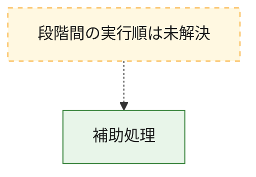
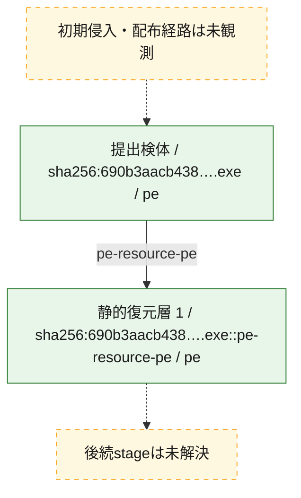
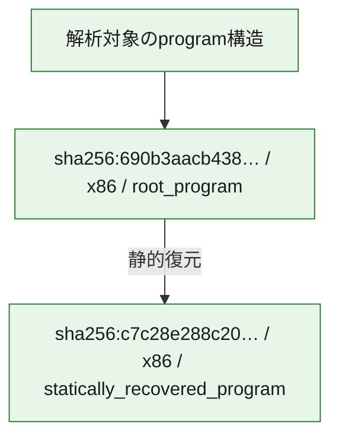

# 全体ロジック：690b3aacb438e50788ca6018d18caa7bd1d18121e71649e7d2e36067919ca0d6

代表関数から主要なmalware処理段階を自動分類できませんでした。

## 読み方

- phaseの掲載順は解析上の整理順です。observed_call_edgesがない段階間の実行順を断定しません。
- 図の実線は静的に観測した関係、点線と黄色のノードは未観測・未解決の関係を示します。
- 図は静的な要約であり、動的実行を再現するものではありません。
- 詳細な関数解説とfingerprintは[STATIC-LOGIC.md](STATIC-LOGIC.md)を参照してください。

## 静的可視化

### 実行フロー

### 感染チェーン

### モジュール関係

## 処理段階

### 1. 補助処理

主要処理を支える一般内部関数またはlibrary処理を確認します。
確度: `confirmed_static_function_evidence`

- `690b3aacb438e50788ca6018d18caa7bd1d18121e71649e7d2e36067919ca0d6:ghidra:140001060` — 検体内部の一般処理を実装する関数です。 状態: `succeeded`、選定理由: `context_representative`, `reviewed_call_centrality:2`
- `690b3aacb438e50788ca6018d18caa7bd1d18121e71649e7d2e36067919ca0d6:ghidra:14000107c` — 検体内部の一般処理を実装する関数です。 状態: `succeeded`、選定理由: `context_representative`, `reviewed_call_centrality:2`
- `690b3aacb438e50788ca6018d18caa7bd1d18121e71649e7d2e36067919ca0d6:ghidra:140001098` — 検体内部の一般処理を実装する関数です。 状態: `succeeded`、選定理由: `context_representative`, `reviewed_call_centrality:2`
- `690b3aacb438e50788ca6018d18caa7bd1d18121e71649e7d2e36067919ca0d6:ghidra:140001114` — 検体内部の一般処理を実装する関数です。 状態: `succeeded`、選定理由: `context_representative`, `reviewed_call_centrality:2`
- `690b3aacb438e50788ca6018d18caa7bd1d18121e71649e7d2e36067919ca0d6:ghidra:14000113c` — 検体内部の一般処理を実装する関数です。 状態: `succeeded`、選定理由: `context_representative`, `reviewed_call_centrality:2`
- `690b3aacb438e50788ca6018d18caa7bd1d18121e71649e7d2e36067919ca0d6:ghidra:14000116c` — 検体内部の一般処理を実装する関数です。 状態: `succeeded`、選定理由: `context_representative`, `reviewed_call_centrality:4`
- `690b3aacb438e50788ca6018d18caa7bd1d18121e71649e7d2e36067919ca0d6:ghidra:140001204` — 検体内部の一般処理を実装する関数です。 状態: `succeeded`、選定理由: `context_representative`, `reviewed_call_centrality:2`
- `690b3aacb438e50788ca6018d18caa7bd1d18121e71649e7d2e36067919ca0d6:ghidra:140001224` — 検体内部の一般処理を実装する関数です。 状態: `succeeded`、選定理由: `context_representative`, `reviewed_call_centrality:2`
- `690b3aacb438e50788ca6018d18caa7bd1d18121e71649e7d2e36067919ca0d6:ghidra:1400012a4` — 検体内部の一般処理を実装する関数です。 状態: `succeeded`、選定理由: `context_representative`, `reviewed_call_centrality:2`
- `690b3aacb438e50788ca6018d18caa7bd1d18121e71649e7d2e36067919ca0d6:ghidra:1400012c4` — 検体内部の一般処理を実装する関数です。 状態: `succeeded`、選定理由: `context_representative`, `reviewed_call_centrality:2`
- `690b3aacb438e50788ca6018d18caa7bd1d18121e71649e7d2e36067919ca0d6:ghidra:1400012f4` — 検体内部の一般処理を実装する関数です。 状態: `succeeded`、選定理由: `context_representative`, `reviewed_call_centrality:3`
- `690b3aacb438e50788ca6018d18caa7bd1d18121e71649e7d2e36067919ca0d6:ghidra:140001324` — 検体内部の一般処理を実装する関数です。 状態: `succeeded`、選定理由: `context_representative`, `reviewed_call_centrality:2`
- `690b3aacb438e50788ca6018d18caa7bd1d18121e71649e7d2e36067919ca0d6:ghidra:140001354` — 検体内部の一般処理を実装する関数です。 状態: `succeeded`、選定理由: `context_representative`, `reviewed_call_centrality:4`
- `690b3aacb438e50788ca6018d18caa7bd1d18121e71649e7d2e36067919ca0d6:ghidra:1400013dc` — 検体内部の一般処理を実装する関数です。 状態: `succeeded`、選定理由: `context_representative`, `reviewed_call_centrality:2`
- `690b3aacb438e50788ca6018d18caa7bd1d18121e71649e7d2e36067919ca0d6:ghidra:140001434` — 検体内部の一般処理を実装する関数です。 状態: `succeeded`、選定理由: `context_representative`, `reviewed_call_centrality:2`
- `690b3aacb438e50788ca6018d18caa7bd1d18121e71649e7d2e36067919ca0d6:ghidra:140001454` — 検体内部の一般処理を実装する関数です。 状態: `succeeded`、選定理由: `context_representative`, `reviewed_call_centrality:2`
- `690b3aacb438e50788ca6018d18caa7bd1d18121e71649e7d2e36067919ca0d6:ghidra:140001484` — 検体内部の一般処理を実装する関数です。 状態: `succeeded`、選定理由: `context_representative`, `reviewed_call_centrality:3`
- `690b3aacb438e50788ca6018d18caa7bd1d18121e71649e7d2e36067919ca0d6:ghidra:1400014b4` — 検体内部の一般処理を実装する関数です。 状態: `succeeded`、選定理由: `context_representative`, `reviewed_call_centrality:2`
- `690b3aacb438e50788ca6018d18caa7bd1d18121e71649e7d2e36067919ca0d6:ghidra:1400014e0` — 検体内部の一般処理を実装する関数です。 状態: `succeeded`、選定理由: `context_representative`, `reviewed_call_centrality:2`
- `690b3aacb438e50788ca6018d18caa7bd1d18121e71649e7d2e36067919ca0d6:ghidra:140001528` — 検体内部の一般処理を実装する関数です。 状態: `succeeded`、選定理由: `context_representative`, `reviewed_call_centrality:3`
- `690b3aacb438e50788ca6018d18caa7bd1d18121e71649e7d2e36067919ca0d6:ghidra:14000156c` — 検体内部の一般処理を実装する関数です。 状態: `succeeded`、選定理由: `context_representative`, `reviewed_call_centrality:2`
- `690b3aacb438e50788ca6018d18caa7bd1d18121e71649e7d2e36067919ca0d6:ghidra:1400015a8` — 検体内部の一般処理を実装する関数です。 状態: `succeeded`、選定理由: `context_representative`, `reviewed_call_centrality:2`
- `690b3aacb438e50788ca6018d18caa7bd1d18121e71649e7d2e36067919ca0d6:ghidra:14000161c` — 検体内部の一般処理を実装する関数です。 状態: `succeeded`、選定理由: `context_representative`, `reviewed_call_centrality:2`
- `690b3aacb438e50788ca6018d18caa7bd1d18121e71649e7d2e36067919ca0d6:ghidra:140001678` — 検体内部の一般処理を実装する関数です。 状態: `succeeded`、選定理由: `context_representative`, `reviewed_call_centrality:2`
- `690b3aacb438e50788ca6018d18caa7bd1d18121e71649e7d2e36067919ca0d6:ghidra:1400016ac` — 検体内部の一般処理を実装する関数です。 状態: `succeeded`、選定理由: `context_representative`, `reviewed_call_centrality:2`
- `690b3aacb438e50788ca6018d18caa7bd1d18121e71649e7d2e36067919ca0d6:ghidra:1400016d4` — 検体内部の一般処理を実装する関数です。 状態: `succeeded`、選定理由: `context_representative`, `reviewed_call_centrality:2`
- `690b3aacb438e50788ca6018d18caa7bd1d18121e71649e7d2e36067919ca0d6:ghidra:140001710` — 検体内部の一般処理を実装する関数です。 状態: `succeeded`、選定理由: `context_representative`, `reviewed_call_centrality:2`
- `690b3aacb438e50788ca6018d18caa7bd1d18121e71649e7d2e36067919ca0d6:ghidra:140001738` — 検体内部の一般処理を実装する関数です。 状態: `succeeded`、選定理由: `context_representative`, `reviewed_call_centrality:2`
- `690b3aacb438e50788ca6018d18caa7bd1d18121e71649e7d2e36067919ca0d6:ghidra:140001780` — 検体内部の一般処理を実装する関数です。 状態: `succeeded`、選定理由: `context_representative`, `reviewed_call_centrality:3`
- `690b3aacb438e50788ca6018d18caa7bd1d18121e71649e7d2e36067919ca0d6:ghidra:1400017a0` — 検体内部の一般処理を実装する関数です。 状態: `succeeded`、選定理由: `context_representative`, `reviewed_call_centrality:1`
- `690b3aacb438e50788ca6018d18caa7bd1d18121e71649e7d2e36067919ca0d6:ghidra:1400017c4` — 検体内部の一般処理を実装する関数です。 状態: `succeeded`、選定理由: `context_representative`, `reviewed_call_centrality:2`
- `690b3aacb438e50788ca6018d18caa7bd1d18121e71649e7d2e36067919ca0d6:ghidra:1400017f0` — 検体内部の一般処理を実装する関数です。 状態: `succeeded`、選定理由: `context_representative`, `reviewed_call_centrality:2`

## 観測したcall関係

- 代表関数間で直接解決できた呼出関係はありません。

## 解析範囲と制約

- 選定外関数は全体inventoryへ残しますが、関数本体の個別解説対象にはしていません。
- indirect call、難読化、packer、VM、壊れたcontrol flowによりcall関係が欠落する場合があります。
- 文書は静的解析に基づき、検体実行や外部通信による動的確認は行っていません。
