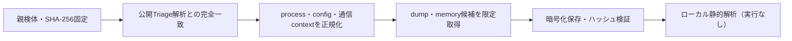

# Triage公開解析・後段取得証跡

## 完全ハッシュ一致

- [260807-td6bnsygkd](https://tria.ge/260807-td6bnsygkd): ファミリー候補 `未確定`、評価score `None`
- [260807-s7452agm4x](https://tria.ge/260807-s7452agm4x): ファミリー候補 `未確定`、評価score `None`

## プロセス・通信

- 観測process: `取得できず`
- raw commandは保存せず、command SHA-256と処理patternだけをJSONへ保持します。
- sandbox background trafficは`context_only`であり、C2へ自動昇格しません。

- 取得できませんでした。

## 後段取得物

- `010e89e706fb7be0514294070fe92466278495006e8ff5c82d620f1cc96b32c5` / `memory_image` / 167936 bytes / 親と同一: `false` / 静的解析: `未実施`
- `8028b361c00020b5d2c6e9b09cc2ae0fec8ead81c19ddae864d28ff931da939e` / `memory_image` / 167936 bytes / 親と同一: `false` / 静的解析: `未実施`

## 判定境界

Triage由来のfamily、process、config、通信は外部sandbox証跡です。Config extractorが返したendpointはC2候補として扱いますが、静的設定復元またはprocess帰属とprotocol応答が揃うまでは確認済みC2とはしません。取得成果物と検体は実行していません。
