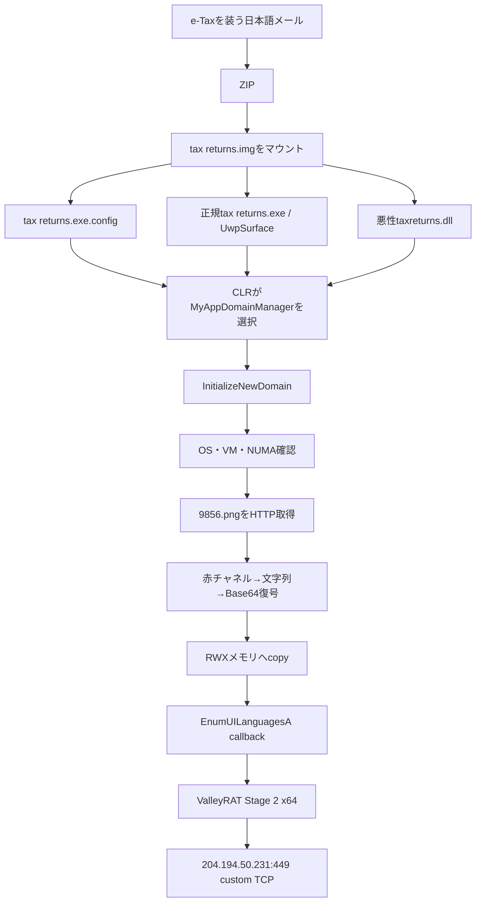

# 全体ロジック

```mermaid
flowchart TD
  A["e-Taxを装う日本語メール"] --> B["ZIP"]
  B --> C["tax returns.imgをマウント"]
  C --> D["正規tax returns.exe / UwpSurface"]
  C --> E["tax returns.exe.config"]
  C --> F["悪性taxreturns.dll"]
  E --> G["CLRがMyAppDomainManagerを選択"]
  D --> G
  F --> G
  G --> H["InitializeNewDomain"]
  H --> I["OS・VM・NUMA確認"]
  I --> J["9856.pngをHTTP取得"]
  J --> K["赤チャネル→文字列→Base64復号"]
  K --> L["RWXメモリへcopy"]
  L --> M["EnumUILanguagesA callback"]
  M --> N["ValleyRAT Stage 2 x64"]
  N --> O["204.194.50.231:449 custom TCP"]
```

AppDomainManagerは通常のDLLサイドロードとは異なり、CLR設定を入口にします。画像は単なるdecoyではなくshellcode carrierです。外層ローダーと後段Stage 2を別moduleとして記録しています。
