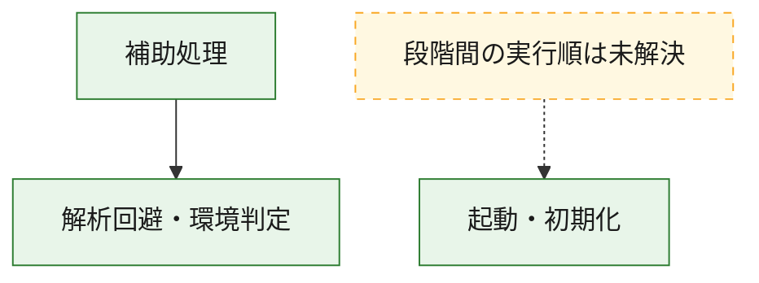
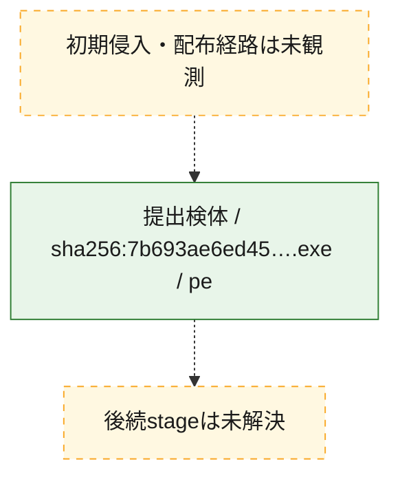
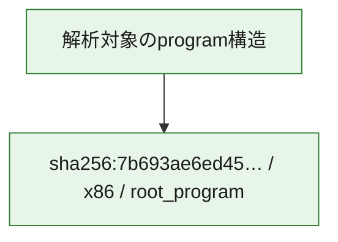

# 全体ロジック：7b693ae6ed452fd1a584b321d236ce7305e3281b55497e5963060bd0d5db2ac4

代表関数の静的証跡から、起動・初期化、解析回避・環境判定の処理群を確認しました。

## 読み方

- phaseの掲載順は解析上の整理順です。observed_call_edgesがない段階間の実行順を断定しません。
- 図の実線は静的に観測した関係、点線と黄色のノードは未観測・未解決の関係を示します。
- 図は静的な要約であり、動的実行を再現するものではありません。
- 詳細な関数解説とfingerprintは[STATIC-LOGIC.md](STATIC-LOGIC.md)を参照してください。

## 静的可視化

### 実行フロー

### 感染チェーン

### モジュール関係

## 処理段階

### 1. 起動・初期化

entry pointから初期化と後続処理への移行を確認します。
確度: `confirmed_static_function_evidence`

- `7b693ae6ed452fd1a584b321d236ce7305e3281b55497e5963060bd0d5db2ac4:ghidra:14001b384` — 初期化と主要処理への分岐を行う入口関数です。 状態: `succeeded`、選定理由: `entry_point`, `meaningful_symbol_name`, `reviewed_call_centrality:22`, `role:entrypoint`

### 2. 解析回避・環境判定

debugger、sandbox、仮想環境、時間差などの判定を確認します。
確度: `confirmed_static_function_evidence`

- `7b693ae6ed452fd1a584b321d236ce7305e3281b55497e5963060bd0d5db2ac4:ghidra:140001820` — debugger、仮想環境、sandbox、または時間差の確認に関係する関数です。 状態: `succeeded`、選定理由: `context_representative`, `reviewed_call_centrality:6`, `role:anti_analysis`

### 3. 補助処理

主要処理を支える一般内部関数またはlibrary処理を確認します。
確度: `confirmed_static_function_evidence`

- `7b693ae6ed452fd1a584b321d236ce7305e3281b55497e5963060bd0d5db2ac4:ghidra:140001040` — 検体内部の一般処理を実装する関数です。 状態: `succeeded`、選定理由: `context_representative`
- `7b693ae6ed452fd1a584b321d236ce7305e3281b55497e5963060bd0d5db2ac4:ghidra:1400010c0` — 検体内部の一般処理を実装する関数です。 状態: `succeeded`、選定理由: `context_representative`, `reviewed_call_centrality:2`
- `7b693ae6ed452fd1a584b321d236ce7305e3281b55497e5963060bd0d5db2ac4:ghidra:140001270` — 検体内部の一般処理を実装する関数です。 状態: `succeeded`、選定理由: `context_representative`, `reviewed_call_centrality:1`
- `7b693ae6ed452fd1a584b321d236ce7305e3281b55497e5963060bd0d5db2ac4:ghidra:1400012f0` — 検体内部の一般処理を実装する関数です。 状態: `succeeded`、選定理由: `context_representative`, `reviewed_call_centrality:4`
- `7b693ae6ed452fd1a584b321d236ce7305e3281b55497e5963060bd0d5db2ac4:ghidra:140001600` — 検体内部の一般処理を実装する関数です。 状態: `succeeded`、選定理由: `context_representative`, `reviewed_call_centrality:4`
- `7b693ae6ed452fd1a584b321d236ce7305e3281b55497e5963060bd0d5db2ac4:ghidra:140001870` — 検体内部の一般処理を実装する関数です。 状態: `succeeded`、選定理由: `context_representative`, `reviewed_call_centrality:2`
- `7b693ae6ed452fd1a584b321d236ce7305e3281b55497e5963060bd0d5db2ac4:ghidra:1400019c0` — 検体内部の一般処理を実装する関数です。 状態: `succeeded`、選定理由: `context_representative`, `reviewed_call_centrality:1`
- `7b693ae6ed452fd1a584b321d236ce7305e3281b55497e5963060bd0d5db2ac4:ghidra:140001a80` — 検体内部の一般処理を実装する関数です。 状態: `succeeded`、選定理由: `context_representative`, `reviewed_call_centrality:9`
- `7b693ae6ed452fd1a584b321d236ce7305e3281b55497e5963060bd0d5db2ac4:ghidra:140001df0` — 検体内部の一般処理を実装する関数です。 状態: `succeeded`、選定理由: `context_representative`, `reviewed_call_centrality:6`
- `7b693ae6ed452fd1a584b321d236ce7305e3281b55497e5963060bd0d5db2ac4:ghidra:1400020b0` — 検体内部の一般処理を実装する関数です。 状態: `succeeded`、選定理由: `context_representative`, `reviewed_call_centrality:2`
- `7b693ae6ed452fd1a584b321d236ce7305e3281b55497e5963060bd0d5db2ac4:ghidra:140002570` — 検体内部の一般処理を実装する関数です。 状態: `succeeded`、選定理由: `context_representative`, `reviewed_call_centrality:1`
- `7b693ae6ed452fd1a584b321d236ce7305e3281b55497e5963060bd0d5db2ac4:ghidra:140002630` — 検体内部の一般処理を実装する関数です。 状態: `succeeded`、選定理由: `context_representative`, `reviewed_call_centrality:12`
- `7b693ae6ed452fd1a584b321d236ce7305e3281b55497e5963060bd0d5db2ac4:ghidra:140002b20` — 検体内部の一般処理を実装する関数です。 状態: `succeeded`、選定理由: `context_representative`, `reviewed_call_centrality:2`
- `7b693ae6ed452fd1a584b321d236ce7305e3281b55497e5963060bd0d5db2ac4:ghidra:140002b40` — 検体内部の一般処理を実装する関数です。 状態: `succeeded`、選定理由: `context_representative`, `reviewed_call_centrality:2`
- `7b693ae6ed452fd1a584b321d236ce7305e3281b55497e5963060bd0d5db2ac4:ghidra:140002bf0` — 検体内部の一般処理を実装する関数です。 状態: `succeeded`、選定理由: `context_representative`, `reviewed_call_centrality:4`
- `7b693ae6ed452fd1a584b321d236ce7305e3281b55497e5963060bd0d5db2ac4:ghidra:140002fe0` — 検体内部の一般処理を実装する関数です。 状態: `succeeded`、選定理由: `context_representative`, `reviewed_call_centrality:4`
- `7b693ae6ed452fd1a584b321d236ce7305e3281b55497e5963060bd0d5db2ac4:ghidra:140003020` — 検体内部の一般処理を実装する関数です。 状態: `succeeded`、選定理由: `context_representative`, `reviewed_call_centrality:4`
- `7b693ae6ed452fd1a584b321d236ce7305e3281b55497e5963060bd0d5db2ac4:ghidra:1400030b0` — 検体内部の一般処理を実装する関数です。 状態: `succeeded`、選定理由: `context_representative`, `reviewed_call_centrality:3`
- `7b693ae6ed452fd1a584b321d236ce7305e3281b55497e5963060bd0d5db2ac4:ghidra:1400032b0` — 検体内部の一般処理を実装する関数です。 状態: `succeeded`、選定理由: `context_representative`, `reviewed_call_centrality:3`
- `7b693ae6ed452fd1a584b321d236ce7305e3281b55497e5963060bd0d5db2ac4:ghidra:1400032d0` — 検体内部の一般処理を実装する関数です。 状態: `succeeded`、選定理由: `context_representative`, `reviewed_call_centrality:4`
- `7b693ae6ed452fd1a584b321d236ce7305e3281b55497e5963060bd0d5db2ac4:ghidra:140003320` — 検体内部の一般処理を実装する関数です。 状態: `succeeded`、選定理由: `context_representative`, `reviewed_call_centrality:9`
- `7b693ae6ed452fd1a584b321d236ce7305e3281b55497e5963060bd0d5db2ac4:ghidra:140003c90` — 検体内部の一般処理を実装する関数です。 状態: `succeeded`、選定理由: `context_representative`, `reviewed_call_centrality:11`
- `7b693ae6ed452fd1a584b321d236ce7305e3281b55497e5963060bd0d5db2ac4:ghidra:1400043a0` — 検体内部の一般処理を実装する関数です。 状態: `succeeded`、選定理由: `context_representative`, `reviewed_call_centrality:4`
- `7b693ae6ed452fd1a584b321d236ce7305e3281b55497e5963060bd0d5db2ac4:ghidra:140004420` — 検体内部の一般処理を実装する関数です。 状態: `succeeded`、選定理由: `context_representative`, `reviewed_call_centrality:6`
- `7b693ae6ed452fd1a584b321d236ce7305e3281b55497e5963060bd0d5db2ac4:ghidra:1400044a0` — 検体内部の一般処理を実装する関数です。 状態: `succeeded`、選定理由: `context_representative`, `reviewed_call_centrality:4`
- `7b693ae6ed452fd1a584b321d236ce7305e3281b55497e5963060bd0d5db2ac4:ghidra:1400044f0` — 検体内部の一般処理を実装する関数です。 状態: `succeeded`、選定理由: `context_representative`, `reviewed_call_centrality:5`
- `7b693ae6ed452fd1a584b321d236ce7305e3281b55497e5963060bd0d5db2ac4:ghidra:140004560` — 検体内部の一般処理を実装する関数です。 状態: `succeeded`、選定理由: `context_representative`, `reviewed_call_centrality:4`
- `7b693ae6ed452fd1a584b321d236ce7305e3281b55497e5963060bd0d5db2ac4:ghidra:1400045a0` — 検体内部の一般処理を実装する関数です。 状態: `succeeded`、選定理由: `context_representative`, `reviewed_call_centrality:2`
- `7b693ae6ed452fd1a584b321d236ce7305e3281b55497e5963060bd0d5db2ac4:ghidra:1400045e0` — 検体内部の一般処理を実装する関数です。 状態: `succeeded`、選定理由: `context_representative`, `reviewed_call_centrality:3`
- `7b693ae6ed452fd1a584b321d236ce7305e3281b55497e5963060bd0d5db2ac4:ghidra:140004620` — 検体内部の一般処理を実装する関数です。 状態: `succeeded`、選定理由: `context_representative`, `reviewed_call_centrality:1`

## 観測したcall関係

- `7b693ae6ed452fd1a584b321d236ce7305e3281b55497e5963060bd0d5db2ac4:ghidra:140001600` → `7b693ae6ed452fd1a584b321d236ce7305e3281b55497e5963060bd0d5db2ac4:ghidra:140001820` （`support` → `evasion`）
- `7b693ae6ed452fd1a584b321d236ce7305e3281b55497e5963060bd0d5db2ac4:ghidra:140001a80` → `7b693ae6ed452fd1a584b321d236ce7305e3281b55497e5963060bd0d5db2ac4:ghidra:140001df0` （`support` → `support`）
- `7b693ae6ed452fd1a584b321d236ce7305e3281b55497e5963060bd0d5db2ac4:ghidra:140001a80` → `7b693ae6ed452fd1a584b321d236ce7305e3281b55497e5963060bd0d5db2ac4:ghidra:140004420` （`support` → `support`）
- `7b693ae6ed452fd1a584b321d236ce7305e3281b55497e5963060bd0d5db2ac4:ghidra:140001a80` → `7b693ae6ed452fd1a584b321d236ce7305e3281b55497e5963060bd0d5db2ac4:ghidra:1400044f0` （`support` → `support`）
- `7b693ae6ed452fd1a584b321d236ce7305e3281b55497e5963060bd0d5db2ac4:ghidra:140001a80` → `7b693ae6ed452fd1a584b321d236ce7305e3281b55497e5963060bd0d5db2ac4:ghidra:140004560` （`support` → `support`）
- `7b693ae6ed452fd1a584b321d236ce7305e3281b55497e5963060bd0d5db2ac4:ghidra:140001a80` → `7b693ae6ed452fd1a584b321d236ce7305e3281b55497e5963060bd0d5db2ac4:ghidra:1400045e0` （`support` → `support`）
- `7b693ae6ed452fd1a584b321d236ce7305e3281b55497e5963060bd0d5db2ac4:ghidra:140001df0` → `7b693ae6ed452fd1a584b321d236ce7305e3281b55497e5963060bd0d5db2ac4:ghidra:1400020b0` （`support` → `support`）
- `7b693ae6ed452fd1a584b321d236ce7305e3281b55497e5963060bd0d5db2ac4:ghidra:140001df0` → `7b693ae6ed452fd1a584b321d236ce7305e3281b55497e5963060bd0d5db2ac4:ghidra:140002570` （`support` → `support`）
- `7b693ae6ed452fd1a584b321d236ce7305e3281b55497e5963060bd0d5db2ac4:ghidra:140002630` → `7b693ae6ed452fd1a584b321d236ce7305e3281b55497e5963060bd0d5db2ac4:ghidra:1400010c0` （`support` → `support`）
- `7b693ae6ed452fd1a584b321d236ce7305e3281b55497e5963060bd0d5db2ac4:ghidra:140002630` → `7b693ae6ed452fd1a584b321d236ce7305e3281b55497e5963060bd0d5db2ac4:ghidra:140001270` （`support` → `support`）
- `7b693ae6ed452fd1a584b321d236ce7305e3281b55497e5963060bd0d5db2ac4:ghidra:140002630` → `7b693ae6ed452fd1a584b321d236ce7305e3281b55497e5963060bd0d5db2ac4:ghidra:1400012f0` （`support` → `support`）
- `7b693ae6ed452fd1a584b321d236ce7305e3281b55497e5963060bd0d5db2ac4:ghidra:140002630` → `7b693ae6ed452fd1a584b321d236ce7305e3281b55497e5963060bd0d5db2ac4:ghidra:140001600` （`support` → `support`）
- `7b693ae6ed452fd1a584b321d236ce7305e3281b55497e5963060bd0d5db2ac4:ghidra:140002630` → `7b693ae6ed452fd1a584b321d236ce7305e3281b55497e5963060bd0d5db2ac4:ghidra:140001820` （`support` → `evasion`）
- `7b693ae6ed452fd1a584b321d236ce7305e3281b55497e5963060bd0d5db2ac4:ghidra:140002630` → `7b693ae6ed452fd1a584b321d236ce7305e3281b55497e5963060bd0d5db2ac4:ghidra:140001870` （`support` → `support`）
- `7b693ae6ed452fd1a584b321d236ce7305e3281b55497e5963060bd0d5db2ac4:ghidra:140002630` → `7b693ae6ed452fd1a584b321d236ce7305e3281b55497e5963060bd0d5db2ac4:ghidra:1400019c0` （`support` → `support`）
- `7b693ae6ed452fd1a584b321d236ce7305e3281b55497e5963060bd0d5db2ac4:ghidra:140002630` → `7b693ae6ed452fd1a584b321d236ce7305e3281b55497e5963060bd0d5db2ac4:ghidra:140001a80` （`support` → `support`）
- `7b693ae6ed452fd1a584b321d236ce7305e3281b55497e5963060bd0d5db2ac4:ghidra:140002630` → `7b693ae6ed452fd1a584b321d236ce7305e3281b55497e5963060bd0d5db2ac4:ghidra:140002b20` （`support` → `support`）
- `7b693ae6ed452fd1a584b321d236ce7305e3281b55497e5963060bd0d5db2ac4:ghidra:140002630` → `7b693ae6ed452fd1a584b321d236ce7305e3281b55497e5963060bd0d5db2ac4:ghidra:140002b40` （`support` → `support`）
- `7b693ae6ed452fd1a584b321d236ce7305e3281b55497e5963060bd0d5db2ac4:ghidra:140002630` → `7b693ae6ed452fd1a584b321d236ce7305e3281b55497e5963060bd0d5db2ac4:ghidra:1400044a0` （`support` → `support`）
- `7b693ae6ed452fd1a584b321d236ce7305e3281b55497e5963060bd0d5db2ac4:ghidra:140002630` → `7b693ae6ed452fd1a584b321d236ce7305e3281b55497e5963060bd0d5db2ac4:ghidra:1400045a0` （`support` → `support`）
- `7b693ae6ed452fd1a584b321d236ce7305e3281b55497e5963060bd0d5db2ac4:ghidra:140002b20` → `7b693ae6ed452fd1a584b321d236ce7305e3281b55497e5963060bd0d5db2ac4:ghidra:140004560` （`support` → `support`）
- `7b693ae6ed452fd1a584b321d236ce7305e3281b55497e5963060bd0d5db2ac4:ghidra:140002b40` → `7b693ae6ed452fd1a584b321d236ce7305e3281b55497e5963060bd0d5db2ac4:ghidra:140004420` （`support` → `support`）
- `7b693ae6ed452fd1a584b321d236ce7305e3281b55497e5963060bd0d5db2ac4:ghidra:140002bf0` → `7b693ae6ed452fd1a584b321d236ce7305e3281b55497e5963060bd0d5db2ac4:ghidra:140001df0` （`support` → `support`）
- `7b693ae6ed452fd1a584b321d236ce7305e3281b55497e5963060bd0d5db2ac4:ghidra:140002bf0` → `7b693ae6ed452fd1a584b321d236ce7305e3281b55497e5963060bd0d5db2ac4:ghidra:140002fe0` （`support` → `support`）
- `7b693ae6ed452fd1a584b321d236ce7305e3281b55497e5963060bd0d5db2ac4:ghidra:140002bf0` → `7b693ae6ed452fd1a584b321d236ce7305e3281b55497e5963060bd0d5db2ac4:ghidra:1400032d0` （`support` → `support`）
- `7b693ae6ed452fd1a584b321d236ce7305e3281b55497e5963060bd0d5db2ac4:ghidra:140002fe0` → `7b693ae6ed452fd1a584b321d236ce7305e3281b55497e5963060bd0d5db2ac4:ghidra:140003020` （`support` → `support`）
- `7b693ae6ed452fd1a584b321d236ce7305e3281b55497e5963060bd0d5db2ac4:ghidra:140003020` → `7b693ae6ed452fd1a584b321d236ce7305e3281b55497e5963060bd0d5db2ac4:ghidra:1400030b0` （`support` → `support`）
- `7b693ae6ed452fd1a584b321d236ce7305e3281b55497e5963060bd0d5db2ac4:ghidra:1400030b0` → `7b693ae6ed452fd1a584b321d236ce7305e3281b55497e5963060bd0d5db2ac4:ghidra:1400032b0` （`support` → `support`）
- `7b693ae6ed452fd1a584b321d236ce7305e3281b55497e5963060bd0d5db2ac4:ghidra:1400032d0` → `7b693ae6ed452fd1a584b321d236ce7305e3281b55497e5963060bd0d5db2ac4:ghidra:140003020` （`support` → `support`）
- `7b693ae6ed452fd1a584b321d236ce7305e3281b55497e5963060bd0d5db2ac4:ghidra:140003320` → `7b693ae6ed452fd1a584b321d236ce7305e3281b55497e5963060bd0d5db2ac4:ghidra:140001df0` （`support` → `support`）
- `7b693ae6ed452fd1a584b321d236ce7305e3281b55497e5963060bd0d5db2ac4:ghidra:140003320` → `7b693ae6ed452fd1a584b321d236ce7305e3281b55497e5963060bd0d5db2ac4:ghidra:140002fe0` （`support` → `support`）
- `7b693ae6ed452fd1a584b321d236ce7305e3281b55497e5963060bd0d5db2ac4:ghidra:140003320` → `7b693ae6ed452fd1a584b321d236ce7305e3281b55497e5963060bd0d5db2ac4:ghidra:1400032d0` （`support` → `support`）
- `7b693ae6ed452fd1a584b321d236ce7305e3281b55497e5963060bd0d5db2ac4:ghidra:140003c90` → `7b693ae6ed452fd1a584b321d236ce7305e3281b55497e5963060bd0d5db2ac4:ghidra:140001df0` （`support` → `support`）
- `7b693ae6ed452fd1a584b321d236ce7305e3281b55497e5963060bd0d5db2ac4:ghidra:140003c90` → `7b693ae6ed452fd1a584b321d236ce7305e3281b55497e5963060bd0d5db2ac4:ghidra:140002fe0` （`support` → `support`）
- `7b693ae6ed452fd1a584b321d236ce7305e3281b55497e5963060bd0d5db2ac4:ghidra:140003c90` → `7b693ae6ed452fd1a584b321d236ce7305e3281b55497e5963060bd0d5db2ac4:ghidra:1400032d0` （`support` → `support`）
- `7b693ae6ed452fd1a584b321d236ce7305e3281b55497e5963060bd0d5db2ac4:ghidra:1400043a0` → `7b693ae6ed452fd1a584b321d236ce7305e3281b55497e5963060bd0d5db2ac4:ghidra:140002bf0` （`support` → `support`）
- `7b693ae6ed452fd1a584b321d236ce7305e3281b55497e5963060bd0d5db2ac4:ghidra:1400043a0` → `7b693ae6ed452fd1a584b321d236ce7305e3281b55497e5963060bd0d5db2ac4:ghidra:140003320` （`support` → `support`）
- `7b693ae6ed452fd1a584b321d236ce7305e3281b55497e5963060bd0d5db2ac4:ghidra:1400043a0` → `7b693ae6ed452fd1a584b321d236ce7305e3281b55497e5963060bd0d5db2ac4:ghidra:140003c90` （`support` → `support`）
- `7b693ae6ed452fd1a584b321d236ce7305e3281b55497e5963060bd0d5db2ac4:ghidra:1400045e0` → `7b693ae6ed452fd1a584b321d236ce7305e3281b55497e5963060bd0d5db2ac4:ghidra:140004620` （`support` → `support`）
- `ghidra-function:08f16cb9e57586e08b2dc005` → `ghidra-external:1ab9de4aea98c72ce55782ee` （`unclassified` → `unclassified`）
- `ghidra-function:08f16cb9e57586e08b2dc005` → `ghidra-external:545aabc113f082e57aaaa807` （`unclassified` → `unclassified`）
- `ghidra-function:08f16cb9e57586e08b2dc005` → `ghidra-external:8e7b15f2d8f67d6604d88a44` （`unclassified` → `unclassified`）
- `ghidra-function:08f16cb9e57586e08b2dc005` → `ghidra-function:01c9ff0f4be9bbb4d4fd77e7` （`unclassified` → `unclassified`）
- `ghidra-function:08f16cb9e57586e08b2dc005` → `ghidra-function:0d639a57d46ecb22debcae87` （`unclassified` → `unclassified`）
- `ghidra-function:08f16cb9e57586e08b2dc005` → `ghidra-function:1f8e2633c96ed2f1b2f6782a` （`unclassified` → `unclassified`）
- `ghidra-function:08f16cb9e57586e08b2dc005` → `ghidra-function:3d4d759934e461973243b25e` （`unclassified` → `unclassified`）
- `ghidra-function:08f16cb9e57586e08b2dc005` → `ghidra-function:4fb000d0377dd3aea27dfaf2` （`unclassified` → `unclassified`）
- `ghidra-function:08f16cb9e57586e08b2dc005` → `ghidra-function:5c347298518af2d77b763fab` （`unclassified` → `unclassified`）
- `ghidra-function:08f16cb9e57586e08b2dc005` → `ghidra-function:5c82f303010dc5ed4083f227` （`unclassified` → `unclassified`）
- `ghidra-function:08f16cb9e57586e08b2dc005` → `ghidra-function:6463427b409ed0f5f83c1073` （`unclassified` → `unclassified`）
- `ghidra-function:08f16cb9e57586e08b2dc005` → `ghidra-function:652b3420e5358fe83b1481b1` （`unclassified` → `unclassified`）
- `ghidra-function:08f16cb9e57586e08b2dc005` → `ghidra-function:719d690e232d43f5fbcab45b` （`unclassified` → `unclassified`）
- `ghidra-function:08f16cb9e57586e08b2dc005` → `ghidra-function:7931304ceb3a3f9167abb4b5` （`unclassified` → `unclassified`）
- `ghidra-function:08f16cb9e57586e08b2dc005` → `ghidra-function:8009c7efb5d35c3a13366b12` （`unclassified` → `unclassified`）
- `ghidra-function:08f16cb9e57586e08b2dc005` → `ghidra-function:b7e5b32d1514fb3c45b55f37` （`unclassified` → `unclassified`）
- `ghidra-function:08f16cb9e57586e08b2dc005` → `ghidra-function:ca474ef72a4d7ba8a50d0baa` （`unclassified` → `unclassified`）
- `ghidra-function:08f16cb9e57586e08b2dc005` → `ghidra-function:cb9e3021c3111e569d71301e` （`unclassified` → `unclassified`）
- `ghidra-function:08f16cb9e57586e08b2dc005` → `ghidra-function:df9a8ce79432e05fab684caf` （`unclassified` → `unclassified`）
- `ghidra-function:08f16cb9e57586e08b2dc005` → `ghidra-function:e11fbc9c7de74388b6db5954` （`unclassified` → `unclassified`）
- `ghidra-function:0e19c2dfebf4bb8b847d0cd8` → `ghidra-function:4e6c1ce5bc2ea6b3ccf49994` （`unclassified` → `unclassified`）
- `ghidra-function:1a29ba10e113d8baec5d76d0` → `ghidra-external:c6563e1f48cc67167285c9af` （`unclassified` → `unclassified`）
- `ghidra-function:248262737ed5f0c5454f3fa0` → `ghidra-external:f60f5a1e39dc52555e8f6b16` （`unclassified` → `unclassified`）
- `ghidra-function:248262737ed5f0c5454f3fa0` → `ghidra-function:92ed37f40bbf969e1d271ab5` （`unclassified` → `unclassified`）
- `ghidra-function:2649c285a0abf3831216043b` → `ghidra-external:edfb4a3af158a322e56812fc` （`unclassified` → `unclassified`）
- `ghidra-function:4505c6f3a8eefd7f88213c5b` → `ghidra-function:a9aa492f5c7f4ce9ad827478` （`unclassified` → `unclassified`）
- `ghidra-function:4cc1d793e98b1cfe134e6331` → `ghidra-external:2ae43cf0ed304a04081c28b7` （`unclassified` → `unclassified`）
- `ghidra-function:4cc1d793e98b1cfe134e6331` → `ghidra-external:42590b1ec66ddd8b9c0c2c65` （`unclassified` → `unclassified`）
- `ghidra-function:4cc1d793e98b1cfe134e6331` → `ghidra-function:510c1f5a9752f28b0a117a31` （`unclassified` → `unclassified`）
- `ghidra-function:4cc1d793e98b1cfe134e6331` → `ghidra-function:63550799f8aa8a2551fd9e27` （`unclassified` → `unclassified`）
- `ghidra-function:4cc1d793e98b1cfe134e6331` → `ghidra-function:8f0d6f24a593d6a11983b572` （`unclassified` → `unclassified`）
- `ghidra-function:4cc1d793e98b1cfe134e6331` → `ghidra-function:a9aa492f5c7f4ce9ad827478` （`unclassified` → `unclassified`）
- `ghidra-function:4cc1d793e98b1cfe134e6331` → `ghidra-function:deb083a0f51b5fa2dabcba1d` （`unclassified` → `unclassified`）
- `ghidra-function:4cc1d793e98b1cfe134e6331` → `ghidra-function:f9d8affbd169c326790d2a36` （`unclassified` → `unclassified`）
- `ghidra-function:510c1f5a9752f28b0a117a31` → `ghidra-function:715b4f0cbeb52bc8ee21905e` （`unclassified` → `unclassified`）
- `ghidra-function:510c1f5a9752f28b0a117a31` → `ghidra-function:ca2cdd419f0973570a9c8a70` （`unclassified` → `unclassified`）
- `ghidra-function:6779f70ef0bb8f3548471403` → `ghidra-external:12a7626959d0f0098d132933` （`unclassified` → `unclassified`）
- `ghidra-function:6779f70ef0bb8f3548471403` → `ghidra-function:6c432a1172fb141039964606` （`unclassified` → `unclassified`）
- `ghidra-function:6779f70ef0bb8f3548471403` → `ghidra-function:718e986dc4d24e8e593bc592` （`unclassified` → `unclassified`）
- `ghidra-function:6779f70ef0bb8f3548471403` → `ghidra-function:78f3232d8952ba45b0f429a1` （`unclassified` → `unclassified`）
- `ghidra-function:6779f70ef0bb8f3548471403` → `ghidra-function:7fea620b01e0d8effb49cfcc` （`unclassified` → `unclassified`）
- `ghidra-function:6779f70ef0bb8f3548471403` → `ghidra-function:88f094c590d2028ac8c95dd4` （`unclassified` → `unclassified`）
- `ghidra-function:6779f70ef0bb8f3548471403` → `ghidra-function:ade9cd22150cd9a211b7056f` （`unclassified` → `unclassified`）
- `ghidra-function:6779f70ef0bb8f3548471403` → `ghidra-function:f9d8affbd169c326790d2a36` （`unclassified` → `unclassified`）
- `ghidra-function:69a0be8821c4fb353dfdc9bc` → `ghidra-function:8f0d6f24a593d6a11983b572` （`unclassified` → `unclassified`）
- `ghidra-function:78f3232d8952ba45b0f429a1` → `ghidra-function:a2d1756c3e3f343338a41cc8` （`unclassified` → `unclassified`）
- `ghidra-function:7e13d43b700b5eff82632148` → `ghidra-external:004ea02153022e0fe45ce93e` （`unclassified` → `unclassified`）
- `ghidra-function:7e13d43b700b5eff82632148` → `ghidra-external:12a7626959d0f0098d132933` （`unclassified` → `unclassified`）
- `ghidra-function:7e13d43b700b5eff82632148` → `ghidra-external:22bdcc652932af0d6610b9b1` （`unclassified` → `unclassified`）
- `ghidra-function:7e13d43b700b5eff82632148` → `ghidra-function:718e986dc4d24e8e593bc592` （`unclassified` → `unclassified`）
- `ghidra-function:7e13d43b700b5eff82632148` → `ghidra-function:78f3232d8952ba45b0f429a1` （`unclassified` → `unclassified`）
- `ghidra-function:7e13d43b700b5eff82632148` → `ghidra-function:7fea620b01e0d8effb49cfcc` （`unclassified` → `unclassified`）
- `ghidra-function:7e13d43b700b5eff82632148` → `ghidra-function:88f094c590d2028ac8c95dd4` （`unclassified` → `unclassified`）
- `ghidra-function:7e13d43b700b5eff82632148` → `ghidra-function:f9d8affbd169c326790d2a36` （`unclassified` → `unclassified`）
- `ghidra-function:7f2e5babe4e11b523f1dd50f` → `ghidra-function:78f3232d8952ba45b0f429a1` （`unclassified` → `unclassified`）
- `ghidra-function:7f2e5babe4e11b523f1dd50f` → `ghidra-function:88f094c590d2028ac8c95dd4` （`unclassified` → `unclassified`）
- `ghidra-function:7f2e5babe4e11b523f1dd50f` → `ghidra-function:f9d8affbd169c326790d2a36` （`unclassified` → `unclassified`）
- `ghidra-function:88f094c590d2028ac8c95dd4` → `ghidra-function:a2d1756c3e3f343338a41cc8` （`unclassified` → `unclassified`）
- `ghidra-function:8f0d6f24a593d6a11983b572` → `ghidra-external:01ddd5df23de5d5ad9b55bdc` （`unclassified` → `unclassified`）
- `ghidra-function:8f0d6f24a593d6a11983b572` → `ghidra-function:28286f247f8b076ff779eaf2` （`unclassified` → `unclassified`）
- `ghidra-function:8f0d6f24a593d6a11983b572` → `ghidra-function:becdc612219cf06e10c4d85a` （`unclassified` → `unclassified`）
- `ghidra-function:8f0d6f24a593d6a11983b572` → `ghidra-function:e5cf507599a8124755eac100` （`unclassified` → `unclassified`）
- `ghidra-function:a2d1756c3e3f343338a41cc8` → `ghidra-function:92ed37f40bbf969e1d271ab5` （`unclassified` → `unclassified`）
- `ghidra-function:a2d1756c3e3f343338a41cc8` → `ghidra-function:f64e8a42a949f059b28e4924` （`unclassified` → `unclassified`）
- `ghidra-function:a9aa492f5c7f4ce9ad827478` → `ghidra-external:38304aca3186ebcb115ec114` （`unclassified` → `unclassified`）
- `ghidra-function:a9aa492f5c7f4ce9ad827478` → `ghidra-function:28286f247f8b076ff779eaf2` （`unclassified` → `unclassified`）
- `ghidra-function:ac97307c1d48e918f7f9b97f` → `ghidra-external:e4d0146d0166d153c0ab3198` （`unclassified` → `unclassified`）
- `ghidra-function:ac97307c1d48e918f7f9b97f` → `ghidra-function:0a21b84767c480d18a60be3d` （`unclassified` → `unclassified`）
- `ghidra-function:ac97307c1d48e918f7f9b97f` → `ghidra-function:91a643630589166088ed5497` （`unclassified` → `unclassified`）
- `ghidra-function:c3299fe1890be86045dfe606` → `ghidra-function:439e728b94965cc324ea4fdc` （`unclassified` → `unclassified`）
- `ghidra-function:c3299fe1890be86045dfe606` → `ghidra-function:d2446927ebe1b85f381bf3ef` （`unclassified` → `unclassified`）
- `ghidra-function:c3f705167de6d6103fed18bd` → `ghidra-external:b3993477973510a0c73fb60a` （`unclassified` → `unclassified`）
- `ghidra-function:c3f705167de6d6103fed18bd` → `ghidra-function:6779f70ef0bb8f3548471403` （`unclassified` → `unclassified`）
- `ghidra-function:c3f705167de6d6103fed18bd` → `ghidra-function:7e13d43b700b5eff82632148` （`unclassified` → `unclassified`）
- `ghidra-function:c3f705167de6d6103fed18bd` → `ghidra-function:7f2e5babe4e11b523f1dd50f` （`unclassified` → `unclassified`）
- `ghidra-function:cbe8aaae086344221e3df561` → `ghidra-function:8085b9c2d0b2bcf1429d25e6` （`unclassified` → `unclassified`）
- `ghidra-function:cbe8aaae086344221e3df561` → `ghidra-function:c3299fe1890be86045dfe606` （`unclassified` → `unclassified`）
- `ghidra-function:d0253bcbb2bb0af73b84ac3c` → `ghidra-function:0e19c2dfebf4bb8b847d0cd8` （`unclassified` → `unclassified`）
- `ghidra-function:d0253bcbb2bb0af73b84ac3c` → `ghidra-function:2649c285a0abf3831216043b` （`unclassified` → `unclassified`）
- `ghidra-function:d0253bcbb2bb0af73b84ac3c` → `ghidra-function:3de8da7be3e0e9747802f2ca` （`unclassified` → `unclassified`）
- `ghidra-function:d0253bcbb2bb0af73b84ac3c` → `ghidra-function:4505c6f3a8eefd7f88213c5b` （`unclassified` → `unclassified`）
- `ghidra-function:d0253bcbb2bb0af73b84ac3c` → `ghidra-function:4cc1d793e98b1cfe134e6331` （`unclassified` → `unclassified`）
- `ghidra-function:d0253bcbb2bb0af73b84ac3c` → `ghidra-function:69a0be8821c4fb353dfdc9bc` （`unclassified` → `unclassified`）
- `ghidra-function:d0253bcbb2bb0af73b84ac3c` → `ghidra-function:ac97307c1d48e918f7f9b97f` （`unclassified` → `unclassified`）
- `ghidra-function:d0253bcbb2bb0af73b84ac3c` → `ghidra-function:c3299fe1890be86045dfe606` （`unclassified` → `unclassified`）
- `ghidra-function:d0253bcbb2bb0af73b84ac3c` → `ghidra-function:cbe8aaae086344221e3df561` （`unclassified` → `unclassified`）
- `ghidra-function:d0253bcbb2bb0af73b84ac3c` → `ghidra-function:d126c409cc17f01fb81d749f` （`unclassified` → `unclassified`）
- `ghidra-function:d0253bcbb2bb0af73b84ac3c` → `ghidra-function:d41f0f266243234265fbc06c` （`unclassified` → `unclassified`）
- `ghidra-function:d0253bcbb2bb0af73b84ac3c` → `ghidra-function:f26e16399a767308070e42d7` （`unclassified` → `unclassified`）
- `ghidra-function:d126c409cc17f01fb81d749f` → `ghidra-external:071457e35c67b11f5e854a5c` （`unclassified` → `unclassified`）
- `ghidra-function:deb083a0f51b5fa2dabcba1d` → `ghidra-external:d175b055ca482c63f76e2464` （`unclassified` → `unclassified`）
- `ghidra-function:deb083a0f51b5fa2dabcba1d` → `ghidra-function:28286f247f8b076ff779eaf2` （`unclassified` → `unclassified`）
- `ghidra-function:deb083a0f51b5fa2dabcba1d` → `ghidra-function:4e6c1ce5bc2ea6b3ccf49994` （`unclassified` → `unclassified`）
- `ghidra-function:deb083a0f51b5fa2dabcba1d` → `ghidra-function:becdc612219cf06e10c4d85a` （`unclassified` → `unclassified`）
- `ghidra-function:f26e16399a767308070e42d7` → `ghidra-external:d175b055ca482c63f76e2464` （`unclassified` → `unclassified`）
- `ghidra-function:f26e16399a767308070e42d7` → `ghidra-function:28286f247f8b076ff779eaf2` （`unclassified` → `unclassified`）
- `ghidra-function:f26e16399a767308070e42d7` → `ghidra-function:becdc612219cf06e10c4d85a` （`unclassified` → `unclassified`）
- `ghidra-function:f64e8a42a949f059b28e4924` → `ghidra-function:248262737ed5f0c5454f3fa0` （`unclassified` → `unclassified`）
- `ghidra-function:f64e8a42a949f059b28e4924` → `ghidra-function:b5d223713b49d67a3859f30c` （`unclassified` → `unclassified`）
- `ghidra-function:f9d8affbd169c326790d2a36` → `ghidra-function:1a29ba10e113d8baec5d76d0` （`unclassified` → `unclassified`）
- `ghidra-function:f9d8affbd169c326790d2a36` → `ghidra-function:2d5806f53a90023f192832a3` （`unclassified` → `unclassified`）

## 解析範囲と制約

- 選定外関数は全体inventoryへ残しますが、関数本体の個別解説対象にはしていません。
- indirect call、難読化、packer、VM、壊れたcontrol flowによりcall関係が欠落する場合があります。
- 文書は静的解析に基づき、検体実行や外部通信による動的確認は行っていません。
