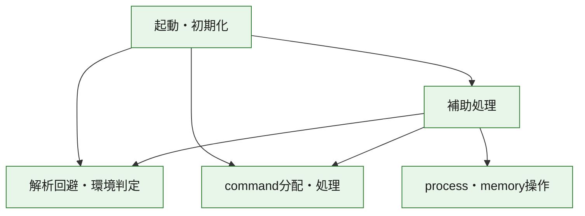
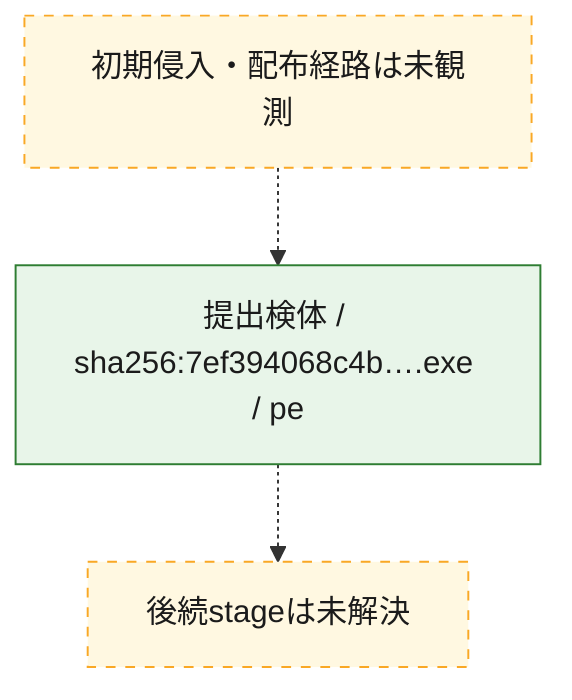
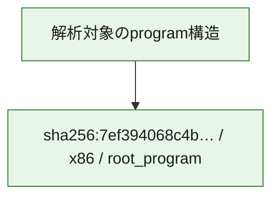

# 全体ロジック：7ef394068c4bfd09b84ee4385e2ff43816ec49644037273fc8071c4c15498565

代表関数の静的証跡から、起動・初期化、解析回避・環境判定、process・memory操作、command分配・処理の処理群を確認しました。

## 読み方

- phaseの掲載順は解析上の整理順です。observed_call_edgesがない段階間の実行順を断定しません。
- 図の実線は静的に観測した関係、点線と黄色のノードは未観測・未解決の関係を示します。
- 図は静的な要約であり、動的実行を再現するものではありません。
- 詳細な関数解説とfingerprintは[STATIC-LOGIC.md](STATIC-LOGIC.md)を参照してください。

## 静的可視化

### 実行フロー

### 感染チェーン

### モジュール関係

## 処理段階

### 1. 起動・初期化

entry pointから初期化と後続処理への移行を確認します。
確度: `confirmed_static_function_evidence`

- `7ef394068c4bfd09b84ee4385e2ff43816ec49644037273fc8071c4c15498565:ghidra:140002be8` — 初期化と主要処理への分岐を行う入口関数です。 状態: `succeeded`、選定理由: `entry_point`, `meaningful_symbol_name`, `reviewed_call_centrality:22`, `role:entrypoint`

### 2. 解析回避・環境判定

debugger、sandbox、仮想環境、時間差などの判定を確認します。
確度: `confirmed_static_function_evidence`

- `7ef394068c4bfd09b84ee4385e2ff43816ec49644037273fc8071c4c15498565:ghidra:140002e3c` — debugger、仮想環境、sandbox、または時間差の確認に関係する関数です。 状態: `succeeded`、選定理由: `context_representative`, `reviewed_call_centrality:10`, `role:anti_analysis`
- `7ef394068c4bfd09b84ee4385e2ff43816ec49644037273fc8071c4c15498565:ghidra:140002f6c` — debugger、仮想環境、sandbox、または時間差の確認に関係する関数です。 状態: `succeeded`、選定理由: `context_representative`, `reviewed_call_centrality:21`, `role:anti_analysis`

### 3. process・memory操作

process、thread、module、memory操作と実行移行を確認します。
確度: `confirmed_static_function_evidence`

- `7ef394068c4bfd09b84ee4385e2ff43816ec49644037273fc8071c4c15498565:ghidra:1400017ac` — process、thread、module、またはmemory操作に関係する関数です。 状態: `succeeded`、選定理由: `context_representative`, `reviewed_call_centrality:33`, `role:process_or_memory_operation`

### 4. command分配・処理

受信commandやtaskの解釈、分配、個別handlerへの移行を確認します。
確度: `confirmed_static_function_evidence_with_limits`

- `7ef394068c4bfd09b84ee4385e2ff43816ec49644037273fc8071c4c15498565:ghidra:14000e8d0` — commandの解釈、分配、または個別処理を担当する関数です。 状態: `limited_bad_instruction_or_flow`、選定理由: `meaningful_symbol_name`, `reviewed_call_centrality:2`, `role:command_dispatch_or_handler`

### 5. 補助処理

主要処理を支える一般内部関数またはlibrary処理を確認します。
確度: `confirmed_static_function_evidence`

- `7ef394068c4bfd09b84ee4385e2ff43816ec49644037273fc8071c4c15498565:ghidra:140001000` — 検体内部の一般処理を実装する関数です。 状態: `succeeded`、選定理由: `context_representative`, `reviewed_call_centrality:2`
- `7ef394068c4bfd09b84ee4385e2ff43816ec49644037273fc8071c4c15498565:ghidra:1400010b4` — 検体内部の一般処理を実装する関数です。 状態: `succeeded`、選定理由: `context_representative`, `reviewed_call_centrality:3`
- `7ef394068c4bfd09b84ee4385e2ff43816ec49644037273fc8071c4c15498565:ghidra:14000169c` — 検体内部の一般処理を実装する関数です。 状態: `succeeded`、選定理由: `context_representative`, `reviewed_call_centrality:1`
- `7ef394068c4bfd09b84ee4385e2ff43816ec49644037273fc8071c4c15498565:ghidra:140001740` — 検体内部の一般処理を実装する関数です。 状態: `succeeded`、選定理由: `context_representative`, `reviewed_call_centrality:1`
- `7ef394068c4bfd09b84ee4385e2ff43816ec49644037273fc8071c4c15498565:ghidra:140001aec` — 検体内部の一般処理を実装する関数です。 状態: `succeeded`、選定理由: `context_representative`, `reviewed_call_centrality:4`
- `7ef394068c4bfd09b84ee4385e2ff43816ec49644037273fc8071c4c15498565:ghidra:140001bd0` — 検体内部の一般処理を実装する関数です。 状態: `succeeded`、選定理由: `context_representative`, `reviewed_call_centrality:3`
- `7ef394068c4bfd09b84ee4385e2ff43816ec49644037273fc8071c4c15498565:ghidra:140001cb4` — 検体内部の一般処理を実装する関数です。 状態: `succeeded`、選定理由: `context_representative`, `reviewed_call_centrality:2`
- `7ef394068c4bfd09b84ee4385e2ff43816ec49644037273fc8071c4c15498565:ghidra:140001e6c` — 検体内部の一般処理を実装する関数です。 状態: `succeeded`、選定理由: `context_representative`, `reviewed_call_centrality:3`
- `7ef394068c4bfd09b84ee4385e2ff43816ec49644037273fc8071c4c15498565:ghidra:14000205c` — 検体内部の一般処理を実装する関数です。 状態: `succeeded`、選定理由: `context_representative`, `reviewed_call_centrality:5`
- `7ef394068c4bfd09b84ee4385e2ff43816ec49644037273fc8071c4c15498565:ghidra:1400020c0` — 検体内部の一般処理を実装する関数です。 状態: `succeeded`、選定理由: `context_representative`, `reviewed_call_centrality:16`
- `7ef394068c4bfd09b84ee4385e2ff43816ec49644037273fc8071c4c15498565:ghidra:140002990` — 検体内部の一般処理を実装する関数です。 状態: `succeeded`、選定理由: `context_representative`, `reviewed_call_centrality:20`
- `7ef394068c4bfd09b84ee4385e2ff43816ec49644037273fc8071c4c15498565:ghidra:140002a48` — 検体内部の一般処理を実装する関数です。 状態: `succeeded`、選定理由: `context_representative`, `reviewed_call_centrality:1`
- `7ef394068c4bfd09b84ee4385e2ff43816ec49644037273fc8071c4c15498565:ghidra:140002a58` — 検体内部の一般処理を実装する関数です。 状態: `succeeded`、選定理由: `context_representative`, `reviewed_call_centrality:6`
- `7ef394068c4bfd09b84ee4385e2ff43816ec49644037273fc8071c4c15498565:ghidra:140002a74` — 検体内部の一般処理を実装する関数です。 状態: `succeeded`、選定理由: `context_representative`, `reviewed_call_centrality:21`
- `7ef394068c4bfd09b84ee4385e2ff43816ec49644037273fc8071c4c15498565:ghidra:140002bfc` — 検体内部の一般処理を実装する関数です。 状態: `succeeded`、選定理由: `context_representative`, `reviewed_call_centrality:5`
- `7ef394068c4bfd09b84ee4385e2ff43816ec49644037273fc8071c4c15498565:ghidra:140002c38` — 検体内部の一般処理を実装する関数です。 状態: `succeeded`、選定理由: `context_representative`, `reviewed_call_centrality:6`
- `7ef394068c4bfd09b84ee4385e2ff43816ec49644037273fc8071c4c15498565:ghidra:140002c74` — 検体内部の一般処理を実装する関数です。 状態: `succeeded`、選定理由: `context_representative`, `reviewed_call_centrality:5`
- `7ef394068c4bfd09b84ee4385e2ff43816ec49644037273fc8071c4c15498565:ghidra:140002d00` — 検体内部の一般処理を実装する関数です。 状態: `succeeded`、選定理由: `context_representative`, `reviewed_call_centrality:4`
- `7ef394068c4bfd09b84ee4385e2ff43816ec49644037273fc8071c4c15498565:ghidra:140002d98` — 検体内部の一般処理を実装する関数です。 状態: `succeeded`、選定理由: `context_representative`, `reviewed_call_centrality:5`
- `7ef394068c4bfd09b84ee4385e2ff43816ec49644037273fc8071c4c15498565:ghidra:140002dbc` — 検体内部の一般処理を実装する関数です。 状態: `succeeded`、選定理由: `context_representative`, `reviewed_call_centrality:4`
- `7ef394068c4bfd09b84ee4385e2ff43816ec49644037273fc8071c4c15498565:ghidra:140002de8` — 検体内部の一般処理を実装する関数です。 状態: `succeeded`、選定理由: `context_representative`, `reviewed_call_centrality:3`
- `7ef394068c4bfd09b84ee4385e2ff43816ec49644037273fc8071c4c15498565:ghidra:140002e24` — 検体内部の一般処理を実装する関数です。 状態: `succeeded`、選定理由: `context_representative`, `reviewed_call_centrality:2`
- `7ef394068c4bfd09b84ee4385e2ff43816ec49644037273fc8071c4c15498565:ghidra:140002f14` — 検体内部の一般処理を実装する関数です。 状態: `succeeded`、選定理由: `meaningful_symbol_name`, `reviewed_call_centrality:1`
- `7ef394068c4bfd09b84ee4385e2ff43816ec49644037273fc8071c4c15498565:ghidra:140002f28` — 検体内部の一般処理を実装する関数です。 状態: `succeeded`、選定理由: `context_representative`, `reviewed_call_centrality:3`
- `7ef394068c4bfd09b84ee4385e2ff43816ec49644037273fc8071c4c15498565:ghidra:1400030b8` — 検体内部の一般処理を実装する関数です。 状態: `succeeded`、選定理由: `context_representative`, `reviewed_call_centrality:5`
- `7ef394068c4bfd09b84ee4385e2ff43816ec49644037273fc8071c4c15498565:ghidra:1400030fc` — 検体内部の一般処理を実装する関数です。 状態: `succeeded`、選定理由: `context_representative`, `reviewed_call_centrality:4`
- `7ef394068c4bfd09b84ee4385e2ff43816ec49644037273fc8071c4c15498565:ghidra:140003160` — 検体内部の一般処理を実装する関数です。 状態: `succeeded`、選定理由: `context_representative`, `reviewed_call_centrality:4`

## 観測したcall関係

- `7ef394068c4bfd09b84ee4385e2ff43816ec49644037273fc8071c4c15498565:ghidra:1400010b4` → `7ef394068c4bfd09b84ee4385e2ff43816ec49644037273fc8071c4c15498565:ghidra:140001bd0` （`support` → `support`）
- `7ef394068c4bfd09b84ee4385e2ff43816ec49644037273fc8071c4c15498565:ghidra:1400010b4` → `7ef394068c4bfd09b84ee4385e2ff43816ec49644037273fc8071c4c15498565:ghidra:14000205c` （`support` → `support`）
- `7ef394068c4bfd09b84ee4385e2ff43816ec49644037273fc8071c4c15498565:ghidra:140001e6c` → `7ef394068c4bfd09b84ee4385e2ff43816ec49644037273fc8071c4c15498565:ghidra:140001bd0` （`support` → `support`）
- `7ef394068c4bfd09b84ee4385e2ff43816ec49644037273fc8071c4c15498565:ghidra:140001e6c` → `7ef394068c4bfd09b84ee4385e2ff43816ec49644037273fc8071c4c15498565:ghidra:14000205c` （`support` → `support`）
- `7ef394068c4bfd09b84ee4385e2ff43816ec49644037273fc8071c4c15498565:ghidra:14000205c` → `7ef394068c4bfd09b84ee4385e2ff43816ec49644037273fc8071c4c15498565:ghidra:140001cb4` （`support` → `support`）
- `7ef394068c4bfd09b84ee4385e2ff43816ec49644037273fc8071c4c15498565:ghidra:1400020c0` → `7ef394068c4bfd09b84ee4385e2ff43816ec49644037273fc8071c4c15498565:ghidra:140001000` （`support` → `support`）
- `7ef394068c4bfd09b84ee4385e2ff43816ec49644037273fc8071c4c15498565:ghidra:1400020c0` → `7ef394068c4bfd09b84ee4385e2ff43816ec49644037273fc8071c4c15498565:ghidra:1400010b4` （`support` → `support`）
- `7ef394068c4bfd09b84ee4385e2ff43816ec49644037273fc8071c4c15498565:ghidra:1400020c0` → `7ef394068c4bfd09b84ee4385e2ff43816ec49644037273fc8071c4c15498565:ghidra:14000169c` （`support` → `support`）
- `7ef394068c4bfd09b84ee4385e2ff43816ec49644037273fc8071c4c15498565:ghidra:1400020c0` → `7ef394068c4bfd09b84ee4385e2ff43816ec49644037273fc8071c4c15498565:ghidra:140001740` （`support` → `support`）
- `7ef394068c4bfd09b84ee4385e2ff43816ec49644037273fc8071c4c15498565:ghidra:1400020c0` → `7ef394068c4bfd09b84ee4385e2ff43816ec49644037273fc8071c4c15498565:ghidra:1400017ac` （`support` → `execution`）
- `7ef394068c4bfd09b84ee4385e2ff43816ec49644037273fc8071c4c15498565:ghidra:1400020c0` → `7ef394068c4bfd09b84ee4385e2ff43816ec49644037273fc8071c4c15498565:ghidra:140001aec` （`support` → `support`）
- `7ef394068c4bfd09b84ee4385e2ff43816ec49644037273fc8071c4c15498565:ghidra:1400020c0` → `7ef394068c4bfd09b84ee4385e2ff43816ec49644037273fc8071c4c15498565:ghidra:140001bd0` （`support` → `support`）
- `7ef394068c4bfd09b84ee4385e2ff43816ec49644037273fc8071c4c15498565:ghidra:1400020c0` → `7ef394068c4bfd09b84ee4385e2ff43816ec49644037273fc8071c4c15498565:ghidra:140001e6c` （`support` → `support`）
- `7ef394068c4bfd09b84ee4385e2ff43816ec49644037273fc8071c4c15498565:ghidra:1400020c0` → `7ef394068c4bfd09b84ee4385e2ff43816ec49644037273fc8071c4c15498565:ghidra:14000205c` （`support` → `support`）
- `7ef394068c4bfd09b84ee4385e2ff43816ec49644037273fc8071c4c15498565:ghidra:140002990` → `7ef394068c4bfd09b84ee4385e2ff43816ec49644037273fc8071c4c15498565:ghidra:140002c74` （`support` → `support`）
- `7ef394068c4bfd09b84ee4385e2ff43816ec49644037273fc8071c4c15498565:ghidra:140002990` → `7ef394068c4bfd09b84ee4385e2ff43816ec49644037273fc8071c4c15498565:ghidra:140002e24` （`support` → `support`）
- `7ef394068c4bfd09b84ee4385e2ff43816ec49644037273fc8071c4c15498565:ghidra:140002990` → `7ef394068c4bfd09b84ee4385e2ff43816ec49644037273fc8071c4c15498565:ghidra:140002f14` （`support` → `support`）
- `7ef394068c4bfd09b84ee4385e2ff43816ec49644037273fc8071c4c15498565:ghidra:140002990` → `7ef394068c4bfd09b84ee4385e2ff43816ec49644037273fc8071c4c15498565:ghidra:140002f6c` （`support` → `evasion`）
- `7ef394068c4bfd09b84ee4385e2ff43816ec49644037273fc8071c4c15498565:ghidra:140002a48` → `7ef394068c4bfd09b84ee4385e2ff43816ec49644037273fc8071c4c15498565:ghidra:140002f28` （`support` → `support`）
- `7ef394068c4bfd09b84ee4385e2ff43816ec49644037273fc8071c4c15498565:ghidra:140002a74` → `7ef394068c4bfd09b84ee4385e2ff43816ec49644037273fc8071c4c15498565:ghidra:1400020c0` （`support` → `support`）
- `7ef394068c4bfd09b84ee4385e2ff43816ec49644037273fc8071c4c15498565:ghidra:140002a74` → `7ef394068c4bfd09b84ee4385e2ff43816ec49644037273fc8071c4c15498565:ghidra:140002bfc` （`support` → `support`）
- `7ef394068c4bfd09b84ee4385e2ff43816ec49644037273fc8071c4c15498565:ghidra:140002a74` → `7ef394068c4bfd09b84ee4385e2ff43816ec49644037273fc8071c4c15498565:ghidra:140002c38` （`support` → `support`）
- `7ef394068c4bfd09b84ee4385e2ff43816ec49644037273fc8071c4c15498565:ghidra:140002a74` → `7ef394068c4bfd09b84ee4385e2ff43816ec49644037273fc8071c4c15498565:ghidra:140002d00` （`support` → `support`）
- `7ef394068c4bfd09b84ee4385e2ff43816ec49644037273fc8071c4c15498565:ghidra:140002a74` → `7ef394068c4bfd09b84ee4385e2ff43816ec49644037273fc8071c4c15498565:ghidra:140002d98` （`support` → `support`）
- `7ef394068c4bfd09b84ee4385e2ff43816ec49644037273fc8071c4c15498565:ghidra:140002a74` → `7ef394068c4bfd09b84ee4385e2ff43816ec49644037273fc8071c4c15498565:ghidra:140002dbc` （`support` → `support`）
- `7ef394068c4bfd09b84ee4385e2ff43816ec49644037273fc8071c4c15498565:ghidra:140002a74` → `7ef394068c4bfd09b84ee4385e2ff43816ec49644037273fc8071c4c15498565:ghidra:140002f6c` （`support` → `evasion`）
- `7ef394068c4bfd09b84ee4385e2ff43816ec49644037273fc8071c4c15498565:ghidra:140002a74` → `7ef394068c4bfd09b84ee4385e2ff43816ec49644037273fc8071c4c15498565:ghidra:1400030b8` （`support` → `support`）
- `7ef394068c4bfd09b84ee4385e2ff43816ec49644037273fc8071c4c15498565:ghidra:140002a74` → `7ef394068c4bfd09b84ee4385e2ff43816ec49644037273fc8071c4c15498565:ghidra:1400030fc` （`support` → `support`）
- `7ef394068c4bfd09b84ee4385e2ff43816ec49644037273fc8071c4c15498565:ghidra:140002a74` → `7ef394068c4bfd09b84ee4385e2ff43816ec49644037273fc8071c4c15498565:ghidra:14000e8d0` （`support` → `dispatch`）
- `7ef394068c4bfd09b84ee4385e2ff43816ec49644037273fc8071c4c15498565:ghidra:140002be8` → `7ef394068c4bfd09b84ee4385e2ff43816ec49644037273fc8071c4c15498565:ghidra:1400020c0` （`startup` → `support`）
- `7ef394068c4bfd09b84ee4385e2ff43816ec49644037273fc8071c4c15498565:ghidra:140002be8` → `7ef394068c4bfd09b84ee4385e2ff43816ec49644037273fc8071c4c15498565:ghidra:140002bfc` （`startup` → `support`）
- `7ef394068c4bfd09b84ee4385e2ff43816ec49644037273fc8071c4c15498565:ghidra:140002be8` → `7ef394068c4bfd09b84ee4385e2ff43816ec49644037273fc8071c4c15498565:ghidra:140002c38` （`startup` → `support`）
- `7ef394068c4bfd09b84ee4385e2ff43816ec49644037273fc8071c4c15498565:ghidra:140002be8` → `7ef394068c4bfd09b84ee4385e2ff43816ec49644037273fc8071c4c15498565:ghidra:140002d00` （`startup` → `support`）
- `7ef394068c4bfd09b84ee4385e2ff43816ec49644037273fc8071c4c15498565:ghidra:140002be8` → `7ef394068c4bfd09b84ee4385e2ff43816ec49644037273fc8071c4c15498565:ghidra:140002d98` （`startup` → `support`）
- `7ef394068c4bfd09b84ee4385e2ff43816ec49644037273fc8071c4c15498565:ghidra:140002be8` → `7ef394068c4bfd09b84ee4385e2ff43816ec49644037273fc8071c4c15498565:ghidra:140002dbc` （`startup` → `support`）
- `7ef394068c4bfd09b84ee4385e2ff43816ec49644037273fc8071c4c15498565:ghidra:140002be8` → `7ef394068c4bfd09b84ee4385e2ff43816ec49644037273fc8071c4c15498565:ghidra:140002e3c` （`startup` → `evasion`）
- `7ef394068c4bfd09b84ee4385e2ff43816ec49644037273fc8071c4c15498565:ghidra:140002be8` → `7ef394068c4bfd09b84ee4385e2ff43816ec49644037273fc8071c4c15498565:ghidra:140002f6c` （`startup` → `evasion`）
- `7ef394068c4bfd09b84ee4385e2ff43816ec49644037273fc8071c4c15498565:ghidra:140002be8` → `7ef394068c4bfd09b84ee4385e2ff43816ec49644037273fc8071c4c15498565:ghidra:1400030b8` （`startup` → `support`）
- `7ef394068c4bfd09b84ee4385e2ff43816ec49644037273fc8071c4c15498565:ghidra:140002be8` → `7ef394068c4bfd09b84ee4385e2ff43816ec49644037273fc8071c4c15498565:ghidra:1400030fc` （`startup` → `support`）
- `7ef394068c4bfd09b84ee4385e2ff43816ec49644037273fc8071c4c15498565:ghidra:140002be8` → `7ef394068c4bfd09b84ee4385e2ff43816ec49644037273fc8071c4c15498565:ghidra:14000e8d0` （`startup` → `dispatch`）
- `7ef394068c4bfd09b84ee4385e2ff43816ec49644037273fc8071c4c15498565:ghidra:140002c74` → `7ef394068c4bfd09b84ee4385e2ff43816ec49644037273fc8071c4c15498565:ghidra:140002f6c` （`support` → `evasion`）
- `7ef394068c4bfd09b84ee4385e2ff43816ec49644037273fc8071c4c15498565:ghidra:140002e24` → `7ef394068c4bfd09b84ee4385e2ff43816ec49644037273fc8071c4c15498565:ghidra:140002de8` （`support` → `support`）
- `ghidra-function:130cdb2c4860d3e6a899a2f8` → `ghidra-external:0fcad64cd1bb07fa08e3b14d` （`unclassified` → `unclassified`）
- `ghidra-function:130cdb2c4860d3e6a899a2f8` → `ghidra-external:156814bb0fca6811cad62070` （`unclassified` → `unclassified`）
- `ghidra-function:130cdb2c4860d3e6a899a2f8` → `ghidra-external:1f0a98f6804ffc58212a69cd` （`unclassified` → `unclassified`）
- `ghidra-function:130cdb2c4860d3e6a899a2f8` → `ghidra-external:e70ed03203fc4dd3e07f9a19` （`unclassified` → `unclassified`）
- `ghidra-function:130cdb2c4860d3e6a899a2f8` → `ghidra-function:b0cd8aad6d4704c8b12f2e99` （`unclassified` → `unclassified`）
- `ghidra-function:130cdb2c4860d3e6a899a2f8` → `ghidra-function:f6405d8891afbb8a13f8cfd6` （`unclassified` → `unclassified`）
- `ghidra-function:14c92e021dc013bb732f2c37` → `ghidra-external:8fcae9f7c598a9386181d879` （`unclassified` → `unclassified`）
- `ghidra-function:14c92e021dc013bb732f2c37` → `ghidra-external:9c8aaa404a445608db1e84e8` （`unclassified` → `unclassified`）
- `ghidra-function:14c92e021dc013bb732f2c37` → `ghidra-external:b46dfa9ccce516b48e08da9d` （`unclassified` → `unclassified`）
- `ghidra-function:14c92e021dc013bb732f2c37` → `ghidra-external:bb706474717bf567b202eb51` （`unclassified` → `unclassified`）
- `ghidra-function:14c92e021dc013bb732f2c37` → `ghidra-external:c9186f91368b6d9aac5e8544` （`unclassified` → `unclassified`）
- `ghidra-function:14c92e021dc013bb732f2c37` → `ghidra-external:edac31a4a0339f78837ef634` （`unclassified` → `unclassified`）
- `ghidra-function:14c92e021dc013bb732f2c37` → `ghidra-external:eec4df42d9da97aaa6e3f49c` （`unclassified` → `unclassified`）
- `ghidra-function:14c92e021dc013bb732f2c37` → `ghidra-function:22a5f9034edf50bf04ecf5b4` （`unclassified` → `unclassified`）
- `ghidra-function:14c92e021dc013bb732f2c37` → `ghidra-function:2e6e7042446bee503d779445` （`unclassified` → `unclassified`）
- `ghidra-function:14c92e021dc013bb732f2c37` → `ghidra-function:35103f9358330f1e124ca5c8` （`unclassified` → `unclassified`）
- `ghidra-function:14c92e021dc013bb732f2c37` → `ghidra-function:3f588310d2eb628d654373ee` （`unclassified` → `unclassified`）
- `ghidra-function:14c92e021dc013bb732f2c37` → `ghidra-function:6d6b431bd9abf2f802334f8c` （`unclassified` → `unclassified`）
- `ghidra-function:14c92e021dc013bb732f2c37` → `ghidra-function:7d5d7eeb4d2c952f5ba4c580` （`unclassified` → `unclassified`）
- `ghidra-function:14c92e021dc013bb732f2c37` → `ghidra-function:821de3b7797aab00c52b55ae` （`unclassified` → `unclassified`）
- `ghidra-function:14c92e021dc013bb732f2c37` → `ghidra-function:9b8f90f6b9b054e64672f173` （`unclassified` → `unclassified`）
- `ghidra-function:14c92e021dc013bb732f2c37` → `ghidra-function:9cb8b86920df58574fa1dc42` （`unclassified` → `unclassified`）
- `ghidra-function:14c92e021dc013bb732f2c37` → `ghidra-function:a12968d78b145f391fb8801c` （`unclassified` → `unclassified`）
- `ghidra-function:14c92e021dc013bb732f2c37` → `ghidra-function:a948652eb82ee6b5fd760864` （`unclassified` → `unclassified`）
- `ghidra-function:14c92e021dc013bb732f2c37` → `ghidra-function:bd4e1ec17555818496dc5d21` （`unclassified` → `unclassified`）
- `ghidra-function:14c92e021dc013bb732f2c37` → `ghidra-function:c65e184ff98e20e6a0c1b6d0` （`unclassified` → `unclassified`）
- `ghidra-function:14c92e021dc013bb732f2c37` → `ghidra-function:d27ae799ee1fd9312e650ed0` （`unclassified` → `unclassified`）
- `ghidra-function:16791f880d786ef824f29866` → `ghidra-function:d992bf1c3611ba20b216f8c2` （`unclassified` → `unclassified`）
- `ghidra-function:2e6e7042446bee503d779445` → `ghidra-external:3a53c030c2863062d9a1c948` （`unclassified` → `unclassified`）
- `ghidra-function:2e6e7042446bee503d779445` → `ghidra-external:edac31a4a0339f78837ef634` （`unclassified` → `unclassified`）
- `ghidra-function:34956e7539adbe0841fee27c` → `ghidra-external:7c61f0cc34cb774e0c235801` （`unclassified` → `unclassified`）
- `ghidra-function:34956e7539adbe0841fee27c` → `ghidra-external:8243c76210399823cc049744` （`unclassified` → `unclassified`）
- `ghidra-function:34956e7539adbe0841fee27c` → `ghidra-external:97507b9cfeb971dd1f74a49c` （`unclassified` → `unclassified`）
- `ghidra-function:3f588310d2eb628d654373ee` → `ghidra-function:9405d22dbbd867579f8420a7` （`unclassified` → `unclassified`）
- `ghidra-function:3f588310d2eb628d654373ee` → `ghidra-function:94dbf913e4365bacccd9c8ce` （`unclassified` → `unclassified`）
- `ghidra-function:46030a1a6ac8c1176e970b7e` → `ghidra-external:3f8f1bb8c2e0dca254424713` （`unclassified` → `unclassified`）
- `ghidra-function:46030a1a6ac8c1176e970b7e` → `ghidra-external:80ebacd5fdec7638afd48c92` （`unclassified` → `unclassified`）
- `ghidra-function:46030a1a6ac8c1176e970b7e` → `ghidra-external:c9186f91368b6d9aac5e8544` （`unclassified` → `unclassified`）
- `ghidra-function:46030a1a6ac8c1176e970b7e` → `ghidra-function:821de3b7797aab00c52b55ae` （`unclassified` → `unclassified`）
- `ghidra-function:49c48266527fe185c02b5735` → `ghidra-function:805749bde244293d369a632c` （`unclassified` → `unclassified`）
- `ghidra-function:5c807af0358ca8ece050c880` → `ghidra-function:94dbf913e4365bacccd9c8ce` （`unclassified` → `unclassified`）
- `ghidra-function:7b4eed9831232dafae7d1dc8` → `ghidra-function:44e3a8642e62ea058707146f` （`unclassified` → `unclassified`）
- `ghidra-function:7b4eed9831232dafae7d1dc8` → `ghidra-function:57c0882171cfa48ab03585a7` （`unclassified` → `unclassified`）
- `ghidra-function:7b4eed9831232dafae7d1dc8` → `ghidra-function:5c0441af2a01ca72aaa78b12` （`unclassified` → `unclassified`）
- `ghidra-function:7b4eed9831232dafae7d1dc8` → `ghidra-function:69dbcec5bcc72945480c95ac` （`unclassified` → `unclassified`）
- `ghidra-function:7b4eed9831232dafae7d1dc8` → `ghidra-function:74841d9b2c7785b3ab06838c` （`unclassified` → `unclassified`）
- `ghidra-function:7b4eed9831232dafae7d1dc8` → `ghidra-function:7b314dfc208361872afe6667` （`unclassified` → `unclassified`）
- `ghidra-function:7b4eed9831232dafae7d1dc8` → `ghidra-function:8ce7d5206c2ee59dc665c029` （`unclassified` → `unclassified`）
- `ghidra-function:7b4eed9831232dafae7d1dc8` → `ghidra-function:8dd51cdc2bce66edfc4e740b` （`unclassified` → `unclassified`）
- `ghidra-function:7b4eed9831232dafae7d1dc8` → `ghidra-function:9008478873a41f54f920736d` （`unclassified` → `unclassified`）
- `ghidra-function:7b4eed9831232dafae7d1dc8` → `ghidra-function:91d13b9587671b7f3db4b924` （`unclassified` → `unclassified`）
- `ghidra-function:7b4eed9831232dafae7d1dc8` → `ghidra-function:991b01ee48f00ea07c2f0aa3` （`unclassified` → `unclassified`）
- `ghidra-function:7b4eed9831232dafae7d1dc8` → `ghidra-function:a1e8cf6e6aa3efe9a325d45f` （`unclassified` → `unclassified`）
- `ghidra-function:7b4eed9831232dafae7d1dc8` → `ghidra-function:c4f67814770318be0334e878` （`unclassified` → `unclassified`）
- `ghidra-function:7b4eed9831232dafae7d1dc8` → `ghidra-function:cb05a25eea10c5469129516b` （`unclassified` → `unclassified`）
- `ghidra-function:7b4eed9831232dafae7d1dc8` → `ghidra-function:ec5b4b44a34c79a40282d63c` （`unclassified` → `unclassified`）
- `ghidra-function:7b4eed9831232dafae7d1dc8` → `ghidra-function:fad1089da2e7d474382b6b45` （`unclassified` → `unclassified`）
- `ghidra-function:7d5d7eeb4d2c952f5ba4c580` → `ghidra-function:68b5d2153fff0dc35dd88e98` （`unclassified` → `unclassified`）
- `ghidra-function:7d5d7eeb4d2c952f5ba4c580` → `ghidra-function:b055eb55799071ea58705c1d` （`unclassified` → `unclassified`）
- `ghidra-function:805749bde244293d369a632c` → `ghidra-external:eb9bce22f8ed61d2d6349b15` （`unclassified` → `unclassified`）
- `ghidra-function:805749bde244293d369a632c` → `ghidra-external:fa3fb86584d5639e9c98b66f` （`unclassified` → `unclassified`）
- `ghidra-function:8080ceb6f4affe77c44d676f` → `ghidra-external:2ebaa9eedc38c145e45d5194` （`unclassified` → `unclassified`）
- `ghidra-function:8080ceb6f4affe77c44d676f` → `ghidra-external:310bee80c7cdc90fbcf99280` （`unclassified` → `unclassified`）
- `ghidra-function:8080ceb6f4affe77c44d676f` → `ghidra-external:3b38d6552736b8c1f14faa31` （`unclassified` → `unclassified`）
- `ghidra-function:8080ceb6f4affe77c44d676f` → `ghidra-external:9c8ac7d70d01982ff1dcfb16` （`unclassified` → `unclassified`）
- `ghidra-function:8080ceb6f4affe77c44d676f` → `ghidra-external:b007b3af593dd63afd8de46e` （`unclassified` → `unclassified`）
- `ghidra-function:8080ceb6f4affe77c44d676f` → `ghidra-external:b614dc1c45d11e6d11b04624` （`unclassified` → `unclassified`）
- `ghidra-function:8080ceb6f4affe77c44d676f` → `ghidra-external:b80ac0ccb1161132782635ca` （`unclassified` → `unclassified`）
- `ghidra-function:8080ceb6f4affe77c44d676f` → `ghidra-external:c05f03bacbd0fb622fe4294f` （`unclassified` → `unclassified`）
- `ghidra-function:8080ceb6f4affe77c44d676f` → `ghidra-external:c2f00ad11d0caa9bc56438ec` （`unclassified` → `unclassified`）
- `ghidra-function:8080ceb6f4affe77c44d676f` → `ghidra-external:c9186f91368b6d9aac5e8544` （`unclassified` → `unclassified`）
- `ghidra-function:8080ceb6f4affe77c44d676f` → `ghidra-external:d2093d4b099be0adf6f30bf2` （`unclassified` → `unclassified`）
- `ghidra-function:8080ceb6f4affe77c44d676f` → `ghidra-external:e70ed03203fc4dd3e07f9a19` （`unclassified` → `unclassified`）
- `ghidra-function:8080ceb6f4affe77c44d676f` → `ghidra-function:086926c7da3947cc46ff1730` （`unclassified` → `unclassified`）
- `ghidra-function:8080ceb6f4affe77c44d676f` → `ghidra-function:1ea07ad68f484ebe3e131ce5` （`unclassified` → `unclassified`）
- `ghidra-function:8080ceb6f4affe77c44d676f` → `ghidra-function:46030a1a6ac8c1176e970b7e` （`unclassified` → `unclassified`）
- `ghidra-function:8080ceb6f4affe77c44d676f` → `ghidra-function:576441a13ae954b09973ae86` （`unclassified` → `unclassified`）
- `ghidra-function:8080ceb6f4affe77c44d676f` → `ghidra-function:5f530583e44b7d88f8be6a85` （`unclassified` → `unclassified`）
- `ghidra-function:8080ceb6f4affe77c44d676f` → `ghidra-function:821de3b7797aab00c52b55ae` （`unclassified` → `unclassified`）
- `ghidra-function:8080ceb6f4affe77c44d676f` → `ghidra-function:835ff417717beb61182db6df` （`unclassified` → `unclassified`）
- `ghidra-function:8080ceb6f4affe77c44d676f` → `ghidra-function:b9ffd3d8358689036f2bb927` （`unclassified` → `unclassified`）
- `ghidra-function:821de3b7797aab00c52b55ae` → `ghidra-external:c9186f91368b6d9aac5e8544` （`unclassified` → `unclassified`）
- `ghidra-function:821de3b7797aab00c52b55ae` → `ghidra-external:f3b9cba66289828cf3977701` （`unclassified` → `unclassified`）
- `ghidra-function:821de3b7797aab00c52b55ae` → `ghidra-function:3d677226092b9d1ea9e4a8b9` （`unclassified` → `unclassified`）
- `ghidra-function:821de3b7797aab00c52b55ae` → `ghidra-function:61700675b09d52491bfaa9ed` （`unclassified` → `unclassified`）
- `ghidra-function:821de3b7797aab00c52b55ae` → `ghidra-function:84a98cd428cd2500a5f4e314` （`unclassified` → `unclassified`）
- `ghidra-function:821de3b7797aab00c52b55ae` → `ghidra-function:94dbf913e4365bacccd9c8ce` （`unclassified` → `unclassified`）
- `ghidra-function:821de3b7797aab00c52b55ae` → `ghidra-function:ae2bd378368005c187ef027a` （`unclassified` → `unclassified`）
- `ghidra-function:821de3b7797aab00c52b55ae` → `ghidra-function:af4f55d58a806108fbadbeec` （`unclassified` → `unclassified`）
- `ghidra-function:821de3b7797aab00c52b55ae` → `ghidra-function:c87d5712d9da7428b9f4d8dc` （`unclassified` → `unclassified`）
- `ghidra-function:821de3b7797aab00c52b55ae` → `ghidra-function:ed77e42507b18d2f050edccd` （`unclassified` → `unclassified`）
- `ghidra-function:835ff417717beb61182db6df` → `ghidra-function:e7d9862ded966fa6e6496770` （`unclassified` → `unclassified`）
- `ghidra-function:8cd8f036f196d1b5fb4955d1` → `ghidra-external:c9186f91368b6d9aac5e8544` （`unclassified` → `unclassified`）
- `ghidra-function:8cd8f036f196d1b5fb4955d1` → `ghidra-function:758f87fe8431ab62b22ba193` （`unclassified` → `unclassified`）
- `ghidra-function:8cd8f036f196d1b5fb4955d1` → `ghidra-function:96d03a580158af826750a15d` （`unclassified` → `unclassified`）
- `ghidra-function:8cd8f036f196d1b5fb4955d1` → `ghidra-function:c4633ccd0d592ab92aa6d4a1` （`unclassified` → `unclassified`）
- `ghidra-function:9b8f90f6b9b054e64672f173` → `ghidra-external:13d3f152af55950ad47e1064` （`unclassified` → `unclassified`）
- `ghidra-function:9b8f90f6b9b054e64672f173` → `ghidra-external:fca69223da87f21f3ac52358` （`unclassified` → `unclassified`）
- `ghidra-function:9b8f90f6b9b054e64672f173` → `ghidra-function:0efa532f6f4fa4ab4f7d5f61` （`unclassified` → `unclassified`）
- `ghidra-function:9b8f90f6b9b054e64672f173` → `ghidra-function:34956e7539adbe0841fee27c` （`unclassified` → `unclassified`）
- `ghidra-function:9b8f90f6b9b054e64672f173` → `ghidra-function:4d03f7c391aa7c78c288eddb` （`unclassified` → `unclassified`）
- `ghidra-function:9b8f90f6b9b054e64672f173` → `ghidra-function:5c807af0358ca8ece050c880` （`unclassified` → `unclassified`）
- `ghidra-function:9b8f90f6b9b054e64672f173` → `ghidra-function:5ed60dbe5639200d4b939fad` （`unclassified` → `unclassified`）
- `ghidra-function:9b8f90f6b9b054e64672f173` → `ghidra-function:7b4eed9831232dafae7d1dc8` （`unclassified` → `unclassified`）
- `ghidra-function:9b8f90f6b9b054e64672f173` → `ghidra-function:94dbf913e4365bacccd9c8ce` （`unclassified` → `unclassified`）
- `ghidra-function:9b8f90f6b9b054e64672f173` → `ghidra-function:9fb71c8a216649c8ca941af5` （`unclassified` → `unclassified`）
- `ghidra-function:9b8f90f6b9b054e64672f173` → `ghidra-function:a9198f27f09760b5c513fdd5` （`unclassified` → `unclassified`）
- `ghidra-function:9b8f90f6b9b054e64672f173` → `ghidra-function:dc877a8308f3ef6c619d1592` （`unclassified` → `unclassified`）
- `ghidra-function:9b8f90f6b9b054e64672f173` → `ghidra-function:e4dd8dff17795627ac262e60` （`unclassified` → `unclassified`）
- `ghidra-function:9cb8b86920df58574fa1dc42` → `ghidra-external:0fcad64cd1bb07fa08e3b14d` （`unclassified` → `unclassified`）
- `ghidra-function:9cb8b86920df58574fa1dc42` → `ghidra-external:1f0a98f6804ffc58212a69cd` （`unclassified` → `unclassified`）
- `ghidra-function:9cb8b86920df58574fa1dc42` → `ghidra-external:80ebacd5fdec7638afd48c92` （`unclassified` → `unclassified`）
- `ghidra-function:a12968d78b145f391fb8801c` → `ghidra-external:97018d4e4203619893fde828` （`unclassified` → `unclassified`）
- `ghidra-function:a12968d78b145f391fb8801c` → `ghidra-function:68b5d2153fff0dc35dd88e98` （`unclassified` → `unclassified`）
- `ghidra-function:a12968d78b145f391fb8801c` → `ghidra-function:895312c1a9234fc59cd22c16` （`unclassified` → `unclassified`）
- `ghidra-function:a12968d78b145f391fb8801c` → `ghidra-function:972c0f5e2f5f37cd54caffdc` （`unclassified` → `unclassified`）
- `ghidra-function:a9198f27f09760b5c513fdd5` → `ghidra-function:4d03f7c391aa7c78c288eddb` （`unclassified` → `unclassified`）
- `ghidra-function:a9198f27f09760b5c513fdd5` → `ghidra-function:e4dd8dff17795627ac262e60` （`unclassified` → `unclassified`）
- `ghidra-function:a948652eb82ee6b5fd760864` → `ghidra-external:0fcad64cd1bb07fa08e3b14d` （`unclassified` → `unclassified`）
- `ghidra-function:a948652eb82ee6b5fd760864` → `ghidra-external:1f0a98f6804ffc58212a69cd` （`unclassified` → `unclassified`）
- `ghidra-function:a948652eb82ee6b5fd760864` → `ghidra-external:80ebacd5fdec7638afd48c92` （`unclassified` → `unclassified`）
- `ghidra-function:d27ae799ee1fd9312e650ed0` → `ghidra-function:b6c23fa455fbb6ad0af0987f` （`unclassified` → `unclassified`）
- `ghidra-function:d8b3feebe9f7417e320228db` → `ghidra-external:8fcae9f7c598a9386181d879` （`unclassified` → `unclassified`）
- `ghidra-function:d8b3feebe9f7417e320228db` → `ghidra-external:9c8aaa404a445608db1e84e8` （`unclassified` → `unclassified`）
- `ghidra-function:d8b3feebe9f7417e320228db` → `ghidra-external:b46dfa9ccce516b48e08da9d` （`unclassified` → `unclassified`）
- `ghidra-function:d8b3feebe9f7417e320228db` → `ghidra-external:bb706474717bf567b202eb51` （`unclassified` → `unclassified`）
- `ghidra-function:d8b3feebe9f7417e320228db` → `ghidra-external:c9186f91368b6d9aac5e8544` （`unclassified` → `unclassified`）
- `ghidra-function:d8b3feebe9f7417e320228db` → `ghidra-external:edac31a4a0339f78837ef634` （`unclassified` → `unclassified`）
- `ghidra-function:d8b3feebe9f7417e320228db` → `ghidra-external:eec4df42d9da97aaa6e3f49c` （`unclassified` → `unclassified`）
- `ghidra-function:d8b3feebe9f7417e320228db` → `ghidra-function:22a5f9034edf50bf04ecf5b4` （`unclassified` → `unclassified`）
- `ghidra-function:d8b3feebe9f7417e320228db` → `ghidra-function:2e6e7042446bee503d779445` （`unclassified` → `unclassified`）
- `ghidra-function:d8b3feebe9f7417e320228db` → `ghidra-function:35103f9358330f1e124ca5c8` （`unclassified` → `unclassified`）
- `ghidra-function:d8b3feebe9f7417e320228db` → `ghidra-function:3f588310d2eb628d654373ee` （`unclassified` → `unclassified`）
- `ghidra-function:d8b3feebe9f7417e320228db` → `ghidra-function:6d6b431bd9abf2f802334f8c` （`unclassified` → `unclassified`）
- `ghidra-function:d8b3feebe9f7417e320228db` → `ghidra-function:7d5d7eeb4d2c952f5ba4c580` （`unclassified` → `unclassified`）
- `ghidra-function:d8b3feebe9f7417e320228db` → `ghidra-function:821de3b7797aab00c52b55ae` （`unclassified` → `unclassified`）
- `ghidra-function:d8b3feebe9f7417e320228db` → `ghidra-function:9b8f90f6b9b054e64672f173` （`unclassified` → `unclassified`）
- `ghidra-function:d8b3feebe9f7417e320228db` → `ghidra-function:9cb8b86920df58574fa1dc42` （`unclassified` → `unclassified`）
- `ghidra-function:d8b3feebe9f7417e320228db` → `ghidra-function:a12968d78b145f391fb8801c` （`unclassified` → `unclassified`）
- `ghidra-function:d8b3feebe9f7417e320228db` → `ghidra-function:a948652eb82ee6b5fd760864` （`unclassified` → `unclassified`）
- `ghidra-function:d8b3feebe9f7417e320228db` → `ghidra-function:bd4e1ec17555818496dc5d21` （`unclassified` → `unclassified`）
- `ghidra-function:d8b3feebe9f7417e320228db` → `ghidra-function:c65e184ff98e20e6a0c1b6d0` （`unclassified` → `unclassified`）
- `ghidra-function:d8b3feebe9f7417e320228db` → `ghidra-function:d27ae799ee1fd9312e650ed0` （`unclassified` → `unclassified`）
- `ghidra-function:d8b3feebe9f7417e320228db` → `ghidra-function:ebc78b2edd8a708492662e23` （`unclassified` → `unclassified`）
- `ghidra-function:dc877a8308f3ef6c619d1592` → `ghidra-function:4d03f7c391aa7c78c288eddb` （`unclassified` → `unclassified`）
- `ghidra-function:dc877a8308f3ef6c619d1592` → `ghidra-function:e4dd8dff17795627ac262e60` （`unclassified` → `unclassified`）
- `ghidra-function:e4dd8dff17795627ac262e60` → `ghidra-function:16791f880d786ef824f29866` （`unclassified` → `unclassified`）
- `ghidra-function:e4dd8dff17795627ac262e60` → `ghidra-function:d992bf1c3611ba20b216f8c2` （`unclassified` → `unclassified`）
- `ghidra-function:e7d9862ded966fa6e6496770` → `ghidra-external:aba92d265818d7e62fd2fd2f` （`unclassified` → `unclassified`）
- `ghidra-function:e7d9862ded966fa6e6496770` → `ghidra-function:3297753a218d3af5f2201322` （`unclassified` → `unclassified`）
- `ghidra-function:ebc78b2edd8a708492662e23` → `ghidra-external:fca69223da87f21f3ac52358` （`unclassified` → `unclassified`）
- `ghidra-function:ebc78b2edd8a708492662e23` → `ghidra-function:028b363118bde872c4431e7c` （`unclassified` → `unclassified`）
- `ghidra-function:ebc78b2edd8a708492662e23` → `ghidra-function:2046dc8f1e5f3df9f953872f` （`unclassified` → `unclassified`）
- `ghidra-function:ebc78b2edd8a708492662e23` → `ghidra-function:71d8f691e2841b7dcf1df273` （`unclassified` → `unclassified`）
- `ghidra-function:ebc78b2edd8a708492662e23` → `ghidra-function:d6ee3daacc4d63136783b6fd` （`unclassified` → `unclassified`）

## 解析範囲と制約

- 選定外関数は全体inventoryへ残しますが、関数本体の個別解説対象にはしていません。
- indirect call、難読化、packer、VM、壊れたcontrol flowによりcall関係が欠落する場合があります。
- 文書は静的解析に基づき、検体実行や外部通信による動的確認は行っていません。
