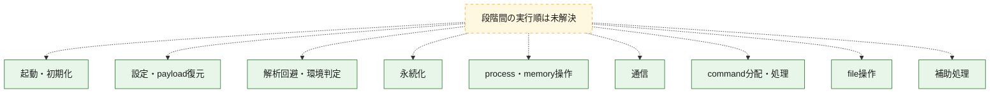
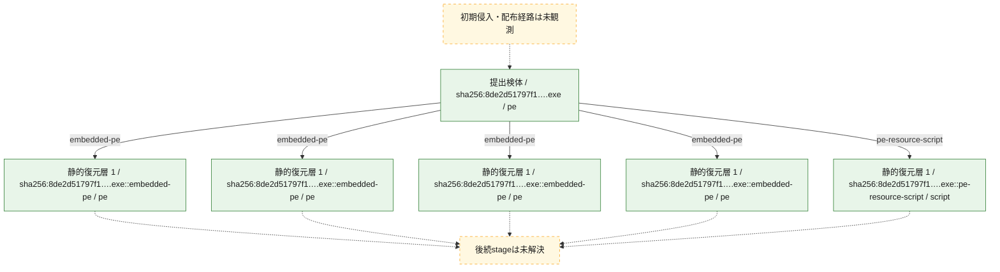
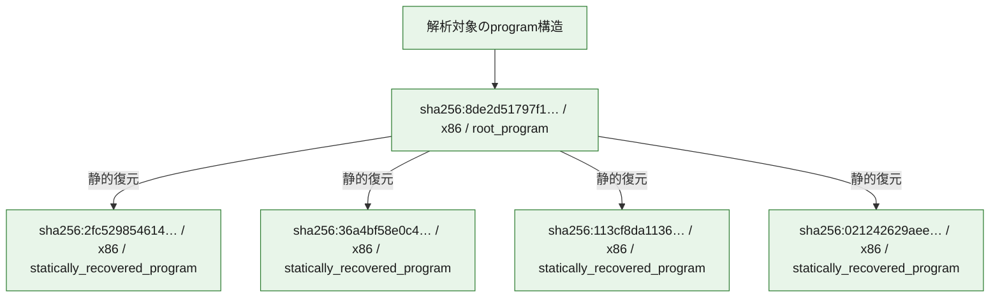

# 全体ロジック：8de2d51797f113896007d6ed8c634d99f5cee4c34c2bf55b1e4c19432afcbab3

代表関数の静的証跡から、起動・初期化、設定・payload復元、解析回避・環境判定、永続化、process・memory操作、通信、command分配・処理、file操作の処理群を確認しました。

## 読み方

- phaseの掲載順は解析上の整理順です。observed_call_edgesがない段階間の実行順を断定しません。
- 図の実線は静的に観測した関係、点線と黄色のノードは未観測・未解決の関係を示します。
- 図は静的な要約であり、動的実行を再現するものではありません。
- 詳細な関数解説とfingerprintは[STATIC-LOGIC.md](STATIC-LOGIC.md)を参照してください。

## 静的可視化

### 実行フロー

### 感染チェーン

### モジュール関係

## 処理段階

### 1. 起動・初期化

entry pointから初期化と後続処理への移行を確認します。
確度: `confirmed_static_function_evidence`

- `36a4bf58e0c42d7498961ae79e7a1281e9b9eb1b7811c3a5ebe85a27c09a7f73:ghidra:10017610` — 初期化と主要処理への分岐を行う入口関数です。 状態: `succeeded`、選定理由: `entry_point`, `meaningful_symbol_name`, `reviewed_call_centrality:2`, `role:entrypoint`
- `113cf8da1136187e3aa2ac96cc29c21ebb92a29dcf9e4eeaa36524c00dee8e76:ghidra:10074df0` — 初期化と主要処理への分岐を行う入口関数です。 状態: `succeeded`、選定理由: `entry_point`, `meaningful_symbol_name`, `reviewed_call_centrality:2`, `role:entrypoint`
- `021242629aeef982a9c33846cdaf5cce15f3e4eda1c12fe2360797837089c29a:ghidra:1008abd0` — 初期化と主要処理への分岐を行う入口関数です。 状態: `succeeded`、選定理由: `entry_point`, `meaningful_symbol_name`, `reviewed_call_centrality:2`, `role:entrypoint`

### 2. 設定・payload復元

設定、resource、payload、暗号化データの復元・変換を確認します。
確度: `confirmed_static_function_evidence_with_limits`

- `36a4bf58e0c42d7498961ae79e7a1281e9b9eb1b7811c3a5ebe85a27c09a7f73:ghidra:10015d1c` — 暗号、hash、encoding、または復号処理に関係する関数です。 状態: `limited_bad_instruction_or_flow`、選定理由: `meaningful_symbol_name`, `reviewed_call_centrality:1`, `role:cryptographic_transform`
- `36a4bf58e0c42d7498961ae79e7a1281e9b9eb1b7811c3a5ebe85a27c09a7f73:ghidra:10015d26` — 暗号、hash、encoding、または復号処理に関係する関数です。 状態: `limited_bad_instruction_or_flow`、選定理由: `meaningful_symbol_name`, `reviewed_call_centrality:1`, `role:cryptographic_transform`
- `36a4bf58e0c42d7498961ae79e7a1281e9b9eb1b7811c3a5ebe85a27c09a7f73:ghidra:10015d30` — 暗号、hash、encoding、または復号処理に関係する関数です。 状態: `limited_bad_instruction_or_flow`、選定理由: `meaningful_symbol_name`, `reviewed_call_centrality:1`, `role:cryptographic_transform`
- `36a4bf58e0c42d7498961ae79e7a1281e9b9eb1b7811c3a5ebe85a27c09a7f73:ghidra:10015d3a` — 暗号、hash、encoding、または復号処理に関係する関数です。 状態: `limited_bad_instruction_or_flow`、選定理由: `meaningful_symbol_name`, `reviewed_call_centrality:1`, `role:cryptographic_transform`
- `36a4bf58e0c42d7498961ae79e7a1281e9b9eb1b7811c3a5ebe85a27c09a7f73:ghidra:10015d44` — 暗号、hash、encoding、または復号処理に関係する関数です。 状態: `limited_bad_instruction_or_flow`、選定理由: `meaningful_symbol_name`, `reviewed_call_centrality:1`, `role:cryptographic_transform`
- `36a4bf58e0c42d7498961ae79e7a1281e9b9eb1b7811c3a5ebe85a27c09a7f73:ghidra:10015d4e` — 暗号、hash、encoding、または復号処理に関係する関数です。 状態: `limited_bad_instruction_or_flow`、選定理由: `meaningful_symbol_name`, `reviewed_call_centrality:1`, `role:cryptographic_transform`
- `36a4bf58e0c42d7498961ae79e7a1281e9b9eb1b7811c3a5ebe85a27c09a7f73:ghidra:10015d58` — 暗号、hash、encoding、または復号処理に関係する関数です。 状態: `limited_bad_instruction_or_flow`、選定理由: `meaningful_symbol_name`, `reviewed_call_centrality:1`, `role:cryptographic_transform`
- `36a4bf58e0c42d7498961ae79e7a1281e9b9eb1b7811c3a5ebe85a27c09a7f73:ghidra:10015d62` — 設定、resource、payloadなどの解析・変換を行う関数です。 状態: `limited_bad_instruction_or_flow`、選定理由: `meaningful_symbol_name`, `reviewed_call_centrality:1`, `role:config_or_data_transform`
- `113cf8da1136187e3aa2ac96cc29c21ebb92a29dcf9e4eeaa36524c00dee8e76:ghidra:100477b0` — 設定、resource、payloadなどの解析・変換を行う関数です。 状態: `succeeded`、選定理由: `entry_point`, `meaningful_symbol_name`, `reviewed_call_centrality:11`, `role:config_or_data_transform`
- `021242629aeef982a9c33846cdaf5cce15f3e4eda1c12fe2360797837089c29a:ghidra:10059650` — 設定、resource、payloadなどの解析・変換を行う関数です。 状態: `succeeded`、選定理由: `entry_point`, `meaningful_symbol_name`, `reviewed_call_centrality:31`, `role:config_or_data_transform`
- `021242629aeef982a9c33846cdaf5cce15f3e4eda1c12fe2360797837089c29a:ghidra:1005a910` — 設定、resource、payloadなどの解析・変換を行う関数です。 状態: `succeeded`、選定理由: `entry_point`, `meaningful_symbol_name`, `reviewed_call_centrality:21`, `role:config_or_data_transform`
- `021242629aeef982a9c33846cdaf5cce15f3e4eda1c12fe2360797837089c29a:ghidra:1007d160` — 暗号、hash、encoding、または復号処理に関係する関数です。 状態: `succeeded`、選定理由: `entry_point`, `meaningful_symbol_name`, `reviewed_call_centrality:23`, `role:cryptographic_transform`

### 3. 解析回避・環境判定

debugger、sandbox、仮想環境、時間差などの判定を確認します。
確度: `confirmed_static_function_evidence`

- `021242629aeef982a9c33846cdaf5cce15f3e4eda1c12fe2360797837089c29a:ghidra:1005c190` — debugger、仮想環境、sandbox、または時間差の確認に関係する関数です。 状態: `succeeded`、選定理由: `entry_point`, `meaningful_symbol_name`, `reviewed_call_centrality:14`, `role:anti_analysis`

### 4. 永続化

自動起動や永続化に関係する設定変更を確認します。
確度: `confirmed_static_function_evidence_with_limits`

- `36a4bf58e0c42d7498961ae79e7a1281e9b9eb1b7811c3a5ebe85a27c09a7f73:ghidra:10015cfe` — 自動起動または永続化に関係する処理を含む関数です。 状態: `limited_bad_instruction_or_flow`、選定理由: `meaningful_symbol_name`, `reviewed_call_centrality:1`, `role:persistence`
- `021242629aeef982a9c33846cdaf5cce15f3e4eda1c12fe2360797837089c29a:ghidra:100493e0` — 自動起動または永続化に関係する処理を含む関数です。 状態: `succeeded`、選定理由: `entry_point`, `meaningful_symbol_name`, `reviewed_call_centrality:32`, `role:persistence`
- `021242629aeef982a9c33846cdaf5cce15f3e4eda1c12fe2360797837089c29a:ghidra:1005f490` — 自動起動または永続化に関係する処理を含む関数です。 状態: `succeeded`、選定理由: `entry_point`, `meaningful_symbol_name`, `reviewed_call_centrality:7`, `role:persistence`
- `021242629aeef982a9c33846cdaf5cce15f3e4eda1c12fe2360797837089c29a:ghidra:10065af0` — 自動起動または永続化に関係する処理を含む関数です。 状態: `succeeded`、選定理由: `entry_point`, `meaningful_symbol_name`, `reviewed_call_centrality:45`, `role:persistence`
- `021242629aeef982a9c33846cdaf5cce15f3e4eda1c12fe2360797837089c29a:ghidra:10066720` — 自動起動または永続化に関係する処理を含む関数です。 状態: `succeeded`、選定理由: `entry_point`, `meaningful_symbol_name`, `reviewed_call_centrality:16`, `role:persistence`
- `021242629aeef982a9c33846cdaf5cce15f3e4eda1c12fe2360797837089c29a:ghidra:10082f40` — 自動起動または永続化に関係する処理を含む関数です。 状態: `succeeded`、選定理由: `entry_point`, `meaningful_symbol_name`, `reviewed_call_centrality:8`, `role:persistence`
- `021242629aeef982a9c33846cdaf5cce15f3e4eda1c12fe2360797837089c29a:ghidra:100830f0` — 自動起動または永続化に関係する処理を含む関数です。 状態: `succeeded`、選定理由: `entry_point`, `meaningful_symbol_name`, `reviewed_call_centrality:12`, `role:persistence`
- `021242629aeef982a9c33846cdaf5cce15f3e4eda1c12fe2360797837089c29a:ghidra:100832a0` — 自動起動または永続化に関係する処理を含む関数です。 状態: `succeeded`、選定理由: `entry_point`, `meaningful_symbol_name`, `reviewed_call_centrality:10`, `role:persistence`
- `021242629aeef982a9c33846cdaf5cce15f3e4eda1c12fe2360797837089c29a:ghidra:100833d0` — 自動起動または永続化に関係する処理を含む関数です。 状態: `succeeded`、選定理由: `entry_point`, `meaningful_symbol_name`, `reviewed_call_centrality:20`, `role:persistence`
- `021242629aeef982a9c33846cdaf5cce15f3e4eda1c12fe2360797837089c29a:ghidra:10083800` — 自動起動または永続化に関係する処理を含む関数です。 状態: `succeeded`、選定理由: `entry_point`, `meaningful_symbol_name`, `reviewed_call_centrality:7`, `role:persistence`

### 5. process・memory操作

process、thread、module、memory操作と実行移行を確認します。
確度: `confirmed_static_function_evidence`

- `021242629aeef982a9c33846cdaf5cce15f3e4eda1c12fe2360797837089c29a:ghidra:1004b290` — process、thread、module、またはmemory操作に関係する関数です。 状態: `succeeded`、選定理由: `entry_point`, `meaningful_symbol_name`, `reviewed_call_centrality:37`, `role:process_or_memory_operation`
- `021242629aeef982a9c33846cdaf5cce15f3e4eda1c12fe2360797837089c29a:ghidra:1005ab20` — process、thread、module、またはmemory操作に関係する関数です。 状態: `succeeded`、選定理由: `entry_point`, `meaningful_symbol_name`, `reviewed_call_centrality:41`, `role:process_or_memory_operation`
- `021242629aeef982a9c33846cdaf5cce15f3e4eda1c12fe2360797837089c29a:ghidra:10082ab0` — process、thread、module、またはmemory操作に関係する関数です。 状態: `succeeded`、選定理由: `entry_point`, `meaningful_symbol_name`, `reviewed_call_centrality:8`, `role:process_or_memory_operation`
- `021242629aeef982a9c33846cdaf5cce15f3e4eda1c12fe2360797837089c29a:ghidra:10082f00` — process、thread、module、またはmemory操作に関係する関数です。 状態: `succeeded`、選定理由: `entry_point`, `meaningful_symbol_name`, `reviewed_call_centrality:1`, `role:process_or_memory_operation`
- `021242629aeef982a9c33846cdaf5cce15f3e4eda1c12fe2360797837089c29a:ghidra:10082f20` — process、thread、module、またはmemory操作に関係する関数です。 状態: `succeeded`、選定理由: `entry_point`, `meaningful_symbol_name`, `reviewed_call_centrality:1`, `role:process_or_memory_operation`

### 6. 通信

通信初期化、endpoint処理、送受信の役割を確認します。
確度: `confirmed_static_function_evidence_with_limits`

- `113cf8da1136187e3aa2ac96cc29c21ebb92a29dcf9e4eeaa36524c00dee8e76:ghidra:10047390` — 通信初期化、送受信、またはendpoint処理に関係する関数です。 状態: `succeeded`、選定理由: `entry_point`, `meaningful_symbol_name`, `reviewed_call_centrality:5`, `role:network_communication`
- `113cf8da1136187e3aa2ac96cc29c21ebb92a29dcf9e4eeaa36524c00dee8e76:ghidra:100700f2` — 通信初期化、送受信、またはendpoint処理に関係する関数です。 状態: `limited_bad_instruction_or_flow`、選定理由: `meaningful_symbol_name`, `reviewed_call_centrality:1`, `role:network_communication`
- `113cf8da1136187e3aa2ac96cc29c21ebb92a29dcf9e4eeaa36524c00dee8e76:ghidra:100700fc` — 通信初期化、送受信、またはendpoint処理に関係する関数です。 状態: `limited_bad_instruction_or_flow`、選定理由: `meaningful_symbol_name`, `reviewed_call_centrality:1`, `role:network_communication`
- `113cf8da1136187e3aa2ac96cc29c21ebb92a29dcf9e4eeaa36524c00dee8e76:ghidra:10070106` — 通信初期化、送受信、またはendpoint処理に関係する関数です。 状態: `limited_bad_instruction_or_flow`、選定理由: `meaningful_symbol_name`, `reviewed_call_centrality:1`, `role:network_communication`
- `113cf8da1136187e3aa2ac96cc29c21ebb92a29dcf9e4eeaa36524c00dee8e76:ghidra:10070110` — 通信初期化、送受信、またはendpoint処理に関係する関数です。 状態: `limited_bad_instruction_or_flow`、選定理由: `meaningful_symbol_name`, `reviewed_call_centrality:1`, `role:network_communication`
- `113cf8da1136187e3aa2ac96cc29c21ebb92a29dcf9e4eeaa36524c00dee8e76:ghidra:1007011a` — 通信初期化、送受信、またはendpoint処理に関係する関数です。 状態: `limited_bad_instruction_or_flow`、選定理由: `meaningful_symbol_name`, `reviewed_call_centrality:1`, `role:network_communication`
- `113cf8da1136187e3aa2ac96cc29c21ebb92a29dcf9e4eeaa36524c00dee8e76:ghidra:10070124` — 通信初期化、送受信、またはendpoint処理に関係する関数です。 状態: `limited_bad_instruction_or_flow`、選定理由: `meaningful_symbol_name`, `reviewed_call_centrality:1`, `role:network_communication`
- `113cf8da1136187e3aa2ac96cc29c21ebb92a29dcf9e4eeaa36524c00dee8e76:ghidra:1007012e` — 通信初期化、送受信、またはendpoint処理に関係する関数です。 状態: `limited_bad_instruction_or_flow`、選定理由: `meaningful_symbol_name`, `reviewed_call_centrality:1`, `role:network_communication`
- `113cf8da1136187e3aa2ac96cc29c21ebb92a29dcf9e4eeaa36524c00dee8e76:ghidra:10070138` — 通信初期化、送受信、またはendpoint処理に関係する関数です。 状態: `limited_bad_instruction_or_flow`、選定理由: `meaningful_symbol_name`, `reviewed_call_centrality:1`, `role:network_communication`
- `113cf8da1136187e3aa2ac96cc29c21ebb92a29dcf9e4eeaa36524c00dee8e76:ghidra:10070142` — 通信初期化、送受信、またはendpoint処理に関係する関数です。 状態: `limited_bad_instruction_or_flow`、選定理由: `meaningful_symbol_name`, `reviewed_call_centrality:1`, `role:network_communication`
- `113cf8da1136187e3aa2ac96cc29c21ebb92a29dcf9e4eeaa36524c00dee8e76:ghidra:1007014c` — 通信初期化、送受信、またはendpoint処理に関係する関数です。 状態: `limited_bad_instruction_or_flow`、選定理由: `meaningful_symbol_name`, `reviewed_call_centrality:1`, `role:network_communication`
- `113cf8da1136187e3aa2ac96cc29c21ebb92a29dcf9e4eeaa36524c00dee8e76:ghidra:10070156` — 通信初期化、送受信、またはendpoint処理に関係する関数です。 状態: `limited_bad_instruction_or_flow`、選定理由: `meaningful_symbol_name`, `reviewed_call_centrality:1`, `role:network_communication`
- `113cf8da1136187e3aa2ac96cc29c21ebb92a29dcf9e4eeaa36524c00dee8e76:ghidra:10070160` — 通信初期化、送受信、またはendpoint処理に関係する関数です。 状態: `limited_bad_instruction_or_flow`、選定理由: `meaningful_symbol_name`, `reviewed_call_centrality:1`, `role:network_communication`
- `113cf8da1136187e3aa2ac96cc29c21ebb92a29dcf9e4eeaa36524c00dee8e76:ghidra:1007016a` — 通信初期化、送受信、またはendpoint処理に関係する関数です。 状態: `limited_bad_instruction_or_flow`、選定理由: `meaningful_symbol_name`, `reviewed_call_centrality:1`, `role:network_communication`
- `113cf8da1136187e3aa2ac96cc29c21ebb92a29dcf9e4eeaa36524c00dee8e76:ghidra:10070174` — 通信初期化、送受信、またはendpoint処理に関係する関数です。 状態: `limited_bad_instruction_or_flow`、選定理由: `meaningful_symbol_name`, `reviewed_call_centrality:1`, `role:network_communication`
- `113cf8da1136187e3aa2ac96cc29c21ebb92a29dcf9e4eeaa36524c00dee8e76:ghidra:1007017e` — 通信初期化、送受信、またはendpoint処理に関係する関数です。 状態: `limited_bad_instruction_or_flow`、選定理由: `meaningful_symbol_name`, `reviewed_call_centrality:1`, `role:network_communication`
- `113cf8da1136187e3aa2ac96cc29c21ebb92a29dcf9e4eeaa36524c00dee8e76:ghidra:10070188` — 通信初期化、送受信、またはendpoint処理に関係する関数です。 状態: `limited_bad_instruction_or_flow`、選定理由: `meaningful_symbol_name`, `reviewed_call_centrality:1`, `role:network_communication`
- `021242629aeef982a9c33846cdaf5cce15f3e4eda1c12fe2360797837089c29a:ghidra:1007e2f0` — 通信初期化、送受信、またはendpoint処理に関係する関数です。 状態: `succeeded`、選定理由: `entry_point`, `meaningful_symbol_name`, `reviewed_call_centrality:14`, `role:network_communication`

### 7. command分配・処理

受信commandやtaskの解釈、分配、個別handlerへの移行を確認します。
確度: `confirmed_static_function_evidence_with_limits`

- `36a4bf58e0c42d7498961ae79e7a1281e9b9eb1b7811c3a5ebe85a27c09a7f73:ghidra:10010c60` — commandの解釈、分配、または個別処理を担当する関数です。 状態: `failed`、選定理由: `entry_point`, `meaningful_symbol_name`, `role:command_dispatch_or_handler`
- `36a4bf58e0c42d7498961ae79e7a1281e9b9eb1b7811c3a5ebe85a27c09a7f73:ghidra:10013750` — commandの解釈、分配、または個別処理を担当する関数です。 状態: `succeeded`、選定理由: `entry_point`, `meaningful_symbol_name`, `reviewed_call_centrality:59`, `role:command_dispatch_or_handler`
- `36a4bf58e0c42d7498961ae79e7a1281e9b9eb1b7811c3a5ebe85a27c09a7f73:ghidra:10014400` — commandの解釈、分配、または個別処理を担当する関数です。 状態: `succeeded`、選定理由: `entry_point`, `meaningful_symbol_name`, `reviewed_call_centrality:31`, `role:command_dispatch_or_handler`
- `36a4bf58e0c42d7498961ae79e7a1281e9b9eb1b7811c3a5ebe85a27c09a7f73:ghidra:10014dd0` — commandの解釈、分配、または個別処理を担当する関数です。 状態: `succeeded`、選定理由: `entry_point`, `meaningful_symbol_name`, `reviewed_call_centrality:32`, `role:command_dispatch_or_handler`

### 8. file操作

fileやdirectoryの作成、読書き、削除を確認します。
確度: `confirmed_static_function_evidence`

- `113cf8da1136187e3aa2ac96cc29c21ebb92a29dcf9e4eeaa36524c00dee8e76:ghidra:10062810` — fileまたはdirectoryの読書き・管理に関係する関数です。 状態: `succeeded`、選定理由: `entry_point`, `meaningful_symbol_name`, `reviewed_call_centrality:45`, `role:file_operation`
- `021242629aeef982a9c33846cdaf5cce15f3e4eda1c12fe2360797837089c29a:ghidra:10048540` — fileまたはdirectoryの読書き・管理に関係する関数です。 状態: `succeeded`、選定理由: `entry_point`, `meaningful_symbol_name`, `reviewed_call_centrality:30`, `role:file_operation`
- `021242629aeef982a9c33846cdaf5cce15f3e4eda1c12fe2360797837089c29a:ghidra:1004e4d0` — fileまたはdirectoryの読書き・管理に関係する関数です。 状態: `succeeded`、選定理由: `entry_point`, `meaningful_symbol_name`, `reviewed_call_centrality:15`, `role:file_operation`
- `021242629aeef982a9c33846cdaf5cce15f3e4eda1c12fe2360797837089c29a:ghidra:1006c780` — fileまたはdirectoryの読書き・管理に関係する関数です。 状態: `succeeded`、選定理由: `entry_point`, `meaningful_symbol_name`, `reviewed_call_centrality:8`, `role:file_operation`
- `021242629aeef982a9c33846cdaf5cce15f3e4eda1c12fe2360797837089c29a:ghidra:10071270` — fileまたはdirectoryの読書き・管理に関係する関数です。 状態: `succeeded`、選定理由: `entry_point`, `meaningful_symbol_name`, `reviewed_call_centrality:5`, `role:file_operation`
- `021242629aeef982a9c33846cdaf5cce15f3e4eda1c12fe2360797837089c29a:ghidra:10078f80` — fileまたはdirectoryの読書き・管理に関係する関数です。 状態: `succeeded`、選定理由: `entry_point`, `meaningful_symbol_name`, `reviewed_call_centrality:21`, `role:file_operation`
- `021242629aeef982a9c33846cdaf5cce15f3e4eda1c12fe2360797837089c29a:ghidra:1007f730` — fileまたはdirectoryの読書き・管理に関係する関数です。 状態: `succeeded`、選定理由: `entry_point`, `meaningful_symbol_name`, `reviewed_call_centrality:24`, `role:file_operation`
- `021242629aeef982a9c33846cdaf5cce15f3e4eda1c12fe2360797837089c29a:ghidra:10083940` — fileまたはdirectoryの読書き・管理に関係する関数です。 状態: `succeeded`、選定理由: `entry_point`, `meaningful_symbol_name`, `reviewed_call_centrality:27`, `role:file_operation`

### 9. 補助処理

主要処理を支える一般内部関数またはlibrary処理を確認します。
確度: `confirmed_static_function_evidence_with_limits`

- `36a4bf58e0c42d7498961ae79e7a1281e9b9eb1b7811c3a5ebe85a27c09a7f73:ghidra:10001000` — 検体内部の一般処理を実装する関数です。 状態: `succeeded`、選定理由: `context_representative`, `reviewed_call_centrality:1`
- `36a4bf58e0c42d7498961ae79e7a1281e9b9eb1b7811c3a5ebe85a27c09a7f73:ghidra:10004d30` — 検体内部の一般処理を実装する関数です。 状態: `succeeded`、選定理由: `meaningful_symbol_name`, `reviewed_call_centrality:4`
- `36a4bf58e0c42d7498961ae79e7a1281e9b9eb1b7811c3a5ebe85a27c09a7f73:ghidra:10015c75` — 検体内部の一般処理を実装する関数です。 状態: `limited_bad_instruction_or_flow`、選定理由: `meaningful_symbol_name`, `reviewed_call_centrality:1`
- `36a4bf58e0c42d7498961ae79e7a1281e9b9eb1b7811c3a5ebe85a27c09a7f73:ghidra:10015c90` — 検体内部の一般処理を実装する関数です。 状態: `limited_bad_instruction_or_flow`、選定理由: `meaningful_symbol_name`, `reviewed_call_centrality:1`
- `36a4bf58e0c42d7498961ae79e7a1281e9b9eb1b7811c3a5ebe85a27c09a7f73:ghidra:10015c9a` — 検体内部の一般処理を実装する関数です。 状態: `limited_bad_instruction_or_flow`、選定理由: `meaningful_symbol_name`, `reviewed_call_centrality:1`
- `36a4bf58e0c42d7498961ae79e7a1281e9b9eb1b7811c3a5ebe85a27c09a7f73:ghidra:10015ca4` — 検体内部の一般処理を実装する関数です。 状態: `limited_bad_instruction_or_flow`、選定理由: `meaningful_symbol_name`, `reviewed_call_centrality:1`
- `36a4bf58e0c42d7498961ae79e7a1281e9b9eb1b7811c3a5ebe85a27c09a7f73:ghidra:10015cae` — 検体内部の一般処理を実装する関数です。 状態: `limited_bad_instruction_or_flow`、選定理由: `meaningful_symbol_name`, `reviewed_call_centrality:1`
- `36a4bf58e0c42d7498961ae79e7a1281e9b9eb1b7811c3a5ebe85a27c09a7f73:ghidra:10015cb8` — 検体内部の一般処理を実装する関数です。 状態: `limited_bad_instruction_or_flow`、選定理由: `meaningful_symbol_name`, `reviewed_call_centrality:1`
- `36a4bf58e0c42d7498961ae79e7a1281e9b9eb1b7811c3a5ebe85a27c09a7f73:ghidra:10015cc2` — 検体内部の一般処理を実装する関数です。 状態: `limited_bad_instruction_or_flow`、選定理由: `meaningful_symbol_name`, `reviewed_call_centrality:1`
- `36a4bf58e0c42d7498961ae79e7a1281e9b9eb1b7811c3a5ebe85a27c09a7f73:ghidra:10015ccc` — 検体内部の一般処理を実装する関数です。 状態: `limited_bad_instruction_or_flow`、選定理由: `meaningful_symbol_name`, `reviewed_call_centrality:1`
- `36a4bf58e0c42d7498961ae79e7a1281e9b9eb1b7811c3a5ebe85a27c09a7f73:ghidra:10015cd6` — 検体内部の一般処理を実装する関数です。 状態: `limited_bad_instruction_or_flow`、選定理由: `meaningful_symbol_name`, `reviewed_call_centrality:1`
- `36a4bf58e0c42d7498961ae79e7a1281e9b9eb1b7811c3a5ebe85a27c09a7f73:ghidra:10015ce0` — 検体内部の一般処理を実装する関数です。 状態: `limited_bad_instruction_or_flow`、選定理由: `meaningful_symbol_name`, `reviewed_call_centrality:1`
- `36a4bf58e0c42d7498961ae79e7a1281e9b9eb1b7811c3a5ebe85a27c09a7f73:ghidra:10015cea` — 検体内部の一般処理を実装する関数です。 状態: `limited_bad_instruction_or_flow`、選定理由: `meaningful_symbol_name`, `reviewed_call_centrality:1`
- `36a4bf58e0c42d7498961ae79e7a1281e9b9eb1b7811c3a5ebe85a27c09a7f73:ghidra:10015cf4` — 検体内部の一般処理を実装する関数です。 状態: `limited_bad_instruction_or_flow`、選定理由: `meaningful_symbol_name`, `reviewed_call_centrality:1`
- `36a4bf58e0c42d7498961ae79e7a1281e9b9eb1b7811c3a5ebe85a27c09a7f73:ghidra:10015d08` — 検体内部の一般処理を実装する関数です。 状態: `limited_bad_instruction_or_flow`、選定理由: `meaningful_symbol_name`, `reviewed_call_centrality:1`
- `36a4bf58e0c42d7498961ae79e7a1281e9b9eb1b7811c3a5ebe85a27c09a7f73:ghidra:10015d12` — 検体内部の一般処理を実装する関数です。 状態: `limited_bad_instruction_or_flow`、選定理由: `meaningful_symbol_name`, `reviewed_call_centrality:1`
- `36a4bf58e0c42d7498961ae79e7a1281e9b9eb1b7811c3a5ebe85a27c09a7f73:ghidra:10016ba0` — compiler生成処理または汎用library処理とみられる関数です。 状態: `succeeded`、選定理由: `entry_point`, `meaningful_symbol_name`, `reviewed_call_centrality:1`
- `36a4bf58e0c42d7498961ae79e7a1281e9b9eb1b7811c3a5ebe85a27c09a7f73:ghidra:10016c30` — compiler生成処理または汎用library処理とみられる関数です。 状態: `succeeded`、選定理由: `entry_point`, `meaningful_symbol_name`, `reviewed_call_centrality:2`
- `113cf8da1136187e3aa2ac96cc29c21ebb92a29dcf9e4eeaa36524c00dee8e76:ghidra:10047190` — 検体内部の一般処理を実装する関数です。 状態: `succeeded`、選定理由: `entry_point`, `meaningful_symbol_name`, `reviewed_call_centrality:7`
- `113cf8da1136187e3aa2ac96cc29c21ebb92a29dcf9e4eeaa36524c00dee8e76:ghidra:10047420` — 検体内部の一般処理を実装する関数です。 状態: `succeeded`、選定理由: `entry_point`, `meaningful_symbol_name`, `reviewed_call_centrality:5`
- `113cf8da1136187e3aa2ac96cc29c21ebb92a29dcf9e4eeaa36524c00dee8e76:ghidra:100474b0` — 検体内部の一般処理を実装する関数です。 状態: `succeeded`、選定理由: `entry_point`, `meaningful_symbol_name`, `reviewed_call_centrality:6`
- `113cf8da1136187e3aa2ac96cc29c21ebb92a29dcf9e4eeaa36524c00dee8e76:ghidra:10047550` — 検体内部の一般処理を実装する関数です。 状態: `succeeded`、選定理由: `entry_point`, `meaningful_symbol_name`, `reviewed_call_centrality:6`
- `113cf8da1136187e3aa2ac96cc29c21ebb92a29dcf9e4eeaa36524c00dee8e76:ghidra:100475f0` — 検体内部の一般処理を実装する関数です。 状態: `succeeded`、選定理由: `entry_point`, `meaningful_symbol_name`, `reviewed_call_centrality:4`
- `113cf8da1136187e3aa2ac96cc29c21ebb92a29dcf9e4eeaa36524c00dee8e76:ghidra:10047670` — 検体内部の一般処理を実装する関数です。 状態: `succeeded`、選定理由: `entry_point`, `meaningful_symbol_name`, `reviewed_call_centrality:4`
- `113cf8da1136187e3aa2ac96cc29c21ebb92a29dcf9e4eeaa36524c00dee8e76:ghidra:100476f0` — 検体内部の一般処理を実装する関数です。 状態: `succeeded`、選定理由: `entry_point`, `meaningful_symbol_name`, `reviewed_call_centrality:5`
- `113cf8da1136187e3aa2ac96cc29c21ebb92a29dcf9e4eeaa36524c00dee8e76:ghidra:10047790` — 検体内部の一般処理を実装する関数です。 状態: `succeeded`、選定理由: `entry_point`, `meaningful_symbol_name`, `reviewed_call_centrality:1`
- `113cf8da1136187e3aa2ac96cc29c21ebb92a29dcf9e4eeaa36524c00dee8e76:ghidra:10047960` — 検体内部の一般処理を実装する関数です。 状態: `succeeded`、選定理由: `entry_point`, `meaningful_symbol_name`, `reviewed_call_centrality:1`
- `113cf8da1136187e3aa2ac96cc29c21ebb92a29dcf9e4eeaa36524c00dee8e76:ghidra:10047980` — 検体内部の一般処理を実装する関数です。 状態: `succeeded`、選定理由: `entry_point`, `meaningful_symbol_name`, `reviewed_call_centrality:1`
- `113cf8da1136187e3aa2ac96cc29c21ebb92a29dcf9e4eeaa36524c00dee8e76:ghidra:10074190` — compiler生成処理または汎用library処理とみられる関数です。 状態: `succeeded`、選定理由: `entry_point`, `meaningful_symbol_name`, `reviewed_call_centrality:1`
- `113cf8da1136187e3aa2ac96cc29c21ebb92a29dcf9e4eeaa36524c00dee8e76:ghidra:10074220` — compiler生成処理または汎用library処理とみられる関数です。 状態: `succeeded`、選定理由: `entry_point`, `meaningful_symbol_name`, `reviewed_call_centrality:2`
- `021242629aeef982a9c33846cdaf5cce15f3e4eda1c12fe2360797837089c29a:ghidra:10048ff0` — 検体内部の一般処理を実装する関数です。 状態: `succeeded`、選定理由: `entry_point`, `meaningful_symbol_name`, `reviewed_call_centrality:13`
- `021242629aeef982a9c33846cdaf5cce15f3e4eda1c12fe2360797837089c29a:ghidra:1004a180` — 検体内部の一般処理を実装する関数です。 状態: `succeeded`、選定理由: `entry_point`, `meaningful_symbol_name`, `reviewed_call_centrality:7`
- `021242629aeef982a9c33846cdaf5cce15f3e4eda1c12fe2360797837089c29a:ghidra:1004a210` — 検体内部の一般処理を実装する関数です。 状態: `succeeded`、選定理由: `entry_point`, `meaningful_symbol_name`, `reviewed_call_centrality:22`
- `021242629aeef982a9c33846cdaf5cce15f3e4eda1c12fe2360797837089c29a:ghidra:10052a80` — 検体内部の一般処理を実装する関数です。 状態: `succeeded`、選定理由: `entry_point`, `meaningful_symbol_name`, `reviewed_call_centrality:24`
- `021242629aeef982a9c33846cdaf5cce15f3e4eda1c12fe2360797837089c29a:ghidra:10089f10` — compiler生成処理または汎用library処理とみられる関数です。 状態: `succeeded`、選定理由: `entry_point`, `meaningful_symbol_name`, `reviewed_call_centrality:1`
- `8de2d51797f113896007d6ed8c634d99f5cee4c34c2bf55b1e4c19432afcbab3:ghidra:00401000` — 検体内部の一般処理を実装する関数です。 状態: `succeeded`、選定理由: `context_representative`, `reviewed_call_centrality:6`
- `8de2d51797f113896007d6ed8c634d99f5cee4c34c2bf55b1e4c19432afcbab3:ghidra:00401120` — 検体内部の一般処理を実装する関数です。 状態: `succeeded`、選定理由: `context_representative`, `reviewed_call_centrality:2`
- `8de2d51797f113896007d6ed8c634d99f5cee4c34c2bf55b1e4c19432afcbab3:ghidra:00401140` — 検体内部の一般処理を実装する関数です。 状態: `succeeded`、選定理由: `context_representative`, `reviewed_call_centrality:1`
- `8de2d51797f113896007d6ed8c634d99f5cee4c34c2bf55b1e4c19432afcbab3:ghidra:00401150` — 検体内部の一般処理を実装する関数です。 状態: `succeeded`、選定理由: `context_representative`, `reviewed_call_centrality:7`
- `8de2d51797f113896007d6ed8c634d99f5cee4c34c2bf55b1e4c19432afcbab3:ghidra:00401200` — 検体内部の一般処理を実装する関数です。 状態: `succeeded`、選定理由: `context_representative`, `reviewed_call_centrality:7`
- `8de2d51797f113896007d6ed8c634d99f5cee4c34c2bf55b1e4c19432afcbab3:ghidra:004012b0` — 検体内部の一般処理を実装する関数です。 状態: `succeeded`、選定理由: `context_representative`, `reviewed_call_centrality:2`
- `8de2d51797f113896007d6ed8c634d99f5cee4c34c2bf55b1e4c19432afcbab3:ghidra:004012d0` — 検体内部の一般処理を実装する関数です。 状態: `succeeded`、選定理由: `context_representative`, `reviewed_call_centrality:5`
- `8de2d51797f113896007d6ed8c634d99f5cee4c34c2bf55b1e4c19432afcbab3:ghidra:00401370` — 検体内部の一般処理を実装する関数です。 状態: `succeeded`、選定理由: `context_representative`, `reviewed_call_centrality:6`
- `8de2d51797f113896007d6ed8c634d99f5cee4c34c2bf55b1e4c19432afcbab3:ghidra:00401490` — 検体内部の一般処理を実装する関数です。 状態: `succeeded`、選定理由: `context_representative`, `reviewed_call_centrality:8`
- `8de2d51797f113896007d6ed8c634d99f5cee4c34c2bf55b1e4c19432afcbab3:ghidra:00401890` — 検体内部の一般処理を実装する関数です。 状態: `succeeded`、選定理由: `context_representative`, `reviewed_call_centrality:10`
- `8de2d51797f113896007d6ed8c634d99f5cee4c34c2bf55b1e4c19432afcbab3:ghidra:00401c50` — 検体内部の一般処理を実装する関数です。 状態: `succeeded`、選定理由: `context_representative`, `reviewed_call_centrality:1`
- `8de2d51797f113896007d6ed8c634d99f5cee4c34c2bf55b1e4c19432afcbab3:ghidra:00401c60` — 検体内部の一般処理を実装する関数です。 状態: `succeeded`、選定理由: `context_representative`, `reviewed_call_centrality:1`
- `8de2d51797f113896007d6ed8c634d99f5cee4c34c2bf55b1e4c19432afcbab3:ghidra:00401c70` — 検体内部の一般処理を実装する関数です。 状態: `succeeded`、選定理由: `context_representative`, `reviewed_call_centrality:2`
- `8de2d51797f113896007d6ed8c634d99f5cee4c34c2bf55b1e4c19432afcbab3:ghidra:00401c90` — 検体内部の一般処理を実装する関数です。 状態: `succeeded`、選定理由: `context_representative`, `reviewed_call_centrality:2`
- `8de2d51797f113896007d6ed8c634d99f5cee4c34c2bf55b1e4c19432afcbab3:ghidra:00401cb0` — 検体内部の一般処理を実装する関数です。 状態: `succeeded`、選定理由: `context_representative`, `reviewed_call_centrality:2`
- `8de2d51797f113896007d6ed8c634d99f5cee4c34c2bf55b1e4c19432afcbab3:ghidra:00401cd0` — 検体内部の一般処理を実装する関数です。 状態: `succeeded`、選定理由: `context_representative`, `reviewed_call_centrality:2`
- `8de2d51797f113896007d6ed8c634d99f5cee4c34c2bf55b1e4c19432afcbab3:ghidra:00401cf0` — 検体内部の一般処理を実装する関数です。 状態: `succeeded`、選定理由: `context_representative`, `reviewed_call_centrality:2`
- `8de2d51797f113896007d6ed8c634d99f5cee4c34c2bf55b1e4c19432afcbab3:ghidra:00401d10` — 検体内部の一般処理を実装する関数です。 状態: `succeeded`、選定理由: `context_representative`, `reviewed_call_centrality:1`
- `8de2d51797f113896007d6ed8c634d99f5cee4c34c2bf55b1e4c19432afcbab3:ghidra:00401d20` — 検体内部の一般処理を実装する関数です。 状態: `succeeded`、選定理由: `context_representative`, `reviewed_call_centrality:2`
- `8de2d51797f113896007d6ed8c634d99f5cee4c34c2bf55b1e4c19432afcbab3:ghidra:00401d40` — 検体内部の一般処理を実装する関数です。 状態: `succeeded`、選定理由: `context_representative`, `reviewed_call_centrality:1`
- `8de2d51797f113896007d6ed8c634d99f5cee4c34c2bf55b1e4c19432afcbab3:ghidra:00401d50` — 検体内部の一般処理を実装する関数です。 状態: `succeeded`、選定理由: `context_representative`, `reviewed_call_centrality:1`
- `8de2d51797f113896007d6ed8c634d99f5cee4c34c2bf55b1e4c19432afcbab3:ghidra:00401d60` — 検体内部の一般処理を実装する関数です。 状態: `succeeded`、選定理由: `context_representative`, `reviewed_call_centrality:1`
- `8de2d51797f113896007d6ed8c634d99f5cee4c34c2bf55b1e4c19432afcbab3:ghidra:00401d70` — 検体内部の一般処理を実装する関数です。 状態: `succeeded`、選定理由: `context_representative`, `reviewed_call_centrality:2`
- `8de2d51797f113896007d6ed8c634d99f5cee4c34c2bf55b1e4c19432afcbab3:ghidra:00401d90` — 検体内部の一般処理を実装する関数です。 状態: `succeeded`、選定理由: `context_representative`, `reviewed_call_centrality:2`
- `8de2d51797f113896007d6ed8c634d99f5cee4c34c2bf55b1e4c19432afcbab3:ghidra:00401db0` — 検体内部の一般処理を実装する関数です。 状態: `succeeded`、選定理由: `context_representative`, `reviewed_call_centrality:2`
- `8de2d51797f113896007d6ed8c634d99f5cee4c34c2bf55b1e4c19432afcbab3:ghidra:00401dd0` — 検体内部の一般処理を実装する関数です。 状態: `succeeded`、選定理由: `context_representative`, `reviewed_call_centrality:2`
- `8de2d51797f113896007d6ed8c634d99f5cee4c34c2bf55b1e4c19432afcbab3:ghidra:00401df0` — 検体内部の一般処理を実装する関数です。 状態: `succeeded`、選定理由: `context_representative`, `reviewed_call_centrality:1`
- `8de2d51797f113896007d6ed8c634d99f5cee4c34c2bf55b1e4c19432afcbab3:ghidra:00401e00` — 検体内部の一般処理を実装する関数です。 状態: `succeeded`、選定理由: `context_representative`, `reviewed_call_centrality:1`
- `8de2d51797f113896007d6ed8c634d99f5cee4c34c2bf55b1e4c19432afcbab3:ghidra:00401e10` — 検体内部の一般処理を実装する関数です。 状態: `succeeded`、選定理由: `context_representative`, `reviewed_call_centrality:2`
- `8de2d51797f113896007d6ed8c634d99f5cee4c34c2bf55b1e4c19432afcbab3:ghidra:00401e30` — 検体内部の一般処理を実装する関数です。 状態: `succeeded`、選定理由: `context_representative`, `reviewed_call_centrality:2`
- `8de2d51797f113896007d6ed8c634d99f5cee4c34c2bf55b1e4c19432afcbab3:ghidra:00401e50` — 検体内部の一般処理を実装する関数です。 状態: `succeeded`、選定理由: `context_representative`, `reviewed_call_centrality:2`
- `8de2d51797f113896007d6ed8c634d99f5cee4c34c2bf55b1e4c19432afcbab3:ghidra:00408440` — 検体内部の一般処理を実装する関数です。 状態: `succeeded`、選定理由: `meaningful_symbol_name`, `reviewed_call_centrality:3`

## 観測したcall関係

- 代表関数間で直接解決できた呼出関係はありません。

## 解析範囲と制約

- 選定外関数は全体inventoryへ残しますが、関数本体の個別解説対象にはしていません。
- indirect call、難読化、packer、VM、壊れたcontrol flowによりcall関係が欠落する場合があります。
- 文書は静的解析に基づき、検体実行や外部通信による動的確認は行っていません。
