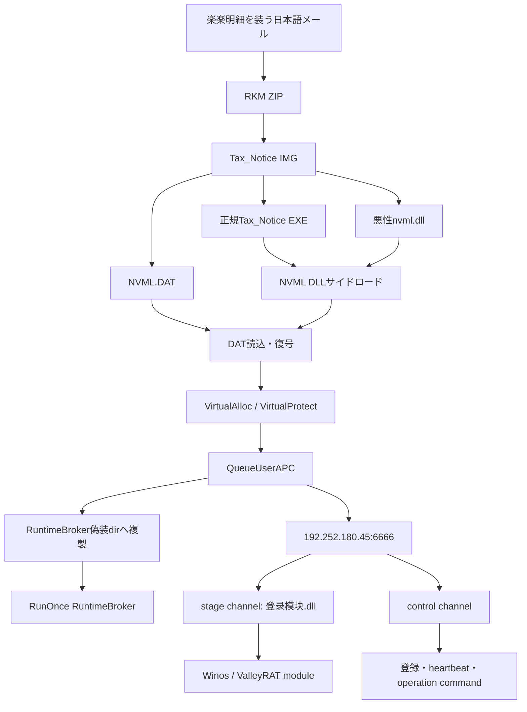

# 全体ロジック

```mermaid
flowchart TD
  A["楽楽明細を装う日本語メール"] --> B["RKM ZIP"]
  B --> C["Tax_Notice IMG"]
  C --> D["正規Tax_Notice EXE"]
  C --> E["悪性nvml.dll"]
  C --> F["NVML.DAT"]
  D --> G["NVML DLLサイドロード"]
  E --> G
  F --> H["DAT読込・復号"]
  G --> H
  H --> I["VirtualAlloc / VirtualProtect"]
  I --> J["QueueUserAPC"]
  J --> K["RuntimeBroker偽装dirへ複製"]
  K --> L["RunOnce RuntimeBroker"]
  J --> M["192.252.180.45:6666"]
  M --> N["stage channel: 登录模块.dll"]
  N --> O["Winos / ValleyRAT module"]
  M --> P["control channel"]
  P --> Q["登録・heartbeat・operation command"]
```

入口、DATローダー、永続化、stage、controlの関係を分離しています。stageとcontrolは同じendpoint／portですが、TCP streamとcommand roleで区別します。
