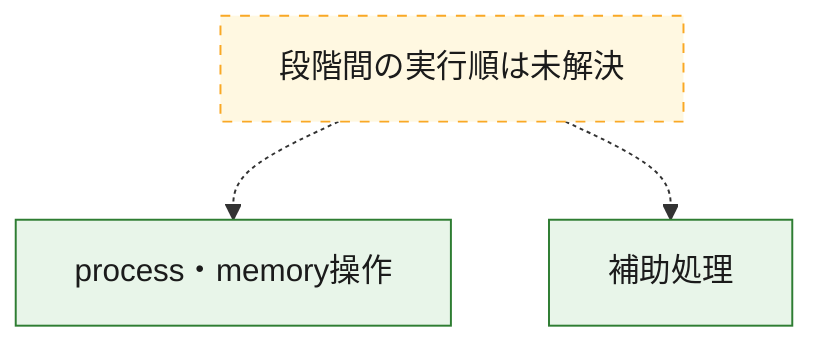
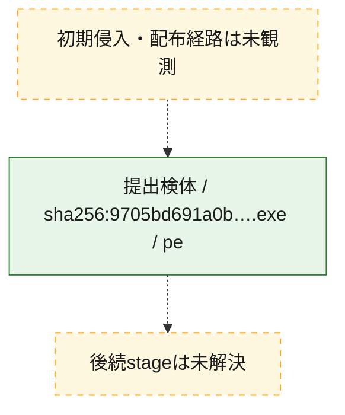
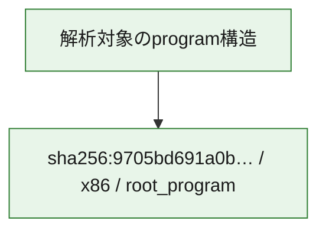

# 全体ロジック：9705bd691a0be1f2fdb19b72b12e25097c39ce9c2173c3d5e7b106b4e97fa548

代表関数の静的証跡から、process・memory操作の処理群を確認しました。

## 読み方

- phaseの掲載順は解析上の整理順です。observed_call_edgesがない段階間の実行順を断定しません。
- 図の実線は静的に観測した関係、点線と黄色のノードは未観測・未解決の関係を示します。
- 図は静的な要約であり、動的実行を再現するものではありません。
- 詳細な関数解説とfingerprintは[STATIC-LOGIC.md](STATIC-LOGIC.md)を参照してください。

## 静的可視化

### 実行フロー

### 感染チェーン

### モジュール関係

## 処理段階

### 1. process・memory操作

process、thread、module、memory操作と実行移行を確認します。
確度: `confirmed_static_function_evidence_with_limits`

- `9705bd691a0be1f2fdb19b72b12e25097c39ce9c2173c3d5e7b106b4e97fa548:ghidra:00404e10` — process、thread、module、またはmemory操作に関係する関数です。 状態: `limited_bad_instruction_or_flow`、選定理由: `meaningful_symbol_name`, `reviewed_call_centrality:1`, `role:process_or_memory_operation`

### 2. 補助処理

主要処理を支える一般内部関数またはlibrary処理を確認します。
確度: `confirmed_static_function_evidence_with_limits`

- `9705bd691a0be1f2fdb19b72b12e25097c39ce9c2173c3d5e7b106b4e97fa548:ghidra:00404ce0` — 検体内部の一般処理を実装する関数です。 状態: `limited_bad_instruction_or_flow`、選定理由: `meaningful_symbol_name`, `reviewed_call_centrality:1`
- `9705bd691a0be1f2fdb19b72b12e25097c39ce9c2173c3d5e7b106b4e97fa548:ghidra:00404e80` — 検体内部の一般処理を実装する関数です。 状態: `succeeded`、選定理由: `context_representative`, `reviewed_call_centrality:1`
- `9705bd691a0be1f2fdb19b72b12e25097c39ce9c2173c3d5e7b106b4e97fa548:ghidra:00404fd0` — 検体内部の一般処理を実装する関数です。 状態: `succeeded`、選定理由: `context_representative`, `reviewed_call_centrality:6`
- `9705bd691a0be1f2fdb19b72b12e25097c39ce9c2173c3d5e7b106b4e97fa548:ghidra:00405020` — 検体内部の一般処理を実装する関数です。 状態: `succeeded`、選定理由: `context_representative`, `reviewed_call_centrality:3`
- `9705bd691a0be1f2fdb19b72b12e25097c39ce9c2173c3d5e7b106b4e97fa548:ghidra:00405070` — 検体内部の一般処理を実装する関数です。 状態: `succeeded`、選定理由: `context_representative`, `reviewed_call_centrality:4`
- `9705bd691a0be1f2fdb19b72b12e25097c39ce9c2173c3d5e7b106b4e97fa548:ghidra:004050e0` — 検体内部の一般処理を実装する関数です。 状態: `succeeded`、選定理由: `context_representative`, `reviewed_call_centrality:4`
- `9705bd691a0be1f2fdb19b72b12e25097c39ce9c2173c3d5e7b106b4e97fa548:ghidra:00405180` — 検体内部の一般処理を実装する関数です。 状態: `succeeded`、選定理由: `context_representative`, `reviewed_call_centrality:3`
- `9705bd691a0be1f2fdb19b72b12e25097c39ce9c2173c3d5e7b106b4e97fa548:ghidra:00405220` — 検体内部の一般処理を実装する関数です。 状態: `succeeded`、選定理由: `context_representative`, `reviewed_call_centrality:5`
- `9705bd691a0be1f2fdb19b72b12e25097c39ce9c2173c3d5e7b106b4e97fa548:ghidra:00405270` — 検体内部の一般処理を実装する関数です。 状態: `succeeded`、選定理由: `context_representative`, `reviewed_call_centrality:3`
- `9705bd691a0be1f2fdb19b72b12e25097c39ce9c2173c3d5e7b106b4e97fa548:ghidra:00405300` — 検体内部の一般処理を実装する関数です。 状態: `succeeded`、選定理由: `context_representative`, `reviewed_call_centrality:4`
- `9705bd691a0be1f2fdb19b72b12e25097c39ce9c2173c3d5e7b106b4e97fa548:ghidra:004053c0` — 検体内部の一般処理を実装する関数です。 状態: `succeeded`、選定理由: `context_representative`, `reviewed_call_centrality:6`
- `9705bd691a0be1f2fdb19b72b12e25097c39ce9c2173c3d5e7b106b4e97fa548:ghidra:00405550` — 検体内部の一般処理を実装する関数です。 状態: `succeeded`、選定理由: `context_representative`, `reviewed_call_centrality:10`
- `9705bd691a0be1f2fdb19b72b12e25097c39ce9c2173c3d5e7b106b4e97fa548:ghidra:00405920` — 検体内部の一般処理を実装する関数です。 状態: `succeeded`、選定理由: `context_representative`, `reviewed_call_centrality:11`
- `9705bd691a0be1f2fdb19b72b12e25097c39ce9c2173c3d5e7b106b4e97fa548:ghidra:00405b40` — 検体内部の一般処理を実装する関数です。 状態: `succeeded`、選定理由: `context_representative`, `reviewed_call_centrality:7`
- `9705bd691a0be1f2fdb19b72b12e25097c39ce9c2173c3d5e7b106b4e97fa548:ghidra:00405eb0` — 検体内部の一般処理を実装する関数です。 状態: `succeeded`、選定理由: `context_representative`, `reviewed_call_centrality:2`
- `9705bd691a0be1f2fdb19b72b12e25097c39ce9c2173c3d5e7b106b4e97fa548:ghidra:00405f00` — 検体内部の一般処理を実装する関数です。 状態: `succeeded`、選定理由: `context_representative`, `reviewed_call_centrality:5`
- `9705bd691a0be1f2fdb19b72b12e25097c39ce9c2173c3d5e7b106b4e97fa548:ghidra:00405fe0` — 検体内部の一般処理を実装する関数です。 状態: `succeeded`、選定理由: `context_representative`, `reviewed_call_centrality:1`
- `9705bd691a0be1f2fdb19b72b12e25097c39ce9c2173c3d5e7b106b4e97fa548:ghidra:00406000` — 検体内部の一般処理を実装する関数です。 状態: `succeeded`、選定理由: `context_representative`, `reviewed_call_centrality:1`
- `9705bd691a0be1f2fdb19b72b12e25097c39ce9c2173c3d5e7b106b4e97fa548:ghidra:00406040` — 検体内部の一般処理を実装する関数です。 状態: `succeeded`、選定理由: `context_representative`, `reviewed_call_centrality:1`
- `9705bd691a0be1f2fdb19b72b12e25097c39ce9c2173c3d5e7b106b4e97fa548:ghidra:00406080` — 検体内部の一般処理を実装する関数です。 状態: `succeeded`、選定理由: `context_representative`, `reviewed_call_centrality:2`
- `9705bd691a0be1f2fdb19b72b12e25097c39ce9c2173c3d5e7b106b4e97fa548:ghidra:00406100` — 検体内部の一般処理を実装する関数です。 状態: `succeeded`、選定理由: `context_representative`, `reviewed_call_centrality:3`
- `9705bd691a0be1f2fdb19b72b12e25097c39ce9c2173c3d5e7b106b4e97fa548:ghidra:00406130` — 検体内部の一般処理を実装する関数です。 状態: `succeeded`、選定理由: `context_representative`, `reviewed_call_centrality:3`
- `9705bd691a0be1f2fdb19b72b12e25097c39ce9c2173c3d5e7b106b4e97fa548:ghidra:00406180` — 検体内部の一般処理を実装する関数です。 状態: `succeeded`、選定理由: `context_representative`, `reviewed_call_centrality:3`
- `9705bd691a0be1f2fdb19b72b12e25097c39ce9c2173c3d5e7b106b4e97fa548:ghidra:00406210` — 検体内部の一般処理を実装する関数です。 状態: `succeeded`、選定理由: `context_representative`, `reviewed_call_centrality:2`
- `9705bd691a0be1f2fdb19b72b12e25097c39ce9c2173c3d5e7b106b4e97fa548:ghidra:004062a0` — 検体内部の一般処理を実装する関数です。 状態: `succeeded`、選定理由: `context_representative`, `reviewed_call_centrality:2`
- `9705bd691a0be1f2fdb19b72b12e25097c39ce9c2173c3d5e7b106b4e97fa548:ghidra:004062e0` — 検体内部の一般処理を実装する関数です。 状態: `succeeded`、選定理由: `context_representative`, `reviewed_call_centrality:6`
- `9705bd691a0be1f2fdb19b72b12e25097c39ce9c2173c3d5e7b106b4e97fa548:ghidra:00406370` — 検体内部の一般処理を実装する関数です。 状態: `succeeded`、選定理由: `context_representative`, `reviewed_call_centrality:2`
- `9705bd691a0be1f2fdb19b72b12e25097c39ce9c2173c3d5e7b106b4e97fa548:ghidra:004063d0` — 検体内部の一般処理を実装する関数です。 状態: `succeeded`、選定理由: `context_representative`, `reviewed_call_centrality:3`
- `9705bd691a0be1f2fdb19b72b12e25097c39ce9c2173c3d5e7b106b4e97fa548:ghidra:00406470` — 検体内部の一般処理を実装する関数です。 状態: `succeeded`、選定理由: `context_representative`, `reviewed_call_centrality:4`
- `9705bd691a0be1f2fdb19b72b12e25097c39ce9c2173c3d5e7b106b4e97fa548:ghidra:00406660` — 検体内部の一般処理を実装する関数です。 状態: `succeeded`、選定理由: `context_representative`, `reviewed_call_centrality:10`
- `9705bd691a0be1f2fdb19b72b12e25097c39ce9c2173c3d5e7b106b4e97fa548:ghidra:00406b70` — 検体内部の一般処理を実装する関数です。 状態: `succeeded`、選定理由: `context_representative`

## 観測したcall関係

- 代表関数間で直接解決できた呼出関係はありません。

## 解析範囲と制約

- 選定外関数は全体inventoryへ残しますが、関数本体の個別解説対象にはしていません。
- indirect call、難読化、packer、VM、壊れたcontrol flowによりcall関係が欠落する場合があります。
- 文書は静的解析に基づき、検体実行や外部通信による動的確認は行っていません。
