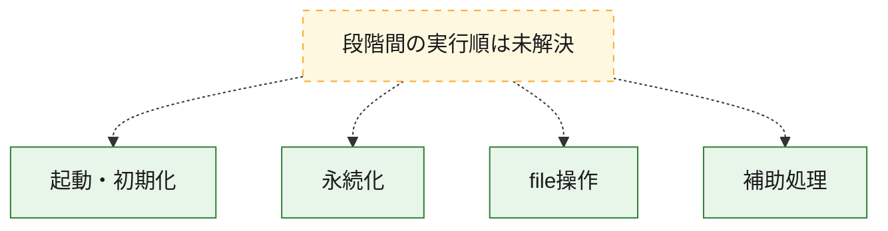
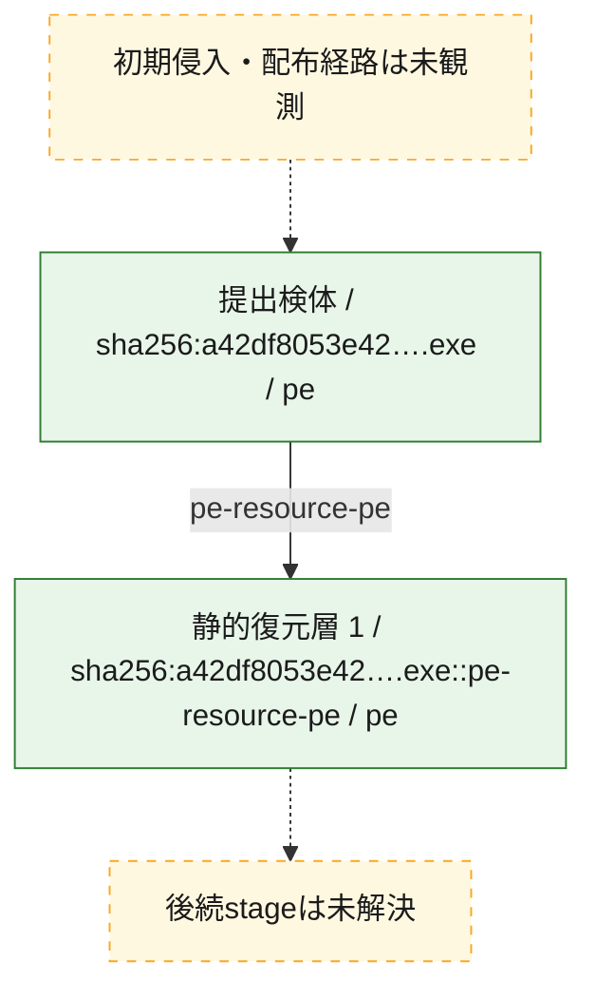
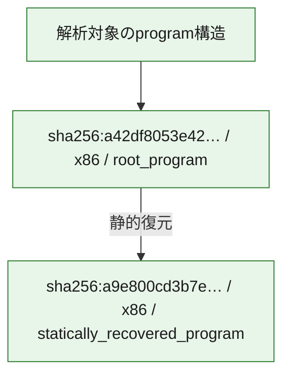

# 全体ロジック：a42df8053e42a3f98ce47aa8a0d130c0aa939d3dd9a8585011ddd665a8463fe0

代表関数の静的証跡から、起動・初期化、永続化、file操作の処理群を確認しました。

## 読み方

- phaseの掲載順は解析上の整理順です。observed_call_edgesがない段階間の実行順を断定しません。
- 図の実線は静的に観測した関係、点線と黄色のノードは未観測・未解決の関係を示します。
- 図は静的な要約であり、動的実行を再現するものではありません。
- 詳細な関数解説とfingerprintは[STATIC-LOGIC.md](STATIC-LOGIC.md)を参照してください。

## 静的可視化

### 実行フロー

### 感染チェーン

### モジュール関係

## 処理段階

### 1. 起動・初期化

entry pointから初期化と後続処理への移行を確認します。
確度: `confirmed_static_function_evidence`

- `a9e800cd3b7ec434b57a7a53ebf285e3b8fbf8949a1a951cd13cc2656632c561:ghidra:18001988c` — 初期化と主要処理への分岐を行う入口関数です。 状態: `succeeded`、選定理由: `entry_point`, `meaningful_symbol_name`, `reviewed_call_centrality:8`, `role:entrypoint`

### 2. 永続化

自動起動や永続化に関係する設定変更を確認します。
確度: `confirmed_static_function_evidence`

- `a9e800cd3b7ec434b57a7a53ebf285e3b8fbf8949a1a951cd13cc2656632c561:ghidra:1800180cc` — 自動起動または永続化に関係する処理を含む関数です。 状態: `succeeded`、選定理由: `entry_point`, `meaningful_symbol_name`, `reviewed_call_centrality:40`, `role:persistence`
- `a9e800cd3b7ec434b57a7a53ebf285e3b8fbf8949a1a951cd13cc2656632c561:ghidra:1800196d0` — 自動起動または永続化に関係する処理を含む関数です。 状態: `succeeded`、選定理由: `entry_point`, `meaningful_symbol_name`, `reviewed_call_centrality:13`, `role:persistence`

### 3. file操作

fileやdirectoryの作成、読書き、削除を確認します。
確度: `confirmed_static_function_evidence`

- `a9e800cd3b7ec434b57a7a53ebf285e3b8fbf8949a1a951cd13cc2656632c561:ghidra:180017604` — fileまたはdirectoryの読書き・管理に関係する関数です。 状態: `succeeded`、選定理由: `entry_point`, `meaningful_symbol_name`, `reviewed_call_centrality:4`, `role:file_operation`

### 4. 補助処理

主要処理を支える一般内部関数またはlibrary処理を確認します。
確度: `confirmed_static_function_evidence`

- `a9e800cd3b7ec434b57a7a53ebf285e3b8fbf8949a1a951cd13cc2656632c561:ghidra:180001000` — 検体内部の一般処理を実装する関数です。 状態: `succeeded`、選定理由: `context_representative`, `reviewed_call_centrality:2`
- `a9e800cd3b7ec434b57a7a53ebf285e3b8fbf8949a1a951cd13cc2656632c561:ghidra:180001090` — 検体内部の一般処理を実装する関数です。 状態: `succeeded`、選定理由: `context_representative`, `reviewed_call_centrality:2`
- `a9e800cd3b7ec434b57a7a53ebf285e3b8fbf8949a1a951cd13cc2656632c561:ghidra:1800010ac` — 検体内部の一般処理を実装する関数です。 状態: `succeeded`、選定理由: `context_representative`, `reviewed_call_centrality:2`
- `a9e800cd3b7ec434b57a7a53ebf285e3b8fbf8949a1a951cd13cc2656632c561:ghidra:1800010c8` — 検体内部の一般処理を実装する関数です。 状態: `succeeded`、選定理由: `context_representative`, `reviewed_call_centrality:2`
- `a9e800cd3b7ec434b57a7a53ebf285e3b8fbf8949a1a951cd13cc2656632c561:ghidra:1800010f0` — 検体内部の一般処理を実装する関数です。 状態: `succeeded`、選定理由: `context_representative`, `reviewed_call_centrality:2`
- `a9e800cd3b7ec434b57a7a53ebf285e3b8fbf8949a1a951cd13cc2656632c561:ghidra:180001120` — 検体内部の一般処理を実装する関数です。 状態: `succeeded`、選定理由: `context_representative`, `reviewed_call_centrality:11`
- `a9e800cd3b7ec434b57a7a53ebf285e3b8fbf8949a1a951cd13cc2656632c561:ghidra:180001238` — 検体内部の一般処理を実装する関数です。 状態: `succeeded`、選定理由: `context_representative`, `reviewed_call_centrality:2`
- `a9e800cd3b7ec434b57a7a53ebf285e3b8fbf8949a1a951cd13cc2656632c561:ghidra:180001268` — 検体内部の一般処理を実装する関数です。 状態: `succeeded`、選定理由: `context_representative`, `reviewed_call_centrality:2`
- `a9e800cd3b7ec434b57a7a53ebf285e3b8fbf8949a1a951cd13cc2656632c561:ghidra:18000129c` — 検体内部の一般処理を実装する関数です。 状態: `succeeded`、選定理由: `context_representative`, `reviewed_call_centrality:2`
- `a9e800cd3b7ec434b57a7a53ebf285e3b8fbf8949a1a951cd13cc2656632c561:ghidra:18000131c` — 検体内部の一般処理を実装する関数です。 状態: `succeeded`、選定理由: `context_representative`, `reviewed_call_centrality:2`
- `a9e800cd3b7ec434b57a7a53ebf285e3b8fbf8949a1a951cd13cc2656632c561:ghidra:18000133c` — 検体内部の一般処理を実装する関数です。 状態: `succeeded`、選定理由: `context_representative`, `reviewed_call_centrality:2`
- `a9e800cd3b7ec434b57a7a53ebf285e3b8fbf8949a1a951cd13cc2656632c561:ghidra:18000136c` — 検体内部の一般処理を実装する関数です。 状態: `succeeded`、選定理由: `context_representative`, `reviewed_call_centrality:3`
- `a9e800cd3b7ec434b57a7a53ebf285e3b8fbf8949a1a951cd13cc2656632c561:ghidra:1800013d4` — 検体内部の一般処理を実装する関数です。 状態: `succeeded`、選定理由: `context_representative`, `reviewed_call_centrality:2`
- `a9e800cd3b7ec434b57a7a53ebf285e3b8fbf8949a1a951cd13cc2656632c561:ghidra:1800013f4` — 検体内部の一般処理を実装する関数です。 状態: `succeeded`、選定理由: `context_representative`, `reviewed_call_centrality:2`
- `a9e800cd3b7ec434b57a7a53ebf285e3b8fbf8949a1a951cd13cc2656632c561:ghidra:180001424` — 検体内部の一般処理を実装する関数です。 状態: `succeeded`、選定理由: `context_representative`, `reviewed_call_centrality:3`
- `a9e800cd3b7ec434b57a7a53ebf285e3b8fbf8949a1a951cd13cc2656632c561:ghidra:180001454` — 検体内部の一般処理を実装する関数です。 状態: `succeeded`、選定理由: `context_representative`, `reviewed_call_centrality:2`
- `a9e800cd3b7ec434b57a7a53ebf285e3b8fbf8949a1a951cd13cc2656632c561:ghidra:180001484` — 検体内部の一般処理を実装する関数です。 状態: `succeeded`、選定理由: `context_representative`, `reviewed_call_centrality:4`
- `a9e800cd3b7ec434b57a7a53ebf285e3b8fbf8949a1a951cd13cc2656632c561:ghidra:18000150c` — 検体内部の一般処理を実装する関数です。 状態: `succeeded`、選定理由: `context_representative`, `reviewed_call_centrality:2`
- `a9e800cd3b7ec434b57a7a53ebf285e3b8fbf8949a1a951cd13cc2656632c561:ghidra:18000152c` — 検体内部の一般処理を実装する関数です。 状態: `succeeded`、選定理由: `context_representative`, `reviewed_call_centrality:2`
- `a9e800cd3b7ec434b57a7a53ebf285e3b8fbf8949a1a951cd13cc2656632c561:ghidra:18000155c` — 検体内部の一般処理を実装する関数です。 状態: `succeeded`、選定理由: `context_representative`, `reviewed_call_centrality:4`
- `a9e800cd3b7ec434b57a7a53ebf285e3b8fbf8949a1a951cd13cc2656632c561:ghidra:1800015f4` — 検体内部の一般処理を実装する関数です。 状態: `succeeded`、選定理由: `context_representative`, `reviewed_call_centrality:2`
- `a9e800cd3b7ec434b57a7a53ebf285e3b8fbf8949a1a951cd13cc2656632c561:ghidra:180001620` — 検体内部の一般処理を実装する関数です。 状態: `succeeded`、選定理由: `context_representative`, `reviewed_call_centrality:2`
- `a9e800cd3b7ec434b57a7a53ebf285e3b8fbf8949a1a951cd13cc2656632c561:ghidra:180001648` — 検体内部の一般処理を実装する関数です。 状態: `succeeded`、選定理由: `context_representative`, `reviewed_call_centrality:3`
- `a9e800cd3b7ec434b57a7a53ebf285e3b8fbf8949a1a951cd13cc2656632c561:ghidra:180001698` — 検体内部の一般処理を実装する関数です。 状態: `succeeded`、選定理由: `context_representative`, `reviewed_call_centrality:2`
- `a9e800cd3b7ec434b57a7a53ebf285e3b8fbf8949a1a951cd13cc2656632c561:ghidra:1800016f8` — 検体内部の一般処理を実装する関数です。 状態: `succeeded`、選定理由: `context_representative`, `reviewed_call_centrality:5`
- `a9e800cd3b7ec434b57a7a53ebf285e3b8fbf8949a1a951cd13cc2656632c561:ghidra:180001780` — 検体内部の一般処理を実装する関数です。 状態: `succeeded`、選定理由: `context_representative`, `reviewed_call_centrality:5`
- `a9e800cd3b7ec434b57a7a53ebf285e3b8fbf8949a1a951cd13cc2656632c561:ghidra:18000c938` — 検体内部の一般処理を実装する関数です。 状態: `succeeded`、選定理由: `entry_point`, `meaningful_symbol_name`, `reviewed_call_centrality:2`
- `a9e800cd3b7ec434b57a7a53ebf285e3b8fbf8949a1a951cd13cc2656632c561:ghidra:18001a064` — 検体内部の一般処理を実装する関数です。 状態: `succeeded`、選定理由: `meaningful_symbol_name`
- `a42df8053e42a3f98ce47aa8a0d130c0aa939d3dd9a8585011ddd665a8463fe0:ghidra:140001060` — 検体内部の一般処理を実装する関数です。 状態: `succeeded`、選定理由: `context_representative`, `reviewed_call_centrality:2`
- `a42df8053e42a3f98ce47aa8a0d130c0aa939d3dd9a8585011ddd665a8463fe0:ghidra:14000107c` — 検体内部の一般処理を実装する関数です。 状態: `succeeded`、選定理由: `context_representative`, `reviewed_call_centrality:2`
- `a42df8053e42a3f98ce47aa8a0d130c0aa939d3dd9a8585011ddd665a8463fe0:ghidra:140001098` — 検体内部の一般処理を実装する関数です。 状態: `succeeded`、選定理由: `context_representative`, `reviewed_call_centrality:2`
- `a42df8053e42a3f98ce47aa8a0d130c0aa939d3dd9a8585011ddd665a8463fe0:ghidra:140001114` — 検体内部の一般処理を実装する関数です。 状態: `succeeded`、選定理由: `context_representative`, `reviewed_call_centrality:2`
- `a42df8053e42a3f98ce47aa8a0d130c0aa939d3dd9a8585011ddd665a8463fe0:ghidra:14000113c` — 検体内部の一般処理を実装する関数です。 状態: `succeeded`、選定理由: `context_representative`, `reviewed_call_centrality:2`
- `a42df8053e42a3f98ce47aa8a0d130c0aa939d3dd9a8585011ddd665a8463fe0:ghidra:14000116c` — 検体内部の一般処理を実装する関数です。 状態: `succeeded`、選定理由: `context_representative`, `reviewed_call_centrality:4`
- `a42df8053e42a3f98ce47aa8a0d130c0aa939d3dd9a8585011ddd665a8463fe0:ghidra:140001204` — 検体内部の一般処理を実装する関数です。 状態: `succeeded`、選定理由: `context_representative`, `reviewed_call_centrality:2`
- `a42df8053e42a3f98ce47aa8a0d130c0aa939d3dd9a8585011ddd665a8463fe0:ghidra:140001224` — 検体内部の一般処理を実装する関数です。 状態: `succeeded`、選定理由: `context_representative`, `reviewed_call_centrality:2`
- `a42df8053e42a3f98ce47aa8a0d130c0aa939d3dd9a8585011ddd665a8463fe0:ghidra:1400012a4` — 検体内部の一般処理を実装する関数です。 状態: `succeeded`、選定理由: `context_representative`, `reviewed_call_centrality:2`
- `a42df8053e42a3f98ce47aa8a0d130c0aa939d3dd9a8585011ddd665a8463fe0:ghidra:1400012c4` — 検体内部の一般処理を実装する関数です。 状態: `succeeded`、選定理由: `context_representative`, `reviewed_call_centrality:2`
- `a42df8053e42a3f98ce47aa8a0d130c0aa939d3dd9a8585011ddd665a8463fe0:ghidra:1400012f4` — 検体内部の一般処理を実装する関数です。 状態: `succeeded`、選定理由: `context_representative`, `reviewed_call_centrality:3`
- `a42df8053e42a3f98ce47aa8a0d130c0aa939d3dd9a8585011ddd665a8463fe0:ghidra:140001324` — 検体内部の一般処理を実装する関数です。 状態: `succeeded`、選定理由: `context_representative`, `reviewed_call_centrality:2`
- `a42df8053e42a3f98ce47aa8a0d130c0aa939d3dd9a8585011ddd665a8463fe0:ghidra:140001354` — 検体内部の一般処理を実装する関数です。 状態: `succeeded`、選定理由: `context_representative`, `reviewed_call_centrality:4`
- `a42df8053e42a3f98ce47aa8a0d130c0aa939d3dd9a8585011ddd665a8463fe0:ghidra:1400013dc` — 検体内部の一般処理を実装する関数です。 状態: `succeeded`、選定理由: `context_representative`, `reviewed_call_centrality:2`
- `a42df8053e42a3f98ce47aa8a0d130c0aa939d3dd9a8585011ddd665a8463fe0:ghidra:140001434` — 検体内部の一般処理を実装する関数です。 状態: `succeeded`、選定理由: `context_representative`, `reviewed_call_centrality:2`
- `a42df8053e42a3f98ce47aa8a0d130c0aa939d3dd9a8585011ddd665a8463fe0:ghidra:140001454` — 検体内部の一般処理を実装する関数です。 状態: `succeeded`、選定理由: `context_representative`, `reviewed_call_centrality:2`
- `a42df8053e42a3f98ce47aa8a0d130c0aa939d3dd9a8585011ddd665a8463fe0:ghidra:140001484` — 検体内部の一般処理を実装する関数です。 状態: `succeeded`、選定理由: `context_representative`, `reviewed_call_centrality:3`
- `a42df8053e42a3f98ce47aa8a0d130c0aa939d3dd9a8585011ddd665a8463fe0:ghidra:1400014b4` — 検体内部の一般処理を実装する関数です。 状態: `succeeded`、選定理由: `context_representative`, `reviewed_call_centrality:2`
- `a42df8053e42a3f98ce47aa8a0d130c0aa939d3dd9a8585011ddd665a8463fe0:ghidra:1400014e0` — 検体内部の一般処理を実装する関数です。 状態: `succeeded`、選定理由: `context_representative`, `reviewed_call_centrality:2`
- `a42df8053e42a3f98ce47aa8a0d130c0aa939d3dd9a8585011ddd665a8463fe0:ghidra:140001528` — 検体内部の一般処理を実装する関数です。 状態: `succeeded`、選定理由: `context_representative`, `reviewed_call_centrality:3`
- `a42df8053e42a3f98ce47aa8a0d130c0aa939d3dd9a8585011ddd665a8463fe0:ghidra:14000156c` — 検体内部の一般処理を実装する関数です。 状態: `succeeded`、選定理由: `context_representative`, `reviewed_call_centrality:2`
- `a42df8053e42a3f98ce47aa8a0d130c0aa939d3dd9a8585011ddd665a8463fe0:ghidra:1400015a8` — 検体内部の一般処理を実装する関数です。 状態: `succeeded`、選定理由: `context_representative`, `reviewed_call_centrality:2`
- `a42df8053e42a3f98ce47aa8a0d130c0aa939d3dd9a8585011ddd665a8463fe0:ghidra:14000161c` — 検体内部の一般処理を実装する関数です。 状態: `succeeded`、選定理由: `context_representative`, `reviewed_call_centrality:2`
- `a42df8053e42a3f98ce47aa8a0d130c0aa939d3dd9a8585011ddd665a8463fe0:ghidra:140001678` — 検体内部の一般処理を実装する関数です。 状態: `succeeded`、選定理由: `context_representative`, `reviewed_call_centrality:2`
- `a42df8053e42a3f98ce47aa8a0d130c0aa939d3dd9a8585011ddd665a8463fe0:ghidra:1400016ac` — 検体内部の一般処理を実装する関数です。 状態: `succeeded`、選定理由: `context_representative`, `reviewed_call_centrality:2`
- `a42df8053e42a3f98ce47aa8a0d130c0aa939d3dd9a8585011ddd665a8463fe0:ghidra:1400016d4` — 検体内部の一般処理を実装する関数です。 状態: `succeeded`、選定理由: `context_representative`, `reviewed_call_centrality:2`
- `a42df8053e42a3f98ce47aa8a0d130c0aa939d3dd9a8585011ddd665a8463fe0:ghidra:140001710` — 検体内部の一般処理を実装する関数です。 状態: `succeeded`、選定理由: `context_representative`, `reviewed_call_centrality:2`
- `a42df8053e42a3f98ce47aa8a0d130c0aa939d3dd9a8585011ddd665a8463fe0:ghidra:140001738` — 検体内部の一般処理を実装する関数です。 状態: `succeeded`、選定理由: `context_representative`, `reviewed_call_centrality:2`
- `a42df8053e42a3f98ce47aa8a0d130c0aa939d3dd9a8585011ddd665a8463fe0:ghidra:140001780` — 検体内部の一般処理を実装する関数です。 状態: `succeeded`、選定理由: `context_representative`, `reviewed_call_centrality:3`
- `a42df8053e42a3f98ce47aa8a0d130c0aa939d3dd9a8585011ddd665a8463fe0:ghidra:1400017a0` — 検体内部の一般処理を実装する関数です。 状態: `succeeded`、選定理由: `context_representative`, `reviewed_call_centrality:1`
- `a42df8053e42a3f98ce47aa8a0d130c0aa939d3dd9a8585011ddd665a8463fe0:ghidra:1400017c4` — 検体内部の一般処理を実装する関数です。 状態: `succeeded`、選定理由: `context_representative`, `reviewed_call_centrality:2`
- `a42df8053e42a3f98ce47aa8a0d130c0aa939d3dd9a8585011ddd665a8463fe0:ghidra:1400017f0` — 検体内部の一般処理を実装する関数です。 状態: `succeeded`、選定理由: `context_representative`, `reviewed_call_centrality:2`

## 観測したcall関係

- 代表関数間で直接解決できた呼出関係はありません。

## 解析範囲と制約

- 選定外関数は全体inventoryへ残しますが、関数本体の個別解説対象にはしていません。
- indirect call、難読化、packer、VM、壊れたcontrol flowによりcall関係が欠落する場合があります。
- 文書は静的解析に基づき、検体実行や外部通信による動的確認は行っていません。
